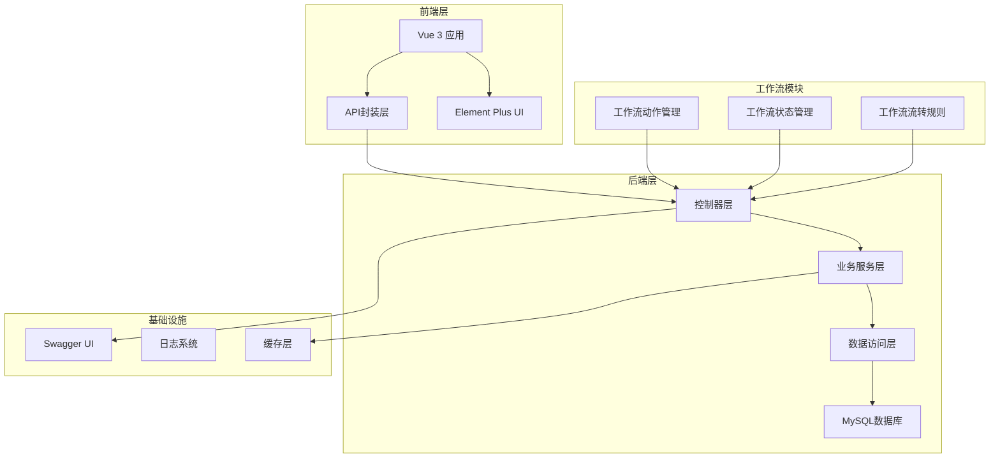

# API接口文档

<cite>
**本文档引用的文件**
- [README.md](file://README.md)
- [FormControlController.java](file://genetics-server/src/main/java/com/genetics/controller/FormControlController.java)
- [FormTemplateController.java](file://genetics-server/src/main/java/com/genetics/controller/FormTemplateController.java)
- [FormInstanceController.java](file://genetics-server/src/main/java/com/genetics/controller/FormInstanceController.java)
- [BasicDataController.java](file://genetics-server/src/main/java/com/genetics/controller/BasicDataController.java)
- [WorkflowActionController.java](file://genetics-server/src/main/java/com/genetics/controller/WorkflowActionController.java)
- [FormControlDTO.java](file://genetics-server/src/main/java/com/genetics/dto/FormControlDTO.java)
- [FormTemplateDTO.java](file://genetics-server/src/main/java/com/genetics/dto/FormTemplateDTO.java)
- [FormInstanceCreateDTO.java](file://genetics-server/src/main/java/com/genetics/dto/FormInstanceCreateDTO.java)
- [FormInstanceSaveDTO.java](file://genetics-server/src/main/java/com/genetics/dto/FormInstanceSaveDTO.java)
- [WorkflowTransitionRequestDTO.java](file://genetics-server/src/main/java/com/genetics/dto/WorkflowTransitionRequestDTO.java)
- [CountryCode.java](file://genetics-server/src/main/java/com/genetics/enums/CountryCode.java)
- [ControlType.java](file://genetics-server/src/main/java/com/genetics/enums/ControlType.java)
- [InstanceStatus.java](file://genetics-server/src/main/java/com/genetics/enums/InstanceStatus.java)
- [OrderStatus.java](file://genetics-server/src/main/java/com/genetics/enums/OrderStatus.java)
- [WorkflowAction.java](file://genetics-server/src/main/java/com/genetics/entity/workflow/WorkflowAction.java)
- [WorkflowState.java](file://genetics-server/src/main/java/com/genetics/entity/workflow/WorkflowState.java)
- [WorkflowTransition.java](file://genetics-server/src/main/java/com/genetics/entity/workflow/WorkflowTransition.java)
- [WorkflowActionConstants.java](file://genetics-server/src/main/java/com/genetics/common/constants/WorkflowActionConstants.java)
- [WorkflowActionInitializer.java](file://genetics-server/src/main/java/com/genetics/config/WorkflowActionInitializer.java)
- [WorkflowActionService.java](file://genetics-server/src/main/java/com/genetics/service/WorkflowActionService.java)
- [application.yml](file://genetics-server/src/main/resources/application.yml)
- [formControl.js](file://genetics-web/src/api/formControl.js)
- [formTemplate.js](file://genetics-web/src/api/formTemplate.js)
- [formInstance.js](file://genetics-web/src/api/formInstance.js)
- [basic.js](file://genetics-web/src/api/basic.js)
- [workflowAction.js](file://genetics-web/src/api/workflowAction.js)
- [workflowActions.js](file://genetics-web/src/constants/workflowActions.js)
- [006-add-workflow-action.sql](file://genetics-server/src/main/resources/db/changelog/sql/006-add-workflow-action.sql)
- [004-add-workflow-config.sql](file://genetics-server/src/main/resources/db/changelog/sql/004-add-workflow-config.sql)
</cite>

## 更新摘要
**所做更改**
- 新增工作流动作管理API模块的完整接口文档
- 新增工作流状态和流转规则的数据结构说明
- 更新工作流初始化器和常量定义的详细说明
- 完善工作流相关的数据库表结构和迁移脚本说明
- 增强API测试指南中关于工作流功能的测试建议

## 目录
1. [简介](#简介)
2. [项目概述](#项目概述)
3. [技术架构](#技术架构)
4. [API接口总览](#api接口总览)
5. [自定义控件API](#自定义控件api)
6. [服务单模板API](#服务单模板api)
7. [服务单实例API](#服务单实例api)
8. [基础数据API](#基础数据api)
9. [工作流动作管理API](#工作流动作管理api)
10. [工作流状态与流转API](#工作流状态与流转api)
11. [API测试指南](#api测试指南)
12. [常见问题解答](#常见问题解答)
13. [性能优化建议](#性能优化建议)
14. [安全注意事项](#安全注意事项)

## 简介
VAT&EPR动态表单系统是一个基于Spring Boot 3.2 + Vue 3的企业级动态表单管理系统，专为增值税(VAT)和环境报告(EPR)业务场景设计。系统支持自定义控件、拖拽式表单设计、服务单全生命周期管理和多国家多语言支持，现已集成完整的工作流管理功能。

## 项目概述
本系统采用前后端分离架构，后端使用Spring Boot 3.2和MyBatis-Plus，前端使用Vue 3 + Element Plus，提供完整的表单设计、实例管理、数据转换和工作流管理功能。

**技术特性**
- 支持7种控件类型：输入框、文本域、数字输入、下拉框、开关、日期选择、文件上传
- 拖拽式表单设计器，支持1-4列布局
- 多国家支持：DEU(德国)、FRA(法国)、ITA(意大利)、ESP(西班牙)、POL(波兰)、CZE(捷克)、GBR(英国)
- 完整的服务单状态管理：草稿、已提交、已审核、待提交、待审核、待递交、已完成、已驳回、已终止
- **新增**：完整的工作流动作管理，支持9种预定义工作流动作
- **新增**：灵活的状态流转规则配置，支持条件化工作流执行

## 技术架构
系统采用现代化的技术栈，确保高性能和可扩展性，现已集成工作流管理模块。



**章节来源**
- [README.md:5-17](file://README.md#L5-L17)
- [application.yml:33-40](file://genetics-server/src/main/resources/application.yml#L33-L40)

## API接口总览
系统提供五个主要模块的RESTful API接口，所有接口均遵循统一的响应格式。

**统一响应格式**
```json
{
  "code": 0,
  "message": "操作成功",
  "data": {}
}
```

**接口前缀映射**
- 自定义控件：`/api/form-control`
- 服务单模板：`/api/form-template`
- 服务单实例：`/api/form-instance`
- 基础数据：`/api/basic`
- **新增** 工作流动作：`/api/workflow/actions`

**章节来源**
- [README.md:140-147](file://README.md#L140-L147)

## 自定义控件API

### 接口概览
自定义控件管理接口用于创建、查询、更新和删除表单控件定义，支持7种控件类型和丰富的配置选项。

### 控件类型枚举
| 类型代码 | 描述 | 适用场景 |
|---------|------|----------|
| INPUT | 输入框 | 文本输入、用户名、邮箱等 |
| TEXTAREA | 多行文本 | 备注、描述、详细说明 |
| NUMBER | 数字输入 | 金额、数量、百分比 |
| SELECT | 下拉框 | 单选、多选、分类选择 |
| SWITCH | 开关 | 是/否、启用/禁用 |
| DATE | 日期选择 | 生日、截止日期、工作日期 |
| UPLOAD | 文件上传 | 附件、证明材料、扫描件 |

### 控件配置参数
控件配置采用JSON字符串格式存储，支持以下配置项：

**基础配置**
- controlName：控件显示名称
- controlKey：唯一标识符，格式为`ClassName.fieldName`
- controlType：控件类型（INPUT/TEXTAREA/NUMBER/SELECT/SWITCH/DATE/UPLOAD）
- placeholder：占位符文本
- tips：帮助提示信息
- required：是否必填
- sort：排序权重
- enabled：是否启用

**验证规则**
- regexPattern：正则表达式
- regexMessage：验证失败提示
- minLength：最小长度
- maxLength：最大长度

**特殊配置**
- selectOptions：下拉选项配置（JSON字符串）
- uploadConfig：上传配置（JSON字符串）
- defaultValue：默认值

### 接口详情

#### 创建控件
**请求方法**：POST  
**请求URL**：`/api/form-control`  
**请求头**：`Content-Type: application/json`  
**请求体参数**：
```json
{
  "controlName": "公司名称",
  "controlKey": "Company.companyName",
  "controlType": "INPUT",
  "placeholder": "请输入公司名称",
  "tips": "请输入有效的公司名称",
  "required": true,
  "regexPattern": "^[\\u4e00-\\u9fa5a-zA-Z0-9]{2,50}$",
  "regexMessage": "公司名称格式不正确",
  "minLength": 2,
  "maxLength": 50,
  "selectOptions": "[{\"label\":\"选项1\",\"value\":\"1\"}]",
  "uploadConfig": "{\"maxSize\":10485760,\"allowedTypes\":[\"jpg\",\"png\"]}",
  "defaultValue": "",
  "sort": 1,
  "enabled": true
}
```

**响应示例**：
```json
{
  "code": 0,
  "message": "操作成功",
  "data": {
    "id": 1
  }
}
```

**状态码**：
- 200：创建成功
- 400：参数验证失败
- 500：服务器内部错误

**章节来源**
- [FormControlController.java:25-29](file://genetics-server/src/main/java/com/genetics/controller/FormControlController.java#L25-L29)
- [FormControlDTO.java:10-44](file://genetics-server/src/main/java/com/genetics/dto/FormControlDTO.java#L10-L44)

#### 查询控件列表
**请求方法**：GET  
**请求URL**：`/api/form-control/list`  
**查询参数**：
- page：页码，默认1
- size：每页条数，默认20
- controlType：控件类型（可选）
- keyword：关键词搜索（可选）

**响应示例**：
```json
{
  "code": 0,
  "message": "操作成功",
  "data": {
    "total": 100,
    "records": [
      {
        "id": 1,
        "controlName": "公司名称",
        "controlKey": "Company.companyName",
        "controlType": "INPUT",
        "required": true,
        "sort": 1,
        "enabled": true
      }
    ]
  }
}
```

**章节来源**
- [FormControlController.java:48-55](file://genetics-server/src/main/java/com/genetics/controller/FormControlController.java#L48-L55)

#### 更新控件
**请求方法**：PUT  
**请求URL**：`/api/form-control/{id}`  
**路径参数**：
- id：控件ID

**请求体参数**：同创建控件接口

**章节来源**
- [FormControlController.java:31-35](file://genetics-server/src/main/java/com/genetics/controller/FormControlController.java#L31-L35)

#### 删除控件
**请求方法**：DELETE  
**请求URL**：`/api/form-control/{id}`  
**路径参数**：
- id：控件ID

**章节来源**
- [FormControlController.java:37-41](file://genetics-server/src/main/java/com/genetics/controller/FormControlController.java#L37-L41)

#### 获取控件详情
**请求方法**：GET  
**请求URL**：`/api/form-control/{id}`  
**路径参数**：
- id：控件ID

**章节来源**
- [FormControlController.java:43-46](file://genetics-server/src/main/java/com/genetics/controller/FormControlController.java#L43-L46)

#### 获取所有控件
**请求方法**：GET  
**请求URL**：`/api/form-control/all`

**章节来源**
- [FormControlController.java:57-60](file://genetics-server/src/main/java/com/genetics/controller/FormControlController.java#L57-L60)

## 服务单模板API

### 接口概览
服务单模板管理接口用于设计和管理服务单模板，支持拖拽式表单设计器、版本管理和发布流程，现已支持工作流配置。

### 模板配置参数
模板配置包含元信息、JSON Schema布局信息和工作流配置：

**元信息配置**
- templateName：模板名称
- version：版本号，默认"1.0.0"
- countryCode：国家代码
- serviceCodeL1/L2/L3：服务类别三级编码
- status：模板状态（草稿/已发布）
- remark：备注说明

**JSON Schema配置**
模板通过JSON Schema定义表单布局，包含：
- layout：布局配置
- columns：列数配置
- rows：行配置和控件信息

**工作流配置**
- workflow_config：JSON格式的工作流配置，定义状态流转规则和动作关联

### 接口详情

#### 创建/保存模板
**请求方法**：POST  
**请求URL**：`/api/form-template`  
**请求体参数**：
```json
{
  "templateName": "VAT申报模板",
  "version": "1.0.0",
  "countryCode": "DEU",
  "serviceCodeL1": "VAT",
  "serviceCodeL2": "IMPORT",
  "serviceCodeL3": "STANDARD",
  "jsonSchema": {
    "layout": "grid",
    "columns": 2,
    "rows": [
      {
        "controls": [
          {
            "controlKey": "Company.companyName",
            "colSpan": 2
          }
        ]
      }
    ]
  },
  "workflow_config": {
    "states": [
      {
        "code": 10,
        "name": "待提交",
        "type": "initial",
        "tagType": "info"
      }
    ],
    "transitions": [
      {
        "from": 10,
        "to": 20,
        "action": "submit",
        "actionName": "提交"
      }
    ]
  },
  "status": 0,
  "remark": "标准VAT申报模板"
}
```

**响应示例**：
```json
{
  "code": 0,
  "message": "操作成功",
  "data": {
    "id": 1
  }
}
```

**章节来源**
- [FormTemplateController.java:25-29](file://genetics-server/src/main/java/com/genetics/controller/FormTemplateController.java#L25-L29)
- [FormTemplateDTO.java:10-36](file://genetics-server/src/main/java/com/genetics/dto/FormTemplateDTO.java#L10-L36)

#### 查询模板列表
**请求方法**：GET  
**请求URL**：`/api/form-template/list`  
**查询参数**：
- page：页码，默认1
- size：每页条数，默认20
- countryCode：国家代码（可选）
- serviceCodeL3：三级服务代码（可选）

**章节来源**
- [FormTemplateController.java:54-61](file://genetics-server/src/main/java/com/genetics/controller/FormTemplateController.java#L54-L61)

#### 获取模板详情
**请求方法**：GET  
**请求URL**：`/api/form-template/{id}`  
**路径参数**：
- id：模板ID

**响应示例**：
```json
{
  "code": 0,
  "message": "操作成功",
  "data": {
    "id": 1,
    "templateName": "VAT申报模板",
    "version": "1.0.0",
    "countryCode": "DEU",
    "serviceCodeL1": "VAT",
    "serviceCodeL2": "IMPORT",
    "serviceCodeL3": "STANDARD",
    "jsonSchema": {},
    "workflow_config": {},
    "status": 0,
    "remark": "标准VAT申报模板",
    "controlDetails": []
  }
```

**章节来源**
- [FormTemplateController.java:49-52](file://genetics-server/src/main/java/com/genetics/controller/FormTemplateController.java#L49-L52)

#### 更新模板
**请求方法**：PUT  
**请求URL**：`/api/form-template/{id}`  
**路径参数**：
- id：模板ID

**请求体参数**：同创建模板

**章节来源**
- [FormTemplateController.java:31-35](file://genetics-server/src/main/java/com/genetics/controller/FormTemplateController.java#L31-L35)

#### 发布模板
**请求方法**：POST  
**请求URL**：`/api/form-template/{id}/publish`  
**路径参数**：
- id：模板ID

**章节来源**
- [FormTemplateController.java:37-41](file://genetics-server/src/main/java/com/genetics/controller/FormTemplateController.java#L37-L41)

#### 删除模板
**请求方法**：DELETE  
**请求URL**：`/api/form-template/{id}`  
**路径参数**：
- id：模板ID

**章节来源**
- [FormTemplateController.java:43-47](file://genetics-server/src/main/java/com/genetics/controller/FormTemplateController.java#L43-L47)

## 服务单实例API

### 接口概览
服务单实例接口用于根据模板创建服务单实例、保存草稿、提交实例并管理业务状态流转，现已集成工作流操作功能。

### 业务状态枚举
系统支持完整的业务状态管理：

| 状态代码 | 名称 | 前端标签类型 | 描述 |
|---------|------|-------------|------|
| 10 | 待提交 | info | 等待用户提交 |
| 20 | 待审核 | warning | 等待审核人员处理 |
| 30 | 待递交 | warning | 等待递交相关部门 |
| 31 | 组织处理 | primary | 组织内部处理中 |
| 32 | 税局处理 | primary | 税务部门处理中 |
| 33 | 当地同事处理 | primary | 当地同事处理中 |
| 40 | 已完成 | success | 业务处理完成 |
| 50 | 已驳回 | danger | 业务被驳回 |
| 99 | 已终止 | danger | 业务终止 |

### 实例数据结构
服务单实例包含以下核心数据：

**基础信息**
- templateId：模板ID
- status：实例状态（草稿/已提交/已审核）
- orderStatusId：业务状态ID

**业务数据**
- formData：表单数据（Map<controlKey, value>）
- orderStatusId：当前业务状态
- serviceStartTime：服务开始时间
- serviceEndTime：服务结束时间

### 接口详情

#### 创建服务单实例
**请求方法**：POST  
**请求URL**：`/api/form-instance/create`  
**请求体参数**：
```json
{
  "templateId": 1
}
```

**响应示例**：
```json
{
  "code": 0,
  "message": "操作成功",
  "data": {
    "instanceId": 1,
    "templateInfo": {
      "templateName": "VAT申报模板",
      "version": "1.0.0",
      "countryCode": "DEU",
      "serviceCodeL3": "STANDARD"
    },
    "jsonSchema": {},
    "controlDetails": [],
    "formData": {}
  }
}
```

**章节来源**
- [FormInstanceController.java:33-36](file://genetics-server/src/main/java/com/genetics/controller/FormInstanceController.java#L33-L36)
- [FormInstanceCreateDTO.java:12-16](file://genetics-server/src/main/java/com/genetics/dto/FormInstanceCreateDTO.java#L12-L16)

#### 保存服务单草稿
**请求方法**：PUT  
**请求URL**：`/api/form-instance/{id}/save`  
**路径参数**：
- id：实例ID

**请求体参数**：
```json
{
  "formData": {
    "Company.companyName": "测试公司",
    "Company.legalPerson": "张三"
  },
  "orderStatusId": 10,
  "serviceStartTime": "2024-01-01 09:00:00",
  "serviceEndTime": "2024-01-01 17:00:00"
}
```

**章节来源**
- [FormInstanceController.java:41-45](file://genetics-server/src/main/java/com/genetics/controller/FormInstanceController.java#L41-L45)
- [FormInstanceSaveDTO.java:13-29](file://genetics-server/src/main/java/com/genetics/dto/FormInstanceSaveDTO.java#L13-L29)

#### 更新业务状态
**请求方法**：PUT  
**请求URL**：`/api/form-instance/{id}/order-status`  
**路径参数**：
- id：实例ID

**查询参数**：
- orderStatusId：业务状态ID

**章节来源**
- [FormInstanceController.java:50-55](file://genetics-server/src/main/java/com/genetics/controller/FormInstanceController.java#L50-L55)

#### 提交服务单
**请求方法**：POST  
**请求URL**：`/api/form-instance/{id}/submit`  
**路径参数**：
- id：实例ID

**响应示例**：
```json
{
  "code": 0,
  "message": "操作成功",
  "data": {
    "Company": {
      "companyName": "测试公司",
      "legalPerson": "张三"
    },
    "CompanyLegalPerson": {
      "companyLegalName": "张三"
    }
  }
}
```

**数据转换说明**：提交时将formData按controlKey中的ClassName进行分组，通过反射转换为对应的业务实体对象。

**章节来源**
- [FormInstanceController.java:60-64](file://genetics-server/src/main/java/com/genetics/controller/FormInstanceController.java#L60-L64)

#### 获取服务单详情
**请求方法**：GET  
**请求URL**：`/api/form-instance/{id}`  
**路径参数**：
- id：实例ID

**章节来源**
- [FormInstanceController.java:69-72](file://genetics-server/src/main/java/com/genetics/controller/FormInstanceController.java#L69-L72)

#### 查询服务单列表
**请求方法**：GET  
**请求URL**：`/api/form-instance/list`  
**查询参数**：
- page：页码，默认1
- size：每页条数，默认20
- status：实例状态（可选）
- orderStatusId：业务状态ID（可选）

**章节来源**
- [FormInstanceController.java:77-84](file://genetics-server/src/main/java/com/genetics/controller/FormInstanceController.java#L77-L84)

#### 获取业务状态选项
**请求方法**：GET  
**请求URL**：`/api/form-instance/order-status/options`

**响应示例**：
```json
{
  "code": 0,
  "message": "操作成功",
  "data": [
    {
      "code": 10,
      "name": "待提交",
      "tagType": "info"
    },
    {
      "code": 20,
      "name": "待审核",
      "tagType": "warning"
    }
  ]
}
```

**章节来源**
- [FormInstanceController.java:89-99](file://genetics-server/src/main/java/com/genetics/controller/FormInstanceController.java#L89-L99)

## 基础数据API

### 接口概览
基础数据接口提供系统所需的枚举数据和配置信息，包括支持的国家列表等。

### 国家代码枚举
系统支持以下7个国家的业务：

| 代码 | 中文名称 | 英文名称 |
|-----|----------|----------|
| DEU | 德国 | Germany |
| FRA | 法国 | France |
| ITA | 意大利 | Italy |
| ESP | 西班牙 | Spain |
| POL | 波兰 | Poland |
| CZE | 捷克 | Czech Republic |
| GBR | 英国 | United Kingdom |

### 接口详情

#### 获取支持的国家列表
**请求方法**：GET  
**请求URL**：`/api/basic/countries`

**响应示例**：
```json
{
  "code": 0,
  "message": "操作成功",
  "data": [
    {
      "code": "DEU",
      "nameCn": "德国",
      "nameEn": "Germany"
    },
    {
      "code": "FRA",
      "nameCn": "法国",
      "nameEn": "France"
    }
  ]
}
```

**章节来源**
- [BasicDataController.java:26-36](file://genetics-server/src/main/java/com/genetics/controller/BasicDataController.java#L26-L36)
- [CountryCode.java:9-34](file://genetics-server/src/main/java/com/genetics/enums/CountryCode.java#L9-L34)

## 工作流动作管理API

### 接口概览
工作流动作管理API用于管理系统中可用的工作流动作定义，支持增删改查和排序管理。

### 工作流动作实体结构
工作流动作定义包含以下核心字段：

**基本信息**
- id：主键ID
- actionCode：动作编码（如 submit, auditPass）
- actionName：动作显示名称（如 提交, 审核通过）
- icon：动作图标（Ionicons名称）
- buttonType：按钮类型（primary, info, success, warning, error）

**交互配置**
- needRemark：是否默认需要填写备注
- remarkPlaceholder：备注框提示语
- sort：排序权重
- description：动作描述

**系统字段**
- createTime：创建时间
- updateTime：更新时间
- deleted：逻辑删除标记

### 预定义工作流动作
系统内置9种预定义工作流动作，通过CommandLineRunner自动初始化：

| 动作编码 | 显示名称 | 图标 | 按钮类型 | 需要备注 | 排序权重 |
|---------|----------|------|----------|----------|----------|
| submit | 提交 | CloudUploadOutline | primary | 否 | 10 |
| auditPass | 审核通过 | CheckmarkCircleOutline | success | 否 | 20 |
| auditReject | 审核驳回 | CloseCircleOutline | error | 是 | 30 |
| resubmit | 重新提交 | RefreshOutline | primary | 否 | 40 |
| submitLocal | 递交当地同事 | PeopleOutline | info | 否 | 50 |
| submitTax | 递交税局 | BusinessOutline | info | 否 | 60 |
| submitOrg | 递交组织 | FileTrayFullOutline | info | 否 | 70 |
| complete | 完成 | CheckmarkDoneOutline | success | 否 | 80 |
| terminate | 终止 | StopCircleOutline | error | 是 | 90 |

### 接口详情

#### 获取工作流动作列表
**请求方法**：GET  
**请求URL**：`/api/workflow/actions/list`

**响应示例**：
```json
{
  "code": 0,
  "message": "操作成功",
  "data": [
    {
      "id": 1,
      "actionCode": "submit",
      "actionName": "提交",
      "icon": "CloudUploadOutline",
      "buttonType": "primary",
      "needRemark": false,
      "remarkPlaceholder": null,
      "sort": 10,
      "description": null,
      "createTime": "2024-01-01 10:00:00",
      "updateTime": "2024-01-01 10:00:00",
      "deleted": 0
    }
  ]
}
```

**章节来源**
- [WorkflowActionController.java:18-21](file://genetics-server/src/main/java/com/genetics/controller/WorkflowActionController.java#L18-L21)
- [WorkflowAction.java:10-65](file://genetics-server/src/main/java/com/genetics/entity/workflow/WorkflowAction.java#L10-L65)

#### 保存工作流动作
**请求方法**：POST  
**请求URL**：`/api/workflow/actions`  
**请求头**：`Content-Type: application/json`  
**请求体参数**：
```json
{
  "actionCode": "customAction",
  "actionName": "自定义动作",
  "icon": "StarOutline",
  "buttonType": "warning",
  "needRemark": true,
  "remarkPlaceholder": "请输入自定义备注",
  "sort": 100,
  "description": "自定义工作流动作描述"
}
```

**响应示例**：
```json
{
  "code": 0,
  "message": "操作成功",
  "data": true
}
```

**章节来源**
- [WorkflowActionController.java:23-26](file://genetics-server/src/main/java/com/genetics/controller/WorkflowActionController.java#L23-L26)
- [WorkflowActionService.java:7-12](file://genetics-server/src/main/java/com/genetics/service/WorkflowActionService.java#L7-L12)

#### 删除工作流动作
**请求方法**：DELETE  
**请求URL**：`/api/workflow/actions/{id}`  
**路径参数**：
- id：动作ID

**响应示例**：
```json
{
  "code": 0,
  "message": "操作成功",
  "data": true
}
```

**章节来源**
- [WorkflowActionController.java:28-31](file://genetics-server/src/main/java/com/genetics/controller/WorkflowActionController.java#L28-L31)

## 工作流状态与流转API

### 工作流状态定义
工作流状态是服务单业务状态的抽象表示，包含以下字段：

**状态标识**
- code：状态编码（对应业务状态ID）
- name：状态名称
- type：状态类型
  - initial：初始状态
  - process：处理中状态
  - final：终态
  - exception：异常态
  - terminal：终止态

**前端展示**
- tagType：标签类型（用于前端颜色标识）

### 工作流流转规则
工作流流转规则定义了状态之间的转换关系，包含以下关键字段：

**流转关系**
- from：起始状态编码（ServeState的id）
- to：目标状态编码
- action：操作编码（关联WorkflowAction.actionCode）
- actionName：操作名称

**交互要求**
- needRemark：是否需要填写备注/原因
- formSchema：动作关联的表单配置（JSON Schema）

**条件限制**
- condition：适用条件（VAT/EPR/null，null表示都适用）

### 工作流执行请求
执行状态流转时使用以下请求结构：

**请求参数**
- action：操作编码（如 submit, auditPass, auditReject）
- remark：备注/原因
- actionFormData：动作触发时填写的额外表单数据（Map格式）

**章节来源**
- [WorkflowState.java:8-31](file://genetics-server/src/main/java/com/genetics/entity/workflow/WorkflowState.java#L8-L31)
- [WorkflowTransition.java:8-46](file://genetics-server/src/main/java/com/genetics/entity/workflow/WorkflowTransition.java#L8-L46)
- [WorkflowTransitionRequestDTO.java:9-26](file://genetics-server/src/main/java/com/genetics/dto/WorkflowTransitionRequestDTO.java#L9-L26)

## API测试指南

### Swagger UI访问
系统集成Swagger UI，提供完整的API文档和在线测试功能。

**访问地址**：`http://localhost:8080/swagger-ui.html`

**功能特性**：
- 在线API文档浏览
- 参数测试和调试
- 响应结果预览
- 认证令牌管理

### Postman测试集合
推荐使用Postman进行API测试，包含以下集合：

1. **自定义控件测试**：包含所有控件管理接口的测试用例
2. **模板管理测试**：包含模板创建、更新、发布的完整流程
3. **实例管理测试**：包含服务单从创建到提交的全流程测试
4. **基础数据测试**：包含国家代码等枚举数据的查询测试
5. **工作流动作测试**：包含工作流动作的增删改查完整流程

### 前端API封装
前端提供了完整的API封装，便于JavaScript调用：

**控件API封装**：
```javascript
// 创建控件
await createControl(data)

// 更新控件
await updateControl(id, data)

// 删除控件
await deleteControl(id)

// 获取控件列表
await listControls(params)

// 获取所有控件
await listAllControls()
```

**模板API封装**：
```javascript
// 创建模板
await createTemplate(data)

// 发布模板
await publishTemplate(id)

// 获取模板详情
await getTemplate(id)

// 获取模板列表
await listTemplates(params)
```

**实例API封装**：
```javascript
// 创建实例
await createInstance(data)

// 保存草稿
await saveInstance(id, data)

// 提交实例
await submitInstance(id)

// 获取实例列表
await listInstances(params)

// 获取状态选项
await getOrderStatusOptions()
```

**基础数据API封装**：
```javascript
// 获取国家列表
await getCountries()
```

**工作流动作API封装**：
```javascript
// 获取动作列表
await listWorkflowActions()

// 保存动作
await saveWorkflowAction(data)

// 删除动作
await deleteWorkflowAction(id)
```

**章节来源**
- [README.md:77-78](file://README.md#L77-L78)
- [formControl.js:1-9](file://genetics-web/src/api/formControl.js#L1-L9)
- [formTemplate.js:1-9](file://genetics-web/src/api/formTemplate.js#L1-L9)
- [formInstance.js:1-11](file://genetics-web/src/api/formInstance.js#L1-L11)
- [basic.js:1-4](file://genetics-web/src/api/basic.js#L1-L4)
- [workflowAction.js:1-24](file://genetics-web/src/api/workflowAction.js#L1-L24)

## 常见问题解答

### 控件Key格式要求
**问题**：controlKey必须满足什么格式？
**答案**：controlKey必须满足`ClassName.fieldName`格式，例如`Company.companyName`。这是为了确保表单数据能够正确映射到对应的业务实体。

**问题**：如何处理控件Key重复的问题？
**答案**：系统会在数据库层面保证controlKey的唯一性。如果出现重复，会返回相应的错误信息。建议在设计控件时遵循统一的命名规范。

### 模板发布后的限制
**问题**：模板发布后还能修改吗？
**答案**：模板发布后，其JSON Schema配置将被锁定，不能直接修改。如果需要修改，应该创建新版本并重新发布。

**问题**：如何正确处理版本升级？
**答案**：当需要修改已发布模板时，应该：
1. 将模板状态改为草稿
2. 修改模板内容
3. 更新版本号
4. 重新发布

### 表单数据转换问题
**问题**：提交时表单数据是如何转换的？
**答案**：系统通过FormDataConverter将formData按controlKey中的ClassName进行分组，然后通过反射创建对应的业务实体对象。例如：
```json
{"Company.companyName": "测试公司"} 
→ 
{"Company": {"companyName": "测试公司"}}
```

**问题**：如何处理转换失败的情况？
**答案**：如果转换失败，通常是因为：
1. ClassName未在CLASS_REGISTRY中注册
2. 字段类型不匹配
3. 必填字段缺失

### 文件上传处理
**问题**：文件上传控件如何工作？
**答案**：文件上传控件提交时，value字段包含文件URL列表。建议配合专业的文件存储服务（如OSS、MinIO）使用，前端负责文件上传，后端只存储文件URL。

### 并发控制问题
**问题**：如何防止并发覆盖？
**答案**：系统采用乐观锁机制，通过version字段防止并发覆盖。当多个用户同时修改同一服务单实例时，系统会自动检测并阻止冲突。

### 工作流动作管理问题
**问题**：如何自定义工作流动作？
**答案**：可以通过POST /api/workflow/actions接口创建自定义动作，或修改现有动作的配置。系统会自动处理动作的排序和显示。

**问题**：工作流动作初始化失败怎么办？
**答案**：系统通过CommandLineRunner自动初始化预定义动作。如果初始化失败，检查数据库连接和表结构是否正确。

## 性能优化建议

### 数据库优化
1. **索引优化**：为常用查询字段建立合适的索引
   - 模板查询：countryCode + serviceCodeL3 组合索引
   - 控件查询：controlType + enabled 组合索引
   - **新增** 工作流动作：actionCode唯一索引

2. **分页查询**：所有列表接口都支持分页，建议合理设置每页大小

3. **缓存策略**：
   - 控件列表：缓存1小时
   - 国家代码：缓存永久
   - 模板详情：缓存5分钟
   - **新增** 工作流动作：缓存1小时

### 接口优化
1. **批量操作**：对于频繁的控件查询，使用`/api/form-control/all`接口获取所有控件

2. **条件查询**：在查询模板列表时，尽量提供countryCode和serviceCodeL3参数

3. **数据压缩**：对于大型JSON Schema，考虑启用GZIP压缩

4. **** 工作流动作查询：使用`/api/workflow/actions/list`接口获取排序后的动作列表

### 前端优化
1. **懒加载**：模板设计器采用懒加载，减少初始加载时间

2. **虚拟滚动**：列表组件使用虚拟滚动，提升大数据量下的性能

3. **防抖处理**：搜索和筛选操作添加防抖，避免频繁请求

4. **** 工作流动作选择：前端缓存动作列表，减少重复请求

## 安全注意事项

### 认证授权
1. **接口保护**：所有接口都应添加适当的认证和授权机制
2. **权限控制**：不同用户角色应有不同的操作权限
3. **CSRF防护**：启用CSRF防护机制

### 数据安全
1. **输入验证**：所有用户输入都必须经过严格的验证
2. **SQL注入防护**：使用MyBatis-Plus的参数绑定机制
3. **XSS防护**：对用户输入内容进行HTML转义

### 文件安全
1. **文件类型检查**：严格限制允许的文件类型
2. **文件大小限制**：设置合理的文件大小上限
3. **病毒扫描**：对上传文件进行病毒扫描

### 工作流安全
1. **动作权限控制**：不同用户角色只能执行允许的工作流动作
2. **备注验证**：对于需要备注的动作，必须填写有效备注
3. **状态验证**：确保状态流转的合法性和顺序性

### 日志监控
1. **操作日志**：记录所有重要操作的日志
2. **异常监控**：监控系统异常和错误
3. **性能监控**：监控接口响应时间和数据库性能

**章节来源**
- [application.yml:33-40](file://genetics-server/src/main/resources/application.yml#L33-L40)
- [README.md:77-78](file://README.md#L77-L78)
- [WorkflowActionInitializer.java:21-52](file://genetics-server/src/main/java/com/genetics/config/WorkflowActionInitializer.java#L21-L52)
- [006-add-workflow-action.sql:5-20](file://genetics-server/src/main/resources/db/changelog/sql/006-add-workflow-action.sql#L5-L20)