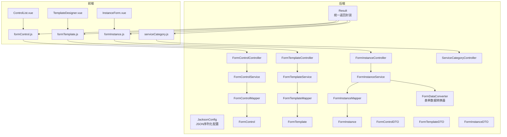
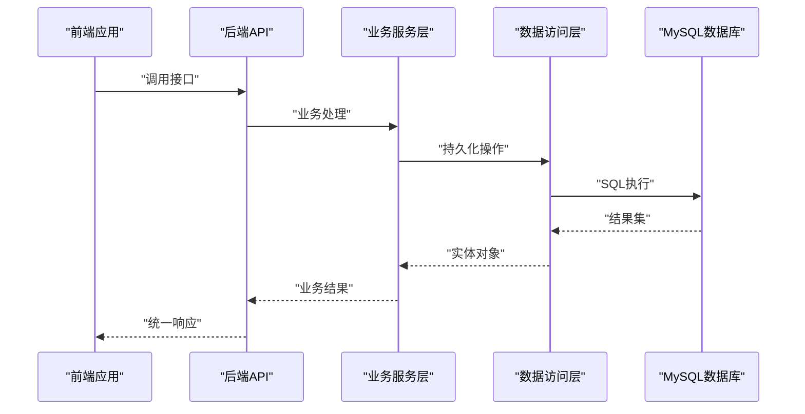
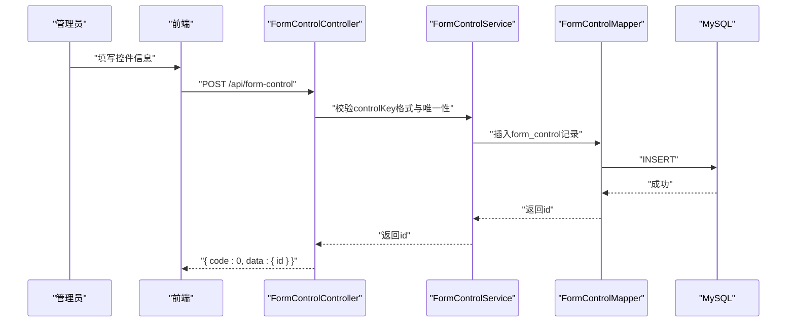
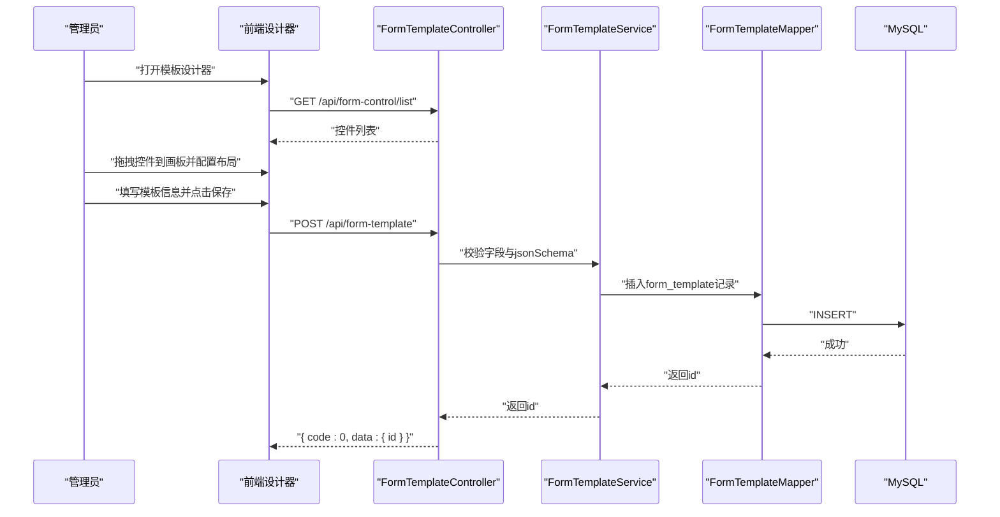
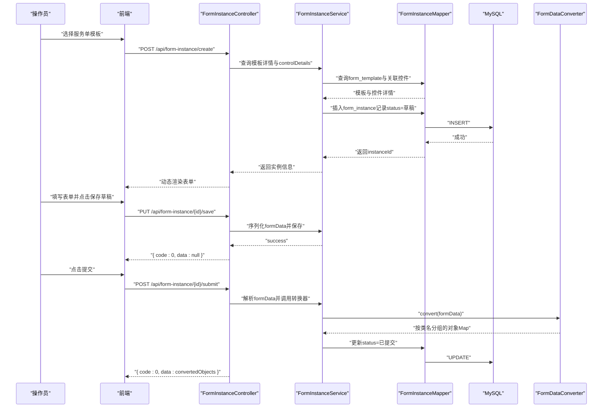
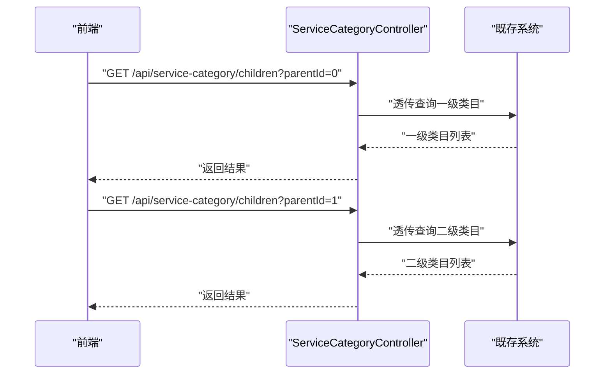
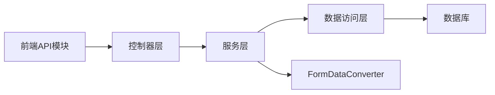

# API接口文档

<cite>
**本文档引用的文件**
- [VAT_EPR_动态表单技术方案.md](file://VAT_EPR_动态表单技术方案.md)
</cite>

## 目录
1. [简介](#简介)
2. [项目结构](#项目结构)
3. [核心组件](#核心组件)
4. [架构总览](#架构总览)
5. [详细组件分析](#详细组件分析)
6. [依赖关系分析](#依赖关系分析)
7. [性能考量](#性能考量)
8. [故障排除指南](#故障排除指南)
9. [结论](#结论)
10. [附录](#附录)

## 简介
本文件为VAT&EPR动态表单系统的完整API接口文档，涵盖以下四类接口：
- 自定义控件API：用于管理表单控件定义（创建、查询、更新、删除）
- 服务单模板API：用于设计与管理服务单模板（创建/保存、查询列表、查询详情、更新、发布）
- 服务单实例API：用于创建、保存草稿、提交服务单实例
- 服务类目API：用于查询服务类目的三级联动数据

文档提供每类接口的HTTP方法、URL模式、请求参数、响应格式、状态码说明、错误处理、请求与响应示例以及使用场景，并对安全性、认证与限流策略进行说明，最后提供API测试指南与常见问题解决方案。

## 项目结构
后端采用Spring Boot + MyBatis-Plus架构，按功能模块划分控制器、服务、映射器、实体与通用返回封装等层次。前端采用Vue 3 + Element Plus，提供动态表单渲染、模板设计器与服务单实例填写界面。

图表来源
- [VAT_EPR_动态表单技术方案.md:776-813](file://VAT_EPR_动态表单技术方案.md#L776-L813)
- [VAT_EPR_动态表单技术方案.md:815-852](file://VAT_EPR_动态表单技术方案.md#L815-L852)

章节来源
- [VAT_EPR_动态表单技术方案.md:776-813](file://VAT_EPR_动态表单技术方案.md#L776-L813)
- [VAT_EPR_动态表单技术方案.md:815-852](file://VAT_EPR_动态表单技术方案.md#L815-L852)

## 核心组件
- 统一返回封装：Result，统一返回结构包含code、message与data字段，便于前后端约定一致的响应格式。
- 表单数据转换器：FormDataConverter，负责将Map<controlKey, value>按类名分组并通过反射转换为业务实体对象。
- 数据模型：FormControl、FormTemplate、FormInstance分别对应自定义控件、服务单模板与服务单实例的持久化实体。

章节来源
- [VAT_EPR_动态表单技术方案.md:789-809](file://VAT_EPR_动态表单技术方案.md#L789-L809)
- [VAT_EPR_动态表单技术方案.md:594-684](file://VAT_EPR_动态表单技术方案.md#L594-L684)

## 架构总览
系统采用前后端分离架构，后端提供RESTful API，前端通过Axios调用接口，动态渲染表单并完成服务单的创建、填写与提交。

图表来源
- [VAT_EPR_动态表单技术方案.md:776-813](file://VAT_EPR_动态表单技术方案.md#L776-L813)

## 详细组件分析

### 自定义控件API
- 接口范围：用于管理表单控件定义，支持创建、查询列表、更新与删除。
- URL前缀：/api/form-control
- 认证与权限：未在方案中明确声明，建议结合项目现有安全机制或新增基于角色的访问控制。
- 限流策略：未在方案中明确声明，建议针对高频接口设置限流，防止滥用。

接口清单与说明
- 创建控件
  - 方法：POST
  - URL：/api/form-control
  - 请求体字段：controlName、controlKey、controlType、placeholder、tips、required、regexPattern、regexMessage、minLength、maxLength、selectOptions（JSON）、uploadConfig（JSON）、defaultValue、sort、enabled
  - 响应：Result，data包含新建控件的id
  - 使用场景：在模板设计器中新增控件定义，供模板引用
  - 错误处理：controlKey需满足“ClassName.fieldName”格式且唯一；必填字段缺失或格式不合法时返回错误
  - 请求示例路径：[VAT_EPR_动态表单技术方案.md:171-196](file://VAT_EPR_动态表单技术方案.md#L171-L196)
  - 响应示例路径：[VAT_EPR_动态表单技术方案.md:190-196](file://VAT_EPR_动态表单技术方案.md#L190-L196)

- 查询控件列表
  - 方法：GET
  - URL：/api/form-control/list
  - 查询参数：controlType（可选）、keyword（可选）、page、size
  - 响应：Result，data包含total与records
  - 使用场景：模板设计器左侧控件面板加载可用控件
  - 请求示例路径：[VAT_EPR_动态表单技术方案.md:198-211](file://VAT_EPR_动态表单技术方案.md#L198-L211)

- 更新控件
  - 方法：PUT
  - URL：/api/form-control/{id}
  - 请求体字段：同创建控件（除id外）
  - 使用场景：修改控件属性或禁用控件
  - 请求示例路径：[VAT_EPR_动态表单技术方案.md:213-216](file://VAT_EPR_动态表单技术方案.md#L213-L216)

- 删除控件
  - 方法：DELETE
  - URL：/api/form-control/{id}
  - 使用场景：清理不再使用的控件定义
  - 请求示例路径：[VAT_EPR_动态表单技术方案.md:218-221](file://VAT_EPR_动态表单技术方案.md#L218-L221)

图表来源
- [VAT_EPR_动态表单技术方案.md:169-221](file://VAT_EPR_动态表单技术方案.md#L169-L221)

章节来源
- [VAT_EPR_动态表单技术方案.md:169-221](file://VAT_EPR_动态表单技术方案.md#L169-L221)

### 服务单模板API
- 接口范围：用于设计与管理服务单模板，支持创建/保存、查询列表、查询详情、更新与发布。
- URL前缀：/api/form-template
- 认证与权限：未在方案中明确声明，建议结合项目现有安全机制或新增基于角色的访问控制。
- 限流策略：未在方案中明确声明，建议针对模板发布等关键操作设置限流。

接口清单与说明
- 创建/保存模板
  - 方法：POST
  - URL：/api/form-template
  - 请求体字段：templateName、version、countryCode、serviceCodeL1、serviceCodeL2、serviceCodeL3、jsonSchema（含layout、columns、rows）、status
  - 响应：Result，data包含新建模板的id
  - 使用场景：在模板设计器中完成布局与控件配置后保存
  - 注意事项：模板发布后jsonSchema不可修改，需通过升级版本规避数据错乱
  - 请求示例路径：[VAT_EPR_动态表单技术方案.md:227-254](file://VAT_EPR_动态表单技术方案.md#L227-L254)
  - 响应示例路径：[VAT_EPR_动态表单技术方案.md:248-254](file://VAT_EPR_动态表单技术方案.md#L248-L254)

- 查询模板列表
  - 方法：GET
  - URL：/api/form-template/list
  - 查询参数：countryCode、serviceCodeL3、page、size
  - 响应：Result，data包含total与records
  - 使用场景：后台管理中筛选与浏览模板
  - 请求示例路径：[VAT_EPR_动态表单技术方案.md:256-259](file://VAT_EPR_动态表单技术方案.md#L256-L259)

- 查询模板详情
  - 方法：GET
  - URL：/api/form-template/{id}
  - 响应：Result，data包含模板基础信息与controlDetails（控件详情）
  - 使用场景：渲染模板设计器或预览模板
  - 请求示例路径：[VAT_EPR_动态表单技术方案.md:261-292](file://VAT_EPR_动态表单技术方案.md#L261-L292)

- 更新模板
  - 方法：PUT
  - URL：/api/form-template/{id}
  - 请求体字段：同创建/保存模板（除id外）
  - 使用场景：修改模板元信息或调整布局
  - 请求示例路径：[VAT_EPR_动态表单技术方案.md:294-297](file://VAT_EPR_动态表单技术方案.md#L294-L297)

- 发布模板
  - 方法：POST
  - URL：/api/form-template/{id}/publish
  - 使用场景：将草稿模板发布为可被实例化的正式模板
  - 请求示例路径：[VAT_EPR_动态表单技术方案.md:299-302](file://VAT_EPR_动态表单技术方案.md#L299-L302)

图表来源
- [VAT_EPR_动态表单技术方案.md:415-435](file://VAT_EPR_动态表单技术方案.md#L415-L435)

章节来源
- [VAT_EPR_动态表单技术方案.md:225-303](file://VAT_EPR_动态表单技术方案.md#L225-L303)

### 服务单实例API
- 接口范围：用于根据模板创建服务单实例、保存草稿、提交实例并触发数据转换。
- URL前缀：/api/form-instance
- 认证与权限：未在方案中明确声明，建议结合项目现有安全机制或新增基于角色的访问控制。
- 限流策略：未在方案中明确声明，建议针对提交等关键操作设置限流。

接口清单与说明
- 根据模板创建服务单实例
  - 方法：POST
  - URL：/api/form-instance/create
  - 请求体字段：templateId
  - 响应：Result，data包含instanceId、模板信息、jsonSchema、controlDetails与空的formData
  - 使用场景：操作员选择模板后初始化实例，前端据此动态渲染表单
  - 请求示例路径：[VAT_EPR_动态表单技术方案.md:308-334](file://VAT_EPR_动态表单技术方案.md#L308-L334)
  - 响应示例路径：[VAT_EPR_动态表单技术方案.md:318-334](file://VAT_EPR_动态表单技术方案.md#L318-L334)

- 保存服务单数据（草稿）
  - 方法：PUT
  - URL：/api/form-instance/{id}/save
  - 请求体字段：formData（Map<controlKey, value>）
  - 响应：Result，data为null
  - 使用场景：用户填写过程中临时保存草稿
  - 请求示例路径：[VAT_EPR_动态表单技术方案.md:336-357](file://VAT_EPR_动态表单技术方案.md#L336-L357)

- 提交服务单
  - 方法：POST
  - URL：/api/form-instance/{id}/submit
  - 响应：Result，data为按类名分组的对象Map（由FormDataConverter转换）
  - 使用场景：用户确认无误后提交，触发数据转换与状态更新
  - 请求示例路径：[VAT_EPR_动态表单技术方案.md:359-380](file://VAT_EPR_动态表单技术方案.md#L359-L380)

- 查询服务单实例列表
  - 方法：GET
  - URL：/api/form-instance/list
  - 查询参数：status、page、size
  - 响应：Result，data包含total与records
  - 使用场景：后台管理中筛选与浏览实例
  - 请求示例路径：[VAT_EPR_动态表单技术方案.md:382-386](file://VAT_EPR_动态表单技术方案.md#L382-L386)

图表来源
- [VAT_EPR_动态表单技术方案.md:437-478](file://VAT_EPR_动态表单技术方案.md#L437-L478)
- [VAT_EPR_动态表单技术方案.md:705-728](file://VAT_EPR_动态表单技术方案.md#L705-L728)

章节来源
- [VAT_EPR_动态表单技术方案.md:306-386](file://VAT_EPR_动态表单技术方案.md#L306-L386)
- [VAT_EPR_动态表单技术方案.md:705-728](file://VAT_EPR_动态表单技术方案.md#L705-L728)

### 服务类目API（透传既存系统）
- 接口范围：用于查询服务类目的三级联动数据，透传既存系统。
- URL前缀：/api/service-category
- 认证与权限：未在方案中明确声明，建议结合项目现有安全机制或新增基于角色的访问控制。
- 限流策略：未在方案中明确声明，建议针对高频查询设置限流。

接口清单与说明
- 查询子类目
  - 方法：GET
  - URL：/api/service-category/children
  - 查询参数：parentId（一级为0，二级为一级id，三级为二级id）
  - 响应：Result，data为类目列表
  - 使用场景：前端实现服务类目的三级联动选择
  - 请求示例路径：[VAT_EPR_动态表单技术方案.md:389-395](file://VAT_EPR_动态表单技术方案.md#L389-L395)

图表来源
- [VAT_EPR_动态表单技术方案.md:389-395](file://VAT_EPR_动态表单技术方案.md#L389-L395)

章节来源
- [VAT_EPR_动态表单技术方案.md:389-395](file://VAT_EPR_动态表单技术方案.md#L389-L395)

## 依赖关系分析
- 控制器依赖服务层，服务层依赖映射器，映射器访问数据库。
- 服务单实例提交时依赖FormDataConverter进行数据转换。
- 前端通过Axios调用后端API，动态渲染表单与模板设计器。

图表来源
- [VAT_EPR_动态表单技术方案.md:776-813](file://VAT_EPR_动态表单技术方案.md#L776-L813)
- [VAT_EPR_动态表单技术方案.md:594-684](file://VAT_EPR_动态表单技术方案.md#L594-L684)

章节来源
- [VAT_EPR_动态表单技术方案.md:776-813](file://VAT_EPR_动态表单技术方案.md#L776-L813)
- [VAT_EPR_动态表单技术方案.md:594-684](file://VAT_EPR_动态表单技术方案.md#L594-L684)

## 性能考量
- 数据库索引：模板查询使用countryCode与serviceCodeL3组合条件，建议建立复合索引以提升查询性能。
- 缓存策略：对频繁访问的控件列表与类目数据可引入缓存，降低数据库压力。
- 分页查询：列表接口均支持分页参数，建议合理设置分页大小，避免一次性返回过多数据。
- 并发控制：同一服务单实例的保存操作需加乐观锁（version字段），防止并发覆盖。
- 文件上传：Upload类型控件提交时value为文件URL列表，建议配合文件服务（如OSS/MinIO）使用，前端上传与后端存储分离。

章节来源
- [VAT_EPR_动态表单技术方案.md:868-869](file://VAT_EPR_动态表单技术方案.md#L868-L869)

## 故障排除指南
- controlKey格式错误：必须满足“ClassName.fieldName”，否则校验失败。
- controlKey重复：数据库唯一索引保证唯一性，重复会报错。
- 模板发布后不可修改：jsonSchema发布后不可变更，需升级版本。
- 实体类未注册：FormDataConverter中的CLASS_REGISTRY需注册新增业务实体，否则转换失败。
- 文件上传异常：value为文件URL列表，需确保文件服务正常运行。
- 数据安全：form_data存储JSON时应过滤敏感字段；提交后状态变更为已提交，禁止再次修改。
- 并发覆盖：同一服务单实例保存需加乐观锁（version字段）。

章节来源
- [VAT_EPR_动态表单技术方案.md:856-869](file://VAT_EPR_动态表单技术方案.md#L856-L869)

## 结论
本API文档覆盖了VAT&EPR动态表单系统的核心接口，明确了各接口的HTTP方法、URL模式、请求参数、响应格式、状态码与错误处理，并提供了时序图与使用场景说明。建议在生产环境中完善认证与限流策略，优化数据库索引与缓存，确保数据安全与高并发下的稳定性。

## 附录
- 统一响应结构：Result，包含code、message与data字段，便于前后端约定一致的响应格式。
- 数据模型：FormControl、FormTemplate、FormInstance分别对应自定义控件、服务单模板与服务单实例的持久化实体。
- 表单数据转换：FormDataConverter负责将Map<controlKey, value>按类名分组并通过反射转换为业务实体对象。

章节来源
- [VAT_EPR_动态表单技术方案.md:789-809](file://VAT_EPR_动态表单技术方案.md#L789-L809)
- [VAT_EPR_动态表单技术方案.md:594-684](file://VAT_EPR_动态表单技术方案.md#L594-L684)