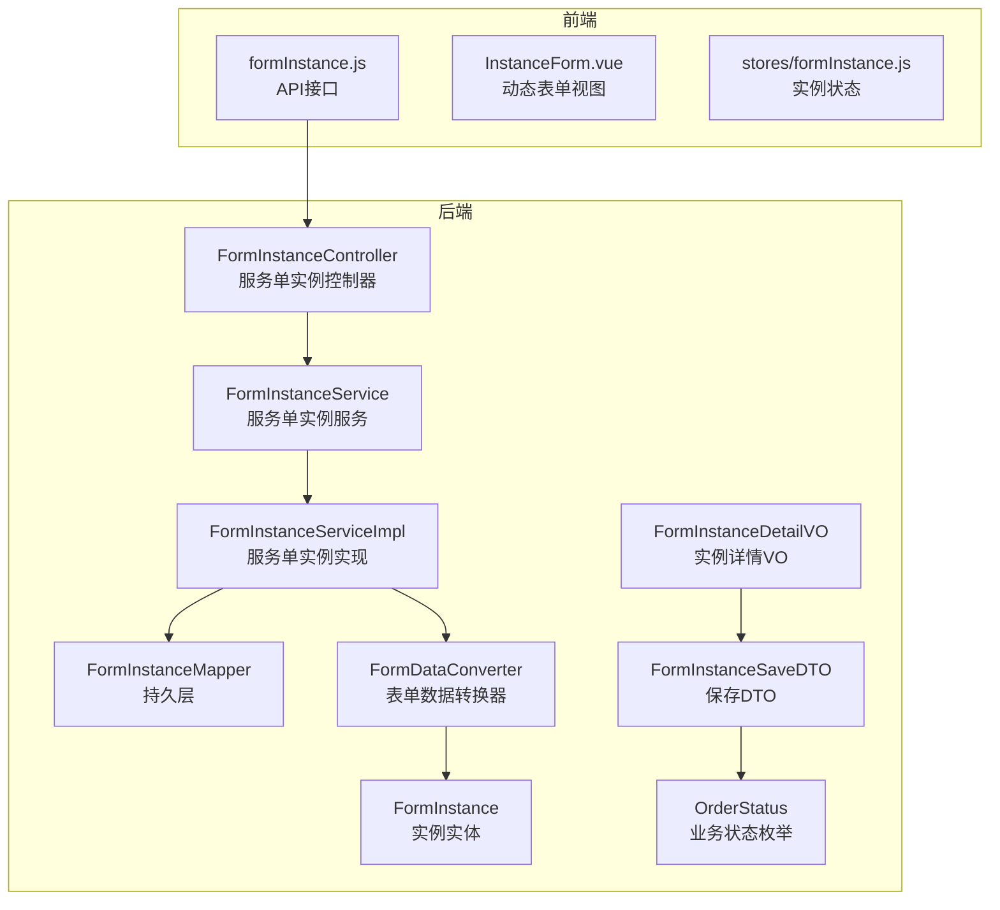
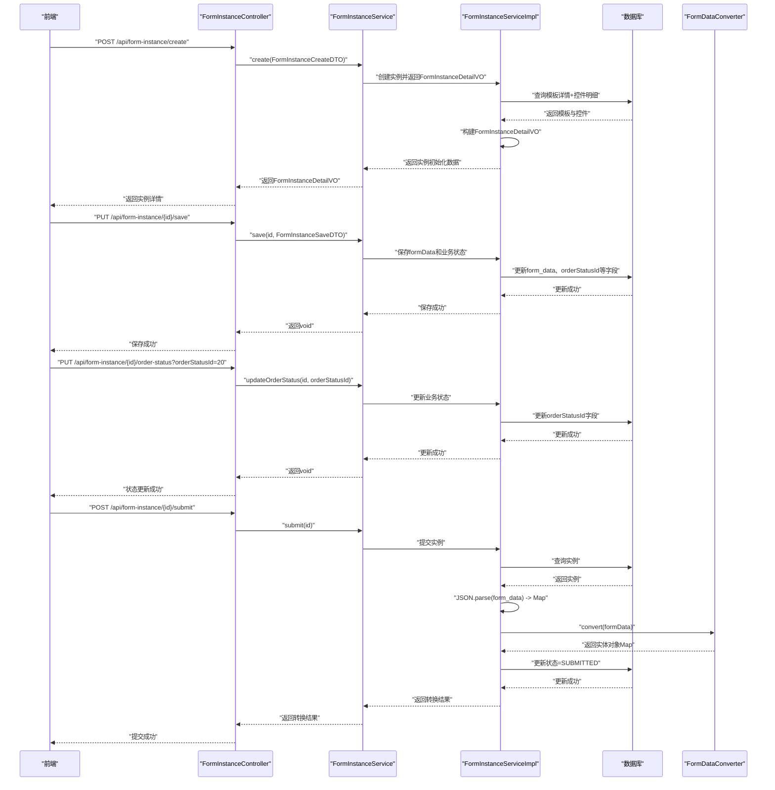
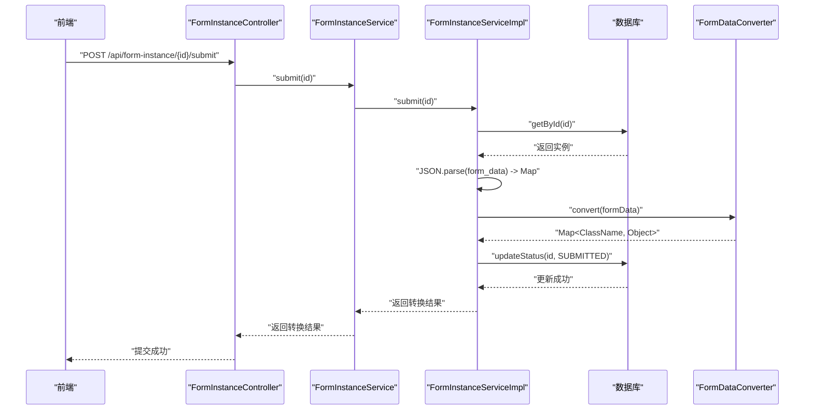
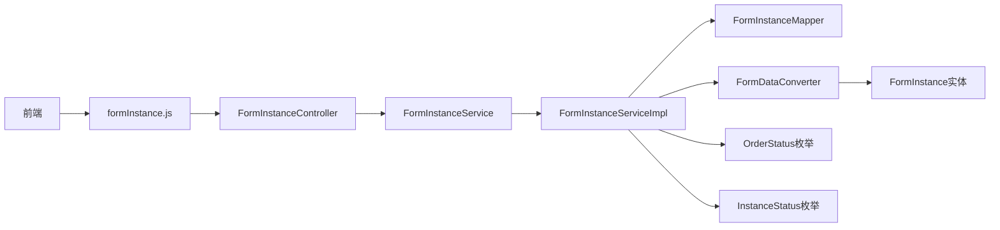
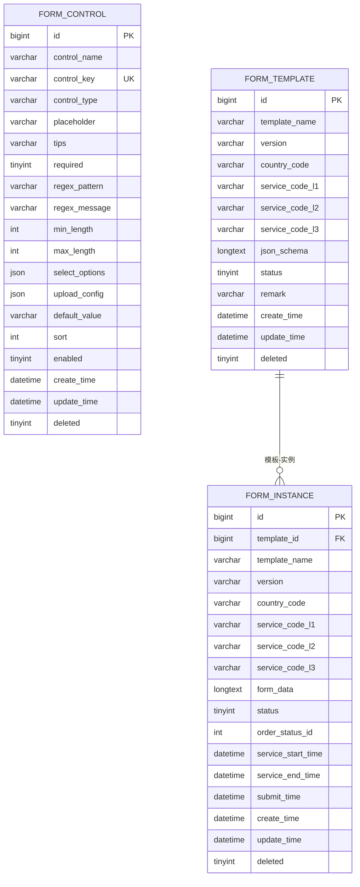

# 服务单实例API

<cite>
**本文档引用的文件**
- [VAT_EPR_动态表单技术方案.md](file://VAT_EPR_动态表单技术方案.md)
- [FormInstanceController.java](file://genetics-server/src/main/java/com/genetics/controller/FormInstanceController.java)
- [FormInstanceServiceImpl.java](file://genetics-server/src/main/java/com/genetics/service/impl/FormInstanceServiceImpl.java)
- [FormInstanceService.java](file://genetics-server/src/main/java/com/genetics/service/FormInstanceService.java)
- [FormInstance.java](file://genetics-server/src/main/java/com/genetics/entity/FormInstance.java)
- [FormInstanceDetailVO.java](file://genetics-server/src/main/java/com/genetics/dto/FormInstanceDetailVO.java)
- [FormInstanceSaveDTO.java](file://genetics-server/src/main/java/com/genetics/dto/FormInstanceSaveDTO.java)
- [OrderStatus.java](file://genetics-server/src/main/java/com/genetics/enums/OrderStatus.java)
- [InstanceStatus.java](file://genetics-server/src/main/java/com/genetics/enums/InstanceStatus.java)
- [FormInstanceCreateDTO.java](file://genetics-server/src/main/java/com/genetics/dto/FormInstanceCreateDTO.java)
- [FormTemplateDetailVO.java](file://genetics-server/src/main/java/com/genetics/dto/FormTemplateDetailVO.java)
- [formInstance.js](file://genetics-web/src/api/formInstance.js)
</cite>

## 更新摘要
**变更内容**
- 新增FormInstanceDetailVO详细实例返回对象，包含业务状态信息
- 新增FormInstanceSaveDTO草稿保存数据传输对象
- 新增OrderStatus业务状态枚举，支持完整的业务状态管理
- 新增单独的业务状态更新接口
- 完善实例查询功能，支持按业务状态筛选
- 新增业务状态选项获取接口

## 目录
1. [简介](#简介)
2. [项目结构](#项目结构)
3. [核心组件](#核心组件)
4. [架构总览](#架构总览)
5. [详细组件分析](#详细组件分析)
6. [依赖关系分析](#依赖关系分析)
7. [性能考虑](#性能考虑)
8. [故障排查指南](#故障排查指南)
9. [结论](#结论)
10. [附录](#附录)

## 简介
本文件面向"服务单实例API"的完整使用与实现说明，涵盖实例创建、草稿保存、提交、业务状态管理等核心流程，以及表单数据存储策略、FormDataConverter 数据转换机制、状态流转（草稿/已提交/已审核）等关键概念。文档同时提供接口定义、请求/响应示例、数据转换示例与最佳实践，帮助开发者快速理解并正确集成。

## 项目结构
该技术方案以"动态表单"为核心，围绕"自定义控件""服务单模板""服务单实例"三大模块构建，后端采用Spring Boot + MyBatis-Plus，前端采用Vue 3 + Element Plus。服务单实例API位于后端控制器层，负责实例生命周期管理与数据转换。

**图表来源**
- [FormInstanceController.java: 23-26:23-26](file://genetics-server/src/main/java/com/genetics/controller/FormInstanceController.java#L23-L26)
- [FormInstanceServiceImpl.java: 28-31:28-31](file://genetics-server/src/main/java/com/genetics/service/impl/FormInstanceServiceImpl.java#L28-L31)
- [FormInstanceDetailVO.java: 12-13:12-13](file://genetics-server/src/main/java/com/genetics/dto/FormInstanceDetailVO.java#L12-L13)
- [FormInstanceSaveDTO.java: 12-13:12-13](file://genetics-server/src/main/java/com/genetics/dto/FormInstanceSaveDTO.java#L12-L13)
- [OrderStatus.java: 12-13:12-13](file://genetics-server/src/main/java/com/genetics/enums/OrderStatus.java#L12-L13)

**章节来源**
- [FormInstanceController.java: 23-26:23-26](file://genetics-server/src/main/java/com/genetics/controller/FormInstanceController.java#L23-L26)
- [FormInstanceServiceImpl.java: 28-31:28-31](file://genetics-server/src/main/java/com/genetics/service/impl/FormInstanceServiceImpl.java#L28-L31)

## 核心组件
- **服务单实例控制器**：提供实例创建、草稿保存、提交、业务状态管理、详情查询、列表查询等接口。
- **服务单实例服务**：封装业务逻辑，协调持久层与数据转换器。
- **服务单实例实现**：具体业务逻辑实现，包括实例创建、保存、提交、状态管理等功能。
- **实例持久层**：访问 form_instance 表，完成CRUD与状态更新。
- **表单数据转换器**：将 Map<controlKey, value> 转换为业务实体对象，按类名分组并通过反射赋值。
- **业务实体**：FormInstance，用于承载实例数据。
- **实例详情VO**：FormInstanceDetailVO，包含模板schema、控件详情、表单数据、业务状态等完整信息。
- **保存DTO**：FormInstanceSaveDTO，用于保存草稿数据，支持业务状态和时间信息。
- **业务状态枚举**：OrderStatus，定义完整的业务状态管理。

**章节来源**
- [FormInstanceController.java: 28-29:28-29](file://genetics-server/src/main/java/com/genetics/controller/FormInstanceController.java#L28-L29)
- [FormInstanceService.java: 11-25:11-25](file://genetics-server/src/main/java/com/genetics/service/FormInstanceService.java#L11-L25)
- [FormInstanceServiceImpl.java: 31-37:31-37](file://genetics-server/src/main/java/com/genetics/service/impl/FormInstanceServiceImpl.java#L31-L37)
- [FormInstance.java: 11-13:11-13](file://genetics-server/src/main/java/com/genetics/entity/FormInstance.java#L11-L13)
- [FormInstanceDetailVO.java: 12-13:12-13](file://genetics-server/src/main/java/com/genetics/dto/FormInstanceDetailVO.java#L12-L13)
- [FormInstanceSaveDTO.java: 12-13:12-13](file://genetics-server/src/main/java/com/genetics/dto/FormInstanceSaveDTO.java#L12-L13)
- [OrderStatus.java: 12-13:12-13](file://genetics-server/src/main/java/com/genetics/enums/OrderStatus.java#L12-L13)

## 架构总览
服务单实例API遵循"控制器-服务-实现-持久层-转换器-实体"的分层架构，前端通过HTTP请求驱动后端完成实例生命周期管理，并在提交阶段触发数据转换与状态更新。新增的业务状态管理功能提供了更精细的状态控制。

**图表来源**
- [FormInstanceController.java: 33-36:33-36](file://genetics-server/src/main/java/com/genetics/controller/FormInstanceController.java#L33-L36)
- [FormInstanceController.java: 41-45:41-45](file://genetics-server/src/main/java/com/genetics/controller/FormInstanceController.java#L41-L45)
- [FormInstanceController.java: 50-55:50-55](file://genetics-server/src/main/java/com/genetics/controller/FormInstanceController.java#L50-L55)
- [FormInstanceController.java: 60-64:60-64](file://genetics-server/src/main/java/com/genetics/controller/FormInstanceController.java#L60-L64)
- [FormInstanceServiceImpl.java: 40-62:40-62](file://genetics-server/src/main/java/com/genetics/service/impl/FormInstanceServiceImpl.java#L40-L62)
- [FormInstanceServiceImpl.java: 65-87:65-87](file://genetics-server/src/main/java/com/genetics/service/impl/FormInstanceServiceImpl.java#L65-L87)
- [FormInstanceServiceImpl.java: 136-142:136-142](file://genetics-server/src/main/java/com/genetics/service/impl/FormInstanceServiceImpl.java#L136-L142)
- [FormInstanceServiceImpl.java: 90-123:90-123](file://genetics-server/src/main/java/com/genetics/service/impl/FormInstanceServiceImpl.java#L90-L123)

**章节来源**
- [FormInstanceController.java: 33-64:33-64](file://genetics-server/src/main/java/com/genetics/controller/FormInstanceController.java#L33-L64)
- [FormInstanceServiceImpl.java: 40-123:40-123](file://genetics-server/src/main/java/com/genetics/service/impl/FormInstanceServiceImpl.java#L40-L123)

## 详细组件分析

### 接口定义与流程说明

#### 3.3.1 根据模板创建服务单实例
- **方法与路径**
  - POST /api/form-instance/create
- **请求参数**
  - body: FormInstanceCreateDTO
    - templateId: number (必填)
- **响应数据**
  - FormInstanceDetailVO
    - instanceId: number
    - templateId: number
    - templateName: string
    - version: string
    - countryCode: string
    - serviceCodeL1: string
    - serviceCodeL2: string
    - serviceCodeL3: string
    - jsonSchema: object (解析后的JSON Schema)
    - controlDetails: array (控件详情列表)
    - formData: object (当前表单数据)
    - status: number (实例状态：0草稿, 1已提交, 2已审核)
    - orderStatusId: number (业务状态ID)
    - orderStatusName: string (业务状态名称)
    - serviceStartTime: string (ISO 8601格式)
    - serviceEndTime: string (ISO 8601格式)
    - submitTime: string (ISO 8601格式)
    - createTime: string (ISO 8601格式)
- **状态码**
  - 200 成功
- **错误处理**
  - 模板不存在：返回参数校验错误
  - 参数缺失：返回参数校验错误
- **流程要点**
  - 查询模板详情与控件明细
  - 初始化实例记录（状态=草稿，业务状态=待提交）
  - 返回包含完整信息的FormInstanceDetailVO

**章节来源**
- [FormInstanceController.java: 33-36:33-36](file://genetics-server/src/main/java/com/genetics/controller/FormInstanceController.java#L33-L36)
- [FormInstanceServiceImpl.java: 40-62:40-62](file://genetics-server/src/main/java/com/genetics/service/impl/FormInstanceServiceImpl.java#L40-L62)
- [FormInstanceDetailVO.java: 13-41:13-41](file://genetics-server/src/main/java/com/genetics/dto/FormInstanceDetailVO.java#L13-L41)

#### 3.3.2 保存服务单数据（草稿）
- **方法与路径**
  - PUT /api/form-instance/{id}/save
- **请求参数**
  - path: id (实例ID)
  - body: FormInstanceSaveDTO
    - formData: map<string, any> (必填)
    - orderStatusId: number (可选，业务状态ID)
    - serviceStartTime: string (可选，服务开始时间)
    - serviceEndTime: string (可选，服务结束时间)
- **响应数据**
  - data: null
- **状态码**
  - 200 成功
- **错误处理**
  - 实例不存在：返回错误
  - 实例状态不允许：返回错误（已提交的实例不可修改）
  - formData格式不合法：返回校验错误
- **流程要点**
  - 将formData序列化为JSON字符串存入 form_data 字段
  - 支持同时更新业务状态和时间信息
  - 保持实例状态为草稿

**章节来源**
- [FormInstanceController.java: 41-45:41-45](file://genetics-server/src/main/java/com/genetics/controller/FormInstanceController.java#L41-L45)
- [FormInstanceServiceImpl.java: 65-87:65-87](file://genetics-server/src/main/java/com/genetics/service/impl/FormInstanceServiceImpl.java#L65-L87)
- [FormInstanceSaveDTO.java: 13-29:13-29](file://genetics-server/src/main/java/com/genetics/dto/FormInstanceSaveDTO.java#L13-L29)

#### 3.3.3 单独更新业务状态
- **方法与路径**
  - PUT /api/form-instance/{id}/order-status
- **请求参数**
  - path: id (实例ID)
  - query: orderStatusId (业务状态ID)
- **响应数据**
  - data: null
- **状态码**
  - 200 成功
- **错误处理**
  - 实例不存在：返回错误
  - 无效的业务状态ID：返回参数校验错误
- **流程要点**
  - 验证业务状态ID的有效性
  - 更新实例的orderStatusId字段
  - 不影响表单数据内容

**章节来源**
- [FormInstanceController.java: 50-55:50-55](file://genetics-server/src/main/java/com/genetics/controller/FormInstanceController.java#L50-L55)
- [FormInstanceServiceImpl.java: 136-142:136-142](file://genetics-server/src/main/java/com/genetics/service/impl/FormInstanceServiceImpl.java#L136-L142)
- [OrderStatus.java: 34-40:34-40](file://genetics-server/src/main/java/com/genetics/enums/OrderStatus.java#L34-L40)

#### 3.3.4 提交服务单
- **方法与路径**
  - POST /api/form-instance/{id}/submit
- **响应数据**
  - convertedObjects: map<string, object>
    - key: 实体类名（如 Company）
    - value: 对应实体对象（字段映射）
- **状态码**
  - 200 成功
- **错误处理**
  - 实例不存在：返回错误
  - 实例状态不允许：返回错误（已提交的实例不可重复提交）
  - formData解析失败：返回解析错误
  - 转换异常：抛出运行时错误
- **流程要点**
  - 解析 form_data JSON 为 Map
  - 调用 FormDataConverter 按类名分组并反射赋值
  - 更新实例状态为"已提交"
  - 记录提交时间
  - 返回转换后的实体对象Map

**章节来源**
- [FormInstanceController.java: 60-64:60-64](file://genetics-server/src/main/java/com/genetics/controller/FormInstanceController.java#L60-L64)
- [FormInstanceServiceImpl.java: 90-123:90-123](file://genetics-server/src/main/java/com/genetics/service/impl/FormInstanceServiceImpl.java#L90-L123)
- [InstanceStatus.java: 9-12:9-12](file://genetics-server/src/main/java/com/genetics/enums/InstanceStatus.java#L9-L12)

#### 3.3.5 获取服务单详情
- **方法与路径**
  - GET /api/form-instance/{id}
- **请求参数**
  - path: id (实例ID)
- **响应数据**
  - FormInstanceDetailVO (同创建接口的响应结构)
- **状态码**
  - 200 成功
- **错误处理**
  - 实例不存在：返回错误

**章节来源**
- [FormInstanceController.java: 69-72:69-72](file://genetics-server/src/main/java/com/genetics/controller/FormInstanceController.java#L69-L72)
- [FormInstanceServiceImpl.java: 125-133:125-133](file://genetics-server/src/main/java/com/genetics/service/impl/FormInstanceServiceImpl.java#L125-L133)

#### 3.3.6 查询服务单实例列表
- **方法与路径**
  - GET /api/form-instance/list
- **查询参数**
  - page: number (默认1)
  - size: number (默认20)
  - status: number (可选，0=草稿, 1=已提交, 2=已审核)
  - orderStatusId: number (可选，业务状态ID)
- **响应数据**
  - total: number
  - records: array (FormInstance实体列表)
- **状态码**
  - 200 成功
- **错误处理**
  - 参数非法：返回校验错误

**章节来源**
- [FormInstanceController.java: 77-84:77-84](file://genetics-server/src/main/java/com/genetics/controller/FormInstanceController.java#L77-L84)
- [FormInstanceServiceImpl.java: 144-151:144-151](file://genetics-server/src/main/java/com/genetics/service/impl/FormInstanceServiceImpl.java#L144-L151)

#### 3.3.7 获取业务状态选项
- **方法与路径**
  - GET /api/form-instance/order-status/options
- **响应数据**
  - code: number (状态代码)
  - name: string (状态名称)
  - tagType: string (前端标签类型)
- **状态码**
  - 200 成功
- **业务状态定义**
  - 10 待提交 (info)
  - 20 待审核 (warning)
  - 30 待递交 (warning)
  - 31 组织处理 (primary)
  - 32 税局处理 (primary)
  - 33 当地同事处理 (primary)
  - 40 已完成 (success)
  - 50 已驳回 (danger)
  - 99 已终止 (danger)

**章节来源**
- [FormInstanceController.java: 89-99:89-99](file://genetics-server/src/main/java/com/genetics/controller/FormInstanceController.java#L89-L99)
- [OrderStatus.java: 12-21:12-21](file://genetics-server/src/main/java/com/genetics/enums/OrderStatus.java#L12-L21)

### 表单数据结构与存储策略
- **存储位置**
  - form_instance 表的 form_data 字段，存储 Map<controlKey, value> 的JSON字符串
- **key 命名规范**
  - ClassName.fieldName，与 controlKey 保持一致
- **value 类型**
  - 文本：String
  - 开关：Boolean
  - 数字：Number
  - 文件上传：List<{ fileName, fileUrl, fileSize }>
  - 日期：String（ISO 8601格式 yyyy-MM-dd）
- **新增字段**
  - orderStatusId：业务状态ID，默认10（待提交）
  - serviceStartTime：服务开始时间
  - serviceEndTime：服务结束时间
  - submitTime：提交时间

**章节来源**
- [FormInstance.java: 43-58:43-58](file://genetics-server/src/main/java/com/genetics/entity/FormInstance.java#L43-L58)
- [FormInstanceDetailVO.java: 29-38:29-38](file://genetics-server/src/main/java/com/genetics/dto/FormInstanceDetailVO.java#L29-L38)

### 动态渲染机制
- **前端根据 jsonSchema 生成CSS Grid布局**
- **根据 controlType 渲染对应组件**：
  - INPUT → el-input
  - SELECT → el-select
  - SWITCH → el-switch
  - UPLOAD → el-upload（读取 uploadConfig 配置）
  - TEXTAREA → el-input type="textarea"
  - DATE → el-date-picker
  - NUMBER → el-input-number
- **校验规则来源于 controlDetail 中的 regexPattern/required/minLength/maxLength**
- **formData 维护 Map<controlKey, value>，保存时原样传给后端**
- **业务状态显示**：使用orderStatusName进行前端展示

**章节来源**
- [FormTemplateDetailVO.java: 29-47:29-47](file://genetics-server/src/main/java/com/genetics/dto/FormTemplateDetailVO.java#L29-L47)
- [FormInstanceDetailVO.java: 32-34:32-34](file://genetics-server/src/main/java/com/genetics/dto/FormInstanceDetailVO.java#L32-L34)

### FormDataConverter 数据转换机制
- **输入**
  - Map<"ClassName.fieldName", value>
- **处理流程**
  - 按类名分组
  - 反射创建目标类实例并赋值字段
  - 类型转换：String/Integer/Long/Boolean/BigDecimal
- **输出**
  - Map<ClassName, 实体对象>
- **注意事项**
  - CLASS_REGISTRY 需注册业务实体类
  - controlKey 必须符合"ClassName.fieldName"格式
  - 未注册类或字段缺失会记录警告并跳过

**图表来源**
- [FormInstanceServiceImpl.java: 105-107:105-107](file://genetics-server/src/main/java/com/genetics/service/impl/FormInstanceServiceImpl.java#L105-L107)

**章节来源**
- [FormInstanceServiceImpl.java: 105-107:105-107](file://genetics-server/src/main/java/com/genetics/service/impl/FormInstanceServiceImpl.java#L105-L107)

### 状态流转（草稿/已提交/已审核）
- **实例状态**
  - 草稿：0，创建实例后初始状态
  - 已提交：1，提交接口将状态更新为已提交
  - 已审核：2，后续业务流程中更新为已审核
- **业务状态**
  - 待提交：10，实例创建后的默认业务状态
  - 待审核：20，等待审核
  - 待递交：30，等待递交
  - 组织处理：31，组织处理中
  - 税局处理：32，税局处理中
  - 当地同事处理：33，当地同事处理中
  - 已完成：40，处理完成
  - 已驳回：50，处理被驳回
  - 已终止：99，处理终止
- **并发控制**：建议对实例记录增加version字段进行乐观锁控制

**章节来源**
- [InstanceStatus.java: 9-12:9-12](file://genetics-server/src/main/java/com/genetics/enums/InstanceStatus.java#L9-L12)
- [OrderStatus.java: 12-21:12-21](file://genetics-server/src/main/java/com/genetics/enums/OrderStatus.java#L12-L21)

### 提交接口时序（代码级）

**图表来源**
- [FormInstanceController.java: 60-64:60-64](file://genetics-server/src/main/java/com/genetics/controller/FormInstanceController.java#L60-L64)
- [FormInstanceServiceImpl.java: 90-123:90-123](file://genetics-server/src/main/java/com/genetics/service/impl/FormInstanceServiceImpl.java#L90-L123)

## 依赖关系分析
- **控制器依赖服务层**
- **服务层依赖实现层与持久层**
- **实现层依赖转换器与枚举**
- **转换器依赖业务实体类注册表**
- **前端依赖控制器提供的接口**

**图表来源**
- [formInstance.js: 1-11:1-11](file://genetics-web/src/api/formInstance.js#L1-L11)
- [FormInstanceController.java: 28-29:28-29](file://genetics-server/src/main/java/com/genetics/controller/FormInstanceController.java#L28-L29)
- [FormInstanceService.java: 11-25:11-25](file://genetics-server/src/main/java/com/genetics/service/FormInstanceService.java#L11-L25)
- [FormInstanceServiceImpl.java: 31-37:31-37](file://genetics-server/src/main/java/com/genetics/service/impl/FormInstanceServiceImpl.java#L31-L37)
- [OrderStatus.java: 12-13:12-13](file://genetics-server/src/main/java/com/genetics/enums/OrderStatus.java#L12-L13)
- [InstanceStatus.java: 9-12:9-12](file://genetics-server/src/main/java/com/genetics/enums/InstanceStatus.java#L9-L12)

**章节来源**
- [formInstance.js: 1-11:1-11](file://genetics-web/src/api/formInstance.js#L1-L11)
- [FormInstanceController.java: 28-29:28-29](file://genetics-server/src/main/java/com/genetics/controller/FormInstanceController.java#L28-L29)

## 性能考虑
- **数据库层面**
  - form_instance 表对 template_id 建有索引，便于按模板查询
  - form_data 使用LONGTEXT存储，注意避免过大JSON导致I/O压力
  - 新增orderStatusId字段，建议建立索引以优化查询性能
- **服务层**
  - 提交时一次性解析与转换，建议对大数据量场景进行分批或异步处理
  - 转换器使用LinkedHashMap保证顺序，有利于调试与日志输出
  - 业务状态更新为轻量级操作，性能开销较小
- **前端**
  - 动态渲染基于jsonSchema，建议缓存控件配置与校验规则，减少重复计算
  - 业务状态选项一次性获取，避免频繁网络请求

**章节来源**
- [FormInstance.java: 43-58:43-58](file://genetics-server/src/main/java/com/genetics/entity/FormInstance.java#L43-L58)
- [FormInstanceServiceImpl.java: 105-107:105-107](file://genetics-server/src/main/java/com/genetics/service/impl/FormInstanceServiceImpl.java#L105-L107)

## 故障排查指南
- **controlKey 格式错误**
  - 现象：转换器跳过无效key
  - 处理：确保controlKey为"ClassName.fieldName"格式
- **未注册实体类**
  - 现象：转换器记录警告并跳过该类
  - 处理：在CLASS_REGISTRY中注册对应实体类
- **实例状态不允许**
  - 现象：保存/提交接口返回错误
  - 处理：检查当前状态与业务流程是否匹配
- **formData格式不合法**
  - 现象：提交时解析失败
  - 处理：前端确保formData为合法Map结构
- **业务状态ID无效**
  - 现象：更新业务状态接口返回错误
  - 处理：使用OrderStatus枚举中的有效状态ID
- **并发覆盖**
  - 现象：保存时被其他请求覆盖
  - 处理：引入version字段进行乐观锁控制

**章节来源**
- [FormInstanceServiceImpl.java: 136-142:136-142](file://genetics-server/src/main/java/com/genetics/service/impl/FormInstanceServiceImpl.java#L136-L142)
- [OrderStatus.java: 34-40:34-40](file://genetics-server/src/main/java/com/genetics/enums/OrderStatus.java#L34-L40)

## 结论
服务单实例API通过清晰的接口边界与稳定的表单数据存储策略，实现了从模板创建实例、草稿保存到提交转换的完整闭环。新增的FormInstanceDetailVO提供了更丰富的实例信息，FormInstanceSaveDTO支持了更灵活的数据保存，OrderStatus枚举实现了完整的业务状态管理。结合FormDataConverter的反射转换机制与前端动态渲染能力，系统具备良好的扩展性与可维护性。建议在生产环境中完善并发控制、数据安全与监控告警，以保障高可用与一致性。

## 附录

### 数据模型概览

**图表来源**
- [FormInstance.java: 13-71:13-71](file://genetics-server/src/main/java/com/genetics/entity/FormInstance.java#L13-L71)

### 业务状态枚举定义
- **待提交**：10，前端标签类型info
- **待审核**：20，前端标签类型warning  
- **待递交**：30，前端标签类型warning
- **组织处理**：31，前端标签类型primary
- **税局处理**：32，前端标签类型primary
- **当地同事处理**：33，前端标签类型primary
- **已完成**：40，前端标签类型success
- **已驳回**：50，前端标签类型danger
- **已终止**：99，前端标签类型danger

**章节来源**
- [OrderStatus.java: 12-21:12-21](file://genetics-server/src/main/java/com/genetics/enums/OrderStatus.java#L12-L21)