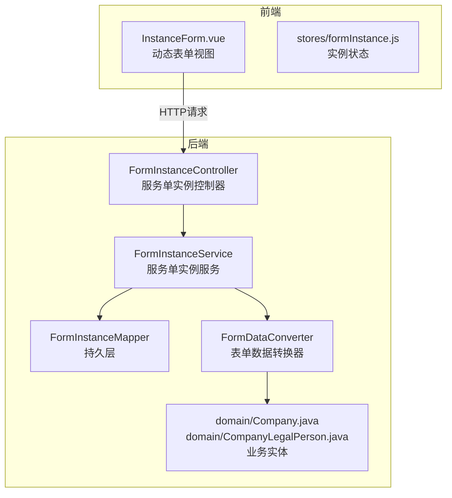
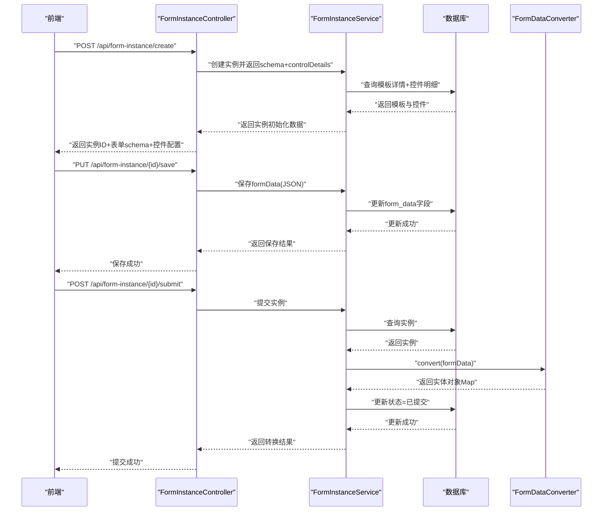
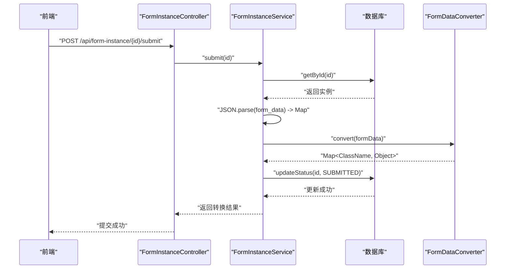
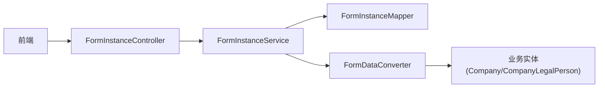
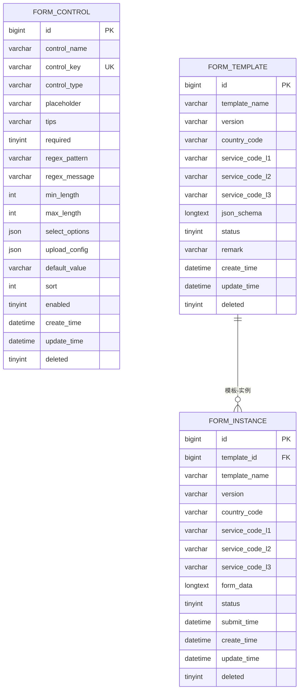

# 服务单实例API

<cite>
**本文档引用的文件**
- [VAT_EPR_动态表单技术方案.md](file://VAT_EPR_动态表单技术方案.md)
</cite>

## 目录
1. [简介](#简介)
2. [项目结构](#项目结构)
3. [核心组件](#核心组件)
4. [架构总览](#架构总览)
5. [详细组件分析](#详细组件分析)
6. [依赖关系分析](#依赖关系分析)
7. [性能考虑](#性能考虑)
8. [故障排查指南](#故障排查指南)
9. [结论](#结论)
10. [附录](#附录)

## 简介
本文件面向“服务单实例API”的完整使用与实现说明，涵盖实例创建、草稿保存、提交等核心流程，以及表单数据存储策略、FormDataConverter 数据转换机制、状态流转（草稿/已提交/已审核）等关键概念。文档同时提供接口定义、请求/响应示例、数据转换示例与最佳实践，帮助开发者快速理解并正确集成。

## 项目结构
该技术方案以“动态表单”为核心，围绕“自定义控件”“服务单模板”“服务单实例”三大模块构建，后端采用Spring Boot + MyBatis-Plus，前端采用Vue 3 + Element Plus。服务单实例API位于后端控制器层，负责实例生命周期管理与数据转换。

图表来源
- [VAT_EPR_动态表单技术方案.md: 773-813:773-813](file://VAT_EPR_动态表单技术方案.md#L773-L813)
- [VAT_EPR_动态表单技术方案.md: 782-786:782-786](file://VAT_EPR_动态表单技术方案.md#L782-L786)
- [VAT_EPR_动态表单技术方案.md: 790-794:790-794](file://VAT_EPR_动态表单技术方案.md#L790-L794)
- [VAT_EPR_动态表单技术方案.md: 802](file://VAT_EPR_动态表单技术方案.md#L802)
- [VAT_EPR_动态表单技术方案.md: 795-801:795-801](file://VAT_EPR_动态表单技术方案.md#L795-L801)

章节来源
- [VAT_EPR_动态表单技术方案.md: 773-813:773-813](file://VAT_EPR_动态表单技术方案.md#L773-L813)

## 核心组件
- 服务单实例控制器：提供实例创建、草稿保存、提交、列表查询等接口。
- 服务单实例服务：封装业务逻辑，协调持久层与数据转换器。
- 实例持久层：访问 form_instance 表，完成CRUD与状态更新。
- 表单数据转换器：将 Map<controlKey, value> 转换为业务实体对象，按类名分组并通过反射赋值。
- 业务实体：如 Company、CompanyLegalPerson 等，用于承载转换后的对象。

章节来源
- [VAT_EPR_动态表单技术方案.md: 782-786:782-786](file://VAT_EPR_动态表单技术方案.md#L782-L786)
- [VAT_EPR_动态表单技术方案.md: 790-794:790-794](file://VAT_EPR_动态表单技术方案.md#L790-L794)
- [VAT_EPR_动态表单技术方案.md: 802](file://VAT_EPR_动态表单技术方案.md#L802)
- [VAT_EPR_动态表单技术方案.md: 689-703:689-703](file://VAT_EPR_动态表单技术方案.md#L689-L703)

## 架构总览
服务单实例API遵循“控制器-服务-持久层-转换器-实体”的分层架构，前端通过HTTP请求驱动后端完成实例生命周期管理，并在提交阶段触发数据转换与状态更新。

图表来源
- [VAT_EPR_动态表单技术方案.md: 437-478:437-478](file://VAT_EPR_动态表单技术方案.md#L437-L478)
- [VAT_EPR_动态表单技术方案.md: 306-387:306-387](file://VAT_EPR_动态表单技术方案.md#L306-L387)
- [VAT_EPR_动态表单技术方案.md: 594-684:594-684](file://VAT_EPR_动态表单技术方案.md#L594-L684)

## 详细组件分析

### 接口定义与流程说明

#### 3.3.1 根据模板创建服务单实例
- 方法与路径
  - POST /api/form-instance/create
- 请求参数
  - body: { templateId: number }
- 响应数据
  - instanceId: number
  - templateId: number
  - templateName: string
  - version: string
  - countryCode: string
  - serviceCodeL3: string
  - jsonSchema: object
  - controlDetails: array
  - formData: object
- 状态码
  - 200 成功
- 错误处理
  - 模板不存在或未发布：返回错误码与提示
  - 参数缺失：返回参数校验错误
- 流程要点
  - 查询模板详情与控件明细
  - 初始化实例记录（状态=草稿）
  - 返回实例ID与动态渲染所需schema与控件配置

章节来源
- [VAT_EPR_动态表单技术方案.md: 308-334:308-334](file://VAT_EPR_动态表单技术方案.md#L308-L334)
- [VAT_EPR_动态表单技术方案.md: 437-458:437-458](file://VAT_EPR_动态表单技术方案.md#L437-L458)

#### 3.3.2 保存服务单数据（草稿）
- 方法与路径
  - PUT /api/form-instance/{id}/save
- 请求参数
  - body: { formData: map<string, any> }
- 响应数据
  - data: null
- 状态码
  - 200 成功
- 错误处理
  - 实例不存在或状态不允许：返回错误
  - formData格式不合法：返回校验错误
- 流程要点
  - 将formData序列化为JSON字符串存入 form_data 字段
  - 保持实例状态为草稿

章节来源
- [VAT_EPR_动态表单技术方案.md: 336-357:336-357](file://VAT_EPR_动态表单技术方案.md#L336-L357)
- [VAT_EPR_动态表单技术方案.md: 579-589:579-589](file://VAT_EPR_动态表单技术方案.md#L579-L589)

#### 3.3.3 提交服务单
- 方法与路径
  - POST /api/form-instance/{id}/submit
- 响应数据
  - convertedObjects: map<string, object>
    - key: 实体类名（如 Company）
    - value: 对应实体对象（字段映射）
- 状态码
  - 200 成功
- 错误处理
  - 实例不存在或状态不允许：返回错误
  - formData解析失败：返回解析错误
  - 转换异常：抛出运行时错误
- 流程要点
  - 解析 form_data JSON 为 Map
  - 调用 FormDataConverter 按类名分组并反射赋值
  - 更新实例状态为“已提交”
  - 返回转换后的实体对象Map

章节来源
- [VAT_EPR_动态表单技术方案.md: 359-380:359-380](file://VAT_EPR_动态表单技术方案.md#L359-L380)
- [VAT_EPR_动态表单技术方案.md: 460-478:460-478](file://VAT_EPR_动态表单技术方案.md#L460-L478)
- [VAT_EPR_动态表单技术方案.md: 705-728:705-728](file://VAT_EPR_动态表单技术方案.md#L705-L728)

#### 3.3.4 查询服务单实例列表
- 方法与路径
  - GET /api/form-instance/list
- 查询参数
  - status: number（0=草稿, 1=已提交, 2=已审核）
  - page: number
  - size: number
- 响应数据
  - total: number
  - records: array
- 状态码
  - 200 成功
- 错误处理
  - 参数非法：返回校验错误

章节来源
- [VAT_EPR_动态表单技术方案.md: 382-386:382-386](file://VAT_EPR_动态表单技术方案.md#L382-L386)

### 表单数据结构与存储策略
- 存储位置
  - form_instance 表的 form_data 字段，存储 Map<controlKey, value> 的JSON字符串
- key 命名规范
  - ClassName.fieldName，与 controlKey 保持一致
- value 类型
  - 文本：String
  - 开关：Boolean
  - 数字：Number
  - 文件上传：List<{ fileName, fileUrl, fileSize }>
  - 日期：String（ISO 8601格式 yyyy-MM-dd）

章节来源
- [VAT_EPR_动态表单技术方案.md: 132-163:132-163](file://VAT_EPR_动态表单技术方案.md#L132-L163)
- [VAT_EPR_动态表单技术方案.md: 579-589:579-589](file://VAT_EPR_动态表单技术方案.md#L579-L589)

### 动态渲染机制
- 前端根据 jsonSchema 生成CSS Grid布局
- 根据 controlType 渲染对应组件：
  - INPUT → el-input
  - SELECT → el-select
  - SWITCH → el-switch
  - UPLOAD → el-upload（读取 uploadConfig 配置）
  - TEXTAREA → el-input type="textarea"
  - DATE → el-date-picker
  - NUMBER → el-input-number
- 校验规则来源于 controlDetail 中的 regexPattern/required/minLength/maxLength
- formData 维护 Map<controlKey, value>，保存时原样传给后端

章节来源
- [VAT_EPR_动态表单技术方案.md: 531-578:531-578](file://VAT_EPR_动态表单技术方案.md#L531-L578)
- [VAT_EPR_动态表单技术方案.md: 589-589:589-589](file://VAT_EPR_动态表单技术方案.md#L589-L589)

### FormDataConverter 数据转换机制
- 输入
  - Map<"ClassName.fieldName", value>
- 处理流程
  - 按类名分组
  - 反射创建目标类实例并赋值字段
  - 类型转换：String/Integer/Long/Boolean/BigDecimal
- 输出
  - Map<ClassName, 实体对象>
- 注意事项
  - CLASS_REGISTRY 需注册业务实体类
  - controlKey 必须符合“ClassName.fieldName”格式
  - 未注册类或字段缺失会记录警告并跳过

图表来源
- [VAT_EPR_动态表单技术方案.md: 594-684:594-684](file://VAT_EPR_动态表单技术方案.md#L594-L684)

章节来源
- [VAT_EPR_动态表单技术方案.md: 594-684:594-684](file://VAT_EPR_动态表单技术方案.md#L594-L684)

### 状态流转（草稿/已提交/已审核）
- 草稿：创建实例后初始状态
- 已提交：提交接口将状态更新为已提交
- 已审核：后续业务流程中更新为已审核
- 并发控制：建议对实例记录增加version字段进行乐观锁控制

章节来源
- [VAT_EPR_动态表单技术方案.md: 132-153:132-153](file://VAT_EPR_动态表单技术方案.md#L132-L153)
- [VAT_EPR_动态表单技术方案.md: 868-868:868-868](file://VAT_EPR_动态表单技术方案.md#L868-L868)

### 提交接口时序（代码级）

图表来源
- [VAT_EPR_动态表单技术方案.md: 705-728:705-728](file://VAT_EPR_动态表单技术方案.md#L705-L728)
- [VAT_EPR_动态表单技术方案.md: 594-684:594-684](file://VAT_EPR_动态表单技术方案.md#L594-L684)

## 依赖关系分析
- 控制器依赖服务层
- 服务层依赖持久层与转换器
- 转换器依赖业务实体类注册表
- 前端依赖控制器提供的接口

图表来源
- [VAT_EPR_动态表单技术方案.md: 782-786:782-786](file://VAT_EPR_动态表单技术方案.md#L782-L786)
- [VAT_EPR_动态表单技术方案.md: 790-794:790-794](file://VAT_EPR_动态表单技术方案.md#L790-L794)
- [VAT_EPR_动态表单技术方案.md: 802](file://VAT_EPR_动态表单技术方案.md#L802)
- [VAT_EPR_动态表单技术方案.md: 795-801:795-801](file://VAT_EPR_动态表单技术方案.md#L795-L801)

章节来源
- [VAT_EPR_动态表单技术方案.md: 773-813:773-813](file://VAT_EPR_动态表单技术方案.md#L773-L813)

## 性能考虑
- 数据库层面
  - form_instance 表对 template_id 建有索引，便于按模板查询
  - form_data 使用LONGTEXT存储，注意避免过大JSON导致I/O压力
- 服务层
  - 提交时一次性解析与转换，建议对大数据量场景进行分批或异步处理
  - 转换器使用LinkedHashMap保证顺序，有利于调试与日志输出
- 前端
  - 动态渲染基于jsonSchema，建议缓存控件配置与校验规则，减少重复计算

章节来源
- [VAT_EPR_动态表单技术方案.md: 132-153:132-153](file://VAT_EPR_动态表单技术方案.md#L132-L153)
- [VAT_EPR_动态表单技术方案.md: 594-684:594-684](file://VAT_EPR_动态表单技术方案.md#L594-L684)

## 故障排查指南
- controlKey 格式错误
  - 现象：转换器跳过无效key
  - 处理：确保controlKey为“ClassName.fieldName”格式
- 未注册实体类
  - 现象：转换器记录警告并跳过该类
  - 处理：在CLASS_REGISTRY中注册对应实体类
- 实例状态不允许
  - 现象：保存/提交接口返回错误
  - 处理：检查当前状态与业务流程是否匹配
- formData格式不合法
  - 现象：提交时解析失败
  - 处理：前端确保formData为合法Map结构
- 并发覆盖
  - 现象：保存时被其他请求覆盖
  - 处理：引入version字段进行乐观锁控制

章节来源
- [VAT_EPR_动态表单技术方案.md: 856-869:856-869](file://VAT_EPR_动态表单技术方案.md#L856-L869)
- [VAT_EPR_动态表单技术方案.md: 594-684:594-684](file://VAT_EPR_动态表单技术方案.md#L594-L684)

## 结论
服务单实例API通过清晰的接口边界与稳定的表单数据存储策略，实现了从模板创建实例、草稿保存到提交转换的完整闭环。结合FormDataConverter的反射转换机制与前端动态渲染能力，系统具备良好的扩展性与可维护性。建议在生产环境中完善并发控制、数据安全与监控告警，以保障高可用与一致性。

## 附录

### 数据模型概览

图表来源
- [VAT_EPR_动态表单技术方案.md: 33-58:33-58](file://VAT_EPR_动态表单技术方案.md#L33-L58)
- [VAT_EPR_动态表单技术方案.md: 68-86:68-86](file://VAT_EPR_动态表单技术方案.md#L68-L86)
- [VAT_EPR_动态表单技术方案.md: 132-153:132-153](file://VAT_EPR_动态表单技术方案.md#L132-L153)