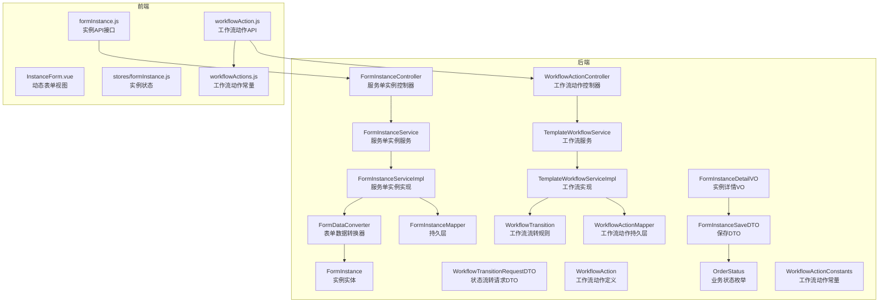
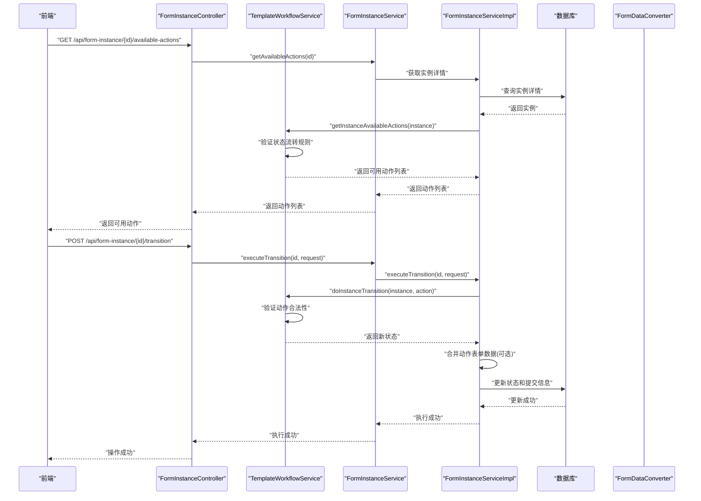
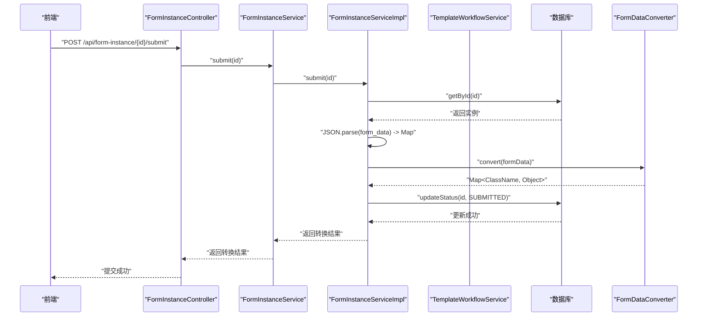
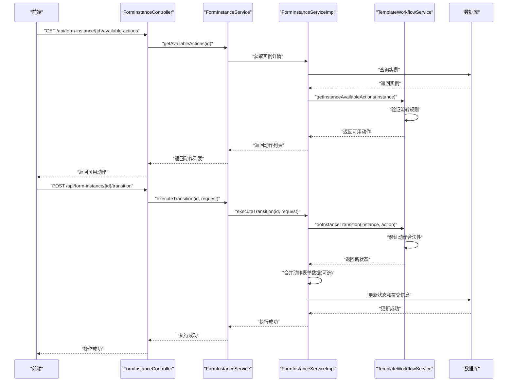
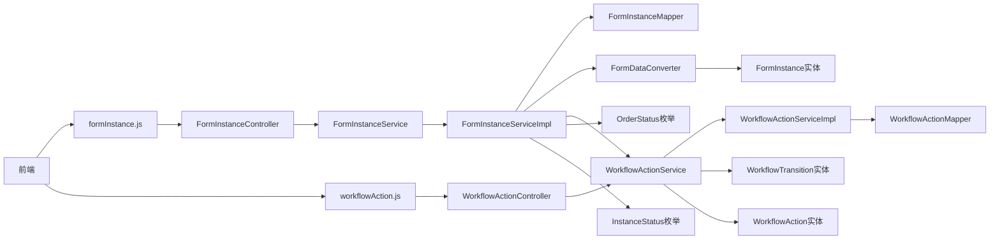
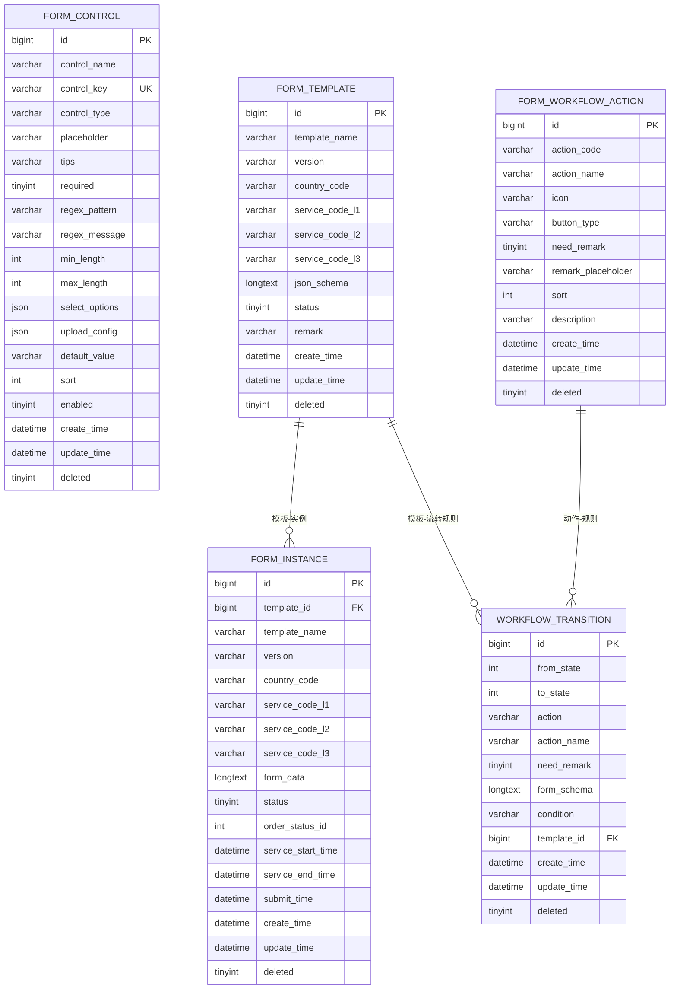

# 服务单实例API

<cite>
**本文档引用的文件**
- [VAT_EPR_动态表单技术方案.md](file://VAT_EPR_动态表单技术方案.md)
- [FormInstanceController.java](file://genetics-server/src/main/java/com/genetics/controller/FormInstanceController.java)
- [FormInstanceServiceImpl.java](file://genetics-server/src/main/java/com/genetics/service/impl/FormInstanceServiceImpl.java)
- [FormInstanceService.java](file://genetics-server/src/main/java/com/genetics/service/FormInstanceService.java)
- [FormInstance.java](file://genetics-server/src/main/java/com/genetics/entity/FormInstance.java)
- [FormInstanceDetailVO.java](file://genetics-server/src/main/java/com/genetics/dto/FormInstanceDetailVO.java)
- [FormInstanceSaveDTO.java](file://genetics-server/src/main/java/com/genetics/dto/FormInstanceSaveDTO.java)
- [OrderStatus.java](file://genetics-server/src/main/java/com/genetics/enums/OrderStatus.java)
- [InstanceStatus.java](file://genetics-server/src/main/java/com/genetics/enums/InstanceStatus.java)
- [FormInstanceCreateDTO.java](file://genetics-server/src/main/java/com/genetics/dto/FormInstanceCreateDTO.java)
- [FormTemplateDetailVO.java](file://genetics-server/src/main/java/com/genetics/dto/FormTemplateDetailVO.java)
- [WorkflowTransitionRequestDTO.java](file://genetics-server/src/main/java/com/genetics/dto/WorkflowTransitionRequestDTO.java)
- [TemplateWorkflowService.java](file://genetics-server/src/main/java/com/genetics/service/TemplateWorkflowService.java)
- [TemplateWorkflowServiceImpl.java](file://genetics-server/src/main/java/com/genetics/service/impl/TemplateWorkflowServiceImpl.java)
- [WorkflowTransition.java](file://genetics-server/src/main/java/com/genetics/entity/workflow/WorkflowTransition.java)
- [WorkflowAction.java](file://genetics-server/src/main/java/com/genetics/entity/workflow/WorkflowAction.java)
- [WorkflowActionController.java](file://genetics-server/src/main/java/com/genetics/controller/WorkflowActionController.java)
- [WorkflowActionService.java](file://genetics-server/src/main/java/com/genetics/service/WorkflowActionService.java)
- [WorkflowActionConstants.java](file://genetics-server/src/main/java/com/genetics/common/constants/WorkflowActionConstants.java)
- [formInstance.js](file://genetics-web/src/api/formInstance.js)
- [workflowAction.js](file://genetics-web/src/api/workflowAction.js)
- [workflowActions.js](file://genetics-web/src/constants/workflowActions.js)
</cite>

## 更新摘要
**变更内容**
- 新增工作流动作执行和状态转换功能
- 新增工作流动作管理接口（增删改查）
- 新增实例状态流转接口（获取可用动作、执行状态转换）
- 新增工作流配置和条件判断机制
- 新增工作流动作常量定义
- 更新实例状态管理，支持业务状态和工作流状态双维度控制

## 目录
1. [简介](#简介)
2. [项目结构](#项目结构)
3. [核心组件](#核心组件)
4. [架构总览](#架构总览)
5. [详细组件分析](#详细组件分析)
6. [依赖关系分析](#依赖关系分析)
7. [性能考虑](#性能考虑)
8. [故障排查指南](#故障排查指南)
9. [结论](#结论)
10. [附录](#附录)

## 简介
本文件面向"服务单实例API"的完整使用与实现说明，涵盖实例创建、草稿保存、提交、业务状态管理、工作流动作执行和状态转换等核心流程，以及表单数据存储策略、FormDataConverter 数据转换机制、状态流转（草稿/已提交/已审核）等关键概念。文档同时提供接口定义、请求/响应示例、数据转换示例与最佳实践，帮助开发者快速理解并正确集成。

## 项目结构
该技术方案以"动态表单"为核心，围绕"自定义控件""服务单模板""服务单实例"三大模块构建，后端采用Spring Boot + MyBatis-Plus，前端采用Vue 3 + Element Plus。服务单实例API位于后端控制器层，负责实例生命周期管理与数据转换。新增的工作流功能通过独立的控制器和实体管理状态流转规则。

**图表来源**
- [FormInstanceController.java: 23-26:23-26](file://genetics-server/src/main/java/com/genetics/controller/FormInstanceController.java#L23-L26)
- [WorkflowActionController.java: 12-14:12-14](file://genetics-server/src/main/java/com/genetics/controller/WorkflowActionController.java#L12-L14)
- [FormInstanceServiceImpl.java: 28-31:28-31](file://genetics-server/src/main/java/com/genetics/service/impl/FormInstanceServiceImpl.java#L28-L31)
- [TemplateWorkflowServiceImpl.java: 59-80:59-80](file://genetics-server/src/main/java/com/genetics/service/impl/TemplateWorkflowServiceImpl.java#L59-L80)
- [FormInstanceDetailVO.java: 12-13:12-13](file://genetics-server/src/main/java/com/genetics/dto/FormInstanceDetailVO.java#L12-L13)
- [FormInstanceSaveDTO.java: 12-13:12-13](file://genetics-server/src/main/java/com/genetics/dto/FormInstanceSaveDTO.java#L12-L13)
- [WorkflowTransitionRequestDTO.java: 10-25:10-25](file://genetics-server/src/main/java/com/genetics/dto/WorkflowTransitionRequestDTO.java#L10-L25)
- [WorkflowTransition.java: 9-45:9-45](file://genetics-server/src/main/java/com/genetics/entity/workflow/WorkflowTransition.java#L9-L45)
- [WorkflowAction.java: 12-65:12-65](file://genetics-server/src/main/java/com/genetics/entity/workflow/WorkflowAction.java#L12-L65)
- [OrderStatus.java: 12-13:12-13](file://genetics-server/src/main/java/com/genetics/enums/OrderStatus.java#L12-L13)
- [WorkflowActionConstants.java: 6-35:6-35](file://genetics-server/src/main/java/com/genetics/common/constants/WorkflowActionConstants.java#L6-L35)

**章节来源**
- [FormInstanceController.java: 23-26:23-26](file://genetics-server/src/main/java/com/genetics/controller/FormInstanceController.java#L23-L26)
- [WorkflowActionController.java: 12-14:12-14](file://genetics-server/src/main/java/com/genetics/controller/WorkflowActionController.java#L12-L14)
- [FormInstanceServiceImpl.java: 28-31:28-31](file://genetics-server/src/main/java/com/genetics/service/impl/FormInstanceServiceImpl.java#L28-L31)

## 核心组件
- **服务单实例控制器**：提供实例创建、草稿保存、提交、业务状态管理、详情查询、列表查询、工作流动作执行等接口。
- **工作流动作控制器**：提供工作流动作的增删改查管理接口。
- **服务单实例服务**：封装业务逻辑，协调持久层与数据转换器。
- **工作流服务**：管理模板工作流配置，验证状态流转合法性，执行状态转换。
- **服务单实例实现**：具体业务逻辑实现，包括实例创建、保存、提交、状态管理、工作流动作执行等功能。
- **工作流实现**：处理工作流配置、动作验证、状态转换逻辑。
- **实例持久层**：访问 form_instance 表，完成CRUD与状态更新。
- **工作流动作持久层**：访问 form_workflow_action 表，管理动作定义。
- **表单数据转换器**：将 Map<controlKey, value> 转换为业务实体对象，按类名分组并通过反射赋值。
- **业务实体**：FormInstance，用于承载实例数据。
- **工作流实体**：WorkflowTransition，定义状态流转规则；WorkflowAction，定义动作定义。
- **实例详情VO**：FormInstanceDetailVO，包含模板schema、控件详情、表单数据、业务状态等完整信息。
- **保存DTO**：FormInstanceSaveDTO，用于保存草稿数据，支持业务状态和时间信息。
- **状态流转请求DTO**：WorkflowTransitionRequestDTO，封装动作执行请求参数。
- **业务状态枚举**：OrderStatus，定义完整的业务状态管理。
- **工作流动作常量**：WorkflowActionConstants，定义标准工作流动作编码。

**章节来源**
- [FormInstanceController.java: 28-29:28-29](file://genetics-server/src/main/java/com/genetics/controller/FormInstanceController.java#L28-L29)
- [WorkflowActionController.java: 15-16:15-16](file://genetics-server/src/main/java/com/genetics/controller/WorkflowActionController.java#L15-L16)
- [FormInstanceService.java: 11-25:11-25](file://genetics-server/src/main/java/com/genetics/service/FormInstanceService.java#L11-L25)
- [TemplateWorkflowService.java: 14-91:14-91](file://genetics-server/src/main/java/com/genetics/service/TemplateWorkflowService.java#L14-L91)
- [FormInstanceServiceImpl.java: 31-37:31-37](file://genetics-server/src/main/java/com/genetics/service/impl/FormInstanceServiceImpl.java#L31-L37)
- [TemplateWorkflowServiceImpl.java: 82-156:82-156](file://genetics-server/src/main/java/com/genetics/service/impl/TemplateWorkflowServiceImpl.java#L82-L156)
- [FormInstance.java: 11-13:11-13](file://genetics-server/src/main/java/com/genetics/entity/FormInstance.java#L11-L13)
- [WorkflowTransition.java: 9-45:9-45](file://genetics-server/src/main/java/com/genetics/entity/workflow/WorkflowTransition.java#L9-L45)
- [WorkflowAction.java: 12-65:12-65](file://genetics-server/src/main/java/com/genetics/entity/workflow/WorkflowAction.java#L12-L65)
- [FormInstanceDetailVO.java: 12-13:12-13](file://genetics-server/src/main/java/com/genetics/dto/FormInstanceDetailVO.java#L12-L13)
- [FormInstanceSaveDTO.java: 12-13:12-13](file://genetics-server/src/main/java/com/genetics/dto/FormInstanceSaveDTO.java#L12-L13)
- [WorkflowTransitionRequestDTO.java: 10-25:10-25](file://genetics-server/src/main/java/com/genetics/dto/WorkflowTransitionRequestDTO.java#L10-L25)
- [OrderStatus.java: 12-13:12-13](file://genetics-server/src/main/java/com/genetics/enums/OrderStatus.java#L12-L13)
- [WorkflowActionConstants.java: 6-35:6-35](file://genetics-server/src/main/java/com/genetics/common/constants/WorkflowActionConstants.java#L6-L35)

## 架构总览
服务单实例API遵循"控制器-服务-实现-持久层-转换器-实体"的分层架构，前端通过HTTP请求驱动后端完成实例生命周期管理，并在提交阶段触发数据转换与状态更新。新增的工作流功能提供了灵活的状态流转控制，支持条件判断和动作配置。

**图表来源**
- [FormInstanceController.java: 108-114:108-114](file://genetics-server/src/main/java/com/genetics/controller/FormInstanceController.java#L108-L114)
- [FormInstanceController.java: 119-124:119-124](file://genetics-server/src/main/java/com/genetics/controller/FormInstanceController.java#L119-L124)
- [FormInstanceServiceImpl.java: 168-203:168-203](file://genetics-server/src/main/java/com/genetics/service/impl/FormInstanceServiceImpl.java#L168-L203)
- [TemplateWorkflowServiceImpl.java: 82-156:82-156](file://genetics-server/src/main/java/com/genetics/service/impl/TemplateWorkflowServiceImpl.java#L82-L156)

**章节来源**
- [FormInstanceController.java: 108-124:108-124](file://genetics-server/src/main/java/com/genetics/controller/FormInstanceController.java#L108-L124)
- [FormInstanceServiceImpl.java: 168-203:168-203](file://genetics-server/src/main/java/com/genetics/service/impl/FormInstanceServiceImpl.java#L168-L203)
- [TemplateWorkflowServiceImpl.java: 82-156:82-156](file://genetics-server/src/main/java/com/genetics/service/impl/TemplateWorkflowServiceImpl.java#L82-L156)

## 详细组件分析

### 接口定义与流程说明

#### 3.3.1 根据模板创建服务单实例
- **方法与路径**
  - POST /api/form-instance/create
- **请求参数**
  - body: FormInstanceCreateDTO
    - templateId: number (必填)
- **响应数据**
  - FormInstanceDetailVO
    - instanceId: number
    - templateId: number
    - templateName: string
    - version: string
    - countryCode: string
    - serviceCodeL1: string
    - serviceCodeL2: string
    - serviceCodeL3: string
    - jsonSchema: object (解析后的JSON Schema)
    - controlDetails: array (控件详情列表)
    - formData: object (当前表单数据)
    - status: number (实例状态：0草稿, 1已提交, 2已审核)
    - orderStatusId: number (业务状态ID)
    - orderStatusName: string (业务状态名称)
    - serviceStartTime: string (ISO 8601格式)
    - serviceEndTime: string (ISO 8601格式)
    - submitTime: string (ISO 8601格式)
    - createTime: string (ISO 8601格式)
- **状态码**
  - 200 成功
- **错误处理**
  - 模板不存在：返回参数校验错误
  - 参数缺失：返回参数校验错误
- **流程要点**
  - 查询模板详情与控件明细
  - 初始化实例记录（状态=草稿，业务状态=待提交）
  - 返回包含完整信息的FormInstanceDetailVO

**章节来源**
- [FormInstanceController.java: 37-40:37-40](file://genetics-server/src/main/java/com/genetics/controller/FormInstanceController.java#L37-L40)
- [FormInstanceServiceImpl.java: 40-62:40-62](file://genetics-server/src/main/java/com/genetics/service/impl/FormInstanceServiceImpl.java#L40-L62)
- [FormInstanceDetailVO.java: 13-41:13-41](file://genetics-server/src/main/java/com/genetics/dto/FormInstanceDetailVO.java#L13-L41)

#### 3.3.2 保存服务单数据（草稿）
- **方法与路径**
  - PUT /api/form-instance/{id}/save
- **请求参数**
  - path: id (实例ID)
  - body: FormInstanceSaveDTO
    - formData: map<string, any> (必填)
    - orderStatusId: number (可选，业务状态ID)
    - serviceStartTime: string (可选，服务开始时间)
    - serviceEndTime: string (可选，服务结束时间)
- **响应数据**
  - data: null
- **状态码**
  - 200 成功
- **错误处理**
  - 实例不存在：返回错误
  - 实例状态不允许：返回错误（已提交的实例不可修改）
  - formData格式不合法：返回校验错误
- **流程要点**
  - 将formData序列化为JSON字符串存入 form_data 字段
  - 支持同时更新业务状态和时间信息
  - 保持实例状态为草稿

**章节来源**
- [FormInstanceController.java: 45-49:45-49](file://genetics-server/src/main/java/com/genetics/controller/FormInstanceController.java#L45-L49)
- [FormInstanceServiceImpl.java: 65-87:65-87](file://genetics-server/src/main/java/com/genetics/service/impl/FormInstanceServiceImpl.java#L65-L87)
- [FormInstanceSaveDTO.java: 13-29:13-29](file://genetics-server/src/main/java/com/genetics/dto/FormInstanceSaveDTO.java#L13-L29)

#### 3.3.3 单独更新业务状态
- **方法与路径**
  - PUT /api/form-instance/{id}/order-status
- **请求参数**
  - path: id (实例ID)
  - query: orderStatusId (业务状态ID)
- **响应数据**
  - data: null
- **状态码**
  - 200 成功
- **错误处理**
  - 实例不存在：返回错误
  - 无效的业务状态ID：返回参数校验错误
- **流程要点**
  - 验证业务状态ID的有效性
  - 更新实例的orderStatusId字段
  - 不影响表单数据内容

**章节来源**
- [FormInstanceController.java: 54-59:54-59](file://genetics-server/src/main/java/com/genetics/controller/FormInstanceController.java#L54-L59)
- [FormInstanceServiceImpl.java: 157-165:157-165](file://genetics-server/src/main/java/com/genetics/service/impl/FormInstanceServiceImpl.java#L157-L165)
- [OrderStatus.java: 34-40:34-40](file://genetics-server/src/main/java/com/genetics/enums/OrderStatus.java#L34-L40)

#### 3.3.4 提交服务单
- **方法与路径**
  - POST /api/form-instance/{id}/submit
- **响应数据**
  - convertedObjects: map<string, object>
    - key: 实体类名（如 Company）
    - value: 对应实体对象（字段映射）
- **状态码**
  - 200 成功
- **错误处理**
  - 实例不存在：返回错误
  - 实例状态不允许：返回错误（已提交的实例不可重复提交）
  - formData解析失败：返回解析错误
  - 转换异常：抛出运行时错误
- **流程要点**
  - 解析 form_data JSON 为 Map
  - 调用 FormDataConverter 按类名分组并反射赋值
  - 更新实例状态为"已提交"
  - 记录提交时间
  - 返回转换后的实体对象Map

**章节来源**
- [FormInstanceController.java: 64-68:64-68](file://genetics-server/src/main/java/com/genetics/controller/FormInstanceController.java#L64-L68)
- [FormInstanceServiceImpl.java: 90-123:90-123](file://genetics-server/src/main/java/com/genetics/service/impl/FormInstanceServiceImpl.java#L90-L123)
- [InstanceStatus.java: 9-12:9-12](file://genetics-server/src/main/java/com/genetics/enums/InstanceStatus.java#L9-L12)

#### 3.3.5 获取服务单详情
- **方法与路径**
  - GET /api/form-instance/{id}
- **请求参数**
  - path: id (实例ID)
- **响应数据**
  - FormInstanceDetailVO (同创建接口的响应结构)
- **状态码**
  - 200 成功
- **错误处理**
  - 实例不存在：返回错误

**章节来源**
- [FormInstanceController.java: 73-76:73-76](file://genetics-server/src/main/java/com/genetics/controller/FormInstanceController.java#L73-L76)
- [FormInstanceServiceImpl.java: 125-154:125-154](file://genetics-server/src/main/java/com/genetics/service/impl/FormInstanceServiceImpl.java#L125-L154)

#### 3.3.6 查询服务单实例列表
- **方法与路径**
  - GET /api/form-instance/list
- **查询参数**
  - page: number (默认1)
  - size: number (默认20)
  - status: number (可选，0=草稿, 1=已提交, 2=已审核)
  - orderStatusId: number (可选，业务状态ID)
- **响应数据**
  - total: number
  - records: array (FormInstance实体列表)
- **状态码**
  - 200 成功
- **错误处理**
  - 参数非法：返回校验错误

**章节来源**
- [FormInstanceController.java: 81-88:81-88](file://genetics-server/src/main/java/com/genetics/controller/FormInstanceController.java#L81-L88)
- [FormInstanceServiceImpl.java: 205-212:205-212](file://genetics-server/src/main/java/com/genetics/service/impl/FormInstanceServiceImpl.java#L205-L212)

#### 3.3.7 获取业务状态选项
- **方法与路径**
  - GET /api/form-instance/order-status/options
- **响应数据**
  - code: number (状态代码)
  - name: string (状态名称)
  - tagType: string (前端标签类型)
- **状态码**
  - 200 成功
- **业务状态定义**
  - 10 待提交 (info)
  - 20 待审核 (warning)
  - 30 待递交 (warning)
  - 31 组织处理 (primary)
  - 32 税局处理 (primary)
  - 33 当地同事处理 (primary)
  - 40 已完成 (success)
  - 50 已驳回 (danger)
  - 99 已终止 (danger)

**章节来源**
- [FormInstanceController.java: 93-103:93-103](file://genetics-server/src/main/java/com/genetics/controller/FormInstanceController.java#L93-L103)
- [OrderStatus.java: 12-21:12-21](file://genetics-server/src/main/java/com/genetics/enums/OrderStatus.java#L12-L21)

#### 3.3.8 获取实例可用的工作流动作
- **方法与路径**
  - GET /api/form-instance/{id}/available-actions
- **请求参数**
  - path: id (实例ID)
- **响应数据**
  - array (WorkflowTransition)
    - from: number (起始状态)
    - to: number (目标状态)
    - action: string (动作编码)
    - actionName: string (动作名称)
    - needRemark: boolean (是否需要备注)
    - formSchema: string (动作表单配置)
    - condition: string (条件)
- **状态码**
  - 200 成功
- **错误处理**
  - 实例不存在：返回错误
- **流程要点**
  - 基于实例当前状态和模板配置计算可用动作
  - 支持条件判断（如VAT/EPR）
  - 包含终止操作的特殊处理

**章节来源**
- [FormInstanceController.java: 108-114:108-114](file://genetics-server/src/main/java/com/genetics/controller/FormInstanceController.java#L108-L114)
- [TemplateWorkflowServiceImpl.java: 59-80:59-80](file://genetics-server/src/main/java/com/genetics/service/impl/TemplateWorkflowServiceImpl.java#L59-L80)

#### 3.3.9 执行状态流转
- **方法与路径**
  - POST /api/form-instance/{id}/transition
- **请求参数**
  - path: id (实例ID)
  - body: WorkflowTransitionRequestDTO
    - action: string (动作编码)
    - remark: string (备注/原因)
    - actionFormData: object (动作触发时的表单数据)
- **响应数据**
  - data: null
- **状态码**
  - 200 成功
- **错误处理**
  - 实例不存在：返回错误
  - 动作不合法：返回错误
  - 条件不满足：返回错误
- **流程要点**
  - 验证动作在当前状态下是否允许
  - 检查条件匹配（如VAT/EPR）
  - 执行状态转换并更新实例状态
  - 合并动作相关的表单数据
  - 特殊动作处理：提交、重新提交、审核驳回等

**章节来源**
- [FormInstanceController.java: 119-124:119-124](file://genetics-server/src/main/java/com/genetics/controller/FormInstanceController.java#L119-L124)
- [FormInstanceServiceImpl.java: 168-203:168-203](file://genetics-server/src/main/java/com/genetics/service/impl/FormInstanceServiceImpl.java#L168-L203)
- [TemplateWorkflowServiceImpl.java: 82-156:82-156](file://genetics-server/src/main/java/com/genetics/service/impl/TemplateWorkflowServiceImpl.java#L82-L156)

#### 3.3.10 工作流动作管理接口
- **获取动作列表**
  - GET /api/workflow/actions/list
  - 响应：List<WorkflowAction>
- **保存动作**
  - POST /api/workflow/actions
  - 请求：WorkflowAction
  - 响应：boolean
- **删除动作**
  - DELETE /api/workflow/actions/{id}
  - 响应：boolean
- **动作实体字段**
  - actionCode: string (动作编码)
  - actionName: string (动作名称)
  - icon: string (图标)
  - buttonType: string (按钮类型)
  - needRemark: boolean (是否需要备注)
  - remarkPlaceholder: string (备注提示语)
  - sort: number (排序)
  - description: string (描述)

**章节来源**
- [WorkflowActionController.java: 18-31:18-31](file://genetics-server/src/main/java/com/genetics/controller/WorkflowActionController.java#L18-L31)
- [WorkflowAction.java: 16-65:16-65](file://genetics-server/src/main/java/com/genetics/entity/workflow/WorkflowAction.java#L16-L65)

### 工作流配置与状态转换机制
- **工作流配置**
  - TemplateWorkflowConfig：定义模板级别的状态流转规则
  - WorkflowTransition：定义具体的流转规则（from→to，action，condition）
  - 支持条件判断：VAT、EPR、null（通用）
- **动作定义**
  - WorkflowAction：定义可复用的动作模板
  - 支持图标、按钮样式、备注需求等配置
- **状态转换流程**
  - 验证动作在当前状态下的合法性
  - 检查条件匹配（业务类型、上下文数据）
  - 执行状态转换并更新实例
  - 处理特殊动作的附加逻辑

**章节来源**
- [TemplateWorkflowConfig.java: 13-39:13-39](file://genetics-server/src/main/java/com/genetics/entity/workflow/TemplateWorkflowConfig.java#L13-L39)
- [WorkflowTransition.java: 9-45:9-45](file://genetics-server/src/main/java/com/genetics/entity/workflow/WorkflowTransition.java#L9-L45)
- [WorkflowAction.java: 12-65:12-65](file://genetics-server/src/main/java/com/genetics/entity/workflow/WorkflowAction.java#L12-L65)

### 表单数据结构与存储策略
- **存储位置**
  - form_instance 表的 form_data 字段，存储 Map<controlKey, value> 的JSON字符串
- **key 命名规范**
  - ClassName.fieldName，与 controlKey 保持一致
- **value 类型**
  - 文本：String
  - 开关：Boolean
  - 数字：Number
  - 文件上传：List<{ fileName, fileUrl, fileSize }>
  - 日期：String（ISO 8601格式 yyyy-MM-dd）
- **新增字段**
  - orderStatusId：业务状态ID，默认10（待提交）
  - serviceStartTime：服务开始时间
  - serviceEndTime：服务结束时间
  - submitTime：提交时间

**章节来源**
- [FormInstance.java: 43-58:43-58](file://genetics-server/src/main/java/com/genetics/entity/FormInstance.java#L43-L58)
- [FormInstanceDetailVO.java: 29-38:29-38](file://genetics-server/src/main/java/com/genetics/dto/FormInstanceDetailVO.java#L29-L38)

### 动态渲染机制
- **前端根据 jsonSchema 生成CSS Grid布局**
- **根据 controlType 渲染对应组件**：
  - INPUT → el-input
  - SELECT → el-select
  - SWITCH → el-switch
  - UPLOAD → el-upload（读取 uploadConfig 配置）
  - TEXTAREA → el-input type="textarea"
  - DATE → el-date-picker
  - NUMBER → el-input-number
- **校验规则来源于 controlDetail 中的 regexPattern/required/minLength/maxLength**
- **formData 维护 Map<controlKey, value>，保存时原样传给后端**
- **业务状态显示**：使用orderStatusName进行前端展示

**章节来源**
- [FormTemplateDetailVO.java: 29-47:29-47](file://genetics-server/src/main/java/com/genetics/dto/FormTemplateDetailVO.java#L29-L47)
- [FormInstanceDetailVO.java: 32-34:32-34](file://genetics-server/src/main/java/com/genetics/dto/FormInstanceDetailVO.java#L32-L34)

### FormDataConverter 数据转换机制
- **输入**
  - Map<"ClassName.fieldName", value>
- **处理流程**
  - 按类名分组
  - 反射创建目标类实例并赋值字段
  - 类型转换：String/Integer/Long/Boolean/BigDecimal
- **输出**
  - Map<ClassName, 实体对象>
- **注意事项**
  - CLASS_REGISTRY 需注册业务实体类
  - controlKey 必须符合"ClassName.fieldName"格式
  - 未注册类或字段缺失会记录警告并跳过

**图表来源**
- [FormInstanceServiceImpl.java: 105-107:105-107](file://genetics-server/src/main/java/com/genetics/service/impl/FormInstanceServiceImpl.java#L105-L107)

**章节来源**
- [FormInstanceServiceImpl.java: 105-107:105-107](file://genetics-server/src/main/java/com/genetics/service/impl/FormInstanceServiceImpl.java#L105-L107)

### 状态流转（草稿/已提交/已审核）
- **实例状态**
  - 草稿：0，创建实例后初始状态
  - 已提交：1，提交接口将状态更新为已提交
  - 已审核：2，后续业务流程中更新为已审核
- **业务状态**
  - 待提交：10，实例创建后的默认业务状态
  - 待审核：20，等待审核
  - 待递交：30，等待递交
  - 组织处理：31，组织处理中
  - 税局处理：32，税局处理中
  - 当地同事处理：33，当地同事处理中
  - 已完成：40，处理完成
  - 已驳回：50，处理被驳回
  - 已终止：99，处理终止
- **并发控制**：建议对实例记录增加version字段进行乐观锁控制

**章节来源**
- [InstanceStatus.java: 9-12:9-12](file://genetics-server/src/main/java/com/genetics/enums/InstanceStatus.java#L9-L12)
- [OrderStatus.java: 12-21:12-21](file://genetics-server/src/main/java/com/genetics/enums/OrderStatus.java#L12-L21)

### 工作流动作常量定义
- **标准动作**
  - submit：提交
  - auditPass：审核通过
  - auditReject：审核驳回
  - resubmit：重新提交
  - submitLocal：递交当地同事
  - submitTax：递交税局
  - submitOrg：递交组织
  - complete：完成
  - terminate：终止
- **用途**
  - 前端动作选择
  - 后端动作验证
  - 工作流配置参考

**章节来源**
- [WorkflowActionConstants.java: 8-34:8-34](file://genetics-server/src/main/java/com/genetics/common/constants/WorkflowActionConstants.java#L8-L34)

### 提交接口时序（代码级）

**图表来源**
- [FormInstanceController.java: 64-68:64-68](file://genetics-server/src/main/java/com/genetics/controller/FormInstanceController.java#L64-L68)
- [FormInstanceServiceImpl.java: 90-123:90-123](file://genetics-server/src/main/java/com/genetics/service/impl/FormInstanceServiceImpl.java#L90-L123)

### 工作流状态转换时序（代码级）

**图表来源**
- [FormInstanceController.java: 108-124:108-124](file://genetics-server/src/main/java/com/genetics/controller/FormInstanceController.java#L108-L124)
- [FormInstanceServiceImpl.java: 168-203:168-203](file://genetics-server/src/main/java/com/genetics/service/impl/FormInstanceServiceImpl.java#L168-L203)
- [TemplateWorkflowServiceImpl.java: 82-156:82-156](file://genetics-server/src/main/java/com/genetics/service/impl/TemplateWorkflowServiceImpl.java#L82-L156)

## 依赖关系分析
- **控制器依赖服务层**
- **服务层依赖实现层与持久层**
- **实现层依赖转换器、工作流服务与枚举**
- **转换器依赖业务实体类注册表**
- **工作流服务依赖配置和动作定义**
- **前端依赖控制器提供的接口**

**图表来源**
- [formInstance.js: 1-16:1-16](file://genetics-web/src/api/formInstance.js#L1-L16)
- [workflowAction.js: 1-24:1-24](file://genetics-web/src/api/workflowAction.js#L1-L24)
- [FormInstanceController.java: 28-29:28-29](file://genetics-server/src/main/java/com/genetics/controller/FormInstanceController.java#L28-L29)
- [WorkflowActionController.java: 15-16:15-16](file://genetics-server/src/main/java/com/genetics/controller/WorkflowActionController.java#L15-L16)
- [FormInstanceService.java: 11-25:11-25](file://genetics-server/src/main/java/com/genetics/service/FormInstanceService.java#L11-L25)
- [WorkflowActionService.java: 7-12:7-12](file://genetics-server/src/main/java/com/genetics/service/WorkflowActionService.java#L7-L12)
- [FormInstanceServiceImpl.java: 31-37:31-37](file://genetics-server/src/main/java/com/genetics/service/impl/FormInstanceServiceImpl.java#L31-L37)
- [OrderStatus.java: 12-13:12-13](file://genetics-server/src/main/java/com/genetics/enums/OrderStatus.java#L12-L13)
- [InstanceStatus.java: 9-12:9-12](file://genetics-server/src/main/java/com/genetics/enums/InstanceStatus.java#L9-L12)

**章节来源**
- [formInstance.js: 1-16:1-16](file://genetics-web/src/api/formInstance.js#L1-L16)
- [workflowAction.js: 1-24:1-24](file://genetics-web/src/api/workflowAction.js#L1-L24)
- [FormInstanceController.java: 28-29:28-29](file://genetics-server/src/main/java/com/genetics/controller/FormInstanceController.java#L28-L29)

## 性能考虑
- **数据库层面**
  - form_instance 表对 template_id 建有索引，便于按模板查询
  - form_data 使用LONGTEXT存储，注意避免过大JSON导致I/O压力
  - 新增orderStatusId字段，建议建立索引以优化查询性能
  - form_workflow_action 表存储工作流动作定义，建议建立索引
- **服务层**
  - 提交时一次性解析与转换，建议对大数据量场景进行分批或异步处理
  - 工作流验证涉及多次规则匹配，建议缓存常用配置
  - 转换器使用LinkedHashMap保证顺序，有利于调试与日志输出
  - 业务状态更新为轻量级操作，性能开销较小
- **前端**
  - 动态渲染基于jsonSchema，建议缓存控件配置与校验规则，减少重复计算
  - 业务状态选项一次性获取，避免频繁网络请求
  - 工作流动作列表缓存，减少重复查询

**章节来源**
- [FormInstance.java: 43-58:43-58](file://genetics-server/src/main/java/com/genetics/entity/FormInstance.java#L43-L58)
- [FormInstanceServiceImpl.java: 105-107:105-107](file://genetics-server/src/main/java/com/genetics/service/impl/FormInstanceServiceImpl.java#L105-L107)

## 故障排查指南
- **controlKey 格式错误**
  - 现象：转换器跳过无效key
  - 处理：确保controlKey为"ClassName.fieldName"格式
- **未注册实体类**
  - 现象：转换器记录警告并跳过该类
  - 处理：在CLASS_REGISTRY中注册对应实体类
- **实例状态不允许**
  - 现象：保存/提交接口返回错误
  - 处理：检查当前状态与业务流程是否匹配
- **formData格式不合法**
  - 现象：提交时解析失败
  - 处理：前端确保formData为合法Map结构
- **业务状态ID无效**
  - 现象：更新业务状态接口返回错误
  - 处理：使用OrderStatus枚举中的有效状态ID
- **工作流动作不合法**
  - 现象：执行状态流转返回错误
  - 处理：检查动作编码是否在可用动作列表中
- **条件不满足**
  - 现象：状态转换被拒绝
  - 处理：检查业务类型和上下文数据是否满足条件
- **并发覆盖**
  - 现象：保存时被其他请求覆盖
  - 处理：引入version字段进行乐观锁控制

**章节来源**
- [FormInstanceServiceImpl.java: 157-165:157-165](file://genetics-server/src/main/java/com/genetics/service/impl/FormInstanceServiceImpl.java#L157-L165)
- [TemplateWorkflowServiceImpl.java: 82-156:82-156](file://genetics-server/src/main/java/com/genetics/service/impl/TemplateWorkflowServiceImpl.java#L82-L156)
- [OrderStatus.java: 34-40:34-40](file://genetics-server/src/main/java/com/genetics/enums/OrderStatus.java#L34-L40)

## 结论
服务单实例API通过清晰的接口边界与稳定的表单数据存储策略，实现了从模板创建实例、草稿保存到提交转换的完整闭环。新增的工作流动作执行和状态转换功能进一步增强了系统的灵活性和可扩展性。通过独立的工作流服务和动作管理，系统支持复杂的业务流程控制，包括条件判断、状态约束和动作配置。结合FormDataConverter的反射转换机制与前端动态渲染能力，系统具备良好的扩展性与可维护性。建议在生产环境中完善并发控制、数据安全与监控告警，以保障高可用与一致性。

## 附录

### 数据模型概览

**图表来源**
- [FormInstance.java: 13-71:13-71](file://genetics-server/src/main/java/com/genetics/entity/FormInstance.java#L13-L71)
- [WorkflowAction.java: 12-65:12-65](file://genetics-server/src/main/java/com/genetics/entity/workflow/WorkflowAction.java#L12-L65)
- [WorkflowTransition.java: 9-45:9-45](file://genetics-server/src/main/java/com/genetics/entity/workflow/WorkflowTransition.java#L9-L45)

### 业务状态枚举定义
- **待提交**：10，前端标签类型info
- **待审核**：20，前端标签类型warning  
- **待递交**：30，前端标签类型warning
- **组织处理**：31，前端标签类型primary
- **税局处理**：32，前端标签类型primary
- **当地同事处理**：33，前端标签类型primary
- **已完成**：40，前端标签类型success
- **已驳回**：50，前端标签类型danger
- **已终止**：99，前端标签类型danger

**章节来源**
- [OrderStatus.java: 12-21:12-21](file://genetics-server/src/main/java/com/genetics/enums/OrderStatus.java#L12-L21)

### 工作流动作常量定义
- **submit**：提交
- **auditPass**：审核通过
- **auditReject**：审核驳回
- **resubmit**：重新提交
- **submitLocal**：递交当地同事
- **submitTax**：递交税局
- **submitOrg**：递交组织
- **complete**：完成
- **terminate**：终止

**章节来源**
- [WorkflowActionConstants.java: 8-34:8-34](file://genetics-server/src/main/java/com/genetics/common/constants/WorkflowActionConstants.java#L8-L34)

### 工作流状态转换规则示例
- **标准流程**
  - 10 → 20：submit（提交）
  - 20 → 30：auditPass（审核通过）
  - 20 → 50：auditReject（审核驳回）
  - 50 → 20：resubmit（重新提交）
- **业务类型分支**
  - VAT：30 → 32（submitTax），33 → 32（submitTax）
  - EPR：30 → 31（submitOrg），33 → 31（submitOrg）
- **终止操作**
  - 任意状态 → 99：terminate（终止）

**章节来源**
- [TemplateWorkflowConfig.java: 28-39:28-39](file://genetics-server/src/main/java/com/genetics/entity/workflow/TemplateWorkflowConfig.java#L28-L39)