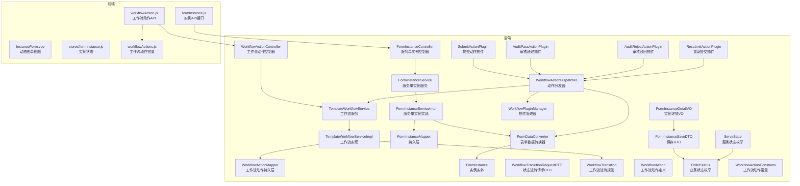
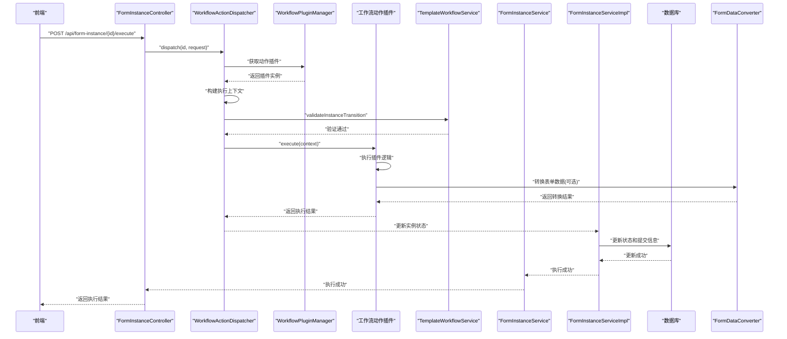
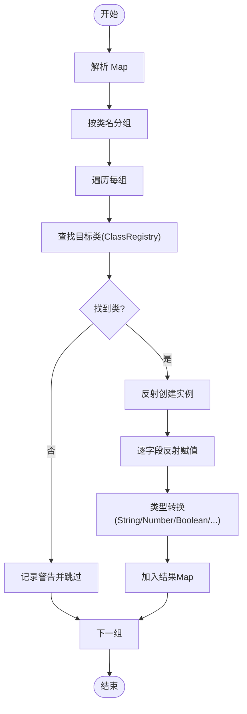
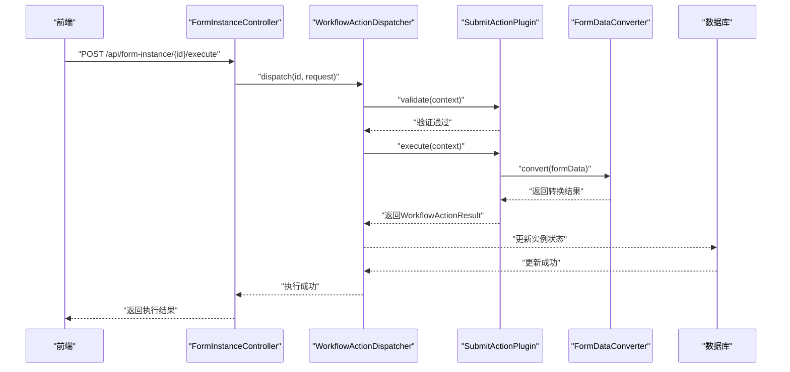
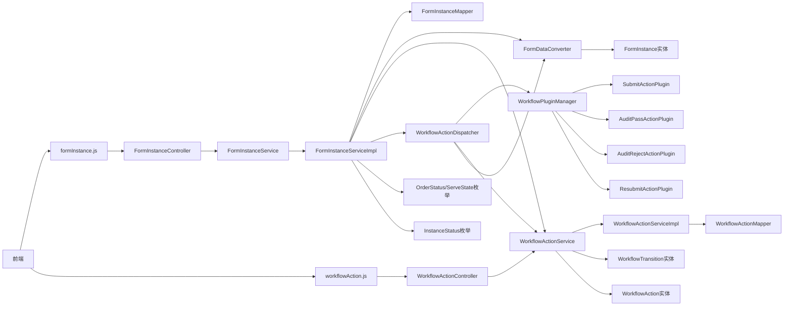
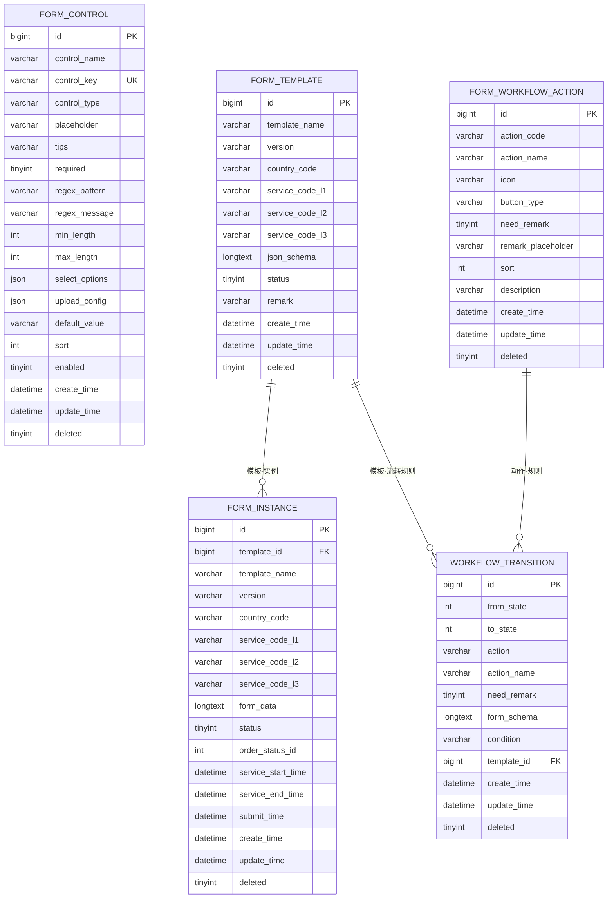

# 服务单实例API

<cite>
**本文档引用的文件**
- [FormInstanceController.java](file://genetics-server/src/main/java/com/genetics/controller/FormInstanceController.java)
- [WorkflowActionController.java](file://genetics-server/src/main/java/com/genetics/controller/WorkflowActionController.java)
- [FormInstanceService.java](file://genetics-server/src/main/java/com/genetics/service/FormInstanceService.java)
- [TemplateWorkflowService.java](file://genetics-server/src/main/java/com/genetics/service/TemplateWorkflowService.java)
- [WorkflowActionDispatcher.java](file://genetics-server/src/main/java/com/genetics/workflow/WorkflowActionDispatcher.java)
- [WorkflowActionResult.java](file://genetics-server/src/main/java/com/genetics/workflow/action/WorkflowActionResult.java)
- [SubmitActionPlugin.java](file://genetics-server/src/main/java/com/genetics/workflow/actions/SubmitActionPlugin.java)
- [AuditPassActionPlugin.java](file://genetics-server/src/main/java/com/genetics/workflow/actions/AuditPassActionPlugin.java)
- [AuditRejectActionPlugin.java](file://genetics-server/src/main/java/com/genetics/workflow/actions/AuditRejectActionPlugin.java)
- [ResubmitActionPlugin.java](file://genetics-server/src/main/java/com/genetics/workflow/actions/ResubmitActionPlugin.java)
- [formInstance.js](file://genetics-web/src/api/formInstance.js)
- [workflowAction.js](file://genetics-web/src/api/workflowAction.js)
- [workflowActions.js](file://genetics-web/src/constants/workflowActions.js)
- [FormInstanceCreateDTO.java](file://genetics-server/src/main/java/com/genetics/dto/FormInstanceCreateDTO.java)
- [FormInstanceSaveDTO.java](file://genetics-server/src/main/java/com/genetics/dto/FormInstanceSaveDTO.java)
- [FormInstanceDetailVO.java](file://genetics-server/src/main/java/com/genetics/dto/FormInstanceDetailVO.java)
- [WorkflowTransitionRequestDTO.java](file://genetics-server/src/main/java/com/genetics/dto/WorkflowTransitionRequestDTO.java)
- [FormInstance.java](file://genetics-server/src/main/java/com/genetics/entity/FormInstance.java)
- [WorkflowTransition.java](file://genetics-server/src/main/java/com/genetics/entity/workflow/WorkflowTransition.java)
- [WorkflowAction.java](file://genetics-server/src/main/java/com/genetics/entity/workflow/WorkflowAction.java)
- [OrderStatus.java](file://genetics-server/src/main/java/com/genetics/enums/OrderStatus.java)
- [InstanceStatus.java](file://genetics-server/src/main/java/com/genetics/enums/InstanceStatus.java)
- [ServeState.java](file://genetics-server/src/main/java/com/genetics/enums/ServeState.java)
- [WorkflowActionConstants.java](file://genetics-server/src/main/java/com/genetics/common/constants/WorkflowActionConstants.java)
</cite>

## 更新摘要
**变更内容**
- **API端点迁移**：原有的提交端点`/api/form-instance/{id}/submit`已迁移到统一的动作执行端点`/api/form-instance/{id}/execute`
- **executeAction方法**：前端API模块已更新为executeAction方法，提供更灵活的工作流动作支持
- **工作流插件系统**：引入基于PF4J的插件系统，支持动态加载和执行不同的工作流动作
- **WorkflowActionDispatcher**：新的动作分发器负责将动作请求分发到相应的插件执行
- **统一动作执行接口**：所有工作流动作现在通过统一的执行接口处理，支持更灵活的状态流转

## 目录
1. [简介](#简介)
2. [项目结构](#项目结构)
3. [核心组件](#核心组件)
4. [架构总览](#架构总览)
5. [详细组件分析](#详细组件分析)
6. [依赖关系分析](#依赖关系分析)
7. [性能考虑](#性能考虑)
8. [故障排查指南](#故障排查指南)
9. [结论](#结论)
10. [附录](#附录)

## 简介
本文件面向"服务单实例API"的完整使用与实现说明，涵盖实例创建、草稿保存、统一动作执行、业务状态管理、工作流动作插件系统和状态转换等核心流程，以及表单数据存储策略、FormDataConverter 数据转换机制、状态流转（草稿/已提交/已审核）等关键概念。文档同时提供接口定义、请求/响应示例、数据转换示例与最佳实践，帮助开发者快速理解并正确集成。

## 项目结构
该技术方案以"动态表单"为核心，围绕"自定义控件""服务单模板""服务单实例"三大模块构建，后端采用Spring Boot + MyBatis-Plus，前端采用Vue 3 + Element Plus。服务单实例API位于后端控制器层，负责实例生命周期管理与数据转换。新增的工作流插件系统通过独立的调度器和插件管理器实现灵活的动作执行。

**图表来源**
- [FormInstanceController.java: 28-36:28-36](file://genetics-server/src/main/java/com/genetics/controller/FormInstanceController.java#L28-L36)
- [WorkflowActionController.java: 15-17:15-17](file://genetics-server/src/main/java/com/genetics/controller/WorkflowActionController.java#L15-L17)
- [WorkflowActionDispatcher.java: 25-34:25-34](file://genetics-server/src/main/java/com/genetics/workflow/WorkflowActionDispatcher.java#L25-L34)
- [SubmitActionPlugin.java: 19-25:19-25](file://genetics-server/src/main/java/com/genetics/workflow/actions/SubmitActionPlugin.java#L19-L25)
- [AuditPassActionPlugin.java: 13-19:13-19](file://genetics-server/src/main/java/com/genetics/workflow/actions/AuditPassActionPlugin.java#L13-L19)
- [AuditRejectActionPlugin.java: 15-21:15-21](file://genetics-server/src/main/java/com/genetics/workflow/actions/AuditRejectActionPlugin.java#L15-L21)
- [ResubmitActionPlugin.java: 17-23:17-23](file://genetics-server/src/main/java/com/genetics/workflow/actions/ResubmitActionPlugin.java#L17-L23)

**章节来源**
- [FormInstanceController.java: 28-36:28-36](file://genetics-server/src/main/java/com/genetics/controller/FormInstanceController.java#L28-L36)
- [WorkflowActionController.java: 15-17:15-17](file://genetics-server/src/main/java/com/genetics/controller/WorkflowActionController.java#L15-L17)
- [WorkflowActionDispatcher.java: 25-34:25-34](file://genetics-server/src/main/java/com/genetics/workflow/WorkflowActionDispatcher.java#L25-L34)

## 核心组件
- **服务单实例控制器**：提供实例创建、草稿保存、统一动作执行、业务状态管理、详情查询、列表查询、工作流动作执行等接口。
- **工作流动作控制器**：提供工作流动作的增删改查管理接口。
- **服务单实例服务**：封装业务逻辑，协调持久层与数据转换器。
- **工作流服务**：管理模板工作流配置，验证状态流转合法性，执行状态转换。
- **工作流动作分发器**：统一的动作执行入口，负责将动作请求分发到相应的插件执行。
- **工作流插件管理器**：管理插件的加载、注册和执行。
- **工作流动作插件**：具体的动作实现，包括提交、审核通过、审核驳回、重新提交等。
- **服务单实例实现**：具体业务逻辑实现，包括实例创建、保存、统一动作执行、状态管理等功能。
- **工作流实现**：处理工作流配置、动作验证、状态转换逻辑。
- **实例持久层**：访问 form_instance 表，完成CRUD与状态更新。
- **工作流动作持久层**：访问 form_workflow_action 表，管理动作定义。
- **表单数据转换器**：将 Map<controlKey, value> 转换为业务实体对象，按类名分组并通过反射赋值。
- **业务实体**：FormInstance，用于承载实例数据。
- **工作流实体**：WorkflowTransition，定义状态流转规则；WorkflowAction，定义动作定义。
- **实例详情VO**：FormInstanceDetailVO，包含模板schema、控件详情、表单数据、业务状态等完整信息。
- **保存DTO**：FormInstanceSaveDTO，用于保存草稿数据，支持业务状态和时间信息。
- **状态流转请求DTO**：WorkflowTransitionRequestDTO，封装动作执行请求参数。
- **工作流动作结果**：WorkflowActionResult，封装动作执行结果和状态信息。
- **业务状态枚举**：OrderStatus，定义完整的业务状态管理。
- **服务状态枚举**：ServeState，定义服务状态选项。
- **工作流动作常量**：WorkflowActionConstants，定义标准工作流动作编码。

**章节来源**
- [FormInstanceController.java: 28-36:28-36](file://genetics-server/src/main/java/com/genetics/controller/FormInstanceController.java#L28-L36)
- [WorkflowActionController.java: 15-17:15-17](file://genetics-server/src/main/java/com/genetics/controller/WorkflowActionController.java#L15-L17)
- [FormInstanceService.java: 12-28:12-28](file://genetics-server/src/main/java/com/genetics/service/FormInstanceService.java#L12-L28)
- [TemplateWorkflowService.java: 14-92:14-92](file://genetics-server/src/main/java/com/genetics/service/TemplateWorkflowService.java#L14-L92)
- [WorkflowActionDispatcher.java: 25-34:25-34](file://genetics-server/src/main/java/com/genetics/workflow/WorkflowActionDispatcher.java#L25-L34)
- [WorkflowActionResult.java: 17-38:17-38](file://genetics-server/src/main/java/com/genetics/workflow/action/WorkflowActionResult.java#L17-L38)

## 架构总览
服务单实例API遵循"控制器-服务-实现-分发器-插件-持久层-转换器-实体"的分层架构，前端通过HTTP请求驱动后端完成实例生命周期管理，并通过统一的动作执行接口触发数据转换与状态更新。新增的工作流插件系统提供了灵活的状态流转控制，支持条件判断、动作配置和动态插件加载。

**图表来源**
- [FormInstanceController.java: 62-68:62-68](file://genetics-server/src/main/java/com/genetics/controller/FormInstanceController.java#L62-L68)
- [WorkflowActionDispatcher.java: 38-81:38-81](file://genetics-server/src/main/java/com/genetics/workflow/WorkflowActionDispatcher.java#L38-L81)
- [SubmitActionPlugin.java: 33-69:33-69](file://genetics-server/src/main/java/com/genetics/workflow/actions/SubmitActionPlugin.java#L33-L69)

**章节来源**
- [FormInstanceController.java: 62-68:62-68](file://genetics-server/src/main/java/com/genetics/controller/FormInstanceController.java#L62-L68)
- [WorkflowActionDispatcher.java: 38-81:38-81](file://genetics-server/src/main/java/com/genetics/workflow/WorkflowActionDispatcher.java#L38-L81)

## 详细组件分析

### 接口定义与流程说明

#### 3.3.1 根据模板创建服务单实例
- **方法与路径**
  - POST /api/form-instance/create
- **请求参数**
  - body: FormInstanceCreateDTO
    - templateId: number (必填)
- **响应数据**
  - FormInstanceDetailVO
    - instanceId: number
    - templateId: number
    - templateName: string
    - version: string
    - countryCode: string
    - serviceCodeL1: string
    - serviceCodeL2: string
    - serviceCodeL3: string
    - jsonSchema: object (解析后的JSON Schema)
    - controlDetails: array (控件详情列表)
    - formData: object (当前表单数据)
    - status: number (实例状态：0草稿, 1已提交, 2已审核)
    - orderStatusId: number (业务状态ID)
    - orderStatusName: string (业务状态名称)
    - serviceStartTime: string (ISO 8601格式)
    - serviceEndTime: string (ISO 8601格式)
    - submitTime: string (ISO 8601格式)
    - createTime: string (ISO 8601格式)
- **状态码**
  - 200 成功
- **错误处理**
  - 模板不存在：返回参数校验错误
  - 参数缺失：返回参数校验错误
- **流程要点**
  - 查询模板详情与控件明细
  - 初始化实例记录（状态=草稿，业务状态=待提交）
  - 返回包含完整信息的FormInstanceDetailVO

**章节来源**
- [FormInstanceController.java: 37-43:37-43](file://genetics-server/src/main/java/com/genetics/controller/FormInstanceController.java#L37-L43)
- [FormInstanceService.java: 14](file://genetics-server/src/main/java/com/genetics/service/FormInstanceService.java#L14)

#### 3.3.2 保存服务单数据（草稿）
- **方法与路径**
  - PUT /api/form-instance/{id}/save
- **请求参数**
  - path: id (实例ID)
  - body: FormInstanceSaveDTO
    - formData: map<string, any> (必填)
    - orderStatusId: number (可选，业务状态ID)
    - serviceStartTime: string (可选，服务开始时间)
    - serviceEndTime: string (可选，服务结束时间)
- **响应数据**
  - data: null
- **状态码**
  - 200 成功
- **错误处理**
  - 实例不存在：返回错误
  - 实例状态不允许：返回错误（已提交的实例不可修改）
  - formData格式不合法：返回校验错误
- **流程要点**
  - 将formData序列化为JSON字符串存入 form_data 字段
  - 支持同时更新业务状态和时间信息
  - 保持实例状态为草稿

**章节来源**
- [FormInstanceController.java: 45-52:45-52](file://genetics-server/src/main/java/com/genetics/controller/FormInstanceController.java#L45-L52)
- [FormInstanceService.java: 16](file://genetics-server/src/main/java/com/genetics/service/FormInstanceService.java#L16)

#### 3.3.3 统一动作执行接口
- **方法与路径**
  - POST /api/form-instance/{id}/execute
- **请求参数**
  - path: id (实例ID)
  - body: WorkflowTransitionRequestDTO
    - action: string (动作编码)
    - remark: string (备注/原因)
    - actionFormData: object (动作触发时的表单数据)
- **响应数据**
  - WorkflowActionResult
    - success: boolean (执行是否成功)
    - newStatus: number (新的业务状态ID)
    - data: object (附加数据，如转换后的实体对象)
    - message: string (执行结果消息)
- **状态码**
  - 200 成功
- **错误处理**
  - 实例不存在：返回错误
  - 未知动作编码：返回错误
  - 动作不合法：返回错误
  - 条件不满足：返回错误
  - 插件执行失败：返回错误
- **流程要点**
  - 通过插件管理器查找对应的动作插件
  - 构建执行上下文，包含实例、备注、表单数据等
  - 验证动作在当前状态下的合法性
  - 调用插件执行具体逻辑
  - 更新实例状态并返回执行结果

**更新** 新增统一动作执行接口，替代原有的专用提交端点，提供更灵活的工作流动作支持

**章节来源**
- [FormInstanceController.java: 54-68:54-68](file://genetics-server/src/main/java/com/genetics/controller/FormInstanceController.java#L54-L68)
- [WorkflowActionDispatcher.java: 38-81:38-81](file://genetics-server/src/main/java/com/genetics/workflow/WorkflowActionDispatcher.java#L38-L81)
- [WorkflowActionResult.java: 17-38:17-38](file://genetics-server/src/main/java/com/genetics/workflow/action/WorkflowActionResult.java#L17-L38)

#### 3.3.4 获取服务单详情
- **方法与路径**
  - GET /api/form-instance/{id}
- **请求参数**
  - path: id (实例ID)
- **响应数据**
  - FormInstanceDetailVO (同创建接口的响应结构)
- **状态码**
  - 200 成功
- **错误处理**
  - 实例不存在：返回错误

**章节来源**
- [FormInstanceController.java: 70-76:70-76](file://genetics-server/src/main/java/com/genetics/controller/FormInstanceController.java#L70-L76)
- [FormInstanceService.java: 25](file://genetics-server/src/main/java/com/genetics/service/FormInstanceService.java#L25)

#### 3.3.5 查询服务单实例列表
- **方法与路径**
  - GET /api/form-instance/list
- **查询参数**
  - page: number (默认1)
  - size: number (默认20)
  - status: number (可选，0=草稿, 1=已提交, 2=已审核)
  - orderStatusId: number (可选，业务状态ID)
- **响应数据**
  - total: number
  - records: array (FormInstance实体列表)
- **状态码**
  - 200 成功
- **错误处理**
  - 参数非法：返回校验错误

**章节来源**
- [FormInstanceController.java: 78-88:78-88](file://genetics-server/src/main/java/com/genetics/controller/FormInstanceController.java#L78-L88)
- [FormInstanceService.java: 27](file://genetics-server/src/main/java/com/genetics/service/FormInstanceService.java#L27)

#### 3.3.6 获取业务状态选项
- **方法与路径**
  - GET /api/form-instance/order-status/options
- **响应数据**
  - array (ServeState枚举)
    - code: number (状态代码)
    - name: string (状态名称)
    - tagType: string (前端标签类型)
- **状态码**
  - 200 成功
- **业务状态定义**
  - 10 待提交 (info)
  - 20 待审核 (warning)
  - 30 待递交 (warning)
  - 31 组织处理 (primary)
  - 32 税局处理 (primary)
  - 33 当地同事处理 (primary)
  - 40 已完成 (success)
  - 50 已驳回 (danger)
  - 99 已终止 (danger)

**更新** 业务状态枚举已从OrderStatus改为ServeState，提供更全面的服务状态选项

**章节来源**
- [FormInstanceController.java: 90-103:90-103](file://genetics-server/src/main/java/com/genetics/controller/FormInstanceController.java#L90-L103)
- [ServeState.java](file://genetics-server/src/main/java/com/genetics/enums/ServeState.java)

#### 3.3.7 获取实例可用的工作流动作
- **方法与路径**
  - GET /api/form-instance/{id}/available-actions
- **请求参数**
  - path: id (实例ID)
- **响应数据**
  - array (WorkflowTransition)
    - from: number (起始状态)
    - to: number (目标状态)
    - action: string (动作编码)
    - actionName: string (动作名称)
    - needRemark: boolean (是否需要备注)
    - formSchema: string (动作表单配置)
    - condition: string (条件)
- **状态码**
  - 200 成功
- **错误处理**
  - 实例不存在：返回错误
- **流程要点**
  - 基于实例当前状态和模板配置计算可用动作
  - 支持条件判断（如VAT/EPR）
  - 包含终止操作的特殊处理

**章节来源**
- [FormInstanceController.java: 105-114:105-114](file://genetics-server/src/main/java/com/genetics/controller/FormInstanceController.java#L105-L114)
- [TemplateWorkflowService.java: 72](file://genetics-server/src/main/java/com/genetics/service/TemplateWorkflowService.java#L72)

#### 3.3.8 工作流动作管理接口
- **获取动作列表**
  - GET /api/workflow/actions/list
  - 响应：List<WorkflowAction>
- **保存动作**
  - POST /api/workflow/actions
  - 请求：WorkflowAction
  - 响应：boolean
- **删除动作**
  - DELETE /api/workflow/actions/{id}
  - 响应：boolean
- **动作实体字段**
  - actionCode: string (动作编码)
  - actionName: string (动作名称)
  - icon: string (图标)
  - buttonType: string (按钮类型)
  - needRemark: boolean (是否需要备注)
  - remarkPlaceholder: string (备注提示语)
  - sort: number (排序)
  - description: string (描述)

**章节来源**
- [WorkflowActionController.java: 18-31:18-31](file://genetics-server/src/main/java/com/genetics/controller/WorkflowActionController.java#L18-L31)
- [WorkflowAction.java](file://genetics-server/src/main/java/com/genetics/entity/workflow/WorkflowAction.java)

### 工作流插件系统与状态转换机制
- **工作流插件系统**
  - WorkflowActionDispatcher：统一的动作执行入口，负责插件分发和执行
  - WorkflowPluginManager：管理插件的加载、注册和执行
  - 工作流动作插件：具体的动作实现，支持动态扩展
- **插件类型**
  - SubmitActionPlugin：提交动作，将表单数据转换为业务实体
  - AuditPassActionPlugin：审核通过动作，直接流转到下一状态
  - AuditRejectActionPlugin：审核驳回动作，重置为草稿状态
  - ResubmitActionPlugin：重新提交动作，更新提交状态和时间
- **状态转换流程**
  - 通过插件管理器查找对应插件
  - 构建执行上下文，包含实例、备注、表单数据等
  - 验证动作在当前状态下的合法性
  - 调用插件执行具体逻辑
  - 更新实例状态并返回执行结果

**更新** 新增工作流插件系统，提供更灵活和可扩展的动作执行机制

**章节来源**
- [WorkflowActionDispatcher.java: 25-34:25-34](file://genetics-server/src/main/java/com/genetics/workflow/WorkflowActionDispatcher.java#L25-L34)
- [SubmitActionPlugin.java: 19-25:19-25](file://genetics-server/src/main/java/com/genetics/workflow/actions/SubmitActionPlugin.java#L19-L25)
- [AuditPassActionPlugin.java: 13-19:13-19](file://genetics-server/src/main/java/com/genetics/workflow/actions/AuditPassActionPlugin.java#L13-L19)
- [AuditRejectActionPlugin.java: 15-21:15-21](file://genetics-server/src/main/java/com/genetics/workflow/actions/AuditRejectActionPlugin.java#L15-L21)
- [ResubmitActionPlugin.java: 17-23:17-23](file://genetics-server/src/main/java/com/genetics/workflow/actions/ResubmitActionPlugin.java#L17-L23)

### 表单数据结构与存储策略
- **存储位置**
  - form_instance 表的 form_data 字段，存储 Map<controlKey, value> 的JSON字符串
- **key 命名规范**
  - ClassName.fieldName，与 controlKey 保持一致
- **value 类型**
  - 文本：String
  - 开关：Boolean
  - 数字：Number
  - 文件上传：List<{ fileName, fileUrl, fileSize }>
  - 日期：String（ISO 8601格式 yyyy-MM-dd）
- **新增字段**
  - orderStatusId：业务状态ID，默认10（待提交）
  - serviceStartTime：服务开始时间
  - serviceEndTime：服务结束时间
  - submitTime：提交时间

**章节来源**
- [FormInstance.java](file://genetics-server/src/main/java/com/genetics/entity/FormInstance.java)

### 动态渲染机制
- **前端根据 jsonSchema 生成CSS Grid布局**
- **根据 controlType 渲染对应组件**：
  - INPUT → el-input
  - SELECT → el-select
  - SWITCH → el-switch
  - UPLOAD → el-upload（读取 uploadConfig 配置）
  - TEXTAREA → el-input type="textarea"
  - DATE → el-date-picker
  - NUMBER → el-input-number
- **校验规则来源于 controlDetail 中的 regexPattern/required/minLength/maxLength**
- **formData 维护 Map<controlKey, value>，保存时原样传给后端**
- **业务状态显示**：使用orderStatusName进行前端展示

**章节来源**
- [FormInstanceDetailVO.java](file://genetics-server/src/main/java/com/genetics/dto/FormInstanceDetailVO.java)

### FormDataConverter 数据转换机制
- **输入**
  - Map<"ClassName.fieldName", value>
- **处理流程**
  - 按类名分组
  - 反射创建目标类实例并赋值字段
  - 类型转换：String/Integer/Long/Boolean/BigDecimal
- **输出**
  - Map<ClassName, 实体对象>
- **注意事项**
  - CLASS_REGISTRY 需注册业务实体类
  - controlKey 必须符合"ClassName.fieldName"格式
  - 未注册类或字段缺失会记录警告并跳过

**图表来源**
- [SubmitActionPlugin.java: 34-43:34-43](file://genetics-server/src/main/java/com/genetics/workflow/actions/SubmitActionPlugin.java#L34-L43)

**章节来源**
- [SubmitActionPlugin.java: 34-43:34-43](file://genetics-server/src/main/java/com/genetics/workflow/actions/SubmitActionPlugin.java#L34-L43)

### 状态流转（草稿/已提交/已审核）
- **实例状态**
  - 草稿：0，创建实例后初始状态
  - 已提交：1，提交动作将状态更新为已提交
  - 已审核：2，后续业务流程中更新为已审核
- **业务状态**
  - 待提交：10，实例创建后的默认业务状态
  - 待审核：20，等待审核
  - 待递交：30，等待递交
  - 组织处理：31，组织处理中
  - 税局处理：32，税局处理中
  - 当地同事处理：33，当地同事处理中
  - 已完成：40，处理完成
  - 已驳回：50，处理被驳回
  - 已终止：99，处理终止
- **并发控制**：建议对实例记录增加version字段进行乐观锁控制

**更新** 业务状态枚举已从OrderStatus改为ServeState，提供更全面的状态选项

**章节来源**
- [InstanceStatus.java](file://genetics-server/src/main/java/com/genetics/enums/InstanceStatus.java)
- [ServeState.java](file://genetics-server/src/main/java/com/genetics/enums/ServeState.java)

### 工作流动作常量定义
- **标准动作**
  - submit：提交
  - auditPass：审核通过
  - auditReject：审核驳回
  - resubmit：重新提交
  - submitLocal：递交当地同事
  - submitTax：递交税局
  - submitOrg：递交组织
  - complete：完成
  - terminate：终止
- **用途**
  - 前端动作选择
  - 后端动作验证
  - 工作流配置参考

**章节来源**
- [WorkflowActionConstants.java: 8-34:8-34](file://genetics-server/src/main/java/com/genetics/common/constants/WorkflowActionConstants.java#L8-L34)

### 统一动作执行接口时序（代码级）

**图表来源**
- [FormInstanceController.java: 62-68:62-68](file://genetics-server/src/main/java/com/genetics/controller/FormInstanceController.java#L62-L68)
- [WorkflowActionDispatcher.java: 38-81:38-81](file://genetics-server/src/main/java/com/genetics/workflow/WorkflowActionDispatcher.java#L38-L81)

### 工作流插件执行时序（代码级）

**图表来源**
- [WorkflowActionDispatcher.java: 38-81:38-81](file://genetics-server/src/main/java/com/genetics/workflow/WorkflowActionDispatcher.java#L38-L81)
- [SubmitActionPlugin.java: 33-69:33-69](file://genetics-server/src/main/java/com/genetics/workflow/actions/SubmitActionPlugin.java#L33-L69)

## 依赖关系分析
- **控制器依赖服务层和分发器**
- **服务层依赖实现层与持久层**
- **实现层依赖转换器、工作流服务与枚举**
- **转换器依赖业务实体类注册表**
- **工作流服务依赖配置和动作定义**
- **分发器依赖插件管理器和插件系统**
- **插件依赖上下文和转换器**
- **前端依赖控制器提供的接口**

**图表来源**
- [formInstance.js: 1-22:1-22](file://genetics-web/src/api/formInstance.js#L1-L22)
- [workflowAction.js: 1-24:1-24](file://genetics-web/src/api/workflowAction.js#L1-L24)
- [FormInstanceController.java: 28-36:28-36](file://genetics-server/src/main/java/com/genetics/controller/FormInstanceController.java#L28-L36)
- [WorkflowActionController.java: 15-17:15-17](file://genetics-server/src/main/java/com/genetics/controller/WorkflowActionController.java#L15-L17)
- [WorkflowActionDispatcher.java: 25-34:25-34](file://genetics-server/src/main/java/com/genetics/workflow/WorkflowActionDispatcher.java#L25-L34)

**章节来源**
- [formInstance.js: 1-22:1-22](file://genetics-web/src/api/formInstance.js#L1-L22)
- [workflowAction.js: 1-24:1-24](file://genetics-web/src/api/workflowAction.js#L1-L24)
- [FormInstanceController.java: 28-36:28-36](file://genetics-server/src/main/java/com/genetics/controller/FormInstanceController.java#L28-L36)

## 性能考虑
- **数据库层面**
  - form_instance 表对 template_id 建有索引，便于按模板查询
  - form_data 使用LONGTEXT存储，注意避免过大JSON导致I/O压力
  - 新增orderStatusId字段，建议建立索引以优化查询性能
  - form_workflow_action 表存储工作流动作定义，建议建立索引
- **服务层**
  - 统一动作执行时一次性解析与转换，建议对大数据量场景进行分批或异步处理
  - 工作流验证涉及多次规则匹配，建议缓存常用配置
  - 转换器使用LinkedHashMap保证顺序，有利于调试与日志输出
  - 业务状态更新为轻量级操作，性能开销较小
- **插件系统**
  - 插件管理器支持动态加载，建议缓存已加载的插件实例
  - 插件执行过程中的数据转换可能产生额外开销，建议优化转换逻辑
  - 并发执行多个插件时需要注意线程安全和资源竞争
- **前端**
  - 动态渲染基于jsonSchema，建议缓存控件配置与校验规则，减少重复计算
  - 业务状态选项一次性获取，避免频繁网络请求
  - 工作流动作列表缓存，减少重复查询

**更新** 新增插件系统的性能考虑，包括插件管理器缓存和并发执行优化

**章节来源**
- [FormInstance.java](file://genetics-server/src/main/java/com/genetics/entity/FormInstance.java)
- [WorkflowActionDispatcher.java: 38-81:38-81](file://genetics-server/src/main/java/com/genetics/workflow/WorkflowActionDispatcher.java#L38-L81)

## 故障排查指南
- **controlKey 格式错误**
  - 现象：转换器跳过无效key
  - 处理：确保controlKey为"ClassName.fieldName"格式
- **未注册实体类**
  - 现象：转换器记录警告并跳过该类
  - 处理：在CLASS_REGISTRY中注册对应实体类
- **实例状态不允许**
  - 现象：保存/执行动作接口返回错误
  - 处理：检查当前状态与业务流程是否匹配
- **formData格式不合法**
  - 现象：执行动作时解析失败
  - 处理：前端确保formData为合法Map结构
- **业务状态ID无效**
  - 现象：更新业务状态接口返回错误
  - 处理：使用ServeState枚举中的有效状态ID
- **工作流动作不合法**
  - 现象：执行状态流转返回错误
  - 处理：检查动作编码是否在可用动作列表中
- **条件不满足**
  - 现象：状态转换被拒绝
  - 处理：检查业务类型和上下文数据是否满足条件
- **插件执行失败**
  - 现象：统一动作执行返回错误
  - 处理：检查插件实现和上下文数据
- **未知动作编码**
  - 现象：插件管理器找不到对应插件
  - 处理：确认动作编码是否正确且插件已注册
- **并发覆盖**
  - 现象：保存时被其他请求覆盖
  - 处理：引入version字段进行乐观锁控制

**更新** 新增插件系统相关的故障排查指南，包括插件执行失败和未知动作编码等问题

**章节来源**
- [WorkflowActionDispatcher.java: 42-46:42-46](file://genetics-server/src/main/java/com/genetics/workflow/WorkflowActionDispatcher.java#L42-L46)
- [SubmitActionPlugin.java: 72-80:72-80](file://genetics-server/src/main/java/com/genetics/workflow/actions/SubmitActionPlugin.java#L72-L80)

## 结论
服务单实例API通过清晰的接口边界与稳定的表单数据存储策略，实现了从模板创建实例、草稿保存到统一动作执行的完整闭环。新增的工作流插件系统和统一的动作执行接口进一步增强了系统的灵活性和可扩展性。通过插件化的动作执行机制，系统支持复杂的业务流程控制，包括条件判断、状态约束、动态插件加载和灵活的状态转换。结合FormDataConverter的反射转换机制与前端动态渲染能力，系统具备良好的扩展性与可维护性。建议在生产环境中完善插件管理、并发控制、数据安全与监控告警，以保障高可用与一致性。

## 附录

### 数据模型概览

**图表来源**
- [FormInstance.java](file://genetics-server/src/main/java/com/genetics/entity/FormInstance.java)
- [WorkflowAction.java](file://genetics-server/src/main/java/com/genetics/entity/workflow/WorkflowAction.java)
- [WorkflowTransition.java](file://genetics-server/src/main/java/com/genetics/entity/workflow/WorkflowTransition.java)

### 业务状态枚举定义
- **待提交**：10，前端标签类型info
- **待审核**：20，前端标签类型warning  
- **待递交**：30，前端标签类型warning
- **组织处理**：31，前端标签类型primary
- **税局处理**：32，前端标签类型primary
- **当地同事处理**：33，前端标签类型primary
- **已完成**：40，前端标签类型success
- **已驳回**：50，前端标签类型danger
- **已终止**：99，前端标签类型danger

**更新** 业务状态枚举已从OrderStatus改为ServeState，提供更全面的状态选项

**章节来源**
- [ServeState.java](file://genetics-server/src/main/java/com/genetics/enums/ServeState.java)

### 工作流动作常量定义
- **submit**：提交
- **auditPass**：审核通过
- **auditReject**：审核驳回
- **resubmit**：重新提交
- **submitLocal**：递交当地同事
- **submitTax**：递交税局
- **submitOrg**：递交组织
- **complete**：完成
- **terminate**：终止

**章节来源**
- [WorkflowActionConstants.java: 8-34:8-34](file://genetics-server/src/main/java/com/genetics/common/constants/WorkflowActionConstants.java#L8-L34)

### 工作流状态转换规则示例
- **标准流程**
  - 10 → 20：submit（提交）
  - 20 → 30：auditPass（审核通过）
  - 20 → 50：auditReject（审核驳回）
  - 50 → 20：resubmit（重新提交）
- **业务类型分支**
  - VAT：30 → 32（submitTax），33 → 32（submitTax）
  - EPR：30 → 31（submitOrg），33 → 31（submitOrg）
- **终止操作**
  - 任意状态 → 99：terminate（终止）

**章节来源**
- [TemplateWorkflowService.java: 72](file://genetics-server/src/main/java/com/genetics/service/TemplateWorkflowService.java#L72)

### 工作流插件系统架构
- **插件管理器**
  - 动态加载和注册工作流动作插件
  - 提供插件生命周期管理
  - 支持插件间的依赖关系
- **插件接口**
  - AbstractWorkflowAction：定义插件的基本接口
  - validate：插件自定义验证逻辑
  - doExecute：插件核心执行逻辑
  - getActionCode/getActionName：插件标识信息
- **插件类型**
  - SubmitActionPlugin：表单数据转换和提交
  - AuditPassActionPlugin：简单状态流转
  - AuditRejectActionPlugin：状态重置和备注要求
  - ResubmitActionPlugin：重新提交逻辑

**更新** 新增工作流插件系统架构说明，包括插件管理器和插件接口设计

**章节来源**
- [WorkflowActionDispatcher.java: 25-34:25-34](file://genetics-server/src/main/java/com/genetics/workflow/WorkflowActionDispatcher.java#L25-L34)
- [SubmitActionPlugin.java: 19-25:19-25](file://genetics-server/src/main/java/com/genetics/workflow/actions/SubmitActionPlugin.java#L19-L25)
- [AuditPassActionPlugin.java: 13-19:13-19](file://genetics-server/src/main/java/com/genetics/workflow/actions/AuditPassActionPlugin.java#L13-L19)
- [AuditRejectActionPlugin.java: 15-21:15-21](file://genetics-server/src/main/java/com/genetics/workflow/actions/AuditRejectActionPlugin.java#L15-L21)
- [ResubmitActionPlugin.java: 17-23:17-23](file://genetics-server/src/main/java/com/genetics/workflow/actions/ResubmitActionPlugin.java#L17-L23)