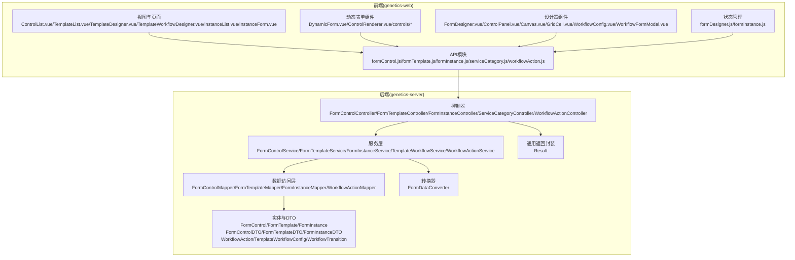
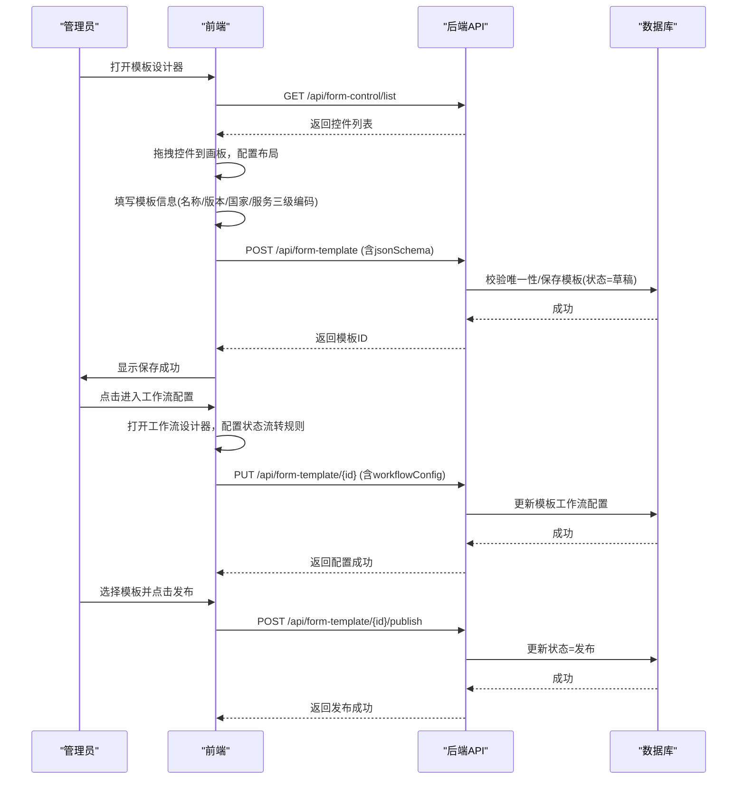
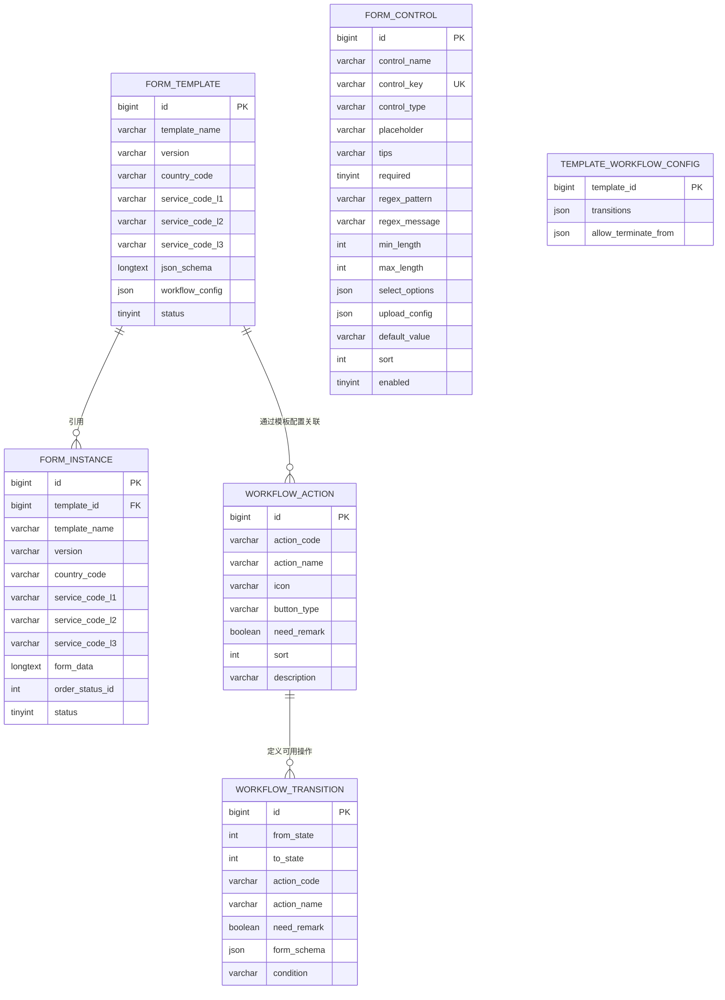
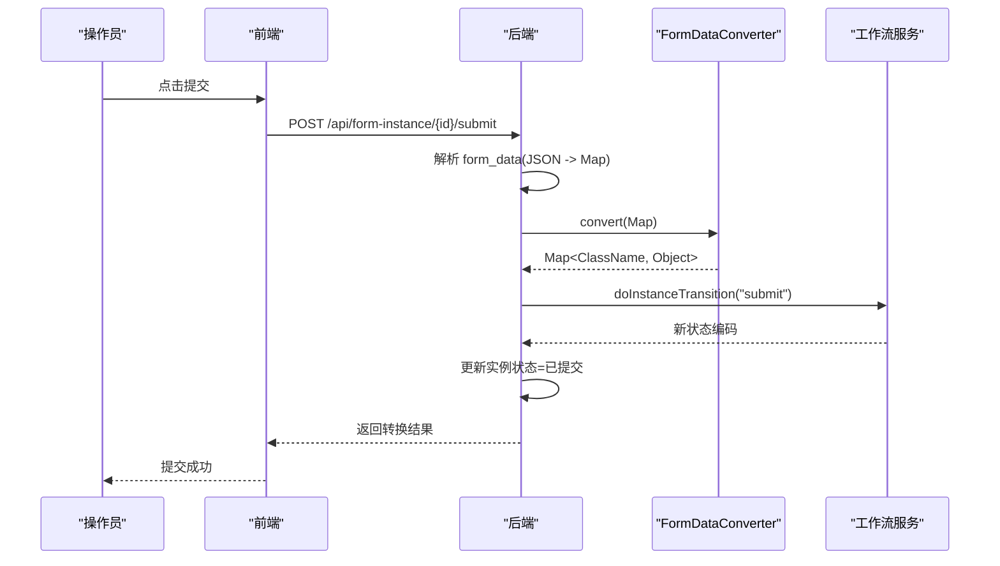
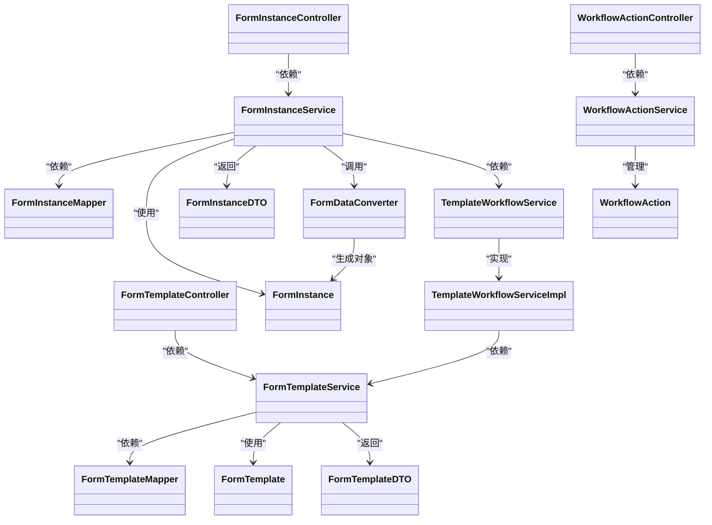

# 服务单模板API

<cite>
**本文引用的文件**
- [VAT_EPR_动态表单技术方案.md](file://VAT_EPR_动态表单技术方案.md)
- [FormTemplate.java](file://genetics-server/src/main/java/com/genetics/entity/FormTemplate.java)
- [TemplateWorkflowConfig.java](file://genetics-server/src/main/java/com/genetics/entity/workflow/TemplateWorkflowConfig.java)
- [WorkflowTransition.java](file://genetics-server/src/main/java/com/genetics/entity/workflow/WorkflowTransition.java)
- [TemplateWorkflowService.java](file://genetics-server/src/main/java/com/genetics/service/TemplateWorkflowService.java)
- [TemplateWorkflowServiceImpl.java](file://genetics-server/src/main/java/com/genetics/service/impl/TemplateWorkflowServiceImpl.java)
- [FormTemplateController.java](file://genetics-server/src/main/java/com/genetics/controller/FormTemplateController.java)
- [FormTemplateService.java](file://genetics-server/src/main/java/com/genetics/service/FormTemplateService.java)
- [FormTemplateServiceImpl.java](file://genetics-server/src/main/java/com/genetics/service/impl/FormTemplateServiceImpl.java)
- [FormInstanceController.java](file://genetics-server/src/main/java/com/genetics/controller/FormInstanceController.java)
- [FormInstanceServiceImpl.java](file://genetics-server/src/main/java/com/genetics/service/impl/FormInstanceServiceImpl.java)
- [WorkflowDesigner.vue](file://genetics-web/src/views/template/WorkflowDesigner.vue)
- [WorkflowConfig.vue](file://genetics-web/src/components/FormDesigner/WorkflowConfig.vue)
- [formTemplate.js](file://genetics-web/src/api/formTemplate.js)
- [004-add-workflow-config.sql](file://genetics-server/src/main/resources/db/changelog/sql/004-add-workflow-config.sql)
</cite>

## 目录
1. [简介](#简介)
2. [项目结构](#项目结构)
3. [核心组件](#核心组件)
4. [架构总览](#架构总览)
5. [详细组件分析](#详细组件分析)
6. [依赖关系分析](#依赖关系分析)
7. [性能考虑](#性能考虑)
8. [故障排查指南](#故障排查指南)
9. [结论](#结论)
10. [附录](#附录)

## 简介
本文件面向服务单模板管理API的完整使用与实现说明，涵盖模板的创建/保存、查询列表、查询详情、更新以及发布等全流程。重点解释以下核心概念：
- JSON Schema 的布局与控件引用机制
- 模板状态管理（草稿/发布）
- 版本控制策略
- 国家代码与服务类型三级联动
- 控件与模板的解耦设计与运行时渲染
- **新增：模板级工作流配置管理** - 支持通过可视化设计器配置模板的业务流程状态流转规则

同时提供接口规范、请求/响应示例、错误处理建议与最佳实践，帮助开发者快速理解并正确集成。

## 项目结构
该仓库包含一份完整的技术方案文档，其中定义了服务端与前端的模块划分、数据库表结构、接口规范、核心算法与业务流程。后端采用Spring Boot + MyBatis-Plus，前端采用Vue 3 + Element Plus，整体遵循分层架构与职责分离。

**图表来源**
- [FormTemplateController.java:1-63](file://genetics-server/src/main/java/com/genetics/controller/FormTemplateController.java#L1-L63)
- [WorkflowActionController.java:1-32](file://genetics-server/src/main/java/com/genetics/controller/WorkflowActionController.java#L1-L32)

**章节来源**
- [VAT_EPR_动态表单技术方案.md: 773-852:773-852](file://VAT_EPR_动态表单技术方案.md#L773-L852)

## 核心组件
- 数据模型
  - 自定义控件表：定义控件元数据（名称、类型、校验规则、默认值、上传配置等），用于模板画板拖拽与运行时渲染。
  - 服务单模板表：存储模板名称、版本、国家代码、服务三级编码、JSON Schema布局与控件引用、状态（草稿/发布）、**工作流配置**。
  - 服务单实例表：基于模板创建的实例，存储表单数据（Map<controlKey, value>序列化）、状态（草稿/已提交/已审核）、**业务状态（ServeState）**。
  - **新增：工作流配置实体**：TemplateWorkflowConfig、WorkflowTransition、WorkflowAction，支持模板级业务流程配置。
- 核心算法
  - FormDataConverter：将 Map<controlKey, value> 按 ClassName 分组并通过反射转换为业务实体对象，供提交阶段使用。
  - **新增：TemplateWorkflowServiceImpl**：实现模板工作流配置的获取、验证和执行状态流转。
- 接口体系
  - 自定义控件API：创建、查询列表、更新、删除。
  - 服务单模板API：创建/保存、查询列表、查询详情、更新、发布。
  - 服务单实例API：根据模板创建实例、保存草稿、提交、查询列表、**状态流转**。
  - 服务类目API：透传既存系统的一级/二级/三级联动。
  - **新增：工作流动作API**：工作流动作的增删改查，支持模板级工作流配置。

**章节来源**
- [VAT_EPR_动态表单技术方案.md: 31-163:31-163](file://VAT_EPR_动态表单技术方案.md#L31-L163)
- [VAT_EPR_动态表单技术方案.md: 592-728:592-728](file://VAT_EPR_动态表单技术方案.md#L592-L728)

## 架构总览
服务单模板API贯穿"模板设计—模板发布—实例创建—数据提交—工作流流转"的完整链路。模板设计阶段通过控件列表与画板生成JSON Schema；发布后模板不可再修改布局，保障历史实例数据一致性；实例创建时携带模板Schema与控件详情，前端按Schema动态渲染表单；填写完成后保存草稿或提交，提交阶段触发数据转换与状态更新；**新增的工作流配置支持通过可视化设计器配置模板的业务流程，实例可在不同业务状态下执行相应的工作流操作**。

**图表来源**
- [FormTemplateController.java:25-41](file://genetics-server/src/main/java/com/genetics/controller/FormTemplateController.java#L25-L41)
- [WorkflowDesigner.vue:61-79](file://genetics-web/src/views/template/WorkflowDesigner.vue#L61-L79)

**章节来源**
- [VAT_EPR_动态表单技术方案.md: 415-435:415-435](file://VAT_EPR_动态表单技术方案.md#L415-L435)
- [VAT_EPR_动态表单技术方案.md: 225-302:225-302](file://VAT_EPR_动态表单技术方案.md#L225-L302)

## 详细组件分析

### 服务单模板API接口规范
以下为服务单模板相关接口的HTTP方法、URL路径、请求参数、响应格式、状态码说明与错误处理要点。为避免泄露具体代码，此处不直接展示代码片段，而以"路径+行号"形式标注来源。

- 创建/保存模板
  - 方法与路径：POST /api/form-template
  - 请求体字段（示例字段与含义见下表）
  - 响应：统一返回结构，包含code/message/data
  - 状态码：200 成功；400 参数错误；500 服务器异常
  - 错误处理：校验controlKey唯一性与格式；校验模板版本与国家/服务编码组合唯一性（建议）
  - **新增字段**：workflowConfig（工作流配置JSON对象）
  - 来源：[FormTemplateController.java:25-29](file://genetics-server/src/main/java/com/genetics/controller/FormTemplateController.java#L25-L29)

- 查询模板列表
  - 方法与路径：GET /api/form-template/list
  - 查询参数：countryCode、serviceCodeL3、page、size
  - 响应：分页结构，包含total与records
  - 状态码：200 成功；400 参数错误；500 服务器异常
  - 错误处理：参数校验与分页边界检查
  - 来源：[FormTemplateController.java:54-61](file://genetics-server/src/main/java/com/genetics/controller/FormTemplateController.java#L54-L61)

- 查询模板详情
  - 方法与路径：GET /api/form-template/{id}
  - 路径参数：id
  - 响应：包含模板基础信息与controlDetails（控件详情数组）、**workflowConfig（工作流配置）**
  - 状态码：200 成功；404 未找到；500 服务器异常
  - 错误处理：模板不存在、权限校验（如有）
  - 来源：[FormTemplateController.java:49-52](file://genetics-server/src/main/java/com/genetics/controller/FormTemplateController.java#L49-L52)

- 更新模板
  - 方法与路径：PUT /api/form-template/{id}
  - 路径参数：id
  - 请求体字段：同创建接口（除状态字段）、**新增workflowConfig字段**
  - 状态码：200 成功；400 参数错误；500 服务器异常
  - 错误处理：发布后禁止修改布局（建议）
  - 来源：[FormTemplateController.java:31-35](file://genetics-server/src/main/java/com/genetics/controller/FormTemplateController.java#L31-L35)

- 发布模板
  - 方法与路径：POST /api/form-template/{id}/publish
  - 路径参数：id
  - 响应：统一返回结构
  - 状态码：200 成功；400 参数错误；500 服务器异常
  - 错误处理：发布前校验模板状态、必要字段完整性
  - 来源：[FormTemplateController.java:37-41](file://genetics-server/src/main/java/com/genetics/controller/FormTemplateController.java#L37-L41)

**章节来源**
- [VAT_EPR_动态表单技术方案.md: 225-302:225-302](file://VAT_EPR_动态表单技术方案.md#L225-L302)

### 模板工作流配置管理

#### 工作流配置实体结构
- TemplateWorkflowConfig：模板工作流配置
  - transitions：流转规则列表
  - allowTerminateFrom：允许终止的状态列表
- WorkflowTransition：状态流转规则
  - from：起始状态编码
  - to：目标状态编码
  - action：操作编码
  - actionName：操作名称
  - needRemark：是否需要备注
  - formSchema：动作关联的表单配置（JSON Schema）
  - condition：适用条件（VAT/EPR/null）

#### 工作流服务接口
- TemplateWorkflowService：模板工作流服务接口
  - getWorkflowConfig：获取模板工作流配置
  - getAvailableActions：获取当前状态可用的操作列表
  - validateTransition：验证状态流转是否合法
  - doTransition：执行状态流转
  - getInstanceAvailableActions：获取实例的可用操作
  - validateInstanceTransition：验证实例状态流转
  - doInstanceTransition：执行实例状态流转

#### 工作流配置API
- 工作流动作管理
  - GET /api/workflow/actions/list：获取所有可用的动作列表
  - POST /api/workflow/actions：保存工作流动作
  - DELETE /api/workflow/actions/{id}：删除工作流动作
- 实例状态流转
  - GET /api/form-instance/{id}/available-actions：获取实例可用操作列表
  - POST /api/form-instance/{id}/transition：执行状态流转

**章节来源**
- [TemplateWorkflowConfig.java:1-100](file://genetics-server/src/main/java/com/genetics/entity/workflow/TemplateWorkflowConfig.java#L1-L100)
- [WorkflowTransition.java:1-46](file://genetics-server/src/main/java/com/genetics/entity/workflow/WorkflowTransition.java#L1-L46)
- [TemplateWorkflowService.java:1-92](file://genetics-server/src/main/java/com/genetics/service/TemplateWorkflowService.java#L1-L92)
- [TemplateWorkflowServiceImpl.java:1-207](file://genetics-server/src/main/java/com/genetics/service/impl/TemplateWorkflowServiceImpl.java#L1-L207)

### JSON Schema 结构设计与控件引用机制
- 布局与网格
  - layout: grid
  - columns: 列数
  - rows: 行数组，每行包含 rowIndex 与 cells
- 单元格与控件
  - cells: 单元格数组，每个单元格包含 colIndex、colSpan、controlId、controlKey、controlType、label
  - controlKey 与 controlType 用于运行时渲染与校验
- 控件详情
  - 控件详情数组（controlDetails）在模板详情接口返回，包含控件名称、类型、必填、正则、提示、上传配置等
- 控件引用与渲染
  - 前端根据 controlType 渲染对应组件，并依据 controlDetails 动态生成校验规则
  - 表单数据以 Map<controlKey, value> 形式存储于实例表的 form_data 字段

**图表来源**
- [FormTemplate.java:1-65](file://genetics-server/src/main/java/com/genetics/entity/FormTemplate.java#L1-L65)
- [TemplateWorkflowConfig.java:1-100](file://genetics-server/src/main/java/com/genetics/entity/workflow/TemplateWorkflowConfig.java#L1-L100)
- [WorkflowTransition.java:1-46](file://genetics-server/src/main/java/com/genetics/entity/workflow/WorkflowTransition.java#L1-L46)

**章节来源**
- [VAT_EPR_动态表单技术方案.md: 482-548:482-548](file://VAT_EPR_动态表单技术方案.md#L482-L548)

### 模板状态管理与版本控制
- 状态
  - 草稿：可编辑、可删除
  - 发布：不可修改布局，可作为实例创建的来源
- 版本控制
  - 版本号字段用于区分相同模板的不同版本
  - 发布后若需变更布局，应新建版本，避免影响已有实例
- 业务约束
  - 发布前校验模板完整性
  - 实例创建时携带模板版本，便于回溯与审计
- **新增：工作流配置状态**
  - 工作流配置随模板一起发布，实例创建时自动继承模板的工作流配置

**章节来源**
- [VAT_EPR_动态表单技术方案.md: 860](file://VAT_EPR_动态表单技术方案.md#L860)

### 国家代码与服务类型三级联动
- 国家代码枚举
  - 支持国家：DEU、FRA、ITA、ESP、POL、CZE、GBR
- 服务类目三级联动
  - 一级：VAT/ EPR
  - 二级：如包装法、WEEE法等
  - 三级：具体业务场景（如新注册申报、转代理申报）
- 前端调用
  - 选中一级后请求二级列表，清空三级
  - 选中二级后请求三级列表

**章节来源**
- [VAT_EPR_动态表单技术方案.md: 732-770:732-770](file://VAT_EPR_动态表单技术方案.md#L732-L770)

### 提交与对象转换时序
- 提交流程
  - 前端提交实例ID
  - 后端解析 form_data（Map<controlKey, value>）
  - 使用 FormDataConverter 按 ClassName 分组并反射生成实体对象
  - 更新实例状态为已提交
  - 返回转换后的对象映射
- **新增：工作流状态流转**
  - 提交后自动触发工作流状态流转（submit → 审核状态）
  - 支持手动执行其他工作流操作（审核通过、审核驳回、重新提交等）

**图表来源**
- [FormInstanceServiceImpl.java:100-144](file://genetics-server/src/main/java/com/genetics/service/impl/FormInstanceServiceImpl.java#L100-L144)
- [TemplateWorkflowServiceImpl.java:105-118](file://genetics-server/src/main/java/com/genetics/service/impl/TemplateWorkflowServiceImpl.java#L105-L118)

**章节来源**
- [VAT_EPR_动态表单技术方案.md: 460-478:460-478](file://VAT_EPR_动态表单技术方案.md#L460-L478)
- [VAT_EPR_动态表单技术方案.md: 592-728:592-728](file://VAT_EPR_动态表单技术方案.md#L592-L728)

### 工作流配置设计器
- 设计器功能
  - 可视化状态节点拖拽：待提交、待审核、待递交、已完成、已驳回、已终止等
  - 连线配置：选择预设操作、设置适用条件、是否需要备注、关联业务表单
  - 快速加载：默认流程、VAT流程、EPR流程预设
  - JSON导出：实时查看和编辑工作流配置JSON
- 配置项说明
  - 状态节点：支持配置是否允许在此状态下终止流程
  - 连线属性：操作代码、操作名称、适用条件（VAT/EPR/通用）、是否需要备注、关联表单
  - 预设动作：从工作流动作表中获取可用操作列表

**章节来源**
- [WorkflowDesigner.vue:1-145](file://genetics-web/src/views/template/WorkflowDesigner.vue#L1-L145)
- [WorkflowConfig.vue:1-774](file://genetics-web/src/components/FormDesigner/WorkflowConfig.vue#L1-L774)

## 依赖关系分析
- 控制器依赖服务层，服务层依赖数据访问层与实体/DTO
- 控件与模板通过 controlKey 解耦，模板只保存引用，运行时通过详情拼装
- 实例依赖模板的 JSON Schema 与控件详情进行动态渲染
- 提交阶段依赖 FormDataConverter 进行数据对象化
- **新增：工作流服务依赖模板服务获取配置，实例服务依赖工作流服务执行状态流转**
- **新增：工作流动作服务提供预设操作配置**

**图表来源**
- [FormTemplateController.java:1-63](file://genetics-server/src/main/java/com/genetics/controller/FormTemplateController.java#L1-L63)
- [FormInstanceController.java:1-136](file://genetics-server/src/main/java/com/genetics/controller/FormInstanceController.java#L1-L136)
- [TemplateWorkflowServiceImpl.java:1-207](file://genetics-server/src/main/java/com/genetics/service/impl/TemplateWorkflowServiceImpl.java#L1-L207)
- [WorkflowActionController.java:1-32](file://genetics-server/src/main/java/com/genetics/controller/WorkflowActionController.java#L1-L32)

**章节来源**
- [VAT_EPR_动态表单技术方案.md: 773-852:773-852](file://VAT_EPR_动态表单技术方案.md#L773-L852)

## 性能考虑
- 控件列表查询：建议对 controlType、keyword 建立索引，分页大小限制在合理范围
- 模板查询：对国家代码与服务三级编码建立联合索引，支持分页与筛选
- JSON Schema 大小：模板布局尽量简洁，避免过深嵌套与过多控件
- 实例查询：对模板ID、状态、创建时间建立索引，提升筛选效率
- 提交转换：批量提交时注意内存占用，避免一次性处理过大实例
- **新增：工作流配置缓存**：工作流配置相对稳定，可考虑缓存以减少数据库查询
- **新增：状态流转验证**：工作流验证逻辑应高效，避免在高频操作中造成性能瓶颈

## 故障排查指南
- 控件唯一性校验失败
  - 现象：创建/更新控件时报唯一性错误
  - 排查：确认 controlKey 是否重复，是否符合"ClassName.fieldName"格式
  - 来源：[VAT_EPR_动态表单技术方案.md: 858](file://VAT_EPR_动态表单技术方案.md#L858)
- 模板发布后仍尝试修改布局
  - 现象：更新接口返回失败或被拒绝
  - 排查：发布后的模板应新建版本再修改布局
  - 来源：[VAT_EPR_动态表单技术方案.md: 860](file://VAT_EPR_动态表单技术方案.md#L860)
- 提交转换异常
  - 现象：提交后转换失败或缺少实体类
  - 排查：确认实体类已在转换器注册，字段名与controlKey一致
  - 来源：[VAT_EPR_动态表单技术方案.md: 862](file://VAT_EPR_动态表单技术方案.md#L862)
- 并发覆盖问题
  - 现象：多人同时保存草稿导致数据丢失
  - 排查：实例保存时增加乐观锁（version字段）
  - 来源：[VAT_EPR_动态表单技术方案.md: 869](file://VAT_EPR_动态表单技术方案.md#L869)
- **新增：工作流配置加载失败**
  - 现象：模板详情无法显示工作流配置
  - 排查：检查数据库中workflow_config字段是否存在，JSON格式是否正确
  - 来源：[004-add-workflow-config.sql:1-3](file://genetics-server/src/main/resources/db/changelog/sql/004-add-workflow-config.sql#L1-L3)
- **新增：状态流转验证失败**
  - 现象：执行工作流操作时报"当前状态不允许执行此操作"
  - 排查：确认工作流配置中是否存在对应的流转规则，检查条件匹配逻辑
  - 来源：[TemplateWorkflowServiceImpl.java:82-103](file://genetics-server/src/main/java/com/genetics/service/impl/TemplateWorkflowServiceImpl.java#L82-L103)

**章节来源**
- [VAT_EPR_动态表单技术方案.md: 856-869:856-869](file://VAT_EPR_动态表单技术方案.md#L856-L869)

## 结论
服务单模板API通过"控件—模板—实例"的三层解耦设计，实现了高度灵活的表单可视化构建与运行时渲染。模板状态与版本控制确保历史数据稳定，JSON Schema 描述布局与控件引用，结合前端动态渲染与后端对象转换，形成完整的业务闭环。**新增的工作流配置功能通过可视化设计器支持模板级业务流程管理，实例可在不同业务状态下执行相应的工作流操作，大大提升了系统的业务灵活性和可维护性**。建议在生产环境中完善权限控制、并发保护与监控告警，持续优化查询与转换性能。

## 附录
- 请求/响应示例与最佳实践
  - 创建/保存模板：请求体包含模板基础信息与完整 JSON Schema；响应统一返回模板ID；**新增workflowConfig字段**
  - 查询列表：支持按国家与服务三级编码筛选；分页参数 page/size
  - 查询详情：返回模板基础信息与控件详情数组，便于前端渲染；**新增workflowConfig字段**
  - 更新模板：除状态外均可更新；发布后建议新建版本再修改布局；**新增workflowConfig字段**
  - 发布模板：发布前校验完整性；发布后禁止修改布局
  - 提交实例：提交时将 Map<controlKey, value> 传回后端，后端转换为实体对象并更新状态；**新增自动触发工作流状态流转**
  - **新增：工作流配置**
    - 工作流动作管理：支持增删改查工作流动作，用于模板级配置
    - 状态流转：支持获取实例可用操作列表，执行状态流转
    - 可视化设计器：通过拖拽方式配置状态节点和流转规则
  - 最佳实践：控件命名规范、版本管理策略、上传控件的文件服务对接、敏感字段过滤与并发控制、**工作流配置的标准化管理**

**章节来源**
- [VAT_EPR_动态表单技术方案.md: 225-302:225-302](file://VAT_EPR_动态表单技术方案.md#L225-L302)
- [VAT_EPR_动态表单技术方案.md: 482-548:482-548](file://VAT_EPR_动态表单技术方案.md#L482-L548)
- [VAT_EPR_动态表单技术方案.md: 592-728:592-728](file://VAT_EPR_动态表单技术方案.md#L592-L728)
- [VAT_EPR_动态表单技术方案.md: 856-869:856-869](file://VAT_EPR_动态表单技术方案.md#L856-L869)