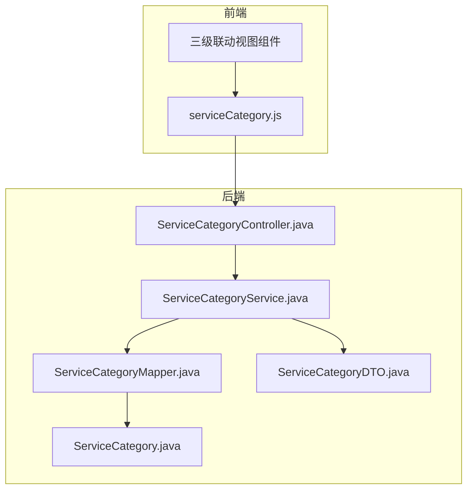
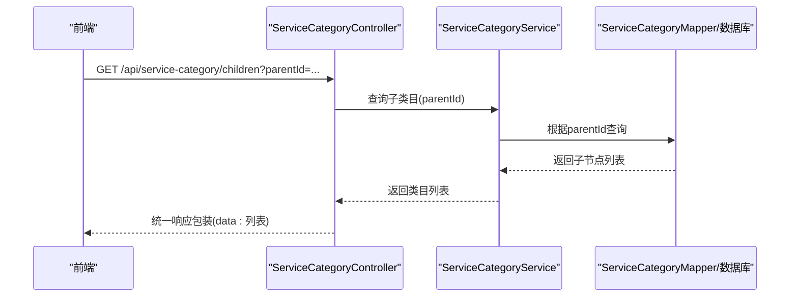
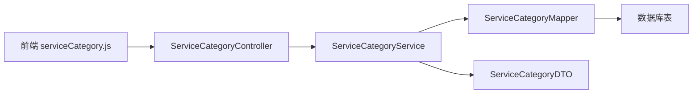

# 服务类目API

<cite>
**本文档引用的文件**
- [VAT_EPR_动态表单技术方案.md](file://VAT_EPR_动态表单技术方案.md)
</cite>

## 目录
1. [简介](#简介)
2. [项目结构](#项目结构)
3. [核心组件](#核心组件)
4. [架构总览](#架构总览)
5. [详细组件分析](#详细组件分析)
6. [依赖分析](#依赖分析)
7. [性能考虑](#性能考虑)
8. [故障排查指南](#故障排查指南)
9. [结论](#结论)
10. [附录](#附录)

## 简介
本文件面向“服务类目管理API”的使用与集成，重点围绕三级联动服务类目的查询接口进行系统化说明。该接口用于：
- 查询国家代码集合（枚举）
- 查询服务类型一级分类（VAT/EPR）
- 查询二级法规类目
- 查询三级具体申报类型
- 支持父子关系查询与类目树构建

文档同时给出接口的HTTP方法、URL路径、请求参数、响应格式、状态码说明与错误处理建议，并解释服务类目的一级（VAT/EPR）、二级（具体法规）、三级（具体申报类型）的层级结构与编码规范，帮助开发者快速理解并正确使用服务类目体系。

## 项目结构
本仓库采用“前后端分离”的典型工程结构，服务类目API位于后端控制器层，前端通过独立模块调用该接口完成三级联动选择。

图表来源
- [VAT_EPR_动态表单技术方案.md: 786](file://VAT_EPR_动态表单技术方案.md#L786)
- [VAT_EPR_动态表单技术方案.md: 789](file://VAT_EPR_动态表单技术方案.md#L789)
- [VAT_EPR_动态表单技术方案.md: 794](file://VAT_EPR_动态表单技术方案.md#L794)
- [VAT_EPR_动态表单技术方案.md: 799](file://VAT_EPR_动态表单技术方案.md#L799)
- [VAT_EPR_动态表单技术方案.md: 823](file://VAT_EPR_动态表单技术方案.md#L823)

章节来源
- [VAT_EPR_动态表单技术方案.md: 773-852:773-852](file://VAT_EPR_动态表单技术方案.md#L773-L852)

## 核心组件
- 服务类目控制器：负责接收前端请求，转发至服务层，并返回统一结果包装。
- 服务类目服务：封装业务逻辑，包括父子关系查询、类目树构建、国家代码枚举等。
- 数据访问层：基于ORM框架，提供类目数据的查询能力。
- 数据模型与DTO：定义类目实体与对外传输对象。

章节来源
- [VAT_EPR_动态表单技术方案.md: 786](file://VAT_EPR_动态表单技术方案.md#L786)
- [VAT_EPR_动态表单技术方案.md: 789](file://VAT_EPR_动态表单技术方案.md#L789)
- [VAT_EPR_动态表单技术方案.md: 794](file://VAT_EPR_动态表单技术方案.md#L794)
- [VAT_EPR_动态表单技术方案.md: 799](file://VAT_EPR_动态表单技术方案.md#L799)
- [VAT_EPR_动态表单技术方案.md: 805](file://VAT_EPR_动态表单技术方案.md#L805)

## 架构总览
服务类目API遵循REST风格，采用统一响应包装，支持按父节点ID查询子节点，实现国家代码、服务类型、类目层级的三级联动。

图表来源
- [VAT_EPR_动态表单技术方案.md: 391](file://VAT_EPR_动态表单技术方案.md#L391)

## 详细组件分析

### 接口定义与使用说明

- 接口名称：查询服务类目子节点
- HTTP方法：GET
- URL路径：/api/service-category/children
- 请求参数：
  - parentId：父节点ID（整数），用于指定查询哪一层的子节点
    - 0：查询国家代码枚举（一级）
    - 1：查询服务类型一级分类（VAT/EPR）
    - 2：查询服务类型二级分类（具体法规）
    - 3：查询服务类型三级分类（具体申报类型）
- 响应格式：统一响应包装，data字段为类目数组
  - 每个类目对象包含：id、name、code、parentId、level、children（可选）
- 状态码说明：
  - 200：成功
  - 400：请求参数无效或缺失
  - 500：服务器内部错误
- 错误处理建议：
  - 当parentId不在允许范围内时，返回400并提示参数非法
  - 当数据库查询异常时，返回500并记录日志

章节来源
- [VAT_EPR_动态表单技术方案.md: 391](file://VAT_EPR_动态表单技术方案.md#L391)

### 服务类目层级结构与编码规范

- 层级结构
  - 一级：VAT服务（01）/ EPR服务（02）
  - 二级：VAT服务（0101）/ 包装法（0201）/ WEEE法（0202）/ ...
  - 三级：VAT新注册申报（010101）/ VAT转代理申报（010102）/ ...

- 编码规范
  - 国家代码：三位字母（如 DEU、FRA、ITA、ESP、POL、CZE、GBR）
  - 一级编码：两位数字（01/VAT，02/EPR）
  - 二级编码：四位数字（0101、0201、0202、...）
  - 三级编码：六位数字（010101、010102、...）

- 前端交互流程
  - 选中一级后请求二级
  - 选中二级后请求三级
  - 三级选择完成后，可组合出国家+服务类型+三级类目的完整路径

章节来源
- [VAT_EPR_动态表单技术方案.md: 734](file://VAT_EPR_动态表单技术方案.md#L734)
- [VAT_EPR_动态表单技术方案.md: 746](file://VAT_EPR_动态表单技术方案.md#L746)
- [VAT_EPR_动态表单技术方案.md: 749](file://VAT_EPR_动态表单技术方案.md#L749)

### 类目树构建与父子关系查询

- 父子关系
  - 国家代码（一级）作为根节点，parentId=0
  - 一级服务类型（VAT/EPR）挂载于国家代码之下，parentId=国家代码ID
  - 二级法规类目挂载于一级服务类型之下，parentId=一级ID
  - 三级申报类型挂载于二级之下，parentId=二级ID

- 类目树构建
  - 从国家代码开始，逐级查询子节点，递归构建树形结构
  - 建议后端在查询时一次性加载所有层级，减少多次往返
  - 前端根据children字段渲染多级联动

- 性能优化建议
  - 使用缓存（如Redis）缓存国家代码与一级类目，降低数据库压力
  - 对常用查询建立索引（如按parentId查询）
  - 分页查询（当类目数量较大时）并限制每页大小

章节来源
- [VAT_EPR_动态表单技术方案.md: 746](file://VAT_EPR_动态表单技术方案.md#L746)
- [VAT_EPR_动态表单技术方案.md: 749](file://VAT_EPR_动态表单技术方案.md#L749)

### 国家代码枚举

- 国家代码（三位字母）
  - DEU：德国
  - FRA：法国
  - ITA：意大利
  - ESP：西班牙
  - POL：波兰
  - CZE：捷克
  - GBR：英国

- 使用场景
  - 作为一级根节点，供用户选择国家
  - 与服务类型编码组合，形成唯一的服务类目路径

章节来源
- [VAT_EPR_动态表单技术方案.md: 736](file://VAT_EPR_动态表单技术方案.md#L736)

### 请求与响应示例

- 请求示例
  - 获取国家代码列表：GET /api/service-category/children?parentId=0
  - 获取一级服务类型：GET /api/service-category/children?parentId=1
  - 获取二级法规类目：GET /api/service-category/children?parentId=2
  - 获取三级申报类型：GET /api/service-category/children?parentId=3

- 响应示例
  - 成功响应：统一响应包装，data为类目数组
  - 失败响应：统一响应包装，code非0，message描述错误原因

章节来源
- [VAT_EPR_动态表单技术方案.md: 391](file://VAT_EPR_动态表单技术方案.md#L391)

### 最佳实践

- 类目设计
  - 明确层级与编码规则，避免重复与歧义
  - 为每个类目提供清晰的name与code，便于前端展示与搜索
  - 保持编码的连续性与可扩展性，预留未来新增类目空间

- 前端实现
  - 使用受控组件维护选中状态，确保parentId正确传递
  - 在切换上一级时清空下一级选项，避免脏数据
  - 对无子节点的类目禁用点击或显示“无子类目”

- 后端实现
  - 参数校验：确保parentId合法且与层级匹配
  - 缓存策略：对国家代码与一级类目进行缓存
  - 错误处理：捕获数据库异常并返回统一错误码

- 数据一致性
  - 严格区分国家代码、一级、二级、三级的编码范围
  - 在模板绑定时，确保国家代码与服务类型编码一致

章节来源
- [VAT_EPR_动态表单技术方案.md: 734](file://VAT_EPR_动态表单技术方案.md#L734)
- [VAT_EPR_动态表单技术方案.md: 746](file://VAT_EPR_动态表单技术方案.md#L746)
- [VAT_EPR_动态表单技术方案.md: 749](file://VAT_EPR_动态表单技术方案.md#L749)

## 依赖分析
服务类目API的依赖关系如下：

图表来源
- [VAT_EPR_动态表单技术方案.md: 786](file://VAT_EPR_动态表单技术方案.md#L786)
- [VAT_EPR_动态表单技术方案.md: 789](file://VAT_EPR_动态表单技术方案.md#L789)
- [VAT_EPR_动态表单技术方案.md: 794](file://VAT_EPR_动态表单技术方案.md#L794)
- [VAT_EPR_动态表单技术方案.md: 823](file://VAT_EPR_动态表单技术方案.md#L823)

章节来源
- [VAT_EPR_动态表单技术方案.md: 786](file://VAT_EPR_动态表单技术方案.md#L786)
- [VAT_EPR_动态表单技术方案.md: 789](file://VAT_EPR_动态表单技术方案.md#L789)
- [VAT_EPR_动态表单技术方案.md: 794](file://VAT_EPR_动态表单技术方案.md#L794)
- [VAT_EPR_动态表单技术方案.md: 823](file://VAT_EPR_动态表单技术方案.md#L823)

## 性能考虑
- 缓存策略：对国家代码与一级类目进行缓存，降低数据库查询压力
- 分页与限流：当类目数量较大时，建议分页查询并设置合理的每页大小
- 索引优化：为parentId建立索引，提升子节点查询效率
- 并发控制：在高并发场景下，注意接口幂等性与锁机制

## 故障排查指南
- 常见问题
  - 参数非法：parentId不在允许范围内（0/1/2/3），返回400
  - 数据库异常：查询失败返回500，检查连接与SQL
  - 缺少权限：若接口涉及鉴权，确认Token有效
- 排查步骤
  - 检查请求URL与参数是否正确
  - 查看后端日志定位异常点
  - 核对数据库中是否存在对应parentId的记录
  - 验证缓存是否命中，必要时清理缓存重试

章节来源
- [VAT_EPR_动态表单技术方案.md: 391](file://VAT_EPR_动态表单技术方案.md#L391)

## 结论
服务类目API通过统一的三级联动查询接口，实现了国家代码、服务类型与具体申报类型的层级化管理。结合明确的编码规范与最佳实践，开发者可以高效地构建多国家、多服务类型的服务类目体系，并在前端实现流畅的三级联动体验。建议在生产环境中配合缓存、索引与分页策略，确保接口的高性能与稳定性。

## 附录

### 统一响应格式
- 成功响应：{
  - code: 0,
  - message: "success",
  - data: []
}
- 失败响应：{
  - code: 非0,
  - message: "错误描述",
  - data: null
}

章节来源
- [VAT_EPR_动态表单技术方案.md: 391](file://VAT_EPR_动态表单技术方案.md#L391)