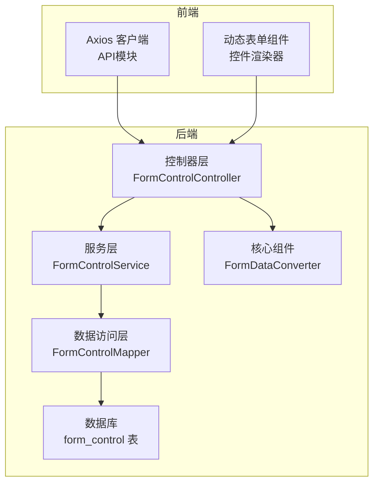
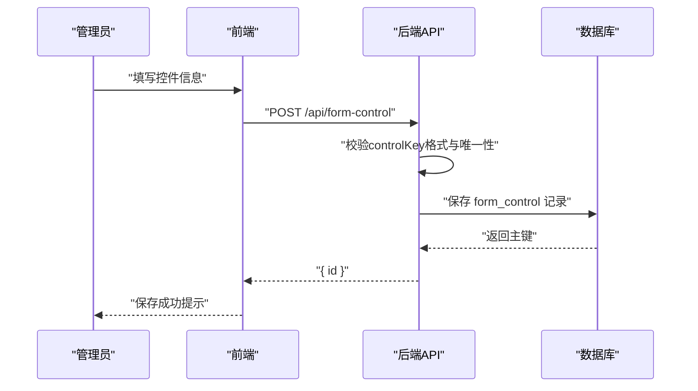
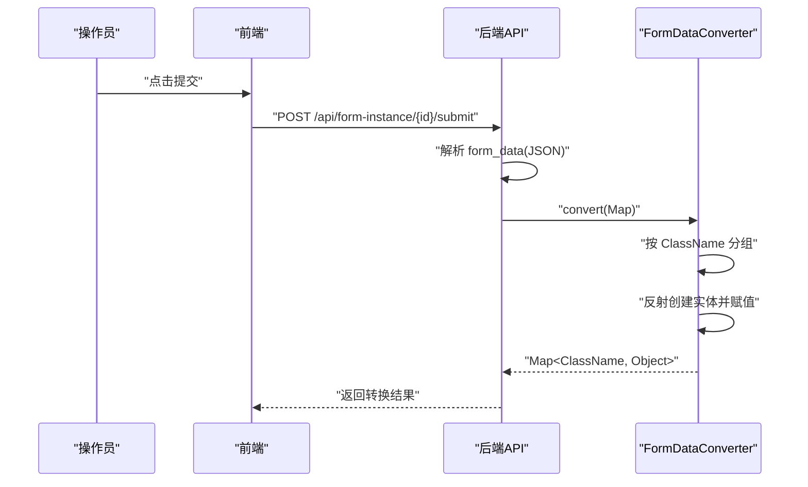
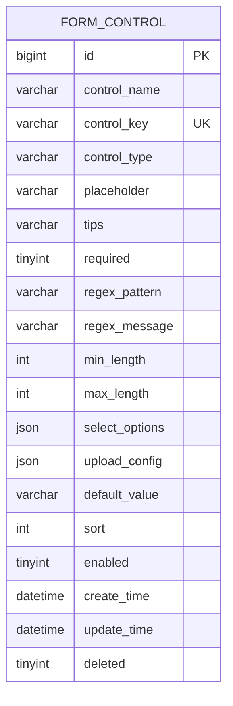

# 自定义控件API

<cite>
**本文引用的文件**
- [VAT_EPR_动态表单技术方案.md](file://VAT_EPR_动态表单技术方案.md)
</cite>

## 目录
1. [简介](#简介)
2. [项目结构](#项目结构)
3. [核心组件](#核心组件)
4. [架构总览](#架构总览)
5. [详细组件分析](#详细组件分析)
6. [依赖关系分析](#依赖关系分析)
7. [性能考虑](#性能考虑)
8. [故障排查指南](#故障排查指南)
9. [结论](#结论)
10. [附录](#附录)

## 简介
本文件面向开发者，系统化说明“自定义控件”管理API的完整接口规范与实现要点，涵盖控件的增删改查全流程，包括：
- 接口方法、URL、请求参数、响应格式、状态码与错误处理
- 控件类型（INPUT/SELECT/SWITCH/UPLOAD/TEXTAREA/DATE/NUMBER）
- 验证规则配置（必填、最小/最大长度、正则表达式）
- 上传文件配置（仅对 UPLOAD 类型生效）
- 控件 key 命名规范与正则表达式校验
- 控件定义的生命周期与最佳实践

## 项目结构
该技术方案文档提供了完整的数据库表结构、接口定义、核心业务时序以及服务端关键组件（如表单数据转换器）的设计思路。后端采用 Spring Boot + MyBatis-Plus，前端采用 Vue 3 + Element Plus，前后端通过 REST API 交互。

图表来源
- [VAT_EPR_动态表单技术方案.md: 167-223:167-223](file://VAT_EPR_动态表单技术方案.md#L167-L223)
- [VAT_EPR_动态表单技术方案.md: 592-728:592-728](file://VAT_EPR_动态表单技术方案.md#L592-L728)

章节来源
- [VAT_EPR_动态表单技术方案.md: 167-223:167-223](file://VAT_EPR_动态表单技术方案.md#L167-L223)
- [VAT_EPR_动态表单技术方案.md: 773-813:773-813](file://VAT_EPR_动态表单技术方案.md#L773-L813)

## 核心组件
- 数据模型：自定义控件表（form_control），包含控件名称、key、类型、占位提示、说明、必填、正则约束、长度限制、下拉选项、上传配置、默认值、排序、启用状态等字段。
- 控件类型：INPUT/SELECT/SWITCH/UPLOAD/TEXTAREA/DATE/NUMBER。
- 验证规则：required、minLength、maxLength、regexPattern、regexMessage。
- 上传配置：仅对 UPLOAD 类型生效，包含最大数量、允许类型、最大大小等。
- 控件 key 命名规范：ClassName.fieldName，且全局唯一。
- 提交与转换：前端提交表单数据，后端解析为 Map<controlKey, value>，再按 ClassName 分组并反射转换为目标实体对象。

章节来源
- [VAT_EPR_动态表单技术方案.md: 33-59:33-59](file://VAT_EPR_动态表单技术方案.md#L33-L59)
- [VAT_EPR_动态表单技术方案.md: 592-728:592-728](file://VAT_EPR_动态表单技术方案.md#L592-L728)

## 架构总览
自定义控件管理API属于“动态表单系统”的一部分，贯穿“控件定义—模板设计—实例填写—提交转换”的完整生命周期。下图展示了关键交互时序。

图表来源
- [VAT_EPR_动态表单技术方案.md: 401-413:401-413](file://VAT_EPR_动态表单技术方案.md#L401-L413)
- [VAT_EPR_动态表单技术方案.md: 167-223:167-223](file://VAT_EPR_动态表单技术方案.md#L167-L223)

## 详细组件分析

### 自定义控件 API 总览
- 基础路径：/api/form-control
- 支持操作：创建、查询列表、更新、删除
- 响应统一结构：包含 code、message、data 字段

章节来源
- [VAT_EPR_动态表单技术方案.md: 167-223:167-223](file://VAT_EPR_动态表单技术方案.md#L167-L223)

#### 创建控件
- 方法与路径
  - POST /api/form-control
- 请求头
  - Content-Type: application/json
- 请求体字段
  - controlName：控件名称（展示用）
  - controlKey：控件标识，格式为 ClassName.fieldName，需全局唯一
  - controlType：控件类型，取值范围 INPUT/SELECT/SWITCH/UPLOAD/TEXTAREA/DATE/NUMBER
  - placeholder：占位提示文本
  - tips：控件说明
  - required：是否必填（布尔）
  - regexPattern：正则表达式约束
  - regexMessage：正则校验失败提示语
  - minLength：最小长度
  - maxLength：最大长度
  - selectOptions：下拉框选项数组（仅 SELECT 类型有效）
  - uploadConfig：上传配置对象（仅 UPLOAD 类型有效）
  - defaultValue：默认值
  - sort：排序
  - enabled：是否启用
- 成功响应
  - data.id：新建控件的主键
- 错误处理
  - controlKey 格式不合法或重复：返回错误提示
  - 参数缺失或类型不符：返回参数校验错误
- 使用场景
  - 管理员在后台管理系统中定义新的表单控件，供模板设计器使用

章节来源
- [VAT_EPR_动态表单技术方案.md: 171-196:171-196](file://VAT_EPR_动态表单技术方案.md#L171-L196)
- [VAT_EPR_动态表单技术方案.md: 33-59:33-59](file://VAT_EPR_动态表单技术方案.md#L33-L59)

#### 查询控件列表
- 方法与路径
  - GET /api/form-control/list
- 查询参数
  - controlType：控件类型筛选
  - keyword：关键词模糊匹配（如控件名称或 key）
  - page：页码（从1开始）
  - size：每页条数
- 成功响应
  - data.total：总数
  - data.records：控件列表（每条记录包含控件基本信息）
- 使用场景
  - 模板设计器加载可用控件列表，支持按类型与关键字筛选

章节来源
- [VAT_EPR_动态表单技术方案.md: 198-211:198-211](file://VAT_EPR_动态表单技术方案.md#L198-L211)

#### 更新控件
- 方法与路径
  - PUT /api/form-control/{id}
- 路径参数
  - id：控件主键
- 请求体字段
  - 同“创建控件”的请求体字段，未提供的字段保持不变
- 成功响应
  - data：空对象或成功标志
- 使用场景
  - 修改现有控件的属性（如提示语、验证规则、启用状态）

章节来源
- [VAT_EPR_动态表单技术方案.md: 213-217:213-217](file://VAT_EPR_动态表单技术方案.md#L213-L217)

#### 删除控件
- 方法与路径
  - DELETE /api/form-control/{id}
- 路径参数
  - id：控件主键
- 成功响应
  - data：空对象或成功标志
- 注意事项
  - 若控件已被模板引用，删除前需解除引用或进行迁移

章节来源
- [VAT_EPR_动态表单技术方案.md: 218-221:218-221](file://VAT_EPR_动态表单技术方案.md#L218-L221)

### 控件类型与验证规则
- 控件类型
  - INPUT：文本输入
  - SELECT：下拉选择，需提供 selectOptions
  - SWITCH：开关
  - UPLOAD：文件上传，需提供 uploadConfig
  - TEXTAREA：多行文本
  - DATE：日期选择
  - NUMBER：数值输入
- 验证规则
  - required：必填
  - minLength/maxLength：字符串长度限制
  - regexPattern/regexMessage：正则表达式与提示语
- 上传配置（UPLOAD）
  - maxCount：最大上传数量
  - accept：允许的文件扩展名，如 ".pdf,.jpg,.png"
  - maxSizeMB：最大文件大小（MB）

章节来源
- [VAT_EPR_动态表单技术方案.md: 33-59:33-59](file://VAT_EPR_动态表单技术方案.md#L33-L59)
- [VAT_EPR_动态表单技术方案.md: 589-590:589-590](file://VAT_EPR_动态表单技术方案.md#L589-L590)

### 控件 key 命名规范与正则
- 命名规范
  - 格式：ClassName.fieldName
  - 示例：Company.companyName、CompanyLegalPerson.companyLegalName
  - 全局唯一：数据库唯一索引约束
- 正则表达式
  - 后端在提交时会校验 controlKey 必须包含一个点号“.”，用于区分类名与字段名
- 最佳实践
  - 类名建议使用驼峰或领域实体名，字段名与数据库列名保持一致
  - 避免跨域重复命名，确保唯一性

章节来源
- [VAT_EPR_动态表单技术方案.md: 61-65:61-65](file://VAT_EPR_动态表单技术方案.md#L61-L65)
- [VAT_EPR_动态表单技术方案.md: 858](file://VAT_EPR_动态表单技术方案.md#L858)

### 提交与转换流程（与控件定义协同）
- 前端提交表单数据时，按 controlKey 维度组织 Map<controlKey, value>
- 后端将 Map<controlKey, value> 按 ClassName 分组，并通过反射创建目标实体对象
- 转换器支持常见类型转换（String、Integer、Long、Boolean、BigDecimal 等）

图表来源
- [VAT_EPR_动态表单技术方案.md: 592-728:592-728](file://VAT_EPR_动态表单技术方案.md#L592-L728)

章节来源
- [VAT_EPR_动态表单技术方案.md: 592-728:592-728](file://VAT_EPR_动态表单技术方案.md#L592-L728)

## 依赖关系分析
- 控件定义依赖数据库表结构与唯一性约束
- 控件类型与验证规则影响前端渲染与校验
- 上传配置决定前端上传组件的行为
- 控件 key 的一致性是模板与实例数据流转的关键

图表来源
- [VAT_EPR_动态表单技术方案.md: 33-59:33-59](file://VAT_EPR_动态表单技术方案.md#L33-L59)

章节来源
- [VAT_EPR_动态表单技术方案.md: 33-59:33-59](file://VAT_EPR_动态表单技术方案.md#L33-L59)

## 性能考虑
- 列表查询建议添加必要的索引（如 control_type、control_key、enabled），并限制每页大小
- 控件列表接口支持分页与关键词过滤，避免一次性返回大量数据
- 上传配置仅在 UPLOAD 类型生效，避免不必要的序列化开销
- 前端渲染时按控件类型动态生成校验规则，减少重复计算

## 故障排查指南
- controlKey 格式错误或重复
  - 现象：创建/更新失败，提示格式不合法或唯一性冲突
  - 处理：检查是否满足“ClassName.fieldName”格式，确认全局唯一
- 控件被模板引用无法删除
  - 现象：删除接口返回引用错误
  - 处理：先解除模板对该控件的引用，或迁移至其他控件
- 验证规则不生效
  - 现象：前端校验未触发或后端校验异常
  - 处理：确认 required、minLength、maxLength、regexPattern 是否正确配置
- 上传文件失败
  - 现象：上传组件报错或文件未保存
  - 处理：核对 uploadConfig 的 accept 与 maxSizeMB，确认文件服务可用

章节来源
- [VAT_EPR_动态表单技术方案.md: 856-869:856-869](file://VAT_EPR_动态表单技术方案.md#L856-L869)

## 结论
自定义控件管理API为动态表单系统提供了灵活的控件定义能力。通过标准化的字段、严格的命名规范与完善的验证配置，开发者可以快速构建可复用的表单控件，并将其无缝集成到模板与实例流程中。建议在团队内统一控件命名约定与验证策略，持续优化前端渲染与后端转换性能。

## 附录
- 统一响应结构
  - code：整数，0 表示成功，非 0 表示错误
  - message：字符串，描述信息
  - data：对象或数组，具体业务数据
- 控件类型与前端渲染映射
  - INPUT → el-input
  - SELECT → el-select
  - SWITCH → el-switch
  - UPLOAD → el-upload（读取 uploadConfig）
  - TEXTAREA → el-input(type="textarea")
  - DATE → el-date-picker
  - NUMBER → el-input-number

章节来源
- [VAT_EPR_动态表单技术方案.md: 531-548:531-548](file://VAT_EPR_动态表单技术方案.md#L531-L548)