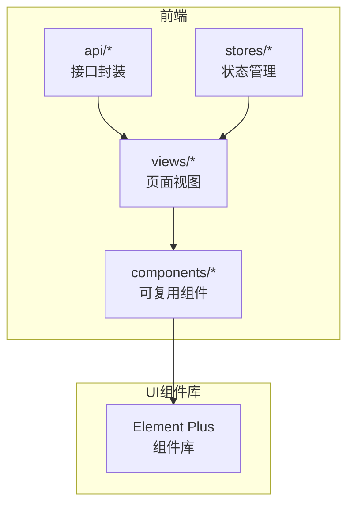
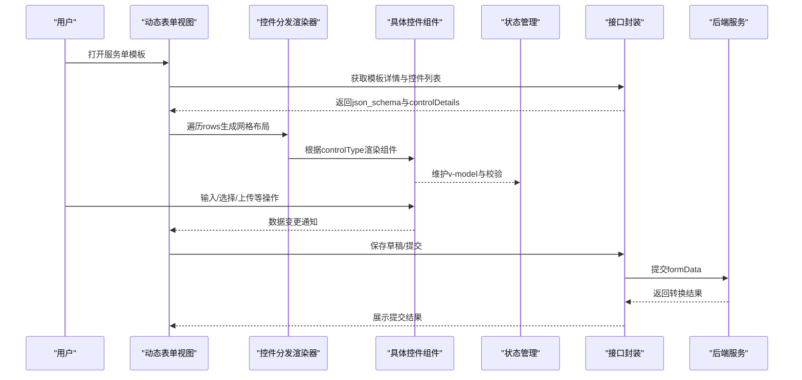
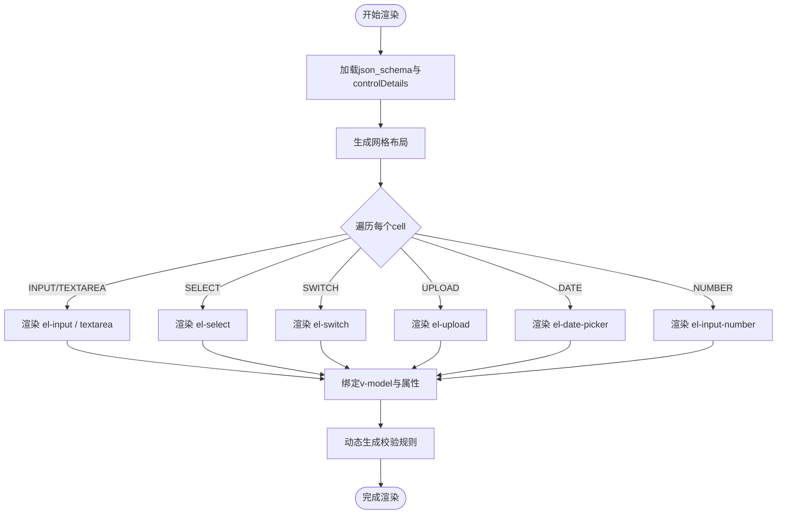
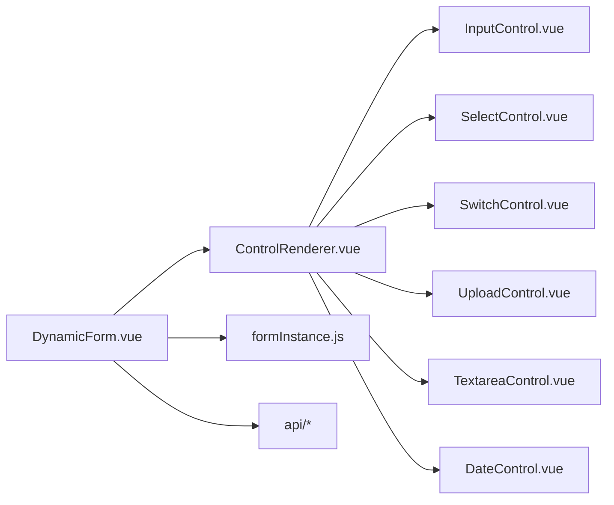

# UI组件库集成

<cite>
**本文引用的文件**
- [VAT_EPR_动态表单技术方案.md](file://VAT_EPR_动态表单技术方案.md)
</cite>

## 目录
1. [简介](#简介)
2. [项目结构](#项目结构)
3. [核心组件](#核心组件)
4. [架构总览](#架构总览)
5. [详细组件分析](#详细组件分析)
6. [依赖分析](#依赖分析)
7. [性能考虑](#性能考虑)
8. [故障排查指南](#故障排查指南)
9. [结论](#结论)
10. [附录](#附录)

## 简介
本文件围绕动态表单系统的前端UI组件库集成进行系统化说明，重点基于项目采用的Element Plus组件库，结合项目中的动态表单渲染、控件类型、表单校验与数据绑定等需求，给出组件库的选择理由、安装配置、按需引入策略、常用表单组件使用方式、主题定制与样式覆盖、响应式设计、组合使用与复杂场景处理、可访问性与国际化、浏览器兼容性、性能优化与打包体积控制等实践指南。文档同时提供面向开发者的最佳实践与排障建议，帮助快速落地高质量的动态表单体验。

## 项目结构
项目采用前后端分离架构，前端以Vue 3 + Vite为基础，Element Plus作为UI组件库，配合拖拽排序、状态管理与HTTP客户端等生态工具，支撑动态表单的设计与运行时渲染。前端目录组织如下：
- views：页面级视图，包括控件管理、模板设计、实例填写等
- components：可复用组件，包含动态表单渲染器与控件分发器
- api：各模块的HTTP接口封装
- stores：状态管理（设计器状态、实例填写状态）

**章节来源**
- [VAT_EPR_动态表单技术方案.md: 815-852:815-852](file://VAT_EPR_动态表单技术方案.md#L815-L852)

## 核心组件
- 动态表单主组件：负责根据json_schema与controlDetails渲染表单网格布局，动态绑定控件类型与数据模型，并统一收集校验规则。
- 控件分发渲染器：根据controlType分发到具体控件组件（如输入、选择、开关、上传、文本域、日期、数字等），并注入v-model与属性绑定。
- 控件子组件：针对每种控件类型提供独立的封装，统一处理属性、事件与默认行为。
- 表单设计器：左侧控件面板与右侧画板，支持拖拽布局、行列配置与预览。
- 状态管理：维护设计器与实例填写的状态，确保跨组件共享与持久化。

**章节来源**
- [VAT_EPR_动态表单技术方案.md: 833-848:833-848](file://VAT_EPR_动态表单技术方案.md#L833-L848)

## 架构总览
动态表单系统从前端到后端的交互链路如下：
- 前端通过接口获取模板与控件详情，解析json_schema生成网格布局
- 根据controlType渲染对应Element Plus组件，绑定v-model与校验规则
- 用户填写完成后，将formData原样提交至后端，由服务端转换为实体对象并触发后续业务

**图表来源**
- [VAT_EPR_动态表单技术方案.md: 531-548](file://VAT_EPR_动态表form_schema与controlDetails渲染流程)
- [VAT_EPR_动态表单技术方案.md: 306-380:306-380](file://VAT_EPR_动态表单技术方案.md#L306-L380)

**章节来源**
- [VAT_EPR_动态表单技术方案.md: 531-548:531-548](file://VAT_EPR_动态表单技术方案.md#L531-L548)
- [VAT_EPR_动态表单技术方案.md: 306-380:306-380](file://VAT_EPR_动态表单技术方案.md#L306-L380)

## 详细组件分析

### Element Plus组件库选择理由
- 生态完善：组件丰富、文档详尽、社区活跃，适合快速构建企业级界面
- 与Vue 3高度契合：Composition API友好、TypeScript支持良好
- 主题系统与按需引入：支持主题定制与Tree-shaking，有利于控制包体积
- 国际化与无障碍：内置多语言与ARIA支持，便于国际化与可访问性
- 与Vite/Vue生态无缝集成：开发体验与构建效率高

**章节来源**
- [VAT_EPR_动态表单技术方案.md: 19-28:19-28](file://VAT_EPR_动态表单技术方案.md#L19-L28)

### 安装与配置
- 安装Element Plus与图标库：通过包管理器安装Element Plus与图标依赖
- 插件注册：在应用入口注册Element Plus插件，以便全局使用
- 国际化配置：按需设置语言与本地化资源
- 主题定制：通过CSS变量或样式覆盖实现品牌化定制
- 按需引入：结合构建工具与插件，仅打包使用到的组件与样式，降低体积

**章节来源**
- [VAT_EPR_动态表单技术方案.md: 24](file://VAT_EPR_动态表单技术方案.md#L24)

### 按需引入策略
- 组件按需引入：仅导入实际使用的组件，减少初始包体积
- 图标按需引入：避免一次性引入全部图标
- 样式按需引入：仅引入组件所需样式，避免全量样式
- 构建工具优化：利用Vite与插件自动处理按需引入与Tree-shaking

**章节来源**
- [VAT_EPR_动态表单技术方案.md: 23](file://VAT_EPR_动态表单技术方案.md#L23)

### 常用表单组件使用方式
- 输入类：el-input（含textarea）、el-input-number
- 选择类：el-select、el-date-picker
- 开关类：el-switch
- 上传类：el-upload（结合上传配置）
- 校验规则：基于controlDetails中的正则、必填、长度等约束动态生成
- 事件处理：统一通过v-model与事件绑定，集中处理输入、失焦、change等

**图表来源**
- [VAT_EPR_动态表单技术方案.md: 531-548:531-548](file://VAT_EPR_动态表单技术方案.md#L531-L548)

**章节来源**
- [VAT_EPR_动态表单技术方案.md: 531-548:531-548](file://VAT_EPR_动态表单技术方案.md#L531-L548)

### 属性配置与事件处理
- 属性绑定：通过v-bind将controlDetails中的属性映射到组件
- 事件绑定：统一监听输入、选择、上传等事件，更新formData
- 默认值：从controlDetails.default_value注入
- 占位符与提示：placeholder与tips分别映射到组件的相应属性
- 上传配置：maxCount、accept、maxSize等通过v-bind传递给el-upload

**章节来源**
- [VAT_EPR_动态表单技术方案.md: 39-50:39-50](file://VAT_EPR_动态表单技术方案.md#L39-L50)
- [VAT_EPR_动态表单技术方案.md: 531-548:531-548](file://VAT_EPR_动态表单技术方案.md#L531-L548)

### 主题定制、样式覆盖与响应式设计
- 主题定制：通过CSS变量覆盖Element Plus默认变量，实现品牌色与字号等统一
- 样式覆盖：对特定组件进行局部样式覆盖，注意作用域与优先级
- 响应式设计：结合CSS Grid与媒体查询，适配不同屏幕尺寸
- 组件尺寸：统一使用中等尺寸，保持一致性与可读性

**章节来源**
- [VAT_EPR_动态表单技术方案.md: 24](file://VAT_EPR_动态表单技术方案.md#L24)

### 组合使用、嵌套表单与复杂场景
- 组合使用：在同一表单中混合多种控件类型，通过网格布局合理分配空间
- 嵌套表单：对于复杂实体，可拆分为多个区域或折叠面板，提升可读性
- 复杂校验：结合必填、正则、长度等规则，必要时使用自定义校验函数
- 动态禁用：根据业务条件动态启用/禁用控件，避免无效交互

**章节来源**
- [VAT_EPR_动态表单技术方案.md: 531-548:531-548](file://VAT_EPR_动态表单技术方案.md#L531-L548)

### 可访问性支持与国际化
- 可访问性：为表单项提供label与aria-label，确保键盘导航与屏幕阅读器友好
- 国际化：配置Element Plus语言包，支持多语言切换
- 提示与错误：统一错误文案与提示位置，提升用户体验

**章节来源**
- [VAT_EPR_动态表单技术方案.md: 24](file://VAT_EPR_动态表单技术方案.md#L24)

### 浏览器兼容性
- 支持现代浏览器：基于Vue 3与Element Plus的最低版本要求，确保主流浏览器可用
- 渐进增强：对不支持特性的功能提供降级方案
- 兼容性测试：在目标浏览器上验证表单渲染与交互

**章节来源**
- [VAT_EPR_动态表单技术方案.md: 22-24:22-24](file://VAT_EPR_动态表单技术方案.md#L22-L24)

## 依赖分析
- 组件耦合：动态表单主组件依赖控件分发渲染器与状态管理；控件分发渲染器依赖具体控件组件
- 外部依赖：Element Plus、Vite、Vue Draggable、Pinia、Axios等
- 潜在循环依赖：通过清晰的组件边界与状态管理避免循环依赖
- 接口契约：前后端通过json_schema与controlDetails约定控件类型与属性

**图表来源**
- [VAT_EPR_动态表单技术方案.md: 833-848:833-848](file://VAT_EPR_动态表单技术方案.md#L833-L848)

**章节来源**
- [VAT_EPR_动态表单技术方案.md: 833-848:833-848](file://VAT_EPR_动态表单技术方案.md#L833-L848)

## 性能考虑
- 懒加载：对非首屏控件与重型组件采用懒加载，减少初始渲染压力
- 虚拟滚动：在长列表场景使用虚拟滚动，提升渲染性能
- 树摇优化：按需引入组件与样式，避免全量打包
- 缓存策略：对静态控件列表与模板元数据进行缓存，减少重复请求
- 渲染优化：合理拆分组件、避免不必要的重渲染，使用浅比较与计算属性

**章节来源**
- [VAT_EPR_动态表单技术方案.md: 23-24:23-24](file://VAT_EPR_动态表单技术方案.md#L23-L24)

## 故障排查指南
- 控件类型不匹配：检查controlType与组件映射关系，确保渲染正确
- 校验不生效：确认动态规则生成逻辑与Element Plus校验机制一致
- 上传异常：核对上传配置与后端接口返回，检查文件大小与格式限制
- 数据不一致：检查v-model绑定与formData更新时机，避免异步竞态
- 样式冲突：定位样式作用域与优先级，必要时使用深度选择器或CSS Modules

**章节来源**
- [VAT_EPR_动态表单技术方案.md: 531-548:531-548](file://VAT_EPR_动态表单技术方案.md#L531-L548)

## 结论
通过Element Plus与Vue 3的组合，结合动态表单的渲染与校验机制，能够高效构建灵活、可扩展且易维护的表单系统。遵循按需引入、主题定制、国际化与可访问性等最佳实践，可在保证开发效率的同时兼顾性能与用户体验。建议在项目中持续关注组件升级与构建优化，确保长期可维护性与稳定性。

## 附录
- 术语说明：controlKey、json_schema、controlDetails、formData等关键概念
- 最佳实践清单：按需引入、样式覆盖、响应式设计、性能优化、可访问性与国际化