# Vue应用结构设计

<cite>
**本文档引用的文件**
- [VAT_EPR_动态表单技术方案.md](file://VAT_EPR_动态表单技术方案.md)
</cite>

## 目录
1. [项目概述](#项目概述)
2. [项目结构](#项目结构)
3. [核心组件架构](#核心组件架构)
4. [动态表单系统设计](#动态表单系统设计)
5. [状态管理设计](#状态管理设计)
6. [组件通信模式](#组件通信模式)
7. [路由配置](#路由配置)
8. [构建配置与优化](#构建配置与优化)
9. [性能优化策略](#性能优化策略)
10. [开发指南](#开发指南)
11. [总结](#总结)

## 项目概述

VAT & EPR 动态表单系统是一个基于Vue 3.4.x和Element Plus 2.x构建的企业级动态表单解决方案。该系统支持复杂的表单设计器、动态表单渲染、多级服务分类等功能，特别适用于增值税(VAT)和环境产品指令(EPR)等合规性表单场景。

### 技术栈概览

- **前端框架**: Vue 3.4.x (Composition API)
- **构建工具**: Vite 5.x
- **UI组件库**: Element Plus 2.x
- **状态管理**: Pinia 2.x
- **HTTP客户端**: Axios 1.x
- **拖拽功能**: Vue Draggable next
- **后端服务**: Spring Boot 3.2.x + MySQL 8.0+

## 项目结构

基于技术方案文档，Vue前端项目采用清晰的模块化组织结构：

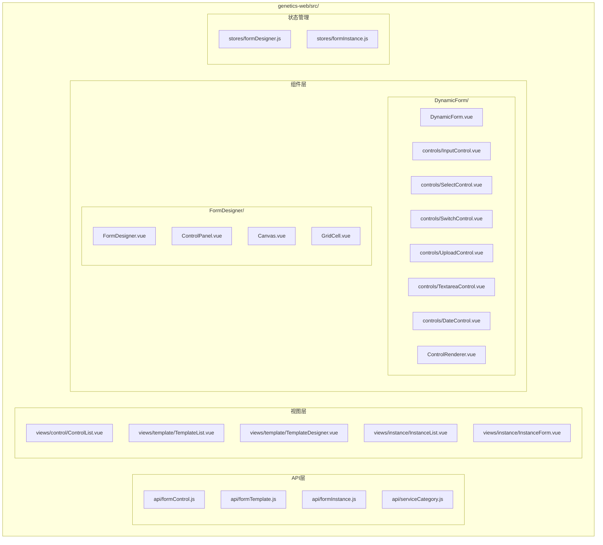

**图表来源**
- [VAT_EPR_动态表单技术方案.md:815-852](file://VAT_EPR_动态表单技术方案.md#L815-L852)

**章节来源**
- [VAT_EPR_动态表单技术方案.md:815-852](file://VAT_EPR_动态表单技术方案.md#L815-L852)

## 核心组件架构

### 动态表单组件体系

系统的核心是动态表单渲染引擎，采用组件分发模式实现多种控件类型的统一管理：

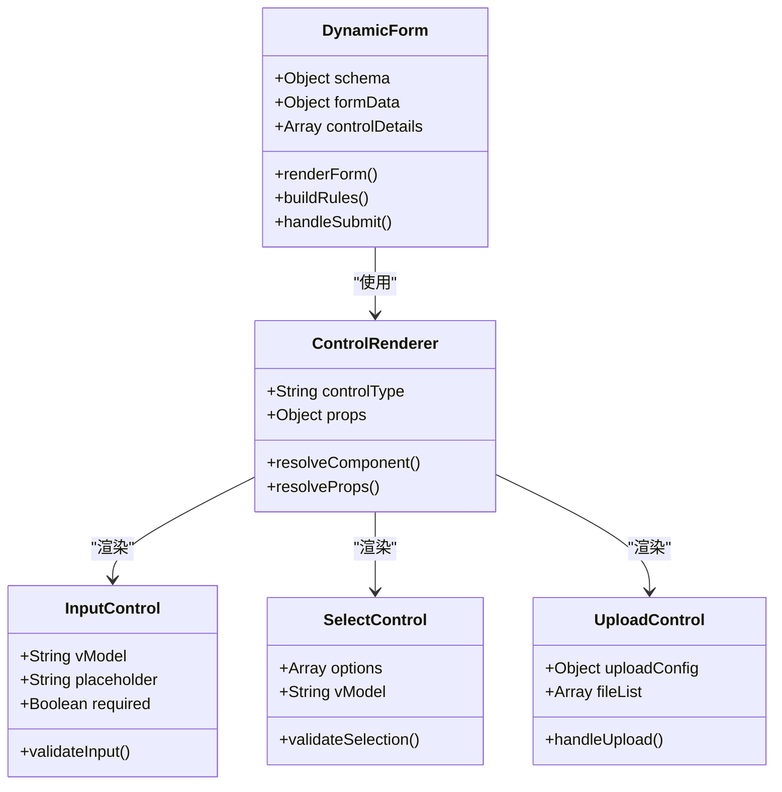

**图表来源**
- [VAT_EPR_动态表单技术方案.md:833-848](file://VAT_EPR_动态表单技术方案.md#L833-L848)

### 表单设计器架构

表单设计器采用拖拽式设计，支持可视化布局编辑：

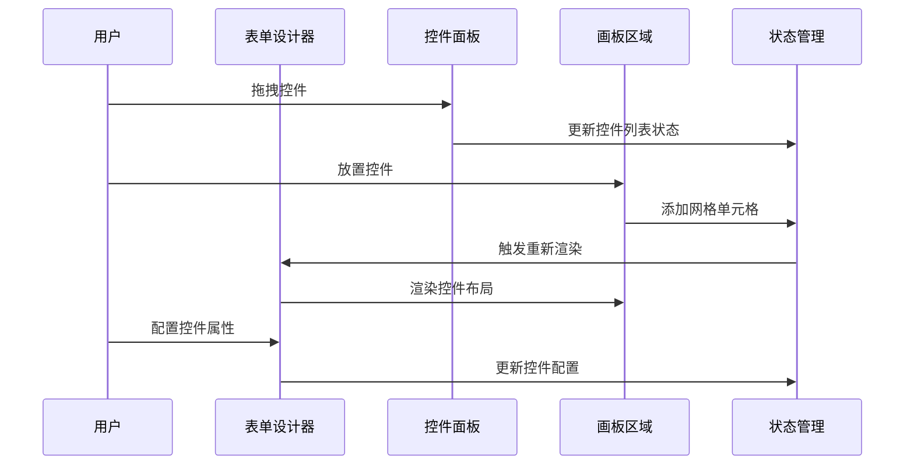

**图表来源**
- [VAT_EPR_动态表单技术方案.md:415-435](file://VAT_EPR_动态表单技术方案.md#L415-L435)

**章节来源**
- [VAT_EPR_动态表单技术方案.md:833-848](file://VAT_EPR_动态表单技术方案.md#L833-L848)

## 动态表单系统设计

### JSON Schema 数据模型

系统采用JSON Schema定义表单布局和控件关系：

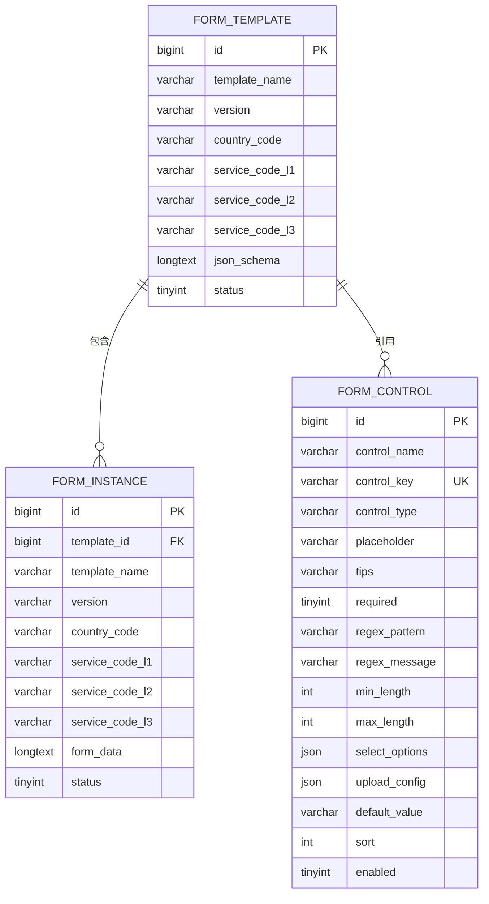

**图表来源**
- [VAT_EPR_动态表单技术方案.md:31-153](file://VAT_EPR_动态表单技术方案.md#L31-L153)

### 动态渲染流程

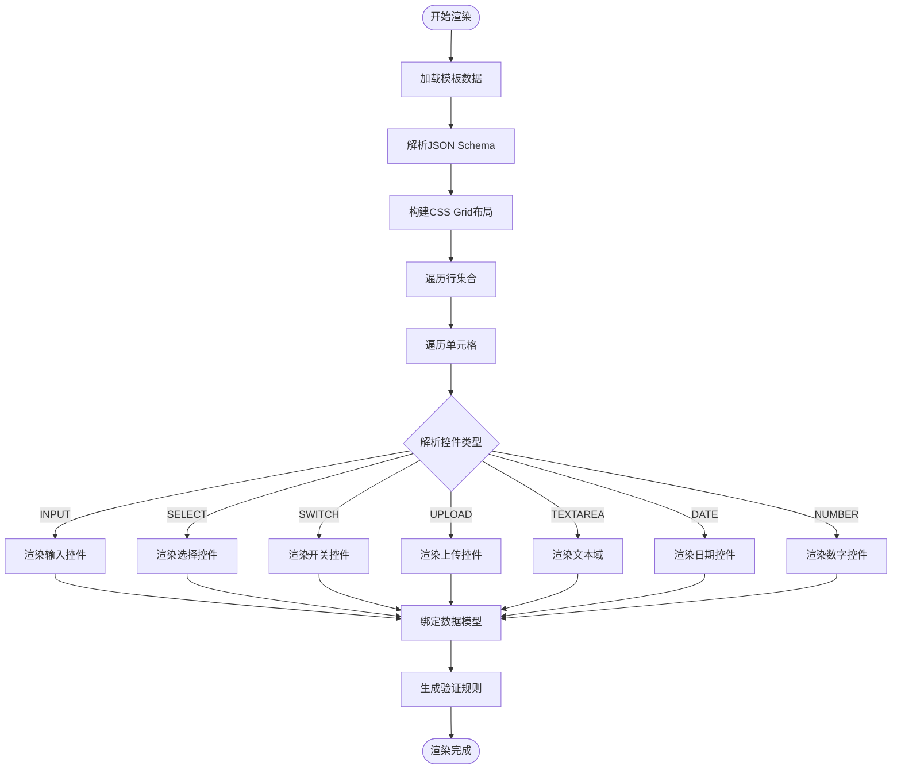

**图表来源**
- [VAT_EPR_动态表单技术方案.md:531-548](file://VAT_EPR_动态表单技术方案.md#L531-L548)

**章节来源**
- [VAT_EPR_动态表单技术方案.md:482-548](file://VAT_EPR_动态表单技术方案.md#L482-L548)

## 状态管理设计

### Pinia状态管理架构

系统采用Pinia进行状态管理，分离设计器和实例填写两种不同的状态管理模式：

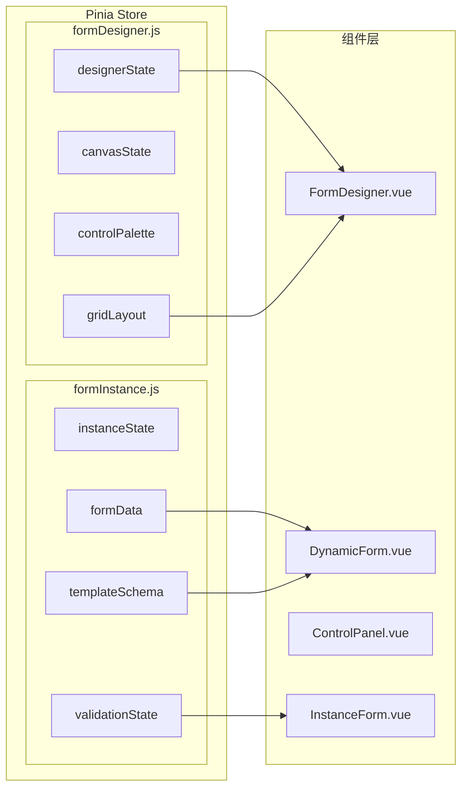

**图表来源**
- [VAT_EPR_动态表单技术方案.md:849-851](file://VAT_EPR_动态表单技术方案.md#L849-L851)

### 状态同步机制

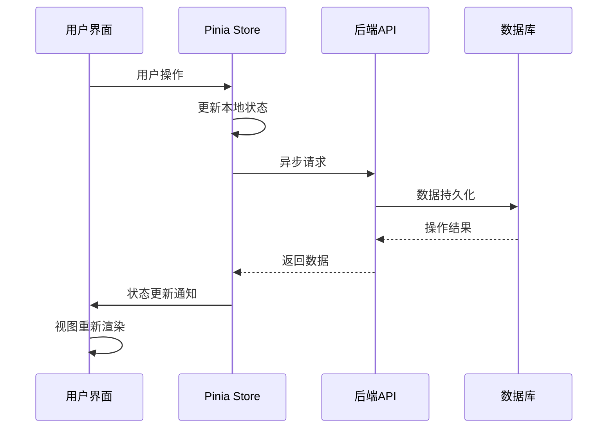

**章节来源**
- [VAT_EPR_动态表单技术方案.md:849-851](file://VAT_EPR_动态表单技术方案.md#L849-L851)

## 组件通信模式

### Props传递与事件冒泡

系统采用标准的Vue组件通信模式：

```mermaid
graph TB
subgraph "父组件"
Parent[父组件]
end
subgraph "子组件层"
Child1[子组件1]
Child2[子组件2]
Child3[子组件3]
end
subgraph "事件处理"
Event[事件处理器]
Validator[验证器]
Updater[状态更新器]
end
Parent --> Child1
Parent --> Child2
Parent --> Child3
Child1 -.->|emit('change')| Parent
Child2 -.->|emit('input')| Parent
Child3 -.->|emit('submit')| Parent
Parent --> Event
Event --> Validator
Validator --> Updater
```

### 插槽使用策略

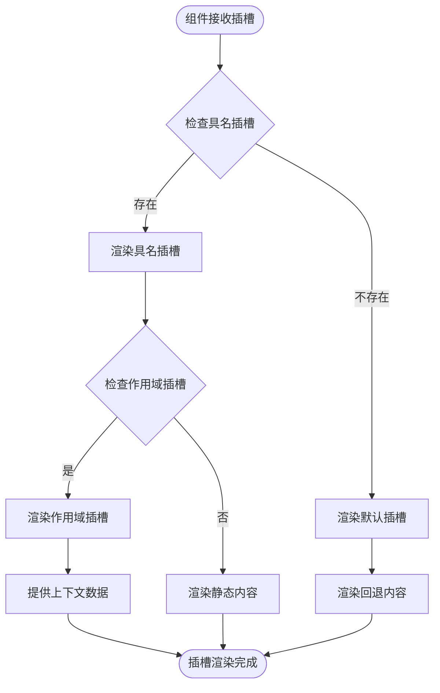

**章节来源**
- [VAT_EPR_动态表单技术方案.md:550-577](file://VAT_EPR_动态表单技术方案.md#L550-L577)

## 路由配置

### 路由设计原则

基于项目结构，推荐的路由配置应该遵循以下原则：

- **模块化路由**: 按功能模块划分路由
- **懒加载**: 使用动态导入实现代码分割
- **权限控制**: 基于角色的访问控制
- **嵌套路由**: 支持复杂的页面层级关系

### 路由结构示例

```mermaid
graph TB
subgraph "根路由"
Home[/]
Dashboard[/dashboard]
end
subgraph "表单管理"
subgraph "表单控件"
ControlList[/control]
ControlEdit[/control/:id]
end
subgraph "表单模板"
TemplateList[/template]
TemplateDesigner[/template/designer]
TemplateEdit[/template/:id]
end
subgraph "表单实例"
InstanceList[/instance]
InstanceForm[/instance/:id]
InstancePreview[/instance/:id/preview]
end
end
subgraph "系统管理"
subgraph "用户管理"
UserList[/user]
UserEdit[/user/:id]
end
subgraph "权限管理"
RoleList[/role]
PermissionList[/permission]
end
end
```

## 构建配置与优化

### Vite配置策略

基于Vue 3 + Vite的项目配置建议：

#### 性能优化配置

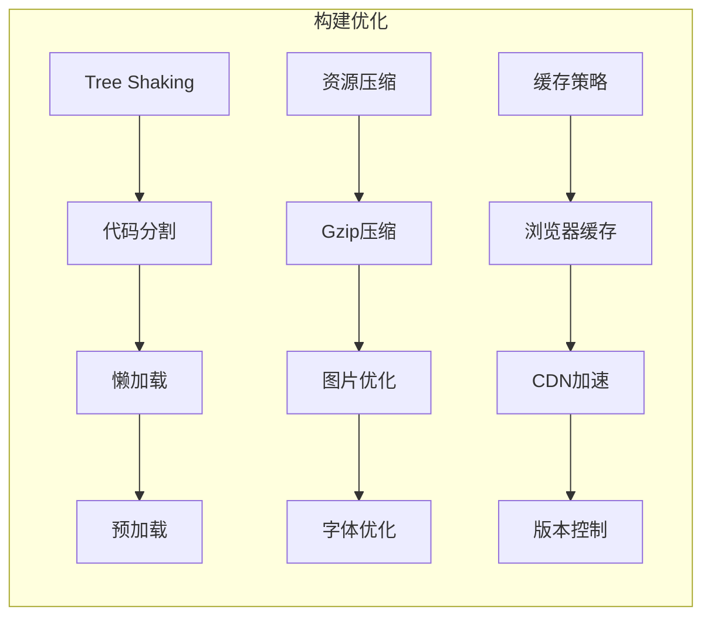

#### 开发服务器配置

- **热重载**: 启用Vite的快速热重载功能
- **代理配置**: 配置API代理解决跨域问题
- **源码映射**: 开发环境启用详细的源码映射
- **性能监控**: 集成性能分析工具

**章节来源**
- [VAT_EPR_动态表单技术方案.md:22-27](file://VAT_EPR_动态表单技术方案.md#L22-L27)

## 性能优化策略

### 代码分割策略

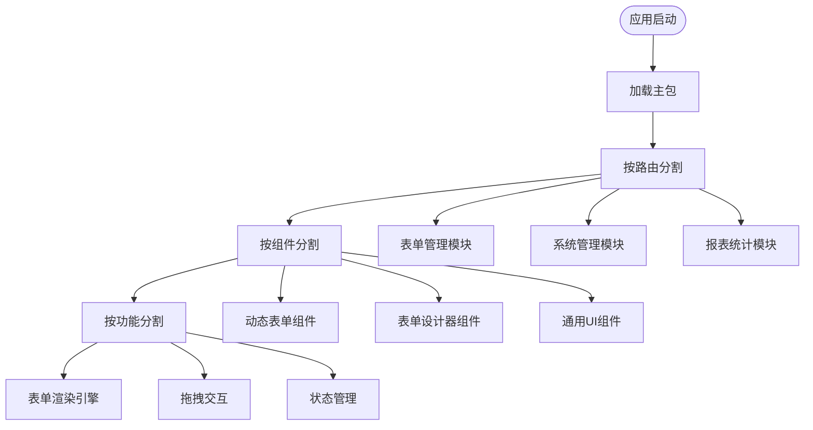

### 懒加载实现

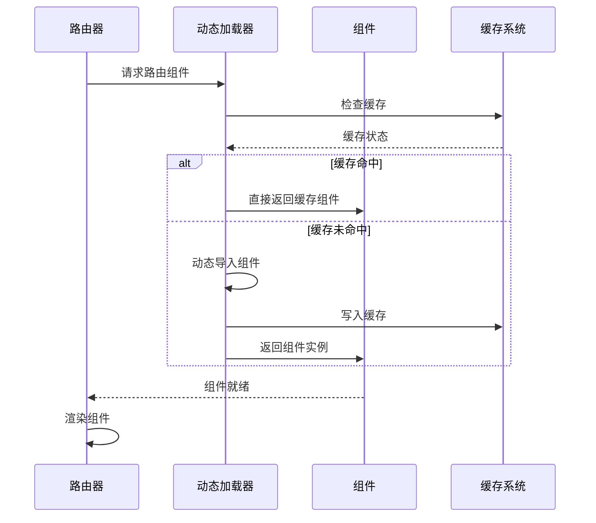

### 组件优化技巧

1. **虚拟滚动**: 对大量数据列表使用虚拟滚动
2. **防抖节流**: 对高频事件使用防抖节流
3. **计算属性**: 合理使用计算属性避免重复计算
4. **异步组件**: 对大型组件使用异步组件
5. **内存泄漏防护**: 正确清理定时器和事件监听器

## 开发指南

### 组件开发规范

#### 组件命名规范
- **文件命名**: 使用PascalCase命名，如 `DynamicForm.vue`
- **组件导出**: 默认导出组件对象
- **props命名**: 使用camelCase命名
- **事件命名**: 使用kebab-case命名

#### 组件设计原则
- **单一职责**: 每个组件专注于单一功能
- **可复用性**: 设计可复用的组件接口
- **可测试性**: 组件设计考虑单元测试需求
- **文档完善**: 为每个组件编写使用文档

### 状态管理最佳实践

#### Store设计原则
- **状态隔离**: 不同功能域的状态独立管理
- **状态规范化**: 使用标准化的数据结构
- **异步处理**: 统一处理异步操作
- **错误处理**: 完善的错误处理机制

#### 数据流管理
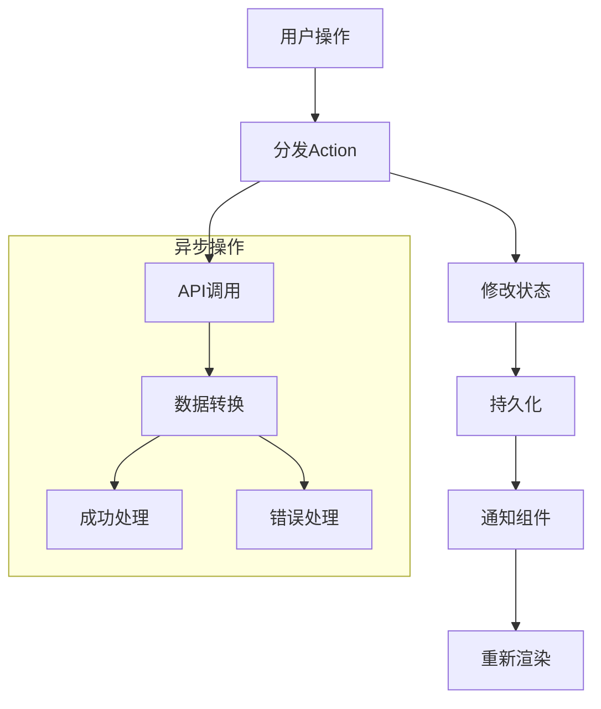

### API集成策略

#### 请求拦截器
- **认证令牌**: 自动添加JWT令牌
- **请求重试**: 实现智能重试机制
- **超时处理**: 统一的超时配置
- **错误统一**: 标准化的错误处理

#### 响应处理
- **数据转换**: 统一的数据格式转换
- **状态码处理**: 不同HTTP状态码的处理策略
- **缓存策略**: 合理的缓存机制
- **Loading状态**: 完善的加载状态管理

## 总结

VAT & EPR动态表单系统展现了现代Vue 3应用的最佳实践：

### 核心优势

1. **高度模块化**: 清晰的项目结构和组件分层
2. **动态渲染**: 基于JSON Schema的灵活表单渲染
3. **可视化设计**: 拖拽式的表单设计器
4. **状态管理**: 基于Pinia的现代化状态管理
5. **性能优化**: 多层次的性能优化策略

### 技术亮点

- **Composition API**: 充分利用Vue 3的组合式API
- **TypeScript支持**: 代码类型安全保障
- **组件化设计**: 高内聚低耦合的组件架构
- **响应式数据**: 基于Proxy的响应式数据管理
- **异步加载**: 智能的代码分割和懒加载

### 最佳实践建议

1. **持续重构**: 定期审视和优化代码结构
2. **测试驱动**: 建立完善的测试体系
3. **文档维护**: 保持技术文档的实时更新
4. **性能监控**: 建立性能指标监控体系
5. **团队协作**: 制定统一的开发规范和流程

这个项目为Vue 3应用开发提供了完整的参考模板，涵盖了从基础架构到高级特性的各个方面，适合企业级应用的开发和维护。