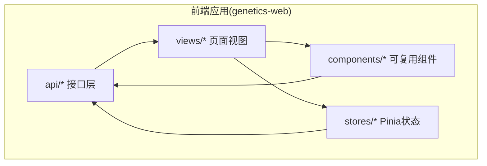
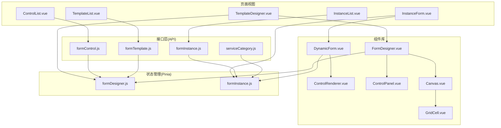
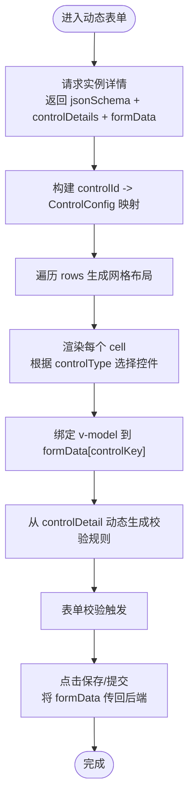
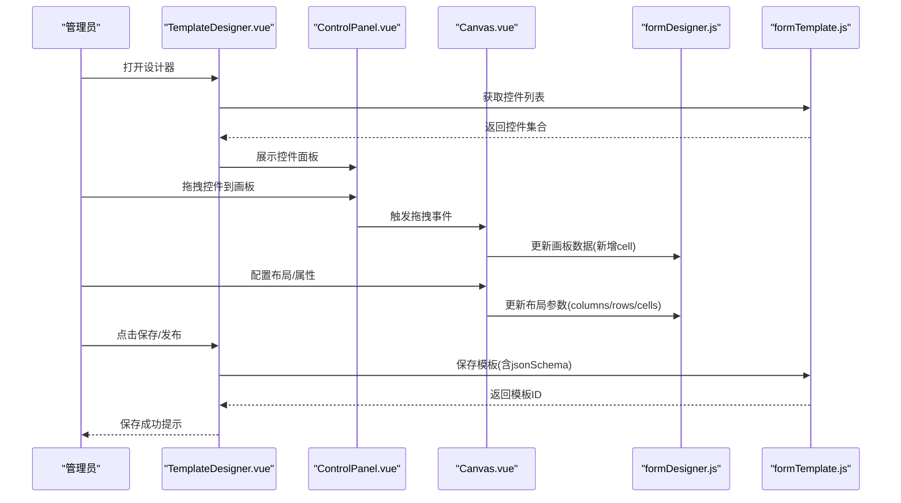
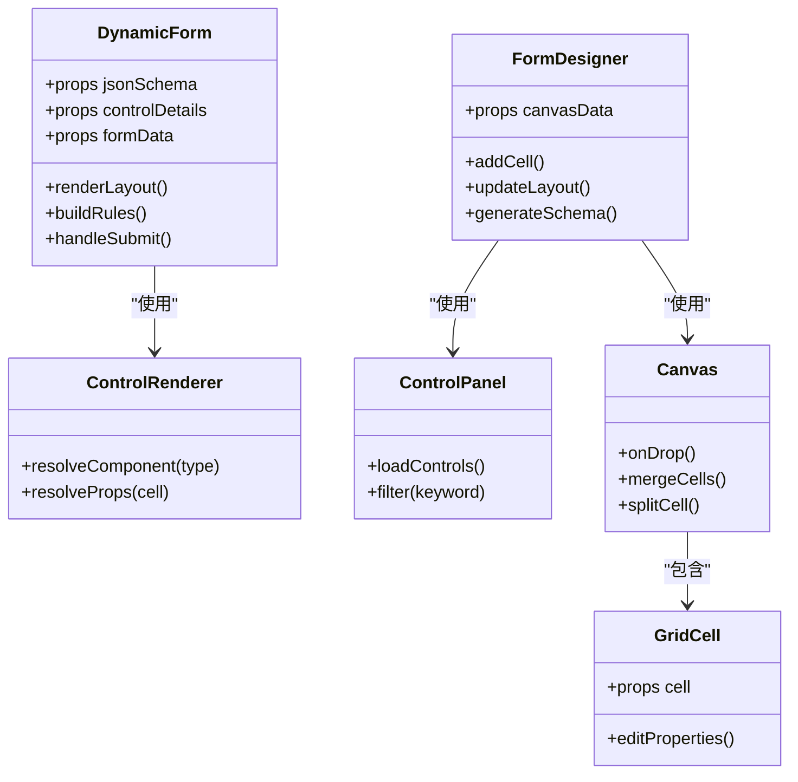
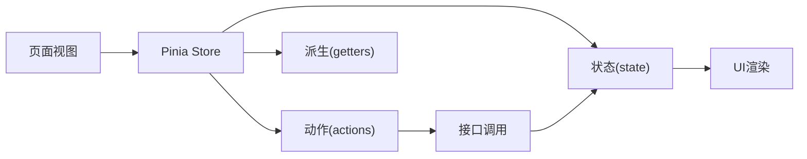
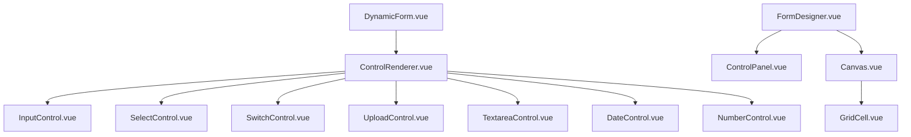

# 前端架构设计

<cite>
**本文引用的文件**
- [VAT_EPR_动态表单技术方案.md](file://VAT_EPR_动态表单技术方案.md)
</cite>

## 目录
1. [简介](#简介)
2. [项目结构](#项目结构)
3. [核心组件](#核心组件)
4. [架构总览](#架构总览)
5. [详细组件分析](#详细组件分析)
6. [依赖关系分析](#依赖关系分析)
7. [性能考量](#性能考量)
8. [故障排查指南](#故障排查指南)
9. [结论](#结论)
10. [附录](#附录)

## 简介
本文件面向前端开发者，系统化阐述VAT&EPR动态表单系统的前端架构与实现要点。内容涵盖：
- 整体架构与模块划分
- 组件层次设计与职责边界
- 动态表单渲染机制、JSON Schema解析与控件映射
- 拖拽式表单设计器的实现原理与交互流程
- 路由设计、状态管理策略（Pinia）、组件通信模式
- 性能优化、响应式设计与跨浏览器兼容性
- 面向开发者的实践建议与最佳实践

## 项目结构
根据技术方案，前端采用Vue 3 + Vite + Element Plus + Vue Draggable + Pinia + Axios的技术栈。项目目录建议如下：
- api：封装各领域接口（控件、模板、实例、服务类目）
- views：页面级视图（控件管理、模板列表、模板设计器、服务单列表、动态表单）
- components：可复用组件（DynamicForm动态表单、FormDesigner拖拽设计器等）
- stores：Pinia状态管理（设计器状态、实例填写状态）

图表来源
- [VAT_EPR_动态表单技术方案.md:815-852](file://VAT_EPR_动态表单技术方案.md#L815-L852)

章节来源
- [VAT_EPR_动态表单技术方案.md:815-852](file://VAT_EPR_动态表单技术方案.md#L815-L852)

## 核心组件
- 动态表单主组件：负责接收模板实例返回的jsonSchema与控件详情，按网格布局渲染表单，并维护formData。
- 控件渲染器：根据controlType分发到具体控件组件（输入、选择、开关、上传、文本域、日期、数字）。
- 拖拽设计器：左侧控件面板 + 右侧画板，支持拖拽、配置布局（行列、跨列），生成jsonSchema并保存。
- 状态管理：Pinia模块分别管理设计器状态（画板数据、选中项、布局参数）与实例填写状态（formData、校验规则、提交状态）。
- 页面视图：控件管理、模板列表、模板设计器、服务单列表、动态表单填写页。

章节来源
- [VAT_EPR_动态表单技术方案.md:815-852](file://VAT_EPR_动态表单技术方案.md#L815-L852)

## 架构总览
前端整体以“页面视图 + 组件库 + 状态管理 + 接口层”分层设计，围绕动态表单渲染与拖拽设计器两大核心能力展开。

图表来源
- [VAT_EPR_动态表单技术方案.md:815-852](file://VAT_EPR_动态表单技术方案.md#L815-L852)

## 详细组件分析

### 动态表单渲染机制与控件映射
- 数据来源：服务单实例创建后，后端返回instanceId、jsonSchema、controlDetails、formData。
- 数据处理：将controlDetails转为Map<controlId, ControlConfig>，用于控件属性与校验规则构建。
- 布局渲染：遍历jsonSchema.rows，基于CSS Grid生成布局，每个cell根据colSpan设置跨列。
- 控件映射：根据cell.controlType映射到对应控件组件（INPUT→输入、SELECT→选择、SWITCH→开关、UPLOAD→上传、TEXTAREA→文本域、DATE→日期、NUMBER→数字），并绑定v-model与动态属性。
- 校验规则：从controlDetail中提取required、regexPattern、minLength、maxLength等，动态生成校验规则并注入到el-form-item。
- 数据存储：用户输入时维护formData对象，保存时将formData原样传回后端持久化。

图表来源
- [VAT_EPR_动态表单技术方案.md:531-548](file://VAT_EPR_动态表单技术方案.md#L531-L548)

章节来源
- [VAT_EPR_动态表单技术方案.md:531-548](file://VAT_EPR_动态表单技术方案.md#L531-L548)

### 拖拽式表单设计器实现原理
- 控件面板：从后端获取控件列表，支持筛选与搜索，拖拽到画板。
- 画板区域：支持网格布局，拖入控件后可调整位置、合并/拆分单元格、设置跨列。
- 布局配置：提供列数设置、行列增删、单元格属性编辑（label、controlKey、controlType等）。
- JSON Schema生成：实时维护画板数据结构，生成jsonSchema（包含layout、columns、rows、cells）。
- 保存发布：保存草稿或发布模板，后端校验controlKey唯一性与格式，防止重复或错误命名。

图表来源
- [VAT_EPR_动态表单技术方案.md:415-435](file://VAT_EPR_动态表单技术方案.md#L415-L435)

章节来源
- [VAT_EPR_动态表单技术方案.md:415-435](file://VAT_EPR_动态表单技术方案.md#L415-L435)

### 组件层次设计
- DynamicForm.vue：动态表单主组件，负责布局渲染、控件映射、校验规则注入、数据收集与提交。
- ControlRenderer.vue：控件分发渲染器，根据controlType选择具体控件组件。
- 控件子组件：InputControl、SelectControl、SwitchControl、UploadControl、TextareaControl、DateControl、NumberControl，统一接入Element Plus组件库。
- FormDesigner.vue：拖拽设计器主组件，协调ControlPanel、Canvas、GridCell。
- ControlPanel.vue：控件列表面板，支持筛选与搜索。
- Canvas.vue：画板区域，支持拖拽、布局配置。
- GridCell.vue：网格单元格，承载单个控件并支持属性编辑。

图表来源
- [VAT_EPR_动态表单技术方案.md:815-852](file://VAT_EPR_动态表单技术方案.md#L815-L852)

章节来源
- [VAT_EPR_动态表单技术方案.md:815-852](file://VAT_EPR_动态表单技术方案.md#L815-L852)

### 状态管理模式（Pinia）
- formDesigner.js：管理设计器状态，包括画板数据、当前选中控件、布局参数（列数、行列数量）、待保存的jsonSchema。
- formInstance.js：管理实例填写状态，包括formData、校验规则、提交状态、错误信息。
- 通信模式：页面视图通过store访问状态，组件通过actions更新状态；表单渲染与设计器均依赖store进行数据同步。

图表来源
- [VAT_EPR_动态表单技术方案.md:849-851](file://VAT_EPR_动态表单技术方案.md#L849-L851)

章节来源
- [VAT_EPR_动态表单技术方案.md:849-851](file://VAT_EPR_动态表单技术方案.md#L849-L851)

### 前端路由设计
- 页面路由建议：控件管理、模板列表、模板设计器、服务单列表、动态表单填写页。
- 导航与跳转：通过router-link或编程式导航在页面间切换；模板设计器与动态表单页面通过路由参数传递模板ID或实例ID。
- 权限与鉴权：结合后端权限体系，在路由守卫中进行鉴权与拦截。

（本节为概念性说明，不直接分析具体文件）

### 组件通信模式
- 父子通信：props向下传递，events向上反馈；例如DynamicForm向ControlRenderer传递cell与controlDetails。
- 兄弟通信：通过共享状态（Pinia）或事件总线；例如FormDesigner内部Canvas与GridCell通过store同步布局数据。
- 插槽与作用域插槽：用于灵活定制控件渲染与布局配置界面。

（本节为概念性说明，不直接分析具体文件）

## 依赖关系分析
- 组件依赖：DynamicForm依赖ControlRenderer；FormDesigner依赖ControlPanel、Canvas、GridCell。
- 外部依赖：Element Plus提供UI基础组件；Vue Draggable提供拖拽能力；Axios提供HTTP客户端；Pinia提供状态管理。
- 数据依赖：动态表单依赖后端返回的jsonSchema与controlDetails；设计器依赖控件列表与布局配置。

图表来源
- [VAT_EPR_动态表单技术方案.md:833-848](file://VAT_EPR_动态表单技术方案.md#L833-L848)

章节来源
- [VAT_EPR_动态表单技术方案.md:833-848](file://VAT_EPR_动态表单技术方案.md#L833-L848)

## 性能考量
- 渲染优化
  - 使用虚拟滚动：当控件数量较多时，可在控件面板或长列表场景引入虚拟滚动组件，减少DOM节点数量。
  - 懒加载控件：按需加载控件组件，避免一次性渲染全部控件。
  - 合理拆分组件：将复杂表单拆分为多个子组件，利用Vue的组件缓存与懒加载提升首屏性能。
- 计算优化
  - 校验规则构建：将规则构建逻辑缓存，避免每次渲染都重新计算。
  - formData更新：使用浅拷贝与局部更新策略，减少不必要的响应式追踪开销。
- 网络优化
  - 接口合并：将多次小请求合并为批量请求，降低网络往返次数。
  - 缓存策略：对控件列表、模板详情等静态数据设置合理的缓存策略。
- 资源优化
  - 图片与文件：对上传文件进行压缩与懒加载，避免阻塞主线程。
  - Tree-shaking：确保未使用的组件与工具函数被移除，减小包体积。
- 响应式与跨浏览器
  - 响应式设计：使用CSS Grid与Flex布局适配多终端；为小屏设备提供折叠与分页策略。
  - 浏览器兼容：针对旧版浏览器提供polyfill与降级方案；对拖拽功能提供触摸事件兼容。

（本节为通用性能建议，不直接分析具体文件）

## 故障排查指南
- 控件渲染异常
  - 检查controlType与控件组件映射是否匹配；确认controlDetails中controlKey与jsonSchema一致。
  - 校验规则缺失：确认controlDetail中required、regexPattern、minLength、maxLength等字段存在且格式正确。
- 拖拽功能失效
  - 检查Vue Draggable版本与Element Plus的兼容性；确认拖拽事件回调与store状态同步正常。
  - 网格布局异常：检查columns与cell.colSpan的计算逻辑，确保不会出现负值或越界。
- 表单提交失败
  - 校验未通过：查看formData中对应controlKey的值是否符合后端要求（长度、格式、必填）。
  - 数据丢失：确认formData在组件销毁或路由切换时是否正确持久化到后端或本地存储。
- 状态不一致
  - Pinia状态未更新：检查actions是否正确触发；确认异步操作完成后状态更新逻辑。
  - 并发问题：在高并发场景下，确保保存操作具备幂等性与重试机制。

章节来源
- [VAT_EPR_动态表单技术方案.md:856-869](file://VAT_EPR_动态表单技术方案.md#L856-L869)

## 结论
本方案以Vue 3为核心，结合Element Plus、Vue Draggable、Pinia与Axios，构建了可扩展的动态表单系统。通过JSON Schema驱动的动态渲染与拖拽式设计器，实现了低代码化的表单设计与高效的数据采集。建议在后续迭代中持续完善状态管理、性能优化与跨浏览器兼容性，以提升用户体验与系统稳定性。

## 附录
- API参考
  - 控件管理：创建、查询列表、更新、删除
  - 模板管理：创建/保存、查询列表、查询详情、更新、发布
  - 实例管理：创建实例、保存草稿、提交、查询列表
  - 服务类目：透传既存系统的一级/二级/三级联动
- 数据模型
  - form_control：控件定义（controlKey、controlType、校验规则、上传配置等）
  - form_template：模板定义（jsonSchema、版本、国家与服务类目）
  - form_instance：实例数据（form_data、状态、提交时间等）

章节来源
- [VAT_EPR_动态表单技术方案.md:167-395](file://VAT_EPR_动态表单技术方案.md#L167-L395)