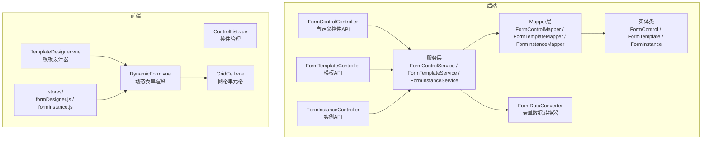
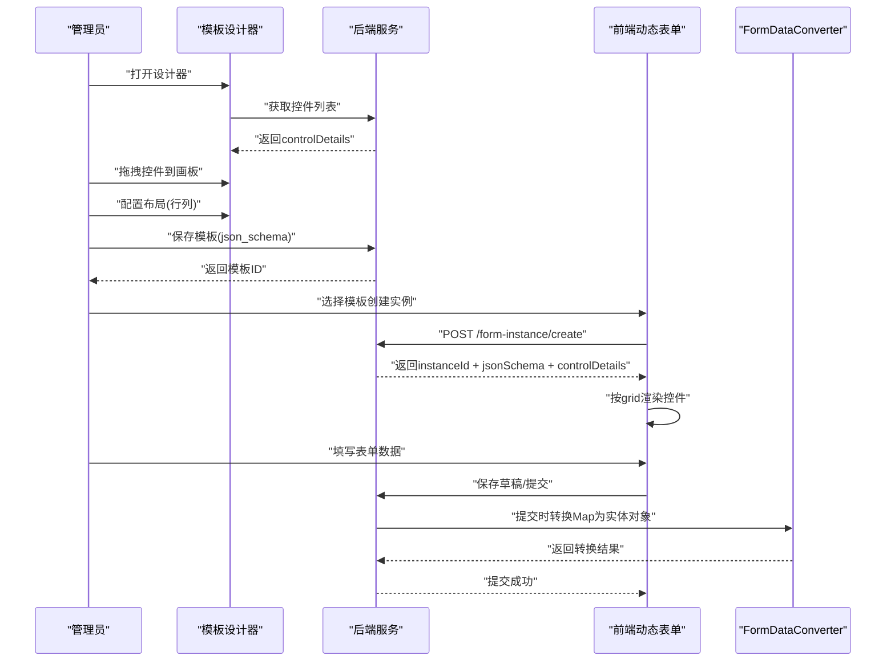
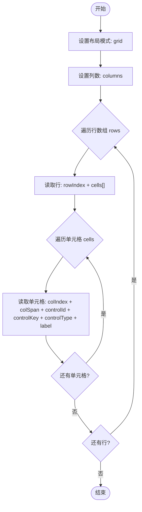

# JSON Schema 设计规范

<cite>
**本文档引用的文件**
- [VAT_EPR_动态表单技术方案.md](file://VAT_EPR_动态表单技术方案.md)
</cite>

## 目录
1. [简介](#简介)
2. [项目结构](#项目结构)
3. [核心组件](#核心组件)
4. [架构总览](#架构总览)
5. [详细组件分析](#详细组件分析)
6. [依赖分析](#依赖分析)
7. [性能考虑](#性能考虑)
8. [故障排查指南](#故障排查指南)
9. [结论](#结论)
10. [附录](#附录)

## 简介
本规范面向“动态表单系统”的JSON Schema设计，重点阐述表单布局定义结构、控件配置项规范、控件类型与验证规则映射关系，并提供可复用的表单模板设计最佳实践。该系统采用“模板 + 控件 + 实例”三层结构：模板定义布局与控件引用，控件定义字段元信息与校验规则，实例承载运行期表单数据与状态流转。

## 项目结构
- 后端采用Spring Boot + MyBatis-Plus，核心模块包含：
  - 控件管理：自定义控件定义与校验规则
  - 模板管理：服务单模板的布局与控件引用
  - 实例管理：服务单实例的数据存储与提交转换
- 前端采用Vue 3 + Element Plus，核心模块包含：
  - 控件管理界面
  - 模板设计器（拖拽画板）
  - 动态表单渲染与填写
  - 服务类目三级联动

**图表来源**
- [VAT_EPR_动态表单技术方案.md: 773-852:773-852](file://VAT_EPR_动态表单技术方案.md#L773-L852)

**章节来源**
- [VAT_EPR_动态表单技术方案.md: 773-852:773-852](file://VAT_EPR_动态表单技术方案.md#L773-L852)

## 核心组件
- 自定义控件表（form_control）：定义控件名称、键名、类型、占位提示、说明、必填、正则、长度限制、下拉选项、上传配置、默认值、排序与启用状态等元信息。
- 服务单模板表（form_template）：存储模板名称、版本、国家代码、服务类目层级、json_schema（布局与控件引用）、状态与备注。
- 服务单实例表（form_instance）：存储模板引用、表单数据（Map<controlKey, value>序列化为JSON）、状态与时间戳。

**章节来源**
- [VAT_EPR_动态表单技术方案.md: 33-86:33-86](file://VAT_EPR_动态表单技术方案.md#L33-L86)
- [VAT_EPR_动态表单技术方案.md: 132-153:132-153](file://VAT_EPR_动态表单技术方案.md#L132-L153)

## 架构总览
动态表单系统的核心流程：
- 管理员在模板设计器中拖拽控件，配置布局（grid），生成json_schema。
- 控件在后端以controlKey唯一标识，模板通过controlId引用控件。
- 实例创建时加载json_schema与controlDetails，前端按grid布局渲染控件。
- 填写完成后保存草稿或提交，提交时将Map<controlKey, value>交给后端转换为实体对象。

**图表来源**
- [VAT_EPR_动态表单技术方案.md: 415-478:415-478](file://VAT_EPR_动态表单技术方案.md#L415-L478)
- [VAT_EPR_动态表单技术方案.md: 592-728:592-728](file://VAT_EPR_动态表单技术方案.md#L592-L728)

## 详细组件分析

### JSON Schema 布局结构设计
- 布局模式：grid
- 列数：columns（整数）
- 行集合：rows（数组），每行包含：
  - rowIndex（整数）
  - cells（数组），每个单元格包含：
    - colIndex（整数）
    - colSpan（整数，单元格跨越的列数）
    - controlId（整数，引用控件ID）
    - controlKey（字符串，唯一键名，格式：ClassName.fieldName）
    - controlType（字符串，控件类型）
    - label（字符串，显示标签）

**图表来源**
- [VAT_EPR_动态表单技术方案.md: 484-529:484-529](file://VAT_EPR_动态表单技术方案.md#L484-L529)

**章节来源**
- [VAT_EPR_动态表单技术方案.md: 484-529:484-529](file://VAT_EPR_动态表单技术方案.md#L484-L529)

### 控件配置项规范
- controlId：控件在系统中的唯一标识（整数）
- controlKey：控件键名，格式为“ClassName.fieldName”，用于唯一标识字段与数据映射
- controlType：控件类型，支持 INPUT、SELECT、SWITCH、UPLOAD、TEXTAREA、DATE、NUMBER
- label：控件显示标签
- 其他元信息（来自控件表）：
  - controlName：控件名称（展示用）
  - placeholder：占位文本
  - tips：控件说明
  - required：是否必填
  - regexPattern / regexMessage：正则表达式与错误提示
  - min_length / max_length：最小/最大长度
  - select_options：下拉框选项（数组）
  - upload_config：上传配置（仅UPLOAD类型有效）
  - default_value：默认值
  - sort / enabled：排序与启用状态

命名规则与约束：
- controlKey 必须满足“ClassName.fieldName”格式，且在数据库层面具有唯一性
- controlKey 与表单数据存储的key保持一致，便于直接映射

**章节来源**
- [VAT_EPR_动态表单技术方案.md: 33-59:33-59](file://VAT_EPR_动态表单技术方案.md#L33-L59)
- [VAT_EPR_动态表单技术方案.md: 61-65:61-65](file://VAT_EPR_动态表单技术方案.md#L61-L65)

### 控件类型与验证规则映射
- INPUT：文本输入，支持必填、最小/最大长度、正则校验
- SELECT：下拉选择，支持必填与预设选项
- SWITCH：开关，布尔值
- UPLOAD：文件上传，支持最大数量、文件类型、大小限制
- TEXTAREA：多行文本，支持必填与长度限制
- DATE：日期选择，字符串格式（建议ISO 8601）
- NUMBER：数值输入，支持必填与数值范围（由业务决定）

前端渲染映射（示例）：
- INPUT → el-input
- SELECT → el-select
- SWITCH → el-switch
- UPLOAD → el-upload（读取uploadConfig配置）
- TEXTAREA → el-input type="textarea"
- DATE → el-date-picker
- NUMBER → el-input-number

**章节来源**
- [VAT_EPR_动态表单技术方案.md: 531-548:531-548](file://VAT_EPR_动态表单技术方案.md#L531-L548)

### 表单数据存储策略
- 存储格式：Map<String, Object>，序列化为JSON字符串存入form_instance.form_data
- key命名规范：ClassName.fieldName（与controlKey一致）
- value类型：
  - 文本：String
  - 开关：Boolean
  - 数字：Number
  - 文件上传：List<{ fileName, fileUrl, fileSize }>
  - 日期：String（ISO 8601格式 yyyy-MM-dd）

提交转换流程：
- 后端解析formData JSON为Map
- 使用FormDataConverter按ClassName分组，反射赋值到实体类对象
- 返回Map<ClassName, 实体对象>供后续业务处理

**章节来源**
- [VAT_EPR_动态表单技术方案.md: 579-589:579-589](file://VAT_EPR_动态表单技术方案.md#L579-L589)
- [VAT_EPR_动态表单技术方案.md: 592-704:592-704](file://VAT_EPR_动态表单技术方案.md#L592-L704)

### 最佳实践与设计建议
- 模板版本管理：模板发布后不可修改json_schema，若需变更需升版本号，避免已存在实例的数据错乱
- 控件唯一性：controlKey在数据库层面唯一，后端提交时进行格式校验（必须含一个点）
- 实体类注册：FormDataConverter中的CLASS_REGISTRY需在新增业务实体时手动注册，后续可扩展为通过注解扫描自动注册
- 文件上传：Upload类型控件提交时value为文件URL列表，需配合文件服务（OSS/MinIO）使用
- 数据安全：form_data存储JSON时应过滤敏感字段；提交后状态变更为已提交，禁止再次修改
- 并发控制：同一服务单实例的保存操作需加乐观锁（version字段）防止并发覆盖

**章节来源**
- [VAT_EPR_动态表单技术方案.md: 856-869:856-869](file://VAT_EPR_动态表单技术方案.md#L856-L869)

## 依赖分析
- 控件表与模板表：模板通过controlId引用控件，控件提供controlKey与校验规则
- 模板表与实例表：实例创建时加载模板的json_schema与controlDetails
- 前端渲染：根据json_schema的grid布局与controlType渲染对应组件
- 数据转换：提交时将Map<controlKey, value>转换为实体对象

**图表来源**
- [VAT_EPR_动态表单技术方案.md: 33-86:33-86](file://VAT_EPR_动态表单技术方案.md#L33-L86)
- [VAT_EPR_动态表单技术方案.md: 132-153:132-153](file://VAT_EPR_动态表单技术方案.md#L132-L153)
- [VAT_EPR_动态表单技术方案.md: 592-704:592-704](file://VAT_EPR_动态表单技术方案.md#L592-L704)

**章节来源**
- [VAT_EPR_动态表单技术方案.md: 33-86:33-86](file://VAT_EPR_动态表单技术方案.md#L33-L86)
- [VAT_EPR_动态表单技术方案.md: 132-153:132-153](file://VAT_EPR_动态表单技术方案.md#L132-L153)
- [VAT_EPR_动态表单技术方案.md: 592-704:592-704](file://VAT_EPR_动态表单技术方案.md#L592-L704)

## 性能考虑
- 控件列表查询：建议分页与关键词检索，减少前端渲染压力
- 模板加载：仅在实例创建时加载必要字段（json_schema与controlDetails），避免一次性加载过多模板
- 前端渲染：grid布局按列数repeat，单元格span控制宽度，避免复杂嵌套导致重排
- 数据转换：按ClassName分组与反射赋值，注意异常日志与回滚策略

## 故障排查指南
- controlKey格式错误：确保包含一个点，且数据库唯一
- 控件未找到：检查controlId是否正确，controlDetails是否包含对应控件
- 提交转换失败：检查实体类是否在CLASS_REGISTRY中注册，字段类型是否匹配
- 文件上传异常：确认upload_config配置正确，文件URL是否可访问
- 并发覆盖：保存时检查version字段，避免乐观锁冲突

**章节来源**
- [VAT_EPR_动态表单技术方案.md: 592-728:592-728](file://VAT_EPR_动态表单技术方案.md#L592-L728)
- [VAT_EPR_动态表单技术方案.md: 856-869:856-869](file://VAT_EPR_动态表单技术方案.md#L856-L869)

## 结论
本规范系统性地定义了动态表单系统的JSON Schema布局结构、控件配置项规范以及控件类型与验证规则的映射关系，并提供了模板版本管理、控件唯一性、实体类注册、文件上传与数据安全等关键约束与最佳实践。遵循本规范可实现高度可复用的表单模板设计与稳定的数据流转。

## 附录
- 完整JSON Schema结构示例与字段说明见“表单布局定义”与“控件配置项规范”
- 接口定义与调用示例见“接口文档”与“核心业务时序逻辑”