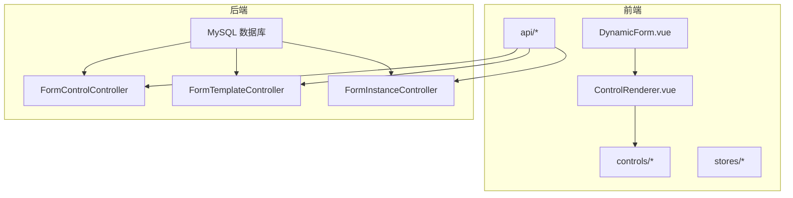
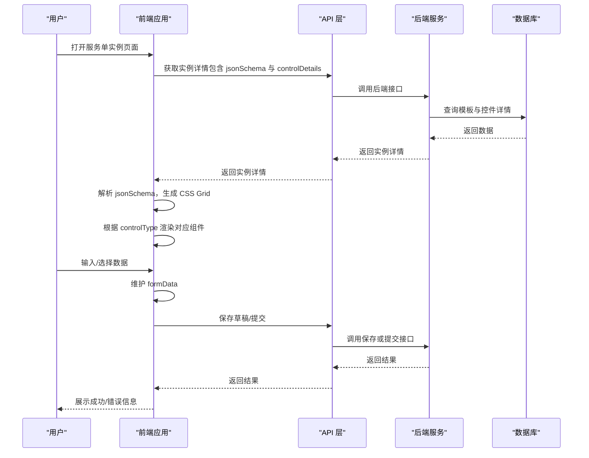
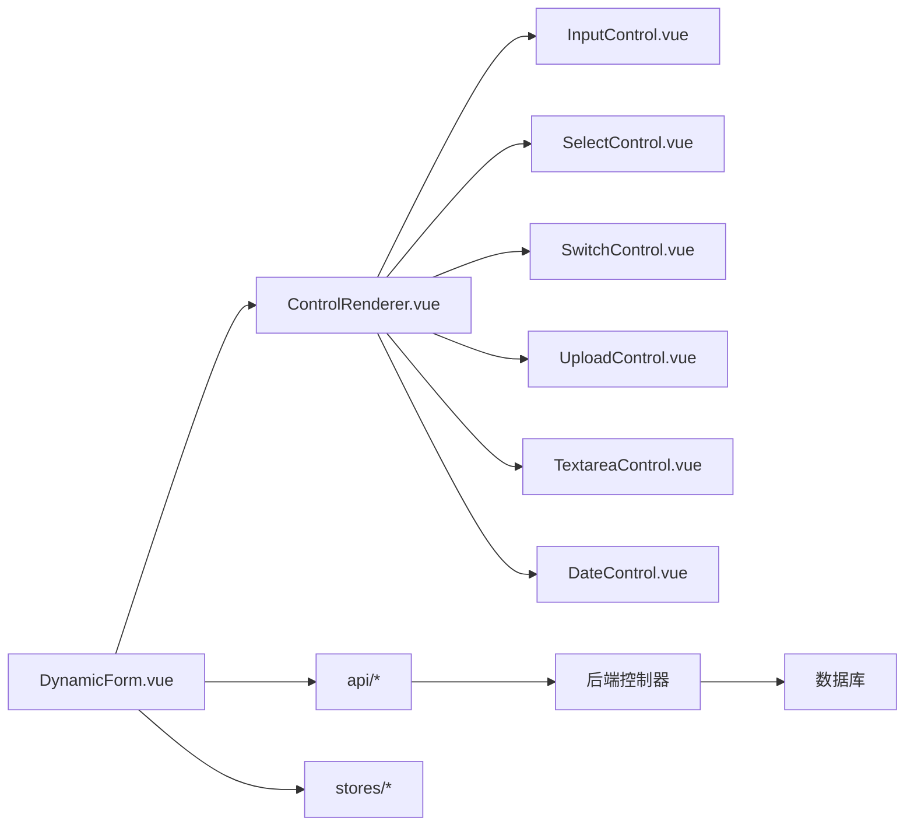

# 前端渲染引擎实现

<cite>
**本文引用的文件**
- [VAT_EPR_动态表单技术方案.md](file://VAT_EPR_动态表单技术方案.md)
</cite>

## 目录
1. [简介](#简介)
2. [项目结构](#项目结构)
3. [核心组件](#核心组件)
4. [架构总览](#架构总览)
5. [详细组件分析](#详细组件分析)
6. [依赖关系分析](#依赖关系分析)
7. [性能考量](#性能考量)
8. [故障排查指南](#故障排查指南)
9. [结论](#结论)
10. [附录](#附录)

## 简介
本文件面向前端渲染引擎实现，聚焦于“Vue 3 组件如何解析 JSON Schema 并动态生成表单布局”，涵盖：
- CSS Grid 布局的实现原理与样式配置
- 控件映射机制：根据 controlType 动态选择 Element Plus 组件进行渲染
- 组件属性绑定、事件处理与数据流管理
- 动态组件注册、props 传递与插槽使用
- 提供完整的 Vue 伪代码示例与实现指导，帮助开发者快速理解前端动态表单渲染的核心机制

## 项目结构
该仓库以“技术方案”文档为核心，明确了前后端技术栈、数据库设计、接口定义以及前端动态表单渲染的关键实现路径。前端采用 Vue 3 + Element Plus，后端采用 Spring Boot + MyBatis-Plus。动态表单渲染由前端负责，后端提供 JSON Schema 与控件元数据。

图表来源
- [VAT_EPR_动态表单技术方案.md: 815-852:815-852](file://VAT_EPR_动态表单技术方案.md#L815-L852)

章节来源
- [VAT_EPR_动态表单技术方案.md: 19-28:19-28](file://VAT_EPR_动态表单技术方案.md#L19-L28)
- [VAT_EPR_动态表单技术方案.md: 815-852:815-852](file://VAT_EPR_动态表单技术方案.md#L815-L852)

## 核心组件
- 动态表单主组件：负责接收后端返回的 jsonSchema 与 controlDetails，构建 CSS Grid 布局，并驱动控件渲染。
- 控件分发渲染器：根据 cell 的 controlType 决定渲染哪个 Element Plus 组件。
- 控件集合：针对不同 controlType 的具体组件封装（如 Input、Select、Switch、Upload、Textarea、Date、Number）。
- API 层：封装对后端接口的调用，获取控件列表、模板详情与实例数据。
- 状态管理：用于维护当前表单实例的数据与布局状态。

章节来源
- [VAT_EPR_动态表单技术方案.md: 833-848:833-848](file://VAT_EPR_动态表单技术方案.md#L833-L848)

## 架构总览
前端渲染引擎围绕“JSON Schema + 控件映射 + Element Plus 组件”的组合展开，形成如下闭环：
- 后端提供 jsonSchema（布局与控件引用）与 controlDetails（控件元数据）
- 前端解析 jsonSchema，按行/列生成 CSS Grid
- 前端根据 controlType 动态渲染对应 Element Plus 组件
- 前端维护 formData，支持保存草稿与提交

图表来源
- [VAT_EPR_动态表单技术方案.md: 437-478:437-478](file://VAT_EPR_动态表单技术方案.md#L437-L478)

## 详细组件分析

### 动态表单主组件（DynamicForm.vue）
职责
- 接收后端返回的 jsonSchema 与 controlDetails
- 将 controlDetails 转换为 Map<controlId, ControlConfig>
- 遍历 rows 生成 CSS Grid 布局
- 为每个 cell 渲染对应的 Element Plus 组件
- 维护 formData，支持保存草稿与提交

实现要点
- 使用 v-for 遍历 schema.rows 生成行容器，设置 CSS Grid 的列数
- 在每行内遍历 cells，计算 gridColumn 的跨度
- 通过 el-form-item 包裹控件，绑定 label 与动态校验规则
- 使用动态组件 <component :is="resolveComponent(...)"> 根据 controlType 渲染
- v-model 绑定到 formData[cell.controlKey]，确保双向数据流

章节来源
- [VAT_EPR_动态表单技术方案.md: 531-577:531-577](file://VAT_EPR_动态表单技术方案.md#L531-L577)

### 控件分发渲染器（ControlRenderer.vue）
职责
- 根据 cell.controlType 决定渲染哪个 Element Plus 组件
- 计算并返回组件所需的 props（如 placeholder、disabled、options 等）
- 处理上传控件的特殊配置（maxCount、accept）

实现要点
- 维护 controlType 到组件的映射表
- resolveComponent(controlType) 返回对应组件标识
- resolveProps(cell) 返回 props 映射（从 controlDetails 与 cell 中提取）
- 对上传控件读取 upload_config 并注入到 props

章节来源
- [VAT_EPR_动态表单技术方案.md: 537-544:537-544](file://VAT_EPR_动态表单技术方案.md#L537-L544)

### 控件集合（controls/*）
职责
- 针对不同 controlType 的具体组件封装
- 统一处理 v-model、props 与事件
- 支持 Element Plus 组件的原生能力（如 el-input、el-select、el-switch、el-upload、el-input-number、el-date-picker）

实现要点
- InputControl.vue：渲染 el-input，支持 v-model 与 placeholder
- SelectControl.vue：渲染 el-select，支持 v-model 与 options
- SwitchControl.vue：渲染 el-switch，支持 v-model
- UploadControl.vue：渲染 el-upload，读取 upload_config 并注入 maxCount、accept 等
- TextareaControl.vue：渲染 el-input type="textarea"
- DateControl.vue：渲染 el-date-picker
- NumberControl.vue：渲染 el-input-number

章节来源
- [VAT_EPR_动态表单技术方案.md: 836-842:836-842](file://VAT_EPR_动态表单技术方案.md#L836-L842)

### CSS Grid 布局实现原理与样式配置
实现原理
- 外层容器使用 CSS Grid，列数由 schema.columns 决定
- 每行容器设置 gridTemplateColumns: repeat(columns, 1fr)
- 每个单元格使用 gridColumn: span colSpan 设置跨列宽度
- 单元格内部使用 el-form-item 包裹，绑定 label 与动态校验规则

样式配置
- 行高：可通过行容器的高度或 padding 控制
- 间距：通过单元格的 margin 或 gap 控制
- 响应式：可结合媒体查询或 Element Plus 的栅格系统

章节来源
- [VAT_EPR_动态表单技术方案.md: 536](file://VAT_EPR_动态表单技术方案.md#L536)

### 控件映射机制与 Element Plus 组件选择
映射规则
- INPUT → el-input
- SELECT → el-select
- SWITCH → el-switch
- UPLOAD → el-upload（读取 upload_config）
- TEXTAREA → el-input type="textarea"
- DATE → el-date-picker
- NUMBER → el-input-number

实现方式
- 通过 resolveComponent(controlType) 返回组件标识
- 使用 <component :is="..."> 动态渲染
- 通过 resolveProps(cell) 注入 props

章节来源
- [VAT_EPR_动态表单技术方案.md: 537-544:537-544](file://VAT_EPR_动态表单技术方案.md#L537-L544)

### 组件属性绑定、事件处理与数据流管理
属性绑定
- v-model 绑定到 formData[cell.controlKey]，确保双向数据流
- v-bind 绑定 resolveProps 返回的 props 映射
- label 与 rules 通过 el-form-item 绑定

事件处理
- 上传控件：监听上传完成事件，更新文件列表
- 下拉选择：监听 change 事件，更新选中值
- 文本输入：监听 input/blur 事件，触发校验

数据流管理
- formData 作为响应式对象，随用户输入实时更新
- 保存草稿：将 formData 原样传给后端
- 提交：触发提交接口，后端进行对象转换

章节来源
- [VAT_EPR_动态表单技术方案.md: 546-547:546-547](file://VAT_EPR_动态表单技术方案.md#L546-L547)

### 动态组件注册、props 传递与插槽使用
动态组件注册
- 通过 resolveComponent(controlType) 返回组件标识
- 在模板中使用 <component :is="..."> 动态渲染

props 传递
- resolveProps(cell) 返回控件所需 props
- 上传控件读取 upload_config 并注入 maxCount、accept 等

插槽使用
- 可在控件组件中使用插槽扩展（如上传控件的默认插槽、文件列表插槽等）
- 插槽用于自定义上传按钮、文件列表展示等

章节来源
- [VAT_EPR_动态表单技术方案.md: 537-544:537-544](file://VAT_EPR_动态表单技术方案.md#L537-L544)

### Vue 伪代码示例与实现指导
以下为基于技术方案的 Vue 伪代码示例，展示动态表单渲染的关键流程与实现要点。为避免直接粘贴代码，示例以“路径+行号”形式标注。

- 动态表单模板与渲染流程
  - [模板与渲染流程:550-577](file://VAT_EPR_动态表单技术方案.md#L550-L577)
- 控件映射与 props 计算
  - [控件映射规则:537-544](file://VAT_EPR_动态表单技术方案.md#L537-L544)
  - [控件属性计算:537-544](file://VAT_EPR_动态表单技术方案.md#L537-L544)
- CSS Grid 布局与样式
  - [Grid 布局生成](file://VAT_EPR_动态表单技术方案.md#L536)
- 数据流与保存/提交
  - [数据流与保存/提交:546-547](file://VAT_EPR_动态表单技术方案.md#L546-L547)

章节来源
- [VAT_EPR_动态表单技术方案.md: 531-577:531-577](file://VAT_EPR_动态表单技术方案.md#L531-L577)

## 依赖关系分析
- 前端组件依赖
  - DynamicForm.vue 依赖 ControlRenderer.vue
  - ControlRenderer.vue 依赖 controls/* 下的具体控件
  - API 层封装后端接口调用
  - 状态管理 stores 维护 formData 与布局状态
- 后端依赖
  - FormTemplateController 与 FormInstanceController 提供 jsonSchema 与 controlDetails
  - 数据库存储 form_control 与 form_template

图表来源
- [VAT_EPR_动态表单技术方案.md: 833-848:833-848](file://VAT_EPR_动态表单技术方案.md#L833-L848)
- [VAT_EPR_动态表单技术方案.md: 815-852:815-852](file://VAT_EPR_动态表单技术方案.md#L815-L852)

## 性能考量
- 渲染优化
  - 使用 v-for 的 key 为 row.rowIndex 与 cell.controlId，避免不必要的重排
  - 将 resolveComponent 与 resolveProps 缓存，减少重复计算
- 数据绑定
  - 使用 v-model 双向绑定，避免频繁的事件监听
  - 对上传控件的文件列表进行节流更新
- 校验策略
  - 将校验规则构建为函数，按需执行
  - 对高频输入（如文本框）采用防抖

## 故障排查指南
常见问题与定位
- 控件不显示或渲染异常
  - 检查 controlType 是否在映射表中
  - 检查 resolveComponent 返回的组件标识是否正确
- 样式错乱
  - 检查 gridTemplateColumns 与 gridColumn 的计算是否正确
  - 检查 colSpan 是否超过 columns
- 数据未更新
  - 检查 v-model 绑定的 key 是否与 controlKey 一致
  - 检查 formData 的响应式更新
- 上传控件异常
  - 检查 upload_config 的 maxCount、accept 是否正确
  - 检查上传完成事件回调是否更新文件列表

章节来源
- [VAT_EPR_动态表单技术方案.md: 537-544:537-544](file://VAT_EPR_动态表单技术方案.md#L537-L544)
- [VAT_EPR_动态表单技术方案.md: 536](file://VAT_EPR_动态表单技术方案.md#L536)
- [VAT_EPR_动态表单技术方案.md: 546-547:546-547](file://VAT_EPR_动态表单技术方案.md#L546-L547)

## 结论
本文档系统梳理了前端渲染引擎在 Vue 3 + Element Plus 环境下的实现思路，重点阐述了：
- 如何解析 JSON Schema 并生成 CSS Grid 布局
- 如何根据 controlType 动态选择 Element Plus 组件
- 如何通过 v-model、v-bind 与动态组件实现属性绑定与事件处理
- 如何管理 formData 并与后端接口协同工作

通过以上机制，前端可以高效地实现“所见即所得”的动态表单渲染，满足多国家、多服务类型的复杂业务场景。

## 附录
- 项目结构建议（前端）
  - [前端结构建议:815-852](file://VAT_EPR_动态表单技术方案.md#L815-L852)
- 关键约束与注意事项
  - [关键约束与注意事项:856-869](file://VAT_EPR_动态表单技术方案.md#L856-L869)