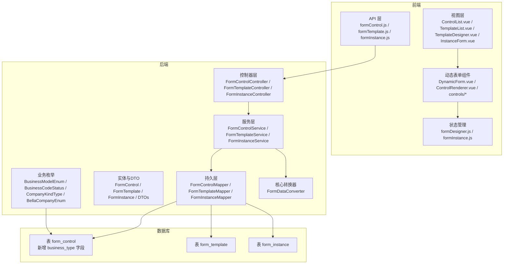
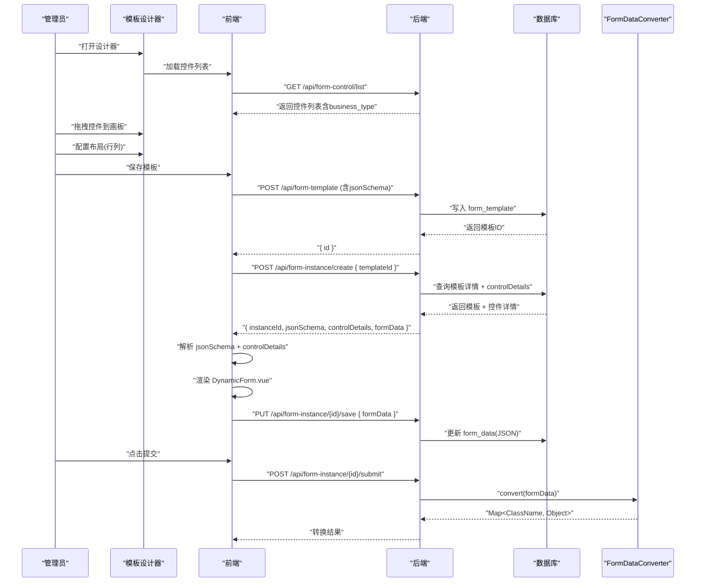
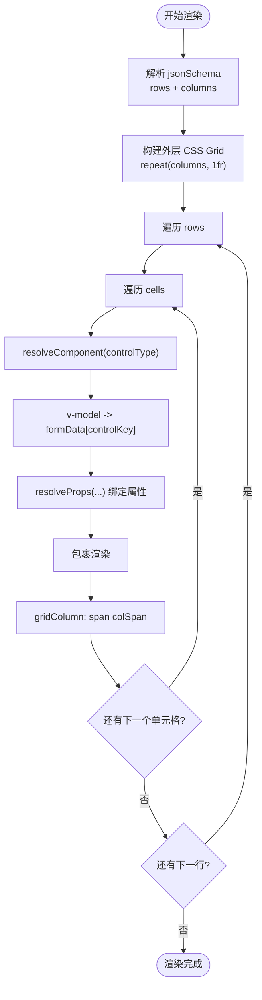
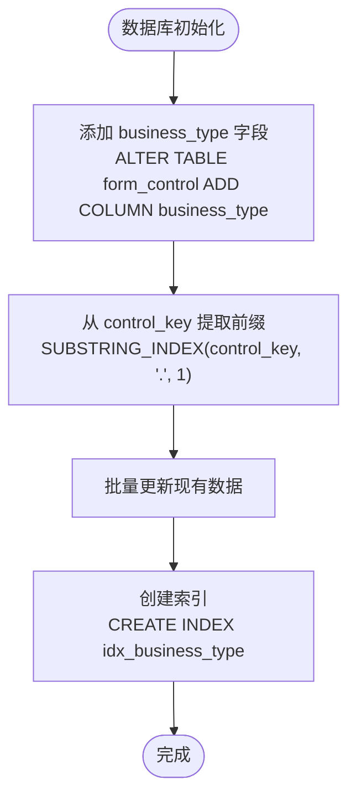
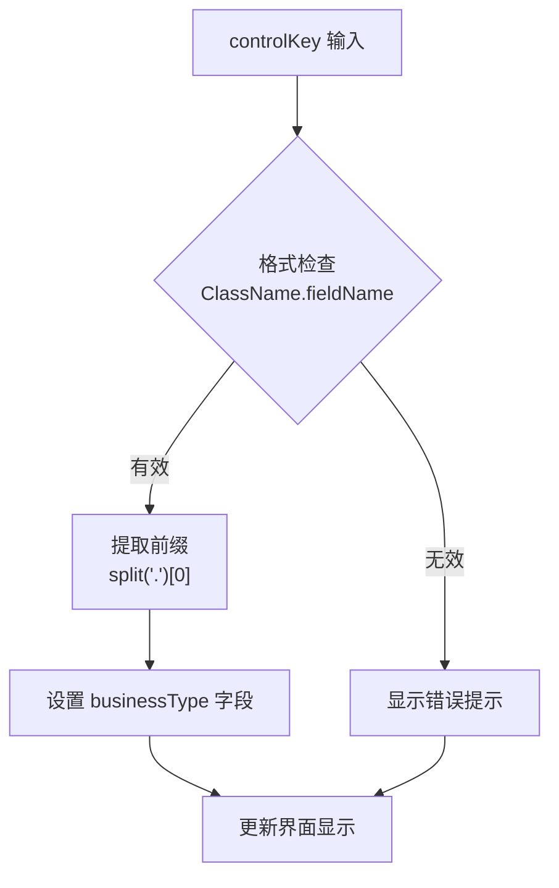
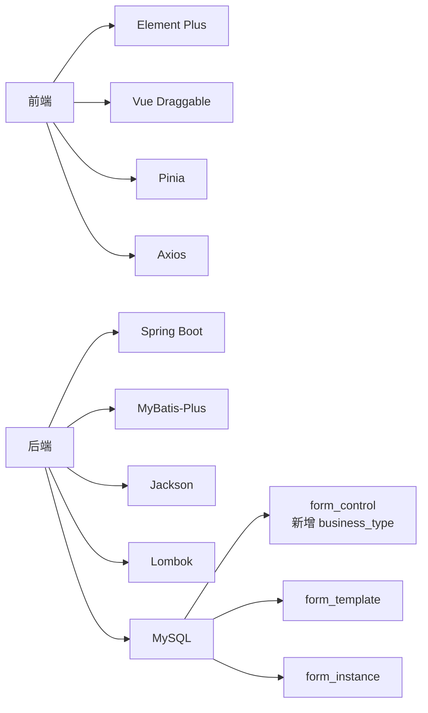

# 动态表单渲染机制

<cite>
**本文引用的文件**
- [VAT_EPR_动态表单技术方案.md](file://VAT_EPR_动态表单技术方案.md)
- [InstanceForm.vue](file://genetics-web/src/views/instance/InstanceForm.vue)
- [DynamicForm.vue](file://genetics-web/src/components/DynamicForm/DynamicForm.vue)
- [ControlRenderer.vue](file://genetics-web/src/components/DynamicForm/ControlRenderer.vue)
- [ControlList.vue](file://genetics-web/src/views/control/ControlList.vue)
- [formInstance.js](file://genetics-web/src/api/formInstance.js)
- [formDesigner.js](file://genetics-web/src/stores/formDesigner.js)
- [index.js](file://genetics-web/src/router/index.js)
- [003-add-business-type.sql](file://genetics-server/src/main/resources/db/changelog/sql/003-add-business-type.sql)
- [BusinessModelEnum.java](file://genetics-server/src/main/java/com/genetics/enums/BusinessModelEnum.java)
- [BusinessCodeStatus.java](file://genetics-server/src/main/java/com/genetics/enums/BusinessCodeStatus.java)
- [CompanyKindType.java](file://genetics-server/src/main/java/com/genetics/enums/CompanyKindType.java)
- [BellaCompanyEnum.java](file://genetics-server/src/main/java/com/genetics/enums/BellaCompanyEnum.java)
</cite>

## 更新摘要
**变更内容**
- 新增业务类型分组显示功能，支持按实体类名对控件进行分类管理
- 实现自动业务类型检测机制，从controlKey中智能提取业务类型前缀
- 扩展控件管理界面，增加业务分组筛选和折叠展示功能
- 完善数据库结构，新增business_type字段支持业务类型分组查询

## 目录
1. [简介](#简介)
2. [项目结构](#项目结构)
3. [核心组件](#核心组件)
4. [架构总览](#架构总览)
5. [详细组件分析](#详细组件分析)
6. [业务类型分组功能](#业务类型分组功能)
7. [依赖关系分析](#依赖关系分析)
8. [性能考虑](#性能考虑)
9. [故障排查指南](#故障排查指南)
10. [结论](#结论)
11. [附录](#附录)

## 简介
本方案围绕"动态表单"目标，提供从数据库设计、服务端核心转换器、到前端动态渲染与状态管理的完整实现指导。重点包括：
- JSON Schema 的布局与控件定义规范
- 前端基于 CSS Grid 的布局实现与 Element Plus 组件映射
- 动态验证规则生成、错误处理与用户反馈
- 表单数据双向绑定、实时验证与状态管理
- 服务端将 Map<controlKey, value> 转换为业务实体对象的机制
- **新增**：完整的实例表单编辑界面（InstanceForm.vue）
- **新增**：业务类型分组显示与自动检测功能

## 项目结构
该仓库以"技术方案文档"的形式呈现了完整的动态表单系统设计，涵盖前后端职责划分与交互流程。后端采用 Spring Boot + MyBatis-Plus，前端采用 Vue 3 + Element Plus + Vite + Pinia。数据库包含三张核心表：自定义控件表、服务单模板表、服务单实例表。

**图表来源**
- [VAT_EPR_动态表单技术方案.md: 773-852:773-852](file://VAT_EPR_动态表单技术方案.md#L773-L852)
- [003-add-business-type.sql: 1-17:1-17](file://genetics-server/src/main/resources/db/changelog/sql/003-add-business-type.sql#L1-L17)

**章节来源**
- [VAT_EPR_动态表单技术方案.md: 773-852:773-852](file://VAT_EPR_动态表单技术方案.md#L773-L852)

## 核心组件
- 数据模型与存储
  - 自定义控件表：定义控件名称、类型、占位提示、必填、正则约束、下拉选项、上传配置、默认值等元信息。
  - **新增**：business_type 字段，用于按业务类型分组筛选控件
  - 服务单模板表：存储 JSON Schema（布局与控件引用），以及模板基础信息。
  - 服务单实例表：存储运行时表单数据（Map<controlKey, value> 的 JSON 字符串）。
- 业务枚举支持
  - BusinessModelEnum：EPR经营方式枚举，支持多语言标识
  - BusinessCodeStatus：业务代码状态枚举，支持状态管理
  - CompanyKindType：公司类型枚举，支持中英文对照
  - BellaCompanyEnum：法案类型枚举，支持JSON格式序列化
- 服务端核心
  - FormDataConverter：将 Map<controlKey, value> 按 ClassName 分组并通过反射填充实体对象。
- 前端渲染
  - DynamicForm.vue：动态表单主组件，负责解析 JSON Schema 并渲染。
  - ControlRenderer.vue：控件分发渲染器，根据 controlType 决定具体 Element Plus 组件。
  - **新增**：InstanceForm.vue：完整的表单编辑界面，集成业务状态管理和文件上传功能。
  - **新增**：ControlList.vue：控件管理界面，支持业务类型分组显示和自动检测。
  - controls/*：各控件组件（INPUT/SELECT/SWITCH/UPLOAD/TEXTAREA/DATE/NUMBER）。
  - formInstance.js：实例状态管理，维护 formData、校验规则、提交状态等。

**章节来源**
- [VAT_EPR_动态表单技术方案.md: 31-163:31-163](file://VAT_EPR_动态表单技术方案.md#L31-L163)
- [VAT_EPR_动态表单技术方案.md: 592-728:592-728](file://VAT_EPR_动态表单技术方案.md#L592-L728)
- [VAT_EPR_动态表单技术方案.md: 815-852:815-852](file://VAT_EPR_动态表单技术方案.md#L815-L852)
- [003-add-business-type.sql: 6-16:6-16](file://genetics-server/src/main/resources/db/changelog/sql/003-add-business-type.sql#L6-L16)
- [BusinessModelEnum.java: 1-146:1-146](file://genetics-server/src/main/java/com/genetics/enums/BusinessModelEnum.java#L1-L146)
- [BusinessCodeStatus.java: 1-49:1-49](file://genetics-server/src/main/java/com/genetics/enums/BusinessCodeStatus.java#L1-L49)

## 架构总览
动态表单系统遵循"模板驱动 + 运行时渲染 + 服务端转换"的模式：
- 设计阶段：管理员在设计器中拖拽控件、配置布局，生成 JSON Schema 并保存为模板。
- 运行阶段：操作员打开服务单实例，前端根据模板的 JSON Schema 和控件详情动态渲染表单。
- 提交阶段：前端将 formData 原样提交，服务端解析并转换为业务实体对象，触发后续业务。

**图表来源**
- [VAT_EPR_动态表单技术方案.md: 415-478:415-478](file://VAT_EPR_动态表单技术方案.md#L415-L478)
- [VAT_EPR_动态表单技术方案.md: 531-548:531-548](file://VAT_EPR_动态表单技术方案.md#L531-L548)
- [VAT_EPR_动态表单技术方案.md: 705-728:705-728](file://VAT_EPR_动态表单技术方案.md#L705-L728)

## 详细组件分析

### JSON Schema 设计与规范
- 布局定义
  - layout：当前支持 grid，表示使用 CSS Grid 布局。
  - columns：网格列数，用于计算 gridTemplateColumns。
  - rows：数组，每个元素代表一行，包含 rowIndex 与 cells。
- 单元格定义
  - colIndex / colSpan：定位与跨列。
  - controlId / controlKey / controlType：引用控件定义与类型。
  - label：表单项标签。
- 控件配置
  - 控件元信息来自 form_control 表，包括必填、正则、最小/最大长度、下拉选项、上传配置、默认值等。
  - **新增**：business_type 字段，用于业务类型分组管理。
- 数据存储
  - form_data 以 Map<controlKey, value> 的 JSON 字符串存储，controlKey 格式为 "ClassName.fieldName"。

**章节来源**
- [VAT_EPR_动态表单技术方案.md: 89-128:89-128](file://VAT_EPR_动态表单技术方案.md#L89-L128)
- [VAT_EPR_动态表单技术方案.md: 167-387:167-387](file://VAT_EPR_动态表单技术方案.md#L167-L387)
- [VAT_EPR_动态表单技术方案.md: 482-548:482-548](file://VAT_EPR_动态表单技术方案.md#L482-L548)
- [003-add-business-type.sql: 6-16:6-16](file://genetics-server/src/main/resources/db/changelog/sql/003-add-business-type.sql#L6-L16)

### 前端动态渲染与布局实现
- CSS Grid 布局
  - 外层容器按 columns 生成 repeat 列的网格。
  - 每个单元格通过 gridColumn: span colSpan 实现跨列。
- 控件映射与属性绑定
  - 使用 <el-form-item> 包裹，label 来自 cell.label。
  - 通过 <component :is="resolveComponent(...)"> 动态渲染 Element Plus 组件。
  - v-model 绑定到 formData[cell.controlKey]，实现双向绑定。
  - v-bind 绑定 resolveProps(...) 生成的属性集合。
- 控件类型与 Element Plus 组件映射
  - INPUT → el-input
  - SELECT → el-select
  - SWITCH → el-switch
  - UPLOAD → el-upload（读取 uploadConfig）
  - TEXTAREA → el-input(type="textarea")
  - DATE → el-date-picker
  - NUMBER → el-input-number

**图表来源**
- [VAT_EPR_动态表单技术方案.md: 531-577:531-577](file://VAT_EPR_动态表单技术方案.md#L531-L577)

**章节来源**
- [VAT_EPR_动态表单技术方案.md: 531-577:531-577](file://VAT_EPR_动态表单技术方案.md#L531-L577)

### 完整的实例表单编辑界面（InstanceForm.vue）
**新增**：InstanceForm.vue 提供了完整的表单编辑体验，集成了业务状态管理、服务信息卡片和动态表单渲染。

- 页面结构
  - 顶部信息栏：显示服务单名称、版本、国家、服务类型和状态标签
  - 业务状态卡片：管理订单状态、服务开始时间和结束时间
  - 动态表单区域：根据 JSON Schema 渲染的表单内容
  - 提交结果显示：展示转换后的实体对象结果
- 功能特性
  - 业务状态枚举：支持多种订单状态的下拉选择
  - 时间管理：服务开始时间和结束时间的日期选择器
  - 状态控制：根据实例状态决定表单的只读和操作权限
  - 实时验证：提交前先执行表单校验
  - 结果展示：提交后显示转换结果的 JSON 格式

**章节来源**
- [InstanceForm.vue: 1-235:1-235](file://genetics-web/src/views/instance/InstanceForm.vue#L1-L235)

### 表单验证规则的动态生成与错误处理
- 规则来源
  - 必填：required=true
  - 正则：regexPattern + regexMessage
  - 长度：minLength / maxLength
- 规则生成与应用
  - 在前端根据 controlDetails 为每个 controlKey 生成验证规则。
  - 将规则注入 <el-form-item :rules="...">。
- 错误处理与用户反馈
  - Element Plus 默认会在输入变化或失焦时进行校验。
  - 建议在提交时统一触发全表单校验，并对错误进行汇总提示。
- 实时验证与状态管理
  - 使用 Pinia 管理 formData 与校验状态，确保 v-model 与校验规则同步更新。

**章节来源**
- [VAT_EPR_动态表单技术方案.md: 545-547:545-547](file://VAT_EPR_动态表单技术方案.md#L545-L547)

### 表单数据的双向绑定、实时验证与状态管理
- 双向绑定
  - v-model 绑定到 formData[cell.controlKey]，controlKey 与数据库 controlKey 保持一致。
- 实时验证
  - 通过 Element Plus 的表单校验能力，在输入过程中实时反馈。
- 状态管理
  - formInstance.js 维护：
    - formData：当前表单数据
    - rules：动态生成的校验规则
    - loading：保存/提交状态
    - errors：错误信息集合
  - 与后端交互时，将 formData 原样提交，避免二次转换带来的不一致。

**章节来源**
- [VAT_EPR_动态表单技术方案.md: 546-547:546-547](file://VAT_EPR_动态表单技术方案.md#L546-L547)
- [VAT_EPR_动态表单技术方案.md: 849-851:849-851](file://VAT_EPR_动态表单技术方案.md#L849-L851)

### 服务端核心转换器（FormDataConverter）
- 职责
  - 将 Map<controlKey, value> 按 ClassName 分组，反射创建实体对象并填充字段。
- 关键点
  - controlKey 格式必须为 "ClassName.fieldName"，否则跳过。
  - 支持常见类型转换（String/Integer/Long/Boolean/BigDecimal）。
  - CLASS_REGISTRY 需注册所有业务实体类，后续可扩展为注解扫描。
- 流程
  - 按 ClassName 分组
  - 逐个创建实例并反射赋值
  - 输出 Map<ClassName, Object>

**图表来源**
- [VAT_EPR_动态表单技术方案.md: 594-684:594-684](file://VAT_EPR_动态表单技术方案.md#L594-L684)

**章节来源**
- [VAT_EPR_动态表单技术方案.md: 594-684:594-684](file://VAT_EPR_动态表单技术方案.md#L594-L684)

### 控件类型渲染逻辑与 Element Plus 组件使用
- INPUT/TEXTAREA/DATE/NUMBER：直接映射到对应 Element Plus 组件，支持 v-model 与 props 绑定。
- SELECT：支持多选与单选，来源于 controlDetails 中的 select_options。
- SWITCH：布尔值开关，适合 required 场景。
- UPLOAD：读取 upload_config（maxCount/accept/maxSizeMB），返回文件列表（fileName/fileUrl/fileSize）。

**章节来源**
- [VAT_EPR_动态表单技术方案.md: 537-544:537-544](file://VAT_EPR_动态表单技术方案.md#L537-L544)

### 服务类目三级联动设计
- 国家代码枚举：DEU/FRA/ITA/ESP/POL/CZE/GBR。
- 三级联动：L1（VAT/EPR）→ L2（包装法/WEEE法等）→ L3（具体业务场景）。
- 前端调用逻辑：选中 L1 后请求 L2，再选中 L2 后请求 L3，清空下级选项。

**章节来源**
- [VAT_EPR_动态表单技术方案.md: 732-769:732-769](file://VAT_EPR_动态表单技术方案.md#L732-L769)

## 业务类型分组功能

### 数据库结构增强
**新增**：为 form_control 表添加 business_type 字段，支持按业务类型分组管理控件。

- 字段定义
  - business_type：VARCHAR(50)，默认 NULL，注释为"业务类型（实体类名）：Company/CompanyAddress等"
  - 位置：位于 control_type 字段之后
- 数据迁移
  - 从 control_key 中提取业务类型前缀并更新
  - 支持格式：ClassName.fieldName
  - 示例：Company.companyName → business_type = "Company"

**图表来源**
- [003-add-business-type.sql: 6-16:6-16](file://genetics-server/src/main/resources/db/changelog/sql/003-add-business-type.sql#L6-L16)

**章节来源**
- [003-add-business-type.sql: 6-16:6-16](file://genetics-server/src/main/resources/db/changelog/sql/003-add-business-type.sql#L6-L16)

### 前端控件管理界面增强
**新增**：ControlList.vue 实现业务类型分组显示和自动检测功能。

- 业务分组映射
  - Company → 公司信息
  - CompanyLegalPerson → 法人信息
  - CompanyTaxNo → 税号信息
  - CompanyAttachment → 附件信息
  - CompanyService → 服务信息
  - CompanyBank → 银行信息
  - CompanyContact → 联系人信息
  - CompanyAddress → 地址信息
  - CompanyShareholder → 股东信息
  - CompanyBusiness → 业务信息

- 自动业务类型检测
  - 监听 controlKey 输入，自动提取前缀作为 businessType
  - 格式要求：ClassName.fieldName
  - 实时更新业务类型字段

- 分组显示功能
  - 折叠面板展示不同业务类型的控件
  - 支持按业务类型、控件类型、关键词进行筛选
  - 每组内按 sort 字段排序

**图表来源**
- [ControlList.vue: 279-284:279-284](file://genetics-web/src/views/control/ControlList.vue#L279-L284)

**章节来源**
- [ControlList.vue: 1-390:1-390](file://genetics-web/src/views/control/ControlList.vue#L1-L390)

### 业务枚举支持
**新增**：后端提供多种业务相关的枚举类型支持。

- BusinessModelEnum：EPR经营方式枚举
  - DIS：远程销售
  - FAB：制造商
  - REV：经销商
  - IMP：进口商
  - INT：介绍人

- BusinessCodeStatus：业务代码状态枚举
  - NO_NEED：不需要
  - NEED_UNUPLOAD：需要未上传
  - NEED_UPLOADED：需要已上传

- CompanyKindType：公司类型枚举
  - SOLE_TRADER：独资企业
  - PARTNERSHIP：合伙企业
  - LIMITED_LIABILITY：有限责任公司
  - LIMITED_BY_SHARES：股份有限公司
  - INDIVIDUALLY_OWNED：个体工商户

- BellaCompanyEnum：法案类型枚举
  - LOB：个体工商户
  - LBC：股份有限公司
  - LLC：有限责任公司
  - PS：合伙企业
  - ST：独资企业

**章节来源**
- [BusinessModelEnum.java: 1-146:1-146](file://genetics-server/src/main/java/com/genetics/enums/BusinessModelEnum.java#L1-L146)
- [BusinessCodeStatus.java: 1-49:1-49](file://genetics-server/src/main/java/com/genetics/enums/BusinessCodeStatus.java#L1-L49)
- [CompanyKindType.java: 1-67:1-67](file://genetics-server/src/main/java/com/genetics/enums/CompanyKindType.java#L1-L67)
- [BellaCompanyEnum.java: 1-80:1-80](file://genetics-server/src/main/java/com/genetics/enums/BellaCompanyEnum.java#L1-L80)

## 依赖关系分析
- 前端依赖
  - Element Plus：提供表单与控件组件。
  - Vue Draggable：用于设计器拖拽排序。
  - Pinia：状态管理。
  - Axios：HTTP 客户端。
- 后端依赖
  - Spring Boot + MyBatis-Plus：Web 框架与 ORM。
  - Jackson：JSON 序列化。
  - Lombok：简化实体类代码。
- 数据库依赖
  - form_control：控件元数据（新增 business_type 字段）
  - form_template：模板与 JSON Schema
  - form_instance：运行时表单数据

**图表来源**
- [VAT_EPR_动态表单技术方案.md: 7-28:7-28](file://VAT_EPR_动态表单技术方案.md#L7-L28)
- [VAT_EPR_动态表单技术方案.md: 31-163:31-163](file://VAT_EPR_动态表单技术方案.md#L31-L163)
- [003-add-business-type.sql: 6-16:6-16](file://genetics-server/src/main/resources/db/changelog/sql/003-add-business-type.sql#L6-L16)

**章节来源**
- [VAT_EPR_动态表单技术方案.md: 7-28:7-28](file://VAT_EPR_动态表单技术方案.md#L7-L28)
- [VAT_EPR_动态表单技术方案.md: 31-163:31-163](file://VAT_EPR_动态表单技术方案.md#L31-L163)

## 性能考虑
- 前端
  - 控件渲染：尽量复用组件实例，避免不必要的重新渲染。
  - 校验策略：在输入时进行轻量校验，提交时进行完整校验，减少频繁重绘。
  - 状态管理：将 formData 与 rules 分离管理，降低响应式对象体积。
  - **新增**：InstanceForm.vue 优化了页面加载性能，使用 v-loading 和 v-if 条件渲染。
  - **新增**：ControlList.vue 实现了分组折叠，减少大量控件同时渲染的压力。
- 后端
  - 反射性能：CLASS_REGISTRY 预注册实体类，避免运行时扫描。
  - JSON 解析：使用 Jackson 的流式解析，避免大对象内存峰值。
  - **新增**：数据库索引优化，business_type 字段建立索引支持高效查询。
- 数据库
  - 控件与模板：合理分页查询，避免一次性加载过多控件。
  - 实例数据：form_data 作为长文本存储，注意索引与压缩策略。
  - **新增**：business_type 字段索引，支持按业务类型快速筛选控件。

## 故障排查指南
- controlKey 格式错误
  - 现象：转换器跳过无效 key 或抛出异常。
  - 排查：确认 controlKey 是否为 "ClassName.fieldName"。
- 实体类未注册
  - 现象：转换器找不到类，跳过该分组。
  - 排查：在 CLASS_REGISTRY 中注册对应实体类。
- 文件上传未生效
  - 现象：上传控件未显示或无法提交。
  - 排查：检查 upload_config 是否正确，返回值结构是否符合 fileName/fileUrl/fileSize。
- 提交后状态不可更改
  - 现象：提交后仍可编辑。
  - 排查：确认后端已更新状态并阻止后续修改。
- 并发覆盖
  - 现象：多人同时保存导致数据丢失。
  - 排查：使用乐观锁（version）防止并发覆盖。
- **新增**：业务类型分组显示异常
  - 现象：控件未按预期分组显示或业务类型为空。
  - 排查：检查 controlKey 格式是否正确，确认 business_type 字段已正确更新。
- **新增**：自动业务类型检测失效
  - 现象：输入 controlKey 后 businessType 字段未自动填充。
  - 排查：确认 watch 监听器正常工作，检查控制台是否有错误。
- **新增**：数据库迁移失败
  - 现象：business_type 字段添加失败或数据更新异常。
  - 排查：检查 SQL 语句执行情况，确认表结构和数据格式正确。

**章节来源**
- [VAT_EPR_动态表单技术方案.md: 856-869:856-869](file://VAT_EPR_动态表单技术方案.md#L856-L869)
- [003-add-business-type.sql: 10-16:10-16](file://genetics-server/src/main/resources/db/changelog/sql/003-add-business-type.sql#L10-L16)

## 结论
本方案提供了从数据库设计、服务端转换器到前端动态渲染与状态管理的完整实现路径。通过 JSON Schema 驱动的布局与控件定义，结合 Element Plus 组件生态，实现了高度灵活的动态表单能力。服务端的 FormDataConverter 将 Map<controlKey, value> 稳健地转换为业务实体对象，保障了数据一致性与可扩展性。

**新增的业务类型分组功能**进一步提升了系统的可维护性和用户体验。通过在数据库层面添加 business_type 字段，配合前端的自动检测和分组显示机制，实现了控件的智能化分类管理。这不仅简化了控件的查找和管理，还为后续的功能扩展奠定了良好的基础。

**新增的 InstanceForm.vue 组件**进一步完善了用户体验，提供了完整的表单编辑界面，集成了业务状态管理、服务信息卡片和动态表单渲染，使用户能够在一个页面中完成整个服务单的填写、保存和提交流程。

建议在实际落地时重点关注控件元数据的完整性、上传文件的存储策略与并发控制，业务类型分组功能的正确实现，并持续完善实体类注册与校验规则的动态生成机制。

## 附录
- 项目结构建议（后端/前端）
  - 后端：按 controller/service/mapper/entity/dto/common 分层组织。
  - 前端：按 api/views/components/stores 组织，动态表单组件集中于 DynamicForm 目录。
- 关键约束与注意事项
  - controlKey 唯一性与格式校验
  - 模板发布后禁止修改 JSON Schema
  - 实体类注册与反射转换
  - 文件上传与存储对接
  - 数据安全与并发控制
  - **新增**：business_type 字段的数据迁移和索引优化
  - **新增**：ControlList.vue 的业务类型分组和自动检测功能
  - **新增**：业务枚举类型的统一管理

**章节来源**
- [VAT_EPR_动态表单技术方案.md: 773-852:773-852](file://VAT_EPR_动态表单技术方案.md#L773-L852)
- [VAT_EPR_动态表单技术方案.md: 856-869:856-869](file://VAT_EPR_动态表单技术方案.md#L856-L869)
- [003-add-business-type.sql: 6-16:6-16](file://genetics-server/src/main/resources/db/changelog/sql/003-add-business-type.sql#L6-L16)