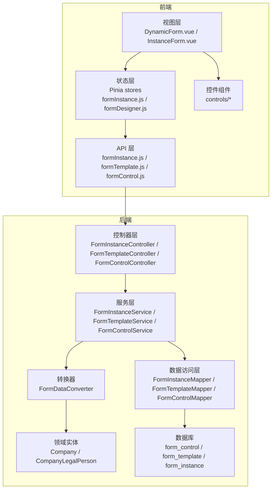
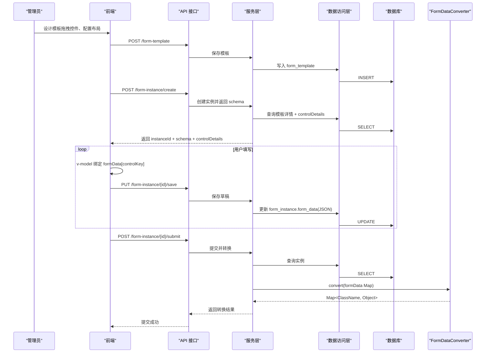
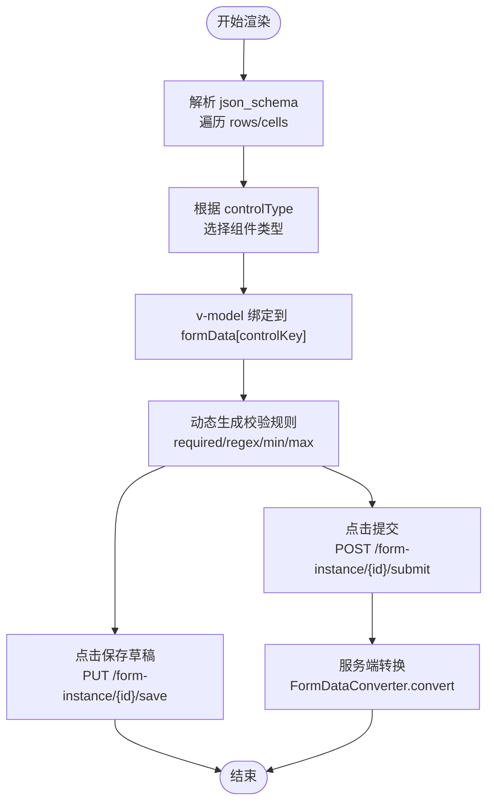
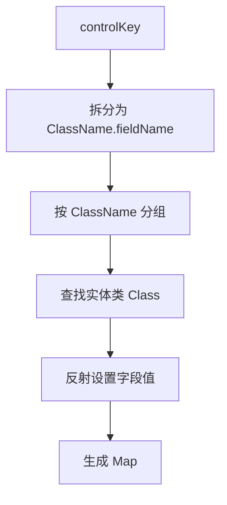
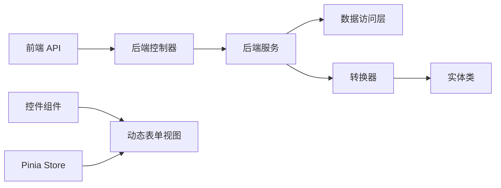

# 数据绑定与状态管理

<cite>
**本文档引用的文件**
- [VAT_EPR_动态表单技术方案.md](file://VAT_EPR_动态表单技术方案.md)
</cite>

## 目录
1. [简介](#简介)
2. [项目结构](#项目结构)
3. [核心组件](#核心组件)
4. [架构总览](#架构总览)
5. [详细组件分析](#详细组件分析)
6. [依赖关系分析](#依赖关系分析)
7. [性能考虑](#性能考虑)
8. [故障排查指南](#故障排查指南)
9. [结论](#结论)
10. [附录](#附录)

## 简介
本文件围绕“数据绑定与状态管理”主题，结合仓库中的动态表单技术方案，系统阐述：
- 双向数据绑定机制与 v-model 在动态表单中的应用
- controlKey 命名规范及其对数据模型映射的关键作用
- formData 对象的结构设计与多类型数据转换（字符串、布尔值、数字、文件上传、日期）
- Pinia 状态管理在表单数据持久化中的角色
- 表单数据的实时同步、变更监听与状态更新机制
- 最佳实践与性能优化建议

## 项目结构
该方案采用前后端分离架构，前端基于 Vue 3 + Element Plus + Pinia，后端基于 Spring Boot + MyBatis-Plus。动态表单的核心由三张表驱动：自定义控件表、服务单模板表、服务单实例表。前端通过接口获取模板与控件配置，渲染动态表单，并以 Map<controlKey, value> 的形式维护表单数据。

图表来源
- [VAT_EPR_动态表单技术方案.md: 19-28:19-28](file://VAT_EPR_动态表单技术方案.md#L19-L28)
- [VAT_EPR_动态表单技术方案.md: 815-852:815-852](file://VAT_EPR_动态表单技术方案.md#L815-L852)
- [VAT_EPR_动态表单技术方案.md: 775-813:775-813](file://VAT_EPR_动态表单技术方案.md#L775-L813)

章节来源
- [VAT_EPR_动态表单技术方案.md: 19-28:19-28](file://VAT_EPR_动态表单技术方案.md#L19-L28)
- [VAT_EPR_动态表单技术方案.md: 815-852:815-852](file://VAT_EPR_动态表单技术方案.md#L815-L852)
- [VAT_EPR_动态表单技术方案.md: 775-813:775-813](file://VAT_EPR_动态表单技术方案.md#L775-L813)

## 核心组件
- 动态表单渲染与数据绑定
  - 前端通过 JSON Schema 驱动布局，按 controlType 渲染对应组件，使用 v-model 绑定到 formData 对象，key 为 controlKey（格式：ClassName.fieldName）。
  - 校验规则由 controlDetail 中的正则、必填、长度等配置动态生成。
- Pinia 状态管理
  - stores 下的 formInstance.js 负责维护当前实例的 formData、schema、controlDetails 等状态，并提供保存草稿、提交等动作。
- 服务端数据转换
  - FormDataConverter 将 Map<controlKey, value> 按 ClassName 分组，反射注入到对应实体类对象，完成类型转换与对象组装。

章节来源
- [VAT_EPR_动态表单技术方案.md: 531-577:531-577](file://VAT_EPR_动态表单技术方案.md#L531-L577)
- [VAT_EPR_动态表单技术方案.md: 579-590:579-590](file://VAT_EPR_动态表单技术方案.md#L579-L590)
- [VAT_EPR_动态表单技术方案.md: 594-684:594-684](file://VAT_EPR_动态表单技术方案.md#L594-L684)

## 架构总览
动态表单从“模板设计—实例创建—填写—提交”的全链路如下：

图表来源
- [VAT_EPR_动态表单技术方案.md: 437-478:437-478](file://VAT_EPR_动态表单技术方案.md#L437-L478)
- [VAT_EPR_动态表单技术方案.md: 594-684:594-684](file://VAT_EPR_动态表单技术方案.md#L594-L684)

## 详细组件分析

### 双向数据绑定与 v-model 在动态表单中的应用
- 绑定机制
  - 前端遍历 json_schema.rows，根据 controlType 渲染对应组件，使用 v-model 绑定到 formData 对象，key 即为 controlKey。
  - formData 作为响应式对象，用户输入变化会实时更新，同时支持保存草稿与提交。
- 控件类型与 v-model 映射
  - INPUT/TEXTAREA → 文本
  - SELECT → 选项值
  - SWITCH → 布尔
  - NUMBER → 数字
  - DATE → 字符串（ISO 8601）
  - UPLOAD → 文件列表（包含文件名、URL、大小等元信息）

图表来源
- [VAT_EPR_动态表单技术方案.md: 531-577:531-577](file://VAT_EPR_动态表单技术方案.md#L531-L577)
- [VAT_EPR_动态表单技术方案.md: 579-590:579-590](file://VAT_EPR_动态表单技术方案.md#L579-L590)

章节来源
- [VAT_EPR_动态表单技术方案.md: 531-577:531-577](file://VAT_EPR_动态表单技术方案.md#L531-L577)
- [VAT_EPR_动态表单技术方案.md: 579-590:579-590](file://VAT_EPR_动态表单技术方案.md#L579-L590)

### controlKey 命名规范与数据模型映射
- 命名规范
  - controlKey 必须为“ClassName.fieldName”，且数据库唯一索引保证唯一性；后端提交时会校验格式（必须包含一个点号）。
- 映射机制
  - 前端将 formData 以 Map<controlKey, value> 形式提交；服务端通过 FormDataConverter 按 ClassName 分组，反射注入到对应实体类对象。
  - 若未注册某 ClassName，将记录警告并跳过该组。

图表来源
- [VAT_EPR_动态表单技术方案.md: 39-40:39-40](file://VAT_EPR_动态表单技术方案.md#L39-L40)
- [VAT_EPR_动态表单技术方案.md: 615-650:615-650](file://VAT_EPR_动态表单技术方案.md#L615-L650)

章节来源
- [VAT_EPR_动态表单技术方案.md: 39-40:39-40](file://VAT_EPR_动态表单技术方案.md#L39-L40)
- [VAT_EPR_动态表单技术方案.md: 615-650:615-650](file://VAT_EPR_动态表单技术方案.md#L615-L650)

### formData 对象结构与数据类型处理
- 结构设计
  - formData 为 Map<controlKey, value>，controlKey 与数据库 control_key 保持一致，便于前后端一致性。
- 数据类型与转换
  - 字符串：直接存储
  - 布尔值：字符串转布尔
  - 数字：字符串转整数/长整型/高精度数值
  - 文件上传：数组，元素包含文件名、URL、大小等
  - 日期：字符串（ISO 8601），如 yyyy-MM-dd
- 类型转换策略
  - 服务端使用反射与类型判断进行转换，确保目标字段类型匹配；不匹配时按字符串处理并记录日志。

章节来源
- [VAT_EPR_动态表单技术方案.md: 579-590:579-590](file://VAT_EPR_动态表单技术方案.md#L579-L590)
- [VAT_EPR_动态表单技术方案.md: 673-683:673-683](file://VAT_EPR_动态表单技术方案.md#L673-L683)

### Pinia 状态管理在表单数据持久化中的作用
- 状态职责
  - formInstance.js 维护当前实例的 formData、jsonSchema、controlDetails、加载状态等。
  - 支持保存草稿（PUT /form-instance/{id}/save）与提交（POST /form-instance/{id}/submit）。
- 实时同步与变更监听
  - 使用响应式数据结构，v-model 直接写入 formData，触发组件重新渲染。
  - 保存草稿时将 formData 序列化为 JSON 存入 form_instance.form_data。
- 状态持久化
  - 建议结合浏览器本地存储或服务端持久化，避免刷新丢失；提交后状态更新为已提交，禁止再次修改。

章节来源
- [VAT_EPR_动态表单技术方案.md: 849-852:849-852](file://VAT_EPR_动态表单技术方案.md#L849-L852)
- [VAT_EPR_动态表单技术方案.md: 336-357:336-357](file://VAT_EPR_动态表单技术方案.md#L336-L357)
- [VAT_EPR_动态表单技术方案.md: 359-380:359-380](file://VAT_EPR_动态表单技术方案.md#L359-L380)

### 表单数据的实时同步、变更监听与状态更新机制
- 实时同步
  - v-model 双向绑定使用户输入即时反映到 formData；组件根据 controlDetails 动态生成校验规则，实现输入即校验。
- 变更监听
  - 可在 Pinia store 中添加 watch 或 computed，监听 formData 变化，触发保存草稿或计算联动字段。
- 状态更新
  - 保存草稿：PUT /form-instance/{id}/save，更新 form_instance.form_data。
  - 提交：POST /form-instance/{id}/submit，服务端转换并更新状态为已提交。

章节来源
- [VAT_EPR_动态表单技术方案.md: 531-577:531-577](file://VAT_EPR_动态表单技术方案.md#L531-L577)
- [VAT_EPR_动态表单技术方案.md: 336-357:336-357](file://VAT_EPR_动态表单技术方案.md#L336-L357)
- [VAT_EPR_动态表单技术方案.md: 359-380:359-380](file://VAT_EPR_动态表单技术方案.md#L359-L380)

## 依赖关系分析
- 前端依赖
  - API 层依赖后端接口；视图层依赖组件库与 Pinia；组件层依赖控件渲染器。
- 后端依赖
  - 控制器依赖服务层；服务层依赖数据访问层；转换器依赖实体类注册表。
- 外部依赖
  - 文件上传依赖对象存储（如 OSS/MinIO），需在上传控件中配置 accept、maxCount、maxSizeMB 等参数。

图表来源
- [VAT_EPR_动态表单技术方案.md: 815-852:815-852](file://VAT_EPR_动态表单技术方案.md#L815-L852)
- [VAT_EPR_动态表单技术方案.md: 775-813:775-813](file://VAT_EPR_动态表单技术方案.md#L775-L813)
- [VAT_EPR_动态表单技术方案.md: 594-684:594-684](file://VAT_EPR_动态表单技术方案.md#L594-L684)

章节来源
- [VAT_EPR_动态表单技术方案.md: 815-852:815-852](file://VAT_EPR_动态表单技术方案.md#L815-L852)
- [VAT_EPR_动态表单技术方案.md: 775-813:775-813](file://VAT_EPR_动态表单技术方案.md#L775-L813)
- [VAT_EPR_动态表单技术方案.md: 594-684:594-684](file://VAT_EPR_动态表单技术方案.md#L594-L684)

## 性能考虑
- 渲染性能
  - 使用 CSS Grid 布局，减少 DOM 层级；控件按需渲染，避免不必要的重绘。
- 状态更新
  - 将 formData 作为响应式对象，仅在必要时触发更新；对高频输入（如数字/文本）可考虑节流或防抖。
- 数据转换
  - 服务端转换器按 ClassName 分组，避免重复反射；实体类注册表可扩展为注解扫描，减少手工维护成本。
- 文件上传
  - 限制文件数量与大小，上传前进行本地校验；上传完成后统一更新 formData，避免频繁网络请求。
- 并发控制
  - 保存草稿时使用乐观锁（version 字段）防止并发覆盖。

章节来源
- [VAT_EPR_动态表单技术方案.md: 856-869:856-869](file://VAT_EPR_动态表单技术方案.md#L856-L869)

## 故障排查指南
- controlKey 格式错误
  - 现象：提交时报无效格式或被忽略。
  - 处理：确保 controlKey 为“ClassName.fieldName”，并在数据库层面校验唯一性。
- 实体类未注册
  - 现象：转换阶段跳过该组数据。
  - 处理：在转换器注册表中添加对应实体类，或扩展为注解扫描。
- 文件上传异常
  - 现象：上传后无法显示或大小/类型不匹配。
  - 处理：检查上传控件配置（accept、maxCount、maxSizeMB），确认对象存储可用。
- 提交后状态不可修改
  - 现象：提交后再次尝试保存失败。
  - 处理：提交后状态更新为已提交，需重新创建实例或走变更流程。
- 并发覆盖
  - 现象：多人同时保存导致数据丢失。
  - 处理：使用乐观锁（version 字段）保护保存操作。

章节来源
- [VAT_EPR_动态表单技术方案.md: 856-869:856-869](file://VAT_EPR_动态表单技术方案.md#L856-L869)

## 结论
本方案通过“controlKey 命名规范 + Map<controlKey, value> + Pinia 状态管理 + 服务端反射转换”的组合，实现了动态表单的高扩展性与强一致性。v-model 在动态表单中的应用确保了数据的实时同步与变更监听；Pinia 则提供了清晰的状态边界与持久化能力。配合严格的类型转换与并发控制，能够支撑复杂业务场景下的稳定运行。

## 附录
- 关键接口参考
  - 创建/保存模板：POST /api/form-template
  - 获取模板详情：GET /api/form-template/{id}
  - 创建服务单实例：POST /api/form-instance/create
  - 保存草稿：PUT /api/form-instance/{id}/save
  - 提交：POST /api/form-instance/{id}/submit
- 前端组件参考
  - 动态表单主组件：DynamicForm.vue
  - 控件渲染器：ControlRenderer.vue
  - 控件集合：controls/*
  - 状态管理：stores/formInstance.js

章节来源
- [VAT_EPR_动态表单技术方案.md: 225-302:225-302](file://VAT_EPR_动态表单技术方案.md#L225-L302)
- [VAT_EPR_动态表单技术方案.md: 306-380:306-380](file://VAT_EPR_动态表单技术方案.md#L306-L380)
- [VAT_EPR_动态表单技术方案.md: 815-852:815-852](file://VAT_EPR_动态表单技术方案.md#L815-L852)