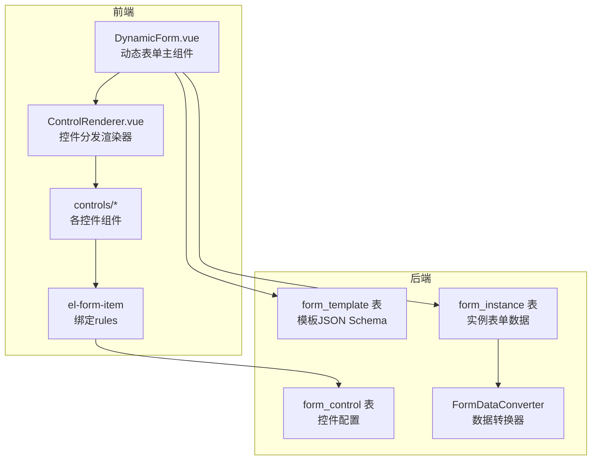
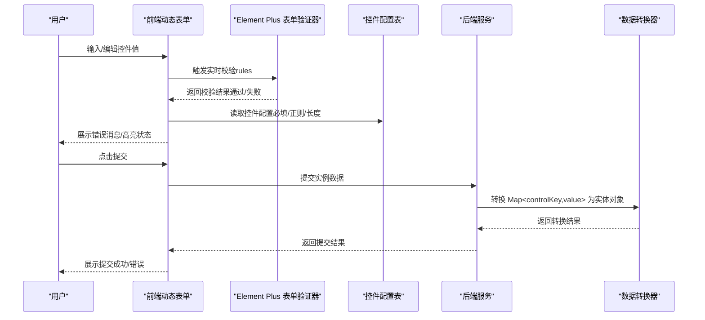
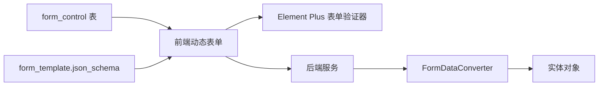

# 表单验证规则系统

<cite>
**本文引用的文件**
- [VAT_EPR_动态表单技术方案.md](file://VAT_EPR_动态表单技术方案.md)
</cite>

## 目录
1. [简介](#简介)
2. [项目结构](#项目结构)
3. [核心组件](#核心组件)
4. [架构总览](#架构总览)
5. [详细组件分析](#详细组件分析)
6. [依赖关系分析](#依赖关系分析)
7. [性能考量](#性能考量)
8. [故障排查指南](#故障排查指南)
9. [结论](#结论)
10. [附录](#附录)

## 简介
本文件围绕“表单验证规则系统”的设计与实现进行系统化说明，重点阐述如何从控件配置中动态提取并生成验证规则，涵盖必填、正则表达式、长度限制等规则的生成逻辑；说明 Element Plus 表单验证器的集成方式与自定义验证函数的实现；解释实时验证、错误消息显示与用户反馈机制；并给出验证规则优先级处理与错误状态管理的最佳实践。文档内容严格基于仓库中的技术方案文件，确保可追溯与可落地。

## 项目结构
该技术方案面向“动态表单”场景，前后端协同完成表单的可视化设计、运行时渲染与数据提交。前端采用 Vue 3 + Element Plus，后端采用 Spring Boot + MyBatis-Plus。验证规则来源于数据库中的控件定义表，并在前端动态渲染时生成 Element Plus 的表单校验规则。

图表来源
- [VAT_EPR_动态表单技术方案.md: 531-548:531-548](file://VAT_EPR_动态表单技术方案.md#L531-L548)
- [VAT_EPR_动态表单技术方案.md: 31-58:31-58](file://VAT_EPR_动态表单技术方案.md#L31-L58)
- [VAT_EPR_动态表单技术方案.md: 68-86:68-86](file://VAT_EPR_动态表单技术方案.md#L68-L86)
- [VAT_EPR_动态表单技术方案.md: 132-153:132-153](file://VAT_EPR_动态表单技术方案.md#L132-L153)
- [VAT_EPR_动态表单技术方案.md: 592-684:592-684](file://VAT_EPR_动态表单技术方案.md#L592-L684)

章节来源
- [VAT_EPR_动态表单技术方案.md: 19-28:19-28](file://VAT_EPR_动态表单技术方案.md#L19-L28)
- [VAT_EPR_动态表单技术方案.md: 531-548:531-548](file://VAT_EPR_动态表单技术方案.md#L531-L548)

## 核心组件
- 控件配置表（form_control）
  - 字段包含必填、正则表达式、长度限制、提示文案等，用于驱动前端动态生成校验规则。
- 模板表（form_template）
  - 通过 JSON Schema 描述布局与控件引用，前端据此渲染表单。
- 实例表（form_instance）
  - 存储运行时表单数据，提交时由转换器按类名分组并反射赋值。
- 数据转换器（FormDataConverter）
  - 将 Map<controlKey, value> 转换为实体对象，作为提交阶段的二次校验与数据结构化输出。

章节来源
- [VAT_EPR_动态表单技术方案.md: 31-58:31-58](file://VAT_EPR_动态表单技术方案.md#L31-L58)
- [VAT_EPR_动态表单技术方案.md: 68-86:68-86](file://VAT_EPR_动态表单技术方案.md#L68-L86)
- [VAT_EPR_动态表单技术方案.md: 132-153:132-153](file://VAT_EPR_动态表单技术方案.md#L132-L153)
- [VAT_EPR_动态表单技术方案.md: 592-684:592-684](file://VAT_EPR_动态表单技术方案.md#L592-L684)

## 架构总览
动态表单的验证规则来源于控件配置，前端在渲染时根据配置生成 Element Plus 的 rules，结合 el-form-item 的 label 与 props 实现实时校验与错误提示。提交阶段，后端解析实例数据并通过转换器进行结构化转换，作为最终的业务数据。

图表来源
- [VAT_EPR_动态表单技术方案.md: 531-548:531-548](file://VAT_EPR_动态表单技术方案.md#L531-L548)
- [VAT_EPR_动态表单技术方案.md: 592-684:592-684](file://VAT_EPR_动态表单技术方案.md#L592-L684)

## 详细组件分析

### 验证规则的动态生成与优先级
- 规则来源
  - 必填：来自 control_required 字段。
  - 正则：来自 control_regex_pattern 与 control_regex_message。
  - 长度：来自 control_min_length 与 control_max_length。
- 生成策略
  - 前端遍历 json_schema 的 cells，依据 controlType 渲染对应组件，并为每个 el-form-item 绑定 buildRules(cell.controlId) 生成的 rules。
  - rules 内部按以下顺序组合：
    1) 必填规则（required）
    2) 正则规则（pattern），若配置了正则表达式
    3) 长度规则（min/max），若配置了最小/最大长度
- 优先级与冲突处理
  - 必填优先于其他规则，先决条件不满足直接阻断后续规则。
  - 正则与长度规则并行执行，若同时失败，建议优先展示更明确的错误消息（例如长度或格式更具体）。
  - 若正则与长度规则均未配置，则仅保留必填规则，避免无意义的空提示。

章节来源
- [VAT_EPR_动态表单技术方案.md: 31-58:31-58](file://VAT_EPR_动态表单技术方案.md#L31-L58)
- [VAT_EPR_动态表单技术方案.md: 531-548:531-548](file://VAT_EPR_动态表单技术方案.md#L531-L548)

### Element Plus 集成与自定义验证函数
- 集成点
  - 在 el-form-item 上绑定 :rules="buildRules(cell.controlId)"，其中 buildRules 会根据 controlDetail 动态生成 Element Plus 的验证规则数组。
- 自定义验证函数
  - 可在 rules 中添加自定义 validator 函数，用于复杂业务校验（如跨字段校验、异步校验等）。
  - 自定义函数应返回 Promise 或使用回调 callback(error) 形式，确保与 Element Plus 的异步校验模型兼容。
- 错误消息
  - 使用 control_regex_message 或其他字段提供的提示文案，统一在 rules 中设置 message。
  - 对必填、长度、正则等规则分别设置清晰的消息，便于用户理解。

章节来源
- [VAT_EPR_动态表单技术方案.md: 531-548:531-548](file://VAT_EPR_动态表单技术方案.md#L531-L548)
- [VAT_EPR_动态表单技术方案.md: 31-58:31-58](file://VAT_EPR_动态表单技术方案.md#L31-L58)

### 实时验证、错误消息与用户反馈
- 实时触发
  - 在 el-input、el-select 等组件上绑定 v-model 并监听输入事件，触发 Element Plus 的实时校验。
- 错误状态
  - 通过 el-form-item 的 error 状态与边框高亮，结合 message 提示，形成即时反馈。
- 用户体验
  - 建议在必填字段前显示星号或提示图标；对正则与长度限制提供预提示（如“支持2-100字符”）。
  - 对于上传类控件，结合 upload_config 的 maxCount/accept/maxSizeMB 提示用户。

章节来源
- [VAT_EPR_动态表单技术方案.md: 531-548:531-548](file://VAT_EPR_动态表单技术方案.md#L531-L548)
- [VAT_EPR_动态表单技术方案.md: 31-58:31-58](file://VAT_EPR_动态表单技术方案.md#L31-L58)

### 验证规则优先级与错误状态管理
- 优先级
  - 必填 > 正则 > 长度（当多个规则同时存在时，按此顺序评估）。
- 错误状态
  - 建议在表单顶层维护一个 errors 映射，key 为 controlKey，value 为当前错误消息；在 rules 中使用 trigger 控制触发时机（如 blur/change）。
- 多规则冲突
  - 当多个规则失败时，优先展示最贴近用户输入的错误（如长度范围更直观）；必要时在自定义验证函数中合并多条提示。

章节来源
- [VAT_EPR_动态表单技术方案.md: 531-548:531-548](file://VAT_EPR_动态表单技术方案.md#L531-L548)

### 提交阶段的二次校验与数据转换
- 提交流程
  - 前端将 formData 原样提交至后端 form_instance 接口。
  - 后端解析 JSON，调用 FormDataConverter 将 Map<controlKey, value> 按类名分组并反射赋值为目标实体对象。
- 作用
  - 作为业务层的结构化输入，便于后续流程处理；同时可作为提交阶段的二次校验依据（类型、非空、格式等）。

章节来源
- [VAT_EPR_动态表单技术方案.md: 592-684:592-684](file://VAT_EPR_动态表单技术方案.md#L592-L684)
- [VAT_EPR_动态表单技术方案.md: 705-728:705-728](file://VAT_EPR_动态表单技术方案.md#L705-L728)

### 验证规则配置示例与最佳实践
- 配置示例
  - 必填 + 正则 + 长度：control_required=true、control_regex_pattern、control_regex_message、control_min_length、control_max_length。
  - 仅必填：control_required=true、其余为空。
  - 仅正则：control_required=false、control_regex_pattern、control_regex_message。
  - 仅长度：control_required=false、control_min_length、control_max_length。
- 最佳实践
  - 控件命名规范：control_key 必须为 “ClassName.fieldName”，确保后端转换器能正确分组与赋值。
  - 提示文案：message 应简洁明确，避免歧义；必要时提供“示例/范围”提示。
  - 规则组合：避免冗余规则；若正则已覆盖长度限制，可省略单独的 min/max length。
  - 异步校验：对于远程校验（如唯一性），使用自定义 validator 并合理设置触发时机。

章节来源
- [VAT_EPR_动态表单技术方案.md: 31-58:31-58](file://VAT_EPR_动态表单技术方案.md#L31-L58)
- [VAT_EPR_动态表单技术方案.md: 531-548:531-548](file://VAT_EPR_动态表单技术方案.md#L531-L548)

## 依赖关系分析
- 前端依赖
  - DynamicForm.vue 依赖 ControlRenderer.vue 与各控件组件，后者在 el-form-item 上绑定 rules。
  - ControlRenderer.vue 依赖 controlDetails（来自模板详情）与 json_schema，用于动态渲染与规则生成。
- 后端依赖
  - FormInstanceController 依赖 FormDataConverter，后者依赖 form_control 与实体类注册表。
- 数据流
  - 控件配置 → 前端规则生成 → 用户输入 → 实时校验 → 提交 → 后端转换 → 业务处理。

图表来源
- [VAT_EPR_动态表单技术方案.md: 531-548:531-548](file://VAT_EPR_动态表单技术方案.md#L531-L548)
- [VAT_EPR_动态表单技术方案.md: 592-684:592-684](file://VAT_EPR_动态表单技术方案.md#L592-L684)

章节来源
- [VAT_EPR_动态表单技术方案.md: 531-548:531-548](file://VAT_EPR_动态表单技术方案.md#L531-L548)
- [VAT_EPR_动态表单技术方案.md: 592-684:592-684](file://VAT_EPR_动态表单技术方案.md#L592-L684)

## 性能考量
- 前端
  - 规则生成：在组件初始化时一次性生成 rules，避免每次输入都重新计算。
  - 触发时机：合理设置 trigger（blur/change），减少频繁校验带来的抖动。
  - 异步校验：对远程校验设置防抖与缓存，避免重复请求。
- 后端
  - 转换器：按类名分组与反射赋值的复杂度与字段数量线性相关，建议控制单次提交字段规模。
  - 日志与异常：对无效 control_key 与缺失字段进行日志记录但不中断流程，确保健壮性。

## 故障排查指南
- 常见问题
  - 控件 key 不符合 “ClassName.fieldName” 格式：导致后端转换失败或忽略字段。
  - 控件 key 重复：数据库唯一索引约束，需修正后重试。
  - 规则冲突：必填与正则/长度同时失败时，优先展示更明确的错误消息。
  - 自定义验证未生效：检查 validator 返回值与触发时机，确保与 Element Plus 模型一致。
- 排查步骤
  - 前端：打印 controlDetails 与生成的 rules，确认必填/正则/长度是否正确。
  - 后端：打印解析后的 formData 与转换结果，定位字段缺失或类型不匹配。
  - 提交：核对 form_instance.status 与版本号，避免并发覆盖。

章节来源
- [VAT_EPR_动态表单技术方案.md: 856-869:856-869](file://VAT_EPR_动态表单技术方案.md#L856-L869)

## 结论
本方案通过“控件配置驱动规则生成”的方式，实现了灵活、可扩展的表单验证体系。前端基于 Element Plus 的 rules 与自定义验证函数，结合实时校验与错误状态管理，提供了良好的用户体验；后端通过转换器对提交数据进行结构化处理，保障了业务数据的一致性与可靠性。遵循本文的优先级与最佳实践，可帮助团队快速构建稳定、易维护的动态表单验证系统。

## 附录
- 相关接口与数据结构
  - 控件配置接口：创建/查询/更新/删除控件。
  - 模板接口：创建/查询/发布模板。
  - 实例接口：创建/保存/提交实例。
- 项目结构参考
  - 前端：DynamicForm、ControlRenderer、controls/*、FormDesigner。
  - 后端：FormControl、FormTemplate、FormInstance、FormDataConverter。

章节来源
- [VAT_EPR_动态表单技术方案.md: 167-387:167-387](file://VAT_EPR_动态表单技术方案.md#L167-L387)
- [VAT_EPR_动态表单技术方案.md: 815-852:815-852](file://VAT_EPR_动态表单技术方案.md#L815-L852)