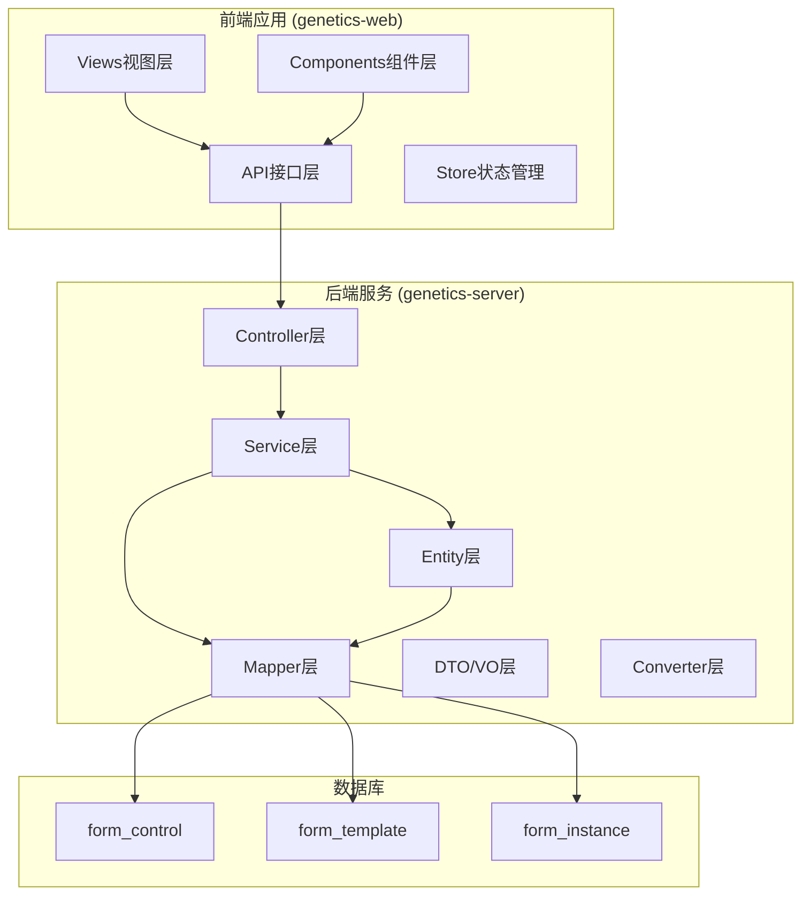
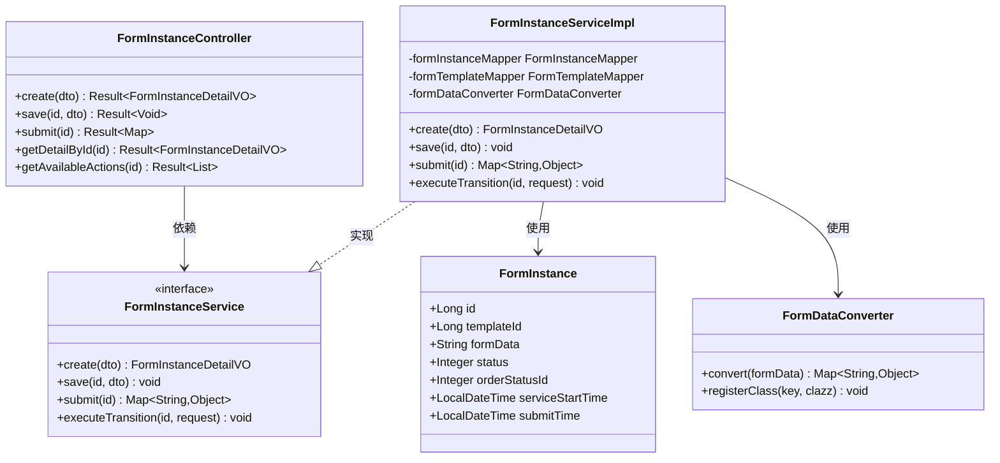
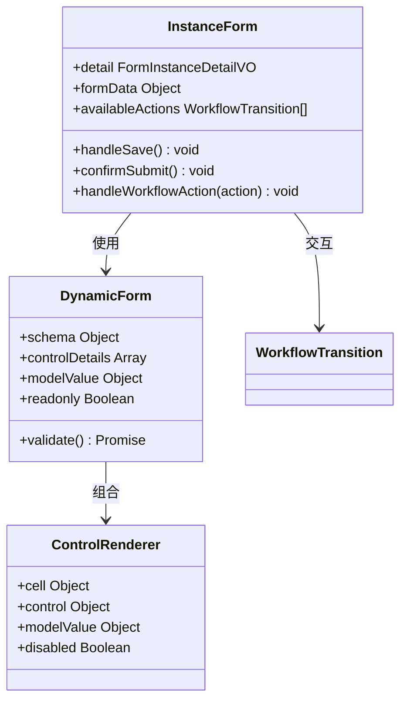
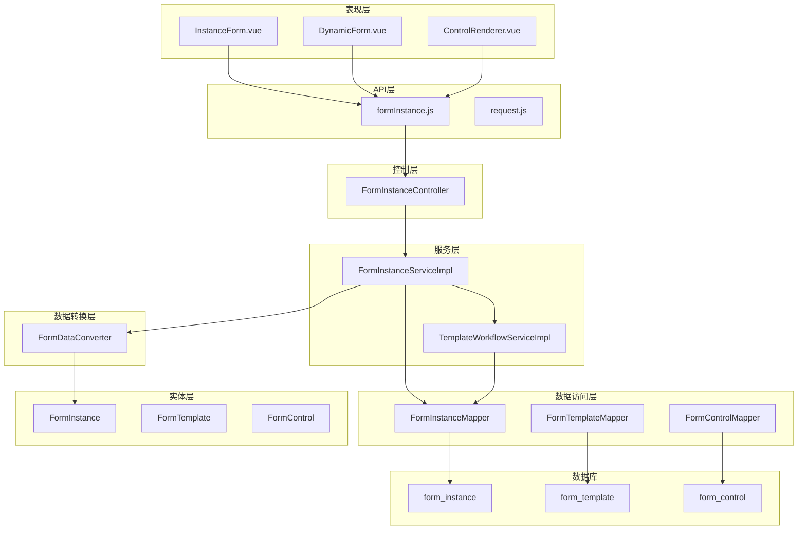
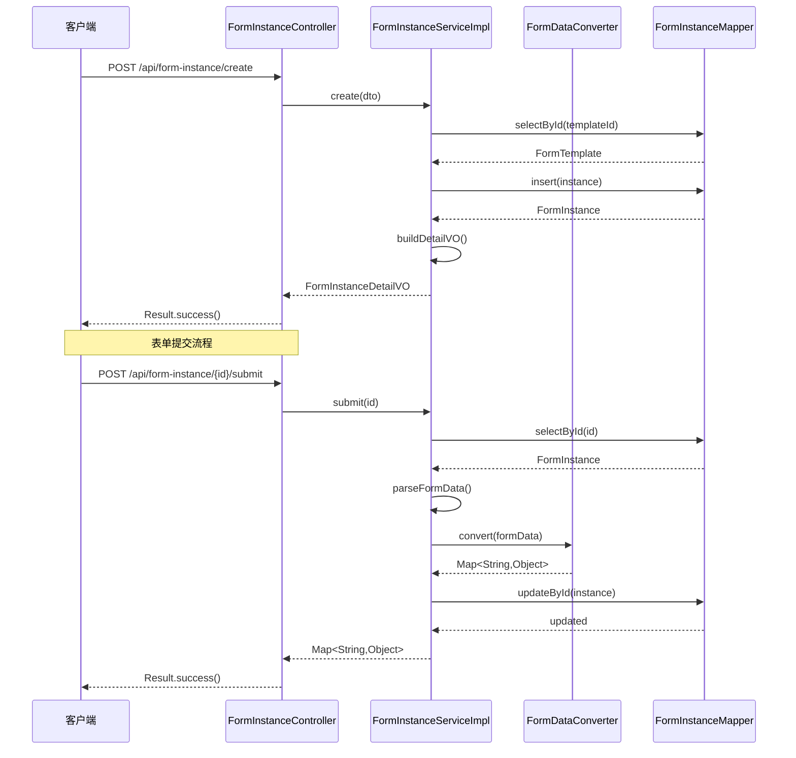
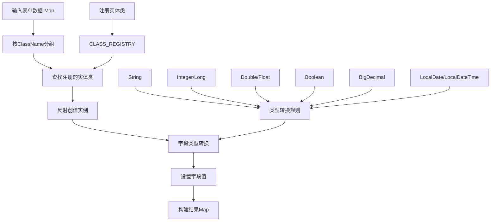
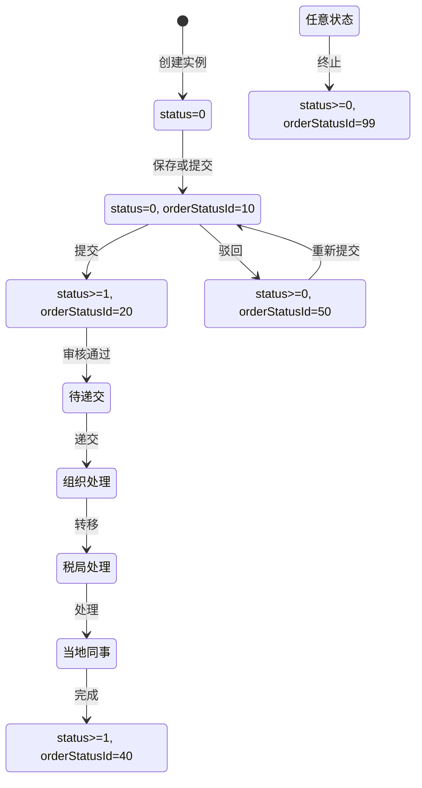
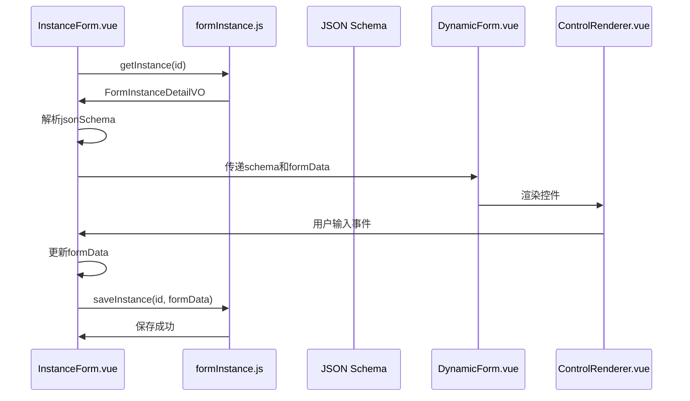
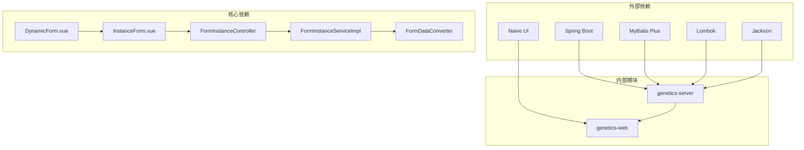

# 实例表单增强

<cite>
**本文档引用的文件**
- [FormInstanceController.java](file://genetics-server/src/main/java/com/genetics/controller/FormInstanceController.java)
- [FormInstanceServiceImpl.java](file://genetics-server/src/main/java/com/genetics/service/impl/FormInstanceServiceImpl.java)
- [FormInstanceService.java](file://genetics-server/src/main/java/com/genetics/service/FormInstanceService.java)
- [FormInstance.java](file://genetics-server/src/main/java/com/genetics/entity/FormInstance.java)
- [FormInstanceCreateDTO.java](file://genetics-server/src/main/java/com/genetics/dto/FormInstanceCreateDTO.java)
- [FormInstanceSaveDTO.java](file://genetics-server/src/main/java/com/genetics/dto/FormInstanceSaveDTO.java)
- [FormInstanceDetailVO.java](file://genetics-server/src/main/java/com/genetics/dto/FormInstanceDetailVO.java)
- [FormDataConverter.java](file://genetics-server/src/main/java/com/genetics/converter/FormDataConverter.java)
- [ServeState.java](file://genetics-server/src/main/java/com/genetics/enums/ServeState.java)
- [WorkflowTransition.java](file://genetics-server/src/main/java/com/genetics/entity/workflow/WorkflowTransition.java)
- [FormInstanceMapper.java](file://genetics-server/src/main/java/com/genetics/mapper/FormInstanceMapper.java)
- [InstanceForm.vue](file://genetics-web/src/views/instance/InstanceForm.vue)
- [DynamicForm.vue](file://genetics-web/src/components/DynamicForm/DynamicForm.vue)
- [formInstance.js](file://genetics-web/src/api/formInstance.js)
- [001-init-schema.sql](file://genetics-server/src/main/resources/db/changelog/sql/001-init-schema.sql)
</cite>

## 目录
1. [简介](#简介)
2. [项目结构](#项目结构)
3. [核心组件](#核心组件)
4. [架构概览](#架构概览)
5. [详细组件分析](#详细组件分析)
6. [依赖关系分析](#依赖关系分析)
7. [性能考虑](#性能考虑)
8. [故障排除指南](#故障排除指南)
9. [结论](#结论)

## 简介

实例表单增强系统是一个基于Spring Boot和Vue.js开发的动态表单管理系统，专门用于处理复杂的业务表单数据。该系统支持动态表单设计器、工作流状态管理、表单数据转换和持久化存储等功能。

系统的核心特性包括：
- 动态表单设计器，支持拖拽式表单构建
- 工作流驱动的状态管理
- 实体对象自动转换机制
- 多层次的表单数据验证
- 响应式的前端表单渲染

## 项目结构

整个项目采用前后端分离的架构设计，主要分为两个部分：

**图表来源**
- [FormInstanceController.java:1-136](file://genetics-server/src/main/java/com/genetics/controller/FormInstanceController.java#L1-L136)
- [InstanceForm.vue:1-567](file://genetics-web/src/views/instance/InstanceForm.vue#L1-L567)

**章节来源**
- [FormInstanceController.java:1-136](file://genetics-server/src/main/java/com/genetics/controller/FormInstanceController.java#L1-L136)
- [InstanceForm.vue:1-567](file://genetics-web/src/views/instance/InstanceForm.vue#L1-L567)

## 核心组件

### 后端核心组件

系统的核心组件包括控制器、服务层、实体模型和数据转换器：

**图表来源**
- [FormInstanceController.java:26-136](file://genetics-server/src/main/java/com/genetics/controller/FormInstanceController.java#L26-L136)
- [FormInstanceService.java:12-34](file://genetics-server/src/main/java/com/genetics/service/FormInstanceService.java#L12-L34)
- [FormInstanceServiceImpl.java:33-262](file://genetics-server/src/main/java/com/genetics/service/impl/FormInstanceServiceImpl.java#L33-L262)
- [FormInstance.java:11-72](file://genetics-server/src/main/java/com/genetics/entity/FormInstance.java#L11-L72)
- [FormDataConverter.java:34-199](file://genetics-server/src/main/java/com/genetics/converter/FormDataConverter.java#L34-L199)

### 前端核心组件

前端采用Vue.js框架，主要组件包括动态表单渲染器和实例表单视图：

**图表来源**
- [InstanceForm.vue:166-524](file://genetics-web/src/views/instance/InstanceForm.vue#L166-L524)
- [DynamicForm.vue:39-154](file://genetics-web/src/components/DynamicForm/DynamicForm.vue#L39-L154)

**章节来源**
- [FormInstanceController.java:26-136](file://genetics-server/src/main/java/com/genetics/controller/FormInstanceController.java#L26-L136)
- [FormInstanceService.java:12-34](file://genetics-server/src/main/java/com/genetics/service/FormInstanceService.java#L12-L34)
- [InstanceForm.vue:166-524](file://genetics-web/src/views/instance/InstanceForm.vue#L166-L524)
- [DynamicForm.vue:39-154](file://genetics-web/src/components/DynamicForm/DynamicForm.vue#L39-L154)

## 架构概览

系统采用分层架构设计，实现了清晰的关注点分离：

**图表来源**
- [InstanceForm.vue:166-524](file://genetics-web/src/views/instance/InstanceForm.vue#L166-L524)
- [FormInstanceController.java:26-136](file://genetics-server/src/main/java/com/genetics/controller/FormInstanceController.java#L26-L136)
- [FormInstanceServiceImpl.java:33-262](file://genetics-server/src/main/java/com/genetics/service/impl/FormInstanceServiceImpl.java#L33-L262)
- [FormDataConverter.java:34-199](file://genetics-server/src/main/java/com/genetics/converter/FormDataConverter.java#L34-L199)

## 详细组件分析

### 表单实例控制器

FormInstanceController是系统的核心入口，负责处理所有与表单实例相关的HTTP请求：

**图表来源**
- [FormInstanceController.java:37-68](file://genetics-server/src/main/java/com/genetics/controller/FormInstanceController.java#L37-L68)
- [FormInstanceServiceImpl.java:42-144](file://genetics-server/src/main/java/com/genetics/service/impl/FormInstanceServiceImpl.java#L42-L144)

**章节来源**
- [FormInstanceController.java:26-136](file://genetics-server/src/main/java/com/genetics/controller/FormInstanceController.java#L26-L136)
- [FormInstanceServiceImpl.java:42-144](file://genetics-server/src/main/java/com/genetics/service/impl/FormInstanceServiceImpl.java#L42-L144)

### 表单数据转换机制

FormDataConverter是系统的核心转换器，负责将动态表单数据转换为对应的业务实体对象：

**图表来源**
- [FormDataConverter.java:64-175](file://genetics-server/src/main/java/com/genetics/converter/FormDataConverter.java#L64-L175)

**章节来源**
- [FormDataConverter.java:34-199](file://genetics-server/src/main/java/com/genetics/converter/FormDataConverter.java#L34-L199)

### 工作流状态管理

系统实现了基于状态枚举的工作流管理机制：

**图表来源**
- [ServeState.java:8-95](file://genetics-server/src/main/java/com/genetics/enums/ServeState.java#L8-L95)
- [FormInstance.java:45-52](file://genetics-server/src/main/java/com/genetics/entity/FormInstance.java#L45-L52)

**章节来源**
- [ServeState.java:8-95](file://genetics-server/src/main/java/com/genetics/enums/ServeState.java#L8-L95)
- [FormInstance.java:45-52](file://genetics-server/src/main/java/com/genetics/entity/FormInstance.java#L45-L52)

### 前端动态表单渲染

前端实现了高度灵活的动态表单渲染机制：

**图表来源**
- [InstanceForm.vue:339-369](file://genetics-web/src/views/instance/InstanceForm.vue#L339-L369)
- [DynamicForm.vue:68-95](file://genetics-web/src/components/DynamicForm/DynamicForm.vue#L68-L95)

**章节来源**
- [InstanceForm.vue:166-524](file://genetics-web/src/views/instance/InstanceForm.vue#L166-L524)
- [DynamicForm.vue:39-154](file://genetics-web/src/components/DynamicForm/DynamicForm.vue#L39-L154)

## 依赖关系分析

系统各组件之间的依赖关系如下：

**图表来源**
- [FormInstanceController.java:1-22](file://genetics-server/src/main/java/com/genetics/controller/FormInstanceController.java#L1-L22)
- [InstanceForm.vue:1-20](file://genetics-web/src/views/instance/InstanceForm.vue#L1-L20)

**章节来源**
- [FormInstanceController.java:1-22](file://genetics-server/src/main/java/com/genetics/controller/FormInstanceController.java#L1-L22)
- [InstanceForm.vue:1-20](file://genetics-web/src/views/instance/InstanceForm.vue#L1-L20)

## 性能考虑

系统在设计时充分考虑了性能优化：

### 数据库优化
- 使用索引优化查询性能
- 采用分页查询减少数据传输
- 实体类字段冗余设计提升查询效率

### 缓存策略
- 前端使用响应式数据绑定减少DOM操作
- 后端使用Jackson进行高效JSON序列化
- 控制器层使用Result包装响应数据

### 异步处理
- 工作流状态转换异步执行
- 文件上传采用异步处理机制
- 大数据量查询使用分页策略

## 故障排除指南

### 常见问题及解决方案

**表单数据转换异常**
- 检查controlKey格式是否符合"ClassName.fieldName"规范
- 确认实体类已在CLASS_REGISTRY中注册
- 验证字段类型转换是否正确

**工作流状态异常**
- 检查ServeState枚举定义是否完整
- 验证工作流转换规则配置
- 确认状态转换条件满足

**前端表单渲染问题**
- 检查JSON Schema格式是否正确
- 验证控件配置是否完整
- 确认表单数据绑定是否正确

**章节来源**
- [FormDataConverter.java:74-97](file://genetics-server/src/main/java/com/genetics/converter/FormDataConverter.java#L74-L97)
- [ServeState.java:74-92](file://genetics-server/src/main/java/com/genetics/enums/ServeState.java#L74-L92)
- [DynamicForm.vue:107-146](file://genetics-web/src/components/DynamicForm/DynamicForm.vue#L107-L146)

## 结论

实例表单增强系统通过精心设计的架构和实现，提供了一个功能完整、性能优良的动态表单管理解决方案。系统的主要优势包括：

1. **高度可扩展性**：通过动态表单设计器和实体注册机制，支持快速扩展新的业务实体
2. **强类型安全**：完整的类型转换和验证机制确保数据完整性
3. **用户体验优秀**：响应式的前端界面和直观的工作流操作
4. **性能优化良好**：合理的数据库设计和缓存策略保证系统性能

该系统为复杂的业务场景提供了强大的表单管理和工作流支持，是企业级应用的理想选择。