# 拖拽式表单设计器

<cite>
**本文引用的文件**
- [VAT_EPR_动态表单技术方案.md](file://VAT_EPR_动态表单技术方案.md)
- [ControlPanel.vue](file://genetics-web/src/components/FormDesigner/ControlPanel.vue)
- [ControlList.vue](file://genetics-web/src/views/control/ControlList.vue)
- [TemplateDesigner.vue](file://genetics-web/src/views/template/TemplateDesigner.vue)
- [Canvas.vue](file://genetics-web/src/components/FormDesigner/Canvas.vue)
- [WorkflowConfig.vue](file://genetics-web/src/components/FormDesigner/WorkflowConfig.vue)
- [WorkflowDesigner.vue](file://genetics-web/src/views/template/WorkflowDesigner.vue)
- [WorkflowFormModal.vue](file://genetics-web/src/components/FormDesigner/WorkflowFormModal.vue)
- [formDesigner.js](file://genetics-web/src/stores/formDesigner.js)
- [DynamicForm.vue](file://genetics-web/src/components/DynamicForm/DynamicForm.vue)
- [ControlRenderer.vue](file://genetics-web/src/components/DynamicForm/ControlRenderer.vue)
- [formControl.js](file://genetics-web/src/api/formControl.js)
- [formTemplate.js](file://genetics-web/src/api/formTemplate.js)
- [FormControlController.java](file://genetics-server/src/main/java/com/genetics/controller/FormControlController.java)
- [FormControl.java](file://genetics-server/src/main/java/com/genetics/entity/FormControl.java)
- [003-add-business-type.sql](file://genetics-server/src/main/resources/db/changelog/sql/003-add-business-type.sql)
- [package.json](file://genetics-web/package.json)
- [main.js](file://genetics-web/src/main.js)
</cite>

## 更新摘要
**变更内容**
- Canvas组件新增完整的只读模式支持，包括禁用拖拽交互、隐藏行操作工具、适当的空状态消息
- WorkflowConfig组件新增只读模式支持，允许用户查看工作流配置而不进行修改
- WorkflowFormModal组件支持通过readonly属性控制内部Canvas的只读行为
- WorkflowDesigner视图通过路由参数mode=view实现工作流配置的只读模式
- 所有组件的只读模式均通过props传递readonly参数进行统一控制

## 目录
1. [简介](#简介)
2. [项目结构](#项目结构)
3. [核心组件](#核心组件)
4. [架构总览](#架构总览)
5. [详细组件分析](#详细组件分析)
6. [只读模式实现](#只读模式实现)
7. [Naive UI 组件系统](#naive-ui-组件系统)
8. [业务类型分类系统](#业务类型分类系统)
9. [依赖关系分析](#依赖关系分析)
10. [性能考虑](#性能考虑)
11. [故障排查指南](#故障排查指南)
12. [结论](#结论)
13. [附录](#附录)

## 简介
本文件面向开发者，系统化阐述"拖拽式表单设计器"的实现思路与工程实践，重点围绕以下方面：
- Vue Draggable 插件的集成与配置：拖拽区域设置、拖拽事件处理、元素排序逻辑
- 设计器 UI 界面设计：控件面板布局、画布区域实现
- 拖拽元素的数据结构、拖拽状态管理、布局更新机制
- 控件属性配置面板、实时预览与布局调整算法
- **新增** 只读模式支持：Canvas和WorkflowConfig组件的完全只读实现
- **新增** 工作流配置查看模式：通过路由参数实现工作流配置的只读访问
- Naive UI 组件库的全面集成：NDrawer、NDescriptions、NList 等现代化组件
- 业务类型分类支持：按实体类名分组控件，增强控件管理能力
- 与后端 API 的交互、模板保存流程、JSON Schema 生成逻辑
- 性能优化、用户体验改进与错误处理策略

## 项目结构
根据技术方案文档，项目采用前后端分离架构，前端采用 Vue 3 + Vite + Naive UI + Vue Draggable + Pinia，后端采用 Spring Boot + MyBatis-Plus。前端关键模块如下：
- 控件管理视图：ControlList.vue（新增业务类型筛选）
- 模板列表视图：TemplateList.vue
- 模板设计器视图：TemplateDesigner.vue（核心）
- 工作流设计器视图：WorkflowDesigner.vue（新增只读模式支持）
- 动态表单渲染：DynamicForm.vue、ControlRenderer.vue、各控件子组件
- 设计器组件：FormDesigner.vue、ControlPanel.vue（增强业务类型分组）、Canvas.vue（新增只读模式）、WorkflowConfig.vue（新增只读模式）、WorkflowFormModal.vue（支持内部Canvas只读）
- 状态管理：stores/formDesigner.js、stores/formInstance.js
- API 层：api/formControl.js（新增业务类型相关接口）、api/formTemplate.js、api/formInstance.js

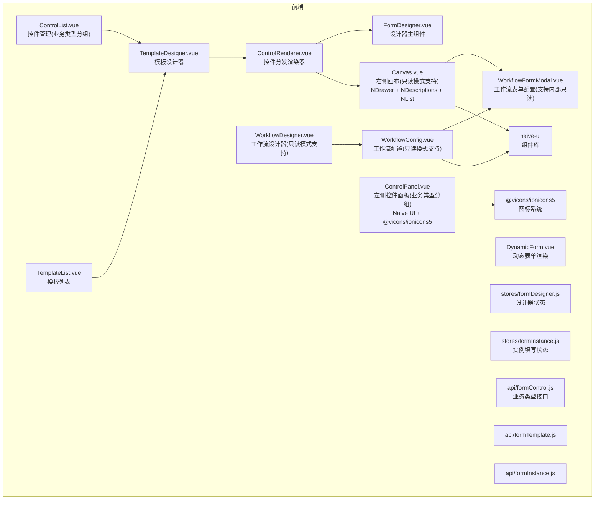

**图表来源**
- [VAT_EPR_动态表单技术方案.md](file://VAT_EPR_动态表单技术方案.md)
- [package.json](file://genetics-web/package.json)

**章节来源**
- [VAT_EPR_动态表单技术方案.md](file://VAT_EPR_动态表单技术方案.md)
- [package.json](file://genetics-web/package.json)

## 核心组件
- 拖拽排序能力：Vue Draggable（next），用于控件面板与画布区域的拖拽排序与重排
- 设计器主组件：TemplateDesigner.vue，协调控件面板、画布与状态管理
- 工作流设计器：WorkflowDesigner.vue，提供工作流配置的只读模式支持
- 控件面板：ControlPanel.vue（增强版），支持业务类型分组显示和筛选，使用 Naive UI 组件和 @vicons/ionicons5 图标
- 控件管理：ControlList.vue（新增），提供业务类型筛选和分组管理
- 画布区域：Canvas.vue，承载网格布局与控件单元格，集成 NDrawer、NDescriptions、NList 等 Naive UI 组件，**新增只读模式支持**
- 工作流配置：WorkflowConfig.vue，提供工作流节点和连线的配置管理，**新增只读模式支持**
- 工作流表单配置：WorkflowFormModal.vue，支持内部Canvas的只读模式控制
- 控件渲染器：ControlRenderer.vue，按 controlType 渲染具体控件
- 状态管理：Pinia stores，统一管理设计器与实例填写的状态
- API 层：封装 form-control、form-template、form-instance 接口，新增业务类型相关接口

**章节来源**
- [VAT_EPR_动态表单技术方案.md](file://VAT_EPR_动态表单技术方案.md)
- [package.json](file://genetics-web/package.json)

## 架构总览
整体交互分为"设计器阶段"和"动态表单阶段"。设计器阶段负责控件选择、布局设计、模板保存；动态表单阶段负责根据模板渲染并收集用户输入。新增的业务类型分类系统为控件管理提供了更强的组织能力。**新增的工作流配置只读模式支持**使得用户可以在不修改配置的情况下查看和理解工作流设计。所有组件现在都基于 Naive UI 组件库构建，提供一致的现代化用户体验。

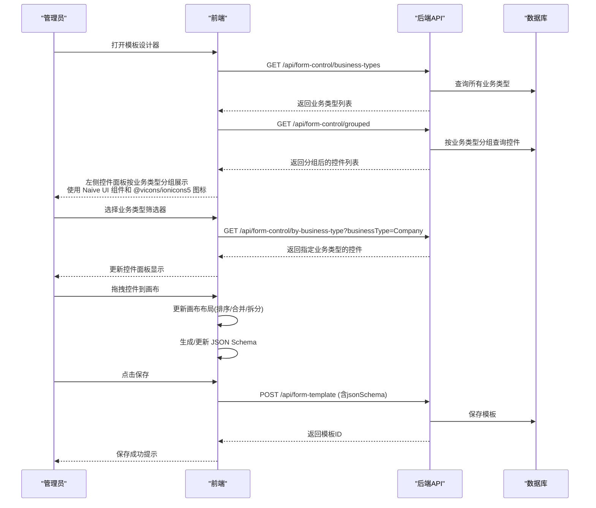

**图表来源**
- [VAT_EPR_动态表单技术方案.md](file://VAT_EPR_动态表单技术方案.md)

## 详细组件分析

### 拖拽排序与布局更新
- 拖拽区域设置
  - 控件面板：支持从左侧控件列表拖拽到画布，使用克隆模式（pull: 'clone'）
  - 画布区域：支持控件在网格中的拖拽排序、跨行/跨列拖拽，使用真实拖拽（pull: true）
- 拖拽事件处理
  - 使用 Vue Draggable 的拖拽回调（如开始、移动、结束）进行状态同步
  - 在拖拽结束时触发布局计算与 JSON Schema 更新
- 元素排序逻辑
  - 以网格二维数组 rows/cells 为核心数据结构，每个 cell 包含 colIndex、colSpan、controlId 等字段
  - 支持同行内排序、跨行移动、合并/拆分单元格等操作
- 布局更新机制
  - 拖拽完成后，重新计算每行 cells 的 colIndex 与 colSpan，确保网格不重叠
  - 将当前布局映射为 JSON Schema 并持久化

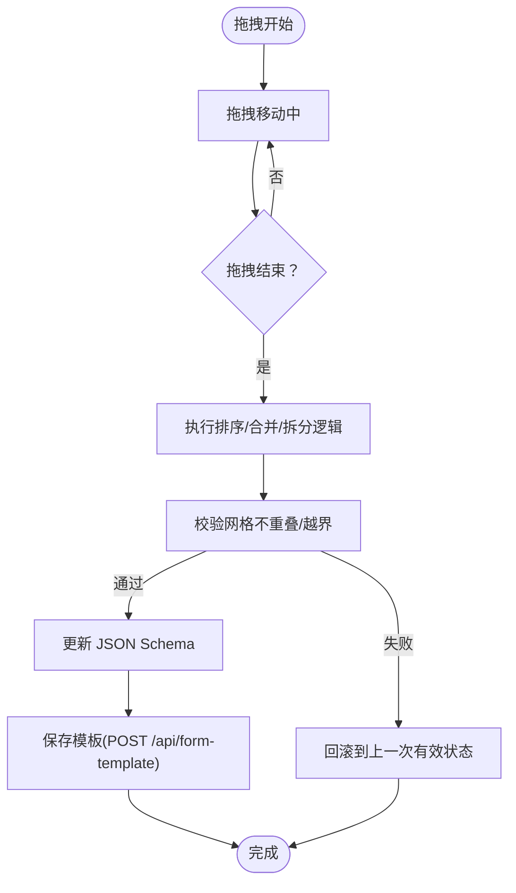

**图表来源**
- [VAT_EPR_动态表单技术方案.md](file://VAT_EPR_动态表单技术方案.md)

**章节来源**
- [VAT_EPR_动态表单技术方案.md](file://VAT_EPR_动态表单技术方案.md)

### 增强的控件面板实现与业务类型分组
- 控件面板布局
  - ControlPanel.vue 展示按业务类型分组的 form-control 列表，支持业务类型筛选和搜索
  - 每个控件项通过 draggable 属性允许被拖拽至画布
  - 实现按业务类型分组显示，包括 Company、CompanyLegalPerson、CompanyTaxNo、CompanyAttachment、CompanyService、CompanyBank、CompanyContact、CompanyAddress、CompanyShareholder、CompanyBusiness 等
- 业务类型筛选功能
  - 支持通过 el-select 下拉框选择特定业务类型进行筛选
  - 实时更新控件面板显示内容
  - 支持清除筛选条件，恢复全部控件显示
- 搜索与过滤功能
  - 支持按控件名称和 controlKey 进行实时搜索
  - 搜索关键词不区分大小写，提供即时反馈
- 拖拽克隆机制
  - 使用 clone 回调函数创建新的控件实例
  - 克隆时保留必要的控件元数据：controlId、controlKey、controlType、label
  - 设置默认的 colIndex 和 colSpan 属性
- 图标与视觉反馈
  - 使用 @vicons/ionicons5 中的图标组件，提供现代化的视觉体验
  - 不同控件类型对应不同图标：INPUT -> CreateOutline、TEXTAREA -> DocumentTextOutline、NUMBER -> CalculatorOutline、SELECT -> ChevronDownOutline、SWITCH -> ToggleOutline、DATE -> CalendarOutline、UPLOAD -> CloudUploadOutline
  - 提供悬停和激活状态的视觉反馈
  - 支持空状态显示（无控件时显示提示）

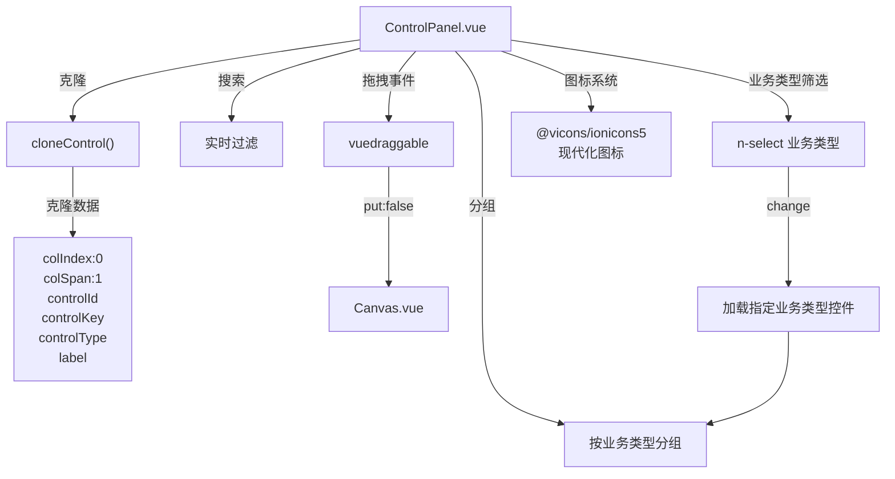

**图表来源**
- [ControlPanel.vue](file://genetics-web/src/components/FormDesigner/ControlPanel.vue)

**章节来源**
- [ControlPanel.vue](file://genetics-web/src/components/FormDesigner/ControlPanel.vue)

### 改进的控件管理界面
- 控件管理布局
  - ControlList.vue 提供完整的控件管理功能，支持业务类型筛选、类型筛选、关键词搜索
  - 采用折叠面板展示按业务类型分组的控件列表
  - 支持控件的增删改查操作
- 业务类型管理
  - 支持从 controlKey 自动提取业务类型前缀
  - 提供业务类型输入框，可手动修改业务类型
  - 支持按业务类型进行筛选和分组显示
- 控件编辑功能
  - 支持控件的基本信息编辑：名称、Key、类型、必填、占位文本、说明等
  - 支持高级配置：正则表达式、最小/最大长度、下拉选项、上传配置等
  - 支持控件的启用/禁用状态管理
- 分组显示与排序
  - 按业务类型前缀自动分组，中文标签显示
  - 每组内按 sort 字段排序
  - 支持默认展开所有分组

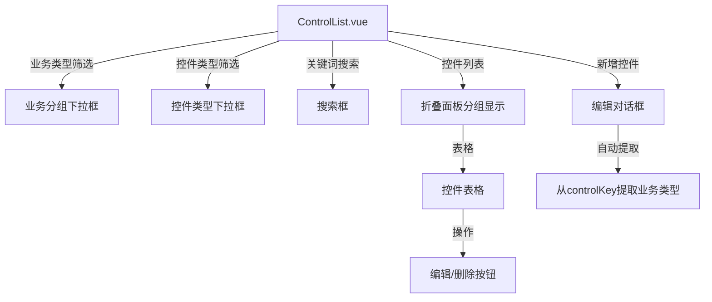

**图表来源**
- [ControlList.vue](file://genetics-web/src/views/control/ControlList.vue)

**章节来源**
- [ControlList.vue](file://genetics-web/src/views/control/ControlList.vue)

### 画布区域实现与交互
- 画布布局设计
  - Canvas.vue 采用 CSS Grid 布局，columns 决定列数，rows 决定行数
  - 支持 1-4 列布局切换，动态调整网格结构
  - 每行包含行工具栏和网格拖拽区域
- 单元格交互功能
  - GridCell.vue 表示单个单元格，支持编辑 label、colSpan 等属性
  - 提供标签输入框、列跨度调整、删除按钮等操作
  - 支持控件类型的可视化标识（标签颜色）
- 拖拽事件处理
  - 使用 v-model 绑定 rows 数组，实现实时双向数据绑定
  - 监听 @add 事件重新分配 colIndex，确保索引连续
  - 处理列数变化时的 colSpan 重置逻辑
- 空状态与占位符
  - 无控件时显示空状态提示
  - 支持行级拖拽占位符，提升拖拽体验
- **新增** 控件详情抽屉功能
  - 点击控件卡片打开 NDrawer 控件详情抽屉
  - 使用 NDescriptions 展示控件详细配置信息
  - 支持 SELECT 类型的下拉选项列表展示
  - 支持 UPLOAD 类型的上传配置展示
  - 使用 NCode 组件优雅显示正则表达式
- **新增** 完整的只读模式支持
  - 通过 readonly props 控制组件行为
  - 禁用拖拽交互：draggable 组件的 disabled 属性
  - 隐藏行操作工具：v-if="!readonly" 条件渲染
  - 空状态消息：description="未配置表单"（只读模式）
  - 禁用标签编辑：v-if="!readonly" 条件渲染
  - 禁用列跨度调整：v-if="!readonly" 条件渲染
  - 禁用删除按钮：v-if="!readonly" 条件渲染
  - 禁用拖拽占位符：v-if="!readonly" 条件渲染

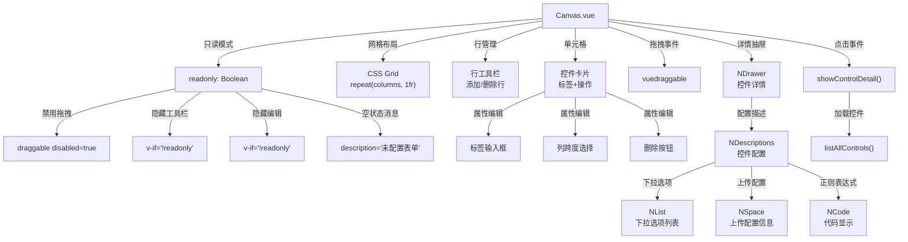

**图表来源**
- [Canvas.vue](file://genetics-web/src/components/FormDesigner/Canvas.vue)

**章节来源**
- [Canvas.vue](file://genetics-web/src/components/FormDesigner/Canvas.vue)

### 拖拽元素的数据结构与状态管理
- 数据结构
  - 控件元数据：controlId、controlKey、controlType、businessType、label、placeholder、required、regexPattern、selectOptions、uploadConfig 等
  - 画布布局：rows[i].cells[j]，包含 rowIndex、colIndex、colSpan、controlId 等
  - JSON Schema：layout/grid、columns、rows
- 状态管理
  - stores/formDesigner.js 维护当前模板的 schema、选中控件、临时拖拽状态
  - stores/formInstance.js 维护动态表单渲染时的 formData 与校验规则
- 拖拽状态管理
  - 拖拽开始时记录源位置与目标位置
  - 拖拽结束时根据目标网格坐标与 colSpan 计算新的 cells 结构
  - 若发生冲突（重叠/越界），回退到上一次有效状态

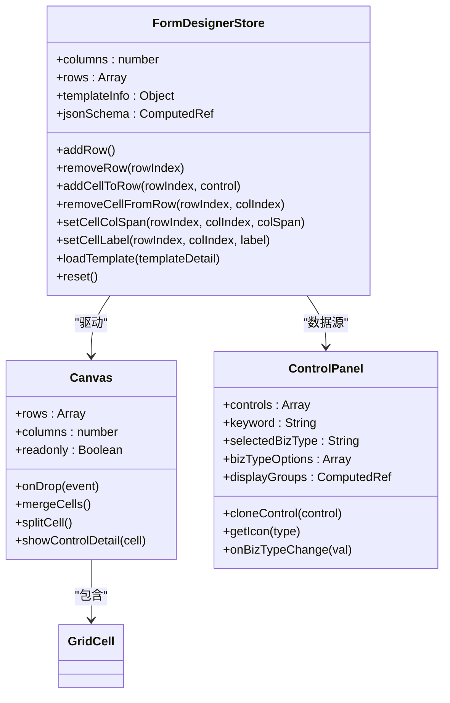

**图表来源**
- [formDesigner.js](file://genetics-web/src/stores/formDesigner.js)

**章节来源**
- [formDesigner.js](file://genetics-web/src/stores/formDesigner.js)

### 控件属性配置面板与实时预览
- 属性配置面板
  - 选中某个 GridCell 后，右侧弹出属性面板，支持编辑 label、必填、正则、提示、上传配置等
  - 属性变更即时生效，实时预览控件渲染效果
- 实时预览
  - 通过 ControlRenderer.vue 根据 controlType 渲染对应组件（如 el-input、el-select、el-upload 等）
  - 校验规则由 controlDetail 中的 regexPattern/required/minLength/maxLength 动态生成

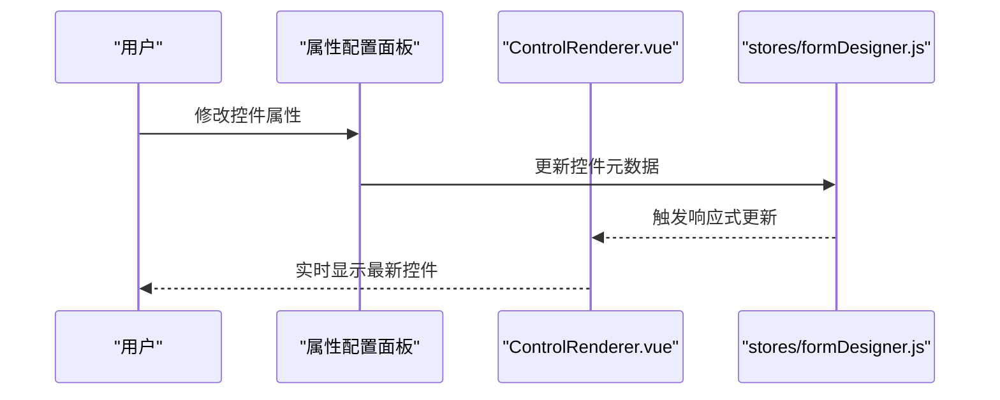

**图表来源**
- [VAT_EPR_动态表单技术方案.md](file://VAT_EPR_动态表单技术方案.md)

**章节来源**
- [VAT_EPR_动态表单技术方案.md](file://VAT_EPR_动态表单技术方案.md)

### 与后端 API 的交互与模板保存流程
- 控件管理
  - 获取控件列表：GET /api/form-control/all
  - 新增/更新/删除控件：POST/PUT/DELETE /api/form-control
  - 按业务类型筛选控件：GET /api/form-control/by-business-type?businessType={type}
  - 获取按业务类型分组的控件：GET /api/form-control/grouped
  - 获取所有业务类型：GET /api/form-control/business-types
- 模板管理
  - 创建/保存模板：POST /api/form-template（请求体含 templateName、version、countryCode、serviceCodeL1/L2/L3、jsonSchema、status）
  - 查询模板列表与详情：GET /api/form-template/list、GET /api/form-template/{id}
  - 发布模板：POST /api/form-template/{id}/publish
- 动态表单
  - 创建实例：POST /api/form-instance/create（传入 templateId）
  - 保存草稿：PUT /api/form-instance/{id}/save（传入 formData）
  - 提交实例：POST /api/form-instance/{id}/submit（返回按类名分组的对象）

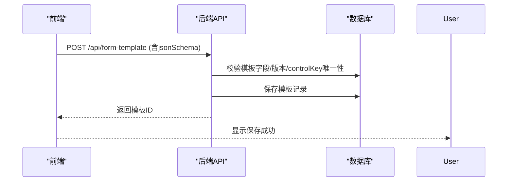

**图表来源**
- [VAT_EPR_动态表单技术方案.md](file://VAT_EPR_动态表单技术方案.md)

**章节来源**
- [VAT_EPR_动态表单技术方案.md](file://VAT_EPR_动态表单技术方案.md)

### JSON Schema 生成逻辑
- 结构要点
  - layout: "grid"
  - columns: 列数
  - rows: 行数组，每行包含 rowIndex 与 cells
  - cells: 单元格数组，包含 colIndex、colSpan、controlId、controlKey、controlType、label
- 生成时机
  - 拖拽结束、属性变更、合并/拆分单元格后
- 生成策略
  - 遍历 rows/cells，按 colIndex 排序，计算 colSpan，确保网格无重叠
  - 将控件元数据与布局信息合并，形成最终 JSON Schema

**章节来源**
- [VAT_EPR_动态表单技术方案.md](file://VAT_EPR_动态表单技术方案.md)

## 只读模式实现

### Canvas组件只读模式
Canvas组件通过readonly属性实现了完整的只读模式支持，包括：

- **拖拽交互禁用**
  - draggable组件的disabled属性设置为readonly值
  - 用户无法拖拽控件到画布或在画布内重新排列控件
- **行操作工具隐藏**
  - 画板工具栏：v-if="!readonly" 条件渲染
  - 行工具栏：v-if="!readonly" 条件渲染
  - 删除行按钮：v-if="!readonly" 条件渲染
- **控件编辑功能禁用**
  - 标签输入框：v-if="!readonly" 条件渲染
  - 列跨度选择：v-if="!readonly" 条件渲染
  - 删除按钮：v-if="!readonly" 条件渲染
- **空状态消息**
  - 空状态描述：description="未配置表单"（只读模式）
  - 普通模式描述：description="拖拽左侧控件到此处，或点击「添加行」"
- **拖拽占位符隐藏**
  - 空行拖拽提示：v-if="!readonly" 条件渲染

### WorkflowConfig组件只读模式
WorkflowConfig组件同样通过readonly属性实现了只读模式支持：

- **节点拖拽禁用**
  - 左侧节点库：v-if="!readonly" 条件渲染
  - 节点拖拽事件：dragstart事件在只读模式下不触发
- **画布交互禁用**
  - nodes-draggable属性：!readonly 控制节点拖拽
  - nodes-connectable属性：!readonly 控制节点连接
- **属性面板功能禁用**
  - 操作选择器：:disabled="readonly" 控制编辑功能
  - 条件选择器：:disabled="readonly" 控制编辑功能
  - 开关组件：:disabled="readonly" 控制编辑功能
- **工具栏功能控制**
  - 快速加载按钮：v-if="!readonly" 条件渲染
  - 清空按钮：v-if="!readonly" 条件渲染
  - 拖拽提示：v-if="!readonly" 条件渲染
- **空状态消息**
  - 空状态描述：从左侧拖拽节点到此处开始配置（普通模式）
  - 只读模式下仍显示相同空状态，但无交互功能

### WorkflowFormModal组件的只读支持
WorkflowFormModal组件通过readonly属性控制内部Canvas的行为：

- **左侧控件面板控制**
  - 左侧面板：v-if="!readonly" 条件渲染
  - 当readonly为true时，只显示右侧画板区域
- **Canvas只读模式传递**
  - CanvasPanel组件：:readonly="readonly" 属性传递
  - 内部Canvas组件继承只读模式设置
- **操作按钮控制**
  - 确认配置按钮：v-if="!readonly" 条件渲染（只读模式显示关闭按钮）
  - 取消按钮：v-if="!readonly" 条件渲染（只读模式显示关闭按钮）

### WorkflowDesigner视图的只读模式
WorkflowDesigner视图通过路由参数实现工作流配置的只读模式：

- **路由参数解析**
  - route.query.mode === 'view' 时进入只读模式
  - computed属性 isViewOnly 计算只读状态
- **组件只读传递**
  - WorkflowConfig组件：:readonly="isViewOnly"
  - WorkflowFormModal组件：:readonly="isViewOnly"
- **界面元素控制**
  - 保存按钮：v-if="!isViewOnly" 条件渲染
  - 基础表单设计按钮：v-if="!isViewOnly" 条件渲染
  - 模板信息输入框：v-if="!isViewOnly" 条件渲染

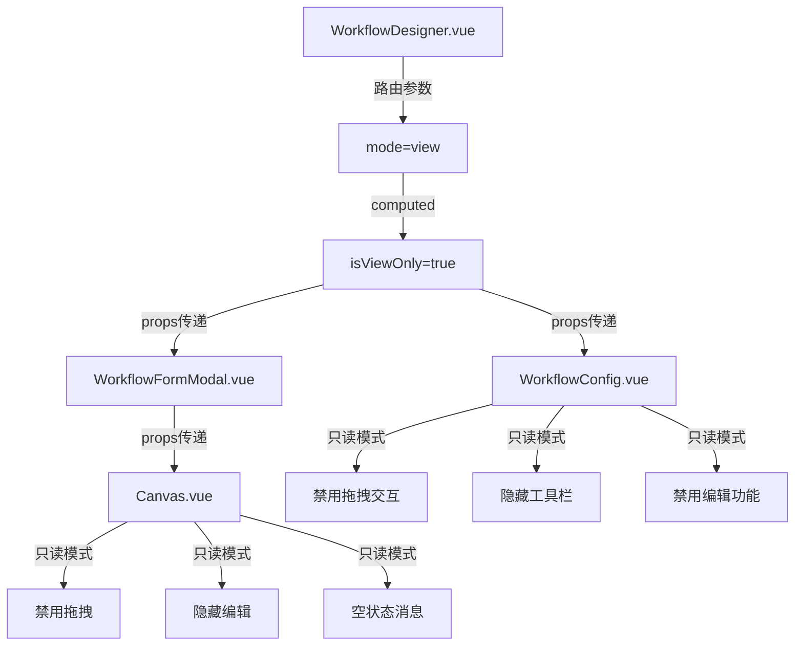

**图表来源**
- [WorkflowDesigner.vue](file://genetics-web/src/views/template/WorkflowDesigner.vue)
- [WorkflowConfig.vue](file://genetics-web/src/components/FormDesigner/WorkflowConfig.vue)
- [WorkflowFormModal.vue](file://genetics-web/src/components/FormDesigner/WorkflowFormModal.vue)
- [Canvas.vue](file://genetics-web/src/components/FormDesigner/Canvas.vue)

**章节来源**
- [WorkflowDesigner.vue](file://genetics-web/src/views/template/WorkflowDesigner.vue)
- [WorkflowConfig.vue](file://genetics-web/src/components/FormDesigner/WorkflowConfig.vue)
- [WorkflowFormModal.vue](file://genetics-web/src/components/FormDesigner/WorkflowFormModal.vue)
- [Canvas.vue](file://genetics-web/src/components/FormDesigner/Canvas.vue)

## Naive UI 组件系统

### 组件库集成
项目已全面迁移到 Naive UI 组件库，替代原有的 Element Plus。所有组件都使用 Naive UI 提供的现代化组件，包括：
- 基础组件：NSelect、NButton、NInput、NTag、NSpace、NIcon、NEmpty
- 布局组件：NLayout、NCard
- 抽屉组件：NDrawer、NDrawerContent
- 描述组件：NDescriptions、NDescriptionsItem
- 列表组件：NList、NListItem
- 代码组件：NCode
- 加载组件：NSpin
- 提示组件：NMessage、NDialog、NNotification

### 图标系统升级
ControlPanel.vue 中的图标系统已从自定义图标升级为 @vicons/ionicons5 提供的现代化图标：
- INPUT: CreateOutline
- TEXTAREA: DocumentTextOutline  
- NUMBER: CalculatorOutline
- SELECT: ChevronDownOutline
- SWITCH: ToggleOutline
- DATE: CalendarOutline
- UPLOAD: CloudUploadOutline

### 统一的设计语言
所有组件采用 Naive UI 的统一设计语言，包括：
- 一致的色彩体系和视觉风格
- 标准化的交互模式和动画效果
- 响应式布局和移动端适配
- 深色主题支持

**章节来源**
- [Canvas.vue](file://genetics-web/src/components/FormDesigner/Canvas.vue)
- [ControlPanel.vue](file://genetics-web/src/components/FormDesigner/ControlPanel.vue)
- [package.json](file://genetics-web/package.json)
- [main.js](file://genetics-web/src/main.js)

## 业务类型分类系统
业务类型分类系统是本次更新的核心功能，通过在数据库中添加 business_type 字段和相应的 API 接口，实现了按实体类名对控件进行智能分组管理。

### 数据库设计
- 新增 business_type 字段：VARCHAR(50)，存储实体类名（如 Company、CompanyAddress 等）
- 自动迁移脚本：从现有 control_key 中提取业务类型前缀并填充到 business_type 字段
- 索引优化：为 business_type 字段创建索引以提升查询性能

### API 接口设计
- 获取所有业务类型：GET /api/form-control/business-types
- 按业务类型分组：GET /api/form-control/grouped
- 按业务类型筛选：GET /api/form-control/by-business-type?businessType={type}

### 前端实现
- 控件面板：支持业务类型筛选器，实时更新控件显示
- 控件管理：支持业务类型筛选和分组显示，增强控件管理能力
- 自动提取：从 controlKey 中自动提取业务类型前缀

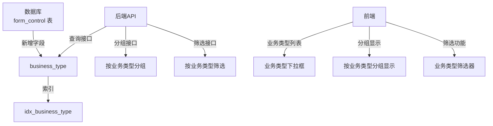

**图表来源**
- [FormControlController.java](file://genetics-server/src/main/java/com/genetics/controller/FormControlController.java)
- [003-add-business-type.sql](file://genetics-server/src/main/resources/db/changelog/sql/003-add-business-type.sql)

**章节来源**
- [FormControlController.java](file://genetics-server/src/main/java/com/genetics/controller/FormControlController.java)
- [FormControl.java](file://genetics-server/src/main/java/com/genetics/entity/FormControl.java)
- [003-add-business-type.sql](file://genetics-server/src/main/resources/db/changelog/sql/003-add-business-type.sql)

## 依赖关系分析
- 前端依赖
  - Vue 3 + Vite + Naive UI + Vue Draggable + Pinia + Axios + @vicons/ionicons5
- 组件耦合
  - TemplateDesigner.vue 作为中枢，协调 ControlPanel.vue、Canvas.vue
  - WorkflowDesigner.vue 作为工作流设计器中枢，协调 WorkflowConfig.vue、WorkflowFormModal.vue
  - ControlRenderer.vue 与各控件子组件解耦，通过 controlType 分发
  - stores/formDesigner.js 与 Canvas/ControlPanel 强耦合，但对其他模块保持低耦合
  - ControlPanel.vue 与 ControlList.vue 通过相同的业务类型接口进行数据同步
  - **新增** Canvas.vue 与 WorkflowFormModal.vue 通过 readonly 属性进行耦合控制
  - **新增** WorkflowConfig.vue 与 WorkflowFormModal.vue 通过 readonly 属性进行耦合控制
- 外部依赖
  - 后端 API 提供控件、模板、实例、业务类型等接口
  - 数据库存储控件定义、模板 JSON Schema、实例表单数据、业务类型信息

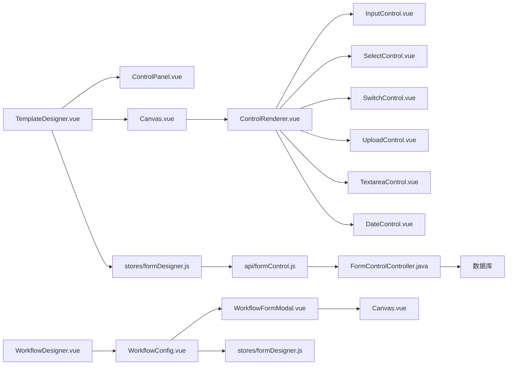

**图表来源**
- [VAT_EPR_动态表单技术方案.md](file://VAT_EPR_动态表单技术方案.md)

**章节来源**
- [VAT_EPR_动态表单技术方案.md](file://VAT_EPR_动态表单技术方案.md)

## 性能考虑
- 拖拽性能
  - 使用 Vue Draggable 的虚拟滚动与节流，减少频繁 DOM 更新
  - 仅在拖拽结束时触发布局重算，避免拖拽过程中的高成本计算
- 渲染性能
  - Canvas 采用 CSS Grid，cell 通过 gridColumn: span N 控制宽度，避免复杂布局计算
  - ControlRenderer.vue 按需渲染，仅在选中控件或属性变更时更新
- 状态管理
  - Pinia store 仅保存必要字段，避免深拷贝与大对象频繁序列化
- 网络性能
  - 控件列表分页加载，模板保存前本地校验（必填、正则、唯一性），减少无效请求
  - 业务类型相关的 API 请求进行缓存，避免重复请求
- 业务类型分组性能
  - 后端数据库为 business_type 字段建立索引，提升查询性能
  - 前端对业务类型数据进行本地缓存，减少 API 调用频率
- **新增** 只读模式性能优化
  - 条件渲染减少DOM节点数量，提升渲染性能
  - 禁用不必要的事件监听器，减少内存占用
  - 只读模式下不加载控件详情数据，减少网络请求
- **新增** Naive UI 性能优化
  - 组件按需加载，减少初始包体积
  - 图标组件使用 @vicons/ionicons5，提供更好的性能表现
  - 抽屉组件 NDrawer 采用虚拟滚动，提升大数据量下的渲染性能

## 故障排查指南
- 拖拽冲突
  - 现象：拖拽后出现重叠或越界
  - 处理：回滚到上一次有效状态；检查 colSpan 与 colIndex 计算逻辑
- 控件属性异常
  - 现象：属性面板无法编辑或预览不生效
  - 处理：确认 selectedControlId 正确；检查 ControlRenderer.vue 的 props 绑定
- 模板保存失败
  - 现象：保存时报错（如 controlKey 格式不正确或重复）
  - 处理：后端会校验 controlKey 格式与唯一性；前端提前校验并提示
- 动态表单渲染错误
  - 现象：控件渲染异常或校验规则不生效
  - 处理：核对 controlDetail 与 controlType 的映射；检查 regexPattern/required/minLength/maxLen 等字段
- 业务类型分组问题
  - 现象：控件未按预期分组显示
  - 处理：检查 controlKey 格式是否符合 ClassName.fieldName 规范；确认数据库中 business_type 字段已正确填充
- API 接口异常
  - 现象：业务类型相关接口返回错误
  - 处理：检查后端接口实现；确认数据库连接正常；验证业务类型数据完整性
- **新增** 只读模式问题
  - 现象：只读模式下仍可进行编辑操作
  - 处理：检查 readonly 属性传递链路；确认所有条件渲染指令正确设置
  - 现象：只读模式下控件详情无法显示
  - 处理：检查控件详情加载逻辑；确认只读模式下仍可加载控件数据
- **新增** 工作流配置查看问题
  - 现象：工作流配置无法正确显示
  - 处理：检查路由参数 mode=view 的解析；确认 WorkflowConfig 组件的只读模式设置
- **新增** Naive UI 组件问题
  - 现象：NDrawer、NDescriptions、NList 等组件显示异常
  - 处理：确认 naive-ui 版本兼容性；检查组件导入是否正确；验证样式文件加载
- **新增** 图标显示问题
  - 现象：控件图标不显示或显示异常
  - 处理：确认 @vicons/ionicons5 是否正确安装；检查图标组件导入路径；验证图标名称是否正确

**章节来源**
- [VAT_EPR_动态表单技术方案.md](file://VAT_EPR_动态表单技术方案.md)
- [Canvas.vue](file://genetics-web/src/components/FormDesigner/Canvas.vue)
- [ControlPanel.vue](file://genetics-web/src/components/FormDesigner/ControlPanel.vue)
- [WorkflowConfig.vue](file://genetics-web/src/components/FormDesigner/WorkflowConfig.vue)
- [WorkflowFormModal.vue](file://genetics-web/src/components/FormDesigner/WorkflowFormModal.vue)
- [WorkflowDesigner.vue](file://genetics-web/src/views/template/WorkflowDesigner.vue)

## 结论
该拖拽式表单设计器通过 Vue Draggable 实现灵活的控件拖拽与网格布局，结合 Pinia 状态管理与 Naive UI 组件库，提供了现代化的用户体验。本次更新全面迁移到 Naive UI 组件库，显著提升了界面的美观度和交互体验。

**新增的只读模式支持**为用户提供了更灵活的配置管理方式。Canvas组件和WorkflowConfig组件的完整只读实现，使得用户可以在不修改配置的情况下查看和理解表单设计与工作流配置。WorkflowDesigner视图通过路由参数实现了工作流配置的只读模式，为审计、培训和演示场景提供了更好的支持。

新增的控件详情抽屉功能（NDrawer）提供了丰富的控件配置信息展示，包括控件配置描述（NDescriptions）、下拉选项列表（NList）等增强功能。ControlPanel.vue 中的图标系统升级为 @vicons/ionicons5，提供了更加现代化和一致的视觉体验。

配合后端 API 的模板保存与动态表单渲染，以及新增的业务类型相关接口，实现了从设计到使用的完整闭环。ControlPanel.vue 和 ControlList.vue 组件的完善增强了控件管理的易用性，包括业务类型筛选、分组显示和拖拽克隆等功能。

建议在后续迭代中持续优化 Naive UI 组件的性能表现，完善控件详情抽屉的功能扩展，并继续优化拖拽性能与错误提示。业务类型分类系统的成功实施为未来的功能扩展奠定了良好基础。只读模式的引入进一步提升了系统的可用性和安全性。

## 附录
- 技术栈与版本
  - 前端：Vue 3.4.x、Vite 5.x、Naive UI 2.x、Vue Draggable next、Pinia 2.x、Axios 1.x、@vicons/ionicons5
  - 后端：Spring Boot 3.2.x、Java 21、MySQL 8.0+、MyBatis-Plus 3.5.x、Jackson 2.x、Lombok
- 数据模型与接口
  - 控件表：form_control（新增 business_type 字段，controlKey 唯一、controlType、placeholder、tips、required、regex、select_options、upload_config、default_value、sort、enabled）
  - 模板表：form_template（template_name、version、country_code、service_code_l1/l2/l3、json_schema、status、remark）
  - 实例表：form_instance（template_id、template_name、version、country_code、service_code_l1/l2/l3、form_data、status、submit_time）
- 关键约束
  - controlKey 唯一性与格式校验
  - 模板发布后禁止修改 jsonSchema，需升版本
  - 实体类注册与反射转换
  - 文件上传值为文件URL列表
  - 业务类型字段 business_type 支持控件按实体类名分组管理
- 新增 API 接口
  - GET /api/form-control/business-types - 获取所有业务类型
  - GET /api/form-control/grouped - 获取按业务类型分组的控件列表
  - GET /api/form-control/by-business-type - 按业务类型筛选控件
- 业务类型映射
  - Company: 公司信息
  - CompanyLegalPerson: 法人信息
  - CompanyTaxNo: 税号信息
  - CompanyAttachment: 附件信息
  - CompanyService: 服务信息
  - CompanyBank: 银行信息
  - CompanyContact: 联系人信息
  - CompanyAddress: 地址信息
  - CompanyShareholder: 股东信息
  - CompanyBusiness: 业务信息
- **新增** 只读模式支持
  - Canvas.vue：readonly 属性控制拖拽禁用、工具栏隐藏、编辑功能禁用
  - WorkflowConfig.vue：readonly 属性控制节点拖拽、连接、编辑功能
  - WorkflowFormModal.vue：readonly 属性控制内部Canvas行为
  - WorkflowDesigner.vue：通过路由参数 mode=view 实现工作流配置只读
- **新增** Naive UI 组件映射
  - 基础组件：NSelect、NButton、NInput、NTag、NSpace、NIcon、NEmpty
  - 布局组件：NLayout、NCard
  - 抽屉组件：NDrawer、NDrawerContent
  - 描述组件：NDescriptions、NDescriptionsItem
  - 列表组件：NList、NListItem
  - 代码组件：NCode
  - 加载组件：NSpin
  - 提示组件：NMessage、NDialog、NNotification
- **新增** 图标系统映射
  - INPUT: CreateOutline
  - TEXTAREA: DocumentTextOutline
  - NUMBER: CalculatorOutline
  - SELECT: ChevronDownOutline
  - SWITCH: ToggleOutline
  - DATE: CalendarOutline
  - UPLOAD: CloudUploadOutline

**章节来源**
- [VAT_EPR_动态表单技术方案.md](file://VAT_EPR_动态表单技术方案.md)
- [FormControlController.java](file://genetics-server/src/main/java/com/genetics/controller/FormControlController.java)
- [FormControl.java](file://genetics-server/src/main/java/com/genetics/entity/FormControl.java)
- [003-add-business-type.sql](file://genetics-server/src/main/resources/db/changelog/sql/003-add-business-type.sql)
- [package.json](file://genetics-web/package.json)
- [main.js](file://genetics-web/src/main.js)
- [Canvas.vue](file://genetics-web/src/components/FormDesigner/Canvas.vue)
- [WorkflowConfig.vue](file://genetics-web/src/components/FormDesigner/WorkflowConfig.vue)
- [WorkflowFormModal.vue](file://genetics-web/src/components/FormDesigner/WorkflowFormModal.vue)
- [WorkflowDesigner.vue](file://genetics-web/src/views/template/WorkflowDesigner.vue)