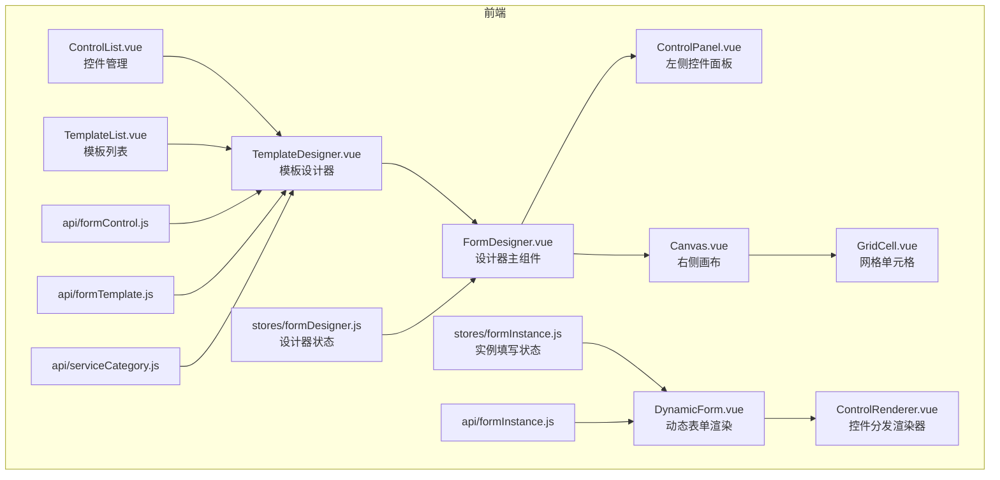
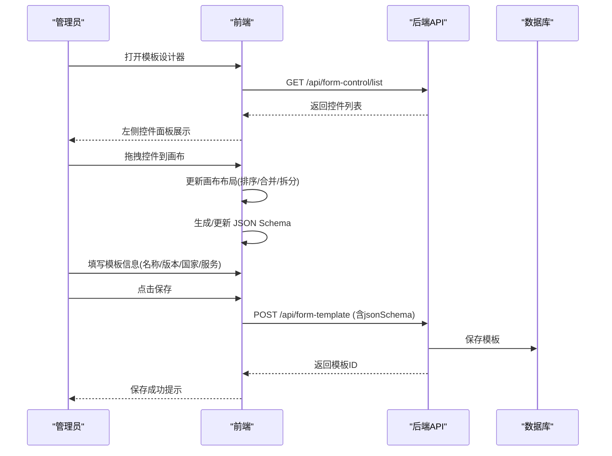
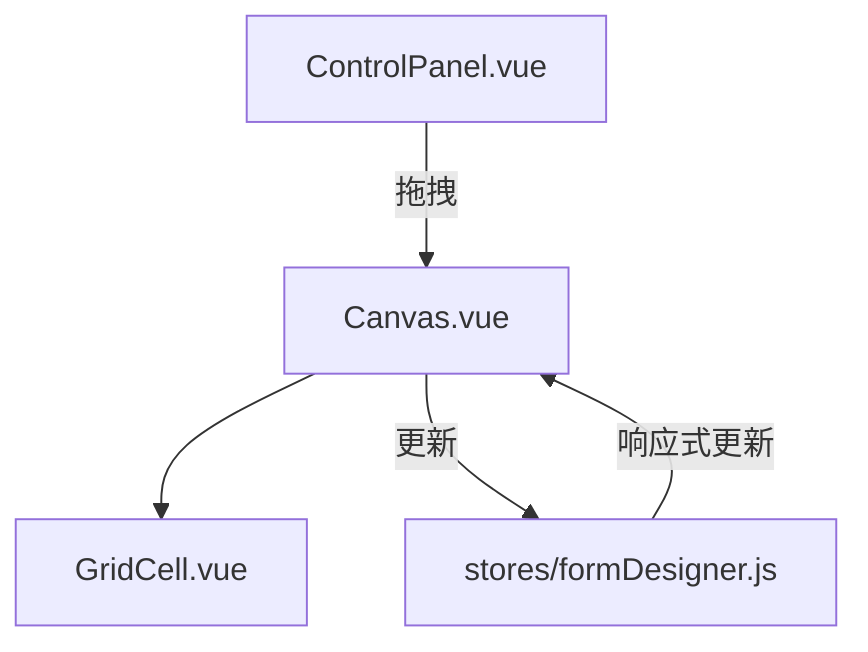
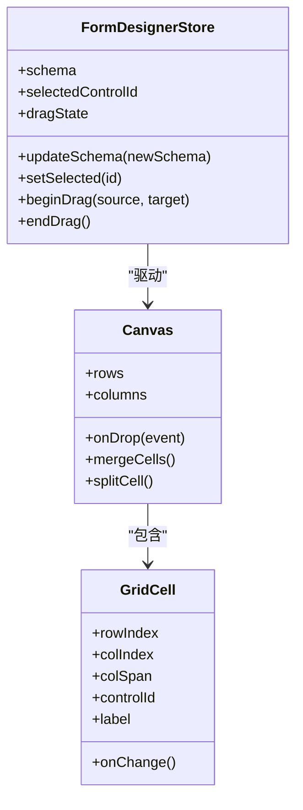
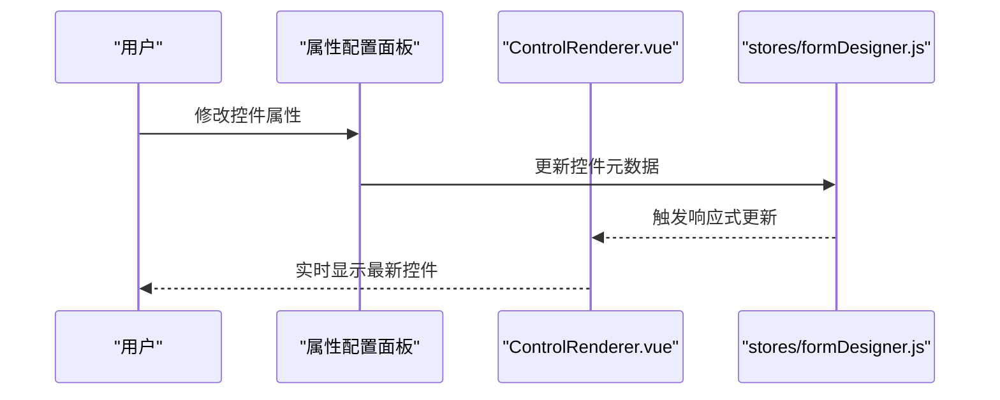
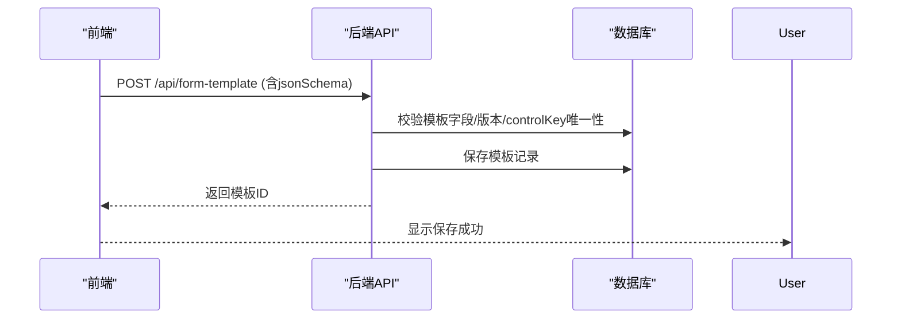
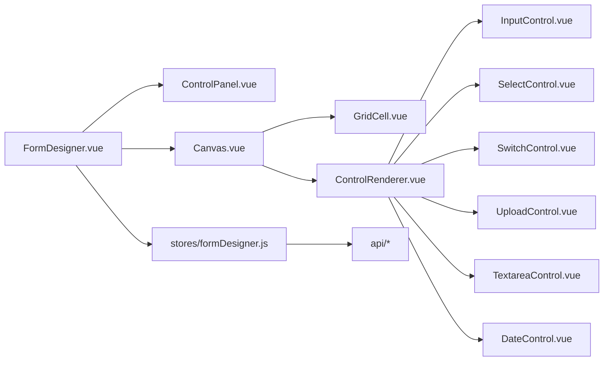

# 拖拽式表单设计器

<cite>
**本文引用的文件**
- [VAT_EPR_动态表单技术方案.md](file://VAT_EPR_动态表单技术方案.md)
</cite>

## 目录
1. [简介](#简介)
2. [项目结构](#项目结构)
3. [核心组件](#核心组件)
4. [架构总览](#架构总览)
5. [详细组件分析](#详细组件分析)
6. [依赖关系分析](#依赖关系分析)
7. [性能考虑](#性能考虑)
8. [故障排查指南](#故障排查指南)
9. [结论](#结论)
10. [附录](#附录)

## 简介
本文件面向开发者，系统化阐述“拖拽式表单设计器”的实现思路与工程实践，重点围绕以下方面：
- Vue Draggable 插件的集成与配置：拖拽区域设置、拖拽事件处理、元素排序逻辑
- 设计器 UI 界面设计：控件面板布局、画布区域实现
- 拖拽元素的数据结构、拖拽状态管理、布局更新机制
- 控件属性配置面板、实时预览与布局调整算法
- 与后端 API 的交互、模板保存流程、JSON Schema 生成逻辑
- 性能优化、用户体验改进与错误处理策略

## 项目结构
根据技术方案文档，项目采用前后端分离架构，前端采用 Vue 3 + Vite + Element Plus + Vue Draggable + Pinia，后端采用 Spring Boot + MyBatis-Plus。前端关键模块如下：
- 控件管理视图：ControlList.vue
- 模板列表视图：TemplateList.vue
- 模板设计器视图：TemplateDesigner.vue（核心）
- 动态表单渲染：DynamicForm.vue、ControlRenderer.vue、各控件子组件
- 设计器组件：FormDesigner.vue、ControlPanel.vue、Canvas.vue、GridCell.vue
- 状态管理：stores/formDesigner.js、stores/formInstance.js
- API 层：api/formControl.js、api/formTemplate.js、api/formInstance.js、api/serviceCategory.js

图表来源
- [VAT_EPR_动态表单技术方案.md](file://VAT_EPR_动态表单技术方案.md)

章节来源
- [VAT_EPR_动态表单技术方案.md](file://VAT_EPR_动态表单技术方案.md)

## 核心组件
- 拖拽排序能力：Vue Draggable（next），用于控件面板与画布区域的拖拽排序与重排
- 设计器主组件：FormDesigner.vue，协调控件面板、画布与状态管理
- 控件面板：ControlPanel.vue，展示可用控件并支持拖拽到画布
- 画布区域：Canvas.vue，承载网格布局与控件单元格 GridCell.vue
- 控件渲染器：ControlRenderer.vue，按 controlType 渲染具体控件
- 状态管理：Pinia stores，统一管理设计器与实例填写的状态
- API 层：封装 form-control、form-template、form-instance、service-category 接口

章节来源
- [VAT_EPR_动态表单技术方案.md](file://VAT_EPR_动态表单技术方案.md)

## 架构总览
整体交互分为“设计器阶段”和“动态表单阶段”。设计器阶段负责控件选择、布局设计、模板保存；动态表单阶段负责根据模板渲染并收集用户输入。

图表来源
- [VAT_EPR_动态表单技术方案.md](file://VAT_EPR_动态表单技术方案.md)

## 详细组件分析

### 拖拽排序与布局更新
- 拖拽区域设置
  - 控件面板：支持从左侧控件列表拖拽到画布
  - 画布区域：支持控件在网格中的拖拽排序、跨行/跨列拖拽
- 拖拽事件处理
  - 使用 Vue Draggable 的拖拽回调（如开始、移动、结束）进行状态同步
  - 在拖拽结束时触发布局计算与 JSON Schema 更新
- 元素排序逻辑
  - 以网格二维数组 rows/cells 为核心数据结构，每个 cell 包含 colIndex、colSpan、controlId 等字段
  - 支持同行内排序、跨行移动、合并/拆分单元格等操作
- 布局更新机制
  - 拖拽完成后，重新计算每行 cells 的 colIndex 与 colSpan，确保网格不重叠
  - 将当前布局映射为 JSON Schema 并持久化

图表来源
- [VAT_EPR_动态表单技术方案.md](file://VAT_EPR_动态表单技术方案.md)

章节来源
- [VAT_EPR_动态表单技术方案.md](file://VAT_EPR_动态表单技术方案.md)

### 设计器 UI 界面设计
- 控件面板布局
  - ControlPanel.vue 展示 form-control 列表，支持搜索与分类筛选
  - 每个控件项通过 draggable 属性允许被拖拽至画布
- 画布区域实现
  - Canvas.vue 采用 CSS Grid 布局，columns 决定列数，rows 决定行数
  - GridCell.vue 表示单个单元格，支持编辑 label、colSpan 等属性
- 实时预览
  - 拖拽或属性变更后立即刷新画布，无需额外点击
  - 通过 Pinia 状态驱动视图更新，保证一致性

图表来源
- [VAT_EPR_动态表单技术方案.md](file://VAT_EPR_动态表单技术方案.md)

章节来源
- [VAT_EPR_动态表单技术方案.md](file://VAT_EPR_动态表单技术方案.md)

### 拖拽元素的数据结构与状态管理
- 数据结构
  - 控件元数据：controlId、controlKey、controlType、label、placeholder、required、regexPattern、selectOptions、uploadConfig 等
  - 画布布局：rows[i].cells[j]，包含 rowIndex、colIndex、colSpan、controlId 等
  - JSON Schema：layout/grid、columns、rows
- 状态管理
  - stores/formDesigner.js 维护当前模板的 schema、选中控件、临时拖拽状态
  - stores/formInstance.js 维护动态表单渲染时的 formData 与校验规则
- 拖拽状态管理
  - 拖拽开始时记录源位置与目标位置
  - 拖拽结束时根据目标网格坐标与 colSpan 计算新的 cells 结构
  - 若发生冲突（重叠/越界），回退到上一次有效状态

图表来源
- [VAT_EPR_动态表单技术方案.md](file://VAT_EPR_动态表单技术方案.md)

章节来源
- [VAT_EPR_动态表单技术方案.md](file://VAT_EPR_动态表单技术方案.md)

### 控件属性配置面板与实时预览
- 属性配置面板
  - 选中某个 GridCell 后，右侧弹出属性面板，支持编辑 label、必填、正则、提示、上传配置等
  - 属性变更即时生效，实时预览控件渲染效果
- 实时预览
  - 通过 ControlRenderer.vue 根据 controlType 渲染对应组件（如 el-input、el-select、el-upload 等）
  - 校验规则由 controlDetail 中的 regexPattern/required/minLength/maxLength 动态生成

图表来源
- [VAT_EPR_动态表单技术方案.md](file://VAT_EPR_动态表单技术方案.md)

章节来源
- [VAT_EPR_动态表单技术方案.md](file://VAT_EPR_动态表单技术方案.md)

### 与后端 API 的交互与模板保存流程
- 控件管理
  - 获取控件列表：GET /api/form-control/list
  - 新增/更新/删除控件：POST/PUT/DELETE /api/form-control
- 模板管理
  - 创建/保存模板：POST /api/form-template（请求体含 templateName、version、countryCode、serviceCodeL1/L2/L3、jsonSchema、status）
  - 查询模板列表与详情：GET /api/form-template/list、GET /api/form-template/{id}
  - 发布模板：POST /api/form-template/{id}/publish
- 动态表单
  - 创建实例：POST /api/form-instance/create（传入 templateId）
  - 保存草稿：PUT /api/form-instance/{id}/save（传入 formData）
  - 提交实例：POST /api/form-instance/{id}/submit（返回按类名分组的对象）

图表来源
- [VAT_EPR_动态表单技术方案.md](file://VAT_EPR_动态表单技术方案.md)

章节来源
- [VAT_EPR_动态表单技术方案.md](file://VAT_EPR_动态表单技术方案.md)

### JSON Schema 生成逻辑
- 结构要点
  - layout: "grid"
  - columns: 列数
  - rows: 行数组，每行包含 rowIndex 与 cells
  - cells: 单元格数组，包含 colIndex、colSpan、controlId、controlKey、controlType、label
- 生成时机
  - 拖拽结束、属性变更、合并/拆分单元格后
- 生成策略
  - 遍历 rows/cells，按 colIndex 排序，计算 colSpan，确保网格无重叠
  - 将控件元数据与布局信息合并，形成最终 JSON Schema

章节来源
- [VAT_EPR_动态表单技术方案.md](file://VAT_EPR_动态表单技术方案.md)

## 依赖关系分析
- 前端依赖
  - Vue 3 + Vite + Element Plus + Vue Draggable + Pinia + Axios
- 组件耦合
  - FormDesigner.vue 作为中枢，协调 ControlPanel.vue、Canvas.vue、GridCell.vue
  - ControlRenderer.vue 与各控件子组件解耦，通过 controlType 分发
  - stores/formDesigner.js 与 Canvas/GridCell 强耦合，但对其他模块保持低耦合
- 外部依赖
  - 后端 API 提供控件、模板、实例、服务类目等接口
  - 数据库存储控件定义、模板 JSON Schema、实例表单数据

图表来源
- [VAT_EPR_动态表单技术方案.md](file://VAT_EPR_动态表单技术方案.md)

章节来源
- [VAT_EPR_动态表单技术方案.md](file://VAT_EPR_动态表单技术方案.md)

## 性能考虑
- 拖拽性能
  - 使用 Vue Draggable 的虚拟滚动与节流，减少频繁 DOM 更新
  - 仅在拖拽结束时触发布局重算，避免拖拽过程中的高成本计算
- 渲染性能
  - Canvas 采用 CSS Grid，cell 通过 gridColumn: span N 控制宽度，避免复杂布局计算
  - ControlRenderer.vue 按需渲染，仅在选中控件或属性变更时更新
- 状态管理
  - Pinia store 仅保存必要字段，避免深拷贝与大对象频繁序列化
- 网络性能
  - 控件列表分页加载，模板保存前本地校验（必填、正则、唯一性），减少无效请求

## 故障排查指南
- 拖拽冲突
  - 现象：拖拽后出现重叠或越界
  - 处理：回滚到上一次有效状态；检查 colSpan 与 colIndex 计算逻辑
- 控件属性异常
  - 现象：属性面板无法编辑或预览不生效
  - 处理：确认 selectedControlId 正确；检查 ControlRenderer.vue 的 props 绑定
- 模板保存失败
  - 现象：保存时报错（如 controlKey 格式不正确或重复）
  - 处理：后端会校验 controlKey 格式与唯一性；前端提前校验并提示
- 动态表单渲染错误
  - 现象：控件渲染异常或校验规则不生效
  - 处理：核对 controlDetail 与 controlType 的映射；检查 regexPattern/required/minLength/maxLen 等字段

章节来源
- [VAT_EPR_动态表单技术方案.md](file://VAT_EPR_动态表单技术方案.md)

## 结论
该拖拽式表单设计器通过 Vue Draggable 实现灵活的控件拖拽与网格布局，结合 Pinia 状态管理与 Element Plus 组件库，提供了良好的用户体验。配合后端 API 的模板保存与动态表单渲染，实现了从设计到使用的完整闭环。建议在后续迭代中引入更完善的权限控制、版本对比与回滚机制，并持续优化拖拽性能与错误提示。

## 附录
- 技术栈与版本
  - 前端：Vue 3.4.x、Vite 5.x、Element Plus 2.x、Vue Draggable next、Pinia 2.x、Axios 1.x
  - 后端：Spring Boot 3.2.x、Java 21、MySQL 8.0+、MyBatis-Plus 3.5.x、Jackson 2.x、Lombok
- 数据模型与接口
  - 控件表：form_control（controlKey 唯一、controlType、placeholder、tips、required、regex、select_options、upload_config、default_value、sort、enabled）
  - 模板表：form_template（template_name、version、country_code、service_code_l1/l2/l3、json_schema、status、remark）
  - 实例表：form_instance（template_id、template_name、version、country_code、service_code_l1/l2/l3、form_data、status、submit_time）
- 关键约束
  - controlKey 唯一性与格式校验
  - 模板发布后禁止修改 jsonSchema，需升版本
  - 实体类注册与反射转换
  - 文件上传值为文件URL列表

章节来源
- [VAT_EPR_动态表单技术方案.md](file://VAT_EPR_动态表单技术方案.md)