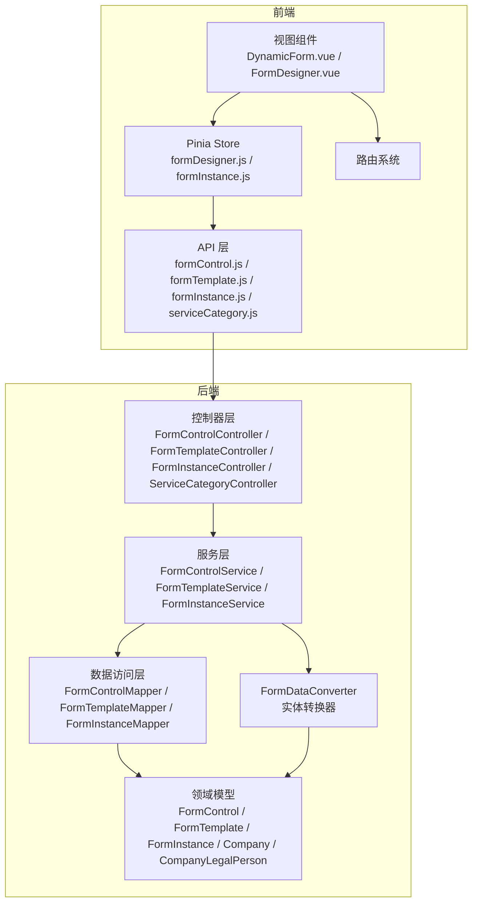
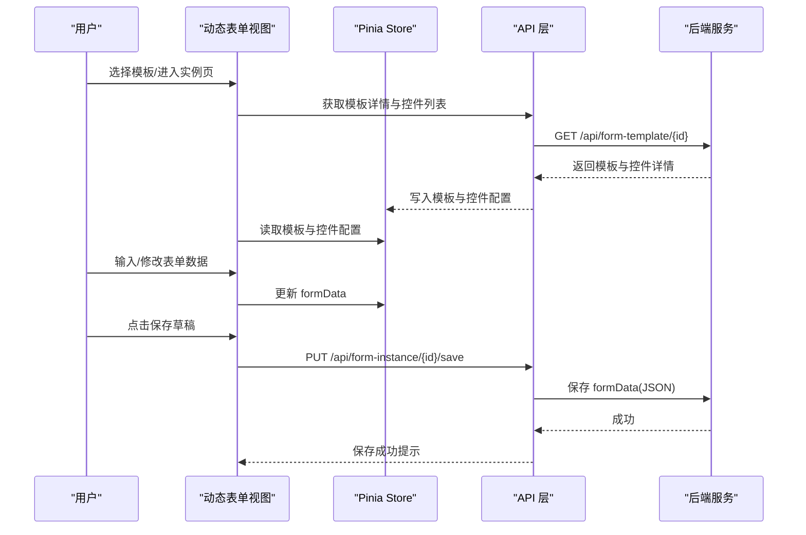
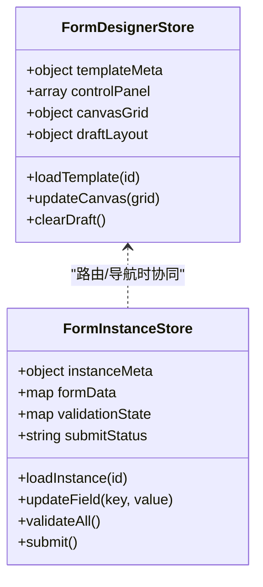
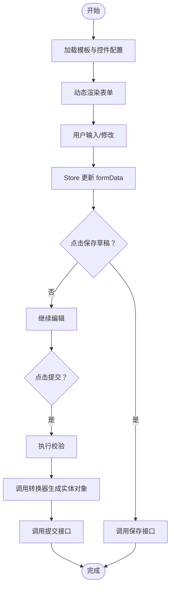
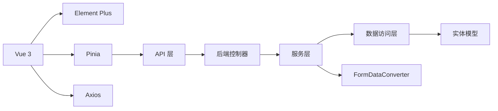

# 状态管理策略

<cite>
**本文引用的文件**
- [VAT_EPR_动态表单技术方案.md](file://VAT_EPR_动态表单技术方案.md)
</cite>

## 目录
1. [简介](#简介)
2. [项目结构](#项目结构)
3. [核心组件](#核心组件)
4. [架构总览](#架构总览)
5. [详细组件分析](#详细组件分析)
6. [依赖关系分析](#依赖关系分析)
7. [性能考量](#性能考量)
8. [故障排查指南](#故障排查指南)
9. [结论](#结论)
10. [附录](#附录)

## 简介
本文件围绕“动态表单系统”的前端状态管理策略进行系统化梳理，结合项目中对 Pinia 的使用定位与动态表单渲染、表单数据持久化、模板状态缓存、用户会话管理等场景，给出可落地的状态管理模式与最佳实践。内容涵盖：
- 全局状态与组件局部状态的划分原则
- Store 设计模式与状态更新机制
- 表单状态管理、模板状态缓存与用户会话管理
- 状态管理与路由系统的集成、页面状态恢复与并发状态处理
- 性能优化、调试方法与安全考虑

## 项目结构
项目采用前后端分离架构，前端使用 Vue 3 + Vite + Element Plus + Pinia + Axios，后端使用 Spring Boot。前端目录中明确包含 stores 目录，用于存放 Pinia Store，体现状态管理在前端架构中的核心地位。

图表来源
- [VAT_EPR_动态表单技术方案.md:815-852](file://VAT_EPR_动态表单技术方案.md#L815-L852)

章节来源
- [VAT_EPR_动态表单技术方案.md:815-852](file://VAT_EPR_动态表单技术方案.md#L815-L852)

## 核心组件
- Pinia Store：用于集中管理动态表单设计器与实例填写相关的全局状态，包括当前模板、画板布局、控件面板、实例数据、表单校验状态、路由参数与会话信息等。
- 动态表单渲染组件：根据后端返回的 json_schema 与 controlDetails 动态生成表单布局与控件，并通过 v-model 绑定 Store 中的 formData。
- API 层：封装与后端交互的接口，负责加载模板、保存草稿、提交表单、查询服务类目等。
- 路由系统：承载页面级状态（如模板 ID、实例 ID），并与 Store 协同实现页面状态恢复与导航守卫下的状态清理。

章节来源
- [VAT_EPR_动态表单技术方案.md:19-27](file://VAT_EPR_动态表单技术方案.md#L19-L27)
- [VAT_EPR_动态表单技术方案.md:815-852](file://VAT_EPR_动态表单技术方案.md#L815-L852)

## 架构总览
前端状态管理以 Pinia 为核心，贯穿“模板设计”和“实例填写”两大场景：
- 设计器场景：通过 formDesigner Store 管理控件面板、画板网格、布局元数据与临时编辑状态。
- 实例场景：通过 formInstance Store 管理实例数据、校验状态、提交状态与路由参数。

图表来源
- [VAT_EPR_动态表单技术方案.md:306-357](file://VAT_EPR_动态表单技术方案.md#L306-L357)

## 详细组件分析

### Pinia Store 设计模式
- 单一职责：每个 Store 负责一个业务域（如设计器或实例填写），避免跨域耦合。
- 状态结构化：将模板元数据、控件配置、实例数据、校验状态、路由参数、会话信息等按模块拆分，便于维护与调试。
- 计算属性与派生状态：利用 computed 从基础状态派生视图所需的状态，减少重复计算与副作用。
- 动作函数（actions）：封装异步与同步的状态更新逻辑，统一入口便于埋点与调试。

图表来源
- [VAT_EPR_动态表单技术方案.md:849-851](file://VAT_EPR_动态表单技术方案.md#L849-L851)

章节来源
- [VAT_EPR_动态表单技术方案.md:849-851](file://VAT_EPR_动态表单技术方案.md#L849-L851)

### 全局状态与组件局部状态的划分原则
- 全局状态：跨页面共享且影响多个组件的状态，例如模板元数据、控件配置、实例数据、路由参数、会话信息。
- 组件局部状态：仅在单个组件内使用的状态，例如某个控件的展开/收起、本地校验提示、临时编辑态。
- 划分策略：
  - 将“模板与实例”的核心数据放入 Pinia，确保多组件共享与一致性。
  - 将“UI 交互细节”保留在组件内部，降低 Store 复杂度与渲染压力。
  - 将“路由参数”与“页面生命周期”纳入 Store，便于页面恢复与导航守卫清理。

章节来源
- [VAT_EPR_动态表单技术方案.md:849-851](file://VAT_EPR_动态表单技术方案.md#L849-L851)

### 状态更新机制与响应式数据绑定
- 响应式绑定：动态表单通过 v-model 绑定 Store 中的 formData，实现双向数据流。
- 动作函数更新：通过 Store 的 actions 更新状态，避免直接修改状态导致的不可追踪问题。
- 计算派生：基于基础状态派生校验状态、渲染配置等，减少重复计算。
- 异步更新：保存草稿、提交表单等异步操作在 actions 中统一处理，支持 loading 状态与错误回滚。

章节来源
- [VAT_EPR_动态表单技术方案.md:531-577](file://VAT_EPR_动态表单技术方案.md#L531-L577)
- [VAT_EPR_动态表单技术方案.md:306-357](file://VAT_EPR_动态表单技术方案.md#L306-L357)

### 表单状态管理
- 数据模型：formData 采用 Map<controlKey, value> 结构，key 与后端 controlKey 保持一致，value 支持字符串、布尔、数字、文件列表、日期等类型。
- 校验策略：基于 controlDetails 中的规则（必填、正则、长度等）在 Store 中构建校验状态，支持实时校验与批量校验。
- 草稿与提交：保存草稿时将 formData 原样序列化为 JSON 存入后端；提交时触发转换器将 Map 转为实体对象集合。

图表来源
- [VAT_EPR_动态表单技术方案.md:579-589](file://VAT_EPR_动态表单技术方案.md#L579-L589)
- [VAT_EPR_动态表单技术方案.md:594-728](file://VAT_EPR_动态表单技术方案.md#L594-L728)

章节来源
- [VAT_EPR_动态表单技术方案.md:579-589](file://VAT_EPR_动态表formDesignerStore:579-589)
- [VAT_EPR_动态表单技术方案.md:594-728](file://VAT_EPR_动态表单技术方案.md#L594-L728)

### 模板状态缓存
- 缓存策略：将模板元数据与控件配置缓存至 Store，避免重复请求；在切换模板或刷新页面时优先从缓存读取。
- 清理策略：离开设计器或切换实例时清理临时布局与未保存的草稿，释放内存。
- 版本管理：模板发布后禁止修改 json_schema，Store 中保留版本信息，防止旧实例与新模板不兼容。

章节来源
- [VAT_EPR_动态表单技术方案.md:856-860](file://VAT_EPR_动态表单技术方案.md#L856-L860)

### 用户会话管理
- 登录态与权限：Store 中维护用户会话信息（如 token、角色、权限），在路由守卫中进行鉴权与重定向。
- 会话持久化：登录成功后将 token 写入持久化存储并在 Store 中同步，刷新页面后恢复会话。
- 退出清理：退出登录时清除 Store 与持久化存储中的会话信息，避免 XSS/CSRF 风险。

章节来源
- [VAT_EPR_动态表单技术方案.md:856-866](file://VAT_EPR_动态表单技术方案.md#L856-L866)

### 状态管理与路由系统的集成
- 页面状态恢复：通过路由参数携带模板 ID、实例 ID，在进入页面时加载对应 Store 状态，实现状态恢复。
- 导航守卫：在进入/离开页面时进行状态清理与持久化，避免内存泄漏与状态污染。
- 并发控制：同一实例的保存操作使用乐观锁（version）防止并发覆盖，Store 中记录保存时间戳与版本号。

章节来源
- [VAT_EPR_动态表单技术方案.md:856-869](file://VAT_EPR_动态表单技术方案.md#L856-L869)

## 依赖关系分析
- 前端依赖：Vue 3（响应式）、Element Plus（UI 组件）、Pinia（状态管理）、Axios（HTTP 客户端）、Vite（构建工具）。
- 后端依赖：Spring Boot、MyBatis-Plus、Jackson、Lombok。
- 前后端交互：通过 REST 接口传递模板、控件、实例数据与服务类目信息；表单数据以 JSON 形式传输。

图表来源
- [VAT_EPR_动态表单技术方案.md:7-28](file://VAT_EPR_动态表单技术方案.md#L7-L28)
- [VAT_EPR_动态表单技术方案.md:815-852](file://VAT_EPR_动态表单技术方案.md#L815-L852)

章节来源
- [VAT_EPR_动态表单技术方案.md:7-28](file://VAT_EPR_动态表单技术方案.md#L7-L28)
- [VAT_EPR_动态表单技术方案.md:815-852](file://VAT_EPR_动态表单技术方案.md#L815-L852)

## 性能考量
- 状态粒度：将大型对象拆分为小颗粒状态，减少不必要的响应式追踪与渲染。
- 计算属性：使用 computed 缓存派生状态，避免重复计算。
- 异步批处理：将多次状态更新合并为一次动作，减少渲染次数。
- 懒加载：模板与控件配置按需加载，避免首屏阻塞。
- 缓存策略：对静态配置与远程数据设置合理的缓存与失效策略。
- 调试与监控：开启 Pinia DevTools，记录动作日志与状态快照，定位性能瓶颈。

## 故障排查指南
- 表单数据异常：
  - 检查 controlKey 命名规范与唯一性，确保 key 与后端一致。
  - 校验 value 类型是否符合预期（字符串、布尔、数字、文件列表、日期）。
- 提交失败：
  - 查看校验状态与错误提示，确认必填项与正则规则。
  - 检查转换器是否正确识别实体类并完成类型转换。
- 并发冲突：
  - 使用乐观锁（version）避免并发覆盖，Store 中记录版本号与时间戳。
- 会话问题：
  - 检查 token 是否过期或被篡改，必要时重新登录并清理 Store。
- 调试工具：
  - 使用浏览器开发者工具与 Pinia DevTools，观察状态变化与动作调用链。

章节来源
- [VAT_EPR_动态表单技术方案.md:856-869](file://VAT_EPR_动态表单技术方案.md#L856-L869)

## 结论
本方案以 Pinia 为核心，结合动态表单渲染与后端实体转换，构建了清晰、可维护、可扩展的状态管理策略。通过合理的状态划分、动作封装与路由集成，实现了模板状态缓存、表单状态管理、用户会话管理与并发控制的协同工作。建议在后续迭代中持续完善状态快照、错误恢复与性能监控能力，以提升用户体验与系统稳定性。

## 附录
- 最佳实践清单：
  - 将跨组件共享的核心数据放入 Pinia，组件内部仅保留 UI 交互状态。
  - 使用 actions 统一状态更新入口，配合 computed 减少重复计算。
  - 为关键动作添加日志与埋点，便于问题定位与性能分析。
  - 在路由守卫中进行状态清理与持久化，避免内存泄漏。
  - 对模板与实例数据进行版本管理与缓存策略，确保一致性与性能。
  - 在提交前执行全面校验，提交后锁定修改，防止并发覆盖。