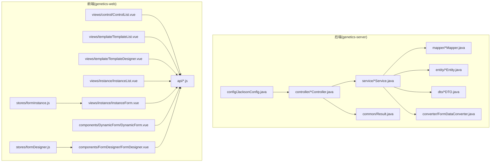
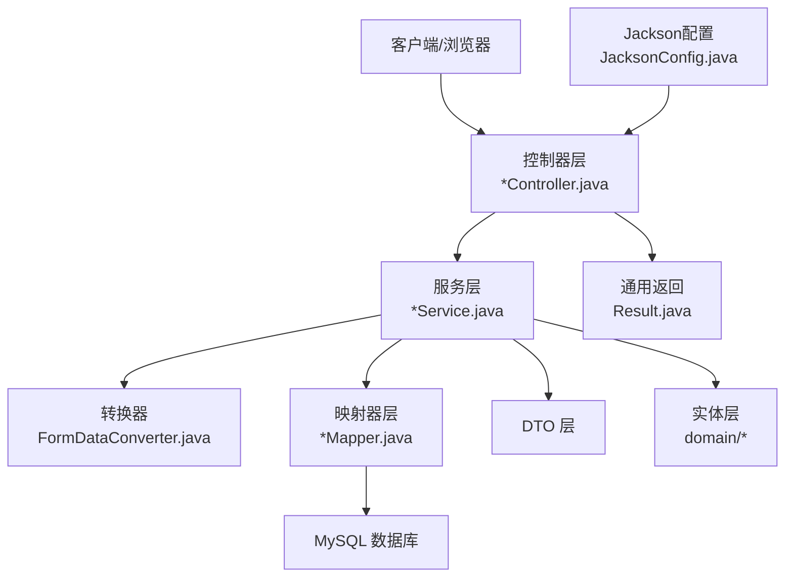
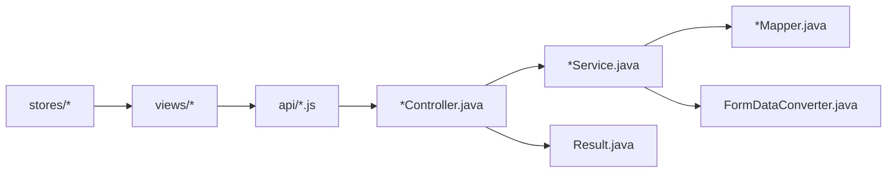
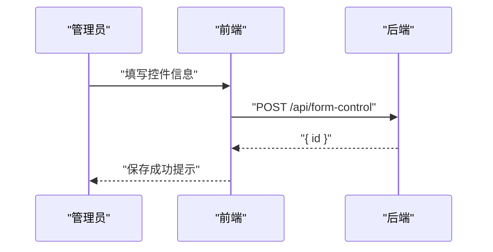

# 代码规范与最佳实践

<cite>
**本文引用的文件**
- [VAT_EPR_动态表单技术方案.md](file://VAT_EPR_动态表单技术方案.md)
</cite>

## 目录
1. [简介](#简介)
2. [项目结构](#项目结构)
3. [核心组件](#核心组件)
4. [架构总览](#架构总览)
5. [详细组件分析](#详细组件分析)
6. [依赖关系分析](#依赖关系分析)
7. [性能考量](#性能考量)
8. [故障排查指南](#故障排查指南)
9. [结论](#结论)
10. [附录](#附录)

## 简介
本指南面向VAT&EPR动态表单系统，结合现有技术方案与实现细节，制定统一的代码规范与最佳实践，覆盖后端Java命名约定、注释与格式化、前端Vue组件命名与文件组织、Git提交与分支管理、代码审查流程、数据库设计与SQL规范、API接口设计原则、代码质量检查与自动化流程、错误处理与日志记录等。旨在提升团队协作效率、保障系统稳定性与可维护性。

## 项目结构
根据技术方案，系统采用前后端分离架构：
- 后端采用Spring Boot 3.2.x + Java 21 + MyBatis-Plus，按功能域分层组织，包含控制器、服务、映射器、实体、DTO、通用返回封装、转换器与配置等模块。
- 前端采用Vue 3.4.x + Vite 5.x + Element Plus 2.x，采用组件化与状态管理（Pinia），并提供表单设计器与动态表单渲染能力。

图表来源
- [VAT_EPR_动态表单技术方案.md:773-852](file://VAT_EPR_动态表单技术方案.md#L773-L852)

章节来源
- [VAT_EPR_动态表单技术方案.md:773-852](file://VAT_EPR_动态表单技术方案.md#L773-L852)

## 核心组件
- 表单数据转换器：负责将前端提交的Map<controlKey, value>按类名分组并通过反射填充目标实体对象，输出Map<className, Object>。
- 控制器层：提供自定义控件、模板、实例、服务类目等API接口，统一返回Result封装。
- 服务层：封装业务逻辑，协调DAO与转换器，处理状态更新与并发控制。
- 映射器层：基于MyBatis-Plus访问数据库，提供CRUD与查询能力。
- DTO与实体：区分传输对象与持久化对象，避免跨层污染。
- 通用返回：Result统一响应结构，便于前端消费与错误处理。

章节来源
- [VAT_EPR_动态表单技术方案.md:592-728](file://VAT_EPR_动态表单技术方案.md#L592-L728)
- [VAT_EPR_动态表单技术方案.md:773-852](file://VAT_EPR_动态表单技术方案.md#L773-L852)

## 架构总览
系统采用分层架构与领域驱动设计思想：
- 表现层：控制器接收HTTP请求，参数校验与异常捕获，返回Result。
- 领域层：服务层聚合业务规则，调用转换器进行数据装配。
- 基础设施层：映射器访问数据库，Jackson配置统一序列化策略。
- 前端：组件化渲染，状态管理与API调用解耦。

图表来源
- [VAT_EPR_动态表单技术方案.md:773-852](file://VAT_EPR_动态表单技术方案.md#L773-L852)
- [VAT_EPR_动态表单技术方案.md:592-728](file://VAT_EPR_动态表单技术方案.md#L592-L728)

## 详细组件分析

### Java后端命名约定
- 包名
  - 使用全小写域名反写（com.genetics），子包按职责划分（controller、service、mapper、entity、dto、converter、common、config）。
- 类名
  - 使用帕斯卡命名法，控制器以Controller结尾，服务以Service结尾，映射器以Mapper结尾，实体与DTO以实体名或DTO结尾。
- 方法名
  - 使用驼峰命名法，动词开头，语义明确；控制器方法遵循REST风格命名（如list、create、save、submit）。
- 常量名
  - 使用全大写+下划线分隔，集中定义于类内或公共常量类中，避免魔法数。
- 字段与局部变量
  - 使用驼峰命名法，避免缩写；布尔字段前缀可使用is/has/should等增强可读性。
- 注释规范
  - 类与方法使用Javadoc注释，说明用途、参数、返回值与异常；复杂逻辑添加行内注释解释关键步骤。
- 格式化标准
  - 统一缩进（4空格）、括号换行、空行分隔逻辑块；导入顺序按第三方库、项目包分组；长参数分行对齐。

章节来源
- [VAT_EPR_动态表单技术方案.md:592-728](file://VAT_EPR_动态表单技术方案.md#L592-L728)
- [VAT_EPR_动态表单技术方案.md:773-852](file://VAT_EPR_动态表单技术方案.md#L773-L852)

### Vue前端组件命名与文件组织
- 组件命名
  - 页面级组件使用帕斯卡命名（如TemplateDesigner.vue），功能组件使用语义化命名（如DynamicForm.vue、ControlRenderer.vue）。
- 文件组织
  - views目录按页面功能划分（control、template、instance），components按功能域拆分（DynamicForm、FormDesigner），stores按业务域拆分（formDesigner.js、formInstance.js）。
- 样式规范
  - 使用CSS Modules或作用域样式，避免全局污染；组件样式与逻辑分离；变量命名采用BEM或语义化命名。
- API调用
  - 在api目录下按模块拆分（formControl.js、formTemplate.js、formInstance.js、serviceCategory.js），统一导出与错误处理。

章节来源
- [VAT_EPR_动态表单技术方案.md:815-852](file://VAT_EPR_动态表单技术方案.md#L815-L852)

### Git提交消息格式与分支管理策略
- 提交消息格式
  - 类型(scope): 摘要（不超过50字符）
  - 详细说明（可多行，72字符断行）
  - 关联Issue/任务编号（可选）
- 分支管理策略
  - develop：集成开发分支
  - feature/*：功能开发分支，从develop切出，完成后合并回develop
  - release/*：预发布分支，从develop切出，完成测试后合并至main并打标签
  - hotfix/*：线上紧急修复分支，从main切出，修复后同时合并回main与develop
- 合并与冲突解决
  - 使用squash合并保持提交历史整洁；冲突优先在本地解决并自检后再推送。

章节来源
- [VAT_EPR_动态表单技术方案.md:856-869](file://VAT_EPR_动态表单技术方案.md#L856-L869)

### 代码审查流程
- 提交流程
  - 提交前执行静态检查与单元测试；在Pull Request中描述变更内容、影响范围与测试结果。
- 审查要点
  - 代码风格一致性、命名规范、异常处理、日志记录、边界条件与安全性；确保无敏感信息泄露与未授权访问。
- 工具支持
  - 推荐使用SonarQube、SpotBugs、Checkstyle等工具进行静态分析；结合CI流水线自动触发检查。

章节来源
- [VAT_EPR_动态表单技术方案.md:856-869](file://VAT_EPR_动态表单技术方案.md#L856-L869)

### 数据库设计规范与SQL编写标准
- 表设计
  - 主键使用自增BIGINT，唯一键用于业务唯一性（如control_key）；冗余字段用于查询优化（如模板实例中的模板名称、版本、国家代码）。
  - 时间字段统一使用DATETIME，带默认值CURRENT_TIMESTAMP；软删除使用TINYINT(1)标志位。
- 字段命名
  - 使用下划线分隔，语义清晰；必要时添加注释说明用途与取值含义。
- SQL编写
  - 优先使用参数化查询，避免拼接；复杂查询添加索引（如模板实例的模板ID索引）；避免SELECT *，只取必要字段。
  - 事务边界明确，异常时回滚；批量操作分批处理，避免长时间锁表。

章节来源
- [VAT_EPR_动态表单技术方案.md:31-163](file://VAT_EPR_动态表单技术方案.md#L31-L163)

### API接口设计原则
- 路径与动词
  - 使用REST风格路径与HTTP动词；集合资源使用复数名词，单个资源使用ID路径段。
- 请求与响应
  - 统一Result封装，包含code、message、data；错误码语义化，message对用户友好且可国际化。
- 参数与校验
  - 必填参数在接口文档中明确标注；后端使用参数校验注解（如@NotNull、@NotBlank）；非法参数快速失败并返回明确错误。
- 版本与兼容
  - 通过路径或Header携带版本信息；发布后不破坏向后兼容，新增字段向后兼容。

章节来源
- [VAT_EPR_动态表单技术方案.md:167-396](file://VAT_EPR_动态表单技术方案.md#L167-L396)

### 错误处理模式、日志记录与异常管理
- 错误处理
  - 控制器层捕获业务异常并返回Result.error；DAO层异常向上抛出或包装为业务异常；避免吞掉异常。
- 日志记录
  - 使用SLF4J日志门面，按级别记录：info（关键流程）、warn（潜在问题）、error（异常与失败）；记录关键上下文（如用户ID、请求ID、参数摘要）。
- 异常管理
  - 定义统一异常处理器，将异常转换为Result；对敏感信息脱敏（如密码、Token）；对外仅暴露通用错误信息。

章节来源
- [VAT_EPR_动态表单技术方案.md:592-728](file://VAT_EPR_动态表单技术方案.md#L592-L728)

### 代码质量检查工具与自动化流程
- 工具配置建议
  - SonarQube：代码覆盖率、重复率、异味检测；规则集可定制。
  - SpotBugs/FindBugs：静态缺陷检测；关注空指针、资源泄漏等。
  - Checkstyle/PMD：风格与规范检查；与IDE集成自动提示。
  - Lombok：减少样板代码，注意生成方法的可读性。
- CI流程
  - 触发条件：push到feature/release/hotfix分支；PR打开/更新。
  - 步骤：安装依赖、编译、测试、静态检查、构建镜像/包、部署预览（可选）。

章节来源
- [VAT_EPR_动态表单技术方案.md:856-869](file://VAT_EPR_动态表单技术方案.md#L856-L869)

## 依赖关系分析
- 控制器依赖服务层，服务层依赖映射器与转换器；通用返回Result被控制器广泛使用。
- 前端组件通过API模块与后端交互，状态管理模块与视图组件解耦。
- Jackson配置影响序列化行为，需与后端DTO/实体保持一致。

图表来源
- [VAT_EPR_动态表单技术方案.md:773-852](file://VAT_EPR_动态表单技术方案.md#L773-L852)

章节来源
- [VAT_EPR_动态表单技术方案.md:773-852](file://VAT_EPR_动态表单技术方案.md#L773-L852)

## 性能考量
- 查询优化
  - 为高频查询字段建立索引；避免N+1查询，使用批量加载或JOIN。
- 缓存策略
  - 对静态配置（如控件类型、国家代码）使用缓存；注意缓存一致性。
- 并发控制
  - 对实例保存操作使用乐观锁（version字段）；提交后禁止修改。
- 序列化与网络
  - DTO字段精简，避免传输冗余；大对象分页或延迟加载。

章节来源
- [VAT_EPR_动态表单技术方案.md:856-869](file://VAT_EPR_动态表单技术方案.md#L856-L869)

## 故障排查指南
- 常见问题定位
  - 控件唯一性校验失败：检查controlKey格式与唯一索引；后端日志中查看无效格式与跳过记录。
  - 表单提交转换失败：确认实体类已在转换器注册；检查字段名匹配与类型转换。
  - 实例并发覆盖：检查乐观锁字段是否正确传递与更新。
- 日志与监控
  - 关键流程记录info日志；异常记录error日志并附上下文；结合链路追踪定位慢请求。
- 回滚与恢复
  - 发布后问题回滚至上一版本；对数据变更进行备份与校验。

章节来源
- [VAT_EPR_动态表单技术方案.md:592-728](file://VAT_EPR_动态表单技术方案.md#L592-L728)
- [VAT_EPR_动态表单技术方案.md:856-869](file://VAT_EPR_动态表单技术方案.md#L856-L869)

## 结论
本指南基于现有技术方案提炼出统一的代码规范与最佳实践，涵盖前后端命名、文件组织、数据库设计、API设计、错误处理与日志、质量检查与自动化等方面。建议团队在开发过程中严格执行，并持续优化以适应业务演进。

## 附录
- 关键流程时序参考
  - 自定义控件管理时序
  - 服务单模板设计时序
  - 创建并填写服务单时序
  - 服务单提交与对象转换时序

图表来源
- [VAT_EPR_动态表单技术方案.md:401-413](file://VAT_EPR_动态表单技术方案.md#L401-L413)

章节来源
- [VAT_EPR_动态表单技术方案.md:401-413](file://VAT_EPR_动态表单技术方案.md#L401-L413)