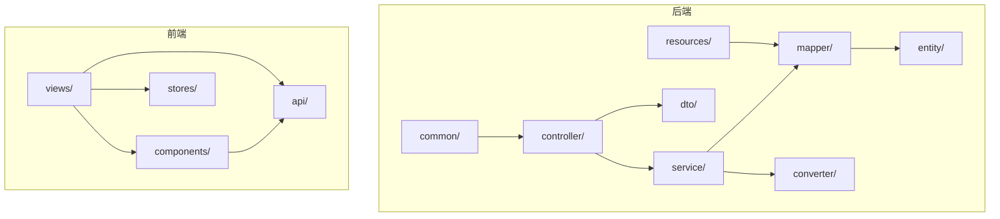
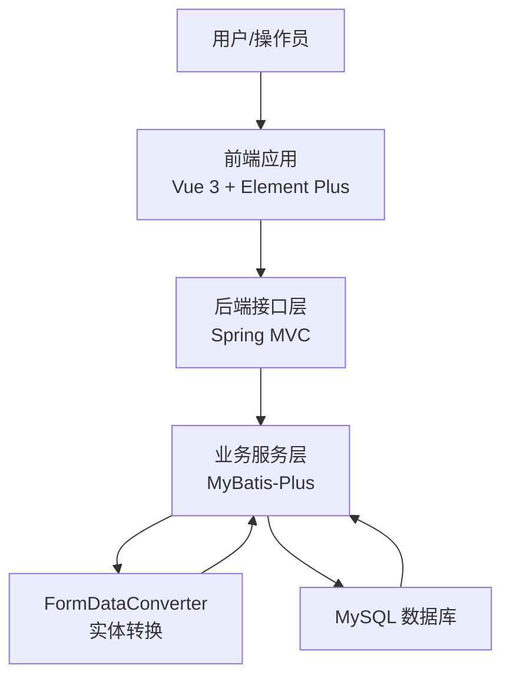
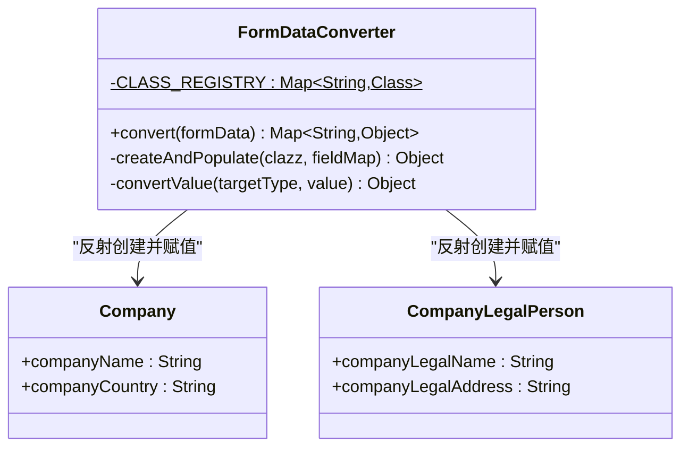
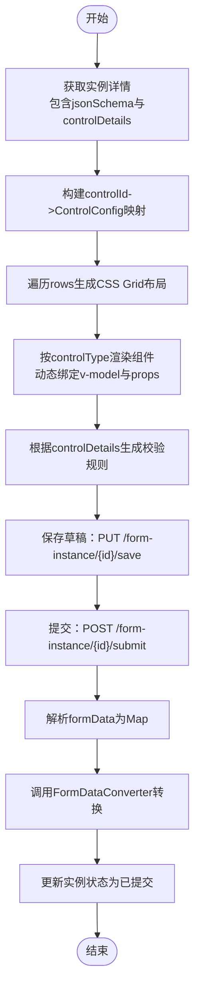
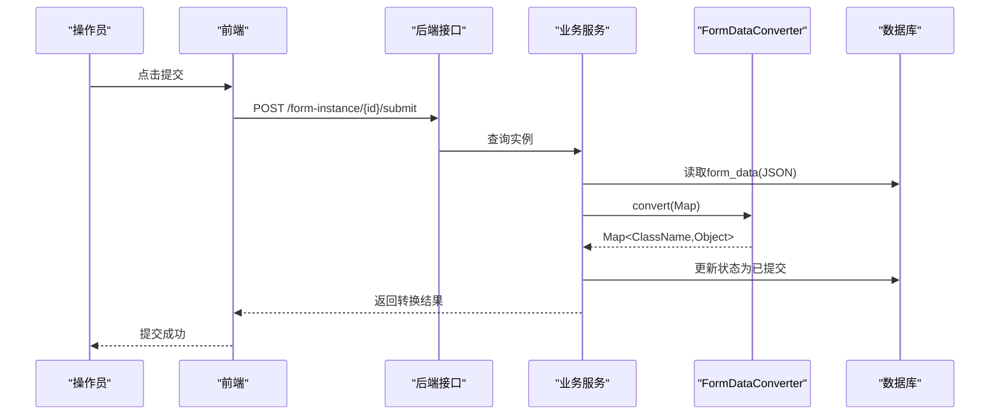
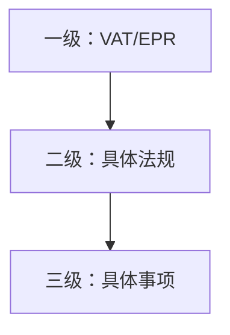
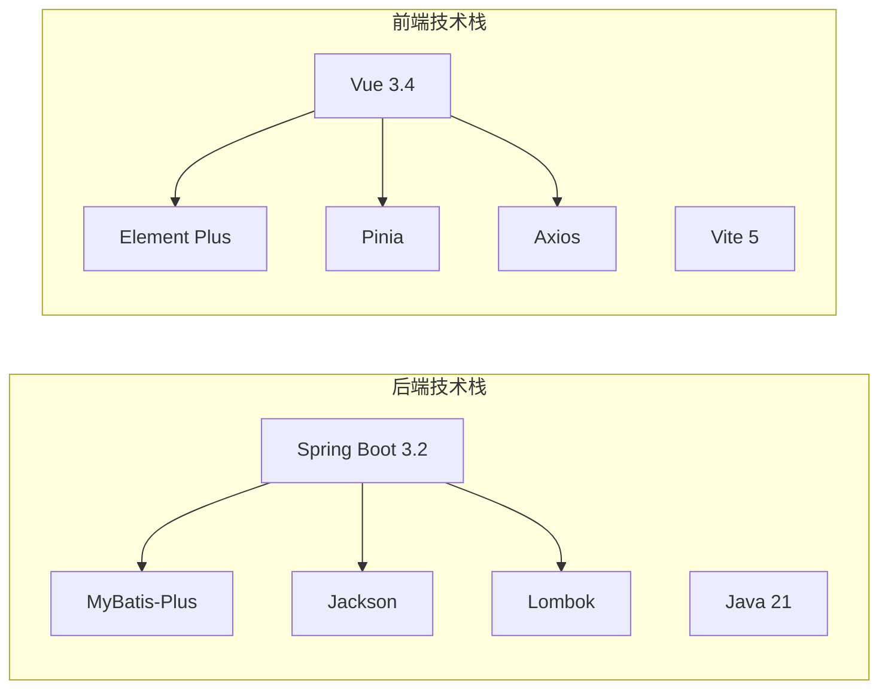

# 开发指南

<cite>
**本文档引用的文件**
- [VAT_EPR_动态表单技术方案.md](file://VAT_EPR_动态表单技术方案.md)
</cite>

## 目录
1. [简介](#简介)
2. [项目结构](#项目结构)
3. [核心组件](#核心组件)
4. [架构总览](#架构总览)
5. [详细组件分析](#详细组件分析)
6. [依赖关系分析](#依赖关系分析)
7. [性能考虑](#性能考虑)
8. [故障排查指南](#故障排查指南)
9. [结论](#结论)
10. [附录](#附录)

## 简介
本开发指南面向VAT& EPR动态表单系统的新老开发者，提供从开发环境搭建、代码规范、测试策略到扩展与插件机制的全流程说明。系统采用前后端分离架构，后端基于Spring Boot 3.2 + Java 21 + MyBatis-Plus，前端基于Vue 3.4 + Vite 5 + Element Plus，支持通过JSON Schema驱动的动态表单渲染与提交后的实体对象转换。

## 项目结构
后端采用标准Maven多模块结构，按职责分层：
- controller 层：对外HTTP接口
- service 层：业务逻辑编排
- mapper 层：MyBatis-Plus数据访问
- entity/domain：数据库实体与业务实体
- converter：表单数据转换器
- dto：接口传输对象
- common：通用返回封装
- resources：配置与Mapper XML

前端采用目录清晰的页面/组件/状态管理模式：
- views：页面级视图（控制管理、模板设计、实例填写）
- components：可复用组件（DynamicForm、FormDesigner）
- api：HTTP接口封装
- stores：Pinia状态管理

图表来源
- [VAT_EPR_动态表单技术方案.md:775-852](file://VAT_EPR_动态表单技术方案.md#L775-L852)

章节来源
- [VAT_EPR_动态表单技术方案.md:775-852](file://VAT_EPR_动态表单技术方案.md#L775-L852)

## 核心组件
- 表单数据转换器：将Map<controlKey, value>按ClassName分组并通过反射转换为业务实体对象，支持字符串、整数、长整型、布尔、大数等基础类型的自动转换。
- 控件与模板：通过controlKey唯一标识控件，模板json_schema定义布局与控件引用，实例表单持久化formData。
- 服务类目：提供国家与服务类目的三级联动，便于筛选适用模板。

章节来源
- [VAT_EPR_动态表单技术方案.md:592-728](file://VAT_EPR_动态表单技术方案.md#L592-L728)
- [VAT_EPR_动态表单技术方案.md:31-163](file://VAT_EPR_动态表单技术方案.md#L31-L163)
- [VAT_EPR_动态表单技术方案.md:732-770](file://VAT_EPR_动态表单技术方案.md#L732-L770)

## 架构总览
系统采用“模板驱动 + JSON Schema + 动态渲染 + 实体转换”的架构模式。后端负责模板与实例的CRUD、校验与转换；前端负责动态表单渲染、校验与提交。

图表来源
- [VAT_EPR_动态表单技术方案.md:167-387](file://VAT_EPR_动态表单技术方案.md#L167-L387)
- [VAT_EPR_动态表单技术方案.md:592-728](file://VAT_EPR_动态表单技术方案.md#L592-L728)

## 详细组件分析

### 表单数据转换器（FormDataConverter）
- 职责：将前端提交的formData映射为业务实体对象，按controlKey中的类名进行分组与反射赋值。
- 关键点：
  - controlKey格式必须为“ClassName.fieldName”，否则跳过或报错。
  - 支持的类型转换包括字符串、整数、长整型、布尔、大数等。
  - 实体类注册通过静态映射维护，建议后续扩展为注解扫描自动注册。
  - 日志记录转换过程，便于问题定位与审计。

图表来源
- [VAT_EPR_动态表单技术方案.md:594-684](file://VAT_EPR_动态表单技术方案.md#L594-L684)
- [VAT_EPR_动态表单技术方案.md:687-703](file://VAT_EPR_动态表单技术方案.md#L687-L703)

章节来源
- [VAT_EPR_动态表单技术方案.md:594-684](file://VAT_EPR_动态表单技术方案.md#L594-L684)
- [VAT_EPR_动态表单技术方案.md:687-703](file://VAT_EPR_动态表单技术方案.md#L687-L703)

### 动态表单渲染与数据存储
- JSON Schema定义网格布局与控件引用，前端根据controlType渲染对应组件，并将用户输入维护在formData对象中。
- 提交时将formData原样传回后端，后端解析为Map并交由转换器生成实体对象。
- 存储策略：form_data字段存储Map<String, Object>的JSON字符串，key遵循“ClassName.fieldName”规范。

图表来源
- [VAT_EPR_动态表单技术方案.md:531-589](file://VAT_EPR_动态表单技术方案.md#L531-L589)
- [VAT_EPR_动态表单技术方案.md:705-728](file://VAT_EPR_动态表单技术方案.md#L705-L728)

章节来源
- [VAT_EPR_动态表单技术方案.md:531-589](file://VAT_EPR_动态表单技术方案.md#L531-L589)
- [VAT_EPR_动态表单技术方案.md:705-728](file://VAT_EPR_动态表单技术方案.md#L705-L728)

### 接口时序（提交与对象转换）

图表来源
- [VAT_EPR_动态表单技术方案.md:460-478](file://VAT_EPR_动态表单技术方案.md#L460-L478)
- [VAT_EPR_动态表单技术方案.md:705-728](file://VAT_EPR_动态表单技术方案.md#L705-L728)

章节来源
- [VAT_EPR_动态表单技术方案.md:460-478](file://VAT_EPR_动态表单技术方案.md#L460-L478)
- [VAT_EPR_动态表单技术方案.md:705-728](file://VAT_EPR_动态表单技术方案.md#L705-L728)

### 服务类目三级联动
- 国家代码枚举与服务类目层级：一级（VAT/EPR）、二级（具体法规）、三级（具体事项）。
- 前端交互：选中一级后请求二级，再选中二级后请求三级，实现联动。

图表来源
- [VAT_EPR_动态表单技术方案.md:732-770](file://VAT_EPR_动态表单技术方案.md#L732-L770)

章节来源
- [VAT_EPR_动态表单技术方案.md:732-770](file://VAT_EPR_动态表单技术方案.md#L732-L770)

## 依赖关系分析
- 技术栈：后端Spring Boot 3.2 + Java 21 + MyBatis-Plus + Jackson + Lombok；前端Vue 3.4 + Vite 5 + Element Plus + Pinia + Axios。
- 数据模型：form_control、form_template、form_instance三张核心表，通过controlKey与json_schema建立动态表单关系。
- 外部依赖：文件上传需配合对象存储（如OSS/MinIO），服务类目接口透传既有系统。

图表来源
- [VAT_EPR_动态表单技术方案.md:7-28](file://VAT_EPR_动态表单技术方案.md#L7-L28)

章节来源
- [VAT_EPR_动态表单技术方案.md:7-28](file://VAT_EPR_动态表单技术方案.md#L7-L28)

## 性能考虑
- 前端渲染：使用CSS Grid布局，按rows/cells渲染，避免DOM层级过深；控件组件按需加载，减少首屏压力。
- 后端转换：反射创建对象与字段赋值为O(n)复杂度，建议对常用实体类进行缓存；批量提交时注意避免重复注册类。
- 数据库：模板与实例表建立必要索引（如template_id、control_key唯一索引），查询控件列表与模板详情时利用索引。
- 并发控制：实例保存采用乐观锁（version字段）避免并发覆盖；提交后禁止修改，确保一致性。
- 文件上传：上传控件返回URL列表，建议结合CDN与缩略图优化加载速度。

章节来源
- [VAT_EPR_动态表单技术方案.md:856-869](file://VAT_EPR_动态表单技术方案.md#L856-L869)

## 故障排查指南
- controlKey格式错误：检查controlKey是否符合“ClassName.fieldName”格式，数据库唯一索引与后端校验均会拒绝非法格式。
- 控件唯一性冲突：当controlKey重复时，后端校验会失败；请调整controlKey或删除重复项。
- 实体未注册：新增业务实体后需在转换器注册映射，否则转换阶段会跳过该类或抛出异常。
- 提交后状态不可逆：实例提交后状态变为已提交，前端应禁用编辑；如需修改需重新创建实例。
- 文件上传异常：确认上传控件的accept与maxCount配置正确，上传完成后URL列表应能正常访问。
- 并发覆盖：保存时出现版本冲突，需提示用户刷新页面重试或合并最新数据。

章节来源
- [VAT_EPR_动态表单技术方案.md:856-869](file://VAT_EPR_动态表单技术方案.md#L856-L869)

## 结论
本系统通过JSON Schema与动态渲染实现了高度灵活的表单能力，结合实体转换器与严格的控制与约束，保障了跨国家与服务类型的合规性与一致性。建议在后续迭代中完善实体类自动注册、并发控制与日志审计，持续提升可维护性与可观测性。

## 附录

### 开发环境搭建
- 后端
  - JDK 21、Maven、MySQL 8.0+
  - IDE推荐：IntelliJ IDEA
  - 启动类：GeneticsApplication
- 前端
  - Node.js 18+、npm/yarn
  - IDE推荐：VS Code
  - 启动命令：npm run dev
- 数据库初始化
  - 使用提供的建表SQL创建表结构
  - 在application.yml中配置数据库连接参数

章节来源
- [VAT_EPR_动态表单技术方案.md:7-28](file://VAT_EPR_动态表单技术方案.md#L7-L28)
- [VAT_EPR_动态表单技术方案.md:810-813](file://VAT_EPR_动态表单技术方案.md#L810-L813)

### 代码规范
- 命名约定
  - 控件key：ClassName.fieldName，保持唯一且与实体字段一致
  - 控件类型：INPUT/SELECT/SWITCH/UPLOAD/TEXTAREA/DATE/NUMBER
  - 国家代码：三位字母（如DEU/FRA/ITA/ESP/POL/CZE/GBR）
  - 服务代码：L1/L2/L3三层编码（如01/VAT、0101/包装法、010101/新注册）
- 目录结构
  - 后端：controller/service/mapper/entity/dto/converter/common
  - 前端：views/components/api/stores
- 注释与日志
  - 关键流程添加日志，便于问题追踪
  - DTO与实体类保持清晰的职责边界

章节来源
- [VAT_EPR_动态表单技术方案.md:61-65](file://VAT_EPR_动态表单技术方案.md#L61-L65)
- [VAT_EPR_动态表单技术方案.md:734-745](file://VAT_EPR_动态表单技术方案.md#L734-L745)
- [VAT_EPR_动态表单技术方案.md:775-852](file://VAT_EPR_动态表单技术方案.md#L775-L852)

### 测试策略
- 单元测试
  - 转换器：构造不同类型的formData，验证转换结果与异常处理
  - 控件与模板：模拟controlKey唯一性、格式校验、模板发布后不可修改
- 集成测试
  - 接口：创建控件/模板/实例，保存草稿与提交，断言状态与返回数据
  - 三级联动：验证国家与服务类目联动逻辑
- 前端测试
  - 动态表单：渲染、校验、保存草稿、提交流程
  - 设计器：拖拽、布局、保存模板

章节来源
- [VAT_EPR_动态表单技术方案.md:167-387](file://VAT_EPR_动态表单技术方案.md#L167-L387)

### 新功能开发流程
- 需求评审：明确业务背景、国家与服务类型范围
- 数据模型：新增或调整实体类，更新controlKey与json_schema
- 后端：新增/修改接口、服务与转换器注册
- 前端：新增控件组件、渲染逻辑与校验规则
- 测试：编写单元与集成测试，覆盖关键场景
- 上线：灰度发布、监控与回滚预案

章节来源
- [VAT_EPR_动态表单技术方案.md:592-728](file://VAT_EPR_动态表单技术方案.md#L592-L728)

### 代码审查标准
- 正确性：controlKey唯一性与格式校验、模板发布后不可修改
- 可维护性：转换器注册方式、异常处理与日志记录
- 性能：反射创建对象的缓存、数据库索引与查询优化
- 安全性：敏感字段过滤、提交后状态保护、文件上传安全

章节来源
- [VAT_EPR_动态表单技术方案.md:856-869](file://VAT_EPR_动态表单技术方案.md#L856-L869)

### 持续集成配置
- 建议流水线包含：代码风格检查、单元测试、集成测试、打包与部署
- 前端：Vite构建、ESLint、单元测试覆盖率
- 后端：Spring Boot测试、MyBatis-Plus SQL校验、数据库迁移脚本

章节来源
- [VAT_EPR_动态表单技术方案.md:7-28](file://VAT_EPR_动态表单技术方案.md#L7-L28)

### 调试技巧
- 后端：开启DEBUG日志，观察转换器分组与反射赋值过程；使用断点定位controlKey格式与实体注册问题
- 前端：在DynamicForm与FormDesigner中打印formData与json_schema；使用浏览器开发者工具检查网络请求与响应
- 数据库：核对controlKey唯一索引与模板状态字段；检查form_data JSON格式

章节来源
- [VAT_EPR_动态表单技术方案.md:531-589](file://VAT_EPR_动态表单技术方案.md#L531-L589)
- [VAT_EPR_动态表单技术方案.md:594-684](file://VAT_EPR_动态表单技术方案.md#L594-L684)

### 扩展与插件机制
- 实体扩展：新增业务实体后在转换器注册映射，或扩展为注解扫描自动注册
- 控件扩展：在前端controls目录新增控件组件，注册到ControlRenderer
- 模板扩展：通过json_schema扩展布局与控件组合，保持controlKey与实体字段一致
- 插件化：建议引入自定义注解与SPI机制，实现控件与实体的动态发现与注册

章节来源
- [VAT_EPR_动态表单技术方案.md:862](file://VAT_EPR_动态表单技术方案.md#L862)
- [VAT_EPR_动态表单技术方案.md:843-848](file://VAT_EPR_动态表单技术方案.md#L843-L848)

### 快速上手与技能提升路径
- 后端
  - 熟悉Spring Boot与MyBatis-Plus，掌握DTO/Service/Mapper分层
  - 理解反射与JSON序列化，掌握FormDataConverter工作原理
  - 学习数据库设计与索引优化，理解三张核心表的关系
- 前端
  - 熟练Vue 3 Composition API与Element Plus组件
  - 掌握动态表单渲染与校验规则生成
  - 理解Pinia状态管理与Axios封装
- 全栈
  - 理解接口时序与数据流转，参与接口联调
  - 参与测试与CI流程，提升质量意识

章节来源
- [VAT_EPR_动态表单技术方案.md:7-28](file://VAT_EPR_动态表单技术方案.md#L7-L28)
- [VAT_EPR_动态表单技术方案.md:167-387](file://VAT_EPR_动态表单技术方案.md#L167-L387)