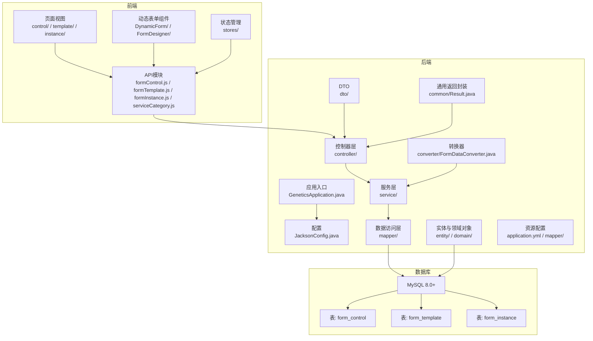
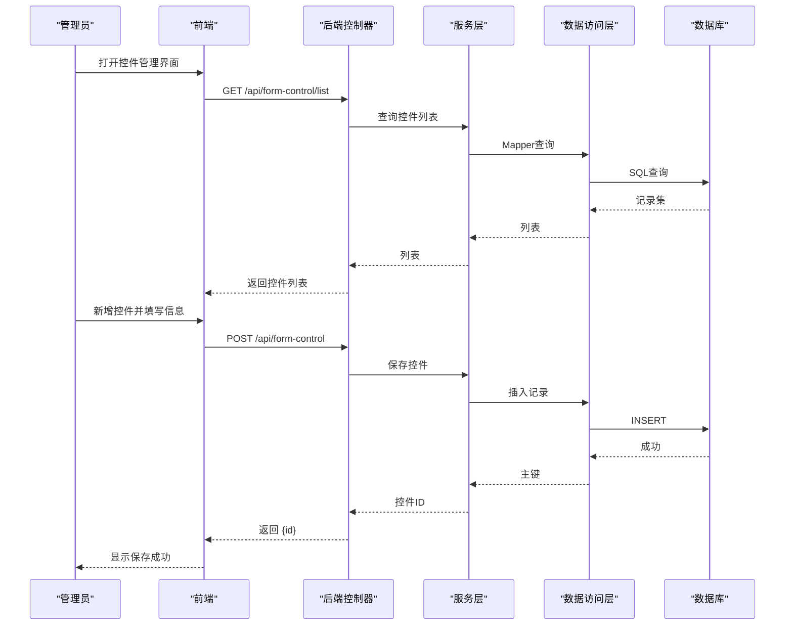
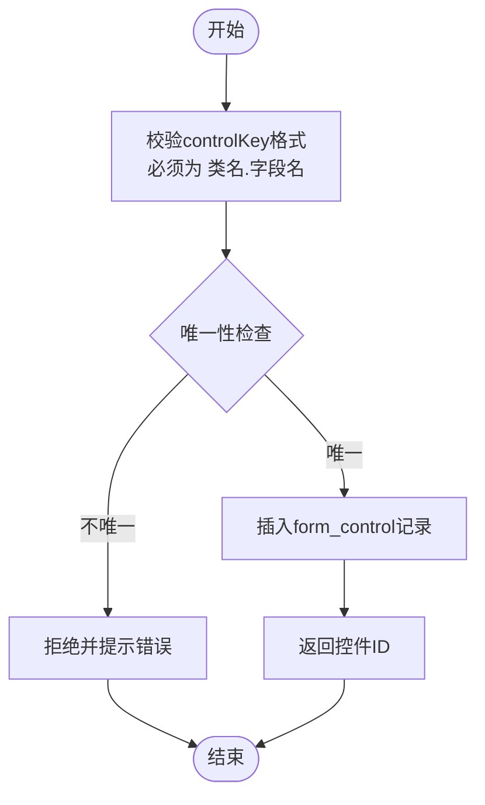
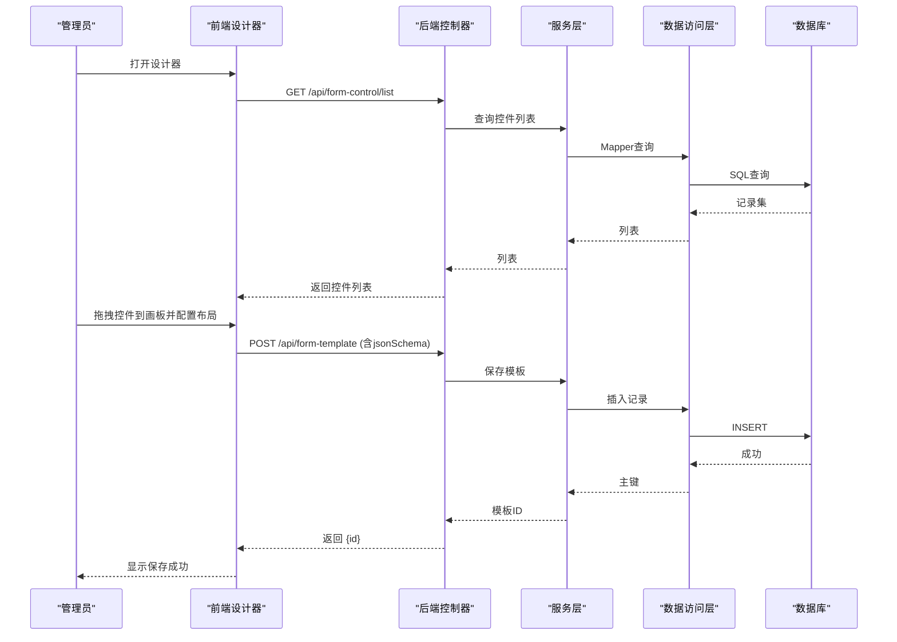
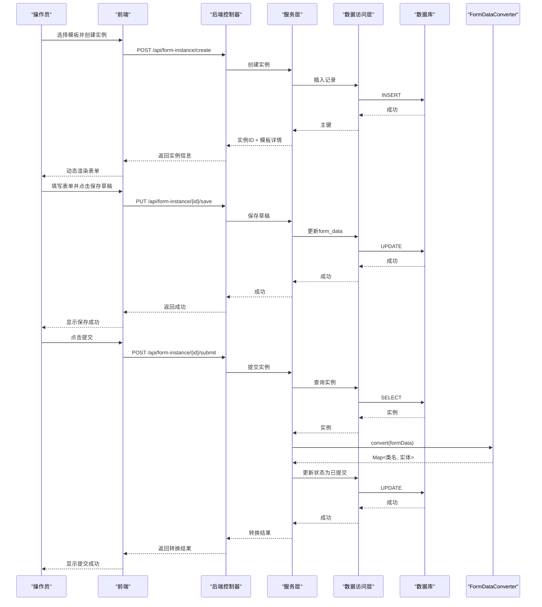
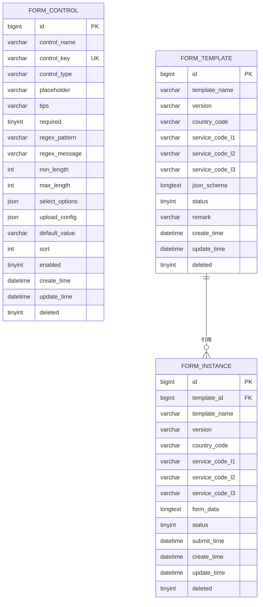
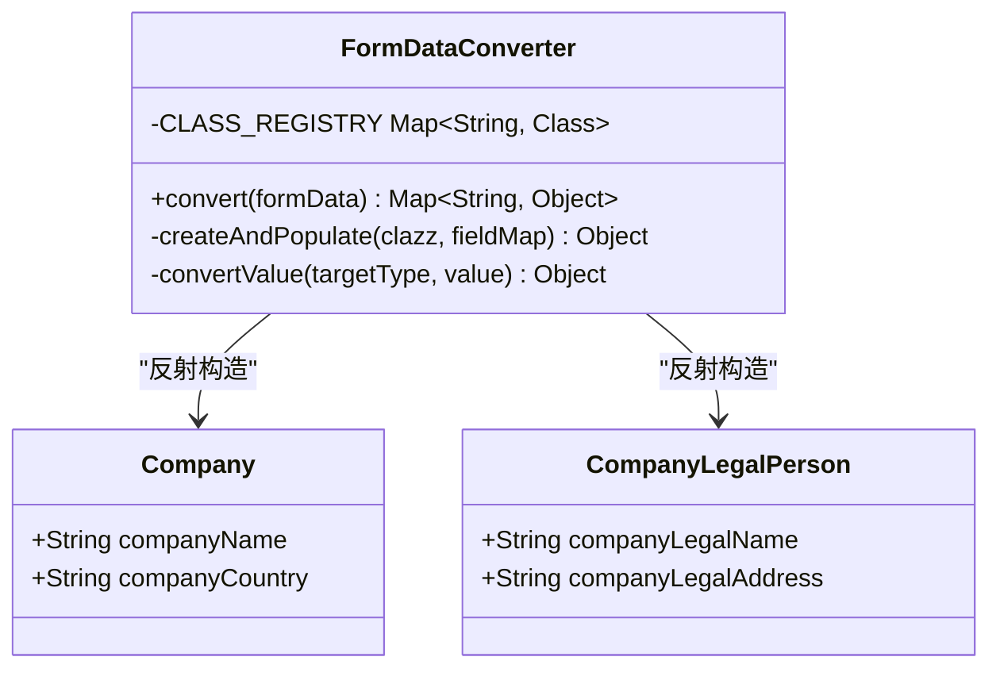
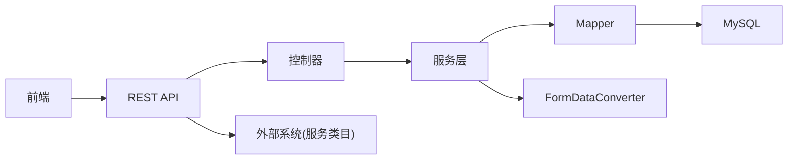

# 开发流程与协作

<cite>
**本文引用的文件**
- [VAT_EPR_动态表单技术方案.md](file://VAT_EPR_动态表单技术方案.md)
</cite>

## 目录
1. [简介](#简介)
2. [项目结构](#项目结构)
3. [核心组件](#核心组件)
4. [架构总览](#架构总览)
5. [详细组件分析](#详细组件分析)
6. [依赖关系分析](#依赖关系分析)
7. [性能考虑](#性能考虑)
8. [故障排查指南](#故障排查指南)
9. [结论](#结论)
10. [附录](#附录)

## 简介
本文件面向VAT与EPR动态表单系统，旨在建立标准化的开发流程与团队协作规范，覆盖需求分析、设计评审、开发计划制定、代码提交规范（分支策略、提交消息格式、Pull Request审查流程）、持续集成/持续部署（CI/CD）配置、版本管理与发布流程（语义化版本控制与变更日志维护）、团队沟通协作工具使用规范以及新成员入职与技能培养路径。该方案基于仓库中的技术方案文档进行提炼与扩展，确保研发过程可追溯、可复用、可演进。

## 项目结构
项目采用前后端分离架构，后端基于Spring Boot 3.2.x + Java 21，前端基于Vue 3.4.x + Vite 5.x。数据库采用MySQL 8.0+，ORM使用MyBatis-Plus 3.5.x，JSON序列化使用Jackson 2.x，UI组件库使用Element Plus 2.x，状态管理使用Pinia 2.x，HTTP客户端使用Axios 1.x。项目包含自定义控件、服务单模板与服务单实例三层核心数据模型，支持国家与服务类目的三级联动。

图表来源
- [VAT_EPR_动态表单技术方案.md:773-869](file://VAT_EPR_动态表单技术方案.md#L773-L869)

章节来源
- [VAT_EPR_动态表单技术方案.md:7-28](file://VAT_EPR_动态表单技术方案.md#L7-L28)
- [VAT_EPR_动态表单技术方案.md:773-869](file://VAT_EPR_动态表单技术方案.md#L773-L869)

## 核心组件
- 自定义控件管理：提供控件的增删改查与校验，控制键（controlKey）格式与唯一性约束，支持多种控件类型（输入、选择、开关、上传、文本域、日期、数字）。
- 服务单模板：支持可视化设计器，通过拖拽生成JSON Schema布局，关联国家与服务类目，模板发布后版本固定，避免历史实例数据错乱。
- 服务单实例：根据模板创建实例，动态渲染表单并持久化formData，支持草稿保存与提交，提交后触发对象转换器将Map映射为业务实体对象。
- 数据转换器（FormDataConverter）：按“类名.字段名”解析controlKey，按类名分组并反射构造业务实体对象，输出Map<类名, 实体>供后续业务处理。
- 服务类目三级联动：支持国家代码枚举与服务类目L1/L2/L3级联选择，前端按层级异步加载子节点。

章节来源
- [VAT_EPR_动态表单技术方案.md:31-163](file://VAT_EPR_动态表单技术方案.md#L31-L163)
- [VAT_EPR_动态表单技术方案.md:167-387](file://VAT_EPR_动态表单技术方案.md#L167-L387)
- [VAT_EPR_动态表单技术方案.md:592-728](file://VAT_EPR_动态表单技术方案.md#L592-L728)
- [VAT_EPR_动态表单技术方案.md:732-770](file://VAT_EPR_动态表单技术方案.md#L732-L770)

## 架构总览
系统采用前后端分离架构，前端负责动态表单渲染与用户交互，后端提供REST API与业务逻辑。核心流程包括：控件管理、模板设计、实例创建与填写、提交与对象转换、服务类目联动。

图表来源
- [VAT_EPR_动态表单技术方案.md:401-413](file://VAT_EPR_动态表单技术方案.md#L401-L413)
- [VAT_EPR_动态表单技术方案.md:169-221](file://VAT_EPR_动态表单技术方案.md#L169-L221)

## 详细组件分析

### 自定义控件管理
- 数据模型：控件表包含controlKey（类名.字段名）、类型、占位符、提示、必填、正则约束、长度限制、下拉选项、上传配置、默认值、排序与启用状态等字段。
- 接口：提供创建、查询列表、更新、删除等REST接口；后端对controlKey格式与唯一性进行校验。
- 前端：控件面板支持拖拽至画板，控件类型决定渲染组件与校验规则。

图表来源
- [VAT_EPR_动态表单技术方案.md:33-59](file://VAT_EPR_动态表单技术方案.md#L33-L59)
- [VAT_EPR_动态表单技术方案.md:169-221](file://VAT_EPR_动态表单技术方案.md#L169-L221)

章节来源
- [VAT_EPR_动态表单技术方案.md:33-59](file://VAT_EPR_动态表单技术方案.md#L33-L59)
- [VAT_EPR_动态表单技术方案.md:169-221](file://VAT_EPR_动态表单技术方案.md#L169-L221)

### 服务单模板设计
- JSON Schema：定义网格布局、列数、行与单元格，每个单元格绑定控件ID、controlKey、类型与标签。
- 设计器：左侧控件面板，右侧画板，支持拖拽、配置布局与保存模板。
- 版本管理：模板发布后不可修改jsonSchema，变更需升版本号。

图表来源
- [VAT_EPR_动态表单技术方案.md:415-435](file://VAT_EPR_动态表单技术方案.md#L415-L435)
- [VAT_EPR_动态表单技术方案.md:225-303](file://VAT_EPR_动态表单技术方案.md#L225-L303)

章节来源
- [VAT_EPR_动态表单技术方案.md:68-87](file://VAT_EPR_动态表单技术方案.md#L68-L87)
- [VAT_EPR_动态表单技术方案.md:225-303](file://VAT_EPR_动态表单技术方案.md#L225-L303)

### 服务单实例与提交
- 实例创建：根据模板ID创建实例，返回实例ID、模板信息、jsonSchema与控件详情。
- 动态渲染：前端按jsonSchema生成网格布局，按控件类型渲染组件，校验规则来自控件详情。
- 草稿保存：将formData原样序列化存储于form_data字段。
- 提交流程：解析formData，调用FormDataConverter转换为业务实体对象，打印转换结果日志，更新状态为已提交。

图表来源
- [VAT_EPR_动态表单技术方案.md:437-478](file://VAT_EPR_动态表单技术方案.md#L437-L478)
- [VAT_EPR_动态表单技术方案.md:306-387](file://VAT_EPR_动态表单技术方案.md#L306-L387)
- [VAT_EPR_动态表单技术方案.md:592-728](file://VAT_EPR_动态表单技术方案.md#L592-L728)

章节来源
- [VAT_EPR_动态表单技术方案.md:437-478](file://VAT_EPR_动态表单技术方案.md#L437-L478)
- [VAT_EPR_动态表单技术方案.md:306-387](file://VAT_EPR_动态表单技术方案.md#L306-L387)
- [VAT_EPR_动态表单技术方案.md:592-728](file://VAT_EPR_动态表单技术方案.md#L592-L728)

### 数据模型与约束
- form_control：控制键唯一、类型丰富、支持上传配置与正则校验。
- form_template：版本字段默认1.0.0，发布后jsonSchema不可修改。
- form_instance：form_data存储Map<controlKey, value>，提交后状态变为已提交，禁止再次修改。

图表来源
- [VAT_EPR_动态表单技术方案.md:33-59](file://VAT_EPR_动态表单技术方案.md#L33-L59)
- [VAT_EPR_动态表单技术方案.md:68-87](file://VAT_EPR_动态表单技术方案.md#L68-L87)
- [VAT_EPR_动态表单技术方案.md:132-153](file://VAT_EPR_动态表单技术方案.md#L132-L153)

章节来源
- [VAT_EPR_动态表单技术方案.md:33-59](file://VAT_EPR_动态表单技术方案.md#L33-L59)
- [VAT_EPR_动态表单技术方案.md:68-87](file://VAT_EPR_动态表单技术方案.md#L68-L87)
- [VAT_EPR_动态表单技术方案.md:132-153](file://VAT_EPR_动态表单技术方案.md#L132-L153)

### 数据转换器（FormDataConverter）
- 功能：将Map<controlKey, value>按类名分组，反射构造业务实体对象，输出Map<类名, 实体>。
- 约束：controlKey必须为“类名.字段名”，类名需在注册表中存在；类型转换支持String、Integer、Long、Boolean、BigDecimal等。
- 扩展：当前为静态注册，建议引入注解与扫描机制实现自动注册。

图表来源
- [VAT_EPR_动态表单技术方案.md:594-684](file://VAT_EPR_动态表单技术方案.md#L594-L684)
- [VAT_EPR_动态表单技术方案.md:687-703](file://VAT_EPR_动态表单技术方案.md#L687-L703)

章节来源
- [VAT_EPR_动态表单技术方案.md:594-684](file://VAT_EPR_动态表单技术方案.md#L594-L684)
- [VAT_EPR_动态表单技术方案.md:687-703](file://VAT_EPR_动态表单技术方案.md#L687-L703)

## 依赖关系分析
- 前端依赖：Element Plus、Vue Draggable、Pinia、Axios、Vite。
- 后端依赖：Spring Boot、MyBatis-Plus、Jackson、Lombok。
- 数据库：MySQL 8.0+，三张核心表形成清晰的层次关系。
- 外部系统：服务类目接口透传既有系统，支持国家代码枚举与三级联动。

图表来源
- [VAT_EPR_动态表单技术方案.md:7-28](file://VAT_EPR_动态表单技术方案.md#L7-L28)
- [VAT_EPR_动态表单技术方案.md:389-395](file://VAT_EPR_动态表单技术方案.md#L389-L395)

章节来源
- [VAT_EPR_动态表单技术方案.md:7-28](file://VAT_EPR_动态表单技术方案.md#L7-L28)
- [VAT_EPR_动态表单技术方案.md:389-395](file://VAT_EPR_动态表单技术方案.md#L389-L395)

## 性能考虑
- 前端渲染：按网格布局生成，控件数量较多时建议虚拟滚动与懒加载；校验规则动态生成，避免重复计算。
- 后端转换：反射创建对象存在性能开销，建议对常用类名建立缓存；类型转换尽量在边界处完成，减少重复转换。
- 数据库：控件表与模板表使用唯一索引保证controlKey唯一性；实例表按模板ID建立索引，查询列表时提升性能。
- 并发控制：实例保存操作建议引入乐观锁（version字段）防止并发覆盖。

章节来源
- [VAT_EPR_动态表单技术方案.md:856-869](file://VAT_EPR_动态表单技术方案.md#L856-L869)

## 故障排查指南
- 控件保存失败：检查controlKey格式是否为“类名.字段名”，数据库是否唯一；查看后端校验日志。
- 模板保存失败：确认jsonSchema结构正确，模板发布后不可修改；版本号变更策略是否符合预期。
- 实例提交失败：检查formData格式与controlKey是否匹配；查看转换器日志与异常堆栈；确认实体类已在注册表中。
- 三级联动无数据：确认服务类目接口可用，父节点ID传递正确；前端异步加载逻辑是否正常。

章节来源
- [VAT_EPR_动态表单技术方案.md:856-869](file://VAT_EPR_动态表单技术方案.md#L856-L869)

## 结论
本方案明确了VAT与EPR动态表单系统的架构与核心流程，建立了从需求到交付的标准化开发与协作规范框架。通过统一的技术栈、清晰的模块职责、严格的约束与扩展点，能够支撑系统的长期演进与团队高效协作。建议在后续迭代中完善CI/CD流水线、版本与发布流程、以及团队协作工具的使用规范。

## 附录

### 需求分析、设计评审与开发计划制定流程
- 需求分析：收集业务背景与用户场景，明确国家与服务类目范围，梳理控件类型与校验规则，确定模板版本策略与实例状态流转。
- 设计评审：评审数据库设计（唯一索引、字段含义）、接口设计（请求/响应结构、状态码约定）、前端渲染策略（JSON Schema、控件映射）、后端转换器（类名注册、类型转换）。
- 开发计划：拆分任务（控件管理、模板设计、实例渲染、提交转换、类目联动），设定里程碑与验收标准，分配角色与责任。

### 代码提交规范
- 分支策略：采用Git Flow，主分支用于发布，开发分支用于日常开发，功能分支用于特性开发，热修复分支用于紧急修复。
- 提交消息格式：类型(scope): 概要；正文说明变更内容与动机；关闭Issue编号。
- Pull Request审查流程：PR需包含需求说明、设计变更、测试用例、性能影响评估；至少一名Reviewer批准；合并前确保CI通过。

### 持续集成/持续部署（CI/CD）
- 自动化构建：后端打包与测试，前端构建与静态资源生成。
- 自动化测试：单元测试、集成测试、端到端测试（可选）。
- 部署流水线：多环境（开发、测试、预生产、生产）部署策略，灰度发布与回滚预案。

### 版本管理与发布流程
- 语义化版本控制：主版本号.次版本号.修订号，遵循破坏性变更、功能新增、缺陷修复的规则。
- 变更日志维护：记录每次发布的主要变更、修复的问题、已知问题与迁移指南。
- 发布节奏：固定周期发布或按需发布，发布前进行回归测试与风险评估。

### 团队沟通协作工具使用规范
- 问题跟踪：使用Issue模板记录需求、缺陷与任务，分配优先级与截止日期。
- 进度管理：看板（Jira/Tapd/Teambition）可视化追踪任务状态，每日站会同步进展。
- 知识分享：文档中心沉淀技术方案、最佳实践与常见问题，定期组织技术分享。

### 新成员入职流程与技能培养路径
- 入职流程：技术栈介绍、开发环境搭建、代码规范培训、项目结构与模块职责讲解。
- 技能培养：导师制指导、结对编程、代码评审参与、技术分享与轮岗机会。
- 能力评估：阶段性任务与代码质量评估，持续改进与晋升通道规划。