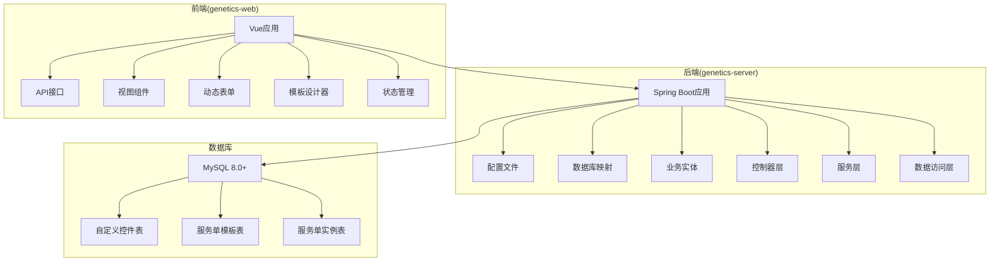
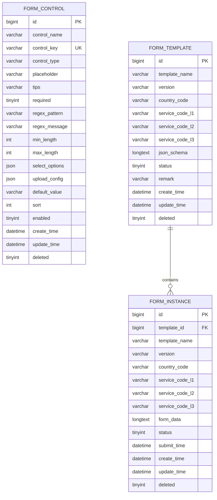
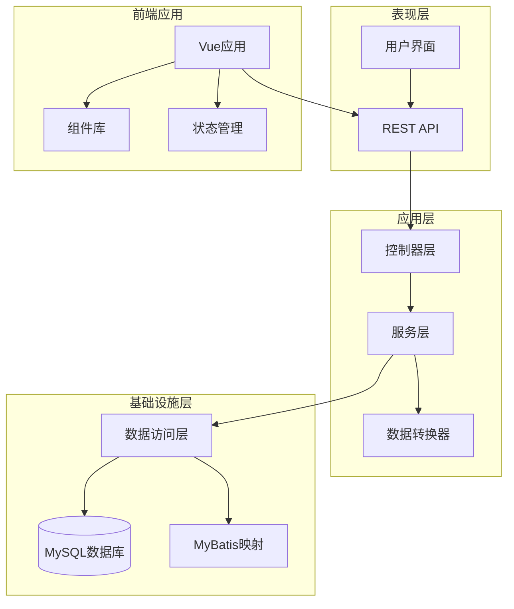
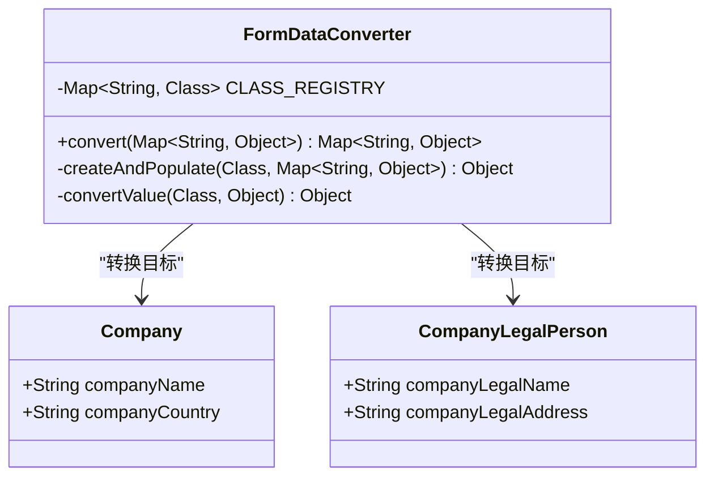
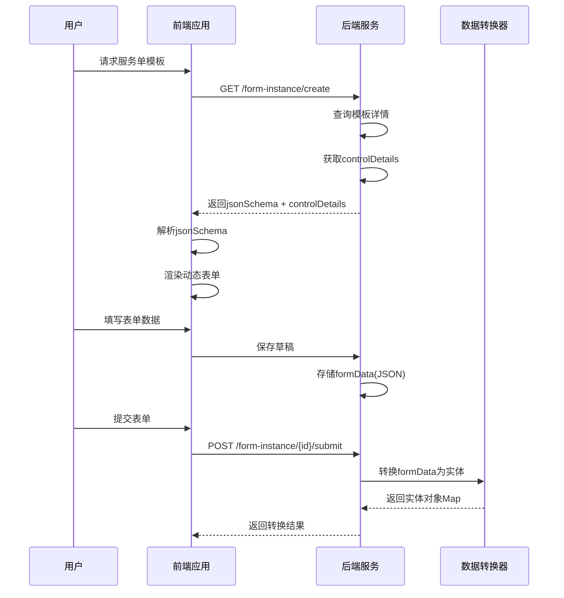
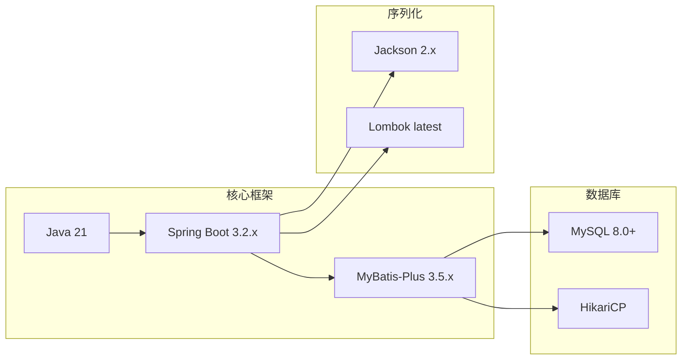
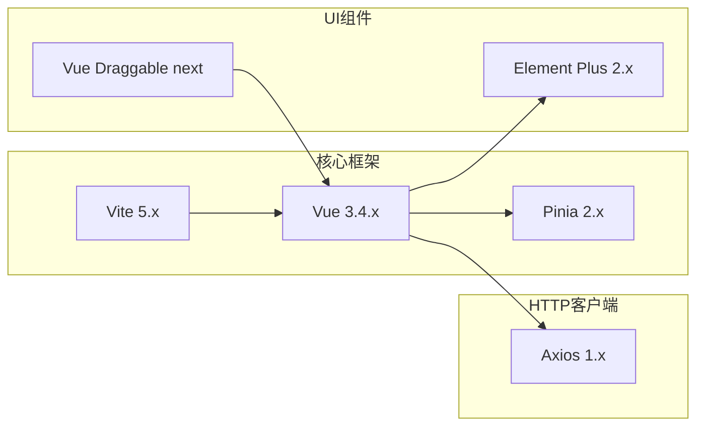
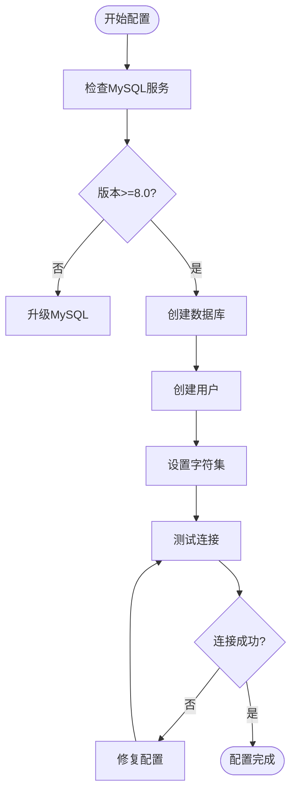

# 开发环境搭建

<cite>
**本文档引用的文件**
- [VAT_EPR_动态表单技术方案.md](file://VAT_EPR_动态表单技术方案.md)
</cite>

## 目录
1. [简介](#简介)
2. [项目结构](#项目结构)
3. [核心组件](#核心组件)
4. [架构概览](#架构概览)
5. [详细组件分析](#详细组件分析)
6. [依赖分析](#依赖分析)
7. [性能考虑](#性能考虑)
8. [故障排除指南](#故障排除指南)
9. [结论](#结论)

## 简介

VAT&EPR动态表单系统是一个基于现代技术栈的企业级应用，支持增值税(VAT)和环境产品税(EPR)服务单的动态表单设计与管理。该系统采用前后端分离架构，后端使用Spring Boot 3.2.x + Java 21，前端使用Vue 3.4.x + Vite 5.x，数据库采用MySQL 8.0+。

本指南将详细介绍完整的开发环境搭建过程，包括Java 21和Node.js的安装配置、Spring Boot和Vue项目的初始化步骤、MySQL数据库的安装配置，以及IDE的配置要求。

## 项目结构

根据技术方案文档，该项目采用标准的前后端分离架构：

**图表来源**
- [VAT_EPR_动态表单技术方案.md: 773-852:773-852](file://VAT_EPR_动态表单技术方案.md#L773-L852)

**章节来源**
- [VAT_EPR_动态表单技术方案.md: 773-852:773-852](file://VAT_EPR_动态表单技术方案.md#L773-L852)

## 核心组件

### 技术栈概览

| 技术类别 | 技术名称 | 版本要求 | 用途 |
|---------|----------|----------|------|
| 服务端 | Spring Boot | 3.2.x | 主框架 |
| 服务端 | Java | 21 | 运行环境 |
| 服务端 | MySQL | 8.0+ | 关系型数据库 |
| 服务端 | MyBatis-Plus | 3.5.x | ORM框架 |
| 服务端 | Jackson | 2.x | JSON序列化 |
| 服务端 | Lombok | latest | 代码简化 |
| 前端 | Vue | 3.4.x | 主框架 |
| 前端 | Vite | 5.x | 构建工具 |
| 前端 | Element Plus | 2.x | UI组件库 |
| 前端 | Vue Draggable | next | 拖拽排序 |
| 前端 | Pinia | 2.x | 状态管理 |
| 前端 | Axios | 1.x | HTTP客户端 |

### 数据库设计

系统包含三个核心数据表：

**图表来源**
- [VAT_EPR_动态表单技术方案.md: 33-153:33-153](file://VAT_EPR_动态表单技术方案.md#L33-L153)

**章节来源**
- [VAT_EPR_动态表单技术方案.md: 9-28:9-28](file://VAT_EPR_动态表单技术方案.md#L9-L28)
- [VAT_EPR_动态表单技术方案.md: 31-153:31-153](file://VAT_EPR_动态表单技术方案.md#L31-L153)

## 架构概览

系统采用分层架构设计，实现了清晰的职责分离：

**图表来源**
- [VAT_EPR_动态表单技术方案.md: 592-728:592-728](file://VAT_EPR_动态表单技术方案.md#L592-L728)

## 详细组件分析

### FormDataConverter核心组件

FormDataConverter是系统的核心组件，负责将动态表单数据转换为对应的业务实体对象：

**图表来源**
- [VAT_EPR_动态表单技术方案.md: 594-684:594-684](file://VAT_EPR_动态表单技术方案.md#L594-L684)

### 动态表单渲染机制

系统采用JSON Schema驱动的动态表单渲染机制：

**图表来源**
- [VAT_EPR_动态表单技术方案.md: 437-478:437-478](file://VAT_EPR_动态表单技术方案.md#L437-L478)

**章节来源**
- [VAT_EPR_动态表单技术方案.md: 592-728:592-728](file://VAT_EPR_动态表单技术方案.md#L592-L728)

## 依赖分析

### 后端依赖关系

### 前端依赖关系

**图表来源**
- [VAT_EPR_动态表单技术方案.md: 9-28:9-28](file://VAT_EPR_动态表单技术方案.md#L9-L28)

**章节来源**
- [VAT_EPR_动态表单技术方案.md: 9-28:9-28](file://VAT_EPR_动态表单技术方案.md#L9-L28)

## 性能考虑

### 数据库性能优化

1. **索引设计**：表设计中包含了适当的索引策略，如`uk_control_key`唯一索引和`idx_template_id`索引
2. **字符集选择**：使用utf8mb4字符集支持完整的Unicode字符
3. **数据类型优化**：合理使用数据类型减少存储空间

### 应用性能优化

1. **连接池配置**：使用HikariCP作为数据库连接池
2. **缓存策略**：前端使用Pinia进行状态管理，后端可考虑Redis缓存
3. **异步处理**：对于耗时操作采用异步处理机制

## 故障排除指南

### 常见环境问题及解决方案

#### Java 21安装问题
- **问题**：Java版本不兼容
- **解决方案**：确保安装Java 21，检查JAVA_HOME环境变量配置

#### MySQL连接问题
- **问题**：无法连接到MySQL数据库
- **解决方案**：
  1. 检查MySQL服务状态
  2. 验证数据库连接参数
  3. 确认用户权限设置

#### Node.js依赖安装失败
- **问题**：npm install执行失败
- **解决方案**：
  1. 清理npm缓存
  2. 使用yarn替代npm
  3. 检查网络连接

#### Spring Boot启动失败
- **问题**：应用启动时报错
- **解决方案**：
  1. 检查application.yml配置
  2. 验证数据库连接
  3. 确认端口未被占用

### 数据库配置验证

**章节来源**
- [VAT_EPR_动态表单技术方案.md: 856-869:856-869](file://VAT_EPR_动态表单技术方案.md#L856-L869)

## 结论

VAT&EPR动态表单系统采用现代化的技术栈构建，具有良好的可扩展性和维护性。通过遵循本指南的开发环境搭建步骤，开发者可以快速建立完整的开发环境。

关键要点包括：
- 确保Java 21和Node.js的正确安装配置
- 按照技术栈要求初始化Spring Boot和Vue项目
- 正确配置MySQL数据库和字符集
- 在IDE中安装必要的插件和配置代码格式化
- 遵循项目结构和最佳实践

该系统的设计充分考虑了动态表单的复杂需求，通过JSON Schema驱动的渲染机制和灵活的数据转换器，能够满足各种业务场景下的表单设计和数据处理需求。