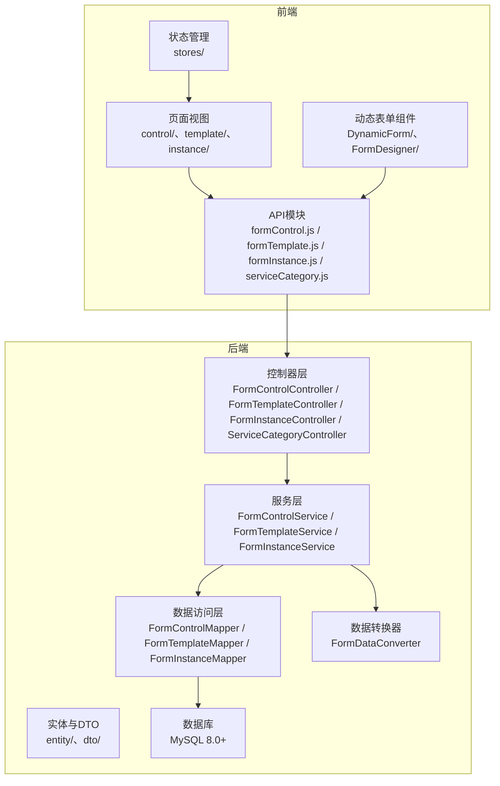
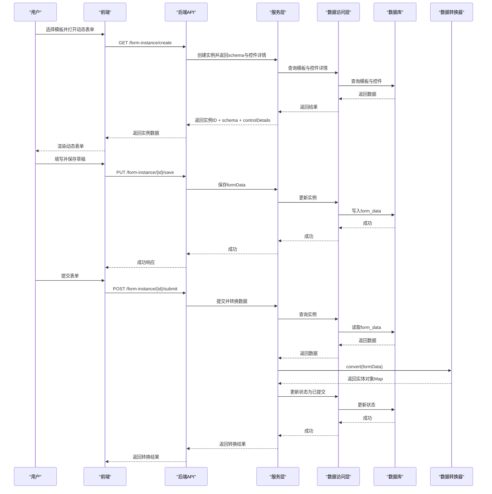
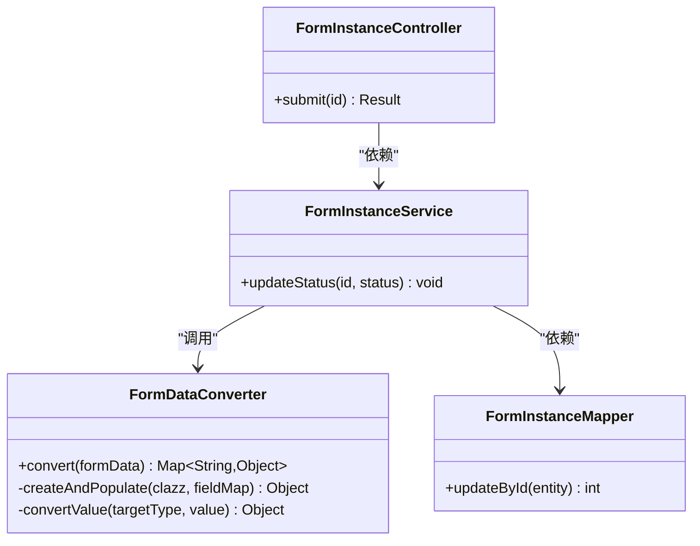

# 测试策略与实施

<cite>
**本文引用的文件**
- [VAT_EPR_动态表单技术方案.md](file://VAT_EPR_动态表单技术方案.md)
</cite>

## 目录
1. [简介](#简介)
2. [项目结构](#项目结构)
3. [核心组件](#核心组件)
4. [架构总览](#架构总览)
5. [详细组件分析](#详细组件分析)
6. [依赖关系分析](#依赖关系分析)
7. [性能考虑](#性能考虑)
8. [故障排查指南](#故障排查指南)
9. [结论](#结论)
10. [附录](#附录)

## 简介
本文件面向VAT&EPR动态表单系统，围绕“单元测试、集成测试、前端组件测试、端到端测试”构建全面的测试策略与实施指南，并补充测试数据管理、测试环境配置与持续集成中的测试执行策略，以及性能测试、安全测试与兼容性测试的实施方案。文档基于仓库提供的技术方案，结合Spring Boot（Java 21）、MyBatis-Plus、Vue 3（Vite）、Element Plus等技术栈，给出可落地的测试实践路径。

## 项目结构
系统采用前后端分离架构：
- 后端：Spring Boot + MyBatis-Plus，提供REST API，负责表单控件、模板、实例与数据转换等核心业务。
- 前端：Vue 3 + Vite + Element Plus，提供动态表单渲染、模板设计器、服务类目联动等功能。

图表来源
- [VAT_EPR_动态表单技术方案.md:773-852](file://VAT_EPR_动态表单技术方案.md#L773-L852)

章节来源
- [VAT_EPR_动态表单技术方案.md:773-852](file://VAT_EPR_动态表单技术方案.md#L773-L852)

## 核心组件
- 数据转换器：将前端提交的Map<controlKey, value>按类名分组并通过反射转换为业务实体对象，是表单提交的关键环节。
- 控制器层：暴露REST API，处理控件、模板、实例与服务类目的增删改查与状态流转。
- 服务层：封装业务逻辑，协调数据访问与转换器。
- 数据访问层：基于MyBatis-Plus访问MySQL，提供CRUD能力。
- 前端动态表单：根据json_schema与controlDetails动态渲染控件，支持多种输入类型与校验规则。

章节来源
- [VAT_EPR_动态表单技术方案.md:592-728](file://VAT_EPR_动态表单技术方案.md#L592-L728)
- [VAT_EPR_动态表单技术方案.md:773-852](file://VAT_EPR_动态表单技术方案.md#L773-L852)

## 架构总览
系统遵循分层架构，前后端通过HTTP协议交互，后端内部通过控制器-服务-数据访问-数据库的层次化设计实现职责分离。动态表单的核心在于“数据模型与UI渲染解耦”，通过json_schema与controlDetails实现灵活布局与控件渲染。

图表来源
- [VAT_EPR_动态表单技术方案.md:437-478](file://VAT_EPR_动态表单技术方案.md#L437-L478)
- [VAT_EPR_动态表单技术方案.md:705-728](file://VAT_EPR_动态表单技术方案.md#L705-L728)

## 详细组件分析

### 单元测试策略（JUnit 5 + Mockito）
- 测试范围
  - 数据转换器：验证convert方法对不同类型的controlKey分组、反射赋值与异常分支。
  - 服务层：对业务逻辑进行隔离测试，使用Mockito模拟Mapper与外部依赖。
  - 控制器层：对API行为进行断言，确保响应码、响应体结构与业务状态正确。
- 编写规范
  - 使用JUnit 5参数化测试覆盖典型与边界输入。
  - 使用Mockito对Mapper与Converter进行桩/模拟，避免真实数据库访问。
  - 断言策略：优先断言响应体结构与业务状态，其次断言日志级别与异常传播。
- 复杂度与性能
  - 单元测试应快速、稳定，避免I/O与网络依赖，确保高频回归效率。

章节来源
- [VAT_EPR_动态表单技术方案.md:592-728](file://VAT_EPR_动态表单技术方案.md#L592-L728)

### 集成测试策略（API接口测试 + 数据库测试）
- 接口测试
  - 使用REST Assured或Spring Boot Test的WebTestClient发起HTTP请求，覆盖控件、模板、实例与服务类目API。
  - 场景包括：创建控件并校验唯一性约束、保存模板并查询详情、创建实例并保存草稿、提交实例并验证转换结果。
- 数据库测试
  - 使用Testcontainers启动MySQL容器，或使用嵌入式数据库（H2）进行隔离测试。
  - 验证数据一致性：controlKey唯一性、form_data序列化、状态流转与并发控制。
- 测试数据管理
  - 使用SQL脚本初始化基础数据（如国家代码、服务类目），在测试前清理与重置。
  - 对敏感字段进行脱敏处理，避免泄露。

章节来源
- [VAT_EPR_动态表单技术方案.md:167-396](file://VAT_EPR_动态表单技术方案.md#L167-L396)
- [VAT_EPR_动态表单技术方案.md:31-163](file://VAT_EPR_动态表单技术方案.md#L31-L163)

### 前端组件测试最佳实践（Vue Test Utils）
- 组件测试
  - 动态表单主组件：验证根据json_schema渲染网格布局、控件类型映射与v-model绑定。
  - 控件渲染器：验证Input/Select/Switch/Upload/Textarea/Date/Number等控件的属性与事件。
  - 表单设计器：验证拖拽、布局配置与模板保存流程。
- 快照测试
  - 对渲染后的DOM进行快照对比，确保UI变更受控。
- 交互测试
  - 使用用户事件模拟（输入、点击、拖拽），断言状态变化与API调用。
- 状态管理
  - 使用Pinia的测试替身，断言store的actions与mutations行为。

章节来源
- [VAT_EPR_动态表单技术方案.md:815-852](file://VAT_EPR_动态表单技术方案.md#L815-L852)

### 端到端测试流程（Cypress/Playwright）
- 用户场景
  - 管理员：新建控件、设计模板、发布模板。
  - 操作员：选择模板、填写动态表单、保存草稿、提交表单。
- 测试流程
  - 启动应用与后端服务（可使用Docker Compose或本地进程）。
  - 使用Cypress/Playwright录制并回放用户操作，断言页面元素、API响应与数据库状态。
- 环境隔离
  - 使用独立的测试数据库与测试账号，避免污染生产数据。

章节来源
- [VAT_EPR_动态表单技术方案.md:437-478](file://VAT_EPR_动态表单技术方案.md#L437-L478)

### 测试数据管理与环境配置
- 测试数据
  - 初始化脚本：国家代码、服务类目、基础控件与模板。
  - 敏感字段脱敏：对测试数据中的敏感字段进行替换或屏蔽。
- 环境配置
  - 开发/测试/预发/生产环境的数据库连接、日志级别与第三方服务地址。
  - CI中使用环境变量注入，避免硬编码。

章节来源
- [VAT_EPR_动态表单技术方案.md:732-770](file://VAT_EPR_动态表单技术方案.md#L732-L770)
- [VAT_EPR_动态表单技术方案.md:856-869](file://VAT_EPR_动态表单技术方案.md#L856-L869)

### 持续集成中的测试执行策略
- 分层执行
  - PR检查：运行单元测试与静态分析。
  - 集成检查：运行集成测试与数据库一致性检查。
  - 部署前：运行端到端测试与安全扫描。
- 并行化
  - 将测试任务拆分为多个Job并行执行，缩短流水线时间。
- 报告与归档
  - 生成测试报告与覆盖率报告，归档Artifacts供审计。

章节来源
- [VAT_EPR_动态表单技术方案.md:773-852](file://VAT_EPR_动态表单技术方案.md#L773-L852)

### 性能测试实施方案
- 接口压力测试
  - 使用JMeter或Gatling对关键API（创建/保存/提交）施压，观察响应时间与错误率。
- 前端渲染性能
  - 使用Lighthouse或WebPageTest评估动态表单渲染性能，关注首屏时间与交互延迟。
- 数据库优化
  - 针对高频查询（模板列表、控件列表）添加索引与缓存策略。

章节来源
- [VAT_EPR_动态表单技术方案.md:167-396](file://VAT_EPR_动态表单技术方案.md#L167-L396)
- [VAT_EPR_动态表单技术方案.md:31-163](file://VAT_EPR_动态表单技术方案.md#L31-L163)

### 安全测试实施方案
- 输入校验与注入防护
  - 对controlKey格式与长度进行严格校验，避免路径遍历与命令注入。
- 权限与会话
  - 对API进行鉴权与授权测试，确保未授权访问被拒绝。
- 数据加密与传输
  - 对敏感字段进行加密存储与HTTPS传输，避免明文泄露。

章节来源
- [VAT_EPR_动态表单技术方案.md:856-869](file://VAT_EPR_动态表单技术方案.md#L856-L869)

### 兼容性测试实施方案
- 浏览器兼容性
  - 在主流浏览器（Chrome、Firefox、Safari、Edge）上验证动态表单渲染与交互。
- 移动端适配
  - 使用设备模拟或真机测试，验证移动端布局与触摸交互。
- 后端兼容性
  - 在不同JDK版本（Java 21）与MySQL版本（8.0+）下验证功能与性能。

章节来源
- [VAT_EPR_动态表单技术方案.md:7-28](file://VAT_EPR_动态表单技术方案.md#L7-L28)

## 依赖关系分析
- 控制器依赖服务层，服务层依赖数据访问层与转换器。
- 前端通过Axios调用后端API，动态表单组件依赖Element Plus与状态管理。
- 数据转换器依赖实体类注册表，需与业务实体扩展保持同步。

图表来源
- [VAT_EPR_动态表单技术方案.md:592-728](file://VAT_EPR_动态表单技术方案.md#L592-L728)

章节来源
- [VAT_EPR_动态表单技术方案.md:592-728](file://VAT_EPR_动态表单技术方案.md#L592-L728)

## 性能考虑
- 单元测试：避免I/O与网络，使用Mock提升执行速度。
- 集成测试：合理设置数据库事务与回滚点，减少重复初始化成本。
- 前端测试：使用虚拟DOM与轻量级渲染，避免真实网络请求。
- 端到端测试：复用浏览器上下文，减少冷启动时间。

## 故障排查指南
- 提交失败
  - 检查controlKey格式与唯一性，确认实体类已在转换器注册。
  - 核对form_data序列化与反序列化过程，确保字段类型匹配。
- 并发冲突
  - 检查乐观锁字段与版本号更新逻辑，避免覆盖问题。
- 数据不一致
  - 校验模板发布后的版本管理策略，避免历史实例数据错乱。

章节来源
- [VAT_EPR_动态表单技术方案.md:856-869](file://VAT_EPR_动态表单技术方案.md#L856-L869)

## 结论
通过分层测试策略与自动化执行，VAT&EPR动态表单系统可在开发周期内持续交付高质量功能。建议优先完善单元测试与集成测试，再逐步引入端到端测试与专项测试（性能、安全、兼容性），并在CI中形成闭环，保障系统稳定性与可维护性。

## 附录
- 测试清单
  - 单元测试：数据转换器、服务层、控制器层。
  - 集成测试：控件/模板/实例/类目API、数据库一致性。
  - 前端测试：动态表单组件、设计器、快照与交互。
  - 端到端测试：管理员与操作员全流程。
  - 性能/安全/兼容性：专项验证与回归。