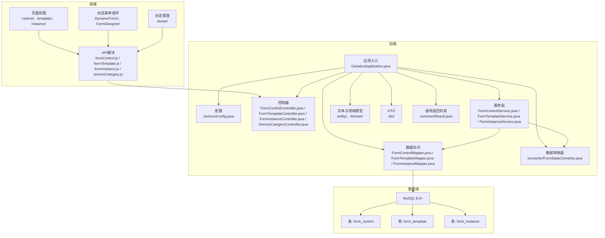
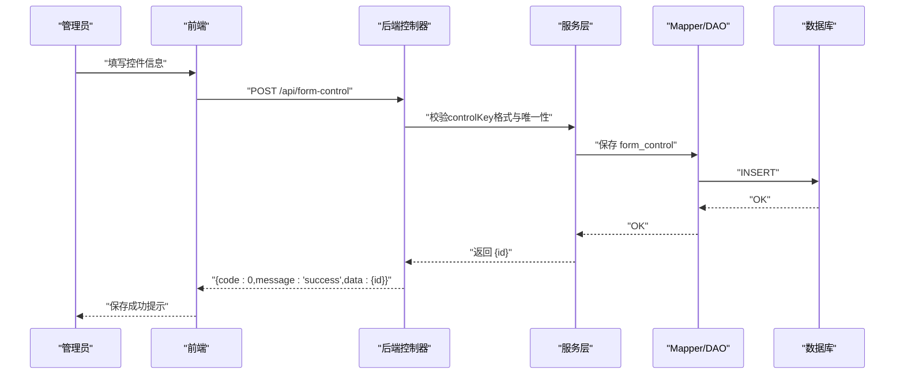
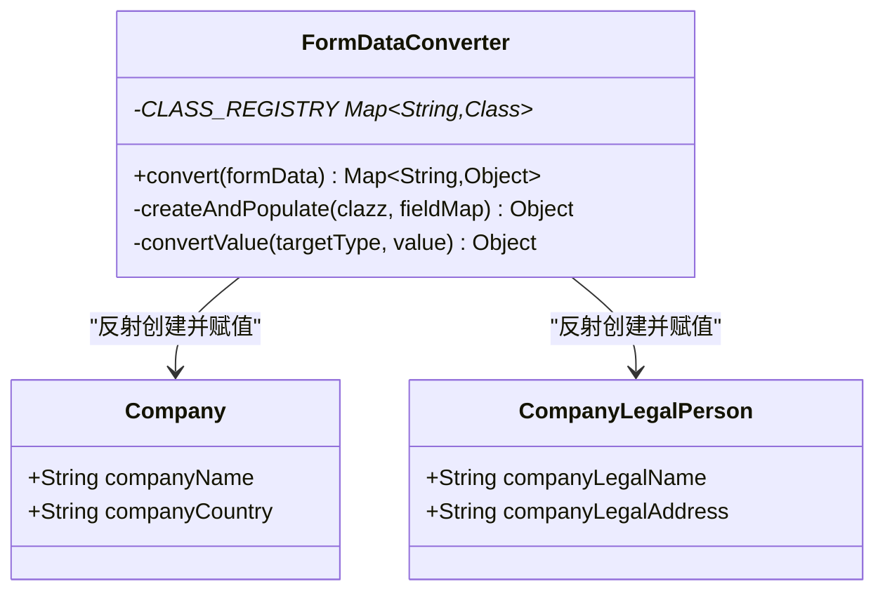
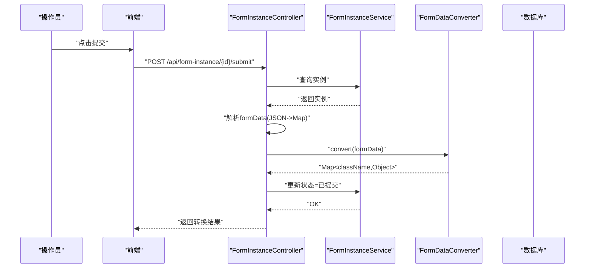
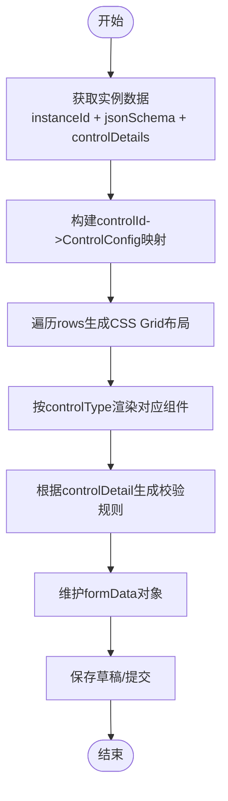
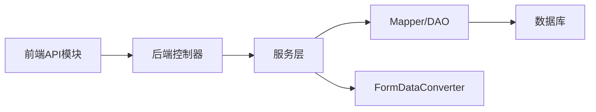

# 调试技巧与问题排查

<cite>
**本文引用的文件**
- [VAT_EPR_动态表单技术方案.md](file://VAT_EPR_动态表单技术方案.md)
</cite>

## 目录
1. [简介](#简介)
2. [项目结构](#项目结构)
3. [核心组件](#核心组件)
4. [架构总览](#架构总览)
5. [详细组件分析](#详细组件分析)
6. [依赖关系分析](#依赖关系分析)
7. [性能考虑](#性能考虑)
8. [故障排查指南](#故障排查指南)
9. [结论](#结论)
10. [附录](#附录)

## 简介
本指南面向VAT& EPR动态表单系统的开发与运维人员，聚焦于后端日志分析、前端调试工具使用、常见问题诊断流程、数据库慢查询优化、性能瓶颈识别与内存泄漏排查，以及生产环境应急处理与监控告警配置。内容基于仓库中的技术方案文档进行提炼与扩展，帮助快速定位问题并恢复系统稳定运行。

## 项目结构
系统采用前后端分离架构：
- 后端：Spring Boot 3.2.x + MyBatis-Plus + Jackson + Lombok
- 前端：Vue 3.4.x + Vite + Element Plus + Vue Draggable + Pinia + Axios
- 数据库：MySQL 8.0+

图表来源
- [VAT_EPR_动态表单技术方案.md: 773-869:773-869](file://VAT_EPR_动态表单技术方案.md#L773-L869)

章节来源
- [VAT_EPR_动态表单技术方案.md: 773-869:773-869](file://VAT_EPR_动态表单技术方案.md#L773-L869)

## 核心组件
- 表单数据转换器：负责将前端提交的Map<controlKey, value>按类名分组并通过反射转换为业务实体对象，输出Map<className, Object>。
- 控制器与服务层：提供控件、模板、实例与服务类目的REST接口，支撑动态表单的创建、渲染、保存与提交。
- 前端动态表单：根据json_schema与controlDetails动态渲染控件，并维护formData对象，支持多种控件类型与校验规则。
- 数据库表：form_control、form_template、form_instance，分别承载控件定义、模板布局与实例数据。

章节来源
- [VAT_EPR_动态表单技术方案.md: 592-728:592-728](file://VAT_EPR_动态表单技术方案.md#L592-L728)
- [VAT_EPR_动态表单技术方案.md: 773-869:773-869](file://VAT_EPR_动态表单技术方案.md#L773-L869)

## 架构总览
系统的关键交互路径包括：
- 控件管理：管理员在前端填写控件信息，后端校验controlKey格式与唯一性后持久化。
- 模板设计：前端从后端获取控件列表，拖拽到画板生成json_schema，保存模板。
- 实例创建与填写：前端根据模板返回的json_schema与controlDetails渲染表单，用户填写后保存草稿或提交。
- 提交转换：后端解析formData，调用FormDataConverter进行对象转换并打印转换结果日志。

图表来源
- [VAT_EPR_动态表单技术方案.md: 401-414:401-414](file://VAT_EPR_动态表单技术方案.md#L401-L414)

章节来源
- [VAT_EPR_动态表单技术方案.md: 401-414:401-414](file://VAT_EPR_动态表单技术方案.md#L401-L414)

## 详细组件分析

### 表单数据转换器（FormDataConverter）
该组件是后端的核心，负责将前端提交的扁平化键值对转换为多实体对象映射。其关键行为包括：
- 按“类名”分组：依据controlKey的“ClassName.fieldName”格式拆分，按类名聚合字段。
- 反射赋值：通过类注册表查找目标类，使用反射为目标对象的字段赋值。
- 类型转换：针对字符串输入执行基础类型转换（整数、长整型、布尔、BigDecimal等）。
- 日志输出：对每个转换成功的类输出日志，便于审计与排障。

图表来源
- [VAT_EPR_动态表单技术方案.md: 594-684:594-684](file://VAT_EPR_动态表单技术方案.md#L594-L684)
- [VAT_EPR_动态表单技术方案.md: 687-703:687-703](file://VAT_EPR_动态表单技术方案.md#L687-L703)

章节来源
- [VAT_EPR_动态表单技术方案.md: 594-684:594-684](file://VAT_EPR_动态表单技术方案.md#L594-L684)
- [VAT_EPR_动态表单技术方案.md: 687-703:687-703](file://VAT_EPR_动态表单技术方案.md#L687-L703)

### 提交流程与日志
提交接口的典型流程如下：
- 获取实例并解析formData为Map。
- 调用FormDataConverter进行对象转换。
- 输出转换结果日志。
- 更新实例状态为“已提交”。

图表来源
- [VAT_EPR_动态表单技术方案.md: 705-728:705-728](file://VAT_EPR_动态表单技术方案.md#L705-L728)

章节来源
- [VAT_EPR_动态表单技术方案.md: 705-728:705-728](file://VAT_EPR_动态表单技术方案.md#L705-L728)

### 前端动态表单渲染
前端根据json_schema与controlDetails动态渲染控件，支持多种控件类型与校验规则，并维护formData对象用于保存与提交。

图表来源
- [VAT_EPR_动态表单技术方案.md: 531-578:531-578](file://VAT_EPR_动态表单技术方案.md#L531-L578)

章节来源
- [VAT_EPR_动态表单技术方案.md: 531-578:531-578](file://VAT_EPR_动态表单技术方案.md#L531-L578)

## 依赖关系分析
- 控制器依赖服务层，服务层依赖Mapper与实体/领域模型。
- 表单数据转换器作为独立组件被控制器调用。
- 前端API模块统一调用后端控制器，页面视图与组件通过状态管理协调。

图表来源
- [VAT_EPR_动态表单技术方案.md: 773-869:773-869](file://VAT_EPR_动态表单技术方案.md#L773-L869)

章节来源
- [VAT_EPR_动态表单技术方案.md: 773-869:773-869](file://VAT_EPR_动态表单技术方案.md#L773-L869)

## 性能考虑
- 日志级别与采样：在高并发场景下，建议将转换器的日志级别调整为INFO或WARN，避免过多DEBUG日志造成I/O压力；必要时对高频转换结果进行采样输出。
- 反射性能：反射创建与字段赋值在大批量字段时可能成为瓶颈，建议：
  - 缓存类与字段元数据（Class/Field缓存）。
  - 使用构造器工厂或字节码生成（如ASM）替代反射以提升性能。
- JSON序列化：Jackson在复杂对象上序列化成本较高，建议：
  - 对超大对象采用流式序列化。
  - 合理裁剪响应字段，避免传输不必要的数据。
- 数据库查询：合理使用索引与分页，避免一次性加载大量数据；对频繁查询的字段建立合适索引。
- 前端渲染：对于超大表单，建议虚拟滚动与懒渲染，减少DOM节点数量。

## 故障排查指南

### 后端日志分析与异常堆栈跟踪
- Spring Boot日志配置要点
  - 日志级别：将FormDataConverter与核心服务层的日志级别设为INFO/WARN，必要时临时提升至DEBUG以采集转换细节。
  - 日志输出：确保控制台与文件输出开启，生产环境建议使用异步日志（如Logback异步Appender）降低阻塞。
  - 异常堆栈：关注转换器中的异常抛出点，尤其是反射创建与字段赋值阶段，异常堆栈有助于定位字段缺失或类型不匹配问题。
- 关键日志位置
  - 控制器提交接口：输出转换结果日志，便于核对转换是否符合预期。
  - 转换器：对无效controlKey、未注册类、字段不存在等情况输出警告日志。
- 排查步骤
  - 复现问题并收集请求ID/Trace ID，结合日志时间戳定位相关日志片段。
  - 检查controlKey格式与唯一性是否满足要求。
  - 核对实体类注册表是否包含目标类，避免“未注册类”的警告。
  - 检查字段类型与输入值是否匹配，必要时在转换器中增加更详细的类型转换日志。

章节来源
- [VAT_EPR_动态表单技术方案.md: 594-684:594-684](file://VAT_EPR_动态表单技术方案.md#L594-L684)
- [VAT_EPR_动态表单技术方案.md: 705-728:705-728](file://VAT_EPR_动态表单技术方案.md#L705-L728)

### 前端调试工具使用
- 浏览器开发者工具
  - Elements：检查动态表单渲染的DOM结构，确认网格布局与控件是否正确挂载。
  - Network：监控API请求与响应，观察请求参数、响应体与状态码，定位接口异常。
  - Console：查看运行时错误与警告，结合断点定位逻辑问题。
  - Performance：分析页面渲染与事件处理耗时，识别卡顿原因。
- Vue DevTools
  - 组件树：查看DynamicForm与各控件组件的层级关系与props传递。
  - 状态：检查Pinia中的formData与designer状态，确认数据一致性。
  - 时间线：观察组件生命周期与状态变化，定位渲染异常时机。
- 网络请求监控
  - 记录关键接口：控件列表、模板详情、实例创建、保存草稿、提交。
  - 关注超时与重试：对慢请求进行重试策略与降级处理。
  - 参数校验：确保controlKey与formData结构与后端约定一致。

章节来源
- [VAT_EPR_动态表单技术方案.md: 531-578:531-578](file://VAT_EPR_动态表单技术方案.md#L531-L578)
- [VAT_EPR_动态表单技术方案.md: 815-852:815-852](file://VAT_EPR_动态表单技术方案.md#L815-L852)

### 常见问题诊断流程
- 表单渲染异常
  - 症状：控件不显示、布局错乱、校验规则不生效。
  - 诊断：检查json_schema结构与controlDetails是否完整；确认controlType与对应组件是否正确映射；核对controlKey是否存在于controlDetails。
  - 处理：修复模板schema或controlDetails；确保前端控件分发逻辑与后端一致。
- 数据转换错误
  - 症状：提交后出现“字段不存在”“类型不匹配”“未注册类”等警告或异常。
  - 诊断：检查controlKey格式与唯一性；确认实体类已在转换器注册表中；核对字段类型与输入值。
  - 处理：修正controlKey命名规范；补充实体类注册；在转换器中增加类型转换日志。
- API接口问题
  - 症状：接口报错、响应超时、状态码异常。
  - 诊断：使用浏览器Network面板与后端日志交叉验证；检查请求参数与响应体；定位异常堆栈。
  - 处理：修复参数校验与异常处理；优化数据库查询与序列化性能。

章节来源
- [VAT_EPR_动态表单技术方案.md: 531-578:531-578](file://VAT_EPR_动态表单技术方案.md#L531-L578)
- [VAT_EPR_动态表单技术方案.md: 594-684:594-684](file://VAT_EPR_动态表单技术方案.md#L594-L684)
- [VAT_EPR_动态表单技术方案.md: 705-728:705-728](file://VAT_EPR_动态表单技术方案.md#L705-L728)

### 数据库查询优化与慢查询分析
- 索引优化
  - form_control：唯一索引uk_control_key，确保controlKey唯一性与快速检索。
  - form_template：按国家代码、服务编码与状态建立复合索引，加速筛选。
  - form_instance：按template_id建立索引，支持模板实例查询。
- 分页与批量
  - 列表查询使用分页参数，避免一次性加载过多数据。
  - 批量插入/更新时使用事务与批量提交，减少往返次数。
- 慢查询定位
  - 使用EXPLAIN分析SQL执行计划，识别全表扫描与索引失效。
  - 结合慢查询日志与数据库性能监控，定位热点表与慢SQL。
- 建议
  - 对高频查询字段建立合适索引；定期分析索引使用情况。
  - 避免SELECT *，仅查询必要字段；对大字段采用延迟加载。

章节来源
- [VAT_EPR_动态表单技术方案.md: 31-163:31-163](file://VAT_EPR_动态表单技术方案.md#L31-L163)

### 性能瓶颈识别与内存泄漏排查
- 后端
  - JVM监控：使用JVM自带工具或APM（如Micrometer+Prometheus/Grafana）观察GC频率、堆内存与线程池状态。
  - 反射与序列化：对反射创建与JSON序列化进行热点分析，必要时引入缓存与字节码优化。
  - 并发控制：对同一实例的保存操作使用乐观锁，避免并发覆盖。
- 前端
  - 内存泄漏排查：使用浏览器性能面板与内存快照，检查组件卸载后是否仍有引用；避免全局事件监听未清理。
  - 渲染优化：对超大表单采用虚拟滚动与懒渲染，减少DOM节点数量。
- 通用建议
  - 对高频接口进行压测，识别瓶颈点；对慢接口实施缓存与限流。

章节来源
- [VAT_EPR_动态表单技术方案.md: 856-869:856-869](file://VAT_EPR_动态表单技术方案.md#L856-L869)

### 生产环境应急处理与监控告警
- 应急处理流程
  - 快速隔离：发现异常后立即暂停相关接口或功能开关，避免影响扩大。
  - 降级策略：对非关键接口降级或返回兜底数据；对数据库查询进行缓存降级。
  - 回滚与热修复：对最近变更进行回滚或紧急修复，优先保障核心功能可用。
- 监控告警
  - 关键指标：接口响应时间、错误率、数据库慢查询、JVM GC与堆内存、线程池饱和度。
  - 告警阈值：根据SLA设定阈值，区分严重、警告与通知级别；对突发异常设置熔断与自动降级。
  - 日志与追踪：统一日志格式与请求追踪ID，便于跨服务串联定位问题。

## 结论
本指南围绕VAT& EPR动态表单系统的关键组件与交互路径，提供了后端日志分析、前端调试工具使用、常见问题诊断、数据库优化、性能与内存排查以及生产应急处理的系统化方法。建议在日常开发与运维中持续完善监控体系与告警机制，结合本文提供的流程与技巧，快速定位并解决问题，保障系统稳定运行。

## 附录
- 关键约束与注意事项
  - controlKey唯一性与格式校验。
  - 模板发布后的版本管理策略。
  - 实体类注册与反射转换的边界条件。
  - 文件上传与数据安全、并发控制与状态机约束。

章节来源
- [VAT_EPR_动态表单技术方案.md: 856-869:856-869](file://VAT_EPR_动态表单技术方案.md#L856-L869)