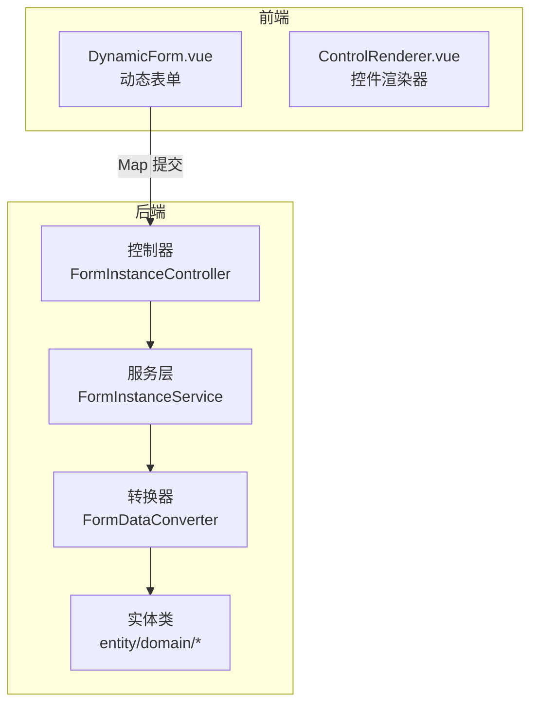
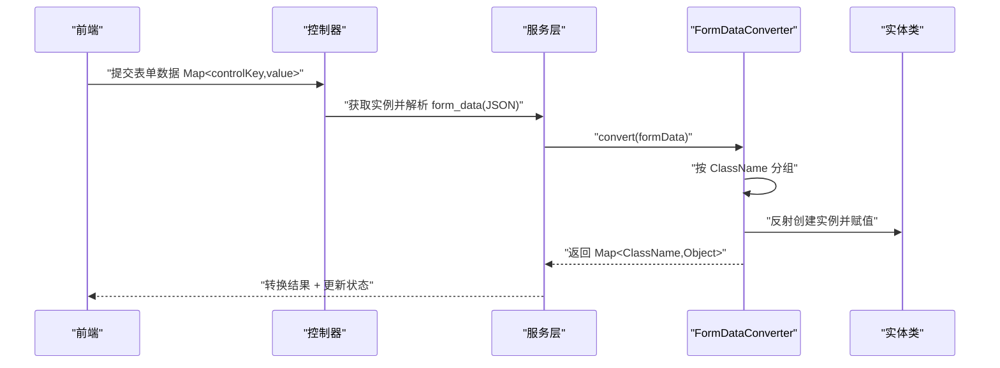
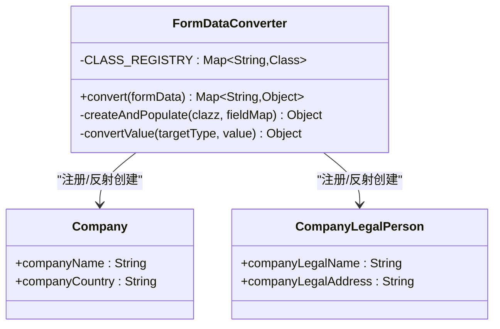
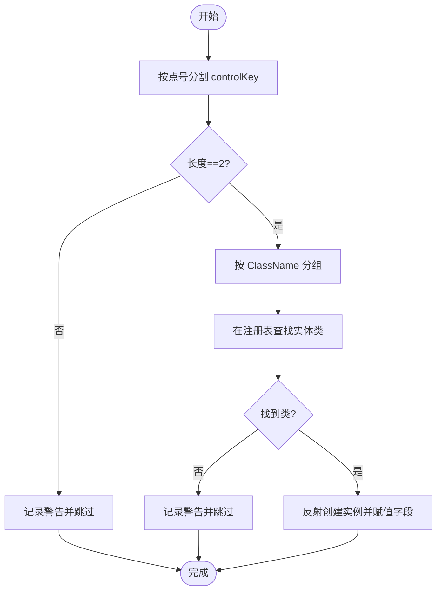
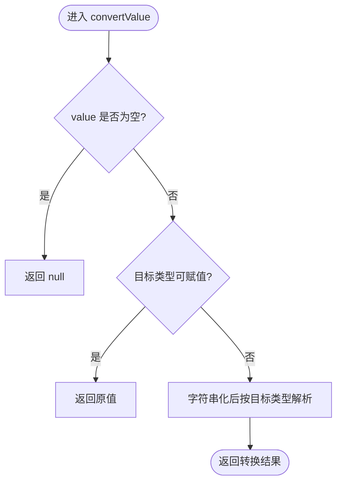
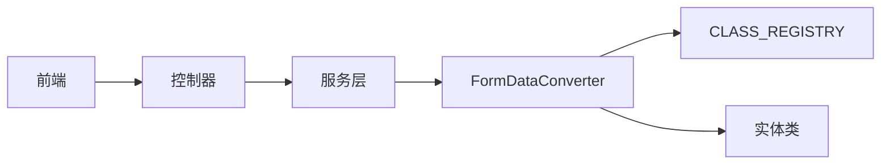

# 业务实体扩展

<cite>
**本文引用的文件**
- [VAT_EPR_动态表单技术方案.md](file://VAT_EPR_动态表单技术方案.md)
</cite>

## 目录
1. [简介](#简介)
2. [项目结构](#项目结构)
3. [核心组件](#核心组件)
4. [架构总览](#架构总览)
5. [详细组件分析](#详细组件分析)
6. [依赖关系分析](#依赖关系分析)
7. [性能考量](#性能考量)
8. [故障排查指南](#故障排查指南)
9. [结论](#结论)
10. [附录](#附录)

## 简介
本文件面向业务实体扩展开发，围绕动态表单系统中的“表单数据转换器”（FormDataConverter）展开，系统性阐述以下主题：
- controlKey 格式规范（ClassName.fieldName）
- 实体类注册流程与扩展机制
- 反射赋值原理与类型转换逻辑
- 新业务实体类的创建步骤、字段映射规则
- 复杂业务实体的嵌套处理、集合类型支持与验证规则集成
- 实体扩展的限制条件、性能考虑与调试技巧

## 项目结构
后端采用标准 Spring Boot 结构，动态表单的核心位于 converter 包与 entity/domain 下的业务实体类。前端通过动态渲染控件，将用户输入以 Map<controlKey, value> 的形式提交至后端，后端再由 FormDataConverter 转换为强类型实体对象。

图表来源
- [VAT_EPR_动态表单技术方案.md: 800-813:800-813](file://VAT_EPR_动态表单技术方案.md#L800-L813)

章节来源
- [VAT_EPR_动态表单技术方案.md: 800-813:800-813](file://VAT_EPR_动态表单技术方案.md#L800-L813)

## 核心组件
- FormDataConverter：负责将 Map<controlKey, value> 按 ClassName 分组，基于反射创建目标实体类实例并进行字段赋值与类型转换。
- 实体类：位于 entity/domain 下，遵循 controlKey 的命名规范，字段名与 controlKey 的 fieldName 对应。
- 控制器与服务层：接收前端提交的表单数据，解析为 Map 后交由转换器处理，并更新实例状态。

章节来源
- [VAT_EPR_动态表单技术方案.md: 594-728:594-728](file://VAT_EPR_动态表单技术方案.md#L594-L728)

## 架构总览
动态表单从“控件定义—模板设计—实例填写—提交转换—业务处理”的完整链路如下：

图表来源
- [VAT_EPR_动态表单技术方案.md: 460-478:460-478](file://VAT_EPR_动态表单技术方案.md#L460-L478)
- [VAT_EPR_动态表单技术方案.md: 594-728:594-728](file://VAT_EPR_动态表单技术方案.md#L594-L728)

## 详细组件分析

### FormDataConverter 扩展机制与实体类注册流程
- controlKey 格式规范：ClassName.fieldName，其中 ClassName 必须与实体类注册表中的键一致，fieldName 必须与实体类字段名一致。
- 实体类注册：当前通过静态注册表（CLASS_REGISTRY）维护已知实体类映射；新增实体类需在此处登记，方可被转换器识别。
- 扩展方向：文档建议后续可引入自定义注解（如 @FormEntity）与 Spring 扫描实现自动注册，降低手工维护成本。

图表来源
- [VAT_EPR_动态表单技术方案.md: 594-703:594-703](file://VAT_EPR_动态表单技术方案.md#L594-L703)

章节来源
- [VAT_EPR_动态表单技术方案.md: 594-703:594-703](file://VAT_EPR_动态表单技术方案.md#L594-L703)
- [VAT_EPR_动态表单技术方案.md: 856-862:856-862](file://VAT_EPR_动态表单技术方案.md#L856-L862)

### controlKey 格式规范与字段映射规则
- 格式：ClassName.fieldName，且数据库唯一索引保证 controlKey 唯一性。
- 映射：转换器按点号分割 controlKey，前半段作为类名在注册表查找，后半段作为字段名在实体类上反射赋值。
- 前端渲染：前端根据 json_schema 与 controlDetails 动态渲染控件，v-model 绑定到 formData[controlKey]，确保提交时键名与 controlKey 保持一致。

图表来源
- [VAT_EPR_动态表单技术方案.md: 594-684:594-684](file://VAT_EPR_动态表单技术方案.md#L594-L684)

章节来源
- [VAT_EPR_动态表单技术方案.md: 33-65:33-65](file://VAT_EPR_动态表单技术方案.md#L33-L65)
- [VAT_EPR_动态表单技术方案.md: 594-684:594-684](file://VAT_EPR_动态表单技术方案.md#L594-L684)

### 反射赋值原理与类型转换逻辑
- 反射创建：通过无参构造函数创建实体类实例，随后对每个字段设置可访问并赋值。
- 类型转换：convertValue 支持 String、基本类型（Integer、Long、Boolean）、BigDecimal 等常见类型；若目标类型与源类型兼容则直接使用。
- 异常处理：未找到字段或实例化异常会记录日志并抛出运行时异常，便于定位问题。

图表来源
- [VAT_EPR_动态表单技术方案.md: 673-683:673-683](file://VAT_EPR_动态表单技术方案.md#L673-L683)

章节来源
- [VAT_EPR_动态表单技术方案.md: 652-683:652-683](file://VAT_EPR_动态表单技术方案.md#L652-L683)

### 新业务实体类的创建步骤
- 步骤一：在 entity/domain 下创建实体类，字段名与 controlKey 的 fieldName 保持一致。
- 步骤二：在 FormDataConverter 的 CLASS_REGISTRY 中注册该实体类。
- 步骤三：在 form_control 中新增控件定义，controlKey 使用 ClassName.fieldName 格式。
- 步骤四：在 form_template 的 json_schema 中引用该 controlKey，确保前端渲染与提交一致。
- 步骤五：提交表单时，FormDataConverter 将按 ClassName 分组并反射创建实体对象。

章节来源
- [VAT_EPR_动态表单技术方案.md: 687-703:687-703](file://VAT_EPR_动态表单技术方案.md#L687-L703)
- [VAT_EPR_动态表单技术方案.md: 594-613:594-613](file://VAT_EPR_动态表单技术方案.md#L594-L613)

### 复杂业务实体的嵌套处理、集合类型支持与验证规则集成
- 嵌套处理：当前转换器按 ClassName 分组并逐个实体类反射赋值，不涉及深层嵌套对象的自动递归创建。若需嵌套对象，请在实体类中定义相应字段并在 controlKey 中使用相同格式。
- 集合类型：前端上传控件提交的文件列表在后端以 List 形式接收；转换器在 convertValue 中未对集合类型进行专门解析，因此集合字段应定义为 List 或数组类型以便直接赋值。
- 验证规则：前端根据 controlDetail 中的 required、regexPattern、minLength、maxLength 等动态生成校验规则；后端提交时不做重复校验，建议在业务层补充必要的参数校验与业务规则校验。

章节来源
- [VAT_EPR_动态表单技术方案.md: 583-589:583-589](file://VAT_EPR_动态表单技术方案.md#L583-L589)
- [VAT_EPR_动态表单技术方案.md: 545-547:545-547](file://VAT_EPR_动态表单技术方案.md#L545-L547)

### 实体扩展的限制条件
- controlKey 唯一性：数据库唯一索引保证，后端提交时也要求格式合法（含一个点号）。
- 模板版本管理：模板发布后不可修改 jsonSchema，变更需升级版本号。
- 实体类注册：新增实体类需在 CLASS_REGISTRY 中登记；建议后续引入注解扫描自动注册。
- 数据安全：form_data 存储 JSON 时应过滤敏感字段；提交后状态变更为已提交，禁止再次修改。
- 并发控制：同一服务单实例的保存操作需加乐观锁（version 字段）防止并发覆盖。

章节来源
- [VAT_EPR_动态表单技术方案.md: 856-869:856-869](file://VAT_EPR_动态表单技术方案.md#L856-L869)

## 依赖关系分析
- 控制器依赖服务层，服务层依赖转换器；转换器依赖实体类注册表与反射机制。
- 前端依赖后端提供的 controlDetails 与 json_schema，渲染时严格遵循 controlKey 命名规范。

图表来源
- [VAT_EPR_动态表单技术方案.md: 594-703:594-703](file://VAT_EPR_动态表单技术方案.md#L594-L703)

章节来源
- [VAT_EPR_动态表单技术方案.md: 594-703:594-703](file://VAT_EPR_动态表单技术方案.md#L594-L703)

## 性能考量
- 反射开销：反射创建实例与字段赋值存在一定性能成本，建议在高频场景下：
  - 缓存反射元数据（如字段类型、构造器），减少重复查询。
  - 对常用实体类采用工厂模式或对象池，降低反射频率。
- 类型转换：convertValue 中的字符串解析为数值类型为 O(1)，但频繁调用仍可能成为瓶颈，建议批量处理与缓存常用转换规则。
- 日志输出：转换过程的日志打印在生产环境应谨慎使用，避免大量 IO 压力。

## 故障排查指南
- controlKey 格式错误：当 controlKey 不符合“ClassName.fieldName”格式时，转换器会记录警告并跳过该键。请检查前端提交的键名与数据库 controlKey 是否一致。
- 未注册实体类：当 ClassName 未在 CLASS_REGISTRY 中注册时，转换器会记录警告并跳过该类。请在转换器中添加注册项或启用注解扫描。
- 字段不存在：当 fieldName 与实体类字段不匹配时，转换器会记录字段缺失警告。请核对实体类字段名与 controlKey 的 fieldName。
- 类型不匹配：当 value 无法转换为目标类型时，转换器会保留原值或抛出异常。请检查前端控件类型与后端实体字段类型的一致性。
- 提交后状态不可逆：提交后状态变更为已提交，禁止再次修改。如需变更，应重新创建实例或走变更流程。

章节来源
- [VAT_EPR_动态表单技术方案.md: 615-683:615-683](file://VAT_EPR_动态表单技术方案.md#L615-L683)
- [VAT_EPR_动态表单技术方案.md: 856-869:856-869](file://VAT_EPR_动态表单技术方案.md#L856-L869)

## 结论
本文档系统梳理了动态表单系统中 FormDataConverter 的扩展机制与实体类注册流程，明确了 controlKey 格式规范、反射赋值原理与类型转换逻辑，并提供了新实体类创建步骤、复杂实体处理建议以及限制条件、性能与调试要点。建议在后续版本中引入注解扫描与工厂缓存等优化手段，进一步提升扩展性与性能表现。

## 附录
- 示例实体类参考路径：[Company.java:689-695](file://VAT_EPR_动态表单技术方案.md#L689-L695)、[CompanyLegalPerson.java:697-702](file://VAT_EPR_动态表单技术方案.md#L697-L702)
- 控制器提交流程参考路径：[FormInstanceController.submit:707-727](file://VAT_EPR_动态表单技术方案.md#L707-L727)
- 转换器核心实现参考路径：[FormDataConverter:594-684](file://VAT_EPR_动态表单技术方案.md#L594-L684)