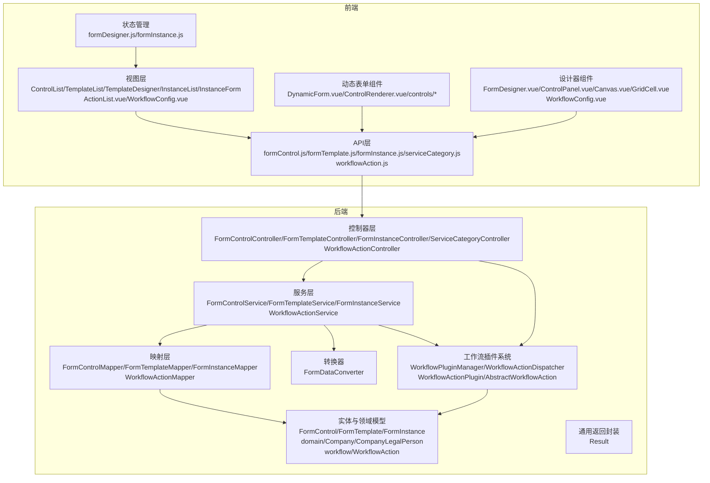
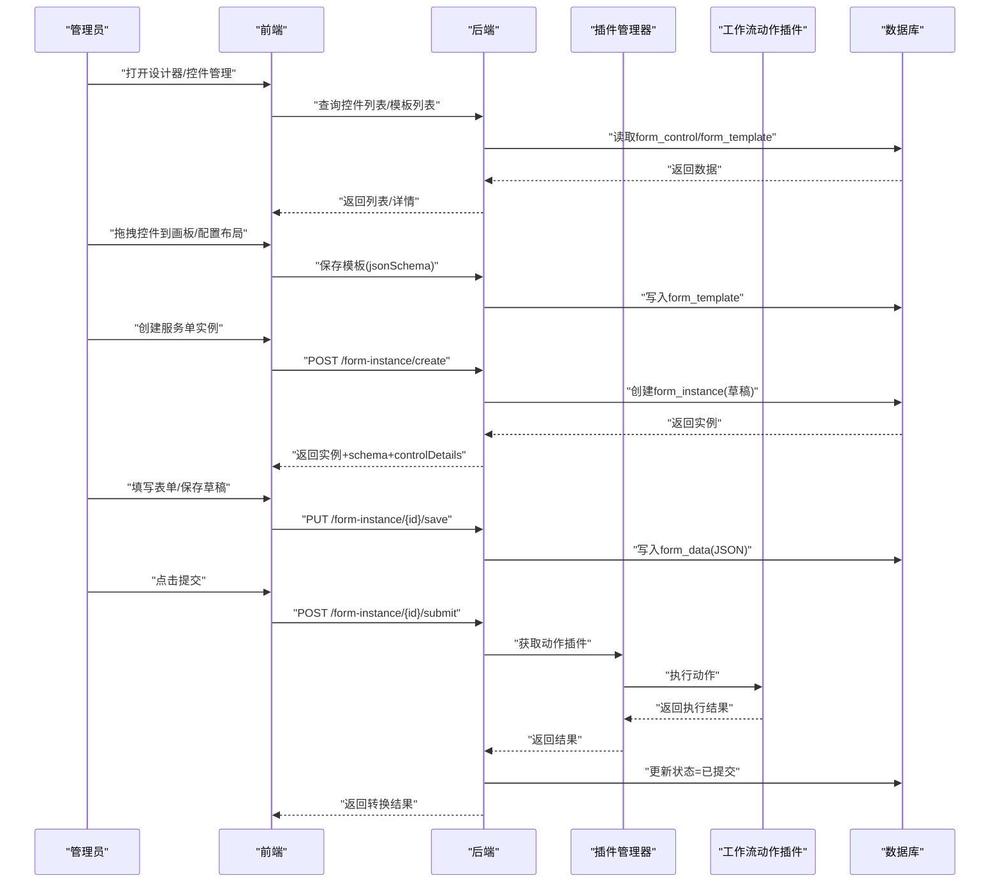
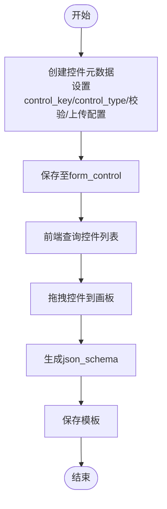
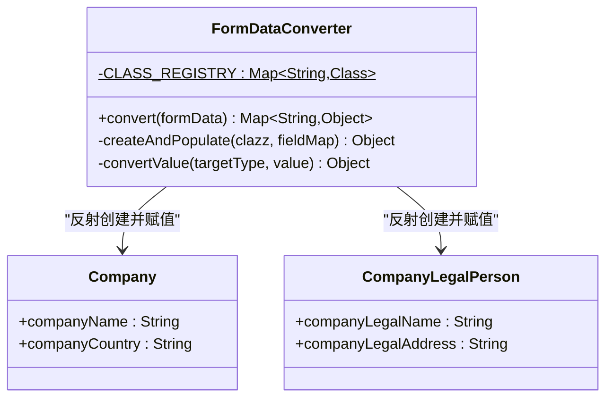
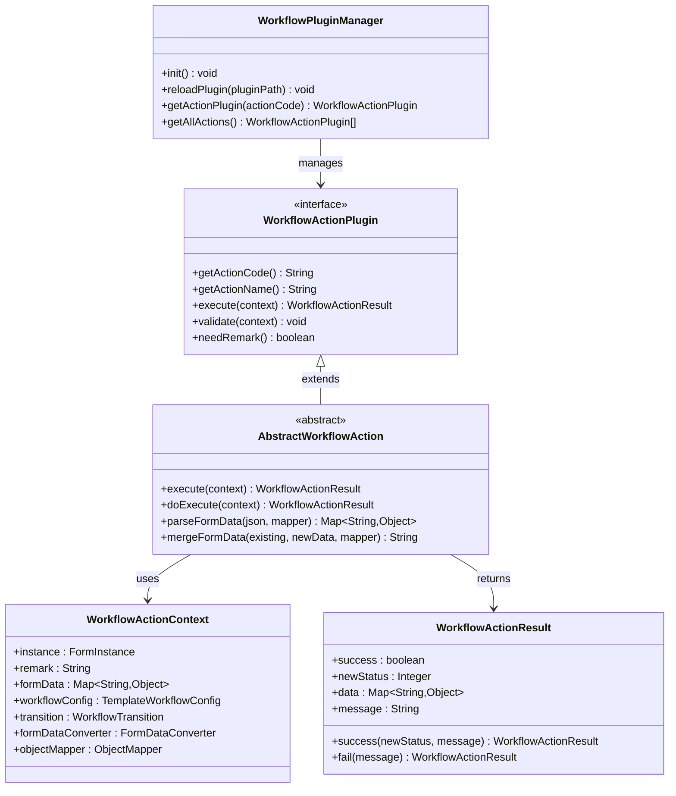
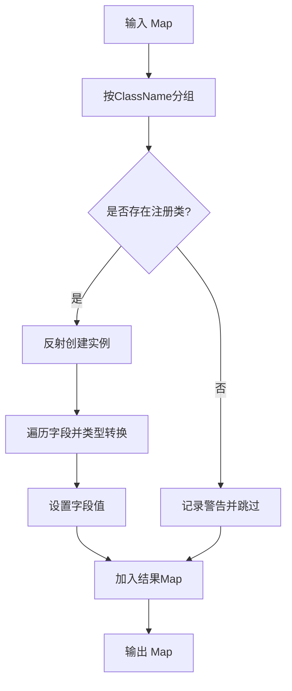
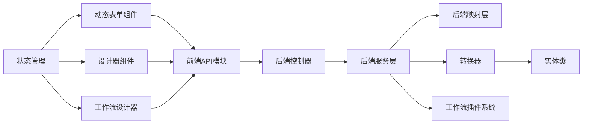

# 扩展开发

<cite>
**本文引用的文件**
- [VAT_EPR_动态表单技术方案.md](file://VAT_EPR_动态表单技术方案.md)
- [WorkflowActionPlugin.java](file://genetics-server/src/main/java/com/genetics/workflow/action/WorkflowActionPlugin.java)
- [WorkflowActionContext.java](file://genetics-server/src/main/java/com/genetics/workflow/action/WorkflowActionContext.java)
- [WorkflowActionResult.java](file://genetics-server/src/main/java/com/genetics/workflow/action/WorkflowActionResult.java)
- [AbstractWorkflowAction.java](file://genetics-server/src/main/java/com/genetics/workflow/action/AbstractWorkflowAction.java)
- [WorkflowPluginManager.java](file://genetics-server/src/main/java/com/genetics/workflow/WorkflowPluginManager.java)
- [WorkflowActionDispatcher.java](file://genetics-server/src/main/java/com/genetics/workflow/WorkflowActionDispatcher.java)
- [WorkflowAction.java](file://genetics-server/src/main/java/com/genetics/entity/workflow/WorkflowAction.java)
- [WorkflowActionController.java](file://genetics-server/src/main/java/com/genetics/controller/WorkflowActionController.java)
- [WorkflowActionService.java](file://genetics-server/src/main/java/com/genetics/service/WorkflowActionService.java)
- [WorkflowActionServiceImpl.java](file://genetics-server/src/main/java/com/genetics/service/impl/WorkflowActionServiceImpl.java)
- [WorkflowActionInitializer.java](file://genetics-server/src/main/java/com/genetics/config/WorkflowActionInitializer.java)
- [WorkflowActionConstants.java](file://genetics-server/src/main/java/com/genetics/common/constants/WorkflowActionConstants.java)
- [SubmitActionPlugin.java](file://genetics-server/src/main/java/com/genetics/workflow/actions/SubmitActionPlugin.java)
- [AuditPassActionPlugin.java](file://genetics-server/src/main/java/com/genetics/workflow/actions/AuditPassActionPlugin.java)
- [AuditRejectActionPlugin.java](file://genetics-server/src/main/java/com/genetics/workflow/actions/AuditRejectActionPlugin.java)
- [ResubmitActionPlugin.java](file://genetics-server/src/main/java/com/genetics/workflow/actions/ResubmitActionPlugin.java)
- [extensions.idx](file://genetics-server/src/main/resources/extensions.idx)
- [workflowAction.js](file://genetics-web/src/api/workflowAction.js)
- [workflowActions.js](file://genetics-web/src/constants/workflowActions.js)
- [ActionList.vue](file://genetics-web/src/views/workflow/ActionList.vue)
- [WorkflowConfig.vue](file://genetics-web/src/components/FormDesigner/WorkflowConfig.vue)
</cite>

## 更新摘要
**所做更改**
- 新增工作流动作插件开发章节，详细介绍WorkflowActionPlugin接口实现
- 添加工作流插件管理系统架构说明
- 补充工作流动作上下文传递和结果处理机制
- 增加自定义工作流动作插件开发指南
- 更新工作流设计器集成说明

## 目录
1. [简介](#简介)
2. [项目结构](#项目结构)
3. [核心组件](#核心组件)
4. [架构总览](#架构总览)
5. [详细组件分析](#详细组件分析)
6. [依赖关系分析](#依赖关系分析)
7. [性能考虑](#性能考虑)
8. [故障排查指南](#故障排查指南)
9. [结论](#结论)
10. [附录](#附录)

## 简介
本扩展开发文档面向系统扩展者，围绕VAT&EPR动态表单系统，提供自定义控件开发、业务实体扩展、插件系统设计、控件注册与渲染器实现、验证规则配置、新业务实体集成、FormDataConverter扩展与数据转换逻辑、文件上传服务集成、第三方系统对接以及API扩展开发的完整框架与实现指导。**特别新增**工作流动作插件开发能力，支持通过实现WorkflowActionPlugin接口开发自定义工作流动作，系统提供标准化的上下文传递和结果处理机制。同时明确扩展开发的限制条件与最佳实践，帮助快速、安全地完成二次开发与定制化集成。

## 项目结构
系统采用前后端分离架构：
- 后端基于Spring Boot 3.2.x + MyBatis-Plus，采用模块化分层（controller/service/mapper/entity/dto/converter/common），核心扩展点集中在converter与entity目录。
- 前端基于Vue 3.4.x + Vite + Element Plus，采用组件化与状态管理（Pinia），动态表单渲染与设计器位于DynamicForm与FormDesigner目录。
- **新增工作流插件系统**：基于PF4J插件框架，支持动态加载和管理工作流动作插件。

**图表来源**
- [VAT_EPR_动态表单技术方案.md:777-813](file://VAT_EPR_动态表单技术方案.md#L777-L813)
- [WorkflowPluginManager.java:1-115](file://genetics-server/src/main/java/com/genetics/workflow/WorkflowPluginManager.java#L1-L115)
- [WorkflowActionPlugin.java:1-46](file://genetics-server/src/main/java/com/genetics/workflow/action/WorkflowActionPlugin.java#L1-L46)

**章节来源**
- [VAT_EPR_动态表单技术方案.md:773-869](file://VAT_EPR_动态表单技术方案.md#L773-L869)
- [WorkflowPluginManager.java:1-115](file://genetics-server/src/main/java/com/genetics/workflow/WorkflowPluginManager.java#L1-L115)

## 核心组件
- 自定义控件表：用于定义控件元数据（名称、类型、校验规则、上传配置等），control_key作为唯一标识，格式为"ClassName.fieldName"。
- 服务单模板表：存储json_schema（网格布局与控件引用）及服务类别信息，支持多级联动与版本管理。
- 服务单实例表：存储表单数据（Map<controlKey, value>序列化为JSON），并维护状态流转。
- FormDataConverter：核心转换器，负责将Map<controlKey, value>按类名分组并通过反射填充实体对象，返回Map<className, 实体对象>。
- **工作流动作插件系统**：基于PF4J插件框架，提供标准化的工作流动作扩展能力。
- 前端动态表单与设计器：根据json_schema与controlDetails动态渲染控件，并支持拖拽布局、校验规则动态生成与文件上传渲染。

**章节来源**
- [VAT_EPR_动态表单技术方案.md:33-163](file://VAT_EPR_动态表单技术方案.md#L33-L163)
- [VAT_EPR_动态表单技术方案.md:594-728](file://VAT_EPR_动态表单技术方案.md#L594-L728)
- [WorkflowActionPlugin.java:1-46](file://genetics-server/src/main/java/com/genetics/workflow/action/WorkflowActionPlugin.java#L1-L46)

## 架构总览
系统扩展的关键路径包括：
- 自定义控件扩展：新增控件元数据，定义control_key、control_type、校验规则与上传配置。
- 业务实体扩展：在converter中注册实体类或通过注解扫描注册，确保FormDataConverter能识别并转换。
- 插件系统设计：通过ControlRenderer集中分发渲染不同控件类型，便于扩展新的控件类型。
- **工作流动作插件**：通过WorkflowActionPlugin接口实现自定义工作流动作，系统提供标准化的上下文传递和结果处理机制。
- 数据转换与提交：FormDataConverter按类名分组并反射赋值，提交接口打印转换结果并更新状态。
- 第三方系统对接：服务类目API透传既有系统，便于统一管理服务类别。

**图表来源**
- [WorkflowActionDispatcher.java:1-37](file://genetics-server/src/main/java/com/genetics/workflow/WorkflowActionDispatcher.java#L1-L37)
- [WorkflowPluginManager.java:1-115](file://genetics-server/src/main/java/com/genetics/workflow/WorkflowPluginManager.java#L1-L115)

**章节来源**
- [VAT_EPR_动态表单技术方案.md:401-478](file://VAT_EPR_动态表单技术方案.md#L401-L478)
- [WorkflowActionDispatcher.java:1-37](file://genetics-server/src/main/java/com/genetics/workflow/WorkflowActionDispatcher.java#L1-L37)

## 详细组件分析

### 自定义控件开发方法
- 控件元数据定义
  - control_key命名规范：ClassName.fieldName，例如"Company.companyName"。该规范用于FormDataConverter按类名分组与反射赋值。
  - control_type支持：INPUT/SELECT/SWITCH/UPLOAD/TEXTAREA/DATE/NUMBER。
  - 校验规则：required、regex_pattern、regex_message、min_length、max_length。
  - 上传配置：当type=UPLOAD时，upload_config包含maxCount、accept、maxSizeMB等。
- 控件注册流程
  - 后端在创建控件时进行control_key格式校验与唯一性校验（数据库唯一索引保障）。
  - 前端在设计器中通过接口获取控件列表，拖拽到画板后写入json_schema。
- 渲染器实现
  - ControlRenderer根据controlType分发渲染不同组件（如InputControl、SelectControl、UploadControl等）。
  - 动态表单组件根据controlDetails构建校验规则（required、minLength、maxLength、regexPattern）。
- 验证规则配置
  - 前端基于controlDetail中的规则动态生成校验器。
  - 后端提交时，FormDataConverter不参与业务校验，仅执行基础格式校验（control_key格式与类注册）。

**图表来源**
- [VAT_EPR_动态表单技术方案.md:33-59](file://VAT_EPR_动态表单技术方案.md#L33-L59)
- [VAT_EPR_动态表单技术方案.md:169-222](file://VAT_EPR_动态表单技术方案.md#L169-L222)

**章节来源**
- [VAT_EPR_动态表单技术方案.md:33-59](file://VAT_EPR_动态表单技术方案.md#L33-L59)
- [VAT_EPR_动态表单技术方案.md:169-222](file://VAT_EPR_动态表单技术方案.md#L169-L222)

### 业务实体扩展机制
- 实体类注册
  - 当前通过静态注册表CLASS_REGISTRY维护实体类映射，新增实体需在此处注册。
  - 建议后续扩展为通过自定义注解（如@FormEntity）+ Spring扫描自动注册，提升可维护性。
- 数据转换逻辑
  - FormDataConverter按"ClassName"分组，反射为目标实体类并赋值字段。
  - 支持常见类型转换（String/Integer/Long/Boolean/BigDecimal）。
  - 若未注册类或字段不存在，会记录警告并跳过，不影响其他实体转换。
- 提交流程
  - 提交接口解析form_data为Map，调用FormDataConverter.convert，打印转换结果并更新状态为"已提交"。

**图表来源**
- [VAT_EPR_动态表单技术方案.md:594-684](file://VAT_EPR_动态表单技术方案.md#L594-L684)
- [VAT_EPR_动态表单技术方案.md:687-703](file://VAT_EPR_动态表单技术方案.md#L687-L703)

**章节来源**
- [VAT_EPR_动态表单技术方案.md:594-728](file://VAT_EPR_动态表单技术方案.md#L594-L728)

### 工作流动作插件开发

#### 工作流插件系统架构
系统基于PF4J插件框架实现了灵活的工作流动作插件系统：

- **插件接口**：WorkflowActionPlugin定义了标准的工作流动作接口
- **插件管理**：WorkflowPluginManager负责插件的加载、启动、注册和生命周期管理
- **动作分发**：WorkflowActionDispatcher根据动作编码分发到对应的插件执行
- **上下文传递**：WorkflowActionContext提供标准化的执行上下文
- **结果处理**：WorkflowActionResult统一的结果处理机制

**图表来源**
- [WorkflowPluginManager.java:1-115](file://genetics-server/src/main/java/com/genetics/workflow/WorkflowPluginManager.java#L1-L115)
- [WorkflowActionPlugin.java:1-46](file://genetics-server/src/main/java/com/genetics/workflow/action/WorkflowActionPlugin.java#L1-L46)
- [AbstractWorkflowAction.java:1-77](file://genetics-server/src/main/java/com/genetics/workflow/action/AbstractWorkflowAction.java#L1-L77)
- [WorkflowActionContext.java:1-63](file://genetics-server/src/main/java/com/genetics/workflow/action/WorkflowActionContext.java#L1-L63)
- [WorkflowActionResult.java:1-72](file://genetics-server/src/main/java/com/genetics/workflow/action/WorkflowActionResult.java#L1-L72)

#### 工作流动作插件开发指南
**开发步骤**
1. **实现接口**：创建类实现WorkflowActionPlugin接口
2. **注解标记**：使用@Extension注解标识插件
3. **配置注册**：在extensions.idx文件中注册插件类名
4. **实现逻辑**：重写doExecute方法实现具体业务逻辑

**核心接口方法**
- `getActionCode()`：返回动作编码（如"customAction"）
- `getActionName()`：返回动作显示名称（如"自定义动作"）
- `execute(context)`：标准执行入口，包含校验和异常处理
- `doExecute(context)`：子类实现具体业务逻辑
- `validate(context)`：可选的前置校验
- `needRemark()`：是否需要备注，默认false

**上下文传递机制**
WorkflowActionContext提供以下执行上下文：
- `instance`：当前服务单实例
- `remark`：用户输入的备注信息
- `formData`：触发动作时的表单数据
- `workflowConfig`：模板工作流配置
- `transition`：当前流转规则
- `formDataConverter`：表单数据转换器
- `objectMapper`：JSON处理器

**结果处理机制**
WorkflowActionResult提供统一的结果封装：
- `success`：执行是否成功
- `newStatus`：新的业务状态ID
- `data`：附加数据（如转换后的实体对象）
- `message`：结果消息

**章节来源**
- [WorkflowActionPlugin.java:1-46](file://genetics-server/src/main/java/com/genetics/workflow/action/WorkflowActionPlugin.java#L1-L46)
- [WorkflowActionContext.java:1-63](file://genetics-server/src/main/java/com/genetics/workflow/action/WorkflowActionContext.java#L1-L63)
- [WorkflowActionResult.java:1-72](file://genetics-server/src/main/java/com/genetics/workflow/action/WorkflowActionResult.java#L1-L72)
- [AbstractWorkflowAction.java:1-77](file://genetics-server/src/main/java/com/genetics/workflow/action/AbstractWorkflowAction.java#L1-L77)
- [extensions.idx:1-4](file://genetics-server/src/main/resources/extensions.idx#L1-L4)

#### 内置工作流动作插件示例
系统提供了多个内置工作流动作插件作为开发参考：

**提交动作插件** (`SubmitActionPlugin`)
- 功能：将表单数据转换为业务实体并流转到下一状态
- 特点：使用FormDataConverter进行数据转换，记录转换结果日志
- 应用场景：服务单正式提交

**审核通过插件** (`AuditPassActionPlugin`)
- 功能：简单的状态流转，无需特殊处理
- 特点：最简化的插件实现

**审核驳回插件** (`AuditRejectActionPlugin`)
- 功能：将状态重置为草稿，要求必须填写备注
- 特点：重写needRemark()返回true，validate()校验备注必填

**重新提交插件** (`ResubmitActionPlugin`)
- 功能：在已驳回状态下重新提交
- 特点：更新提交状态和时间戳

**章节来源**
- [SubmitActionPlugin.java:1-82](file://genetics-server/src/main/java/com/genetics/workflow/actions/SubmitActionPlugin.java#L1-L82)
- [AuditPassActionPlugin.java:1-39](file://genetics-server/src/main/java/com/genetics/workflow/actions/AuditPassActionPlugin.java#L1-L39)
- [AuditRejectActionPlugin.java:1-57](file://genetics-server/src/main/java/com/genetics/workflow/actions/AuditRejectActionPlugin.java#L1-L57)
- [ResubmitActionPlugin.java:1-55](file://genetics-server/src/main/java/com/genetics/workflow/actions/ResubmitActionPlugin.java#L1-L55)

#### 工作流动作管理
**后端管理接口**
- `GET /api/workflow/actions/list`：获取所有可用的动作列表
- `POST /api/workflow/actions`：保存或更新动作配置
- `DELETE /api/workflow/actions/{id}`：删除动作配置

**前端管理界面**
- `ActionList.vue`：工作流动作管理页面
- 支持动作的增删改查、排序、图标配置
- 集成Naive UI组件库实现现代化界面

**初始化机制**
- `WorkflowActionInitializer`：系统启动时初始化内置动作
- `WorkflowActionConstants`：定义动作常量
- 支持动作的默认配置和排序

**章节来源**
- [WorkflowActionController.java:1-32](file://genetics-server/src/main/java/com/genetics/controller/WorkflowActionController.java#L1-L32)
- [WorkflowActionService.java:1-12](file://genetics-server/src/main/java/com/genetics/service/WorkflowActionService.java#L1-L12)
- [WorkflowActionServiceImpl.java:1-20](file://genetics-server/src/main/java/com/genetics/service/impl/WorkflowActionServiceImpl.java#L1-L20)
- [WorkflowActionInitializer.java:1-65](file://genetics-server/src/main/java/com/genetics/config/WorkflowActionInitializer.java#L1-L65)
- [WorkflowActionConstants.java:1-35](file://genetics-server/src/main/java/com/genetics/common/constants/WorkflowActionConstants.java#L1-L35)
- [ActionList.vue:1-191](file://genetics-web/src/views/workflow/ActionList.vue#L1-L191)
- [workflowAction.js:1-23](file://genetics-web/src/api/workflowAction.js#L1-L23)

### 插件系统设计
- 控件渲染插件化
  - ControlRenderer集中分发不同controlType，新增控件类型只需在controls目录新增组件并在ControlRenderer中注册映射。
- 设计器插件化
  - FormDesigner通过ControlPanel与Canvas实现拖拽布局，新增控件类型需同步更新左侧控件面板与画板渲染逻辑。
- **工作流动作插件化**
  - WorkflowActionPlugin提供标准化的工作流动作接口
  - PF4J插件框架支持动态加载和热部署
  - 支持插件的生命周期管理和版本控制
- 插件扩展建议
  - 通过约定的control_type与props约定，实现跨模块复用与统一管理。
  - 控件属性（如上传配置）通过controlDetail传递，前端渲染器按需读取。

**章节来源**
- [VAT_EPR_动态表单技术方案.md:815-852](file://VAT_EPR_动态表单技术方案.md#L815-L852)
- [WorkflowPluginManager.java:1-115](file://genetics-server/src/main/java/com/genetics/workflow/WorkflowPluginManager.java#L1-L115)

### 新业务实体的集成步骤
- 后端
  - 在entity/domain目录新增实体类，确保有无参构造函数与setter/getter。
  - 在FormDataConverter中注册实体类（当前静态注册，建议扩展为注解扫描）。
  - 如需复杂校验或类型转换，可在convertValue中扩展类型分支。
  - **新增工作流动作插件**：实现WorkflowActionPlugin接口，使用@Extension注解标记。
- 前端
  - 在ControlRenderer中注册新的control_type对应的组件。
  - 在DynamicForm中完善校验规则生成逻辑（如新增校验类型）。
  - **新增工作流动作配置**：在ActionList.vue中配置动作的显示名称、图标和按钮类型。
- 测试
  - 使用提交接口验证转换结果，确认实体类字段正确赋值。
  - **测试工作流动作插件**：通过工作流设计器测试自定义动作的执行效果。

**章节来源**
- [VAT_EPR_动态表单技术方案.md:594-728](file://VAT_EPR_动态表单技术方案.md#L594-L728)
- [WorkflowActionPlugin.java:1-46](file://genetics-server/src/main/java/com/genetics/workflow/action/WorkflowActionPlugin.java#L1-L46)
- [ActionList.vue:1-191](file://genetics-web/src/views/workflow/ActionList.vue#L1-L191)

### FormDataConverter扩展与数据转换逻辑
- 扩展点
  - 类型转换：在convertValue中增加对新类型的处理（如LocalDate、Enum等）。
  - 实体注册：从静态注册迁移到注解扫描，减少手工维护成本。
  - 错误处理：增强异常捕获与日志输出，便于定位control_key格式错误或字段缺失问题。
- 数据转换流程
  - 输入：Map<controlKey, value>，control_key格式为"ClassName.fieldName"。
  - 分组：按ClassName分组，生成Map<String, Map<String, Object>>。
  - 反射：遍历字段，通过反射设置目标实体字段值。
  - 输出：Map<className, 实体对象>。

**图表来源**
- [VAT_EPR_动态表单技术方案.md:594-684](file://VAT_EPR_动态表单技术方案.md#L594-L684)

**章节来源**
- [VAT_EPR_动态表单技术方案.md:594-684](file://VAT_EPR_动态表单技术方案.md#L594-L684)

### 文件上传服务集成
- 控件类型与配置
  - Upload控件通过upload_config配置maxCount、accept、maxSizeMB。
  - 前端渲染UploadControl，支持多文件上传与预览。
- 提交数据格式
  - 上传完成后，前端将文件URL列表作为value提交，后端原样存储在form_data中。
- 第三方存储对接
  - 建议结合OSS/MinIO等对象存储服务，提供文件上传与访问能力。
  - 前端上传组件需支持签名直传与回调处理。

**章节来源**
- [VAT_EPR_动态表单技术方案.md:33-59](file://VAT_EPR_动态表单技术方案.md#L33-L59)
- [VAT_EPR_动态表单技术方案.md:531-548](file://VAT_EPR_动态表单技术方案.md#L531-L548)

### 第三方系统对接
- 服务类目透传
  - 通过ServiceCategoryController提供children接口，支持一级/二级/三级联动查询。
  - 前端按parentId逐级加载，实现与既有系统的统一管理。
- **工作流动作集成**
  - 自定义工作流动作插件可以集成第三方系统调用
  - 通过WorkflowActionContext访问formDataConverter和objectMapper
  - 支持同步和异步的第三方系统对接
- 扩展建议
  - 可在ServiceCategoryController中增加缓存与鉴权，提升性能与安全性。
  - 对外暴露的接口需遵循统一的Result封装与错误码规范。

**章节来源**
- [VAT_EPR_动态表单技术方案.md:389-396](file://VAT_EPR_动态表单技术方案.md#L389-L396)
- [SubmitActionPlugin.java:55-57](file://genetics-server/src/main/java/com/genetics/workflow/actions/SubmitActionPlugin.java#L55-L57)

### API扩展开发
- 控制器扩展
  - 在controller包新增对应Controller，遵循现有REST风格与Result封装。
- 服务层扩展
  - 在service包新增Service，实现业务逻辑并与mapper交互。
- 映射层扩展
  - 在mapper包新增Mapper接口与XML，或使用MyBatis-Plus注解方式。
- DTO与实体
  - 在dto与entity包新增对应类，保持字段与数据库一致。
- 前端API扩展
  - 在api目录新增对应JS模块，封装HTTP请求与参数处理。
- **工作流动作API扩展**
  - 新增工作流动作管理API：list、save、delete
  - 前端集成工作流动作配置界面
- 最佳实践
  - 统一错误码与响应格式，确保前后端一致性。
  - 对外接口增加鉴权与限流，保障系统安全。

**章节来源**
- [VAT_EPR_动态表单技术方案.md:777-813](file://VAT_EPR_动态表单技术方案.md#L777-L813)
- [WorkflowActionController.java:1-32](file://genetics-server/src/main/java/com/genetics/controller/WorkflowActionController.java#L1-L32)
- [workflowAction.js:1-23](file://genetics-web/src/api/workflowAction.js#L1-L23)

## 依赖关系分析
- 后端模块耦合
  - 控制器依赖服务层；服务层依赖映射层；转换器独立于控制器但被服务层调用。
  - 实体类与转换器存在运行时依赖（类名匹配）。
  - **工作流插件系统**：插件管理器依赖PF4J插件框架，动作插件通过接口实现解耦。
- 前端模块耦合
  - 动态表单组件依赖API层与状态管理；设计器组件依赖画板与控件面板。
  - **工作流设计器**：依赖工作流动作API和表单设计器组件。
- 外部依赖
  - Jackson用于JSON序列化；Element Plus用于UI组件；Axios用于HTTP客户端。
  - **PF4J**：用于工作流插件框架支持。

**图表来源**
- [VAT_EPR_动态表单技术方案.md:777-813](file://VAT_EPR_动态表单技术方案.md#L777-L813)
- [WorkflowPluginManager.java:1-115](file://genetics-server/src/main/java/com/genetics/workflow/WorkflowPluginManager.java#L1-L115)

**章节来源**
- [VAT_EPR_动态表单技术方案.md:777-813](file://VAT_EPR_动态表单技术方案.md#L777-L813)
- [WorkflowPluginManager.java:1-115](file://genetics-server/src/main/java/com/genetics/workflow/WorkflowPluginManager.java#L1-L115)

## 性能考虑
- 控制器与服务层
  - 对高频查询接口增加缓存（如服务类目、控件列表），减少数据库压力。
  - 对批量操作（如模板发布、实例导出）采用异步处理与分页。
- 转换器
  - 实体类注册建议采用注解扫描，减少静态注册带来的维护成本与启动时间。
  - 类型转换逻辑尽量避免重复计算，必要时引入缓存。
- 前端
  - 动态表单渲染时按需渲染，避免一次性渲染过多控件。
  - 上传组件支持断点续传与进度条，提升用户体验。
  - **工作流设计器**：优化节点和连线的渲染性能，支持大量节点的流畅操作。
- 数据库
  - 对form_instance的form_data字段进行合理索引与分表策略（按国家/模板维度），降低查询成本。
- **工作流插件系统**
  - 插件加载采用懒加载策略，避免启动时的性能开销。
  - 插件间通信通过上下文传递，减少全局状态共享。

## 故障排查指南
- control_key格式错误
  - 现象：转换器记录警告并跳过该字段。
  - 排查：检查control_key是否符合"ClassName.fieldName"格式，且类已在注册表中。
- 类未注册
  - 现象：转换器记录警告并跳过该类。
  - 排查：在CLASS_REGISTRY中注册实体类，或启用注解扫描。
- 字段不存在
  - 现象：转换器记录字段未找到警告。
  - 排查：确认实体类字段名与control_key的fieldName一致。
- 文件上传异常
  - 现象：上传失败或URL为空。
  - 排查：检查upload_config配置与第三方存储服务可用性。
- 并发覆盖
  - 现象：保存草稿时数据被覆盖。
  - 排查：使用乐观锁（version字段）防止并发覆盖。
- **工作流动作插件异常**
  - 现象：工作流动作执行失败或插件未生效。
  - 排查：检查插件类是否正确实现WorkflowActionPlugin接口，extensions.idx是否正确配置，插件是否成功加载。

**章节来源**
- [VAT_EPR_动态表单技术方案.md:856-869](file://VAT_EPR_动态表单技术方案.md#L856-L869)

## 结论
本扩展开发文档提供了从控件到实体、从渲染到转换、从前端到后端的全链路扩展指南。通过标准化的control_key命名、清晰的注册机制与插件化的渲染器设计，系统具备良好的可扩展性与可维护性。**新增的工作流动作插件开发能力**进一步增强了系统的灵活性，通过PF4J插件框架实现了工作流动作的动态扩展和管理。建议在实际落地中优先采用注解扫描替代静态注册，完善错误处理与日志体系，并结合缓存与异步策略提升整体性能与稳定性。工作流插件系统为系统提供了强大的扩展能力，支持复杂的业务流程定制和第三方系统集成。

## 附录
- 关键约束与注意事项
  - control_key唯一性与格式校验。
  - 模板发布后禁止修改json_schema，需通过版本升级规避数据错乱。
  - 实体类注册需及时更新，避免转换失败。
  - 文件上传需配合第三方存储服务。
  - 提交后状态变为"已提交"，禁止再次修改。
  - 并发保存需加乐观锁（version字段）。
  - **工作流动作插件**：插件类必须实现WorkflowActionPlugin接口，使用@Extension注解标记，正确配置extensions.idx。
  - **插件管理**：支持插件的动态加载和热部署，注意插件间的依赖关系和版本兼容性。

**章节来源**
- [VAT_EPR_动态表单技术方案.md:856-869](file://VAT_EPR_动态表单技术方案.md#L856-L869)
- [WorkflowActionPlugin.java:1-46](file://genetics-server/src/main/java/com/genetics/workflow/action/WorkflowActionPlugin.java#L1-L46)