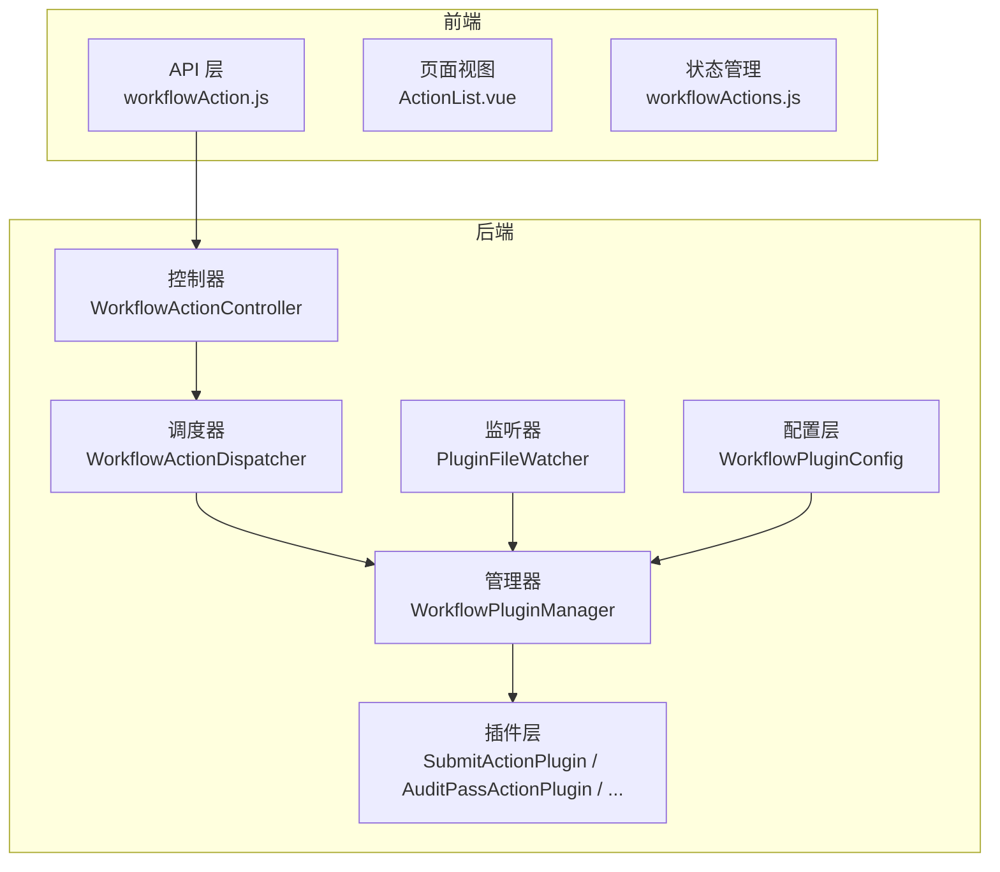
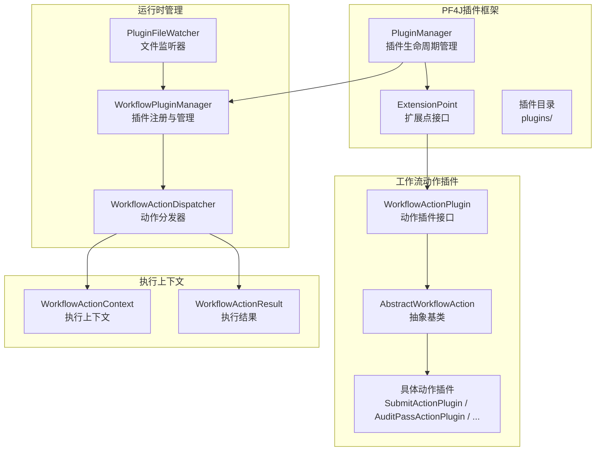
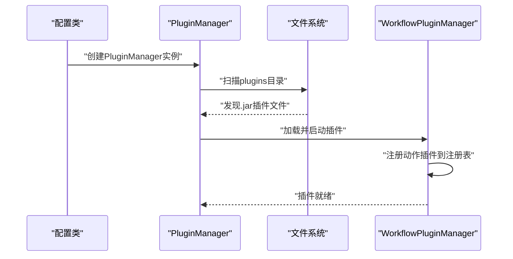
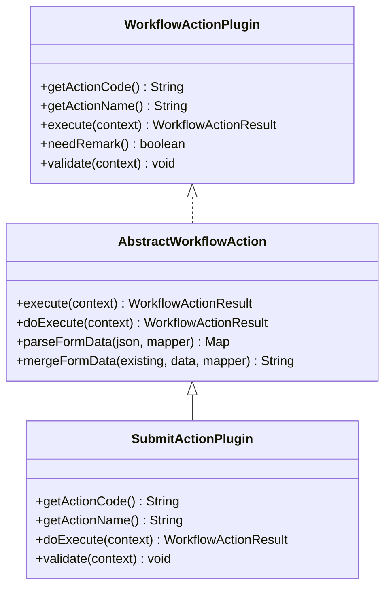
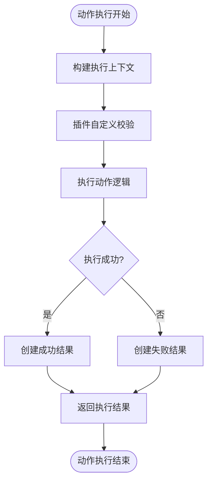
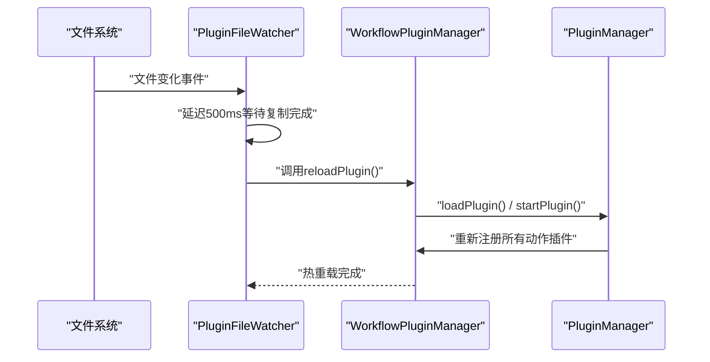
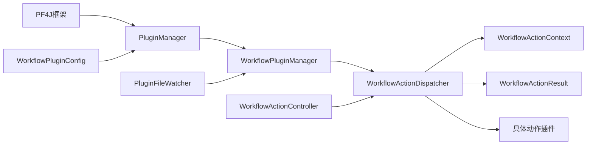

# 插件系统设计

<cite>
**本文档引用的文件**
- [WorkflowPluginConfig.java](file://genetics-server/src/main/java/com/genetics/config/WorkflowPluginConfig.java)
- [WorkflowPluginManager.java](file://genetics-server/src/main/java/com/genetics/workflow/WorkflowPluginManager.java)
- [WorkflowActionPlugin.java](file://genetics-server/src/main/java/com/genetics/workflow/action/WorkflowActionPlugin.java)
- [AbstractWorkflowAction.java](file://genetics-server/src/main/java/com/genetics/workflow/action/AbstractWorkflowAction.java)
- [WorkflowActionContext.java](file://genetics-server/src/main/java/com/genetics/workflow/action/WorkflowActionContext.java)
- [WorkflowActionResult.java](file://genetics-server/src/main/java/com/genetics/workflow/action/WorkflowActionResult.java)
- [AuditPassActionPlugin.java](file://genetics-server/src/main/java/com/genetics/workflow/actions/AuditPassActionPlugin.java)
- [AuditRejectActionPlugin.java](file://genetics-server/src/main/java/com/genetics/workflow/actions/AuditRejectActionPlugin.java)
- [ResubmitActionPlugin.java](file://genetics-server/src/main/java/com/genetics/workflow/actions/ResubmitActionPlugin.java)
- [SubmitActionPlugin.java](file://genetics-server/src/main/java/com/genetics/workflow/actions/SubmitActionPlugin.java)
- [PluginFileWatcher.java](file://genetics-server/src/main/java/com/genetics/workflow/PluginFileWatcher.java)
- [WorkflowActionDispatcher.java](file://genetics-server/src/main/java/com/genetics/workflow/WorkflowActionDispatcher.java)
- [WorkflowActionController.java](file://genetics-server/src/main/java/com/genetics/controller/WorkflowActionController.java)
</cite>

## 更新摘要
**所做更改**
- 更新了插件系统架构，从动态表单插件系统扩展为通用工作流动作插件系统
- 引入PF4J插件框架支持热重载和插件生命周期管理
- 新增标准化的工作流动作执行接口和上下文管理
- 添加插件文件监听器实现自动热重载功能
- 重构了插件注册机制和生命周期管理

## 目录
1. [引言](#引言)
2. [项目结构](#项目结构)
3. [核心组件](#核心组件)
4. [架构总览](#架构总览)
5. [详细组件分析](#详细组件分析)
6. [依赖关系分析](#依赖关系分析)
7. [性能考量](#性能考量)
8. [故障排查指南](#故障排查指南)
9. [结论](#结论)
10. [附录](#附录)

## 引言
本文档面向基于PF4J插件框架的工作流动作插件系统设计。该系统以"工作流动作插件"为核心扩展点，结合PF4J插件管理器、热重载机制和标准化的动作执行接口，实现了高度可扩展的工作流自动化解决方案。系统支持动态加载、卸载和热重载插件，提供统一的动作执行上下文和结果封装，确保插件间通信和状态管理的可靠性。

## 项目结构
工作流动作插件系统采用前后端分离架构，基于Spring Boot和PF4J插件框架：

**图表来源**
- [WorkflowPluginConfig.java:15-41](file://genetics-server/src/main/java/com/genetics/config/WorkflowPluginConfig.java#L15-L41)
- [WorkflowPluginManager.java:17-116](file://genetics-server/src/main/java/com/genetics/workflow/WorkflowPluginManager.java#L17-L116)
- [PluginFileWatcher.java:14-125](file://genetics-server/src/main/java/com/genetics/workflow/PluginFileWatcher.java#L14-L125)

**章节来源**
- [WorkflowPluginConfig.java:15-41](file://genetics-server/src/main/java/com/genetics/config/WorkflowPluginConfig.java#L15-L41)
- [WorkflowPluginManager.java:17-116](file://genetics-server/src/main/java/com/genetics/workflow/WorkflowPluginManager.java#L17-L116)
- [PluginFileWatcher.java:14-125](file://genetics-server/src/main/java/com/genetics/workflow/PluginFileWatcher.java#L14-L125)

## 核心组件
围绕工作流动作插件系统，以下核心组件承担扩展职责：

- **PF4J插件管理器**：负责插件的加载、启动、停止和卸载，提供插件生命周期管理
- **工作流动作插件接口**：标准化的动作执行接口，定义动作编码、名称和执行方法
- **抽象动作基类**：提供通用的执行逻辑、日志记录和数据处理工具方法
- **动作执行上下文**：封装动作执行所需的所有数据和工具类
- **动作执行结果**：标准化的结果封装，包含成功状态、新状态和附加数据
- **插件文件监听器**：监控plugins目录变化，实现插件的自动热重载
- **动作分发器**：根据动作编码分发到对应的插件执行，协调插件间交互

**章节来源**
- [WorkflowActionPlugin.java:5-47](file://genetics-server/src/main/java/com/genetics/workflow/action/WorkflowActionPlugin.java#L5-L47)
- [AbstractWorkflowAction.java:11-77](file://genetics-server/src/main/java/com/genetics/workflow/action/AbstractWorkflowAction.java#L11-L77)
- [WorkflowActionContext.java:13-63](file://genetics-server/src/main/java/com/genetics/workflow/action/WorkflowActionContext.java#L13-L63)
- [WorkflowActionResult.java:10-72](file://genetics-server/src/main/java/com/genetics/workflow/action/WorkflowActionResult.java#L10-L72)

## 架构总览
工作流动作插件系统以"PF4J插件框架 + 标准化接口 + 热重载机制"的方式组织，形成松耦合、可扩展的工作流自动化生态。

**图表来源**
- [WorkflowPluginManager.java:17-116](file://genetics-server/src/main/java/com/genetics/workflow/WorkflowPluginManager.java#L17-L116)
- [WorkflowActionDispatcher.java:20-100](file://genetics-server/src/main/java/com/genetics/workflow/WorkflowActionDispatcher.java#L20-L100)
- [PluginFileWatcher.java:14-125](file://genetics-server/src/main/java/com/genetics/workflow/PluginFileWatcher.java#L14-L125)

## 详细组件分析

### PF4J插件框架集成
系统通过PF4J实现插件化架构，提供完整的插件生命周期管理：

- **插件管理配置**：初始化DefaultPluginManager，设置插件目录和加载策略
- **插件生命周期**：支持插件的加载、启动、停止和卸载完整生命周期
- **热重载支持**：通过文件监听器实现插件的动态加载和卸载

**图表来源**
- [WorkflowPluginConfig.java:25-40](file://genetics-server/src/main/java/com/genetics/config/WorkflowPluginConfig.java#L25-L40)
- [WorkflowPluginManager.java:32-55](file://genetics-server/src/main/java/com/genetics/workflow/WorkflowPluginManager.java#L32-L55)

**章节来源**
- [WorkflowPluginConfig.java:25-40](file://genetics-server/src/main/java/com/genetics/config/WorkflowPluginConfig.java#L25-L40)
- [WorkflowPluginManager.java:32-55](file://genetics-server/src/main/java/com/genetics/workflow/WorkflowPluginManager.java#L32-L55)

### 工作流动作插件接口设计
标准化的动作插件接口定义了统一的扩展点：

- **动作标识**：getActionCode()和getActionName()提供唯一标识和显示名称
- **执行方法**：execute()方法接受WorkflowActionContext参数，返回WorkflowActionResult
- **扩展接口**：needRemark()和validate()提供可选的备注需求和自定义校验

**图表来源**
- [WorkflowActionPlugin.java:9-47](file://genetics-server/src/main/java/com/genetics/workflow/action/WorkflowActionPlugin.java#L9-L47)
- [AbstractWorkflowAction.java:16-77](file://genetics-server/src/main/java/com/genetics/workflow/action/AbstractWorkflowAction.java#L16-L77)
- [SubmitActionPlugin.java:19-82](file://genetics-server/src/main/java/com/genetics/workflow/actions/SubmitActionPlugin.java#L19-L82)

**章节来源**
- [WorkflowActionPlugin.java:9-47](file://genetics-server/src/main/java/com/genetics/workflow/action/WorkflowActionPlugin.java#L9-L47)
- [AbstractWorkflowAction.java:16-77](file://genetics-server/src/main/java/com/genetics/workflow/action/AbstractWorkflowAction.java#L16-L77)

### 动作执行上下文与结果管理
标准化的上下文和结果封装确保了插件间的数据传递一致性：

- **执行上下文**：包含FormInstance、remark、formData、workflowConfig等执行必需数据
- **执行结果**：统一的成功/失败状态、新状态码、附加数据和消息格式
- **数据转换**：集成FormDataConverter和ObjectMapper处理表单数据转换

**图表来源**
- [WorkflowActionContext.java:19-62](file://genetics-server/src/main/java/com/genetics/workflow/action/WorkflowActionContext.java#L19-L62)
- [WorkflowActionResult.java:17-71](file://genetics-server/src/main/java/com/genetics/workflow/action/WorkflowActionResult.java#L17-L71)

**章节来源**
- [WorkflowActionContext.java:19-62](file://genetics-server/src/main/java/com/genetics/workflow/action/WorkflowActionContext.java#L19-L62)
- [WorkflowActionResult.java:17-71](file://genetics-server/src/main/java/com/genetics/workflow/action/WorkflowActionResult.java#L17-L71)

### 具体动作插件实现
系统内置多个标准动作插件，展示插件化架构的实际应用：

- **提交动作**：将表单数据转换为业务实体，更新实例状态
- **审核通过**：简单的状态流转，无需特殊处理
- **审核驳回**：重置状态为草稿，需要备注信息
- **重新提交**：在特定状态下允许重新提交，更新提交时间和状态

**章节来源**
- [SubmitActionPlugin.java:19-82](file://genetics-server/src/main/java/com/genetics/workflow/actions/SubmitActionPlugin.java#L19-L82)
- [AuditPassActionPlugin.java:12-39](file://genetics-server/src/main/java/com/genetics/workflow/actions/AuditPassActionPlugin.java#L12-L39)
- [AuditRejectActionPlugin.java:14-57](file://genetics-server/src/main/java/com/genetics/workflow/actions/AuditRejectActionPlugin.java#L14-L57)
- [ResubmitActionPlugin.java:16-55](file://genetics-server/src/main/java/com/genetics/workflow/actions/ResubmitActionPlugin.java#L16-L55)

### 插件文件监听与热重载
自动化的插件管理机制确保系统的动态扩展能力：

- **文件监控**：监听plugins目录的CREATE、MODIFY、DELETE事件
- **延迟处理**：等待文件复制完成后再进行插件加载
- **热重载流程**：动态卸载旧插件，加载新插件，重新注册所有动作

**图表来源**
- [PluginFileWatcher.java:79-123](file://genetics-server/src/main/java/com/genetics/workflow/PluginFileWatcher.java#L79-L123)
- [WorkflowPluginManager.java:81-99](file://genetics-server/src/main/java/com/genetics/workflow/WorkflowPluginManager.java#L81-L99)

**章节来源**
- [PluginFileWatcher.java:79-123](file://genetics-server/src/main/java/com/genetics/workflow/PluginFileWatcher.java#L79-L123)
- [WorkflowPluginManager.java:81-99](file://genetics-server/src/main/java/com/genetics/workflow/WorkflowPluginManager.java#L81-L99)

### 动作分发器与插件协调
统一的动作分发机制协调各个插件的执行：

- **插件查找**：根据动作编码从注册表获取对应插件
- **上下文构建**：整合实例数据、表单数据和工作流配置
- **流转校验**：验证当前状态是否允许执行指定动作
- **执行协调**：按顺序执行校验、插件执行和结果处理

**章节来源**
- [WorkflowActionDispatcher.java:35-100](file://genetics-server/src/main/java/com/genetics/workflow/WorkflowActionDispatcher.java#L35-L100)

## 依赖关系分析
工作流动作插件系统的核心依赖关系：

**图表来源**
- [WorkflowPluginManager.java:25-30](file://genetics-server/src/main/java/com/genetics/workflow/WorkflowPluginManager.java#L25-L30)
- [WorkflowActionDispatcher.java:29-34](file://genetics-server/src/main/java/com/genetics/workflow/WorkflowActionDispatcher.java#L29-L34)
- [PluginFileWatcher.java:22-33](file://genetics-server/src/main/java/com/genetics/workflow/PluginFileWatcher.java#L22-L33)

**章节来源**
- [WorkflowPluginManager.java:25-30](file://genetics-server/src/main/java/com/genetics/workflow/WorkflowPluginManager.java#L25-L30)
- [WorkflowActionDispatcher.java:29-34](file://genetics-server/src/main/java/com/genetics/workflow/WorkflowActionDispatcher.java#L29-L34)
- [PluginFileWatcher.java:22-33](file://genetics-server/src/main/java/com/genetics/workflow/PluginFileWatcher.java#L22-L33)

## 性能考量
- **插件加载性能**：使用ConcurrentHashMap存储插件注册表，提供O(1)的插件查找性能
- **热重载性能**：文件监听器采用单线程轮询，避免频繁的I/O操作
- **执行性能**：动作执行采用事务管理，确保数据一致性
- **内存管理**：插件卸载时清理注册表和相关资源，防止内存泄漏

## 故障排查指南
- **插件未加载**：检查plugins目录权限和.jar文件完整性
- **动作执行失败**：查看动作插件的validate()方法和doExecute()实现
- **热重载失效**：确认文件监听器正常运行和插件目录可写
- **状态流转异常**：检查工作流配置和状态码映射关系

**章节来源**
- [WorkflowPluginManager.java:81-99](file://genetics-server/src/main/java/com/genetics/workflow/WorkflowPluginManager.java#L81-L99)
- [PluginFileWatcher.java:58-77](file://genetics-server/src/main/java/com/genetics/workflow/PluginFileWatcher.java#L58-L77)

## 结论
通过引入PF4J插件框架和标准化的工作流动作插件接口，系统实现了高度可扩展的工作流自动化解决方案。热重载机制确保了插件的动态扩展能力，而标准化的执行接口和上下文管理保证了插件间的一致性和可靠性。该架构为未来扩展更多工作流动作和集成第三方业务逻辑提供了清晰的技术路径。

## 附录
- **安全性**：插件在独立的类加载器中运行，防止恶意代码影响主系统
- **版本兼容性**：PF4J支持插件版本管理，可通过配置实现向后兼容
- **升级策略**：采用蓝绿部署策略，先部署新版本插件再切换流量
- **监控告警**：集成日志系统和健康检查，实时监控插件运行状态