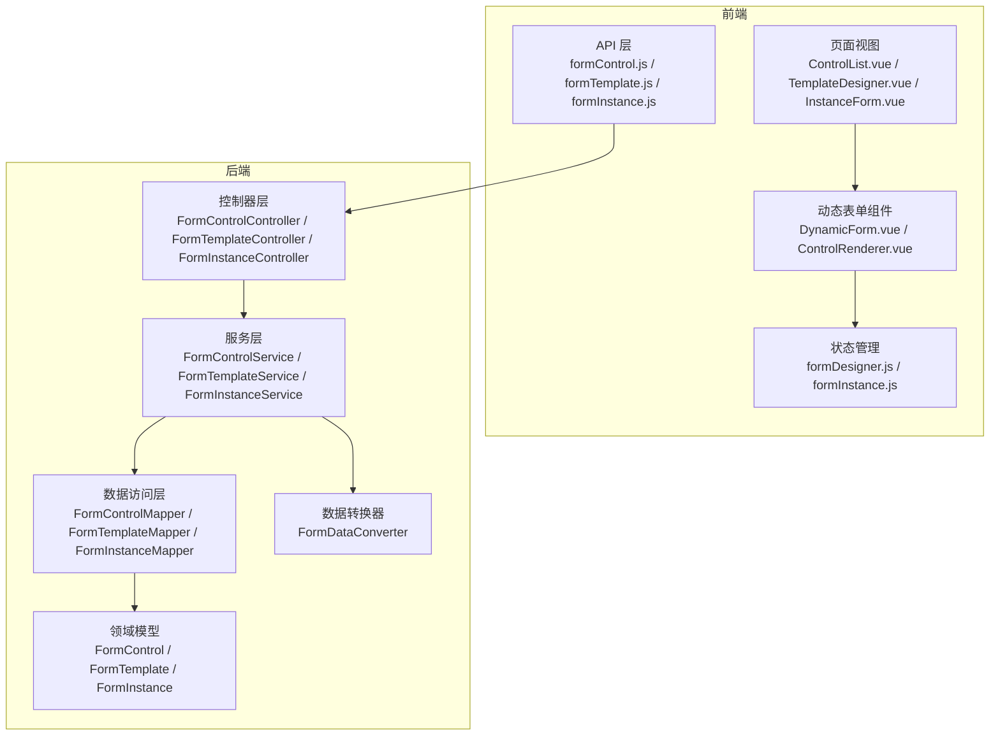
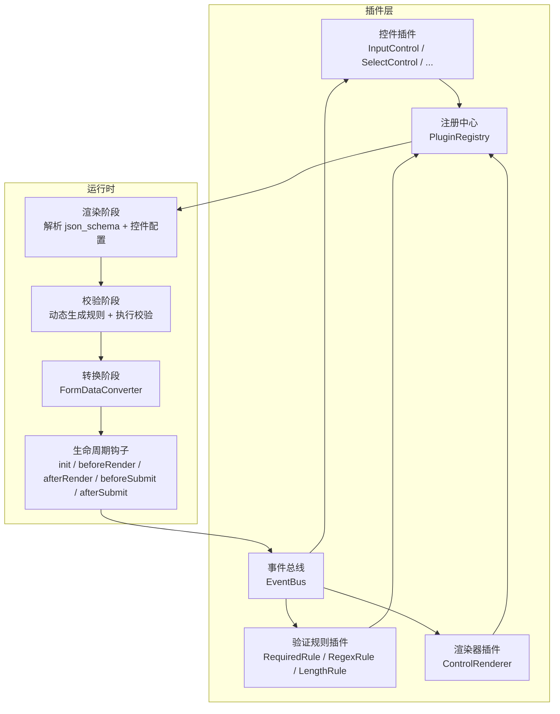
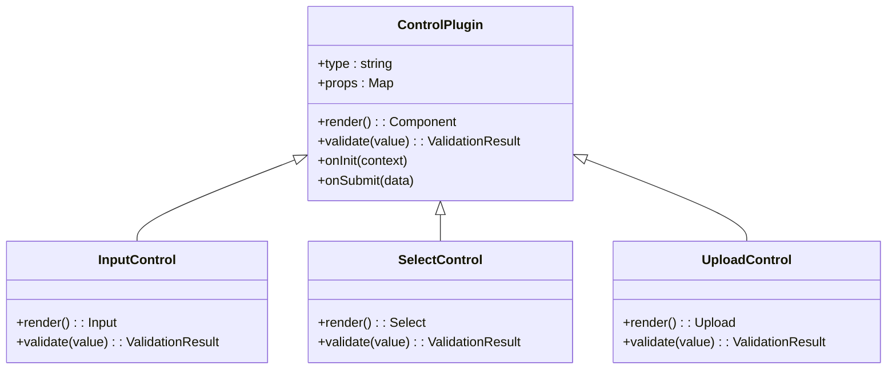
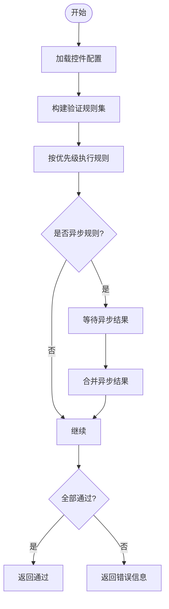
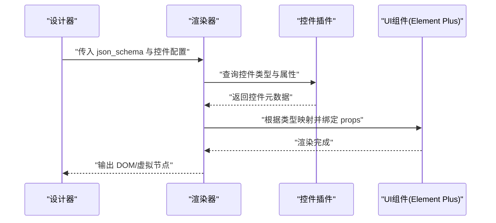
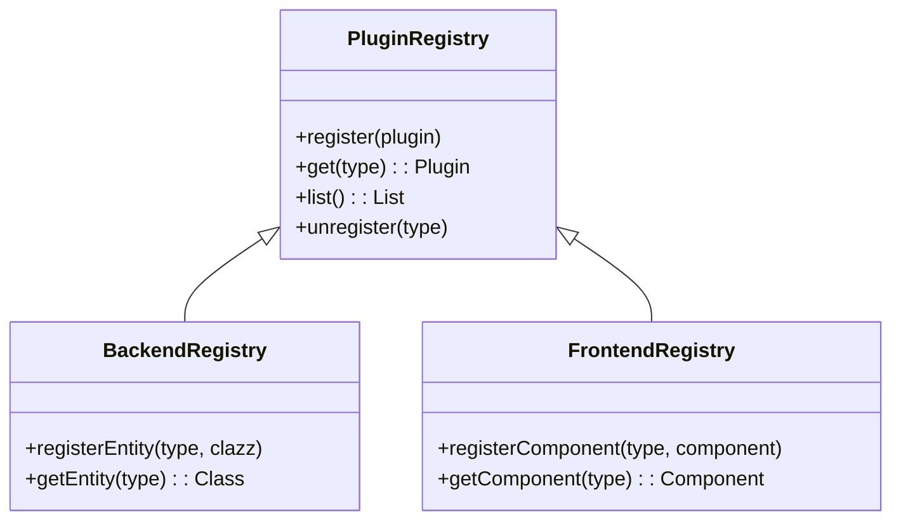
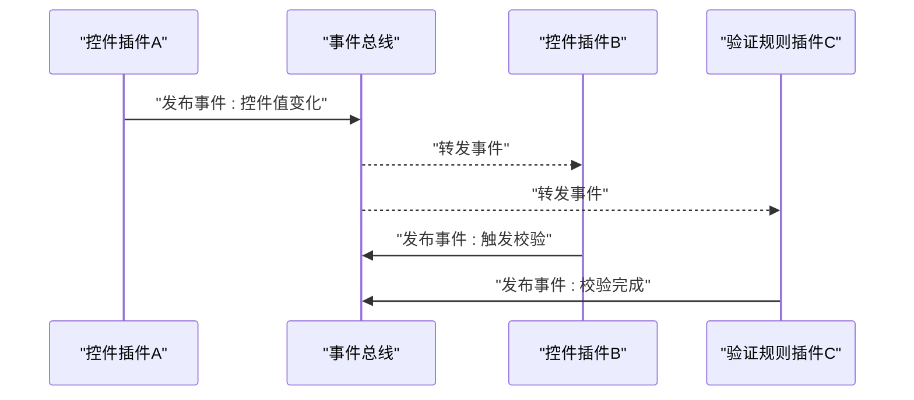
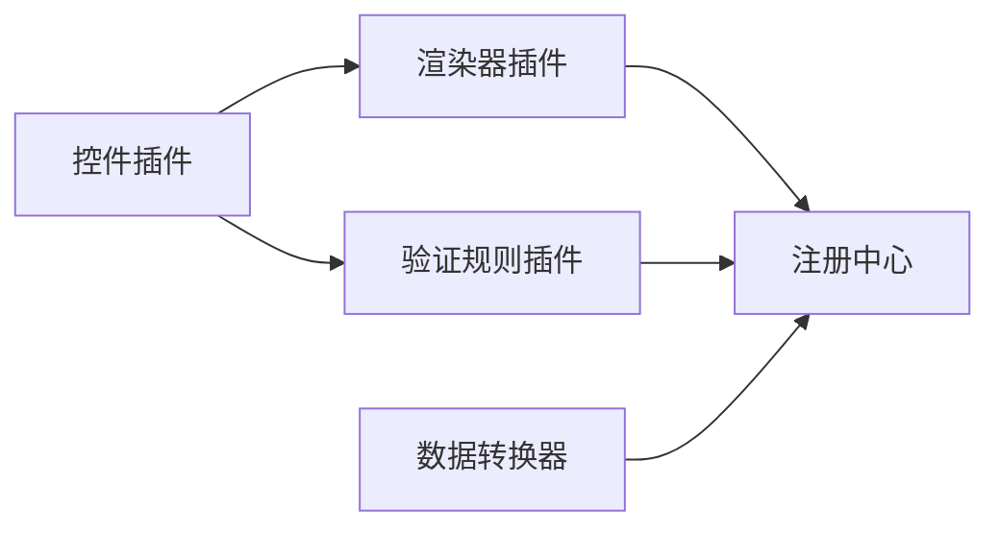

# 插件系统设计

<cite>
**本文档引用的文件**
- [VAT_EPR_动态表单技术方案.md](file://VAT_EPR_动态表单技术方案.md)
</cite>

## 目录
1. [引言](#引言)
2. [项目结构](#项目结构)
3. [核心组件](#核心组件)
4. [架构总览](#架构总览)
5. [详细组件分析](#详细组件分析)
6. [依赖关系分析](#依赖关系分析)
7. [性能考量](#性能考量)
8. [故障排查指南](#故障排查指南)
9. [结论](#结论)
10. [附录](#附录)

## 引言
本文件面向动态表单系统的插件化扩展需求，基于现有技术方案，提出一套可演进的插件系统设计。该设计以“控件插件”“验证规则插件”“渲染器插件”为核心扩展点，结合统一的注册机制、生命周期管理与依赖注入配置，支持插件间通信、事件系统与状态共享，并给出安全性、版本兼容性与升级策略建议。本文档严格依据仓库中的技术方案文档进行归纳与扩展，确保与现有实现保持一致。

## 项目结构
动态表单系统采用前后端分离架构：
- 后端基于 Spring Boot 3.2.x + MyBatis-Plus，提供表单控件、模板与实例的管理能力，并通过表单数据转换器完成从 Map 到业务实体对象的映射。
- 前端基于 Vue 3.4.x + Vite + Element Plus，提供动态表单渲染、设计器（拖拽画板）与状态管理。

图表来源
- [VAT_EPR_动态表单技术方案.md:773-869](file://VAT_EPR_动态表单技术方案.md#L773-L869)

章节来源
- [VAT_EPR_动态表单技术方案.md:773-869](file://VAT_EPR_动态表单技术方案.md#L773-L869)

## 核心组件
围绕插件系统，以下核心组件承担扩展职责：
- 控件插件：负责定义控件类型、属性与行为，支持 INPUT/SELECT/SWITCH/UPLOAD/TEXTAREA/DATE/NUMBER 等。
- 验证规则插件：根据控件配置动态生成校验规则（如必填、正则、长度等），并与控件渲染联动。
- 渲染器插件：根据控件类型将抽象配置映射为具体 UI 组件（Element Plus 组件）。
- 注册中心：集中管理控件、验证规则与渲染器的注册与发现。
- 生命周期钩子：提供初始化、渲染前/后、校验前/后、提交前/后的扩展点。
- 依赖注入容器：通过 Spring 管理插件实例与协作关系。
- 事件总线/状态共享：跨插件通信与状态同步机制。

章节来源
- [VAT_EPR_动态表单技术方案.md:482-590](file://VAT_EPR_动态表单技术方案.md#L482-L590)
- [VAT_EPR_动态表单技术方案.md:592-728](file://VAT_EPR_动态表单技术方案.md#L592-L728)

## 架构总览
插件系统以“配置驱动 + 插件注册 + 生命周期钩子 + 事件总线”的方式组织，形成松耦合、可扩展的动态表单生态。

图表来源
- [VAT_EPR_动态表单技术方案.md:482-590](file://VAT_EPR_动态表单技术方案.md#L482-L590)
- [VAT_EPR_动态表单技术方案.md:592-728](file://VAT_EPR_动态表单技术方案.md#L592-L728)

## 详细组件分析

### 控件插件开发
控件插件负责定义控件的元数据、属性与行为，包括：
- 控件类型标识（如 INPUT/SELECT/UPLOAD 等）
- 默认属性（如 placeholder、tips、默认值）
- 业务属性（如 select_options、upload_config）
- 渲染映射（将控件类型映射到具体 UI 组件）

实现要点：
- 在后端，控件元数据存储于数据库表，前端通过 API 获取并缓存控件配置。
- 在前端，控件插件以组件形式存在，渲染器根据控件类型动态选择对应组件。
- 控件插件应提供标准化的属性接口，便于统一校验与渲染。

图表来源
- [VAT_EPR_动态表单技术方案.md:33-65](file://VAT_EPR_动态表单技术方案.md#L33-L65)
- [VAT_EPR_动态表单技术方案.md:531-578](file://VAT_EPR_动态表单技术方案.md#L531-L578)

章节来源
- [VAT_EPR_动态表单技术方案.md:33-65](file://VAT_EPR_动态表单技术方案.md#L33-L65)
- [VAT_EPR_动态表单技术方案.md:531-578](file://VAT_EPR_动态表单技术方案.md#L531-L578)

### 验证规则插件
验证规则插件根据控件配置动态生成校验规则，包括：
- 必填规则（required）
- 正则规则（regex_pattern + regex_message）
- 长度规则（min_length / max_length）
- 自定义规则（通过插件扩展点注册）

实现要点：
- 规则生成与执行应与控件渲染解耦，通过统一的规则工厂或注册中心聚合。
- 支持异步校验（如远程校验）与批量校验。
- 规则插件应提供优先级与依赖声明，确保执行顺序正确。

图表来源
- [VAT_EPR_动态表单技术方案.md:482-590](file://VAT_EPR_动态表单技术方案.md#L482-L590)

章节来源
- [VAT_EPR_动态表单技术方案.md:482-590](file://VAT_EPR_动态表单技术方案.md#L482-L590)

### 渲染器插件
渲染器插件负责将控件类型映射为具体的 UI 组件，并处理属性绑定与事件传播：
- 根据 controlType 选择对应组件（如 el-input、el-select 等）
- 将控件配置映射为组件 props
- 处理 v-model、事件监听与样式适配

实现要点：
- 渲染器应支持主题与样式定制。
- 支持复杂布局（网格、栅格）与响应式。
- 提供渲染钩子，允许插件在渲染前后注入逻辑。

图表来源
- [VAT_EPR_动态表单技术方案.md:531-578](file://VAT_EPR_动态表单技术方案.md#L531-L578)

章节来源
- [VAT_EPR_动态表单技术方案.md:531-578](file://VAT_EPR_动态表单技术方案.md#L531-L578)

### 插件注册机制
插件注册机制用于集中管理插件的发现、装配与生命周期：
- 后端：通过注解扫描或静态注册表（如 CLASS_REGISTRY）管理实体类与插件。
- 前端：通过插件注册表维护控件类型到组件的映射。
- 统一注册中心：提供插件注册、查询、更新与卸载能力。

图表来源
- [VAT_EPR_动态表单技术方案.md:592-728](file://VAT_EPR_动态表单技术方案.md#L592-L728)

章节来源
- [VAT_EPR_动态表单技术方案.md:592-728](file://VAT_EPR_动态表单技术方案.md#L592-L728)

### 生命周期管理
生命周期钩子贯穿插件的整个运行周期，提供扩展点：
- 初始化：插件加载与资源准备
- 渲染前/后：对渲染过程进行拦截与增强
- 校验前/后：对校验过程进行拦截与增强
- 提交前/后：对提交过程进行拦截与增强

图表来源
- [VAT_EPR_动态表单技术方案.md:592-728](file://VAT_EPR_动态表单技术方案.md#L592-L728)

章节来源
- [VAT_EPR_动态表单技术方案.md:592-728](file://VAT_EPR_动态表单技术方案.md#L592-L728)

### 依赖注入配置
依赖注入用于管理插件实例与协作关系：
- 后端：Spring 容器管理插件 Bean 的创建、注入与销毁。
- 前端：通过模块化与依赖管理工具（如 Vite）实现插件的按需加载与注入。
- 配置方式：注解扫描、XML 配置或程序化注册。

章节来源
- [VAT_EPR_动态表单技术方案.md:592-728](file://VAT_EPR_动态表单技术方案.md#L592-L728)

### 插件间通信、事件系统与状态共享
- 事件系统：通过事件总线实现插件间的松耦合通信，支持事件订阅、发布与传播。
- 状态共享：通过全局状态管理（Pinia）或插件内部状态，实现跨插件的状态同步。
- 通信模式：观察者模式、发布/订阅模式与命令模式相结合。

图表来源
- [VAT_EPR_动态表单技术方案.md:531-578](file://VAT_EPR_动态表单技术方案.md#L531-L578)

章节来源
- [VAT_EPR_动态表单技术方案.md:531-578](file://VAT_EPR_动态表单技术方案.md#L531-L578)

## 依赖关系分析
插件系统与现有核心组件的依赖关系如下：
- 控件插件依赖渲染器插件进行 UI 映射
- 验证规则插件依赖控件插件提供的配置
- 渲染器插件依赖注册中心获取控件元数据
- 数据转换器依赖实体类注册表完成对象映射

图表来源
- [VAT_EPR_动态表单技术方案.md:592-728](file://VAT_EPR_动态表单技术方案.md#L592-L728)

章节来源
- [VAT_EPR_动态表单技术方案.md:592-728](file://VAT_EPR_动态表单技术方案.md#L592-L728)

## 性能考量
- 渲染性能：通过虚拟滚动、懒加载与组件缓存优化大规模表单渲染。
- 校验性能：将规则拆分为同步/异步两类，避免阻塞主线程。
- 数据转换性能：批量转换与类型转换缓存减少反射开销。
- 事件系统性能：事件去抖、节流与批量处理降低高频事件影响。

## 故障排查指南
- 控件未显示：检查控件类型是否在注册中心注册，渲染器是否正确映射。
- 校验不生效：确认控件配置中的验证规则是否正确生成，规则插件是否启用。
- 数据转换失败：核对 controlKey 格式与实体类注册表，确保字段匹配。
- 提交异常：检查状态机流转与生命周期钩子，定位提交前/后钩子的异常。

章节来源
- [VAT_EPR_动态表单技术方案.md:856-869](file://VAT_EPR_动态表单技术方案.md#L856-L869)

## 结论
通过引入控件插件、验证规则插件与渲染器插件，结合统一的注册中心、生命周期钩子与事件系统，动态表单系统可实现高度可扩展与可演进的插件化架构。该设计在保证现有功能稳定的同时，为未来扩展新的控件类型、校验规则与渲染能力提供了清晰路径。

## 附录
- 安全性：对敏感字段进行脱敏存储，提交后锁定实例状态，防止二次篡改。
- 版本兼容性：模板发布后禁止修改 json_schema，变更需升版本号；实体类注册表需向后兼容。
- 升级策略：采用渐进式升级与灰度发布，确保插件版本与核心系统版本兼容。