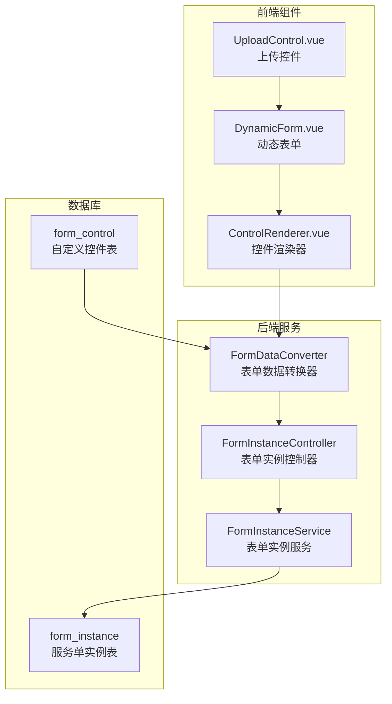
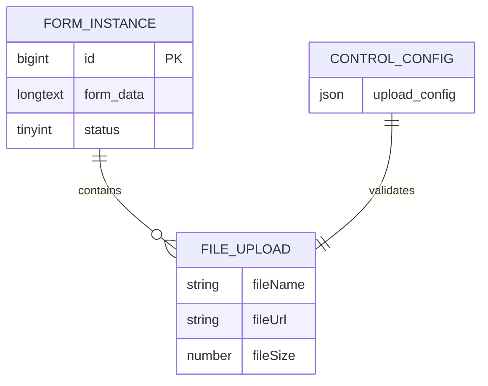
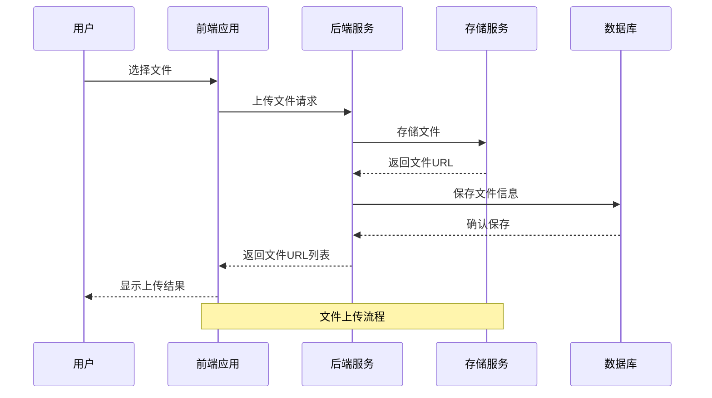
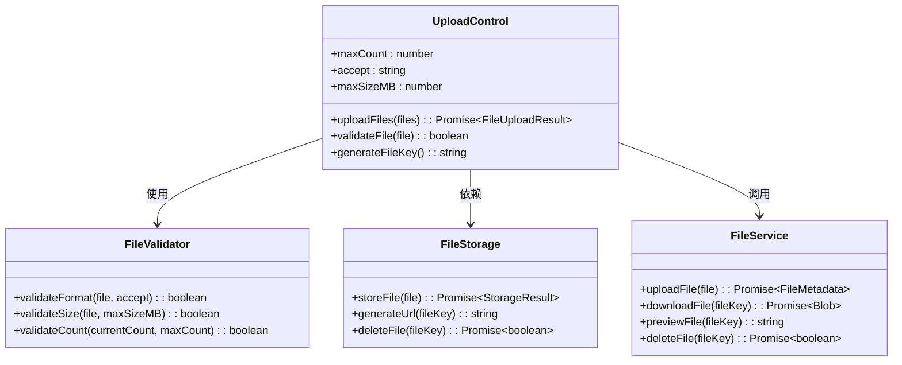
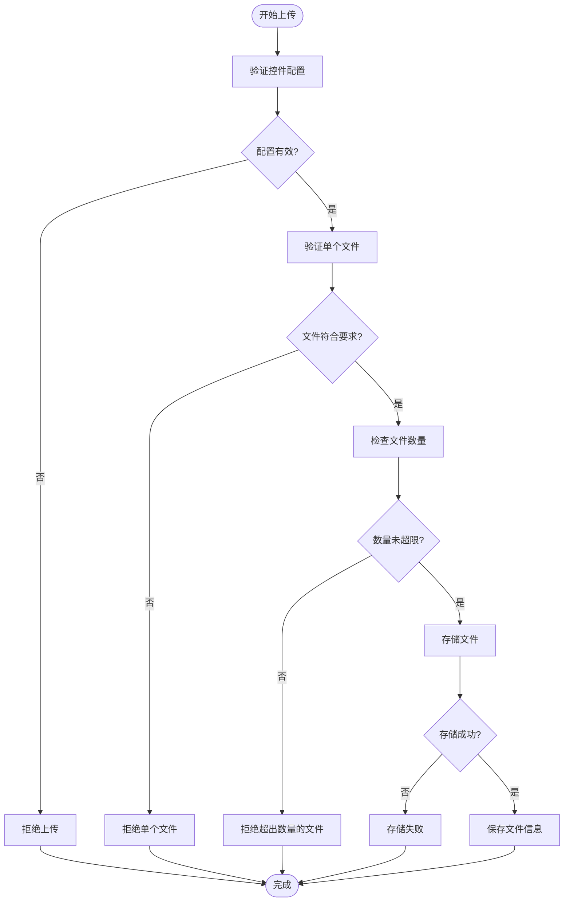
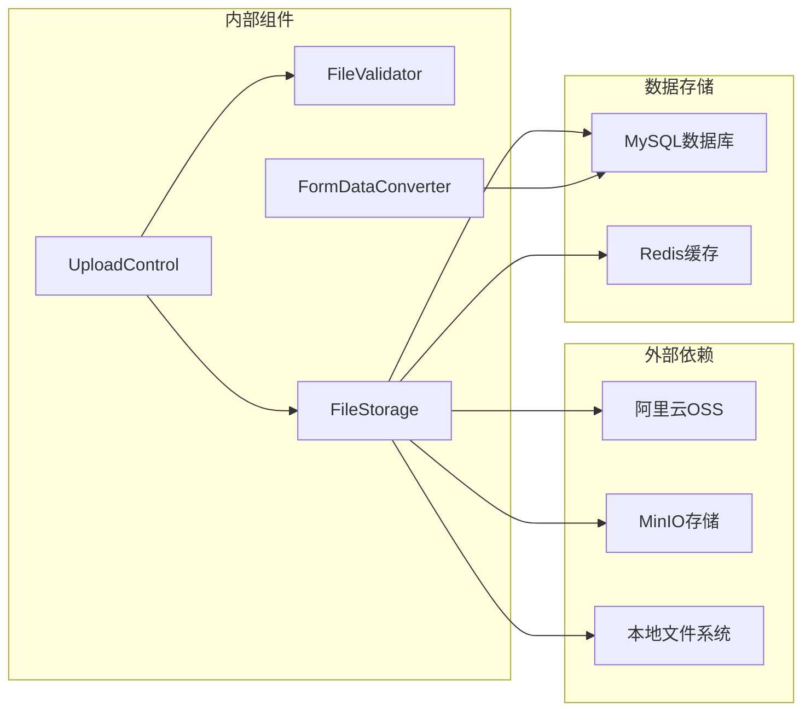

# 文件上传服务集成

<cite>
**本文档引用的文件**
- [VAT_EPR_动态表单技术方案.md](file://VAT_EPR_动态表单技术方案.md)
</cite>

## 目录
1. [简介](#简介)
2. [项目结构](#项目结构)
3. [核心组件](#核心组件)
4. [架构概览](#架构概览)
5. [详细组件分析](#详细组件分析)
6. [依赖关系分析](#依赖关系分析)
7. [性能考虑](#性能考虑)
8. [故障排除指南](#故障排除指南)
9. [结论](#结论)

## 简介

本文档详细说明了VAT&EPR动态表单系统中的文件上传服务集成方案。该系统支持多种文件上传控件配置，包括本地存储和云存储服务集成，提供了完整的文件上传、验证、存储和管理功能。

## 项目结构

基于技术方案文档，文件上传功能主要涉及以下组件：

**图表来源**
- [VAT_EPR_动态表单技术方案.md: 482-548:482-548](file://VAT_EPR_动态表单技术方案.md#L482-L548)
- [VAT_EPR_动态表单技术方案.md: 773-852:773-852](file://VAT_EPR_动态表单技术方案.md#L773-L852)

**章节来源**
- [VAT_EPR_动态表单技术方案.md: 482-548:482-548](file://VAT_EPR_动态表单技术方案.md#L482-L548)
- [VAT_EPR_动态表单技术方案.md: 773-852:773-852](file://VAT_EPR_动态表单技术方案.md#L773-L852)

## 核心组件

### UPLOAD控件配置参数

UPLOAD控件通过`upload_config`字段进行配置，支持以下参数：

| 参数名 | 类型 | 必填 | 默认值 | 描述 |
|--------|------|------|--------|------|
| maxCount | number | 否 | 无限制 | 最大文件数量限制 |
| accept | string | 否 | 无限制 | 接受的文件类型，支持逗号分隔的MIME类型或扩展名 |
| maxSizeMB | number | 否 | 无限制 | 单个文件最大大小（MB） |

**章节来源**
- [VAT_EPR_动态表单技术方案.md: 49](file://VAT_EPR_动态表单技术方案.md#L49)
- [VAT_EPR_动态表单技术方案.md: 541](file://VAT_EPR_动态表单技术方案.md#L541)

### 文件存储策略

系统采用统一的文件存储策略：

**图表来源**
- [VAT_EPR_动态表单技术方案.md: 587](file://VAT_EPR_动态表单技术方案.md#L587)

文件存储格式：
- **存储位置**：`form_instance.form_data`字段存储JSON格式的文件信息列表
- **文件信息结构**：包含`fileName`、`fileUrl`、`fileSize`三个核心字段
- **数据类型**：文件上传值为数组格式，每个元素代表一个已上传文件

**章节来源**
- [VAT_EPR_动态表单技术方案.md: 587](file://VAT_EPR_动态表单技术方案.md#L587)

## 架构概览

文件上传系统的整体架构如下：

**图表来源**
- [VAT_EPR_动态表单技术方案.md: 541](file://VAT_EPR_动态表单技术方案.md#L541)

## 详细组件分析

### UPLOAD控件实现

UPLOAD控件在前端的实现遵循以下模式：

**图表来源**
- [VAT_EPR_动态表单技术方案.md: 541](file://VAT_EPR_动态表单技术方案.md#L541)

### 文件验证机制

系统实现了多层次的文件验证机制：

**图表来源**
- [VAT_EPR_动态表单技术方案.md: 541](file://VAT_EPR_动态表单技术方案.md#L541)

### 云存储服务集成

#### OSS（阿里云对象存储）集成

OSS集成方案支持以下特性：
- **自动签名URL生成**：支持临时访问令牌
- **多区域部署**：支持全球多个数据中心
- **CDN加速**：内置CDN优化
- **安全防护**：支持防盗链和访问控制

#### MinIO集成

MinIO提供企业级对象存储：
- **开源免费**：完全开源的S3兼容存储
- **高可用性**：支持分布式部署
- **S3兼容**：完全兼容AWS S3 API
- **本地部署**：支持私有云和本地部署

#### 本地存储实现

本地存储方案适用于小规模应用：
- **文件系统存储**：直接存储到服务器文件系统
- **相对路径管理**：使用相对路径确保可移植性
- **静态资源服务**：通过Web服务器提供文件访问
- **磁盘空间监控**：定期清理过期文件

**章节来源**
- [VAT_EPR_动态表单技术方案.md: 864](file://VAT_EPR_动态表单技术方案.md#L864)

### 文件下载、预览和删除功能

#### 文件下载实现

文件下载功能支持多种场景：
- **直接下载**：用户点击文件链接直接下载
- **预览模式**：支持图片、PDF等文件的在线预览
- **批量下载**：支持多个文件的打包下载
- **权限控制**：基于用户权限的访问控制

#### 文件预览机制

系统支持多种文件类型的在线预览：
- **图片文件**：JPG、PNG、GIF等格式的实时预览
- **文档文件**：PDF、DOC、XLS等格式的在线查看
- **压缩文件**：ZIP、RAR等格式的目录浏览
- **多媒体文件**：MP4、MP3等格式的播放支持

#### 文件删除流程

文件删除采用安全的删除机制：
- **软删除**：先标记删除状态，保留恢复能力
- **物理删除**：定时清理超过保留期限的文件
- **级联删除**：删除表单实例时自动清理关联文件
- **权限验证**：严格验证删除操作的权限

**章节来源**
- [VAT_EPR_动态表单技术方案.md: 587](file://VAT_EPR_动态表单技术方案.md#L587)

## 依赖关系分析

文件上传功能的依赖关系如下：

**图表来源**
- [VAT_EPR_动态表单技术方案.md: 773-852:773-852](file://VAT_EPR_动态表单技术方案.md#L773-L852)

**章节来源**
- [VAT_EPR_动态表单技术方案.md: 773-852:773-852](file://VAT_EPR_动态表单技术方案.md#L773-L852)

## 性能考虑

### 存储性能优化

- **分片上传**：支持大文件的分片上传，提高传输稳定性
- **并发上传**：支持多文件并发上传，提升用户体验
- **缓存策略**：合理使用Redis缓存文件元数据
- **CDN加速**：云存储服务自带CDN优化

### 安全验证机制

- **文件类型验证**：服务端和客户端双重验证
- **文件大小限制**：防止恶意文件上传
- **病毒扫描**：集成安全扫描服务
- **访问控制**：基于角色的文件访问权限控制

## 故障排除指南

### 常见问题及解决方案

| 问题类型 | 症状 | 可能原因 | 解决方案 |
|----------|------|----------|----------|
| 上传失败 | 文件无法上传 | 网络连接问题 | 检查网络连接，重试上传 |
| 格式错误 | 文件类型不被接受 | MIME类型不匹配 | 修改accept配置或调整文件类型 |
| 大小超限 | 文件过大被拒绝 | 超过maxSizeMB限制 | 降低文件大小或调整配置 |
| 存储失败 | 文件存储异常 | 存储服务不可用 | 检查存储服务状态，切换存储方案 |
| 权限不足 | 无法访问文件 | 权限配置错误 | 检查用户权限和文件访问控制 |

### 调试建议

1. **启用详细日志**：开启文件上传的详细日志记录
2. **监控存储空间**：定期检查存储空间使用情况
3. **测试连接**：定期测试与云存储服务的连接状态
4. **备份策略**：建立文件备份和恢复机制

**章节来源**
- [VAT_EPR_动态表单技术方案.md: 856-869:856-869](file://VAT_EPR_动态表单技术方案.md#L856-L869)

## 结论

VAT&EPR动态表单系统的文件上传服务集成了灵活的配置机制和多种存储方案。通过UPLOAD控件的配置参数，可以精确控制文件上传的行为；通过统一的文件存储策略，实现了文件信息的标准化管理。系统支持本地存储和云存储服务，为不同规模的应用提供了合适的解决方案。

关键优势包括：
- **灵活的配置**：通过upload_config实现精确的上传控制
- **统一的存储**：标准化的文件信息存储格式
- **多存储支持**：支持OSS、MinIO和本地存储
- **完整的生命周期**：从上传到删除的全流程管理
- **安全可靠**：多重验证和权限控制机制

该系统为动态表单场景下的文件管理提供了完整的技术解决方案，可根据具体需求选择合适的存储方案和配置参数。