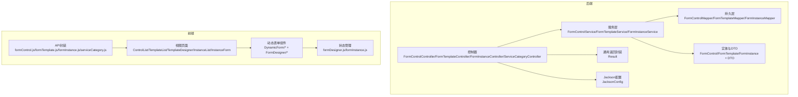
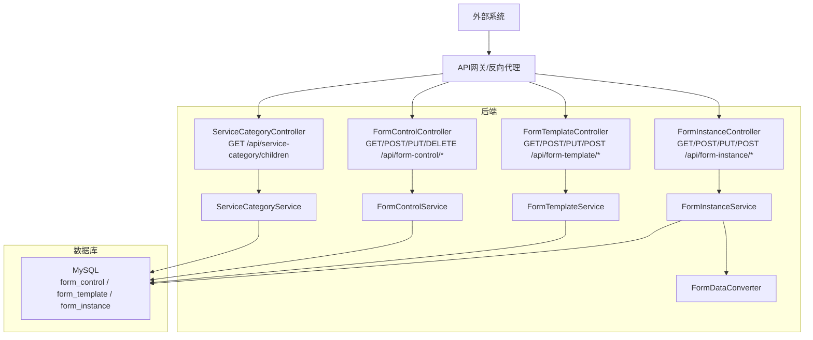
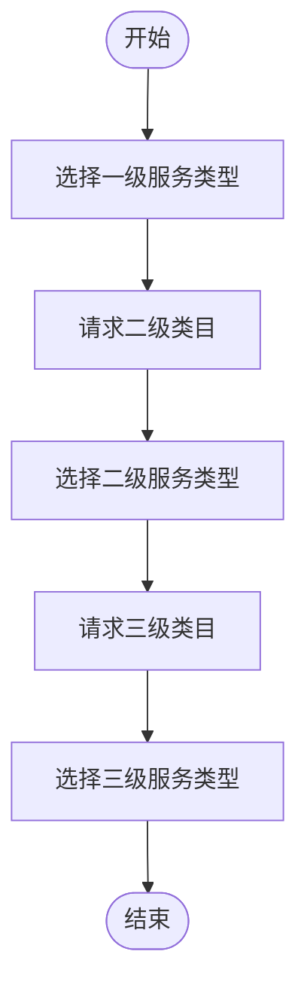
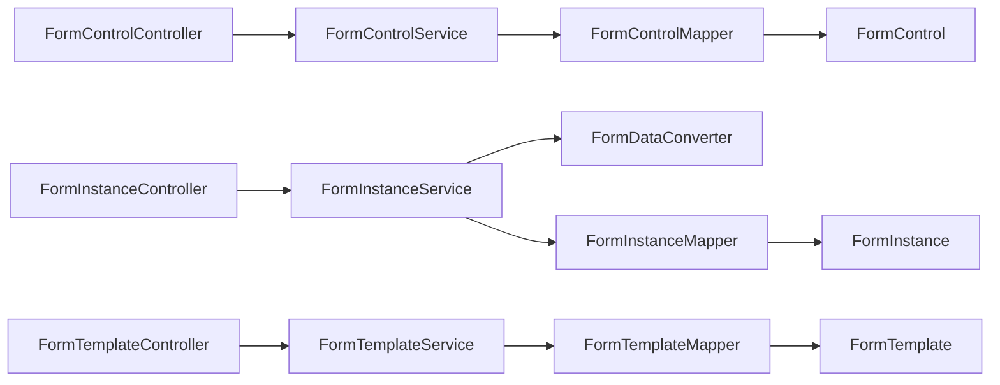

# 第三方系统对接

<cite>
**本文档引用的文件**
- [VAT_EPR_动态表单技术方案.md](file://VAT_EPR_动态表单技术方案.md)
</cite>

## 目录
1. [简介](#简介)
2. [项目结构](#项目结构)
3. [核心组件](#核心组件)
4. [架构总览](#架构总览)
5. [详细组件分析](#详细组件分析)
6. [依赖关系分析](#依赖关系分析)
7. [性能考虑](#性能考虑)
8. [故障排查指南](#故障排查指南)
9. [结论](#结论)
10. [附录](#附录)

## 简介
本文件面向第三方系统对接场景，围绕“服务类目API透传机制”“国家代码管理与服务类型三级联动”“数据同步策略”“与现有业务系统的API对接示例与数据映射”“权限认证与接口安全”“异步处理与监控告警”等方面进行系统化说明。基于仓库中的技术方案文档，我们提炼出可直接用于对接的接口、数据模型、时序流程与最佳实践，帮助外部系统快速完成集成。

## 项目结构
后端采用Spring Boot + MyBatis-Plus架构，前端采用Vue 3 + Element Plus。项目按功能模块划分清晰：
- 后端模块：控制器、服务、持久层、实体、DTO、通用返回封装、JSON配置等
- 前端模块：API封装、视图页面、动态表单组件、设计器、状态管理等

图表来源
- [VAT_EPR_动态表单技术方案.md:776-813](file://VAT_EPR_动态表单技术方案.md#L776-L813)
- [VAT_EPR_动态表单技术方案.md:815-852](file://VAT_EPR_动态表单技术方案.md#L815-L852)

章节来源
- [VAT_EPR_动态表单技术方案.md:776-813](file://VAT_EPR_动态表单技术方案.md#L776-L813)
- [VAT_EPR_动态表单技术方案.md:815-852](file://VAT_EPR_动态表单技术方案.md#L815-L852)

## 核心组件
- 服务类目API：提供国家代码与服务类型的三级联动查询能力，支持透传既有系统数据
- 表单控件API：管理控件元数据，支撑动态表单渲染
- 表单模板API：管理模板及版本，承载布局与控件引用
- 表单实例API：创建、保存草稿、提交，支持将表单数据转换为业务实体对象
- 数据转换器：将Map<controlKey,value>转换为业务实体对象，支持多实体聚合

章节来源
- [VAT_EPR_动态表单技术方案.md:389-396](file://VAT_EPR_动态表单技术方案.md#L389-L396)
- [VAT_EPR_动态表单技术方案.md:169-387](file://VAT_EPR_动态表单技术方案.md#L169-L387)
- [VAT_EPR_动态表单技术方案.md:594-728](file://VAT_EPR_动态表单技术方案.md#L594-L728)

## 架构总览
系统采用前后端分离架构，后端提供REST API，前端通过Axios调用接口。服务类目API作为“透传层”，将国家与服务类型数据与既有系统对接；表单相关API负责动态表单的全生命周期管理。

图表来源
- [VAT_EPR_动态表单技术方案.md:169-387](file://VAT_EPR_动态表单技术方案.md#L169-L387)
- [VAT_EPR_动态表单技术方案.md:594-728](file://VAT_EPR_动态表单技术方案.md#L594-L728)

## 详细组件分析

### 服务类目API（透传机制）
- 接口定义
  - GET /api/service-category/children?parentId=0 获取一级类目
  - GET /api/service-category/children?parentId=1 获取二级类目
  - GET /api/service-category/children?parentId=3 获取三级类目
- 透传策略
  - 该接口作为“透传层”，将国家与服务类型数据从既有系统同步至本地，供前端三级联动使用
  - 外部系统需提供国家代码与服务类型编码的映射，确保与数据库中国家代码与服务编码一致
- 数据一致性
  - 建议通过定时任务或事件驱动方式同步国家与服务类型数据，避免手工维护导致不一致
  - 同步策略可参考“数据同步策略”章节

章节来源
- [VAT_EPR_动态表单技术方案.md:389-396](file://VAT_EPR_动态表单技术方案.md#L389-L396)
- [VAT_EPR_动态表单技术方案.md:732-770](file://VAT_EPR_动态表单技术方案.md#L732-L770)

### 国家代码管理与服务类型分类
- 国家代码枚举
  - 支持国家代码：DEU（德国）、FRA（法国）、ITA（意大利）、ESP（西班牙）、POL（波兰）、CZE（捷克）、GBR（英国）
- 服务类型分类
  - 一级：VAT服务(01) / EPR服务(02)
  - 二级：VAT服务(0101) / 包装法(0201) / WEEE法(0202) / ...
  - 三级：VAT新注册申报(010101) / VAT转代理申报(010102) / ...

图表来源
- [VAT_EPR_动态表单技术方案.md:732-770](file://VAT_EPR_动态表单技术方案.md#L732-L770)

章节来源
- [VAT_EPR_动态表单技术方案.md:732-770](file://VAT_EPR_动态表单技术方案.md#L732-L770)

### 三级联动的数据同步策略
- 同步触发
  - 定时任务：每日凌晨同步国家与服务类型数据
  - 事件驱动：当既有系统发生变更时，推送变更事件至消息队列，触发增量同步
- 同步内容
  - 国家代码与国家名称映射
  - 服务类型编码与层级关系（L1/L2/L3）
- 冲突处理
  - 若既有系统与本地存在冲突，以既有系统为准，并记录差异日志
- 缓存策略
  - 前端与后端均缓存国家与服务类型数据，减少重复查询

章节来源
- [VAT_EPR_动态表单技术方案.md:732-770](file://VAT_EPR_动态表单技术方案.md#L732-L770)

### 与现有业务系统的API对接示例与数据映射
- 表单控件API
  - 创建控件：POST /api/form-control
  - 查询控件列表：GET /api/form-control/list
  - 更新控件：PUT /api/form-control/{id}
  - 删除控件：DELETE /api/form-control/{id}
- 表单模板API
  - 创建/保存模板：POST /api/form-template
  - 查询模板列表：GET /api/form-template/list
  - 查询模板详情：GET /api/form-template/{id}
  - 更新模板：PUT /api/form-template/{id}
  - 发布模板：POST /api/form-template/{id}/publish
- 表单实例API
  - 创建实例：POST /api/form-instance/create
  - 保存草稿：PUT /api/form-instance/{id}/save
  - 提交实例：POST /api/form-instance/{id}/submit
  - 查询实例列表：GET /api/form-instance/list

数据映射要点
- controlKey命名规范：ClassName.fieldName，与实体类字段一一对应
- form_data存储：Map<controlKey, value>序列化为JSON字符串
- 提交后状态更新：提交后状态变更为已提交，禁止再次修改

章节来源
- [VAT_EPR_动态表单技术方案.md:169-387](file://VAT_EPR_动态表单技术方案.md#L169-L387)
- [VAT_EPR_动态表单技术方案.md:580-590](file://VAT_EPR_动态表单技术方案.md#L580-L590)

### 权限认证、数据加密与接口安全
- 权限认证
  - 建议采用统一认证中心（如OAuth2/JWT），在网关层进行鉴权与授权
  - 对关键接口（如模板发布、实例提交）增加二次确认或审批流程
- 数据加密
  - 敏感字段在存储前进行脱敏处理（如身份证号、手机号）
  - 传输层使用HTTPS，内部服务间通信建议启用mTLS
- 接口安全
  - 限制请求频率（限流），防止恶意刷量
  - 参数校验与白名单过滤，避免注入攻击
  - 对外开放接口需具备访问日志与审计追踪

章节来源
- [VAT_EPR_动态表单技术方案.md:856-869](file://VAT_EPR_动态表单技术方案.md#L856-L869)

### 异步处理、错误重试与监控告警
- 异步处理
  - 表单提交后的业务处理建议异步执行，避免阻塞接口响应
  - 使用消息队列（如RabbitMQ/Kafka）解耦业务逻辑
- 错误重试
  - 对外调用失败时，采用指数退避重试策略
  - 设置最大重试次数与超时阈值，防止雪崩效应
- 监控告警
  - 接口级指标：QPS、延迟、错误率、成功率
  - 业务级指标：模板发布数、实例提交数、数据转换失败率
  - 告警通道：邮件/企业微信/钉钉，分级处理

章节来源
- [VAT_EPR_动态表单技术方案.md:594-728](file://VAT_EPR_动态表单技术方案.md#L594-L728)

## 依赖关系分析
后端各层职责清晰，控制器依赖服务层，服务层依赖持久层，实体与DTO承担数据传输职责。前端通过API封装与后端交互，动态表单组件负责渲染与校验。

图表来源
- [VAT_EPR_动态表单技术方案.md:776-813](file://VAT_EPR_动态表monitors.md#L776-L813)

章节来源
- [VAT_EPR_动态表单技术方案.md:776-813](file://VAT_EPR_动态表单技术方案.md#L776-L813)

## 性能考虑
- 数据库优化
  - 为常用查询字段建立索引（如模板ID、国家代码、服务编码）
  - 分页查询参数合理设置，避免全表扫描
- 缓存策略
  - 国家与服务类型数据缓存于Redis，设置合理TTL
  - 前端对控件列表与模板详情进行本地缓存
- 接口优化
  - 控制响应体大小，避免一次性返回过多数据
  - 对批量操作采用分批处理与进度反馈

## 故障排查指南
- 控件创建失败
  - 检查controlKey格式是否符合“ClassName.fieldName”
  - 确认controlKey在数据库中唯一
- 表单提交异常
  - 查看FormDataConverter转换日志，确认实体类是否注册
  - 核对form_data中字段与实体类字段是否匹配
- 三级联动无数据
  - 确认服务类目同步任务是否正常运行
  - 检查parentId参数是否正确传递

章节来源
- [VAT_EPR_动态表单技术方案.md:594-728](file://VAT_EPR_动态表单技术方案.md#L594-L728)
- [VAT_EPR_动态表单技术方案.md:856-869](file://VAT_EPR_动态表单技术方案.md#L856-L869)

## 结论
通过服务类目API的透传机制与国家代码、服务类型三级联动的设计，系统能够高效对接既有业务系统并实现动态表单的全生命周期管理。结合完善的权限认证、数据加密与接口安全策略，以及异步处理、错误重试与监控告警机制，可确保第三方系统对接的稳定性与安全性。

## 附录
- 术语说明
  - controlKey：控件标识，格式为“ClassName.fieldName”
  - L1/L2/L3：服务类型的一级、二级、三级编码
  - FormDataConverter：表单数据转换器，负责将Map转换为业务实体对象
- 参考路径
  - 服务类目API：[VAT_EPR_动态表单技术方案.md:389-396](file://VAT_EPR_动态表单技术方案.md#L389-L396)
  - 表单控件API：[VAT_EPR_动态表单技术方案.md:169-222](file://VAT_EPR_动态表单技术方案.md#L169-L222)
  - 表单模板API：[VAT_EPR_动态表单技术方案.md:225-304](file://VAT_EPR_动态表单技术方案.md#L225-L304)
  - 表单实例API：[VAT_EPR_动态表单技术方案.md:306-387](file://VAT_EPR_动态表单技术方案.md#L306-L387)
  - 数据转换器：[VAT_EPR_动态表单技术方案.md:594-728](file://VAT_EPR_动态表单技术方案.md#L594-L728)