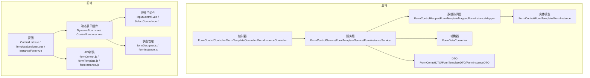
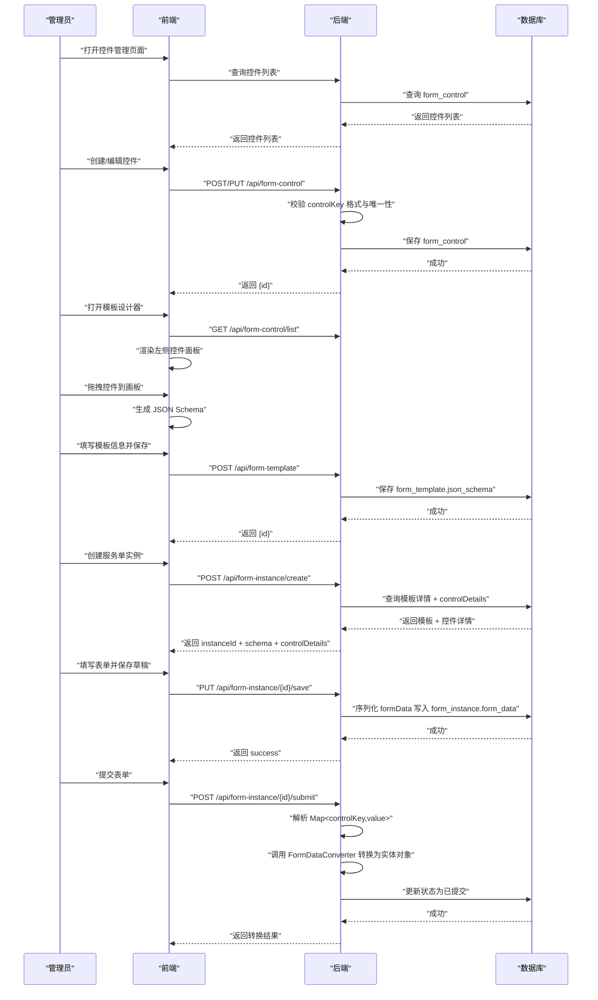
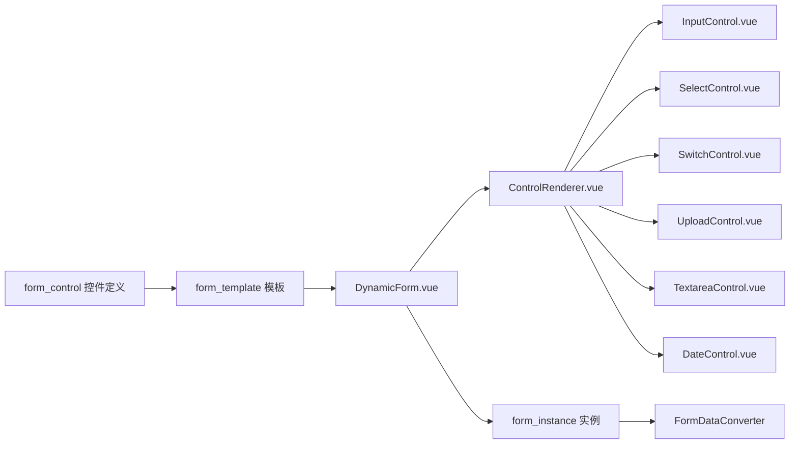

# 自定义控件开发

<cite>
**本文引用的文件**
- [VAT_EPR_动态表单技术方案.md](file://VAT_EPR_动态表单技术方案.md)
</cite>

## 目录
1. [简介](#简介)
2. [项目结构](#项目结构)
3. [核心组件](#核心组件)
4. [架构总览](#架构总览)
5. [详细组件分析](#详细组件分析)
6. [依赖分析](#依赖分析)
7. [性能考虑](#性能考虑)
8. [故障排查指南](#故障排查指南)
9. [结论](#结论)
10. [附录](#附录)

## 简介
本文件面向“自定义控件开发”的工程实践，基于仓库中的技术方案文档，系统阐述控件注册机制、controlKey 命名规范、控件类型定义与实现方法，并给出 INPUT、SELECT、SWITCH、UPLOAD、TEXTAREA、DATE、NUMBER 等控件类型的落地要点。同时，提供控件验证规则配置、上传文件配置与默认值设置的示例路径，说明前端渲染器实现、前端组件映射与后端数据处理流程，最后总结扩展最佳实践与性能优化建议。

## 项目结构
后端采用 Spring Boot + MyBatis-Plus，前端采用 Vue 3 + Element Plus + Vite 的典型分层结构：
- 后端模块划分：controller、service、mapper、entity、converter、dto、common
- 前端模块划分：views（视图）、components（组件）、stores（状态）、api（接口）

图表来源
- [VAT_EPR_动态表单技术方案.md](file://VAT_EPR_动态表单技术方案.md)

章节来源
- [VAT_EPR_动态表单技术方案.md](file://VAT_EPR_动态表单技术方案.md)

## 核心组件
- 控件定义表：用于持久化控件元数据，包括 controlKey、controlType、校验规则、上传配置、默认值等。
- 模板表：用于持久化表单布局与控件引用，形成 JSON Schema。
- 实例表：用于持久化用户填写后的表单数据，按 controlKey 存储。
- 控件注册器：后端通过注册实体类名到目标类的映射，实现表单数据到业务对象的转换。
- 前端渲染器：根据 controlType 动态渲染对应组件，并绑定 v-model 与属性。

章节来源
- [VAT_EPR_动态表单技术方案.md](file://VAT_EPR_动态表单技术方案.md)

## 架构总览
从“控件定义”到“模板设计”，再到“实例填写与提交”的全链路如下：

图表来源
- [VAT_EPR_动态表单技术方案.md](file://VAT_EPR_动态表单技术方案.md)

## 详细组件分析

### 控件注册机制
- 后端通过静态注册表将“类名”映射到“目标实体类”，用于表单数据转换阶段按类名分组并反射赋值。
- 新增业务实体时，需在注册表中添加映射，确保转换器能识别并构造对应对象。

章节来源
- [VAT_EPR_动态表单技术方案.md](file://VAT_EPR_动态表单技术方案.md)

### controlKey 命名规范
- 格式：ClassName.fieldName，其中 ClassName 必须与注册表中的键一致。
- 数据库层面通过唯一索引保证唯一性；后端提交时会校验格式（必须包含一个点号）。

章节来源
- [VAT_EPR_动态表单技术方案.md](file://VAT_EPR_动态表单技术方案.md)

### 控件类型定义与实现方法
- 支持类型：INPUT、SELECT、SWITCH、UPLOAD、TEXTAREA、DATE、NUMBER。
- 前端渲染器根据 controlType 动态渲染对应组件，并绑定 v-model 与属性。
- 控件属性来源于 controlDetails（来自模板详情），包括 placeholder、tips、required、regexPattern、minLength、maxLength、selectOptions、uploadConfig、defaultValue 等。

章节来源
- [VAT_EPR_动态表单技术方案.md](file://VAT_EPR_动态表单技术方案.md)

### 控件验证规则配置
- 必填：required=true
- 正则：regexPattern + regexMessage
- 长度：minLength、maxLength
- 前端根据上述字段动态生成校验规则；后端提交时由转换器负责数据清洗与类型转换。

章节来源
- [VAT_EPR_动态表单技术方案.md](file://VAT_EPR_动态表单技术方案.md)

### 上传文件配置
- 仅对 UPLOAD 类型生效，uploadConfig 字段包含 maxCount、accept、maxSizeMB 等。
- 前端渲染时读取 uploadConfig 并传递给上传组件；后端提交时 value 为文件URL列表。

章节来源
- [VAT_EPR_动态表单技术方案.md](file://VAT_EPR_动态表单技术方案.md)

### 默认值设置
- 控件定义表支持 default_value 字段；前端渲染时可据此初始化 v-model 初始值。

章节来源
- [VAT_EPR_动态表单技术方案.md](file://VAT_EPR_动态表单技术方案.md)

### 控件渲染器实现
- 前端 DynamicForm.vue 与 ControlRenderer.vue 负责根据 JSON Schema 生成网格布局并分发渲染控件。
- 渲染器根据 controlType 选择对应子组件（InputControl.vue、SelectControl.vue、SwitchControl.vue、UploadControl.vue、TextareaControl.vue、DateControl.vue），并绑定 v-model 与属性。

章节来源
- [VAT_EPR_动态表单技术方案.md](file://VAT_EPR_动态表单技术方案.md)

### 前端组件映射
- INPUT → el-input
- SELECT → el-select
- SWITCH → el-switch
- UPLOAD → el-upload（读取 uploadConfig）
- TEXTAREA → el-input type="textarea"
- DATE → el-date-picker
- NUMBER → el-input-number

章节来源
- [VAT_EPR_动态表单技术方案.md](file://VAT_EPR_动态表单技术方案.md)

### 后端数据处理流程
- 提交流程：解析 Map<controlKey,value>，按 ClassName 分组，反射构造目标对象，输出 Map<ClassName,Object>。
- 数据存储：实例表 form_data 字段存储 Map<String,Object> 的 JSON 字符串，key 与 controlKey 保持一致。

章节来源
- [VAT_EPR_动态表单技术方案.md](file://VAT_EPR_动态表单技术方案.md)

### 控件类型实现要点

#### INPUT
- 前端：绑定 el-input，支持 placeholder、tips、必填与长度校验。
- 后端：字符串类型，按默认值初始化，提交时原样存储。

章节来源
- [VAT_EPR_动态表单技术方案.md](file://VAT_EPR_动态表单技术方案.md)

#### SELECT
- 前端：绑定 el-select，selectOptions 作为选项源；支持必填与正则校验。
- 后端：字符串或枚举值，按默认值初始化。

章节来源
- [VAT_EPR_动态表单技术方案.md](file://VAT_EPR_动态表单技术方案.md)

#### SWITCH
- 前端：绑定 el-switch，布尔值。
- 后端：Boolean 类型，注意默认值与空值处理。

章节来源
- [VAT_EPR_动态表单技术方案.md](file://VAT_EPR_动态表单技术方案.md)

#### UPLOAD
- 前端：绑定 el-upload，读取 uploadConfig（maxCount、accept、maxSizeMB）。
- 后端：value 为文件URL列表，需配合文件服务使用。

章节来源
- [VAT_EPR_动态表单技术方案.md](file://VAT_EPR_动态表单技术方案.md)

#### TEXTAREA
- 前端：绑定 el-input type="textarea"，支持 placeholder、必填与长度校验。
- 后端：字符串类型。

章节来源
- [VAT_EPR_动态表单技术方案.md](file://VAT_EPR_动态表单技术方案.md)

#### DATE
- 前端：绑定 el-date-picker，建议使用 ISO 8601 字符串格式（yyyy-MM-dd）。
- 后端：字符串类型，注意时区与格式一致性。

章节来源
- [VAT_EPR_动态表单技术方案.md](file://VAT_EPR_动态表单技术方案.md)

#### NUMBER
- 前端：绑定 el-input-number，支持 min/max/step 等属性。
- 后端：数值类型，注意空值与精度处理。

章节来源
- [VAT_EPR_动态表单技术方案.md](file://VAT_EPR_动态表单技术方案.md)

### 控件验证规则配置示例路径
- 控件创建请求体示例：[VAT_EPR_动态表单技术方案.md](file://VAT_EPR_动态表单技术方案.md)
- 控件列表查询参数示例：[VAT_EPR_动态表单技术方案.md](file://VAT_EPR_动态表单技术方案.md)
- 控件更新请求体示例：[VAT_EPR_动态表单技术方案.md](file://VAT_EPR_动态表单技术方案.md)
- 控件删除请求示例：[VAT_EPR_动态表单技术方案.md](file://VAT_EPR_动态表单技术方案.md)

章节来源
- [VAT_EPR_动态表单技术方案.md](file://VAT_EPR_动态表单技术方案.md)

### 上传文件配置示例路径
- 控件定义表 upload_config 字段说明：[VAT_EPR_动态表单技术方案.md](file://VAT_EPR_动态表单技术方案.md)
- 前端上传组件读取 uploadConfig 的说明：[VAT_EPR_动态表单技术方案.md](file://VAT_EPR_动态表单技术方案.md)

章节来源
- [VAT_EPR_动态表单技术方案.md](file://VAT_EPR_动态表单技术方案.md)

### 默认值设置示例路径
- 控件定义表 default_value 字段说明：[VAT_EPR_动态表单技术方案.md](file://VAT_EPR_动态表单技术方案.md)
- 前端渲染时初始化 v-model 的说明：[VAT_EPR_动态表单技术方案.md](file://VAT_EPR_动态表单技术方案.md)

章节来源
- [VAT_EPR_动态表单技术方案.md](file://VAT_EPR_动态表单技术方案.md)

### 前端渲染器与组件映射示例路径
- 前端动态渲染流程说明：[VAT_EPR_动态表单技术方案.md](file://VAT_EPR_动态表单技术方案.md)
- 前端组件映射说明：[VAT_EPR_动态表单技术方案.md](file://VAT_EPR_动态表单技术方案.md)

章节来源
- [VAT_EPR_动态表单技术方案.md](file://VAT_EPR_动态表单技术方案.md)

### 后端数据处理流程示例路径
- 表单数据转换器实现：[VAT_EPR_动态表单技术方案.md](file://VAT_EPR_动态表单技术方案.md)
- 提交接口逻辑：[VAT_EPR_动态表单技术方案.md](file://VAT_EPR_动态表单技术方案.md)

章节来源
- [VAT_EPR_动态表单技术方案.md](file://VAT_EPR_动态表单技术方案.md)

## 依赖分析
- 控件定义表与模板表：控件元数据与布局定义的耦合关系。
- 控件渲染器与子组件：按 controlType 的多态分发。
- 控件注册器与实体类：按 ClassName 的反射装配。
- 前端状态管理与 API 封装：实例状态与接口调用的解耦。

图表来源
- [VAT_EPR_动态表单技术方案.md](file://VAT_EPR_动态表单技术方案.md)

章节来源
- [VAT_EPR_动态表单技术方案.md](file://VAT_EPR_动态表单技术方案.md)

## 性能考虑
- 控件注册：当前为静态注册，建议扩展为通过自定义注解 + Spring 扫描自动注册，减少手工维护成本。
- 渲染性能：大量控件时采用虚拟滚动与懒加载；控件属性缓存与浅比较减少重复渲染。
- 数据转换：批量转换时尽量复用类型转换器，避免重复创建对象。
- 上传优化：前端限制并发上传数量与大小，后端进行二次校验与去重。
- 缓存策略：模板详情与控件列表可加入短期缓存，降低数据库压力。

## 故障排查指南
- controlKey 格式错误：检查是否包含一个点号，且 ClassName 与注册表一致。
- 控件唯一性冲突：确认数据库唯一索引是否被违反。
- 提交转换异常：检查目标实体类是否存在、字段是否匹配、类型是否可转换。
- 上传失败：核对 uploadConfig 配置、文件大小与类型限制、文件服务可用性。
- 数据不一致：确认实例状态与版本号，避免并发覆盖。

章节来源
- [VAT_EPR_动态表单技术方案.md](file://VAT_EPR_动态表单技术方案.md)

## 结论
该方案通过“控件定义 + 模板布局 + 动态渲染 + 数据转换”的闭环，实现了灵活的自定义控件体系。遵循 controlKey 命名规范与注册机制，结合前端渲染器与后端转换器，可快速扩展新的控件类型与业务实体。建议在生产环境中引入自动注册、缓存与并发控制等优化措施，持续提升稳定性与性能。

## 附录
- 项目结构建议（后端与前端）：[VAT_EPR_动态表单技术方案.md](file://VAT_EPR_动态表单技术方案.md)
- 关键约束与注意事项：[VAT_EPR_动态表单技术方案.md](file://VAT_EPR_动态表单技术方案.md)