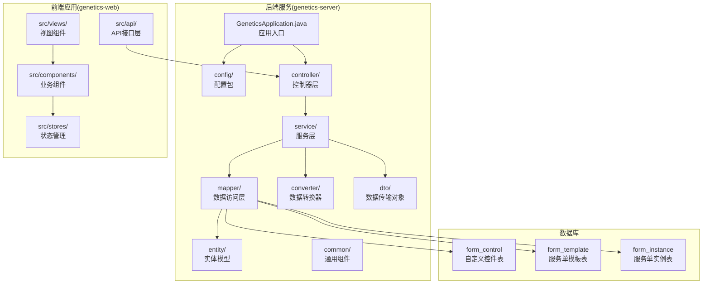
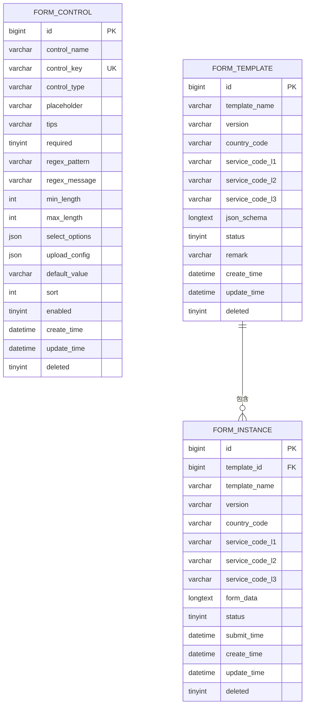
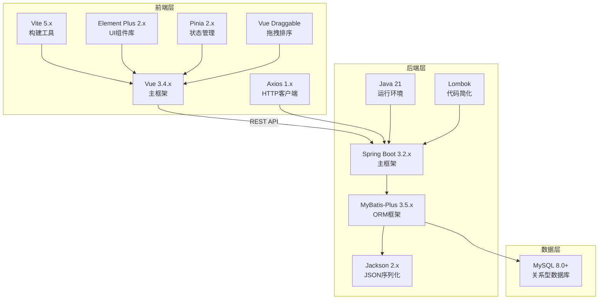
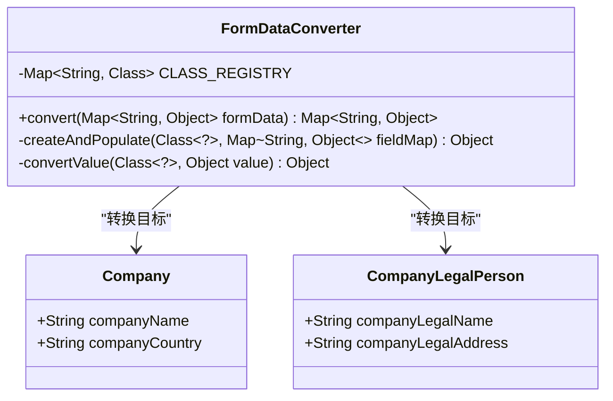
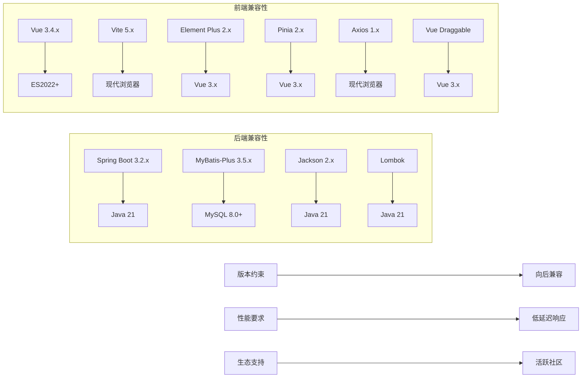

# 技术栈选型

<cite>
**本文档引用的文件**
- [VAT_EPR_动态表单技术方案.md](file://VAT_EPR_动态表单技术方案.md)
</cite>

## 目录
1. [简介](#简介)
2. [项目结构](#项目结构)
3. [核心组件](#核心组件)
4. [架构概览](#架构概览)
5. [详细组件分析](#详细组件分析)
6. [依赖分析](#依赖分析)
7. [性能考虑](#性能考虑)
8. [故障排除指南](#故障排除指南)
9. [结论](#结论)
10. [附录](#附录)

## 简介

VAT&EPR动态表单系统是一个面向欧盟增值税(VAT)和环境产品注册(EPR)业务场景的智能化表单管理系统。该系统采用前后端分离架构，通过动态表单渲染技术实现高度灵活的表单设计和数据处理能力。

系统的核心目标是为不同国家和业务类型的税务申报提供统一的表单管理平台，支持可视化设计器、动态表单渲染、数据验证和业务对象转换等核心功能。

## 项目结构

基于技术方案文档，系统采用标准的前后端分离架构：

**图表来源**
- [VAT_EPR_动态表单技术方案.md:773-852](file://VAT_EPR_动态表单技术方案.md#L773-L852)

**章节来源**
- [VAT_EPR_动态表单技术方案.md:773-852](file://VAT_EPR_动态表单技术方案.md#L773-L852)

## 核心组件

### 数据库层设计

系统采用三层数据库设计模式，支持多国家、多业务类型的灵活配置：

**图表来源**
- [VAT_EPR_动态表单技术方案.md:35-153](file://VAT_EPR_动态表单技术方案.md#L35-L153)

### 核心业务流程

系统的核心业务流程包括三个主要阶段：

1. **控件管理阶段**：管理员创建和维护各种表单控件
2. **模板设计阶段**：使用可视化设计器创建服务单模板
3. **实例填写阶段**：用户根据模板动态填写表单数据

**章节来源**
- [VAT_EPR_动态表单技术方案.md:35-153](file://VAT_EPR_动态表单技术方案.md#L35-L153)

## 架构概览

系统采用现代化的全栈技术架构，确保高性能、可扩展性和易维护性：

**图表来源**
- [VAT_EPR_动态表单技术方案.md:9-27](file://VAT_EPR_动态表单技术方案.md#L9-L27)

## 详细组件分析

### 后端技术栈分析

#### Spring Boot 3.2.x
- **选择理由**：提供开箱即用的企业级特性，包括自动配置、健康检查、监控集成等
- **版本优势**：支持Java 21，具备更好的性能和内存管理
- **生态系统**：丰富的starter和社区支持

#### Java 21
- **性能提升**：JIT编译器优化，垃圾回收器改进
- **语言特性**：模式匹配、虚拟线程等现代特性
- **长期支持**：企业级长期支持版本

#### MyBatis-Plus 3.5.x
- **增强功能**：内置通用CRUD、分页插件、条件构造器
- **开发效率**：减少样板代码，提高开发速度
- **SQL优化**：智能SQL生成和性能优化

#### Jackson 2.x
- **JSON处理**：高性能的JSON序列化和反序列化
- **类型安全**：泛型类型支持和类型安全
- **扩展性**：丰富的模块和自定义功能

#### Lombok
- **代码简化**：减少样板代码，提高代码可读性
- **注解驱动**：@Data、@NoArgsConstructor等注解
- **开发体验**：提升开发效率和一致性

**章节来源**
- [VAT_EPR_动态表单技术方案.md:9-17](file://VAT_EPR_动态表单技术方案.md#L9-L17)

### 前端技术栈分析

#### Vue 3.4.x
- **Composition API**：更好的逻辑复用和代码组织
- **性能优化**：更小的包体积，更快的渲染速度
- **TypeScript支持**：完整的TypeScript集成

#### Vite 5.x
- **构建速度**：基于ESBuild的快速构建
- **开发体验**：即时热更新(HMR)
- **现代特性**：原生ES模块支持

#### Element Plus 2.x
- **组件丰富**：涵盖表单、表格、布局等各类组件
- **主题定制**：灵活的主题配置和样式定制
- **国际化**：完整的多语言支持

#### Vue Draggable
- **拖拽功能**：强大的拖拽排序和拖放功能
- **用户体验**：直观的可视化设计器
- **性能优化**：高效的DOM操作和动画

#### Pinia 2.x
- **状态管理**：简洁的API和TypeScript支持
- **模块化**：按功能模块组织状态
- **开发工具**：完善的Vue DevTools支持

#### Axios 1.x
- **HTTP客户端**：简洁的API和强大的功能
- **拦截器**：请求和响应拦截器
- **错误处理**：统一的错误处理机制

**章节来源**
- [VAT_EPR_动态表单技术方案.md:19-27](file://VAT_EPR_动态表单技术方案.md#L19-L27)

### 核心业务组件

#### FormDataConverter（关键核心组件）

**图表来源**
- [VAT_EPR_动态表单技术方案.md:594-684](file://VAT_EPR_动态表单技术方案.md#L594-L684)

该组件实现了动态表单数据到业务实体的转换，支持多种数据类型的自动转换和反射赋值。

**章节来源**
- [VAT_EPR_动态表单技术方案.md:594-728](file://VAT_EPR_动态表单技术方案.md#L594-L728)

## 依赖分析

### 技术栈兼容性分析

**图表来源**
- [VAT_EPR_动态表单技术方案.md:9-27](file://VAT_EPR_动态表单技术方案.md#L9-L27)

### 性能特征分析

| 技术组件 | 性能特点 | 优化建议 |
|---------|----------|----------|
| Spring Boot 3.2.x | 启动速度快，内存占用低 | 使用懒加载，合理配置缓存 |
| Java 21 | JIT编译优化，垃圾回收改进 | 调优GC参数，使用虚拟线程 |
| Vue 3.4.x | Composition API性能好 | 合理使用keep-alive，组件懒加载 |
| Vite 5.x | ESBuild构建，HMR快速 | 预构建依赖，代码分割 |
| Element Plus 2.x | 组件按需加载 | Tree-shaking优化 |

**章节来源**
- [VAT_EPR_动态表单技术方案.md:9-27](file://VAT_EPR_动态表单技术方案.md#L9-L27)

## 性能考虑

### 后端性能优化

1. **数据库优化**
   - 使用合适的索引策略，特别是control_key唯一索引
   - 合理的查询条件和分页处理
   - 连接池配置和事务管理

2. **缓存策略**
   - 控件配置缓存
   - 模板元数据缓存
   - 常用查询结果缓存

3. **异步处理**
   - 大数据量处理使用异步任务
   - 文件上传采用流式处理
   - 异步通知机制

### 前端性能优化

1. **组件优化**
   - 动态组件按需加载
   - 表单控件虚拟滚动
   - 图片和文件懒加载

2. **网络优化**
   - API请求缓存
   - 请求合并和去重
   - 增量更新策略

3. **内存管理**
   - 组件生命周期管理
   - 大数据量的分批处理
   - 内存泄漏预防

## 故障排除指南

### 常见问题及解决方案

1. **表单数据转换异常**
   - 检查controlKey格式是否正确
   - 验证实体类是否在CLASS_REGISTRY中注册
   - 确认字段类型匹配

2. **数据库连接问题**
   - 检查MySQL连接配置
   - 验证表结构和索引
   - 查看慢查询日志

3. **前端组件渲染问题**
   - 检查Element Plus版本兼容性
   - 验证Vue组件生命周期
   - 调试动态组件渲染

4. **拖拽功能异常**
   - 检查Vue Draggable配置
   - 验证CSS样式冲突
   - 测试浏览器兼容性

**章节来源**
- [VAT_EPR_动态表单技术方案.md:856-869](file://VAT_EPR_动态表单技术方案.md#L856-L869)

## 结论

VAT&EPR动态表单系统的技术栈选型体现了现代Web应用的最佳实践：

### 技术选型优势

1. **技术先进性**：采用最新的Java 21和Vue 3.4.x，确保系统具备优秀的性能和开发体验
2. **生态完整性**：前后端都选择了成熟的主流框架，拥有活跃的社区支持
3. **可扩展性**：模块化的架构设计支持业务的持续扩展
4. **维护性**：清晰的代码结构和完善的文档体系

### 最佳实践建议

1. **开发流程**：建立标准化的开发和测试流程
2. **性能监控**：实施全面的性能监控和日志分析
3. **安全防护**：完善的身份认证和权限控制机制
4. **部署策略**：采用容器化和微服务架构

这套技术栈为VAT&EPR动态表单系统提供了坚实的技术基础，能够满足复杂业务场景的需求并支持未来的业务发展。

## 附录

### 版本兼容性矩阵

| 组件 | 推荐版本 | 最低版本 | 兼容性 |
|------|----------|----------|--------|
| Spring Boot | 3.2.x | 3.0.x | ✅ 高 |
| Java | 21 | 17 | ✅ 高 |
| MySQL | 8.0+ | 5.7 | ✅ 高 |
| Vue | 3.4.x | 3.0 | ✅ 高 |
| Element Plus | 2.x | 1.x | ✅ 高 |
| Vite | 5.x | 4.x | ✅ 高 |
| Pinia | 2.x | 1.x | ✅ 高 |
| Axios | 1.x | 0.27 | ✅ 高 |

### 学习资源推荐

1. **Spring Boot官方文档**：https://spring.io/projects/spring-boot
2. **Vue.js官方文档**：https://vuejs.org/
3. **Element Plus组件库**：https://element-plus.org/
4. **MyBatis-Plus官方文档**：https://baomidou.com/