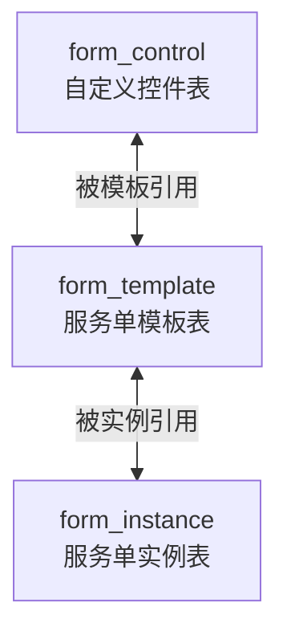
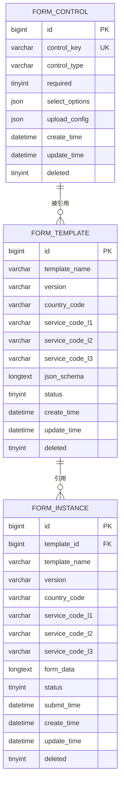
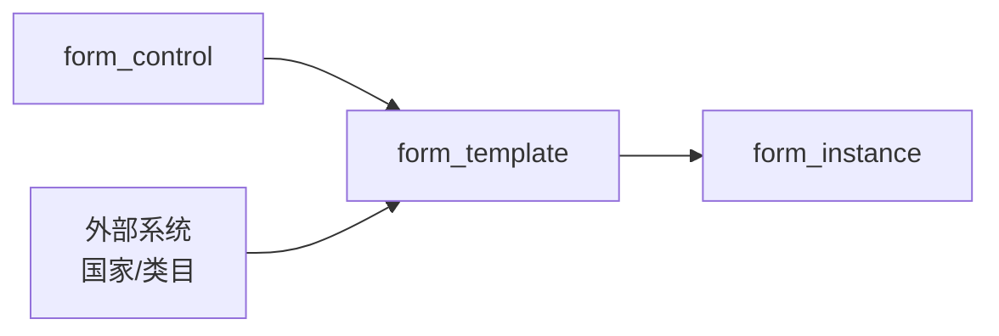

# 数据库设计

<cite>
**本文引用的文件**
- [VAT_EPR_动态表单技术方案.md](file://VAT_EPR_动态表单技术方案.md)
</cite>

## 目录
1. [简介](#简介)
2. [项目结构](#项目结构)
3. [核心组件](#核心组件)
4. [架构总览](#架构总览)
5. [详细组件分析](#详细组件分析)
6. [依赖分析](#依赖分析)
7. [性能考虑](#性能考虑)
8. [故障排查指南](#故障排查指南)
9. [结论](#结论)
10. [附录](#附录)

## 简介
本文件面向VAT与EPR动态表单系统，提供数据库设计的完整说明。重点围绕三个核心表展开：自定义控件表、服务单模板表、服务单实例表。内容涵盖字段定义、数据类型、约束与索引、表间关系、数据完整性保障、业务含义、存储策略以及性能优化建议，并给出对应的ER图与建表语句路径，帮助数据库设计者完成建模与落地实施。

## 项目结构
该技术方案以“表结构+接口时序+核心转换器”三位一体的方式描述系统，数据库层主要由三张核心表构成：
- form_control：自定义控件定义
- form_template：服务单模板，承载布局与控件引用
- form_instance：服务单实例，承载具体填写数据

图表来源
- [VAT_EPR_动态表单技术方案.md:35-59](file://VAT_EPR_动态表单技术方案.md#L35-L59)
- [VAT_EPR_动态表单技术方案.md:70-87](file://VAT_EPR_动态表单技术方案.md#L70-L87)
- [VAT_EPR_动态表单技术方案.md:134-153](file://VAT_EPR_动态表单技术方案.md#L134-L153)

章节来源
- [VAT_EPR_动态表单技术方案.md:31-165](file://VAT_EPR_动态表单技术方案.md#L31-L165)

## 核心组件
本节对三张核心表进行逐项解析，包括字段、类型、约束、索引及业务含义。

- form_control（自定义控件表）
  - 主键：id（自增）
  - 唯一索引：control_key（用于控件标识与去重）
  - 关键字段
    - control_name：控件名称（展示用）
    - control_key：控件标识，格式为“类名.字段名”，唯一且用于模板与实例中的引用
    - control_type：控件类型（INPUT/SELECT/SWITCH/UPLOAD/TEXTAREA/DATE/NUMBER）
    - placeholder/tips：占位提示与说明
    - required：是否必填
    - regex_pattern/regex_message：正则校验与提示
    - min_length/max_length：长度限制
    - select_options：下拉选项（JSON数组）
    - upload_config：上传配置（JSON，仅UPLOAD类型有效）
    - default_value：默认值
    - sort/enabled：排序与启用状态
    - create_time/update_time/deleted：审计与软删
  - 业务要点
    - control_key命名规范要求包含“.”，且唯一
    - upload_config与select_options均为JSON，便于灵活扩展
    - enabled用于灰度与开关控制

- form_template（服务单模板表）
  - 主键：id（自增）
  - 关键字段
    - template_name：模板名称
    - version：版本，默认“1.0.0”
    - country_code：国家代码（如DEU/FRA/ITA/ESP/POL/CZE/GBR）
    - service_code_l1/l2/l3：服务类目三级编码（如01/VAT，0101/包装法，010101/新注册）
    - json_schema：画板布局与控件引用的JSON Schema
    - status：状态（草稿/发布）
    - remark：备注
    - create_time/update_time/deleted：审计与软删
  - 业务要点
    - json_schema描述布局、行列、控件引用等
    - 发布后禁止直接修改json_schema，变更需升级版本

- form_instance（服务单实例表）
  - 主键：id（自增）
  - 索引：idx_template_id（加速按模板查询）
  - 关键字段
    - template_id：关联模板
    - template_name/version/country_code/service_code_*：冗余字段，便于检索与展示
    - form_data：表单数据，存储Map<controlKey, value>的JSON
    - status：状态（草稿/已提交/已审核）
    - submit_time：提交时间
    - create_time/update_time/deleted：审计与软删
  - 业务要点
    - form_data采用JSON存储，key为“类名.字段名”，与control_key保持一致
    - 冗余字段提升查询效率与展示便捷性
    - 提交后状态更新，禁止再次修改

章节来源
- [VAT_EPR_动态表单技术方案.md:35-59](file://VAT_EPR_动态表单技术方案.md#L35-L59)
- [VAT_EPR_动态表单技术方案.md:70-87](file://VAT_EPR_动态表单技术方案.md#L70-L87)
- [VAT_EPR_动态表单技术方案.md:134-153](file://VAT_EPR_动态表单技术方案.md#L134-L153)

## 架构总览
从数据库视角看，三表关系清晰：模板引用控件，实例引用模板并存储数据。下图给出ER关系与字段映射。

图表来源
- [VAT_EPR_动态表单技术方案.md:35-59](file://VAT_EPR_动态表单技术方案.md#L35-L59)
- [VAT_EPR_动态表单技术方案.md:70-87](file://VAT_EPR_动态表单技术方案.md#L70-L87)
- [VAT_EPR_动态表单技术方案.md:134-153](file://VAT_EPR_动态表单技术方案.md#L134-L153)

## 详细组件分析

### 表：form_control（自定义控件表）
- 字段与类型
  - id：自增主键
  - control_name：字符串，用于展示
  - control_key：字符串，唯一键，格式“类名.字段名”
  - control_type：字符串，枚举类型
  - placeholder/tips：字符串
  - required：布尔
  - regex_pattern/regex_message：字符串
  - min_length/max_length：整数
  - select_options：JSON数组
  - upload_config：JSON对象（仅UPLOAD有效）
  - default_value：字符串
  - sort/enabled：整数与布尔
  - create_time/update_time/deleted：时间戳与软删
- 约束与索引
  - 主键：id
  - 唯一索引：uk_control_key（control_key唯一）
- 业务含义
  - 定义可复用的表单控件，支持多种类型与校验规则
  - 通过control_key与模板、实例建立松耦合关联
- 存储策略
  - JSON字段用于灵活配置，减少表结构变更成本
- 性能与优化
  - 唯一索引确保control_key查询高效
  - enabled用于快速筛选可用控件

章节来源
- [VAT_EPR_动态表单技术方案.md:35-59](file://VAT_EPR_动态表单技术方案.md#L35-L59)

### 表：form_template（服务单模板表）
- 字段与类型
  - id：自增主键
  - template_name：字符串
  - version：字符串，默认“1.0.0”
  - country_code：字符串（国家代码）
  - service_code_l1/l2/l3：字符串（三级服务类目）
  - json_schema：长文本（JSON Schema）
  - status：布尔（草稿/发布）
  - remark：字符串
  - create_time/update_time/deleted：时间戳与软删
- 约束与索引
  - 主键：id
- 业务含义
  - 描述表单布局与控件引用，支撑动态渲染
  - 版本机制保障历史稳定性
- 存储策略
  - json_schema承载布局与控件引用，便于前后端协作
- 性能与优化
  - 通过country_code与三级编码实现多维检索
  - 发布后禁止修改json_schema，避免并发与一致性问题

章节来源
- [VAT_EPR_动态表单技术方案.md:70-87](file://VAT_EPR_动态表单技术方案.md#L70-L87)

### 表：form_instance（服务单实例表）
- 字段与类型
  - id：自增主键
  - template_id：外键，指向模板
  - template_name/version/country_code/service_code_*：冗余字段
  - form_data：长文本（JSON，Map<controlKey, value>）
  - status：布尔（草稿/已提交/已审核）
  - submit_time：时间戳
  - create_time/update_time/deleted：时间戳与软删
- 约束与索引
  - 主键：id
  - 索引：idx_template_id(template_id)
- 业务含义
  - 记录一次具体的表单填写与流转
  - 冗余字段提升查询与展示效率
- 存储策略
  - form_data采用JSON存储，key与control_key一致
  - 提交后状态更新，禁止再次修改
- 性能与优化
  - idx_template_id加速按模板统计与导出
  - 冗余字段减少跨表JOIN

章节来源
- [VAT_EPR_动态表单技术方案.md:134-153](file://VAT_EPR_动态表单技术方案.md#L134-L153)

### 关系与完整性
- 外键关系
  - form_instance.template_id → form_template.id
- 数据完整性
  - control_key唯一性由数据库唯一索引与后端校验共同保障
  - 发布模板禁止修改json_schema，版本变更规避数据错乱
  - 提交后状态更新，禁止再次修改，避免并发覆盖

章节来源
- [VAT_EPR_动态表单技术方案.md:35-59](file://VAT_EPR_动态表单技术方案.md#L35-L59)
- [VAT_EPR_动态表单技术方案.md:70-87](file://VAT_EPR_动态表单技术方案.md#L70-L87)
- [VAT_EPR_动态表单技术方案.md:134-153](file://VAT_EPR_动态表单技术方案.md#L134-L153)
- [VAT_EPR_动态表单技术方案.md:856-869](file://VAT_EPR_动态表单技术方案.md#L856-L869)

### 数据模型与业务含义
- 控件维度：form_control定义控件能力与规则，作为模板与实例的“原子构件”
- 模板维度：form_template定义布局与控件集合，承载业务类目与国家维度
- 实例维度：form_instance承载具体填写数据，支持草稿、提交、审核等状态流转
- 关键映射
  - control_key与form_data的key保持一致，确保渲染与提交的一致性
  - 冗余字段服务于查询与展示，降低运行时JOIN成本

章节来源
- [VAT_EPR_动态表单技术方案.md:484-590](file://VAT_EPR_动态表单技术方案.md#L484-L590)

### 存储策略与性能优化
- JSON字段设计
  - control_key唯一性与JSON配置（select_options、upload_config）提升灵活性
- 索引策略
  - form_control.uk_control_key：保证控件唯一性与快速定位
  - form_instance.idx_template_id：加速模板级查询与统计
- 冗余字段
  - 在form_instance中冗余模板与国家信息，减少跨表查询
- 版本与发布
  - 模板发布后禁止修改json_schema，变更走版本升级，避免历史实例数据错乱
- 并发与安全
  - 提交后状态更新，禁止再次修改
  - 建议引入乐观锁（version字段）防止并发覆盖

章节来源
- [VAT_EPR_动态表单技术方案.md:70-87](file://VAT_EPR_动态表单技术方案.md#L70-L87)
- [VAT_EPR_动态表单技术方案.md:134-153](file://VAT_EPR_动态表单技术方案.md#L134-L153)
- [VAT_EPR_动态表单技术方案.md:856-869](file://VAT_EPR_动态表单技术方案.md#L856-L869)

## 依赖分析
- 控件依赖：模板通过json_schema引用控件（control_key），实例通过模板引用控件
- 数据依赖：实例依赖模板，模板不依赖实例
- 外部依赖：国家代码与服务类目通过外部系统透传

图表来源
- [VAT_EPR_动态表单技术方案.md:35-59](file://VAT_EPR_动态表单技术方案.md#L35-L59)
- [VAT_EPR_动态表单技术方案.md:70-87](file://VAT_EPR_动态表单技术方案.md#L70-L87)
- [VAT_EPR_动态表单技术方案.md:134-153](file://VAT_EPR_动态表单技术方案.md#L134-L153)

## 性能考虑
- 索引与查询
  - 为control_key建立唯一索引，确保控件查找与去重高效
  - 为template_id建立普通索引，支撑实例按模板批量查询
- JSON字段
  - 控件配置与模板布局采用JSON存储，便于扩展但需注意查询与统计的复杂度
- 冗余字段
  - 减少跨表JOIN，提高查询性能
- 版本与发布
  - 发布后禁止修改json_schema，避免历史数据一致性问题
- 并发控制
  - 建议在实例更新时引入乐观锁（version字段），防止并发覆盖

## 故障排查指南
- control_key重复或格式错误
  - 现象：插入失败或重复
  - 排查：检查唯一索引与后端校验（必须包含“.”）
- 模板发布后误修改json_schema
  - 现象：历史实例数据错乱
  - 排查：确认发布状态与版本升级策略
- 实例提交后再次修改
  - 现象：提交后状态不可逆
  - 排查：检查提交流程与状态机
- 查询性能下降
  - 现象：按模板查询慢
  - 排查：确认idx_template_id是否存在，是否使用冗余字段

章节来源
- [VAT_EPR_动态表单技术方案.md:856-869](file://VAT_EPR_动态表单技术方案.md#L856-L869)

## 结论
本数据库设计方案以“控件-模板-实例”三层结构为核心，结合JSON灵活配置与冗余字段优化查询，满足VAT与EPR动态表单的复杂业务需求。通过唯一索引、版本与发布策略、状态机与并发控制等手段，确保数据一致性与可维护性。建议在生产环境中结合监控与容量规划，持续评估索引与查询性能，并完善自动化运维与备份策略。

## 附录
- 建表语句路径
  - form_control：[VAT_EPR_动态表单技术方案.md:35-59](file://VAT_EPR_动态表单技术方案.md#L35-L59)
  - form_template：[VAT_EPR_动态表单技术方案.md:70-87](file://VAT_EPR_动态表单技术方案.md#L70-L87)
  - form_instance：[VAT_EPR_动态表单技术方案.md:134-153](file://VAT_EPR_动态表单技术方案.md#L134-L153)