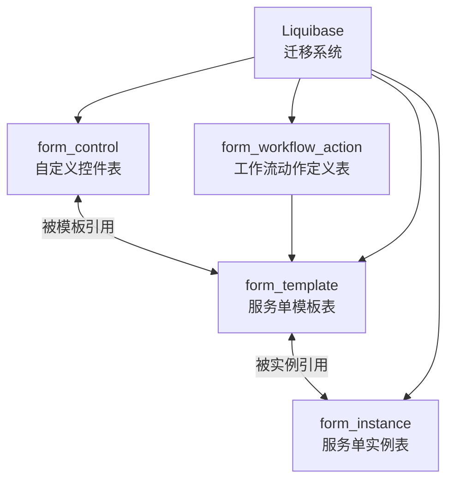
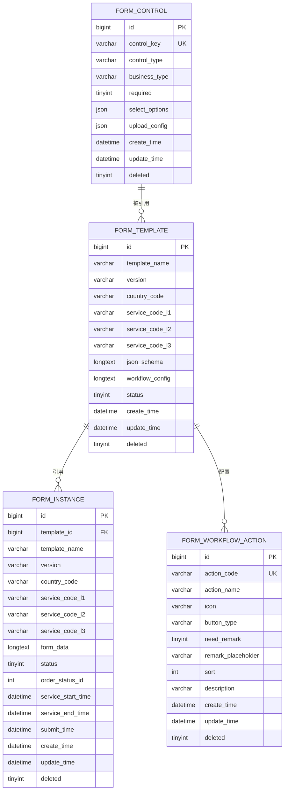
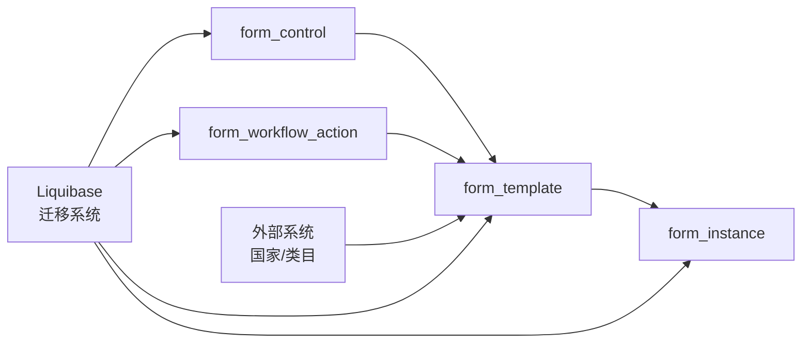

# 数据库设计

<cite>
**本文引用的文件**
- [db.changelog-master.xml](file://genetics-server/src/main/resources/db/changelog/db.changelog-master.xml)
- [001-init-schema.sql](file://genetics-server/src/main/resources/db/changelog/sql/001-init-schema.sql)
- [002-form-controls-data.sql](file://genetics-server/src/main/resources/db/changelog/sql/002-form-controls-data.sql)
- [003-add-business-type.sql](file://genetics-server/src/main/resources/db/changelog/sql/003-add-business-type.sql)
- [004-add-workflow-config.sql](file://genetics-server/src/main/resources/db/changelog/sql/004-add-workflow-config.sql)
- [006-add-workflow-action.sql](file://genetics-server/src/main/resources/db/changelog/sql/006-add-workflow-action.sql)
- [application.yml](file://genetics-server/src/main/resources/application.yml)
- [Company.java](file://genetics-server/src/main/java/com/genetics/entity/domain/Company.java)
- [CompanyAddress.java](file://genetics-server/src/main/java/com/genetics/entity/domain/CompanyAddress.java)
- [CompanyContact.java](file://genetics-server/src/main/java/com/genetics/entity/domain/CompanyContact.java)
- [InstanceStatus.java](file://genetics-server/src/main/java/com/genetics/enums/InstanceStatus.java)
- [init.sql](file://genetics-server/src/main/resources/db/init.sql)
- [TemplateWorkflowConfig.java](file://genetics-server/src/main/java/com/genetics/entity/workflow/TemplateWorkflowConfig.java)
- [WorkflowAction.java](file://genetics-server/src/main/java/com/genetics/entity/workflow/WorkflowAction.java)
- [WorkflowTransition.java](file://genetics-server/src/main/java/com/genetics/entity/workflow/WorkflowTransition.java)
- [WorkflowState.java](file://genetics-server/src/main/java/com/genetics/entity/workflow/WorkflowState.java)
- [FormTemplate.java](file://genetics-server/src/main/java/com/genetics/entity/FormTemplate.java)
</cite>

## 更新摘要
**所做更改**
- 新增工作流相关表结构：form_workflow_action工作流动作定义表
- 在form_template表中新增workflow_config字段，支持JSON格式的工作流配置
- 扩展Liquibase迁移系统，新增工作流配置迁移脚本
- 新增TemplateWorkflowConfig、WorkflowAction、WorkflowTransition、WorkflowState等工作流实体类
- 完善工作流状态管理和动作定义的数据库设计

## 目录
1. [简介](#简介)
2. [项目结构](#项目结构)
3. [核心组件](#核心组件)
4. [架构总览](#架构总览)
5. [详细组件分析](#详细组件分析)
6. [Liquibase迁移系统](#liquibase迁移系统)
7. [工作流系统设计](#工作流系统设计)
8. [Company相关表结构](#company相关表结构)
9. [业务类型字段设计](#业务类型字段设计)
10. [依赖分析](#依赖分析)
11. [性能考虑](#性能考虑)
12. [故障排查指南](#故障排查指南)
13. [结论](#结论)
14. [附录](#附录)

## 简介
本文件面向VAT与EPR动态表单系统，提供数据库设计的完整说明。重点围绕四个核心表展开：自定义控件表、服务单模板表、服务单实例表和工作流动作定义表。内容涵盖字段定义、数据类型、约束与索引、表间关系、数据完整性保障、业务含义、存储策略以及性能优化建议，并给出对应的ER图与建表语句路径，帮助数据库设计者完成建模与落地实施。

**更新** 本次更新新增了完整的工作流系统支持，包括工作流动作定义表、模板工作流配置字段、状态流转规则等新功能。

## 项目结构
该技术方案以"表结构+接口时序+核心转换器"三位一体的方式描述系统，数据库层主要由四张核心表构成：
- form_control：自定义控件定义
- form_template：服务单模板，承载布局与控件引用及工作流配置
- form_instance：服务单实例，承载具体填写数据
- form_workflow_action：工作流动作定义，支持预设动作和自定义动作



**图表来源**
- [db.changelog-master.xml:1-63](file://genetics-server/src/main/resources/db/changelog/db.changelog-master.xml#L1-L63)
- [001-init-schema.sql:1-70](file://genetics-server/src/main/resources/db/changelog/sql/001-init-schema.sql#L1-L70)
- [006-add-workflow-action.sql:1-33](file://genetics-server/src/main/resources/db/changelog/sql/006-add-workflow-action.sql#L1-L33)

**章节来源**
- [db.changelog-master.xml:1-63](file://genetics-server/src/main/resources/db/changelog/db.changelog-master.xml#L1-L63)
- [001-init-schema.sql:1-70](file://genetics-server/src/main/resources/db/changelog/sql/001-init-schema.sql#L1-L70)
- [006-add-workflow-action.sql:1-33](file://genetics-server/src/main/resources/db/changelog/sql/006-add-workflow-action.sql#L1-L33)

## 核心组件
本节对四张核心表进行逐项解析，包括字段、类型、约束、索引及业务含义。

- form_control（自定义控件表）
  - 主键：id（自增）
  - 唯一索引：control_key（用于控件标识与去重）
  - 新增字段：business_type（业务类型，用于按业务类型分组筛选控件）
  - 关键字段
    - control_name：控件名称（展示用）
    - control_key：控件标识，格式为"类名.字段名"，唯一且用于模板与实例中的引用
    - control_type：控件类型（INPUT/SELECT/SWITCH/UPLOAD/TEXTAREA/DATE/NUMBER）
    - business_type：业务类型（实体类名），如Company/CompanyAddress等
    - placeholder/tips：占位提示与说明
    - required：是否必填
    - regex_pattern/regex_message：正则校验与提示
    - min_length/max_length：长度限制
    - select_options：下拉选项（JSON数组）
    - upload_config：上传配置（JSON，仅UPLOAD类型有效）
    - default_value：默认值
    - sort/enabled：排序与启用状态
    - create_time/update_time/deleted：审计与软删
  - 业务要点
    - control_key命名规范要求包含"."，且唯一
    - business_type字段支持按业务实体类型进行控件筛选
    - upload_config与select_options均为JSON，便于灵活扩展
    - enabled用于灰度与开关控制

- form_template（服务单模板表）
  - 主键：id（自增）
  - 新增字段：workflow_config（工作流配置，JSON格式）
  - 关键字段
    - template_name：模板名称
    - version：版本，默认"1.0.0"
    - country_code：国家代码（如DEU/FRA/ITA/ESP/POL/CZE/GBR）
    - service_code_l1/l2/l3：服务类目三级编码（如01/VAT，0101/包装法，010101/新注册）
    - json_schema：画板布局与控件引用的JSON Schema
    - workflow_config：工作流配置，包含状态流转规则和动作定义
    - status：状态（草稿/发布）
    - remark：备注
    - create_time/update_time/deleted：审计与软删
  - 业务要点
    - json_schema描述布局、行列、控件引用等
    - workflow_config支持VAT/EPR两种业务模式的工作流配置
    - 发布后禁止直接修改json_schema，变更需升级版本

- form_instance（服务单实例表）
  - 主键：id（自增）
  - 索引：idx_template_id（加速按模板查询）
  - 新增字段：order_status_id（业务状态ID）、service_start_time/service_end_time（服务时间）
  - 关键字段
    - template_id：关联模板
    - template_name/version/country_code/service_code_*：冗余字段，便于检索与展示
    - form_data：表单数据，存储Map<controlKey, value>的JSON
    - status：状态（草稿/已提交/已审核）
    - order_status_id：业务状态ID，支持更细粒度的状态管理
    - service_start_time/service_end_time：服务开始和结束时间
    - submit_time：提交时间
    - create_time/update_time/deleted：审计与软删
  - 业务要点
    - form_data采用JSON存储，key为"类名.字段名"，与control_key保持一致
    - 冗余字段提升查询效率与展示便捷性
    - 提交后状态更新，禁止再次修改
    - 新增业务状态字段支持复杂的业务流程管理

- form_workflow_action（工作流动作定义表）
  - 主键：id（自增）
  - 唯一索引：action_code（动作编码唯一）
  - 关键字段
    - action_code：动作编码（如submit、auditPass、auditReject等）
    - action_name：动作显示名称（如提交、审核通过、审核驳回等）
    - icon：动作图标（Ionicons名称）
    - button_type：按钮类型（primary/info/success/warning/error）
    - need_remark：是否默认需要填写备注
    - remark_placeholder：备注框提示语
    - sort：排序
    - description：动作描述
    - create_time/update_time/deleted：审计与软删
  - 业务要点
    - 预设8种标准工作流动作，支持业务流程标准化
    - 支持自定义动作扩展，满足不同业务场景需求
    - 通过button_type和icon提供友好的前端展示

**章节来源**
- [001-init-schema.sql:6-28](file://genetics-server/src/main/resources/db/changelog/sql/001-init-schema.sql#L6-L28)
- [001-init-schema.sql:30-46](file://genetics-server/src/main/resources/db/changelog/sql/001-init-schema.sql#L30-L46)
- [001-init-schema.sql:48-70](file://genetics-server/src/main/resources/db/changelog/sql/001-init-schema.sql#L48-L70)
- [004-add-workflow-config.sql:1-4](file://genetics-server/src/main/resources/db/changelog/sql/004-add-workflow-config.sql#L1-L4)
- [006-add-workflow-action.sql:5-20](file://genetics-server/src/main/resources/db/changelog/sql/006-add-workflow-action.sql#L5-L20)

## 架构总览
从数据库视角看，四表关系清晰：模板引用控件，实例引用模板并存储数据，模板通过工作流配置定义状态流转。下图给出ER关系与字段映射。



**图表来源**
- [001-init-schema.sql:6-28](file://genetics-server/src/main/resources/db/changelog/sql/001-init-schema.sql#L6-L28)
- [001-init-schema.sql:30-46](file://genetics-server/src/main/resources/db/changelog/sql/001-init-schema.sql#L30-L46)
- [001-init-schema.sql:48-70](file://genetics-server/src/main/resources/db/changelog/sql/001-init-schema.sql#L48-L70)
- [004-add-workflow-config.sql:1-4](file://genetics-server/src/main/resources/db/changelog/sql/004-add-workflow-config.sql#L1-L4)
- [006-add-workflow-action.sql:5-20](file://genetics-server/src/main/resources/db/changelog/sql/006-add-workflow-action.sql#L5-L20)

## 详细组件分析

### 表：form_control（自定义控件表）
- 字段与类型
  - id：自增主键
  - control_name：字符串，用于展示
  - control_key：字符串，唯一键，格式"类名.字段名"
  - control_type：字符串，枚举类型
  - business_type：字符串，业务类型字段，支持按实体类名筛选
  - placeholder/tips：字符串
  - required：布尔
  - regex_pattern/regex_message：字符串
  - min_length/max_length：整数
  - select_options：JSON数组
  - upload_config：JSON对象（仅UPLOAD有效）
  - default_value：字符串
  - sort/enabled：整数与布尔
  - create_time/update_time/deleted：时间戳与软删
- 约束与索引
  - 主键：id
  - 唯一索引：uk_control_key（control_key唯一）
  - 新增索引：idx_business_type（business_type索引）
- 业务含义
  - 定义可复用的表单控件，支持多种类型与校验规则
  - 通过control_key与模板、实例建立松耦合关联
  - business_type字段支持按业务实体类型进行控件分组管理
- 存储策略
  - JSON字段用于灵活配置，减少表结构变更成本
  - business_type字段通过Liquibase迁移自动填充
- 性能与优化
  - 唯一索引确保control_key查询高效
  - business_type索引支持按业务类型快速筛选控件
  - enabled用于快速筛选可用控件

**章节来源**
- [001-init-schema.sql:6-28](file://genetics-server/src/main/resources/db/changelog/sql/001-init-schema.sql#L6-L28)
- [003-add-business-type.sql:1-17](file://genetics-server/src/main/resources/db/changelog/sql/003-add-business-type.sql#L1-L17)

### 表：form_template（服务单模板表）
- 字段与类型
  - id：自增主键
  - template_name：字符串
  - version：字符串，默认"1.0.0"
  - country_code：字符串（国家代码）
  - service_code_l1/l2/l3：字符串（三级服务类目）
  - json_schema：长文本（JSON Schema）
  - workflow_config：长文本（JSON，工作流配置）
  - status：布尔（草稿/发布）
  - remark：字符串
  - create_time/update_time/deleted：时间戳与软删
- 约束与索引
  - 主键：id
- 业务含义
  - 描述表单布局与控件引用，支撑动态渲染
  - workflow_config承载工作流状态流转配置
  - 版本机制保障历史稳定性
- 存储策略
  - json_schema承载布局与控件引用，便于前后端协作
  - workflow_config采用JSON格式存储，支持复杂的工作流规则
- 性能与优化
  - 通过country_code与三级编码实现多维检索
  - 发布后禁止修改json_schema，避免并发与一致性问题
  - workflow_config支持序列化存储，便于业务逻辑处理

**章节来源**
- [001-init-schema.sql:30-46](file://genetics-server/src/main/resources/db/changelog/sql/001-init-schema.sql#L30-L46)
- [004-add-workflow-config.sql:1-4](file://genetics-server/src/main/resources/db/changelog/sql/004-add-workflow-config.sql#L1-L4)
- [init.sql:33-50](file://genetics-server/src/main/resources/db/init.sql#L33-L50)

### 表：form_instance（服务单实例表）
- 字段与类型
  - id：自增主键
  - template_id：外键，指向模板
  - template_name/version/country_code/service_code_*：冗余字段
  - form_data：长文本（JSON，Map<controlKey, value>）
  - status：布尔（草稿/已提交/已审核）
  - order_status_id：整数，业务状态ID，支持更细粒度的状态管理
  - service_start_time/service_end_time：时间戳，服务开始和结束时间
  - submit_time：时间戳
  - create_time/update_time/deleted：时间戳与软删
- 约束与索引
  - 主键：id
  - 索引：idx_template_id(template_id)
- 业务含义
  - 记录一次具体的表单填写与流转
  - 冗余字段提升查询与展示效率
  - 新增业务状态字段支持复杂的业务流程管理
- 存储策略
  - form_data采用JSON存储，key与control_key一致
  - 提交后状态更新，禁止再次修改
  - 业务状态字段支持服务流程跟踪
- 性能与优化
  - idx_template_id加速按模板统计与导出
  - 冗余字段减少跨表JOIN
  - 业务状态字段支持高效查询和报表统计

**章节来源**
- [001-init-schema.sql:48-70](file://genetics-server/src/main/resources/db/changelog/sql/001-init-schema.sql#L48-L70)

### 表：form_workflow_action（工作流动作定义表）
- 字段与类型
  - id：自增主键
  - action_code：字符串，唯一键，动作编码
  - action_name：字符串，动作显示名称
  - icon：字符串，动作图标（Ionicons名称）
  - button_type：字符串，按钮类型（primary/info/success/warning/error）
  - need_remark：布尔，是否默认需要填写备注
  - remark_placeholder：字符串，备注框提示语
  - sort：整数，排序
  - description：字符串，动作描述
  - create_time/update_time/deleted：时间戳与软删
- 约束与索引
  - 主键：id
  - 唯一索引：uk_action_code（action_code唯一）
- 业务含义
  - 定义标准工作流动作，支持业务流程的规范化
  - 预设8种标准动作，覆盖常见业务场景
  - 支持自定义扩展，满足特殊业务需求
- 存储策略
  - 采用固定预设值，通过action_code唯一标识
  - 支持动态配置，便于前端展示和交互
- 性能与优化
  - 唯一索引确保action_code查询高效
  - sort字段支持动态排序调整
  - button_type和icon字段提供丰富的UI配置

**章节来源**
- [006-add-workflow-action.sql:5-20](file://genetics-server/src/main/resources/db/changelog/sql/006-add-workflow-action.sql#L5-L20)

### 关系与完整性
- 外键关系
  - form_instance.template_id → form_template.id
  - form_template.workflow_config → workflow_config（JSON字段，非外键约束）
- 数据完整性
  - control_key唯一性由数据库唯一索引与后端校验共同保障
  - business_type字段通过Liquibase迁移自动填充，确保数据一致性
  - workflow_config字段通过JacksonTypeHandler序列化存储，确保数据格式正确
  - action_code唯一性由数据库唯一索引保障
  - 发布模板禁止修改json_schema，版本变更规避数据错乱
  - 提交后状态更新，禁止再次修改，避免并发覆盖
  - 新增业务状态字段支持完整的业务流程跟踪

**章节来源**
- [001-init-schema.sql:6-28](file://genetics-server/src/main/resources/db/changelog/sql/001-init-schema.sql#L6-L28)
- [001-init-schema.sql:30-46](file://genetics-server/src/main/resources/db/changelog/sql/001-init-schema.sql#L30-L46)
- [001-init-schema.sql:48-70](file://genetics-server/src/main/resources/db/changelog/sql/001-init-schema.sql#L48-L70)
- [003-add-business-type.sql:1-17](file://genetics-server/src/main/resources/db/changelog/sql/003-add-business-type.sql#L1-L17)
- [004-add-workflow-config.sql:1-4](file://genetics-server/src/main/resources/db/changelog/sql/004-add-workflow-config.sql#L1-L4)
- [006-add-workflow-action.sql:5-20](file://genetics-server/src/main/resources/db/changelog/sql/006-add-workflow-action.sql#L5-L20)

## Liquibase迁移系统
系统采用Liquibase作为数据库迁移管理工具，提供版本化的数据库变更管理。

### 迁移配置
- 配置文件：application.yml中启用Liquibase并指定变更日志文件
- 变更日志：db.changelog-master.xml作为主配置文件
- 迁移脚本：按顺序执行的SQL文件

### 迁移流程
1. **初始化迁移**：执行001-init-schema.sql创建基础表结构
2. **数据初始化**：执行002-form-controls-data.sql插入控件数据
3. **结构增强**：执行003-add-business-type.sql添加business_type字段
4. **工作流配置**：执行004-add-workflow-config.sql为模板表添加工作流配置字段
5. **索引优化**：执行005-add-indexes.sql添加核心表索引
6. **动作定义**：执行006-add-workflow-action.sql创建工作流动作定义表

### 迁移特性
- **版本化管理**：每个变更集都有唯一的ID和作者标识
- **可重复执行**：Liquibase会跟踪已执行的变更，避免重复应用
- **事务支持**：每个变更集在一个事务中执行，确保数据一致性
- **回滚支持**：支持变更的回滚操作

**章节来源**
- [application.yml:12-14](file://genetics-server/src/main/resources/application.yml#L12-L14)
- [db.changelog-master.xml:1-63](file://genetics-server/src/main/resources/db/changelog/db.changelog-master.xml#L1-L63)

## 工作流系统设计
系统提供完整的工作流支持，包括状态管理、动作定义、流转规则等核心功能。

### 工作流配置实体
- **TemplateWorkflowConfig**：模板工作流配置，支持VAT/EPR两种业务模式
- **WorkflowTransition**：状态流转规则，定义起始状态、目标状态、动作和条件
- **WorkflowState**：工作流状态定义，支持多种状态类型（初始、处理中、终态、异常、终止）

### 工作流动作系统
- **预设动作**：8种标准工作流动作，覆盖常见业务场景
- **自定义扩展**：支持业务特定的动作定义和配置
- **动作配置**：支持图标、按钮样式、备注要求等个性化配置

### 状态流转规则
- **标准流程**：提交→审核→递交→完成的完整流程
- **分支处理**：支持审核驳回后的重新提交流程
- **业务区分**：VAT和EPR分别有不同的处理流程和目标状态

### 数据存储策略
- **JSON配置**：工作流配置采用JSON格式存储，便于灵活扩展
- **枚举状态**：使用固定的ServeState枚举确保状态一致性
- **条件过滤**：支持按业务类型（VAT/EPR）过滤状态流转规则

**章节来源**
- [TemplateWorkflowConfig.java:1-100](file://genetics-server/src/main/java/com/genetics/entity/workflow/TemplateWorkflowConfig.java#L1-L100)
- [WorkflowAction.java:1-65](file://genetics-server/src/main/java/com/genetics/entity/workflow/WorkflowAction.java#L1-L65)
- [WorkflowTransition.java:1-46](file://genetics-server/src/main/java/com/genetics/entity/workflow/WorkflowTransition.java#L1-L46)
- [WorkflowState.java:1-31](file://genetics-server/src/main/java/com/genetics/entity/workflow/WorkflowState.java#L1-L31)
- [FormTemplate.java:44-48](file://genetics-server/src/main/java/com/genetics/entity/FormTemplate.java#L44-L48)

## Company相关表结构
基于业务需求，系统支持Company及其相关实体的完整表结构设计。

### Company实体表结构
Company实体包含丰富的公司信息字段，支持VAT和EPR业务场景：

- **基本信息**：code、name、enname、abbr、email、fixedTelephone
- **地区信息**：regionId、regionCode、regionCode2、regionName
- **证照信息**：typeId、typeName、registeredCapital、currencyName、currencyCode
- **注册信息**：registeredArea、registerCode、socialCreditCode、econKindId
- **银行信息**：companyBankAccount、companyIban、companySwiftBic、companyBankEnName
- **联系信息**：contactPerson、contactPhone、contactEmail、contactPosition
- **特殊标识**：gerLocalTaxNumber、registryCountryTax、eoriCountryCode、eoriEu、eoriEn
- **其他信息**：businessScope、enabled、fiscalYearEndDate

### Company相关实体
系统支持以下Company相关实体的表结构设计：

- **CompanyAddress**：公司地址信息，支持多语言地址描述
- **CompanyContact**：公司联系人信息，支持多种联系方式
- **CompanyBank**：公司银行账户信息
- **CompanyUser**：公司用户关联信息
- **CompanyPersonnel**：公司人员信息，支持法人和联系人区分
- **CompanySales**：公司销售平台信息
- **CompanyOverseaManage**：海外经营信息
- **CompanyEprCategoryBrand**：EPR品牌分类信息
- **CompanyTaxNo**：公司税号信息
- **CompanyAttachment**：公司附件信息
- **CompanyTaxNoAttachment**：公司税号附件信息

**章节来源**
- [Company.java:22-231](file://genetics-server/src/main/java/com/genetics/entity/domain/Company.java#L22-L231)
- [CompanyAddress.java:19-139](file://genetics-server/src/main/java/com/genetics/entity/domain/CompanyAddress.java#L19-L139)
- [CompanyContact.java:20-69](file://genetics-server/src/main/java/com/genetics/entity/domain/CompanyContact.java#L20-L69)

## 业务类型字段设计
为支持按业务实体类型进行控件筛选和管理，系统新增了business_type字段设计。

### 字段设计
- **字段名称**：business_type
- **数据类型**：VARCHAR(50)
- **位置**：control_type字段之后
- **默认值**：NULL
- **索引**：新增idx_business_type索引

### 自动生成逻辑
通过Liquibase迁移脚本自动填充business_type字段：
```sql
UPDATE `form_control`
SET `business_type` = SUBSTRING_INDEX(`control_key`, '.', 1)
WHERE `control_key` LIKE '%.%';
```

### 支持的业务类型
- Company：公司基本信息控件
- CompanyAddress：公司地址信息控件
- CompanyBank：公司银行信息控件
- CompanyContact：公司联系人控件
- CompanyUser：公司用户控件
- CompanyPersonnel：公司人员控件
- CompanySales：公司销售信息控件
- CompanyOverseaManage：公司海外经营控件
- CompanyEprCategoryBrand：公司EPR分类控件
- CompanyTaxNo：公司税号控件
- CompanyAttachment：公司附件控件
- CompanyTaxNoAttachment：公司税号附件控件

### 查询优化
新增的business_type索引支持高效的业务类型筛选：
```sql
SELECT * FROM form_control WHERE business_type = 'Company';
```

**章节来源**
- [003-add-business-type.sql:1-17](file://genetics-server/src/main/resources/db/changelog/sql/003-add-business-type.sql#L1-L17)

## 依赖分析
- 控件依赖：模板通过json_schema引用控件（control_key），实例通过模板引用控件
- 数据依赖：实例依赖模板，模板不依赖实例
- 工作流依赖：模板通过workflow_config配置工作流，实例通过业务状态跟踪流程
- 外部依赖：国家代码与服务类目通过外部系统透传
- 迁移依赖：Liquibase迁移系统管理数据库结构变更



**图表来源**
- [db.changelog-master.xml:1-63](file://genetics-server/src/main/resources/db/changelog/db.changelog-master.xml#L1-L63)

## 性能考虑
- 索引与查询
  - 为control_key建立唯一索引，确保控件查找与去重高效
  - 为template_id建立普通索引，支撑实例按模板批量查询
  - 新增business_type索引，支持按业务类型快速筛选控件
  - 为action_code建立唯一索引，确保工作流动作查询高效
- JSON字段
  - 控件配置与模板布局采用JSON存储，便于扩展但需注意查询与统计的复杂度
  - workflow_config采用JSON存储，支持复杂的工作流规则但需注意序列化性能
- 冗余字段
  - 减少跨表JOIN，提高查询性能
- 版本与发布
  - 发布后禁止修改json_schema，避免历史数据一致性问题
- 并发控制
  - 建议在实例更新时引入乐观锁（version字段），防止并发覆盖
- 迁移性能
  - Liquibase迁移支持增量更新，避免全量重建
  - 迁移脚本按顺序执行，确保数据一致性
- 工作流性能
  - workflow_config采用JacksonTypeHandler序列化，支持复杂对象存储
  - 预设动作减少动态配置开销，提高系统响应速度

## 故障排查指南
- control_key重复或格式错误
  - 现象：插入失败或重复
  - 排查：检查唯一索引与后端校验（必须包含"."）
- 模板发布后误修改json_schema
  - 现象：历史实例数据错乱
  - 排查：确认发布状态与版本升级策略
- 实例提交后再次修改
  - 现象：提交后状态不可逆
  - 排查：检查提交流程与状态机
- 查询性能下降
  - 现象：按模板查询慢
  - 排查：确认idx_template_id是否存在，是否使用冗余字段
- business_type字段为空
  - 现象：按业务类型筛选失败
  - 排查：确认Liquibase迁移是否正确执行，检查control_key格式
- workflow_config序列化失败
  - 现象：工作流配置无法保存或读取
  - 排查：检查JSON格式正确性，确认JacksonTypeHandler配置
- action_code重复或冲突
  - 现象：工作流动作定义失败
  - 排查：检查唯一索引，确认动作编码规范
- Liquibase迁移失败
  - 现象：数据库结构不一致
  - 排查：检查迁移日志，确认SQL语法正确性和权限设置

**章节来源**
- [db.changelog-master.xml:1-63](file://genetics-server/src/main/resources/db/changelog/db.changelog-master.xml#L1-L63)
- [003-add-business-type.sql:1-17](file://genetics-server/src/main/resources/db/changelog/sql/003-add-business-type.sql#L1-L17)
- [004-add-workflow-config.sql:1-4](file://genetics-server/src/main/resources/db/changelog/sql/004-add-workflow-config.sql#L1-L4)
- [006-add-workflow-action.sql:1-33](file://genetics-server/src/main/resources/db/changelog/sql/006-add-workflow-action.sql#L1-L33)

## 结论
本数据库设计方案以"控件-模板-实例-动作"四层结构为核心，结合JSON灵活配置与冗余字段优化查询，满足VAT与EPR动态表单的复杂业务需求。通过Liquibase迁移系统实现数据库版本化管理，通过business_type字段支持按业务实体类型进行控件筛选，通过新增的业务状态字段支持复杂的业务流程管理，通过完整的工作流系统支持状态流转和动作管理。通过唯一索引、版本与发布策略、状态机与并发控制、工作流配置等手段，确保数据一致性与可维护性。建议在生产环境中结合监控与容量规划，持续评估索引与查询性能，并完善自动化运维与备份策略。

## 附录
- 建表语句路径
  - form_control：[001-init-schema.sql:6-28](file://genetics-server/src/main/resources/db/changelog/sql/001-init-schema.sql#L6-L28)
  - form_template：[001-init-schema.sql:30-46](file://genetics-server/src/main/resources/db/changelog/sql/001-init-schema.sql#L30-L46)
  - form_instance：[001-init-schema.sql:48-70](file://genetics-server/src/main/resources/db/changelog/sql/001-init-schema.sql#L48-L70)
  - form_workflow_action：[006-add-workflow-action.sql:5-20](file://genetics-server/src/main/resources/db/changelog/sql/006-add-workflow-action.sql#L5-L20)
- 初始化脚本路径
  - 完整初始化：[init.sql:1-81](file://genetics-server/src/main/resources/db/init.sql#L1-L81)
  - 控件数据：[002-form-controls-data.sql:1-225](file://genetics-server/src/main/resources/db/changelog/sql/002-form-controls-data.sql#L1-L225)
- 迁移配置
  - Liquibase配置：[application.yml:12-14](file://genetics-server/src/main/resources/application.yml#L12-L14)
  - 迁移日志：[db.changelog-master.xml:1-63](file://genetics-server/src/main/resources/db/changelog/db.changelog-master.xml#L1-L63)
- 工作流配置
  - 模板工作流配置：[TemplateWorkflowConfig.java:1-100](file://genetics-server/src/main/java/com/genetics/entity/workflow/TemplateWorkflowConfig.java#L1-L100)
  - 工作流动作定义：[WorkflowAction.java:1-65](file://genetics-server/src/main/java/com/genetics/entity/workflow/WorkflowAction.java#L1-L65)
  - 状态流转规则：[WorkflowTransition.java:1-46](file://genetics-server/src/main/java/com/genetics/entity/workflow/WorkflowTransition.java#L1-L46)
  - 工作流状态定义：[WorkflowState.java:1-31](file://genetics-server/src/main/java/com/genetics/entity/workflow/WorkflowState.java#L1-L31)