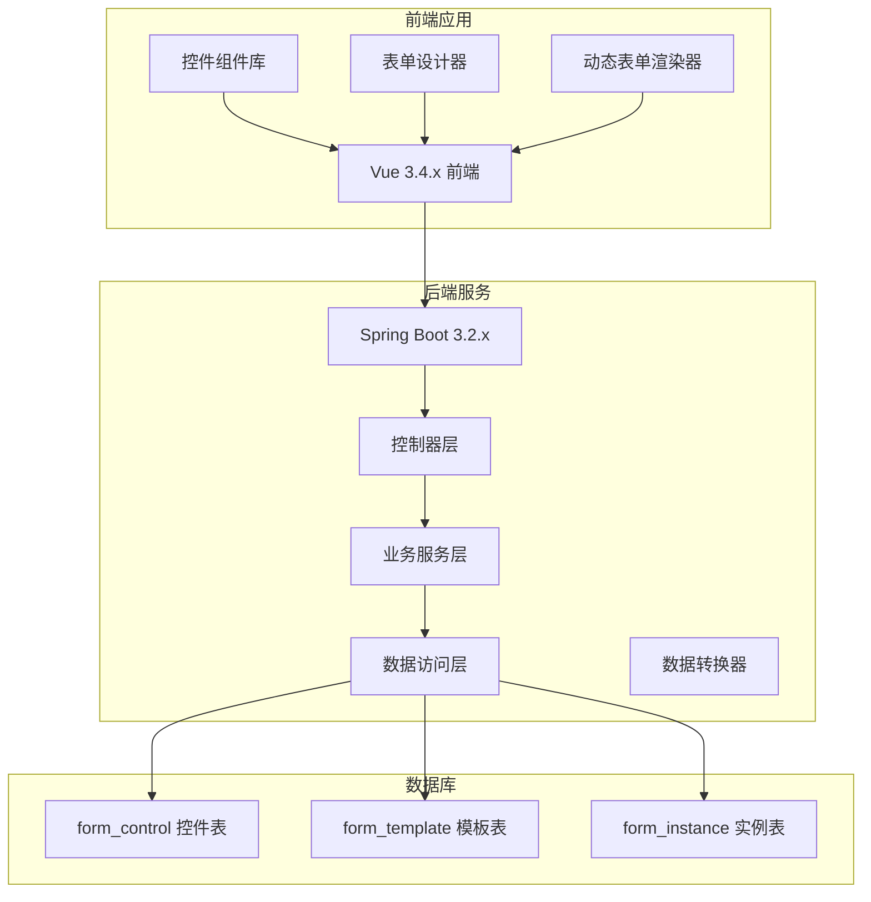
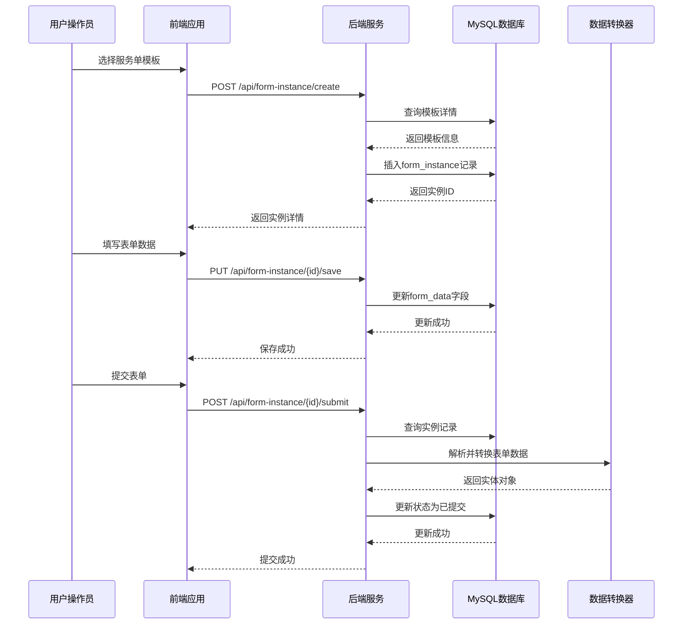
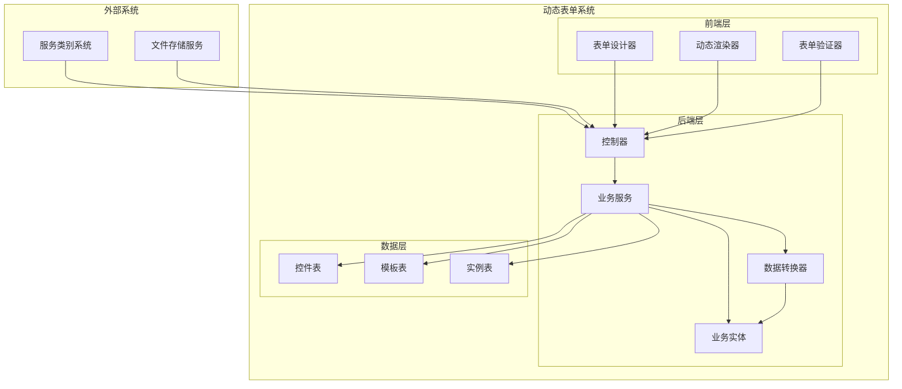
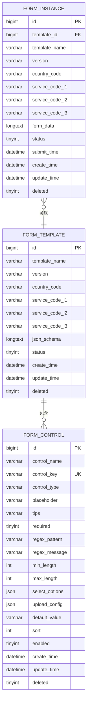
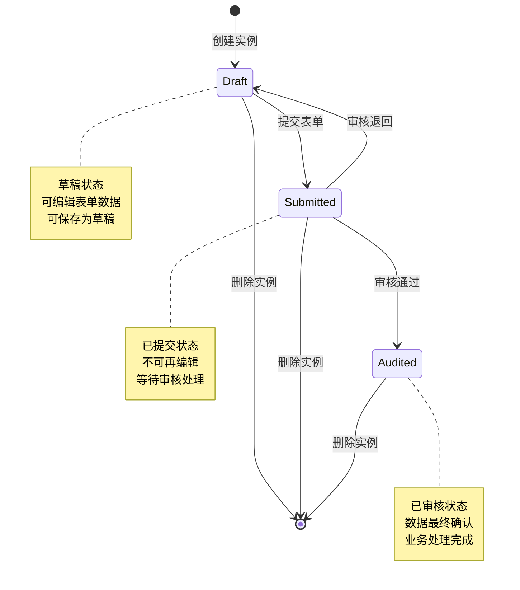
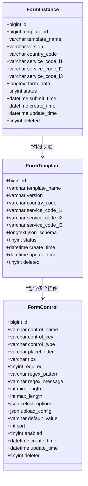
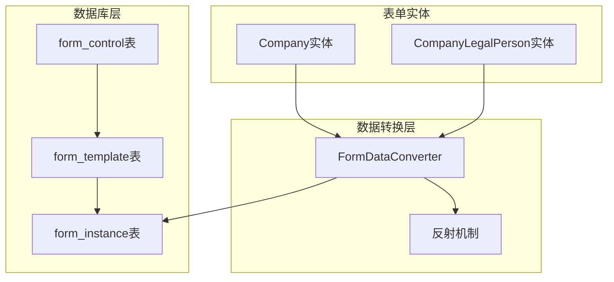
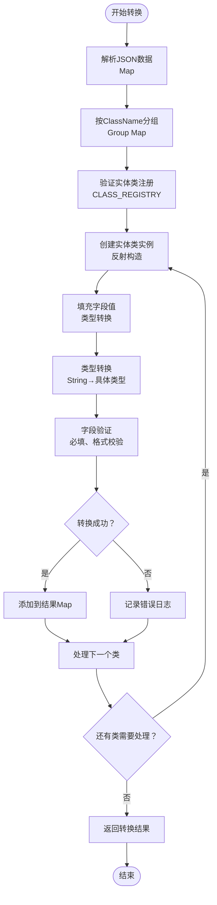
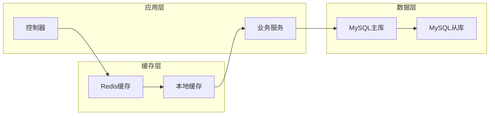

# 服务单实例表设计

<cite>
**本文档引用的文件**
- [VAT_EPR_动态表单技术方案.md](file://VAT_EPR_动态表单技术方案.md)
</cite>

## 目录
1. [简介](#简介)
2. [项目结构](#项目结构)
3. [核心组件](#核心组件)
4. [架构概览](#架构概览)
5. [详细组件分析](#详细组件分析)
6. [依赖关系分析](#依赖关系分析)
7. [性能考虑](#性能考虑)
8. [故障排除指南](#故障排除指南)
9. [结论](#结论)

## 简介

本文档详细阐述了VAT&EPR动态表单系统中服务单实例表（form_instance）的设计方案。该表作为动态表单系统的核心数据存储组件，负责保存用户填写的表单数据、关联模板信息以及实例状态管理。系统采用MySQL 8.0+作为关系型数据库，结合JSON字段实现灵活的表单数据存储，支持多国家、多服务类型的动态表单管理。

## 项目结构

动态表单系统采用前后端分离的架构设计，主要包含以下核心模块：



**图表来源**
- [VAT_EPR_动态表单技术方案.md: 773-852:773-852](file://VAT_EPR_动态表单技术方案.md#L773-L852)

**章节来源**
- [VAT_EPR_动态表单技术方案.md: 773-852:773-852](file://VAT_EPR_动态表单技术方案.md#L773-L852)

## 核心组件

### 数据库表设计概述

服务单实例表（form_instance）是整个动态表单系统的核心数据存储，承担着以下关键职责：

- **模板关联管理**：通过template_id字段关联到form_template表
- **表单数据存储**：使用JSON格式存储Map<controlKey, value>结构的表单数据
- **状态管理**：维护实例的生命周期状态（草稿、已提交、已审核）
- **元数据冗余**：存储模板的关键信息以支持查询和展示需求

### 关键字段详解

#### 主键标识字段
- `id`: BIGINT类型，自增主键，确保每条实例记录的唯一性

#### 模板关联字段
- `template_id`: BIGINT类型，非空，作为form_template表的外键引用
- `template_name`: VARCHAR(100)，冗余存储模板名称，便于查询展示
- `version`: VARCHAR(20)，冗余存储模板版本，支持版本追踪

#### 地理和业务维度字段
- `country_code`: VARCHAR(10)，存储国家代码（如DEU、FRA等），支持多国家业务
- `service_code_l1`: VARCHAR(10)，一级服务类型编码（如01/VAT，02/EPR）
- `service_code_l2`: VARCHAR(10)，二级服务类型编码（如0101、0201）
- `service_code_l3`: VARCHAR(10)，三级服务类型编码（如010101）

#### 数据存储字段
- `form_data`: LONGTEXT类型，存储JSON格式的表单数据，采用Map<controlKey, value>结构
- `status`: TINYINT类型，默认0，表示实例状态（0草稿、1已提交、2已审核）

#### 时间戳和审计字段
- `submit_time`: DATETIME类型，记录实例提交时间
- `create_time`: DATETIME类型，默认当前时间，记录创建时间
- `update_time`: DATETIME类型，默认当前时间，自动更新时间
- `deleted`: TINYINT类型，默认0，软删除标记

**章节来源**
- [VAT_EPR_动态表单技术方案.md: 132-153:132-153](file://VAT_EPR_动态表单技术方案.md#L132-L153)

## 架构概览

### 数据流架构



**图表来源**
- [VAT_EPR_动态表单技术方案.md: 437-478:437-478](file://VAT_EPR_动态表单技术方案.md#L437-L478)

### 系统集成架构



**图表来源**
- [VAT_EPR_动态表单技术方案.md: 773-852:773-852](file://VAT_EPR_动态表单技术方案.md#L773-L852)

## 详细组件分析

### 表单数据存储策略

#### JSON存储格式设计

form_data字段采用JSON格式存储Map<controlKey, value>结构，这种设计提供了极高的灵活性和扩展性：



**图表来源**
- [VAT_EPR_动态表单技术方案.md: 33-87:33-87](file://VAT_EPR_动态表单技术方案.md#L33-L87)

#### 数据类型映射策略

表单数据支持多种数据类型的存储，通过JSON格式实现统一存储：

| 数据类型 | 存储格式 | 示例值 |
|---------|---------|--------|
| 文本字符串 | JSON String | "测试公司有限公司" |
| 布尔值 | JSON Boolean | true/false |
| 整数 | JSON Number | 123 |
| 浮点数 | JSON Number | 99.99 |
| 文件列表 | JSON Array | [{"fileName":"test.pdf","fileUrl":"...","fileSize":1024}] |
| 日期 | JSON String | "2026-03-20" |

#### controlKey命名规范

controlKey采用"ClassName.fieldName"的命名规范，确保数据的结构化和可追溯性：

- `Company.companyName` → Company类的companyName字段
- `Company.companyCountry` → Company类的companyCountry字段  
- `CompanyLegalPerson.companyLegalName` → CompanyLegalPerson类的companyLegalName字段

**章节来源**
- [VAT_EPR_动态表单技术方案.md: 155-163:155-163](file://VAT_EPR_动态表单技术方案.md#L155-L163)

### 状态管理系统

#### 状态流转机制

服务单实例遵循严格的生命周期管理，状态流转遵循以下规则：



**图表来源**
- [VAT_EPR_动态表单技术方案.md: 460-478:460-478](file://VAT_EPR_动态表单技术方案.md#L460-L478)

#### 状态约束和业务规则

- **草稿状态（0）**：允许编辑和保存，支持多次草稿保存
- **已提交状态（1）**：禁止再次修改，触发后续业务流程
- **已审核状态（2）**：数据最终确认，用于业务处理和报表统计

**章节来源**
- [VAT_EPR_动态表单技术方案.md: 460-478:460-478](file://VAT_EPR_动态表单技术方案.md#L460-L478)

### 外键约束和数据完整性

#### 外键关系设计



**图表来源**
- [VAT_EPR_动态表单技术方案.md: 33-87:33-87](file://VAT_EPR_动态表单技术方案.md#L33-L87)

#### 约束和索引设计

| 约束类型 | 字段 | 描述 | 作用 |
|---------|------|------|------|
| 主键约束 | id | 自增主键 | 唯一标识每条记录 |
| 外键约束 | template_id | 关联模板表 | 维护数据一致性 |
| 唯一约束 | control_key | 控件键唯一性 | 防止重复定义 |
| 普通索引 | idx_template_id | 模板ID索引 | 加速模板查询 |
| 普通索引 | status | 状态索引 | 支持状态筛选 |
| 普通索引 | country_code | 国家代码索引 | 支持地域筛选 |

**章节来源**
- [VAT_EPR_动态表单技术方案.md: 33-87:33-87](file://VAT_EPR_动态表单技术方案.md#L33-L87)

## 依赖关系分析

### 业务实体依赖关系



**图表来源**
- [VAT_EPR_动态表单技术方案.md: 594-703:594-703](file://VAT_EPR_动态表单技术方案.md#L594-L703)

### 数据转换流程



**图表来源**
- [VAT_EPR_动态表单技术方案.md: 596-684:596-684](file://VAT_EPR_动态表单技术方案.md#L596-L684)

**章节来源**
- [VAT_EPR_动态表单技术方案.md: 594-703:594-703](file://VAT_EPR_动态表单技术方案.md#L594-L703)

## 性能考虑

### 查询性能优化

#### 索引设计策略

针对高频查询场景，建议实施以下索引策略：

1. **复合索引优化**
   - `(country_code, service_code_l3, status)`：支持国家+服务类型+状态组合查询
   - `(template_id, status, create_time)`：支持模板维度的实例查询
   - `(status, submit_time)`：支持状态和提交时间的排序查询

2. **全文检索优化**
   - 对于需要模糊搜索的文本字段，考虑建立全文索引
   - 使用JSON函数对form_data进行部分索引优化

#### 查询模式优化

```sql
-- 推荐的高效查询模式
SELECT id, template_id, status, submit_time, create_time
FROM form_instance 
WHERE template_id = ? 
  AND status IN (0, 1) 
  AND create_time BETWEEN ? AND ?
ORDER BY create_time DESC
LIMIT 20 OFFSET 0;
```

### 大数据量场景优化

#### 分表策略

对于大规模数据场景，建议实施水平分表：

1. **按时间分表**
   - 按月或按季度创建新的表实例
   - 保持历史数据的可查询性

2. **按地域分表**
   - 按国家代码进行数据分区
   - 支持跨区域的数据隔离

#### 缓存策略



**图表来源**
- [VAT_EPR_动态表单技术方案.md: 594-703:594-703](file://VAT_EPR_动态表单技术方案.md#L594-L703)

### 存储优化策略

#### JSON字段优化

1. **数据压缩**
   - 对频繁查询的字段进行压缩存储
   - 使用合适的压缩算法平衡CPU和存储空间

2. **字段拆分**
   - 将热点字段从JSON中提取到独立字段
   - 减少JSON解析开销

#### 内存管理

- 合理设置MySQL的innodb_buffer_pool_size
- 优化查询结果集的内存使用
- 实施连接池管理，避免连接泄漏

## 故障排除指南

### 常见问题诊断

#### 表单数据转换异常

**问题现象**：表单提交时报错，无法转换为实体对象

**诊断步骤**：
1. 检查controlKey格式是否符合"ClassName.fieldName"规范
2. 验证实体类是否已在CLASS_REGISTRY中注册
3. 确认字段类型转换是否正确
4. 检查必填字段是否为空

**解决方案**：
```java
// 添加实体类注册
CLASS_REGISTRY.put("NewEntity", NewEntity.class);
```

#### 数据一致性问题

**问题现象**：查询到的数据与预期不符

**诊断步骤**：
1. 检查外键约束是否生效
2. 验证JSON数据格式是否正确
3. 确认索引是否正常工作
4. 检查事务隔离级别设置

**解决方案**：
```sql
-- 检查外键约束
SHOW CREATE TABLE form_instance;

-- 验证JSON格式
SELECT JSON_VALID(form_data) FROM form_instance WHERE id = ?;
```

#### 性能问题排查

**问题现象**：查询响应时间过长

**诊断步骤**：
1. 使用EXPLAIN分析慢查询
2. 检查索引使用情况
3. 监控数据库连接数
4. 分析锁等待情况

**优化建议**：
```sql
-- 添加合适的索引
CREATE INDEX idx_template_status_time ON form_instance(template_id, status, create_time);

-- 分析查询计划
EXPLAIN SELECT * FROM form_instance WHERE template_id = ? AND status = ?;
```

**章节来源**
- [VAT_EPR_动态表单技术方案.md: 856-869:856-869](file://VAT_EPR_动态表单技术方案.md#L856-L869)

### 错误处理机制

#### 异常分类和处理

| 异常类型 | 触发条件 | 处理方式 | 影响范围 |
|---------|---------|---------|---------|
| 数据格式异常 | JSON格式不正确 | 记录日志并返回错误 | 单次操作 |
| 外键约束异常 | 关联数据不存在 | 返回参数错误 | 单次操作 |
| 类型转换异常 | 字段类型不匹配 | 记录转换失败 | 单次操作 |
| 并发冲突异常 | 同时修改同一记录 | 重试机制 | 单次操作 |

#### 监控和告警

建议实施以下监控指标：
- 数据库连接池使用率
- 查询响应时间分布
- 错误率和错误类型统计
- 索引命中率
- 磁盘空间使用情况

## 结论

服务单实例表（form_instance）作为VAT&EPR动态表单系统的核心组件，通过精心设计的数据库结构和完善的业务逻辑，实现了灵活、可扩展的表单数据管理能力。其关键特性包括：

1. **灵活的数据存储**：采用JSON格式存储动态表单数据，支持无限扩展
2. **完善的生命周期管理**：严格的状态流转机制确保数据完整性
3. **高效的查询性能**：合理的索引设计和查询优化策略
4. **强大的扩展性**：支持多国家、多服务类型的业务场景
5. **可靠的数据一致性**：通过外键约束和事务管理保证数据质量

该设计方案为动态表单系统的长期发展奠定了坚实的基础，能够满足复杂业务场景下的数据管理需求，并为未来的功能扩展提供了充足的空间。