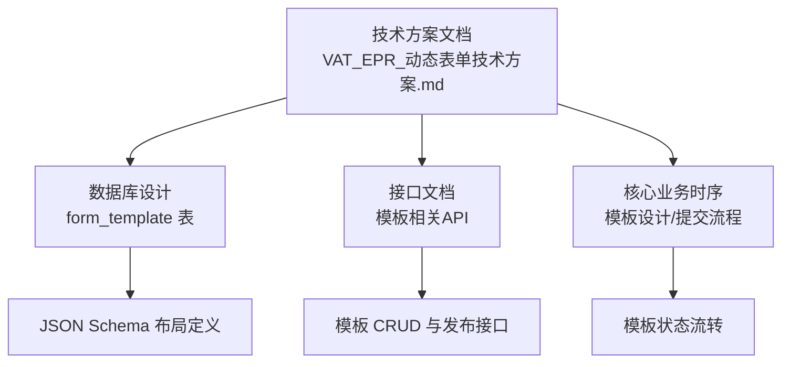
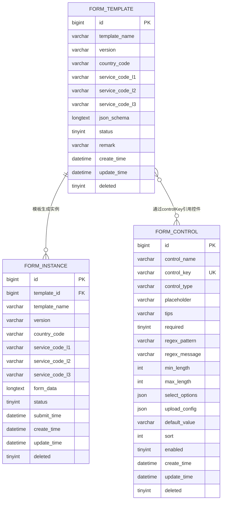
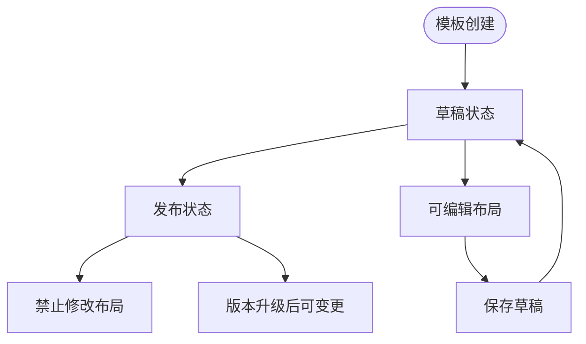
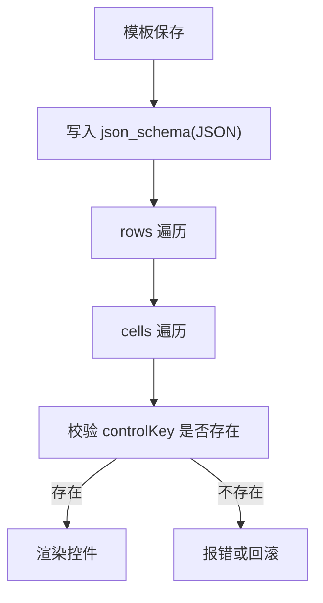
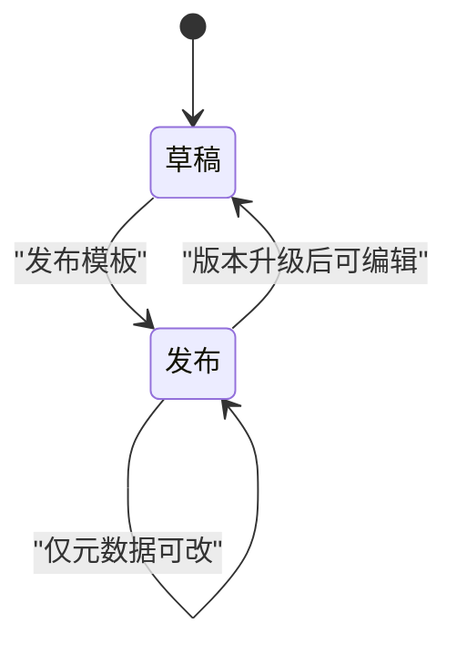
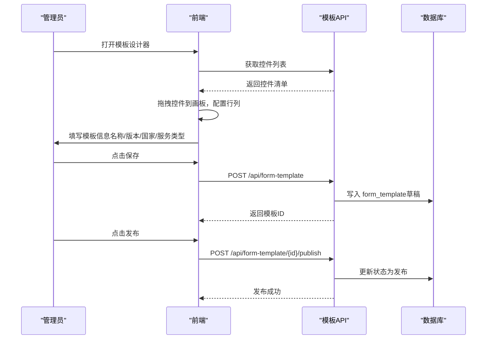

# 服务单模板表设计

<cite>
**本文引用的文件**
- [VAT_EPR_动态表单技术方案.md](file://VAT_EPR_动态表单技术方案.md)
</cite>

## 目录
1. [简介](#简介)
2. [项目结构](#项目结构)
3. [核心组件](#核心组件)
4. [架构总览](#架构总览)
5. [详细组件分析](#详细组件分析)
6. [依赖分析](#依赖分析)
7. [性能考量](#性能考量)
8. [故障排查指南](#故障排查指南)
9. [结论](#结论)
10. [附录](#附录)

## 简介
本设计文档围绕“服务单模板表”展开，聚焦于模板表的核心字段、JSON Schema布局定义、状态管理与版本控制策略，并结合仓库中的数据库建表语句与接口说明，给出完整的建模思路、索引设计、查询优化建议以及最佳实践。读者无需具备深厚数据库背景，也能通过图示与分层讲解理解模板表的设计要点与运行机制。

## 项目结构
该仓库以技术方案文档形式呈现了动态表单系统的数据库设计、接口定义与核心组件实现思路。其中“服务单模板表”位于数据库设计章节，配套的接口文档与核心业务时序展示了模板的创建、查询、发布等生命周期行为。

**章节来源**
- [VAT_EPR_动态表单技术方案.md:31-130](file://VAT_EPR_动态表单技术方案.md#L31-L130)
- [VAT_EPR_动态表单技术方案.md:225-304](file://VAT_EPR_动态表单技术方案.md#L225-L304)
- [VAT_EPR_动态表单技术方案.md:415-478](file://VAT_EPR_动态表单技术方案.md#L415-L478)

## 核心组件
- 服务单模板表（form_template）
  - 核心字段：模板名称、版本号、国家代码、服务类型三级编码、JSON Schema布局定义、状态、备注、时间戳与软删除标记
  - JSON Schema 描述表单网格布局、行列配置与控件引用关系
  - 状态管理：草稿/发布两种状态，发布后禁止修改布局
  - 版本控制：发布后变更需升版本号，避免影响历史实例

**章节来源**
- [VAT_EPR_动态表单技术方案.md:68-87](file://VAT_EPR_动态表单技术方案.md#L68-L87)
- [VAT_EPR_动态表单技术方案.md:89-128](file://VAT_EPR_动态表单技术方案.md#L89-L128)
- [VAT_EPR_动态表单技术方案.md:860-860](file://VAT_EPR_动态表单技术方案.md#L860-L860)

## 架构总览
服务单模板表作为动态表单系统的核心元数据载体，与“自定义控件表”和“服务单实例表”协同工作，形成“模板—控件—实例”的完整闭环。

**图表来源**
- [VAT_EPR_动态表单技术方案.md:33-59](file://VAT_EPR_动态表单技术方案.md#L33-L59)
- [VAT_EPR_动态表单技术方案.md:68-87](file://VAT_EPR_动态表单技术方案.md#L68-L87)
- [VAT_EPR_动态表单技术方案.md:132-153](file://VAT_EPR_动态表单技术方案.md#L132-L153)

## 详细组件分析

### 服务单模板表（form_template）字段与职责
- id：主键，自增
- template_name：服务单名称，用于展示与识别
- version：版本号，默认“1.0.0”，发布后变更需升版本
- country_code：国家代码，限定范围见附录
- service_code_l1/l2/l3：服务类型三级编码，用于分类检索与筛选
- json_schema：JSON Schema，描述表单网格布局、行列与控件引用
- status：状态，0=草稿，1=发布
- remark：备注
- create_time/update_time/deleted：时间戳与软删除

**章节来源**
- [VAT_EPR_动态表单技术方案.md:68-87](file://VAT_EPR_动态表单技术方案.md#L68-L87)
- [VAT_EPR_动态表单技术方案.md:860-860](file://VAT_EPR_动态表单技术方案.md#L860-L860)

### JSON Schema 的存储格式与结构设计
- 存储格式：LONGTEXT，采用JSON字符串存储
- 结构要点：
  - layout：布局类型，当前为“grid”
  - columns：网格列数
  - rows：行数组，每行包含 rowIndex 与 cells
  - cells：单元格数组，每个单元格包含 colIndex、colSpan、controlId、controlKey、controlType、label 等
- 控件引用关系：通过 controlKey 与“自定义控件表”建立一对一映射，确保控件属性与校验规则可复用

**章节来源**
- [VAT_EPR_动态表单技术方案.md:89-128](file://VAT_EPR_动态表单技术方案.md#L89-L128)
- [VAT_EPR_动态表单技术方案.md:484-529](file://VAT_EPR_动态表单技术方案.md#L484-L529)

### 模板状态管理策略
- 草稿：允许编辑布局与元数据
- 发布：锁定布局，禁止修改；新增实例基于发布版本
- 版本控制：发布后变更需升版本号，避免历史实例数据错乱

**章节来源**
- [VAT_EPR_动态表单技术方案.md:860-860](file://VAT_EPR_动态表单技术方案.md#L860-L860)

### 查询与索引设计
- 主键：id（自增）
- 建议索引：
  - uk_template_key：组合唯一索引（country_code, service_code_l1, service_code_l2, service_code_l3, version），用于快速定位唯一模板
  - idx_country_service：按国家+服务类型过滤
  - idx_status：按状态过滤（草稿/发布）
  - idx_create_update：按创建/更新时间排序
- 查询优化建议：
  - 列出模板时优先使用国家与服务类型条件
  - 模板详情查询使用主键或唯一索引
  - 发布后对 json_schema 的读取应限制在必要场景，避免全量扫描

**章节来源**
- [VAT_EPR_动态表单技术方案.md:68-87](file://VAT_EPR_动态表单技术方案.md#L68-L87)

### SQL 建表语句与索引设计
- 建表语句（摘自技术方案）：
  - 主键：id
  - 唯一约束：建议增加组合唯一索引（country_code, service_code_l1, service_code_l2, service_code_l3, version）
  - 索引：按业务查询需求补充 idx_country_service、idx_status、idx_create_update
- 注意事项：
  - json_schema 使用 LONGTEXT 存储，注意字符集与排序规则
  - 发布后禁止修改布局，变更需升版本

**章节来源**
- [VAT_EPR_动态表单技术方案.md:68-87](file://VAT_EPR_动态表单技术方案.md#L68-L87)

### 接口与业务时序
- 模板创建/保存：携带模板名称、版本、国家与服务类型三级编码、json_schema、状态
- 模板查询：支持按国家与服务类型三级编码筛选
- 模板发布：将状态从草稿切换为发布
- 实例创建：基于模板ID创建实例，返回模板详情与控件明细，供前端动态渲染

**章节来源**
- [VAT_EPR_动态表单技术方案.md:225-304](file://VAT_EPR_动态表单技术方案.md#L225-L304)
- [VAT_EPR_动态表单技术方案.md:415-435](file://VAT_EPR_动态表单技术方案.md#L415-L435)

## 依赖分析
- 与“自定义控件表”的依赖：通过 controlKey 建立控件引用关系，确保控件属性与校验规则可复用
- 与“服务单实例表”的依赖：模板发布后生成实例，实例中保留模板名称、版本与服务类型信息，便于追溯

**章节来源**
- [VAT_EPR_动态表单技术方案.md:33-59](file://VAT_EPR_动态表单技术方案.md#L33-L59)
- [VAT_EPR_动态表单技术方案.md:68-87](file://VAT_EPR_动态表单技术方案.md#L68-L87)
- [VAT_EPR_动态表单技术方案.md:132-153](file://VAT_EPR_动态表单技术方案.md#L132-L153)

## 性能考量
- JSON Schema 存储与解析
  - 使用 LONGTEXT 存储，注意字符集与排序规则
  - 读取时尽量只取必要字段，避免全量扫描
- 查询优化
  - 为高频查询字段建立索引（国家+服务类型+状态）
  - 使用组合唯一索引避免重复模板
- 版本与状态
  - 发布后禁止修改布局，减少并发冲突
  - 升版本策略降低对历史实例的影响

[本节为通用性能建议，不直接分析具体文件]

## 故障排查指南
- 控件引用异常
  - 现象：单元格引用的 controlKey 不存在
  - 处理：检查 controlKey 是否存在于“自定义控件表”，并保持命名规范
- 发布后布局被修改
  - 现象：历史实例数据错乱
  - 处理：发布后禁止修改布局，变更需升版本
- 查询性能差
  - 现象：按国家/服务类型筛选慢
  - 处理：为 country_code、service_code_l1~l3、status 建立索引

**章节来源**
- [VAT_EPR_动态表单技术方案.md:858-860](file://VAT_EPR_动态表单技术方案.md#L858-L860)
- [VAT_EPR_动态表单技术方案.md:860-860](file://VAT_EPR_动态表单技术方案.md#L860-L860)

## 结论
服务单模板表通过清晰的字段设计与严格的版本/状态管理，实现了动态表单的可配置化与可复用化。配合“自定义控件表”与“服务单实例表”，形成从设计到执行的完整闭环。建议在生产环境中完善索引与约束，遵循发布后不可修改布局的原则，并通过版本升级应对变更需求。

[本节为总结性内容，不直接分析具体文件]

## 附录
- 国家代码枚举（参考）
  - 德国：DEU
  - 法国：FRA
  - 意大利：ITA
  - 西班牙：ESP
  - 波兰：POL
  - 捷克：CZE
  - 英国：GBR

**章节来源**
- [VAT_EPR_动态表单技术方案.md:734-745](file://VAT_EPR_动态表单技术方案.md#L734-L745)