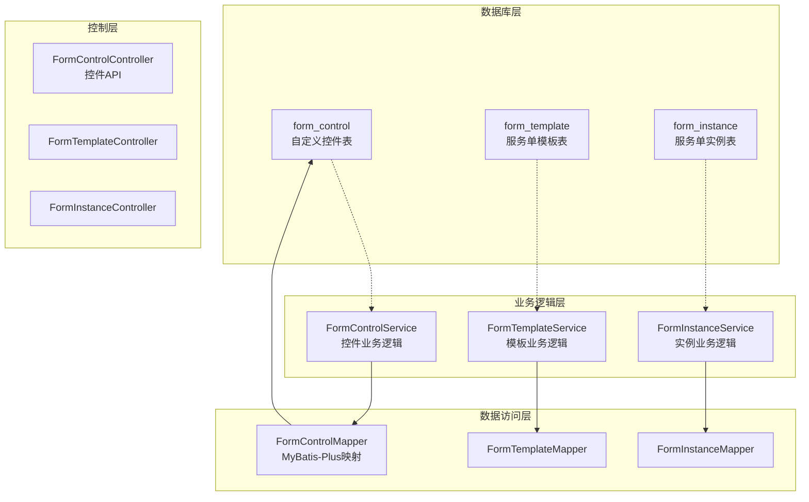
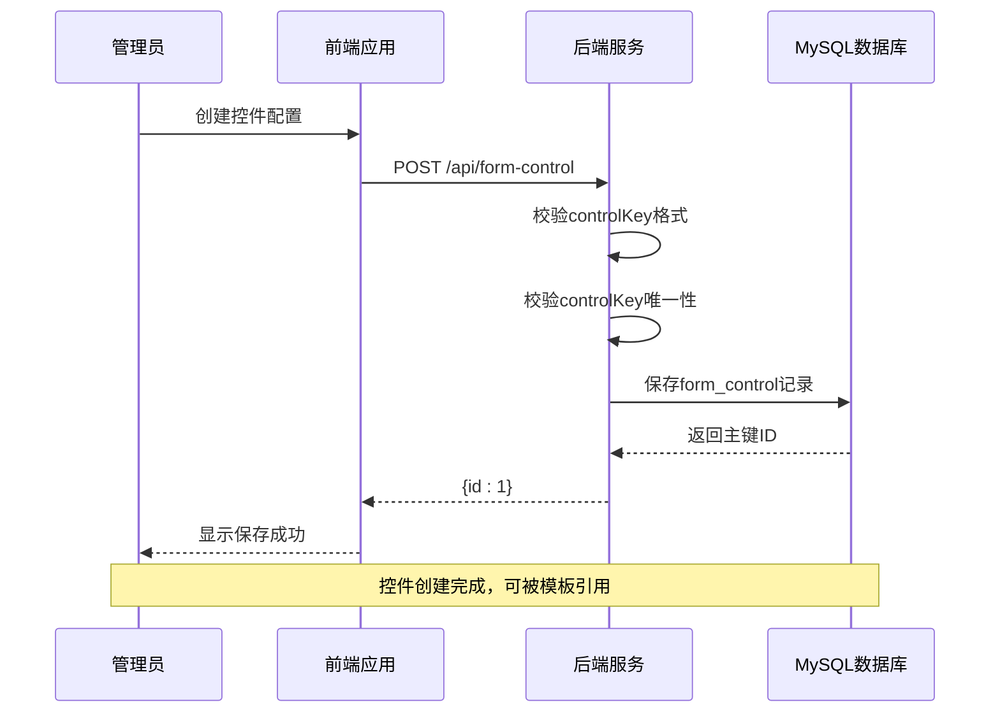
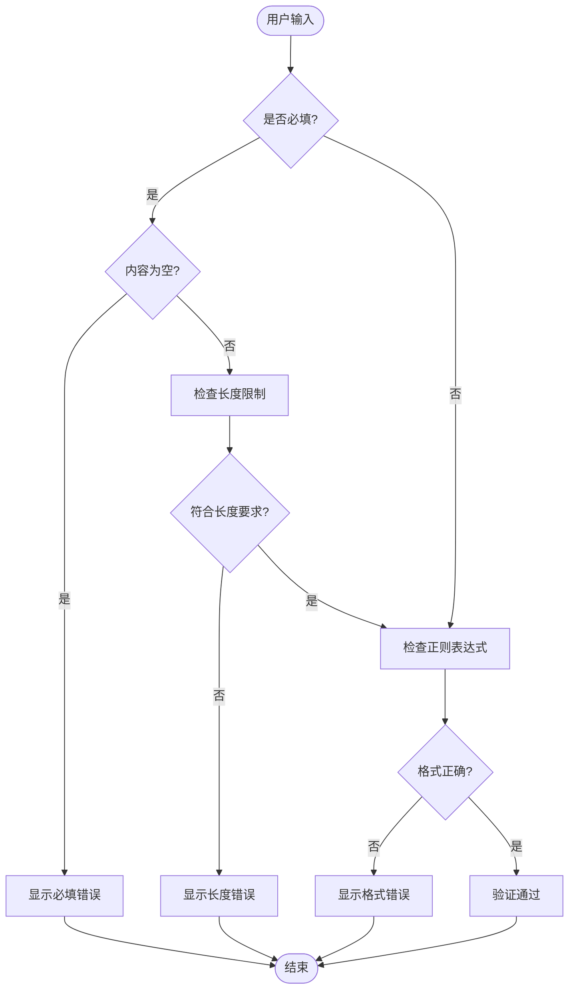
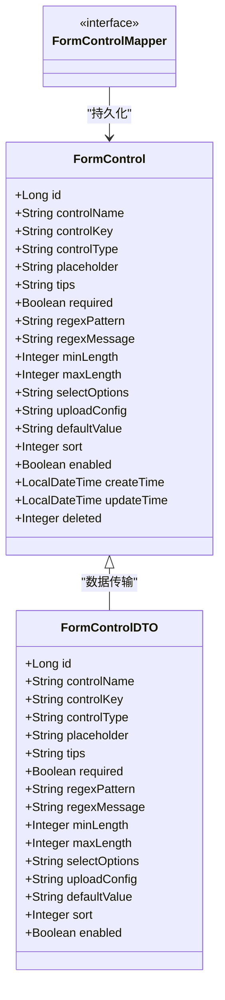

# 自定义控件表设计

<cite>
**本文档引用的文件**
- [VAT_EPR_动态表单技术方案.md](file://VAT_EPR_动态表单技术方案.md)
- [init.sql](file://genetics-server/src/main/resources/db/init.sql)
- [FormControl.java](file://genetics-server/src/main/java/com/genetics/entity/FormControl.java)
- [FormControlDTO.java](file://genetics-server/src/main/java/com/genetics/dto/FormControlDTO.java)
- [FormControlMapper.java](file://genetics-server/src/main/java/com/genetics/mapper/FormControlMapper.java)
</cite>

## 目录
1. [简介](#简介)
2. [项目结构](#项目结构)
3. [核心组件](#核心组件)
4. [架构概览](#架构概览)
5. [详细组件分析](#详细组件分析)
6. [依赖关系分析](#依赖关系分析)
7. [性能考虑](#性能考虑)
8. [故障排除指南](#故障排除指南)
9. [结论](#结论)
10. [附录](#附录)

## 简介
本文档为form_control自定义控件表提供详细的数据库设计文档。该表是动态表单系统的核心基础表，用于定义可复用的表单控件配置。通过标准化的控件定义，系统实现了控件与业务实体的松耦合关联，支持多种控件类型、验证规则和UI配置。

## 项目结构
动态表单系统采用分层架构设计，主要包含以下核心模块：



**图表来源**
- [VAT_EPR_动态表单技术方案.md:31-87](file://VAT_EPR_动态表单技术方案.md#L31-L87)
- [FormControl.java:1-78](file://genetics-server/src/main/java/com/genetics/entity/FormControl.java#L1-L78)

**章节来源**
- [VAT_EPR_动态表单技术方案.md:31-87](file://VAT_EPR_动态表单技术方案.md#L31-L87)

## 核心组件
form_control表作为系统的核心基础表，承担着控件定义和配置管理的重要职责。该表通过标准化的字段设计，实现了控件的灵活配置和高效管理。

### 表结构概述
form_control表采用标准的MySQL InnoDB引擎，支持UTF-8字符集，具备完整的审计字段和逻辑删除功能。表结构设计充分考虑了动态表单系统的特殊需求，提供了丰富的控件配置能力。

**章节来源**
- [VAT_EPR_动态表单技术方案.md:33-59](file://VAT_EPR_动态表单技术方案.md#L33-L59)
- [init.sql:8-31](file://genetics-server/src/main/resources/db/init.sql#L8-L31)

## 架构概览
动态表单系统采用前后端分离架构，通过RESTful API实现控件配置、模板设计和实例管理的完整流程。



**图表来源**
- [VAT_EPR_动态表单技术方案.md:400-414](file://VAT_EPR_动态表单技术方案.md#L400-L414)

## 详细组件分析

### 字段定义详解

#### 基础标识字段
- **id**: BIGINT类型，自增主键，用于唯一标识每个控件配置
- **control_key**: VARCHAR(200)，唯一键，采用"ClassName.fieldName"格式，建立控件与业务实体的关联

#### 控件显示配置
- **control_name**: VARCHAR(100)，控件显示名称，用于界面展示
- **placeholder**: VARCHAR(200)，输入框占位符文本
- **tips**: VARCHAR(500)，控件使用说明或帮助信息
- **sort**: INT，默认0，用于控件排序显示

#### 控件行为配置
- **control_type**: VARCHAR(30)，控件类型枚举，支持INPUT、SELECT、SWITCH、UPLOAD、TEXTAREA、DATE、NUMBER
- **required**: TINYINT(1)，布尔标识，0表示非必填，1表示必填
- **enabled**: TINYINT(1)，启用状态标识，默认1启用

#### 验证规则配置
- **regex_pattern**: VARCHAR(500)，正则表达式约束
- **regex_message**: VARCHAR(200)，正则校验失败提示语
- **min_length**: INT，最小长度限制
- **max_length**: INT，最大长度限制

#### 数据配置字段
- **select_options**: JSON格式，下拉框选项数组，格式为[{"label":"中文名","value":"DEU"}]
- **upload_config**: JSON格式，文件上传配置，包含maxCount、accept、maxSizeMB等参数
- **default_value**: VARCHAR(500)，控件默认值

#### 系统管理字段
- **create_time**: DATETIME，默认当前时间，记录创建时间
- **update_time**: DATETIME，默认当前时间，自动更新时间戳
- **deleted**: TINYINT(1)，逻辑删除标识，默认0未删除

**章节来源**
- [VAT_EPR_动态表单技术方案.md:35-59](file://VAT_EPR_动态表单技术方案.md#L35-L59)
- [FormControl.java:18-77](file://genetics-server/src/main/java/com/genetics/entity/FormControl.java#L18-L77)
- [init.sql:9-31](file://genetics-server/src/main/resources/db/init.sql#L9-L31)

### control_key命名规范

#### 格式要求
control_key采用严格的"ClassName.fieldName"格式，其中：
- **ClassName**: 必须与业务实体类名完全匹配
- **fieldName**: 必须与实体类的字段名一致
- **唯一性**: 整个系统内control_key必须唯一

#### 命名示例
- `Company.companyName` → Company类的companyName字段
- `Company.companyCountry` → Company类的companyCountry字段  
- `CompanyLegalPerson.companyLegalName` → CompanyLegalPerson类的companyLegalName字段

#### 关联机制
通过control_key实现控件与业务实体的强关联，确保：
1. **类型安全**: 控件类型与实体字段类型匹配
2. **数据一致性**: 表单数据与业务实体结构一致
3. **反射支持**: 支持运行时的对象转换和赋值

**章节来源**
- [VAT_EPR_动态表单技术方案.md:61-65](file://VAT_EPR_动态表单技术方案.md#L61-L65)

### 数据类型与约束分析

#### 字段类型映射
| 数据库字段 | Java实体类型 | 验证注解 | 约束条件 |
|------------|--------------|----------|----------|
| id | Long | - | 主键，自增 |
| control_name | String | @NotBlank | 非空，长度<=100 |
| control_key | String | @NotBlank | 非空，唯一约束 |
| control_type | String | @NotBlank | 非空，枚举值 |
| required | Boolean | @NotNull | 非空，布尔值 |
| sort | Integer | - | 非负整数 |
| enabled | Boolean | - | 布尔值 |
| min_length/max_length | Integer | - | 非负整数 |

#### 约束条件
- **唯一性**: control_key字段具有唯一索引，确保全局唯一性
- **非空性**: 关键字段均设置NOT NULL约束
- **范围控制**: 数值字段设置合理的取值范围
- **格式验证**: control_key遵循严格的命名规范

**章节来源**
- [FormControlDTO.java:15-44](file://genetics-server/src/main/java/com/genetics/dto/FormControlDTO.java#L15-L44)
- [FormControl.java:18-77](file://genetics-server/src/main/java/com/genetics/entity/FormControl.java#L18-L77)

### 控件类型支持

#### 基础输入控件
- **INPUT**: 文本输入框，支持长度限制和正则验证
- **TEXTAREA**: 多行文本输入框，适合长文本内容
- **NUMBER**: 数字输入框，支持数值范围验证

#### 选择类控件
- **SELECT**: 下拉选择框，通过select_options配置选项
- **SWITCH**: 开关控件，布尔值快速切换

#### 高级控件
- **DATE**: 日期选择器，支持日期格式化
- **UPLOAD**: 文件上传控件，通过upload_config配置上传参数

**章节来源**
- [VAT_EPR_动态表单技术方案.md:40](file://VAT_EPR_动态表单技术方案.md#L40)

### 验证规则实现

#### 前端验证流程


**图表来源**
- [VAT_EPR_动态表单技术方案.md:545](file://VAT_EPR_动态表单技术方案.md#L545)

**章节来源**
- [VAT_EPR_动态表单技术方案.md:545-548](file://VAT_EPR_动态表单技术方案.md#L545-L548)

## 依赖关系分析

### 实体类关系图


**图表来源**
- [FormControl.java:1-78](file://genetics-server/src/main/java/com/genetics/entity/FormControl.java#L1-L78)
- [FormControlDTO.java:1-45](file://genetics-server/src/main/java/com/genetics/dto/FormControlDTO.java#L1-L45)
- [FormControlMapper.java:1-10](file://genetics-server/src/main/java/com/genetics/mapper/FormControlMapper.java#L1-L10)

### 数据访问模式
系统采用MyBatis-Plus的通用Mapper模式，提供标准的CRUD操作：
- **继承BaseMapper**: 自动获得常用数据库操作方法
- **注解映射**: 使用@TableId、@TableName等注解进行字段映射
- **逻辑删除**: 通过@TableLogic实现软删除功能

**章节来源**
- [FormControlMapper.java:1-10](file://genetics-server/src/main/java/com/genetics/mapper/FormControlMapper.java#L1-L10)
- [FormControl.java:12-16](file://genetics-server/src/main/java/com/genetics/entity/FormControl.java#L12-L16)

## 性能考虑

### 索引设计
- **主键索引**: id字段的聚簇索引，提供O(log n)查询性能
- **唯一索引**: uk_control_key索引，确保control_key唯一性
- **查询优化**: 建议在control_type、enabled、create_time等常用查询字段上建立索引

### 缓存策略
- **控件配置缓存**: 将常用的控件配置加载到内存缓存
- **模板关联缓存**: 缓存控件与模板的关联关系
- **热点数据缓存**: 对高频使用的控件类型进行缓存

### 扩展性设计
- **JSON字段扩展**: select_options和upload_config使用JSON格式，便于功能扩展
- **枚举类型扩展**: control_type支持新增控件类型
- **配置参数扩展**: 通过JSON配置支持更多控件特性和验证规则

## 故障排除指南

### 常见问题及解决方案

#### control_key重复错误
**问题描述**: 插入重复的control_key导致唯一约束冲突
**解决方案**: 
1. 检查现有控件配置，避免重复命名
2. 使用系统提供的查询接口确认control_key唯一性
3. 修改命名规范，增加业务前缀区分

#### 控件类型不匹配
**问题描述**: 控件类型与业务实体字段类型不兼容
**解决方案**:
1. 确认control_type与实体字段类型匹配
2. 检查前端组件与后端类型的对应关系
3. 更新控件配置或调整实体结构

#### JSON配置格式错误
**问题描述**: select_options或upload_config JSON格式不正确
**解决方案**:
1. 使用系统提供的示例格式进行配置
2. 在插入前进行JSON格式验证
3. 查看系统日志获取具体的格式错误信息

**章节来源**
- [VAT_EPR_动态表单技术方案.md:408-410](file://VAT_EPR_动态表单技术方案.md#L408-L410)

### 调试技巧
- **日志监控**: 启用MyBatis-Plus SQL日志，监控数据库操作
- **接口测试**: 使用Postman等工具测试API接口
- **数据验证**: 在插入前进行数据完整性检查
- **异常处理**: 捕获并记录数据库约束异常

## 结论
form_control表设计充分体现了动态表单系统的核心理念：通过标准化的控件配置实现业务实体与UI界面的解耦。该设计不仅满足了当前的功能需求，还为未来的功能扩展和技术演进奠定了坚实的基础。

表结构设计合理，字段覆盖全面，约束条件明确，为系统的稳定运行提供了保障。通过control_key的命名规范和关联机制，实现了控件与业务实体的强类型绑定，确保了数据的一致性和准确性。

## 附录

### 完整SQL建表语句
```sql
CREATE TABLE `form_control` (
    `id`              BIGINT       NOT NULL AUTO_INCREMENT COMMENT '主键ID',
    `control_name`    VARCHAR(100) NOT NULL COMMENT '控件名称（展示用）',
    `control_key`     VARCHAR(200) NOT NULL COMMENT '控件key，格式: ClassName.fieldName',
    `control_type`    VARCHAR(30)  NOT NULL COMMENT '控件类型: INPUT/SELECT/SWITCH/UPLOAD/TEXTAREA/DATE/NUMBER',
    `placeholder`     VARCHAR(200) DEFAULT NULL COMMENT '占位文本',
    `tips`            VARCHAR(500) DEFAULT NULL COMMENT '控件说明(TIPS)',
    `required`        TINYINT(1)   NOT NULL DEFAULT 0 COMMENT '是否必填: 0否 1是',
    `regex_pattern`   VARCHAR(500) DEFAULT NULL COMMENT '正则表达式约束',
    `regex_message`   VARCHAR(200) DEFAULT NULL COMMENT '正则校验失败提示语',
    `min_length`      INT          DEFAULT NULL COMMENT '最小长度',
    `max_length`      INT          DEFAULT NULL COMMENT '最大长度',
    `select_options`  JSON         DEFAULT NULL COMMENT '下拉框选项 [{"label":"xx","value":"xx"}]',
    `upload_config`   JSON         DEFAULT NULL COMMENT '上传配置 {"maxCount":3,"accept":".pdf","maxSizeMB":10}',
    `default_value`   VARCHAR(500) DEFAULT NULL COMMENT '默认值',
    `sort`            INT          NOT NULL DEFAULT 0 COMMENT '排序',
    `enabled`         TINYINT(1)   NOT NULL DEFAULT 1 COMMENT '是否启用: 0否 1是',
    `create_time`     DATETIME     NOT NULL DEFAULT CURRENT_TIMESTAMP,
    `update_time`     DATETIME     NOT NULL DEFAULT CURRENT_TIMESTAMP ON UPDATE CURRENT_TIMESTAMP,
    `deleted`         TINYINT(1)   NOT NULL DEFAULT 0,
    PRIMARY KEY (`id`),
    UNIQUE KEY `uk_control_key` (`control_key`)
) ENGINE=InnoDB DEFAULT CHARSET=utf8mb4 COMMENT='自定义控件定义表';
```

### 最佳实践建议

#### 控件设计最佳实践
1. **命名规范**: 严格遵循"ClassName.fieldName"格式
2. **类型匹配**: 确保控件类型与实体字段类型一致
3. **验证完善**: 为重要字段配置适当的验证规则
4. **配置清晰**: JSON配置保持简洁明了，易于维护

#### 扩展性考虑
1. **向后兼容**: 新增字段时保持默认值兼容
2. **配置驱动**: 通过JSON配置支持更多控件特性
3. **插件化**: 支持新增控件类型的插件化扩展
4. **版本管理**: 建立控件配置的版本管理机制

#### 性能优化建议
1. **索引优化**: 根据查询模式建立合适的索引
2. **缓存策略**: 实施多层缓存机制提升响应速度
3. **批量操作**: 支持控件配置的批量导入导出
4. **异步处理**: 对耗时的控件操作采用异步处理

**章节来源**
- [VAT_EPR_动态表单技术方案.md:35-59](file://VAT_EPR_动态表单技术方案.md#L35-L59)
- [init.sql:71-76](file://genetics-server/src/main/resources/db/init.sql#L71-L76)