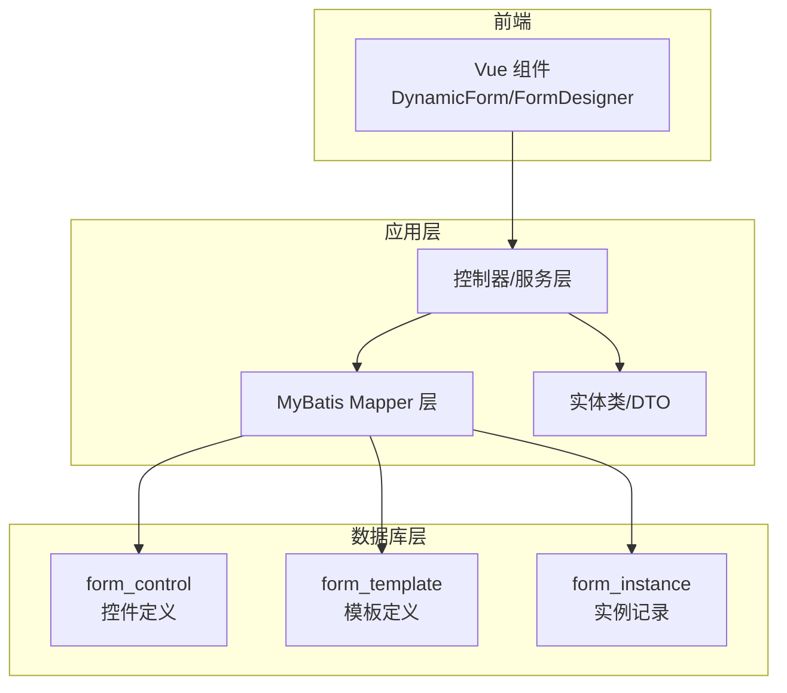
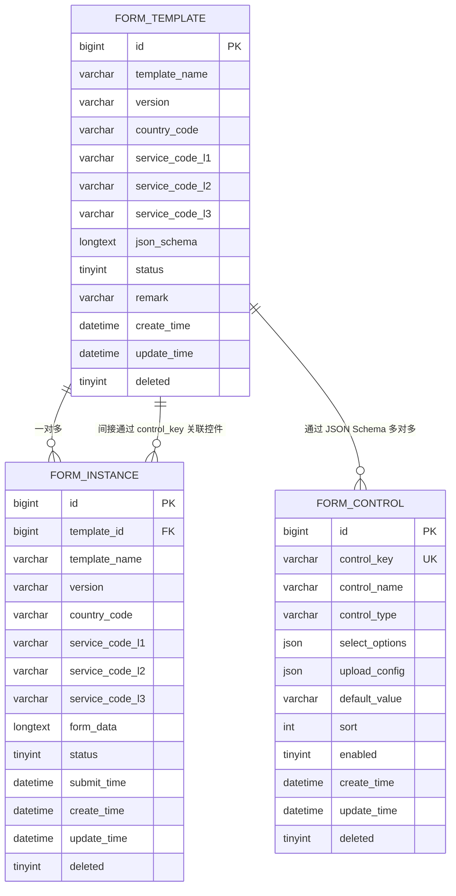
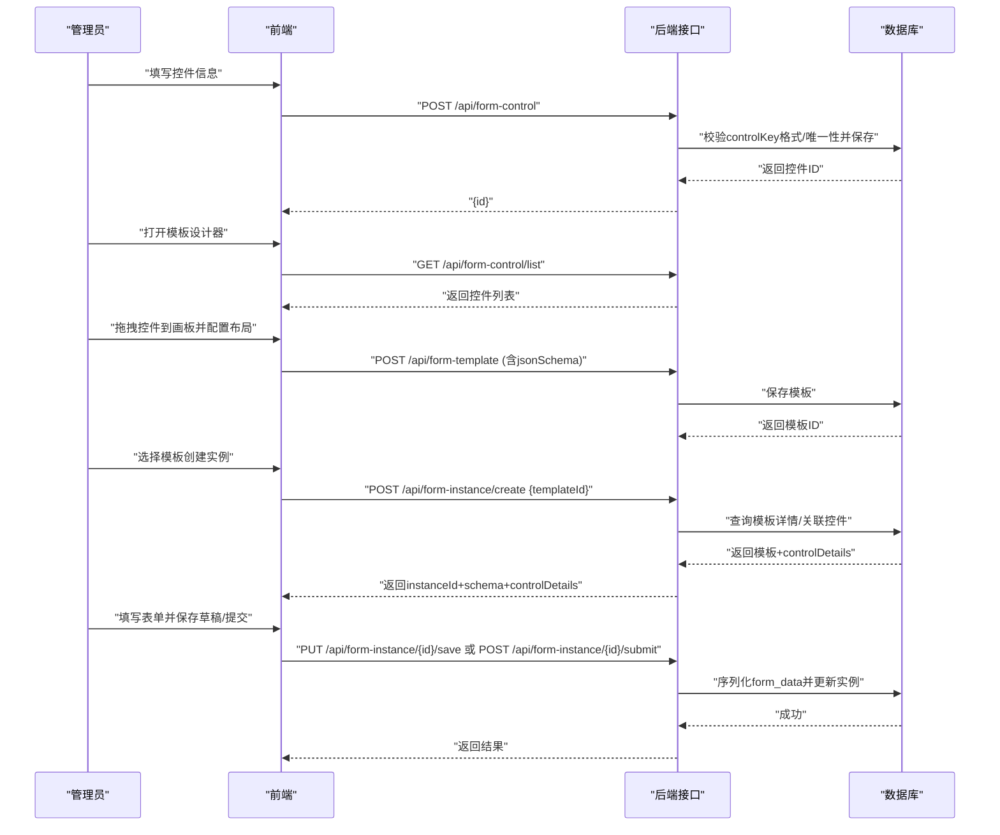
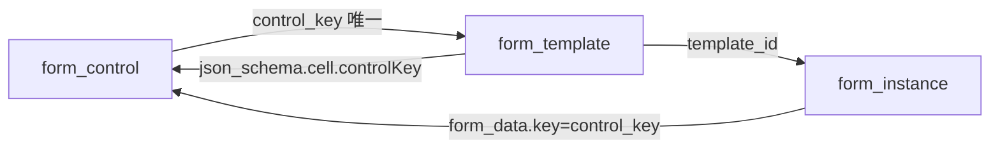

# 表间关系与约束设计

<cite>
**本文引用的文件**
- [VAT_EPR_动态表单技术方案.md](file://VAT_EPR_动态表单技术方案.md)
</cite>

## 目录
1. [简介](#简介)
2. [项目结构](#项目结构)
3. [核心组件](#核心组件)
4. [架构总览](#架构总览)
5. [详细组件分析](#详细组件分析)
6. [依赖分析](#依赖分析)
7. [性能考量](#性能考量)
8. [故障排查指南](#故障排查指南)
9. [结论](#结论)
10. [附录](#附录)

## 简介
本设计文档围绕“动态表单系统”的三张核心表：form_control（自定义控件）、form_template（服务单模板）、form_instance（服务单实例），系统阐述它们之间的关联关系、外键约束、数据完整性与一致性保障策略，并结合 JSON Schema 的多对多控件绑定机制与实例对模板的一对多关系进行深入解析。同时给出 ER 图、业务逻辑解释、级联与约束设计考虑，以及查询优化与性能调优建议。

## 项目结构
- 服务端采用 Spring Boot + MyBatis-Plus + MySQL 8.0+，数据库层通过 InnoDB 引擎承载三张核心表。
- 前端基于 Vue 3 + Element Plus，通过接口驱动动态表单渲染与数据提交。
- 数据模型以 JSON Schema 描述模板布局与控件引用，实例数据以 Map<controlKey, value> 的 JSON 形式持久化。

图表来源
- [VAT_EPR_动态表单技术方案.md:33-153](file://VAT_EPR_动态表单技术方案.md#L33-L153)

章节来源
- [VAT_EPR_动态表单技术方案.md:33-153](file://VAT_EPR_动态表单技术方案.md#L33-L153)

## 核心组件
- form_control：控件元数据表，包含控件名称、类型、校验规则、上传配置、默认值等，通过 control_key 唯一标识控件。
- form_template：模板表，包含模板名称、版本、国家/服务类别、JSON Schema（描述布局与控件引用）及状态。
- form_instance：实例表，关联模板，冗余存储模板关键信息，持久化表单数据（Map<controlKey, value>）。

章节来源
- [VAT_EPR_动态表单技术方案.md:33-153](file://VAT_EPR_动态表单技术方案.md#L33-L153)

## 架构总览
三表关系通过 JSON Schema 实现“模板-控件”的多对多绑定，实例与模板形成一对多关系。实例数据以 JSON 存储，通过 control_key 与控件建立间接关联。

图表来源
- [VAT_EPR_动态表单技术方案.md:33-153](file://VAT_EPR_动态表单技术方案.md#L33-L153)

## 详细组件分析

### 表结构与字段说明
- form_control
  - 主键 id，唯一索引 control_key，确保控件标识唯一。
  - 控件类型、校验规则、上传配置、默认值、排序、启用状态等。
- form_template
  - 主键 id，模板名称、版本、国家与服务类别组合唯一性（由业务维度决定），json_schema 存放布局与控件引用。
  - 状态字段用于草稿/发布区分。
- form_instance
  - 主键 id，外键 template_id 指向模板，冗余存储模板关键信息便于查询。
  - form_data 以 JSON 存储 Map<controlKey, value>，通过 control_key 与控件建立间接关联。

章节来源
- [VAT_EPR_动态表单技术方案.md:33-153](file://VAT_EPR_动态表单技术方案.md#L33-L153)

### 关系与约束设计
- 外键约束
  - form_instance.template_id → form_template.id（一对多）
  - 无直接外键约束连接 form_template 与 form_control，通过 JSON Schema 的 control_key 建立多对多关系
- 唯一性约束
  - form_control.control_key 唯一（数据库唯一索引）
- 状态与生命周期
  - 模板状态：草稿/发布；发布后禁止修改 json_schema，避免已存在实例数据错乱
  - 实例状态：草稿/已提交/已审核；提交后禁止再次修改

章节来源
- [VAT_EPR_动态表单技术方案.md:33-153](file://VAT_EPR_动态表单技术方案.md#L33-L153)
- [VAT_EPR_动态表单技术方案.md:856-869](file://VAT_EPR_动态表单技术方案.md#L856-L869)

### JSON Schema 与多对多绑定机制
- 模板的 json_schema 描述布局，其中每个 cell 包含 controlId、controlKey、controlType 等字段，用于将控件与模板绑定。
- 多对多关系通过 control_key 实现：同一 control_key 可出现在多个模板的 cells 中；同一模板可引用多个不同的 control_key。
- 实例与控件的间接关联：实例 form_data 的 key 与控件 control_key 保持一致，从而实现数据与控件规则的解耦。

章节来源
- [VAT_EPR_动态表单技术方案.md:89-128](file://VAT_EPR_动态表单技术方案.md#L89-L128)
- [VAT_EPR_动态表单技术方案.md:155-163](file://VAT_EPR_动态表单技术方案.md#L155-L163)

### 数据一致性与完整性保障
- 控件唯一性：control_key 唯一索引 + 后端格式校验（必须包含一个点号分隔的类名与字段名）
- 模板版本管理：发布后禁止修改 json_schema，变更需升版本号
- 实体类注册：FormDataConverter 中 CLASS_REGISTRY 需注册业务实体，避免转换失败
- 并发控制：实例保存需加乐观锁（version 字段）防止并发覆盖
- 数据安全：form_data 存储 JSON 时应过滤敏感字段；提交后状态变更为已提交，禁止再次修改

章节来源
- [VAT_EPR_动态表单技术方案.md:856-869](file://VAT_EPR_动态表单技术方案.md#L856-L869)

### 业务流程与时序
- 控件管理：管理员在前端填写控件信息，后端校验 controlKey 格式与唯一性后保存
- 模板设计：管理员在设计器中拖拽控件，生成 json_schema，保存模板
- 实例创建与填写：根据模板创建实例，动态渲染表单，保存草稿或提交
- 提交转换：解析 form_data，按 controlKey 分组并反射转换为业务实体对象

图表来源
- [VAT_EPR_动态表单技术方案.md:401-478](file://VAT_EPR_动态表单技术方案.md#L401-L478)

## 依赖分析
- 控件与模板：通过 JSON Schema 的 control_key 建立多对多关系，无需物理外键
- 实例与模板：通过外键 template_id 建立一对多关系
- 实例与控件：通过 form_data 的 control_key 与控件 control_key 建立间接关联
- 转换依赖：FormDataConverter 依赖 CLASS_REGISTRY 注册的业务实体类，按 controlKey 分组并反射赋值

图表来源
- [VAT_EPR_动态表单技术方案.md:33-153](file://VAT_EPR_动态表单技术方案.md#L33-L153)

章节来源
- [VAT_EPR_动态表单技术方案.md:594-728](file://VAT_EPR_动态表单技术方案.md#L594-L728)

## 性能考量
- 查询优化
  - 为 form_instance.template_id 建立索引，加速按模板查询实例
  - 控件查询可按 control_type、enabled 等条件建立复合索引
  - 模板查询可按 country_code、service_code_l1/l2/l3、status 建立复合索引
- 写入优化
  - 控件唯一性检查在入库前完成，减少重复冲突
  - 模板发布后禁止修改 json_schema，降低并发写入复杂度
- 存储优化
  - 使用 JSON 字段存储结构化数据，避免过度规范化带来的 JOIN 成本
  - 控制 JSON 字段大小，必要时拆分或压缩
- 缓存策略
  - 控件列表与模板详情可缓存热点数据，减少数据库压力
- 并发控制
  - 实例保存采用乐观锁（version 字段）避免并发覆盖
- 日志与监控
  - 对提交转换过程进行日志记录，便于定位性能瓶颈与异常

章节来源
- [VAT_EPR_动态表单技术方案.md:856-869](file://VAT_EPR_动态表单技术方案.md#L856-L869)

## 故障排查指南
- 控件唯一性冲突
  - 现象：插入控件时报唯一索引冲突
  - 排查：确认 control_key 是否包含类名与字段名，且未被占用
- 控件不存在或未启用
  - 现象：模板引用的 control_key 在控件表中缺失或 disabled
  - 排查：核对 json_schema 中的 controlKey 是否存在于 form_control，且 enabled=1
- 实例提交失败
  - 现象：提交时报对象转换错误
  - 排查：确认 FormDataConverter 中是否注册了对应业务实体类；检查 form_data 的 key 格式是否符合 “类名.字段名”
- 并发覆盖
  - 现象：保存草稿时出现数据被覆盖
  - 排查：确认使用乐观锁（version 字段）进行并发控制
- 数据安全与合规
  - 现象：form_data 中包含敏感字段
  - 排查：在入库前过滤敏感字段，或在查询时脱敏输出

章节来源
- [VAT_EPR_动态表单技术方案.md:856-869](file://VAT_EPR_动态表单技术方案.md#L856-L869)

## 结论
本设计通过 JSON Schema 将模板与控件解耦，实现灵活的多对多绑定；通过外键约束保证实例与模板的一对多关系；通过 control_key 建立实例与控件的间接关联。配合唯一性约束、状态管理、并发控制与转换器机制，整体实现了高灵活性与强一致性的平衡。建议在生产环境中进一步完善索引策略、缓存与监控体系，持续优化查询与写入性能。

## 附录
- 术语
  - control_key：控件标识，格式为“类名.字段名”，在数据库中唯一
  - json_schema：描述模板布局与控件引用的 JSON 结构
  - form_data：实例表单数据，以 Map<controlKey, value> 的 JSON 形式存储
- 参考路径
  - 控件表结构与字段：[VAT_EPR_动态表单技术方案.md:33-59](file://VAT_EPR_动态表单技术方案.md#L33-L59)
  - 模板表结构与字段：[VAT_EPR_动态表单技术方案.md:68-87](file://VAT_EPR_动态表单技术方案.md#L68-L87)
  - 实例表结构与字段：[VAT_EPR_动态表单技术方案.md:132-153](file://VAT_EPR_动态表单技术方案.md#L132-L153)
  - JSON Schema 示例与结构：[VAT_EPR_动态表单技术方案.md:89-128](file://VAT_EPR_动态表单技术方案.md#L89-L128)
  - 提交转换器与实体类：[VAT_EPR_动态表单技术方案.md:594-728](file://VAT_EPR_动态表单技术方案.md#L594-L728)
  - 关键约束与注意事项：[VAT_EPR_动态表单技术方案.md:856-869](file://VAT_EPR_动态表单技术方案.md#L856-L869)