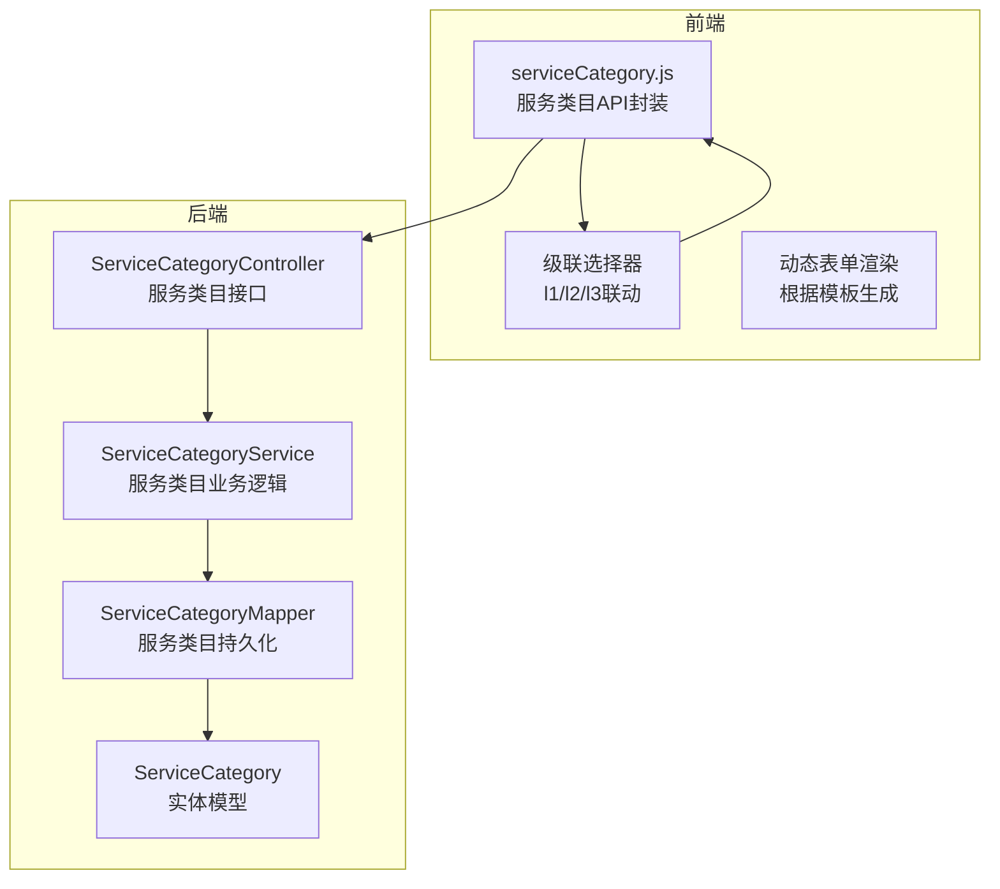
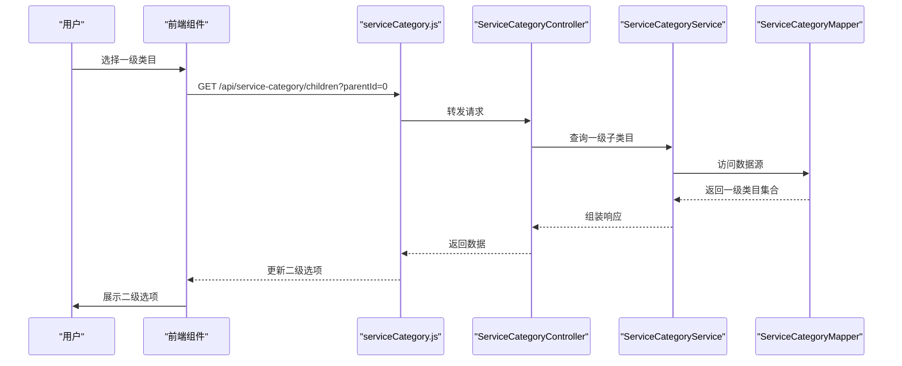

# 服务类目系统

<cite>
**本文引用的文件**
- [VAT_EPR_动态表单技术方案.md](file://VAT_EPR_动态表单技术方案.md)
</cite>

## 目录
1. [简介](#简介)
2. [项目结构](#项目结构)
3. [核心组件](#核心组件)
4. [架构总览](#架构总览)
5. [详细组件分析](#详细组件分析)
6. [依赖分析](#依赖分析)
7. [性能考虑](#性能考虑)
8. [故障排查指南](#故障排查指南)
9. [结论](#结论)
10. [附录](#附录)

## 简介
本文件面向VAT&EPR动态表单系统中的“服务类目系统”，聚焦于三级联动服务类目的设计原理与实现机制，涵盖国家代码管理、服务类型分类与层级关系维护，提供完整的类目树结构说明与API调用示例，并给出前端级联选择器的实现逻辑、数据加载策略与用户体验优化建议。同时，说明与现有业务系统的集成方式与数据同步机制，为系统集成者提供清晰的类目管理和配置指导。

## 项目结构
该仓库以“技术方案”文档为核心，明确了服务类目API的存在与调用方式，以及后端控制器、服务层、Mapper层、实体与DTO等典型分层结构。前端方面，提供了服务类目API的调用入口与动态表单渲染能力。

图表来源
- [VAT_EPR_动态表单技术方案.md: 786](file://VAT_EPR_动态表单技术方案.md#L786)
- [VAT_EPR_动态表单技术方案.md: 790](file://VAT_EPR_动态表单技术方案.md#L790)
- [VAT_EPR_动态表单技术方案.md: 794](file://VAT_EPR_动态表单技术方案.md#L794)
- [VAT_EPR_动态表单技术方案.md: 799](file://VAT_EPR_动态表单技术方案.md#L799)

章节来源
- [VAT_EPR_动态表单技术方案.md: 786](file://VAT_EPR_动态表单技术方案.md#L786)
- [VAT_EPR_动态表单技术方案.md: 790](file://VAT_EPR_动态表单技术方案.md#L790)
- [VAT_EPR_动态表单技术方案.md: 794](file://VAT_EPR_动态表单技术方案.md#L794)
- [VAT_EPR_动态表单技术方案.md: 799](file://VAT_EPR_动态表单技术方案.md#L799)
- [VAT_EPR_动态表单技术方案.md: 815](file://VAT_EPR_动态表单技术方案.md#L815)
- [VAT_EPR_动态表单技术方案.md: 817](file://VAT_EPR_动态表单技术方案.md#L817)

## 核心组件
- 服务类目API：提供按父节点查询子节点的能力，支持国家、服务类型的一级、二级、三级联动。
- 前端调用封装：在前端模块中封装服务类目API，供级联选择器使用。
- 级联选择器：根据用户选择的上一级类目，异步加载下一级选项，清空下游选项并更新UI。
- 数据加载策略：采用懒加载与缓存结合的方式，减少首次渲染压力，提升交互流畅度。
- 用户体验优化：提供加载状态、错误提示、默认项与空状态处理，确保多国家、多服务类型的场景下稳定可用。

章节来源
- [VAT_EPR_动态表单技术方案.md: 389](file://VAT_EPR_动态表单技术方案.md#L389)
- [VAT_EPR_动态表单技术方案.md: 391](file://VAT_EPR_动态表单技术方案.md#L391)
- [VAT_EPR_动态表单技术方案.md: 756](file://VAT_EPR_动态表单技术方案.md#L756)
- [VAT_EPR_动态表单技术方案.md: 758](file://VAT_EPR_动态表单技术方案.md#L758)

## 架构总览
服务类目系统遵循“前端调用—后端接口—业务服务—数据访问”的标准分层架构。前端通过serviceCategory.js发起请求，后端控制器接收请求并委派给服务层，服务层进行业务处理与数据组装，最终由Mapper访问数据库或外部系统获取类目树数据。

图表来源
- [VAT_EPR_动态表单技术方案.md: 391](file://VAT_EPR_动态表单技术方案.md#L391)
- [VAT_EPR_动态表单技术方案.md: 786](file://VAT_EPR_动态表单技术方案.md#L786)
- [VAT_EPR_动态表单技术方案.md: 790](file://VAT_EPR_动态表单技术方案.md#L790)
- [VAT_EPR_动态表单技术方案.md: 794](file://VAT_EPR_动态表单技术方案.md#L794)

## 详细组件分析

### 服务类目API与调用示例
- 接口路径：/api/service-category/children
- 参数：parentId（父节点ID）
- 返回：子节点列表（包含code、name、level等字段）
- 使用场景：
  - 一级：parentId=0，返回国家代码与服务类型（VAT/EPR）两类根节点
  - 二级：根据一级选择的根节点ID，返回对应国家下的服务类型（如VAT下的具体法规）
  - 三级：根据二级选择的服务类型，返回具体的“服务事项”（如“新注册申报”）

前端调用逻辑要点：
- 一级变更：清空二级与三级选项，请求二级数据
- 二级变更：清空三级选项，请求三级数据
- 加载状态：在请求期间显示加载指示，避免重复请求
- 错误处理：捕获网络异常与空数据，提示用户并允许重试

章节来源
- [VAT_EPR_动态表单技术方案.md: 389](file://VAT_EPR_动态表单技术方案.md#L389)
- [VAT_EPR_动态表单技术方案.md: 391](file://VAT_EPR_动态表单技术方案.md#L391)
- [VAT_EPR_动态表单技术方案.md: 756](file://VAT_EPR_动态表单技术方案.md#L756)
- [VAT_EPR_动态表单技术方案.md: 758](file://VAT_EPR_动态表单技术方案.md#L758)

### 国家代码管理
- 国家代码采用三位字母代码（如DEU、FRA、ITA、ESP、POL、CZE、GBR），用于区分不同国家的税务与环保法规。
- 在服务类目树中，国家作为一级或二级节点出现，确保同一模板在不同国家下可正确匹配对应的法规与表单。
- 建议在系统初始化阶段维护国家代码字典，前端级联选择器默认展示国家列表，便于用户快速定位。

章节来源
- [VAT_EPR_动态表单技术方案.md: 734](file://VAT_EPR_动态表单技术方案.md#L734)
- [VAT_EPR_动态表单技术方案.md: 736](file://VAT_EPR_动态表单技术方案.md#L736)
- [VAT_EPR_动态表单技术方案.md: 738](file://VAT_EPR_动态表单技术方案.md#L738)

### 服务类型分类与层级关系
- 一级：VAT服务（01）/ EPR服务（02）
- 二级：VAT服务（0101）/ 包装法（0201）/ WEEE法（0202）/ ...
- 三级：VAT新注册申报（010101）/ VAT转代理申报（010102）/ ...

层级关系维护要点：
- 严格遵循“父节点ID”与“子节点code”的映射，确保父子关系唯一且可追溯。
- 在模板绑定时，使用三级code（serviceCodeL3）精确匹配对应的服务事项，避免跨国家或跨法规的误配。
- 建议在后端对非法层级组合进行校验，防止脏数据进入数据库。

章节来源
- [VAT_EPR_动态表单技术方案.md: 746](file://VAT_EPR_动态表单技术方案.md#L746)
- [VAT_EPR_动态表单技术方案.md: 748](file://VAT_EPR_动态表单技术方案.md#L748)
- [VAT_EPR_动态表单技术方案.md: 749](file://VAT_EPR_动态表单技术方案.md#L749)
- [VAT_EPR_动态表单技术方案.md: 750](file://VAT_EPR_动态表单技术方案.md#L750)
- [VAT_EPR_动态表单技术方案.md: 751](file://VAT_EPR_动态表单技术方案.md#L751)
- [VAT_EPR_动态表单技术方案.md: 752](file://VAT_EPR_动态表单技术方案.md#L752)
- [VAT_EPR_动态表单技术方案.md: 753](file://VAT_EPR_动态表单技术方案.md#L753)
- [VAT_EPR_动态表单技术方案.md: 754](file://VAT_EPR_动态表单技术方案.md#L754)

### 前端级联选择器实现逻辑
- 数据流：
  - 一级：请求parentId=0，得到国家与服务类型根节点
  - 二级：根据一级选中项的ID，请求parentId=一级ID，得到对应国家下的服务类型
  - 三级：根据二级选中项的ID，请求parentId=二级ID，得到具体服务事项
- UI行为：
  - 选中一级后清空二级与三级选项
  - 选中二级后清空三级选项
  - 支持默认值回显与禁用不可选项
- 性能优化：
  - 首次进入页面时仅加载一级
  - 二级与三级采用懒加载，减少初始渲染负担
  - 缓存已加载的节点数据，避免重复请求
- 错误处理：
  - 请求失败时提示用户并允许重试
  - 空数据时展示“无可用选项”提示

章节来源
- [VAT_EPR_动态表单技术方案.md: 756](file://VAT_EPR_动态表单技术方案.md#L756)
- [VAT_EPR_动态表单技术方案.md: 758](file://VAT_EPR_动态表单技术方案.md#L758)

### 数据加载策略与用户体验优化
- 懒加载：仅在用户展开某一级时才请求下一级数据，降低首屏压力
- 缓存：对已请求过的节点进行本地缓存，提高二次切换效率
- 占位与加载态：在请求期间显示骨架屏或加载动画，避免空白等待
- 默认值与回退：当默认值不在当前可选项中时，提示并引导用户重新选择
- 错误提示：统一错误文案与重试按钮，提升可恢复性

章节来源
- [VAT_EPR_动态表单技术方案.md: 756](file://VAT_EPR_动态表单技术方案.md#L756)
- [VAT_EPR_动态表单技术方案.md: 758](file://VAT_EPR_动态表单技术方案.md#L758)

### 与现有业务系统的集成与数据同步
- 透传既存系统：服务类目API为透传接口，直接对接既有业务系统，无需额外适配
- 数据一致性：建议在业务系统侧维护稳定的类目树结构与code规范，前端通过parentId精准查询
- 版本与兼容：若业务系统升级类目结构，需在前端与后端同步更新，避免旧数据导致的级联异常
- 异常监控：对API调用失败、空数据、重复请求等情况进行埋点与告警，保障用户体验

章节来源
- [VAT_EPR_动态表单技术方案.md: 389](file://VAT_EPR_动态表单技术方案.md#L389)
- [VAT_EPR_动态表单技术方案.md: 391](file://VAT_EPR_动态表单技术方案.md#L391)

## 依赖分析
服务类目系统在后端采用典型的MVC分层，控制器负责请求接入，服务层承担业务逻辑，Mapper负责数据访问。前端通过serviceCategory.js封装API，供级联选择器使用。

图表来源
- [VAT_EPR_动态表单技术方案.md: 786](file://VAT_EPR_动态表单技术方案.md#L786)
- [VAT_EPR_动态表单技术方案.md: 790](file://VAT_EPR_动态表单技术方案.md#L790)
- [VAT_EPR_动态表单技术方案.md: 794](file://VAT_EPR_动态表单技术方案.md#L794)

章节来源
- [VAT_EPR_动态表单技术方案.md: 786](file://VAT_EPR_动态表单技术方案.md#L786)
- [VAT_EPR_动态表单技术方案.md: 790](file://VAT_EPR_动态表单技术方案.md#L790)
- [VAT_EPR_动态表单技术方案.md: 794](file://VAT_EPR_动态表单技术方案.md#L794)

## 性能考虑
- 减少请求次数：前端对已加载节点进行缓存，避免重复请求
- 懒加载策略：仅在用户展开时加载下一级数据，降低首屏压力
- 并发控制：在用户快速切换时，取消前一次未完成的请求，避免资源浪费
- 前端渲染优化：使用虚拟滚动或分页展示大量选项，提升交互流畅度

## 故障排查指南
- 级联异常：检查parentId参数是否正确传递，确认业务系统返回的父子关系是否一致
- 空数据：确认业务系统是否存在对应节点，或是否存在权限限制导致返回空集
- 重复请求：在前端增加防抖与请求去重逻辑，避免频繁触发相同请求
- 错误提示：统一错误文案，提供重试按钮与日志上报，便于问题定位

## 结论
服务类目系统通过“国家+服务类型”的三级联动，实现了VAT与EPR场景下的精准匹配与灵活扩展。前端采用懒加载与缓存策略，结合清晰的UI反馈，显著提升了用户体验。后端以透传方式对接既有业务系统，降低了集成成本。建议在上线前完善类目树初始化与校验机制，并持续优化前端交互细节，确保系统在多国家、多法规场景下的稳定性与可维护性。

## 附录
- 国家代码对照表（示例）
  - DEU：德国
  - FRA：法国
  - ITA：意大利
  - ESP：西班牙
  - POL：波兰
  - CZE：捷克
  - GBR：英国

章节来源
- [VAT_EPR_动态表单技术方案.md: 734](file://VAT_EPR_动态表单技术方案.md#L734)
- [VAT_EPR_动态表单技术方案.md: 736](file://VAT_EPR_动态表单技术方案.md#L736)
- [VAT_EPR_动态表单技术方案.md: 738](file://VAT_EPR_动态表单技术方案.md#L738)