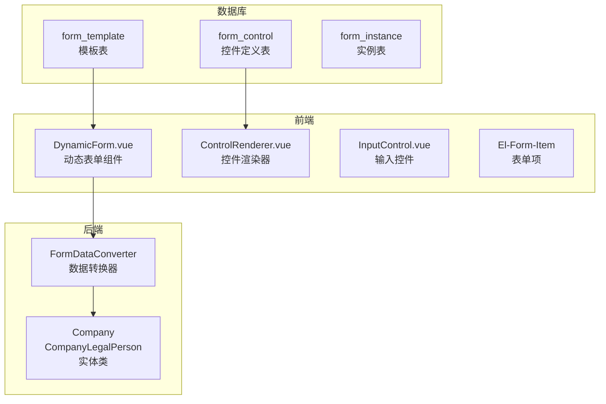
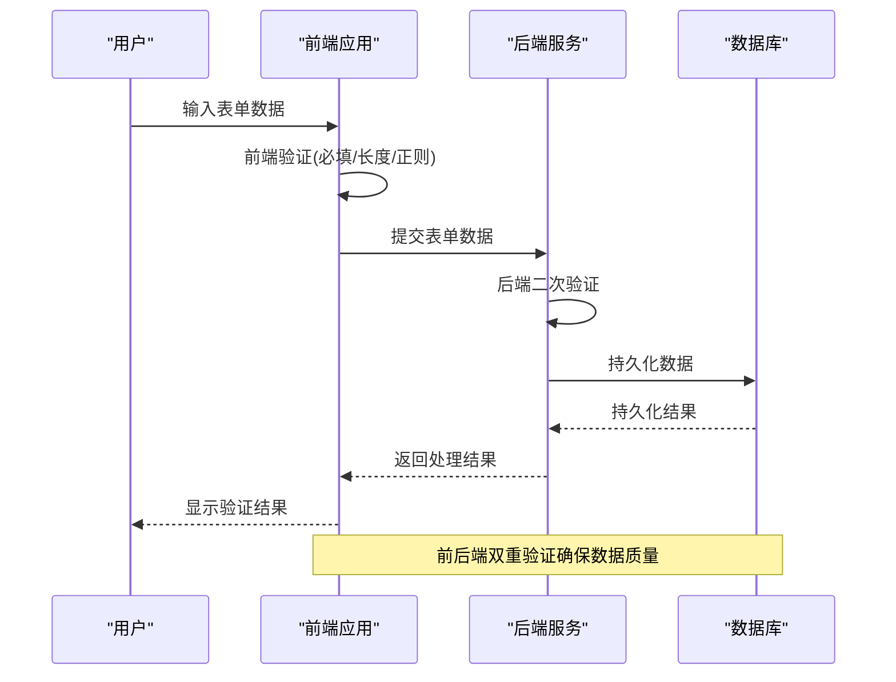
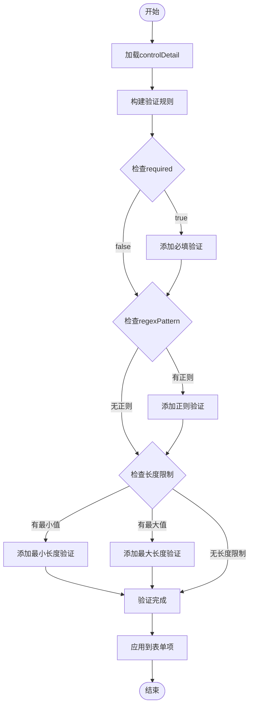
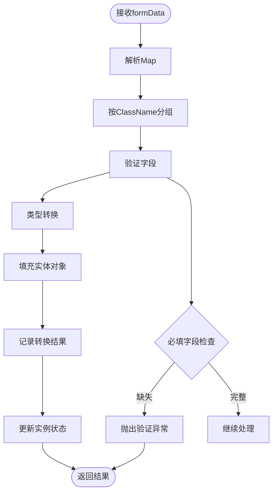
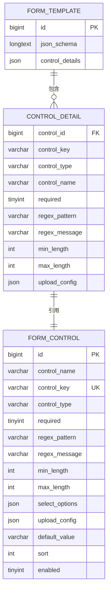
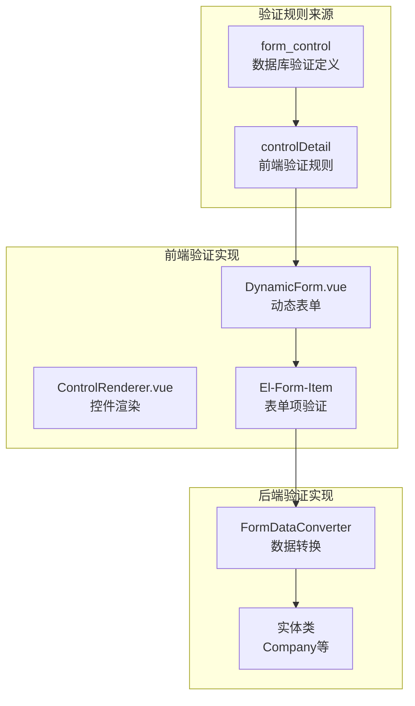

# 业务验证规则

<cite>
**本文档引用的文件**
- [VAT_EPR_动态表单技术方案.md](file://VAT_EPR_动态表单技术方案.md)
</cite>

## 目录
1. [简介](#简介)
2. [项目结构](#项目结构)
3. [核心组件](#核心组件)
4. [架构总览](#架构总览)
5. [详细组件分析](#详细组件分析)
6. [依赖关系分析](#依赖关系分析)
7. [性能考虑](#性能考虑)
8. [故障排除指南](#故障排除指南)
9. [结论](#结论)
10. [附录](#附录)

## 简介
本文件面向VAT&EPR动态表单系统的业务验证规则，系统采用前后端双重验证机制，通过数据库表单控件定义表中的控制字段动态生成验证规则。验证规则来源于controlDetail中的regexPattern、required、minLength、maxLength等字段，结合Element Plus表单验证组件实现统一的验证体验。

## 项目结构
系统采用前后端分离架构，核心验证逻辑围绕以下关键文件展开：
- 数据库表单控件定义表：定义控件的验证属性
- 前端动态表单渲染：基于controlDetail动态构建验证规则
- 后端表单数据转换：解析并转换表单数据为实体对象

**图表来源**
- [VAT_EPR_动态表单技术方案.md:33-58](file://VAT_EPR_动态表单技术方案.md#L33-L58)
- [VAT_EPR_动态表单技术方案.md:531-548](file://VAT_EPR_动态表单技术方案.md#L531-L548)
- [VAT_EPR_动态表单技术方案.md:592-684](file://VAT_EPR_动态表单技术方案.md#L592-L684)

**章节来源**
- [VAT_EPR_动态表单技术方案.md:33-58](file://VAT_EPR_动态表单技术方案.md#L33-L58)
- [VAT_EPR_动态表单技术方案.md:531-548](file://VAT_EPR_动态表单技术方案.md#L531-L548)
- [VAT_EPR_动态表单技术方案.md:592-684](file://VAT_EPR_动态表单技术方案.md#L592-L684)

## 核心组件
验证规则的核心来源于数据库表单控件定义表，该表包含以下关键验证字段：

### 验证字段定义
- **required**：布尔值，标识字段是否必填
- **regexPattern**：正则表达式字符串，用于复杂格式验证
- **regexMessage**：正则验证失败时的提示信息
- **minLength**：最小长度限制
- **maxLength**：最大长度限制

### 验证规则生成机制
前端根据controlDetail中的验证字段动态生成Element Plus表单验证规则，后端在提交时进行二次验证确保数据完整性。

**章节来源**
- [VAT_EPR_动态表单技术方案.md:33-58](file://VAT_EPR_动态表单技术方案.md#L33-L58)
- [VAT_EPR_动态表单技术方案.md:545](file://VAT_EPR_动态表单技术方案.md#L545)

## 架构总览
系统采用前后端双重验证架构，确保数据质量和用户体验。

**图表来源**
- [VAT_EPR_动态表单技术方案.md:531-548](file://VAT_EPR_动态表单技术方案.md#L531-L548)
- [VAT_EPR_动态表单技术方案.md:705-728](file://VAT_EPR_动态表单技术方案.md#L705-L728)

## 详细组件分析

### 前端验证组件分析
前端通过DynamicForm.vue和ControlRenderer.vue组件实现动态验证规则生成。

#### 验证规则生成流程

**图表来源**
- [VAT_EPR_动态表单技术方案.md:531-548](file://VAT_EPR_动态表单技术方案.md#L531-L548)

#### Element Plus验证集成
前端使用Element Plus的表单验证组件，通过动态生成的rules数组实现统一的验证体验。

**章节来源**
- [VAT_EPR_动态表单技术方案.md:531-548](file://VAT_EPR_动态表单技术方案.md#L531-L548)

### 后端验证组件分析
后端通过FormDataConverter组件实现数据转换和验证。

#### 数据转换与验证流程

**图表来源**
- [VAT_EPR_动态表单技术方案.md:592-684](file://VAT_EPR_动态表单技术方案.md#L592-L684)
- [VAT_EPR_动态表单技术方案.md:705-728](file://VAT_EPR_动态表单技术方案.md#L705-L728)

**章节来源**
- [VAT_EPR_动态表单技术方案.md:592-684](file://VAT_EPR_动态表单技术方案.md#L592-L684)
- [VAT_EPR_动态表单技术方案.md:705-728](file://VAT_EPR_动态表单技术方案.md#L705-L728)

### 数据库验证规则分析
数据库表单控件定义表提供了验证规则的持久化存储。

#### 验证字段关系图

**图表来源**
- [VAT_EPR_动态表单技术方案.md:33-58](file://VAT_EPR_动态表单技术方案.md#L33-L58)
- [VAT_EPR_动态表单技术方案.md:278-292](file://VAT_EPR_动态表单技术方案.md#L278-L292)

**章节来源**
- [VAT_EPR_动态表单技术方案.md:33-58](file://VAT_EPR_动态表单技术方案.md#L33-L58)
- [VAT_EPR_动态表单技术方案.md:278-292](file://VAT_EPR_动态表单技术方案.md#L278-L292)

## 依赖关系分析
验证规则在系统中的依赖关系体现了前后端协作的完整性。

**图表来源**
- [VAT_EPR_动态表单技术方案.md:531-548](file://VAT_EPR_动态表单技术方案.md#L531-L548)
- [VAT_EPR_动态表单技术方案.md:592-684](file://VAT_EPR_动态表单技术方案.md#L592-L684)

**章节来源**
- [VAT_EPR_动态表单技术方案.md:531-548](file://VAT_EPR_动态表单技术方案.md#L531-L548)
- [VAT_EPR_动态表单技术方案.md:592-684](file://VAT_EPR_动态表单技术方案.md#L592-L684)

## 性能考虑
系统在验证性能方面采用了多项优化措施：

### 前端性能优化
- **延迟验证**：仅在用户离开字段或提交时触发验证
- **缓存规则**：动态生成的验证规则进行缓存复用
- **异步验证**：复杂验证逻辑采用异步执行避免阻塞UI

### 后端性能优化
- **批量验证**：在数据转换阶段统一处理验证逻辑
- **类型转换优化**：针对常见类型进行快速转换
- **日志级别控制**：生产环境降低验证日志级别

## 故障排除指南
针对验证规则可能出现的问题提供解决方案：

### 常见问题及解决
1. **验证规则不生效**
   - 检查controlDetail中的验证字段是否正确配置
   - 确认Element Plus表单验证规则绑定正确
   - 验证regexPattern格式是否符合JavaScript正则语法

2. **前后端验证不一致**
   - 检查数据库中regexPattern与前端正则表达式的一致性
   - 确认后端类型转换逻辑对特殊字符的处理
   - 验证国际化消息的正确传递

3. **性能问题**
   - 优化复杂正则表达式的性能
   - 减少不必要的验证规则数量
   - 实施验证结果的缓存机制

**章节来源**
- [VAT_EPR_动态表单技术方案.md:856-869](file://VAT_EPR_动态表单技术方案.md#L856-L869)

## 结论
VAT&EPR动态表单系统的业务验证规则通过前后端双重验证机制实现了高可靠性的数据质量保障。系统利用数据库驱动的验证规则配置，结合Element Plus的表单验证组件，为用户提供一致的验证体验。通过合理的架构设计和性能优化，系统能够在保证数据质量的同时提供良好的用户体验。

## 附录

### 验证规则配置示例
系统支持多种验证规则的组合配置，包括必填验证、正则表达式验证、长度限制验证等。

### 自定义验证规则扩展
系统提供了灵活的扩展点，允许开发者根据业务需求添加自定义验证规则。

### 国际化验证消息支持
系统支持多语言验证消息，通过配置不同的regexMessage实现国际化验证提示。