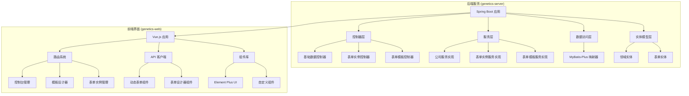
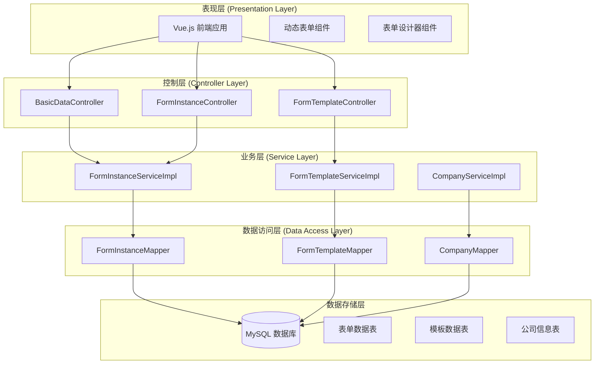
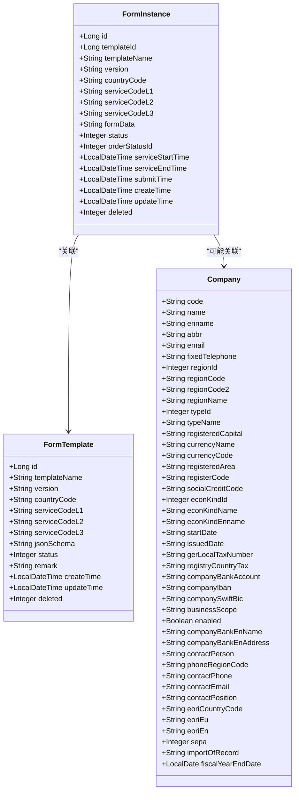
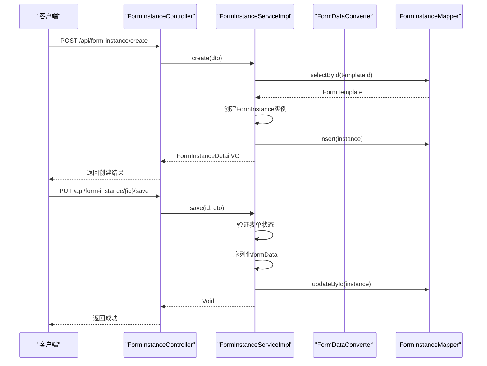
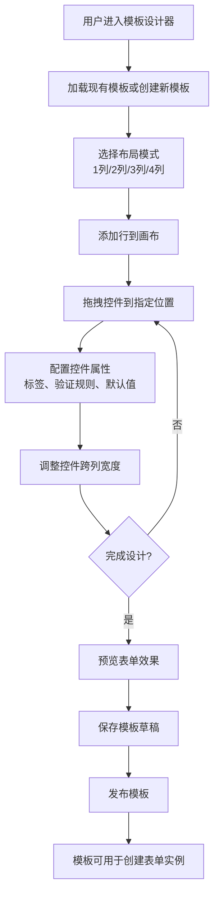
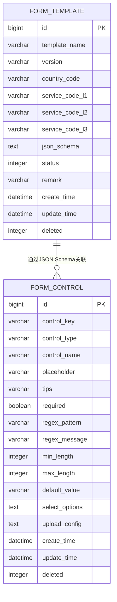
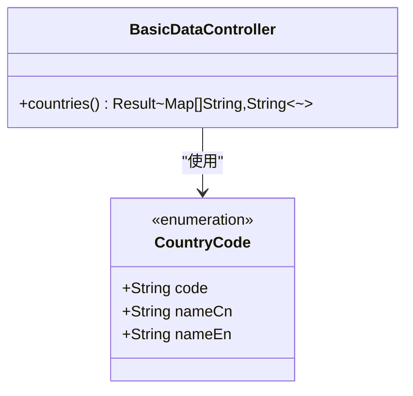
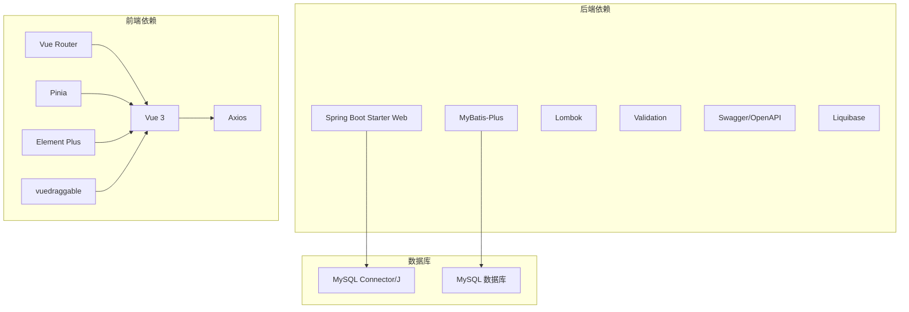

# 公司管理系统

<cite>
**本文档引用的文件**
- [GeneticsApplication.java](file://genetics-server/src/main/java/com/genetics/GeneticsApplication.java)
- [pom.xml](file://genetics-server/pom.xml)
- [application.yml](file://genetics-server/src/main/resources/application.yml)
- [BasicDataController.java](file://genetics-server/src/main/java/com/genetics/controller/BasicDataController.java)
- [FormInstanceController.java](file://genetics-server/src/main/java/com/genetics/controller/FormInstanceController.java)
- [FormTemplateController.java](file://genetics-server/src/main/java/com/genetics/controller/FormTemplateController.java)
- [Company.java](file://genetics-server/src/main/java/com/genetics/entity/domain/Company.java)
- [FormInstance.java](file://genetics-server/src/main/java/com/genetics/entity/FormInstance.java)
- [FormTemplate.java](file://genetics-server/src/main/java/com/genetics/entity/FormTemplate.java)
- [CompanyServiceImpl.java](file://genetics-server/src/main/java/com/genetics/service/impl/CompanyServiceImpl.java)
- [FormInstanceServiceImpl.java](file://genetics-server/src/main/java/com/genetics/service/impl/FormInstanceServiceImpl.java)
- [FormTemplateServiceImpl.java](file://genetics-server/src/main/java/com/genetics/service/impl/FormTemplateServiceImpl.java)
- [package.json](file://genetics-web/package.json)
- [main.js](file://genetics-web/src/main.js)
- [router/index.js](file://genetics-web/src/router/index.js)
- [request.js](file://genetics-web/src/api/request.js)
- [DynamicForm.vue](file://genetics-web/src/components/DynamicForm/DynamicForm.vue)
- [Canvas.vue](file://genetics-web/src/components/FormDesigner/Canvas.vue)
</cite>

## 目录
1. [简介](#简介)
2. [项目结构](#项目结构)
3. [核心组件](#核心组件)
4. [架构概览](#架构概览)
5. [详细组件分析](#详细组件分析)
6. [依赖关系分析](#依赖关系分析)
7. [性能考虑](#性能考虑)
8. [故障排除指南](#故障排除指南)
9. [结论](#结论)

## 简介

公司管理系统是一个基于Spring Boot和Vue.js开发的企业级应用，专注于动态表单系统的设计与实现。该系统主要服务于VAT（增值税）和EPR（扩展生产者责任延伸）业务场景，提供灵活的表单模板设计、动态表单渲染、以及完整的表单生命周期管理。

系统采用前后端分离架构，后端使用Java Spring Boot框架，前端使用Vue.js技术栈，通过RESTful API进行数据交互。核心功能包括：

- **动态表单模板管理**：支持可视化表单设计器，可拖拽式创建表单布局
- **表单实例管理**：提供表单的创建、编辑、提交、审核等完整流程
- **多国家/地区支持**：内置多国家基础数据，支持不同地区的业务需求
- **灵活的数据模型**：通过JSON Schema定义表单结构，支持复杂的业务场景

## 项目结构

整个项目采用标准的Maven多模块架构，包含后端服务和前端界面两个主要部分：

**图表来源**
- [GeneticsApplication.java:1-14](file://genetics-server/src/main/java/com/genetics/GeneticsApplication.java#L1-L14)
- [pom.xml:1-100](file://genetics-server/pom.xml#L1-L100)

**章节来源**
- [GeneticsApplication.java:1-14](file://genetics-server/src/main/java/com/genetics/GeneticsApplication.java#L1-L14)
- [pom.xml:1-100](file://genetics-server/pom.xml#L1-L100)
- [application.yml:1-44](file://genetics-server/src/main/resources/application.yml#L1-L44)

## 核心组件

### 后端核心组件

系统后端采用分层架构设计，主要包括以下核心组件：

#### 应用启动类
- **GeneticsApplication**：Spring Boot应用入口点，配置MyBatis-Plus扫描路径

#### 控制器层
- **BasicDataController**：提供基础数据接口，支持国家列表查询
- **FormInstanceController**：管理表单实例的完整生命周期
- **FormTemplateController**：处理表单模板的创建、更新、发布等操作

#### 服务层实现
- **FormInstanceServiceImpl**：表单实例业务逻辑处理
- **FormTemplateServiceImpl**：表单模板业务逻辑处理
- **CompanyServiceImpl**：公司信息数据访问层

#### 数据模型
- **FormInstance**：表单实例实体，包含表单数据和状态信息
- **FormTemplate**：表单模板实体，存储JSON Schema定义
- **Company**：公司信息实体，支持多国家/地区数据

**章节来源**
- [GeneticsApplication.java:1-14](file://genetics-server/src/main/java/com/genetics/GeneticsApplication.java#L1-L14)
- [BasicDataController.java:1-38](file://genetics-server/src/main/java/com/genetics/controller/BasicDataController.java#L1-L38)
- [FormInstanceController.java:1-101](file://genetics-server/src/main/java/com/genetics/controller/FormInstanceController.java#L1-L101)
- [FormTemplateController.java:1-63](file://genetics-server/src/main/java/com/genetics/controller/FormTemplateController.java#L1-L63)
- [FormInstance.java:1-72](file://genetics-server/src/main/java/com/genetics/entity/FormInstance.java#L1-L72)
- [FormTemplate.java:1-57](file://genetics-server/src/main/java/com/genetics/entity/FormTemplate.java#L1-L57)
- [Company.java:1-231](file://genetics-server/src/main/java/com/genetics/entity/domain/Company.java#L1-L231)

### 前端核心组件

#### Vue.js 应用架构
- **main.js**：应用入口文件，配置Pinia状态管理和Element Plus UI库
- **路由系统**：基于Vue Router的单页应用路由配置
- **API 客户端**：封装Axios的HTTP请求客户端

#### 动态表单组件
- **DynamicForm**：可动态渲染的表单组件，支持复杂布局和验证规则
- **Canvas**：表单设计器画布，提供拖拽式表单布局设计

#### 状态管理
- **formDesigner**：表单设计器的状态管理，维护画布布局和控件配置

**章节来源**
- [main.js:1-23](file://genetics-web/src/main.js#L1-L23)
- [router/index.js:1-46](file://genetics-web/src/router/index.js#L1-L46)
- [request.js:1-25](file://genetics-web/src/api/request.js#L1-L25)
- [DynamicForm.vue:1-137](file://genetics-web/src/components/DynamicForm/DynamicForm.vue#L1-L137)
- [Canvas.vue:1-217](file://genetics-web/src/components/FormDesigner/Canvas.vue#L1-L217)

## 架构概览

系统采用经典的三层架构模式，结合现代化的微服务设计理念：

**图表来源**
- [FormInstanceController.java:1-101](file://genetics-server/src/main/java/com/genetics/controller/FormInstanceController.java#L1-L101)
- [FormTemplateController.java:1-63](file://genetics-server/src/main/java/com/genetics/controller/FormTemplateController.java#L1-L63)
- [FormInstanceServiceImpl.java:1-198](file://genetics-server/src/main/java/com/genetics/service/impl/FormInstanceServiceImpl.java#L1-L198)
- [FormTemplateServiceImpl.java:1-197](file://genetics-server/src/main/java/com/genetics/service/impl/FormTemplateServiceImpl.java#L1-L197)

系统架构特点：

1. **清晰的分层设计**：表现层、控制层、业务层、数据访问层职责明确
2. **松耦合高内聚**：各层之间通过接口通信，降低耦合度
3. **可扩展性**：支持新的表单类型和业务场景
4. **数据持久化**：采用关系型数据库存储结构化数据

## 详细组件分析

### 表单实例管理系统

表单实例是系统的核心业务对象，负责管理用户填写的表单数据和业务状态。

#### 表单实例实体设计

**图表来源**
- [FormInstance.java:1-72](file://genetics-server/src/main/java/com/genetics/entity/FormInstance.java#L1-L72)
- [FormTemplate.java:1-57](file://genetics-server/src/main/java/com/genetics/entity/FormTemplate.java#L1-L57)
- [Company.java:1-231](file://genetics-server/src/main/java/com/genetics/entity/domain/Company.java#L1-L231)

#### 表单实例业务流程

**图表来源**
- [FormInstanceController.java:33-45](file://genetics-server/src/main/java/com/genetics/controller/FormInstanceController.java#L33-L45)
- [FormInstanceServiceImpl.java:40-62](file://genetics-server/src/main/java/com/genetics/service/impl/FormInstanceServiceImpl.java#L40-L62)

**章节来源**
- [FormInstanceController.java:1-101](file://genetics-server/src/main/java/com/genetics/controller/FormInstanceController.java#L1-L101)
- [FormInstanceServiceImpl.java:1-198](file://genetics-server/src/main/java/com/genetics/service/impl/FormInstanceServiceImpl.java#L1-L198)

### 表单模板管理系统

表单模板系统提供了强大的可视化设计能力，支持复杂的表单布局和控件配置。

#### 模板设计器工作流

**图表来源**
- [Canvas.vue:131-140](file://genetics-web/src/components/FormDesigner/Canvas.vue#L131-L140)

#### 模板数据结构

模板系统采用JSON Schema定义表单结构，支持复杂的嵌套布局：

**图表来源**
- [FormTemplate.java:1-57](file://genetics-server/src/main/java/com/genetics/entity/FormTemplate.java#L1-L57)

**章节来源**
- [FormTemplateController.java:1-63](file://genetics-server/src/main/java/com/genetics/controller/FormTemplateController.java#L1-L63)
- [FormTemplateServiceImpl.java:1-197](file://genetics-server/src/main/java/com/genetics/service/impl/FormTemplateServiceImpl.java#L1-L197)

### 基础数据管理系统

系统内置了丰富的基础数据支持，特别是多国家/地区的数据配置。

#### 国家数据管理

**图表来源**
- [BasicDataController.java:28-36](file://genetics-server/src/main/java/com/genetics/controller/BasicDataController.java#L28-L36)

**章节来源**
- [BasicDataController.java:1-38](file://genetics-server/src/main/java/com/genetics/controller/BasicDataController.java#L1-L38)

## 依赖关系分析

系统采用现代化的技术栈，各组件之间的依赖关系清晰明确：

**图表来源**
- [pom.xml:27-81](file://genetics-server/pom.xml#L27-L81)
- [package.json:10-22](file://genetics-web/package.json#L10-L22)

### 技术栈特性

#### 后端技术特性
- **Spring Boot 3.2.3**：提供自动配置和开箱即用的功能
- **MyBatis-Plus 3.5.5**：简化数据库操作，提供通用CRUD能力
- **Lombok**：减少样板代码，提高开发效率
- **Swagger 2.4.0**：自动生成API文档
- **Liquibase**：数据库版本管理

#### 前端技术特性
- **Vue 3.4.0**：现代JavaScript框架，提供响应式数据绑定
- **Element Plus 2.6.0**：基于Vue 3的桌面端组件库
- **Pinia 2.1.7**：Vue官方状态管理库
- **Vue Router 4.3.0**：官方路由管理库
- **Axios 1.6.7**：HTTP客户端库

**章节来源**
- [pom.xml:21-25](file://genetics-server/pom.xml#L21-L25)
- [package.json:1-24](file://genetics-web/package.json#L1-L24)

## 性能考虑

系统在设计时充分考虑了性能优化和可扩展性：

### 数据库性能优化
- **逻辑删除**：通过deleted字段实现软删除，避免物理删除影响查询性能
- **索引策略**：对常用查询字段建立适当索引
- **分页查询**：支持大数据量的分页查询，避免全表扫描

### 缓存策略
- **前端缓存**：利用浏览器缓存静态资源
- **后端缓存**：可集成Redis缓存热点数据
- **数据库连接池**：合理配置连接池参数

### API性能优化
- **异步处理**：对于耗时操作采用异步处理
- **批量操作**：支持批量数据处理
- **数据压缩**：对大JSON数据进行压缩传输

### 前端性能优化
- **组件懒加载**：按需加载路由组件
- **虚拟滚动**：大数据列表使用虚拟滚动
- **图片优化**：支持图片懒加载和压缩

## 故障排除指南

### 常见问题及解决方案

#### 启动问题
1. **端口占用**：检查8080端口是否被其他程序占用
2. **数据库连接失败**：确认MySQL服务运行状态和连接参数
3. **依赖下载失败**：检查网络连接和Maven仓库配置

#### 数据库问题
1. **Liquibase执行失败**：检查数据库权限和SQL脚本语法
2. **表结构不匹配**：运行数据库迁移脚本更新结构
3. **数据导入失败**：检查数据格式和约束条件

#### API调用问题
1. **跨域问题**：配置CORS允许前端域名访问
2. **认证失败**：检查Token生成和验证逻辑
3. **数据格式错误**：验证请求参数和响应格式

#### 前端问题
1. **组件加载失败**：检查npm依赖安装和打包配置
2. **路由跳转异常**：验证路由配置和导航守卫
3. **表单验证失效**：检查验证规则和组件绑定

**章节来源**
- [application.yml:1-44](file://genetics-server/src/main/resources/application.yml#L1-L44)
- [request.js:9-22](file://genetics-web/src/api/request.js#L9-L22)

## 结论

公司管理系统是一个功能完善、架构清晰的企业级应用。系统采用现代化的技术栈和设计模式，具有以下优势：

### 技术优势
- **架构清晰**：分层设计明确，职责分离良好
- **扩展性强**：支持新的表单类型和业务场景
- **开发效率高**：自动化工具和代码生成减少重复工作
- **维护成本低**：清晰的代码结构和完善的文档

### 业务价值
- **灵活性强**：支持复杂的表单设计和业务流程
- **用户体验好**：直观的可视化设计器和响应式界面
- **数据安全**：完善的权限控制和数据验证机制
- **国际化支持**：多语言和多国家/地区数据支持

### 发展建议
1. **监控告警**：集成APM工具进行性能监控
2. **测试覆盖**：增加单元测试和集成测试覆盖率
3. **文档完善**：补充API文档和用户手册
4. **部署优化**：支持容器化部署和CI/CD流水线

该系统为企业提供了强大的数字化转型工具，能够有效提升业务流程效率和管理水平。