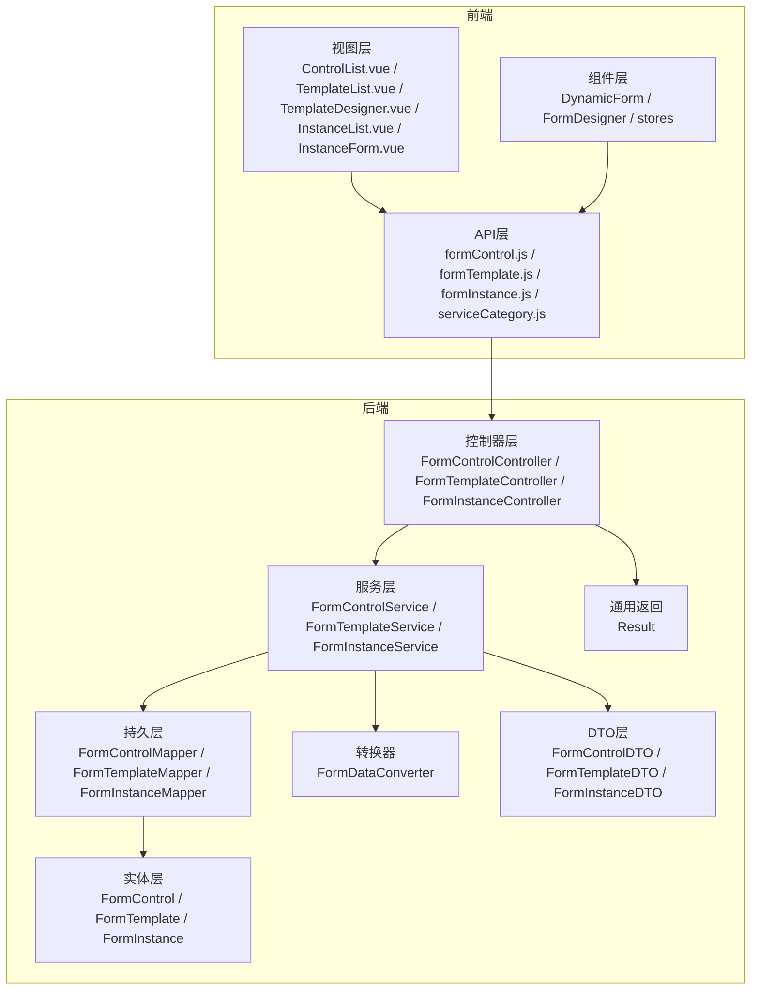
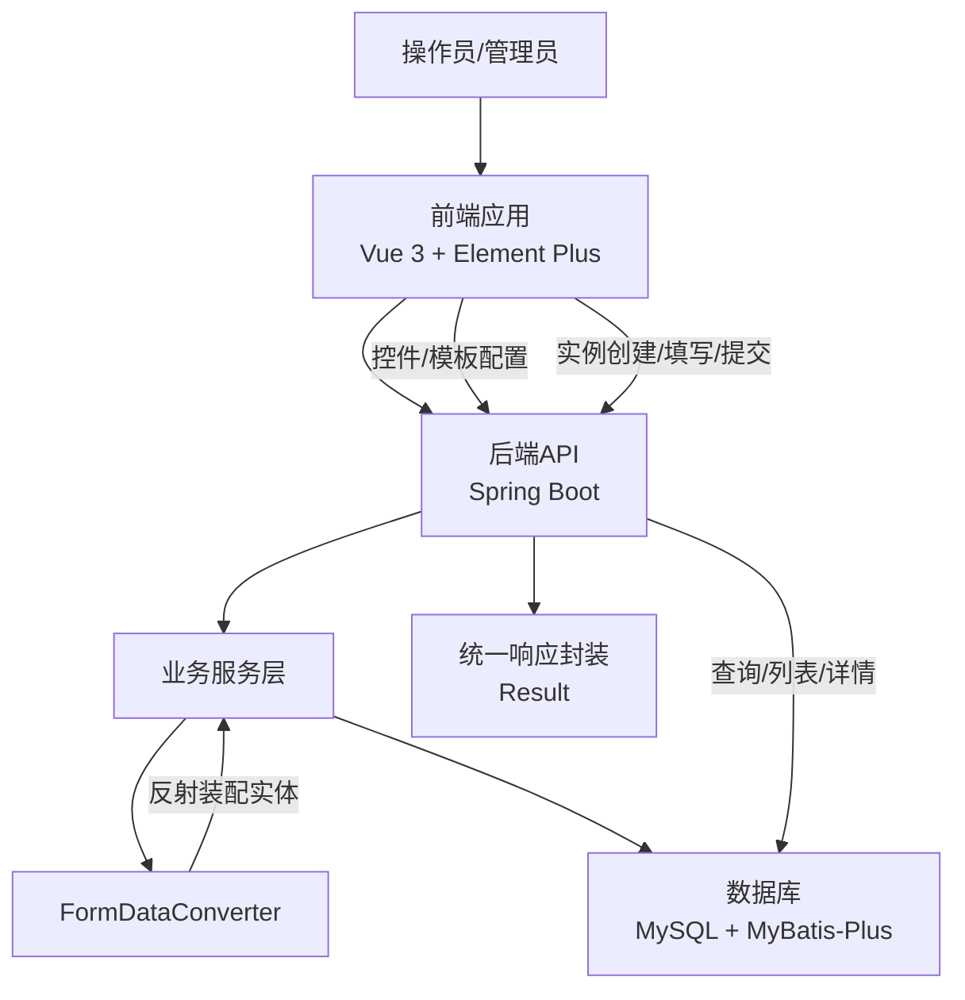
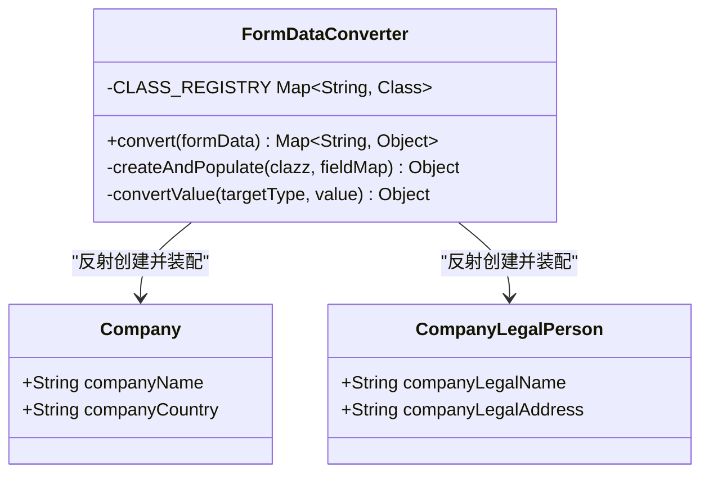
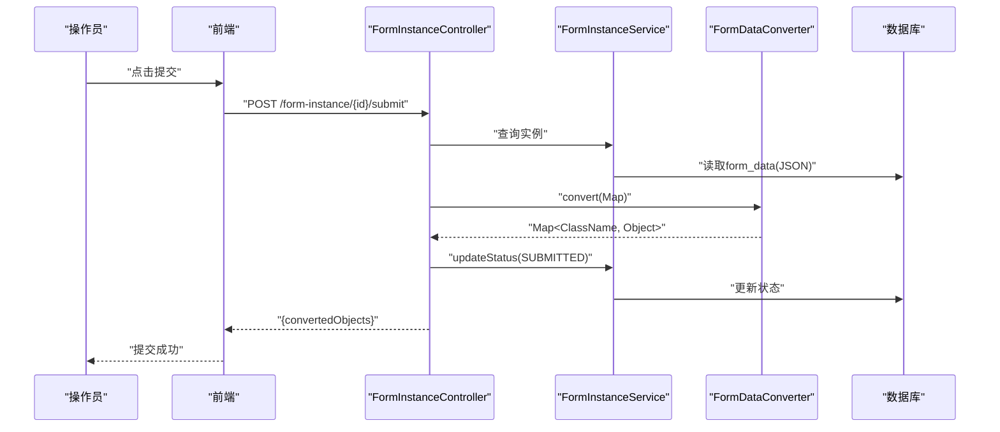
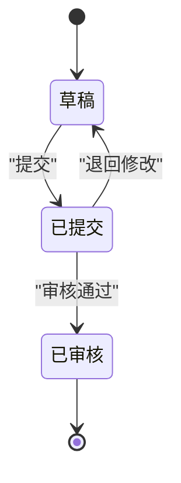
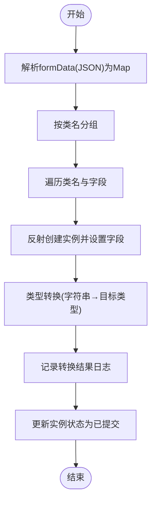
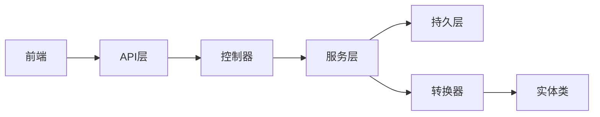

# 核心业务逻辑

<cite>
**本文档引用的文件**
- [VAT_EPR_动态表单技术方案.md](file://VAT_EPR_动态表单技术方案.md)
</cite>

## 目录
1. [简介](#简介)
2. [项目结构](#项目结构)
3. [核心组件](#核心组件)
4. [架构总览](#架构总览)
5. [详细组件分析](#详细组件分析)
6. [依赖关系分析](#依赖关系分析)
7. [性能考量](#性能考量)
8. [故障排查指南](#故障排查指南)
9. [结论](#结论)
10. [附录](#附录)

## 简介
本文件面向业务分析师与开发者，系统性阐述VAT&EPR动态表单系统的核心业务逻辑与实现细节。重点覆盖：
- 表单数据转换机制与FormDataConverter的设计与实现
- 表单生命周期管理（草稿→提交→审核）
- 提交流程设计与状态管理策略
- 异常处理、事务管理与并发控制
- 关键业务时序与流程图

该系统采用前后端分离架构，后端基于Spring Boot + MyBatis-Plus，前端基于Vue 3 + Element Plus，支持通过JSON Schema动态渲染表单，并通过FormDataConverter实现Map形式的表单数据到业务实体对象的自动转换。

## 项目结构
后端采用标准分层结构，包含控制器、服务、持久层、实体、转换器、DTO与通用返回封装等模块。前端提供控件管理、模板设计器、实例表单渲染与状态管理等视图组件。

图表来源
- [VAT_EPR_动态表单技术方案.md: 773-852:773-852](file://VAT_EPR_动态表单技术方案.md#L773-L852)

章节来源
- [VAT_EPR_动态表单技术方案.md: 773-852:773-852](file://VAT_EPR_动态表单技术方案.md#L773-L852)

## 核心组件
本节聚焦于系统的关键业务组件及其职责边界。

- 数据模型与存储
  - 自定义控件表：定义控件元数据（类型、校验规则、默认值等），用于动态渲染与校验。
  - 服务单模板表：存储JSON Schema与服务类别信息，决定表单布局与业务类型。
  - 服务单实例表：存储用户填写的表单数据（Map<controlKey, value>序列化为JSON），并维护状态流转。

- 表单数据转换器（FormDataConverter）
  - 负责将Map形式的表单数据按“类名.字段名”键进行分组，利用反射机制创建目标实体对象并填充字段，完成类型转换与装配。
  - 支持字符串、整数、长整型、布尔、大数等常见类型的自动转换。

- 提交流程与状态管理
  - 提交接口负责解析实例中的formData，调用转换器生成实体对象映射，更新实例状态为“已提交”，并返回转换结果供后续业务处理。

章节来源
- [VAT_EPR_动态表单技术方案.md: 31-163:31-163](file://VAT_EPR_动态表单技术方案.md#L31-L163)
- [VAT_EPR_动态表单技术方案.md: 594-728:594-728](file://VAT_EPR_动态表单技术方案.md#L594-L728)

## 架构总览
系统采用分层架构，前后端通过REST API交互。核心业务流如下：
- 管理员在前端设计器中配置控件与模板，后端持久化为JSON Schema。
- 操作员基于模板创建实例，前端动态渲染表单，用户填写后保存为草稿或直接提交。
- 提交时后端解析formData，通过FormDataConverter转换为实体对象，更新状态并触发后续业务。

图表来源
- [VAT_EPR_动态表单技术方案.md: 7-28:7-28](file://VAT_EPR_动态表单技术方案.md#L7-L28)
- [VAT_EPR_动态表单技术方案.md: 594-728:594-728](file://VAT_EPR_动态表单技术方案.md#L594-L728)

## 详细组件分析

### 表单数据转换器（FormDataConverter）
FormDataConverter是系统的核心转换组件，承担以下职责：
- 键分组：将Map<controlKey, value>按“类名”进行分组，controlKey格式为“ClassName.fieldName”。
- 实体注册：通过静态注册表维护类名到Class的映射，支持扩展为注解扫描自动注册。
- 反射装配：对每个类名创建实例，遍历其字段，设置可见性后进行类型转换与赋值。
- 类型转换：针对常见基础类型执行字符串到目标类型的解析，确保数据一致性。
- 日志与异常：记录转换过程与异常，便于问题定位与审计。

图表来源
- [VAT_EPR_动态表单技术方案.md: 594-703:594-703](file://VAT_EPR_动态表单技术方案.md#L594-L703)

章节来源
- [VAT_EPR_动态表单技术方案.md: 594-703:594-703](file://VAT_EPR_动态表单技术方案.md#L594-L703)

### 提交流程与状态管理
提交流程围绕FormInstance的生命周期展开：
- 实例状态：草稿（0）→已提交（1）→已审核（2）。提交后禁止再次修改，确保数据一致性。
- 提交步骤：
  1) 解析实例中的formData（Map<controlKey, value>）。
  2) 调用FormDataConverter进行实体对象转换。
  3) 记录转换结果日志（后续接入具体业务）。
  4) 更新实例状态为“已提交”。

图表来源
- [VAT_EPR_动态表单技术方案.md: 460-478:460-478](file://VAT_EPR_动态表单技术方案.md#L460-L478)
- [VAT_EPR_动态表单技术方案.md: 705-728:705-728](file://VAT_EPR_动态表单技术方案.md#L705-L728)

章节来源
- [VAT_EPR_动态表单技术方案.md: 460-478:460-478](file://VAT_EPR_动态表单技术方案.md#L460-L478)
- [VAT_EPR_动态表单技术方案.md: 705-728:705-728](file://VAT_EPR_动态表单技术方案.md#L705-L728)

### 表单生命周期管理
系统通过状态字段管理实例生命周期：
- 草稿：允许编辑与保存，数据可修改。
- 已提交：禁止再次修改，等待审核。
- 已审核：最终状态，通常用于归档或触发下游业务。

图表来源
- [VAT_EPR_动态表单技术方案.md: 144-145:144-145](file://VAT_EPR_动态表单技术方案.md#L144-L145)

章节来源
- [VAT_EPR_动态表单技术方案.md: 144-145:144-145](file://VAT_EPR_动态表单技术方案.md#L144-L145)

### 数据存储与类型转换流程
- 存储策略：formData以Map形式序列化为JSON存入数据库，键命名规范为“类名.字段名”，值支持字符串、布尔、数字、文件列表等。
- 类型转换：在转换器中对基础类型进行解析，确保目标实体字段类型一致。
- 前端渲染：根据json_schema与controlDetails动态生成表单布局与控件，校验规则来源于控件元数据。

图表来源
- [VAT_EPR_动态表单技术方案.md: 594-728:594-728](file://VAT_EPR_动态表单技术方案.md#L594-L728)

章节来源
- [VAT_EPR_动态表单技术方案.md: 594-728:594-728](file://VAT_EPR_动态表单技术方案.md#L594-L728)

## 依赖关系分析
- 控制器依赖服务层，服务层依赖持久层与转换器。
- 转换器依赖实体类注册表与反射机制。
- 前端通过API层调用后端接口，视图层依赖组件层与状态管理。

图表来源
- [VAT_EPR_动态表单技术方案.md: 773-852:773-852](file://VAT_EPR_动态表单技术方案.md#L773-L852)

章节来源
- [VAT_EPR_动态表单技术方案.md: 773-852:773-852](file://VAT_EPR_动态表单技术方案.md#L773-L852)

## 性能考量
- 反射性能：反射创建与字段赋值在大数据量时可能成为瓶颈，建议：
  - 缓存Class与Field元信息，减少重复反射开销。
  - 对高频实体采用预编译或字节码增强方案。
- JSON序列化：大量字段的Map解析与序列化需注意内存占用，建议：
  - 使用流式解析/反序列化，避免一次性加载整个JSON。
  - 对超大表单分页或延迟加载。
- 并发控制：同一实例的并发保存需加乐观锁（version字段），防止覆盖。
- 数据库索引：对常用查询字段建立索引，如模板ID、状态、国家代码、服务类别等。

## 故障排查指南
- controlKey格式错误
  - 现象：转换器跳过无效键或抛出异常。
  - 排查：确认controlKey格式为“类名.字段名”，且类名已在注册表中。
- 类型转换失败
  - 现象：目标字段赋值异常或空值。
  - 排查：检查前端传值类型与实体字段类型是否匹配，必要时在转换器中增加更严格的校验与容错。
- 实体未注册
  - 现象：转换器无法找到类，跳过该类的转换。
  - 排查：在CLASS_REGISTRY中注册新实体，或扩展为注解扫描自动注册。
- 并发覆盖
  - 现象：保存时被其他请求覆盖。
  - 排查：启用乐观锁（version字段），在保存接口中进行版本校验与重试。
- 数据安全
  - 现象：敏感字段泄露。
  - 排查：在存储前过滤敏感字段，或在转换后进行脱敏处理。

章节来源
- [VAT_EPR_动态表单技术方案.md: 856-869:856-869](file://VAT_EPR_动态表单技术方案.md#L856-L869)

## 结论
VAT&EPR动态表单系统通过JSON Schema驱动的动态渲染与FormDataConverter的反射转换机制，实现了高度灵活的表单能力。结合明确的状态管理与严格的约束（如controlKey唯一性、模板版本管理、并发控制），系统在保证灵活性的同时兼顾了安全性与一致性。建议后续持续优化反射性能、完善类型转换与异常处理，并扩展实体注册机制以降低维护成本。

## 附录
- 关键接口概览
  - 自定义控件：创建、查询列表、更新、删除
  - 服务单模板：创建/保存、查询列表、查询详情、更新、发布
  - 服务单实例：创建、保存草稿、提交、查询列表
- 服务类目三级联动：国家代码枚举与L1/L2/L3联动交互
- 项目结构建议：后端分层与前端组件划分

章节来源
- [VAT_EPR_动态表单技术方案.md: 167-396:167-396](file://VAT_EPR_动态表单技术方案.md#L167-L396)
- [VAT_EPR_动态表单技术方案.md: 732-771:732-771](file://VAT_EPR_动态表单技术方案.md#L732-L771)
- [VAT_EPR_动态表单技术方案.md: 773-852:773-852](file://VAT_EPR_动态表单技术方案.md#L773-L852)