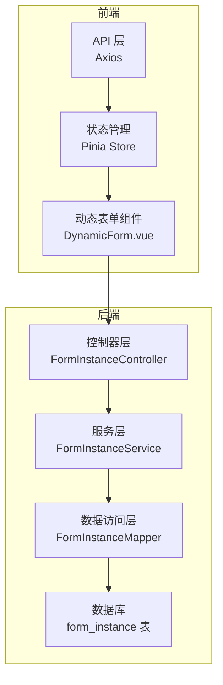
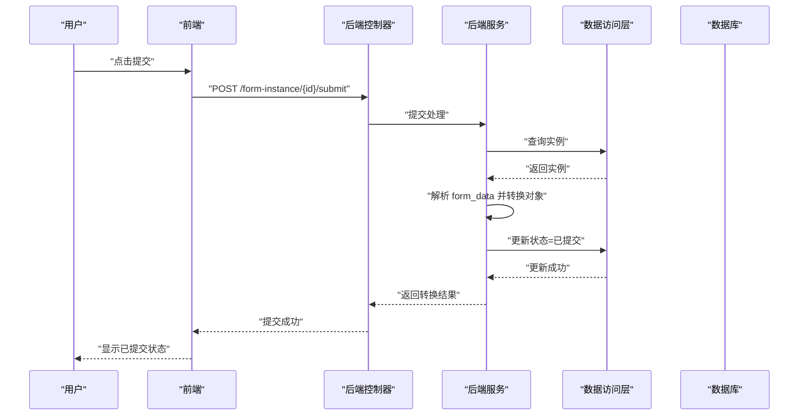
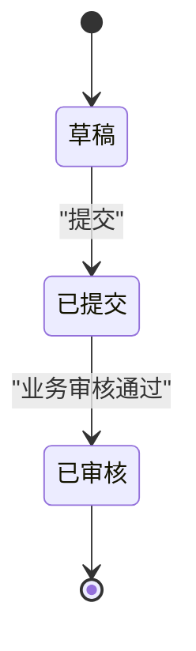
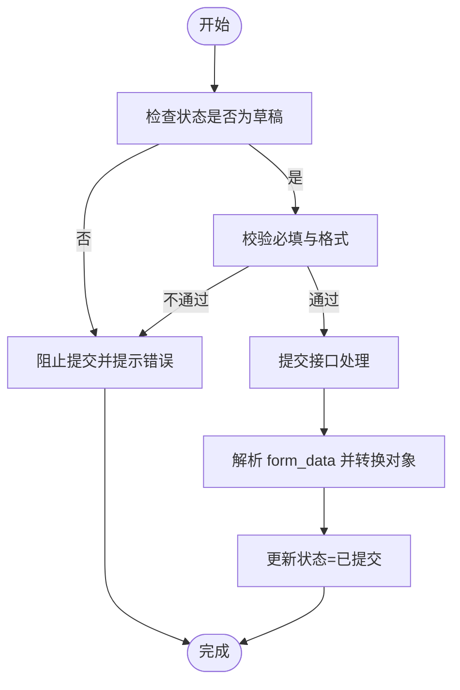

# 状态管理策略

<cite>
**本文引用的文件**
- [VAT_EPR_动态表单技术方案.md](file://VAT_EPR_动态表单技术方案.md)
</cite>

## 目录
1. [简介](#简介)
2. [项目结构](#项目结构)
3. [核心组件](#核心组件)
4. [架构总览](#架构总览)
5. [详细组件分析](#详细组件分析)
6. [依赖关系分析](#依赖关系分析)
7. [性能考量](#性能考量)
8. [故障排查指南](#故障排查指南)
9. [结论](#结论)
10. [附录](#附录)

## 简介
本文件围绕 VAT 与 EPR 动态表单系统的“状态管理策略”展开，聚焦于服务单实例的状态模型与流转控制。系统采用“草稿（0）→已提交（1）→已审核（2）”的线性状态机，并通过数据库字段与后端接口共同保障状态变更的合法性、一致性与可审计性。本文将从状态定义、触发机制、权限与业务规则、前后端实现、状态迁移图与决策树、异常处理与回滚、审计日志等方面进行系统化阐述，帮助开发者快速理解并正确实现复杂业务状态逻辑。

## 项目结构
- 服务端采用 Spring Boot + MyBatis-Plus 架构，控制器、服务、映射器、实体与转换器分层清晰。
- 前端采用 Vue 3 + Pinia 管理状态，结合 Element Plus 组件库完成动态表单渲染与交互。
- 数据库层面通过表结构字段明确状态值域与默认值，确保状态的强约束。

图表来源
- [VAT_EPR_动态表单技术方案.md: 773-813:773-813](file://VAT_EPR_动态表单技术方案.md#L773-L813)
- [VAT_EPR_动态表单技术方案.md: 815-852:815-852](file://VAT_EPR_动态表单技术方案.md#L815-L852)

章节来源
- [VAT_EPR_动态表单技术方案.md: 773-813:773-813](file://VAT_EPR_动态表单技术方案.md#L773-L813)
- [VAT_EPR_动态表单技术方案.md: 815-852:815-852](file://VAT_EPR_动态表单技术方案.md#L815-L852)

## 核心组件
- 状态字段与默认值
  - 服务单实例表的 status 字段默认为草稿（0），表示新建即处于草稿态。
- 状态常量与转换
  - 提交接口将状态更新为“已提交（1）”，作为后续业务处理的起点。
  - 审核状态（2）在接口与数据库层面预留，但当前提交流程未直接进入该状态，后续可按业务需要扩展。
- 提交流程与对象转换
  - 提交时解析 form_data 并通过转换器生成实体对象映射，随后更新状态为“已提交”。

章节来源
- [VAT_EPR_动态表单技术方案.md: 132-153:132-153](file://VAT_EPR_动态表单技术方案.md#L132-L153)
- [VAT_EPR_动态表单技术方案.md: 705-728:705-728](file://VAT_EPR_动态表单技术方案.md#L705-L728)

## 架构总览
状态管理贯穿前后端：
- 前端负责状态驱动的 UI 行为（草稿保存、提交按钮可用性、只读态切换等）。
- 后端负责状态校验、业务规则执行与持久化。
- 数据库层面通过字段约束与默认值确保状态的初始一致性。

图表来源
- [VAT_EPR_动态表单技术方案.md: 460-478:460-478](file://VAT_EPR_动态表单技术方案.md#L460-L478)
- [VAT_EPR_动态表单技术方案.md: 705-728:705-728](file://VAT_EPR_动态表单技术方案.md#L705-L728)

## 详细组件分析

### 状态模型与转换条件
- 状态集合
  - 草稿（0）：新建即默认，允许编辑与保存草稿。
  - 已提交（1）：提交后进入，通常触发后续业务处理。
  - 已审核（2）：预留状态，用于最终确认或归档。
- 转换条件
  - 草稿 → 已提交：提交接口触发，要求 form_data 合法且可被转换为目标实体。
  - 已提交 → 已审核：由业务流程决定，当前提交接口不直接进入该状态。
- 约束与限制
  - 提交后禁止再次修改数据（基于状态约束与业务规则）。
  - 模板发布后不可修改 jsonSchema，避免已存在实例的数据错乱。

图表来源
- [VAT_EPR_动态表单技术方案.md: 132-153:132-153](file://VAT_EPR_动态表单技术方案.md#L132-L153)
- [VAT_EPR_动态表单技术方案.md: 705-728:705-728](file://VAT_EPR_动态表单技术方案.md#L705-L728)

章节来源
- [VAT_EPR_动态表单技术方案.md: 132-153:132-153](file://VAT_EPR_动态表单技术方案.md#L132-L153)
- [VAT_EPR_动态表单技术方案.md: 705-728:705-728](file://VAT_EPR_动态表单技术方案.md#L705-L728)

### 触发机制与权限控制
- 触发机制
  - 前端根据当前状态启用/禁用提交按钮与编辑能力。
  - 后端提交接口仅在实例存在且状态为草稿时允许提交。
- 权限控制
  - 提交操作属于业务操作，需结合角色与权限体系（例如仅具备“提交”权限的操作员可执行）。
  - 审核操作（进入已审核）需额外权限与流程控制，当前接口未直接支持。
- 业务规则约束
  - 提交前需完成必填项校验与格式校验（由前端动态规则与后端转换器共同保障）。
  - 提交后状态变为已提交，禁止再次修改数据。

章节来源
- [VAT_EPR_动态表单技术方案.md: 531-548:531-548](file://VAT_EPR_动态表单技术方案.md#L531-L548)
- [VAT_EPR_动态表单技术方案.md: 579-589:579-589](file://VAT_EPR_动态表单技术方案.md#L579-L589)

### 前后端实现方式
- 前端
  - 使用 Pinia 管理表单实例状态（草稿/已提交/已审核），并在 UI 上根据状态切换只读/可编辑。
  - 动态表单渲染时依据 controlDetails 与 jsonSchema 生成控件，保存草稿与提交均通过接口调用。
- 后端
  - 提交接口解析 form_data 并通过转换器生成实体对象映射，随后更新状态为已提交。
  - 数据库层面通过 status 字段与默认值确保初始一致性。

章节来源
- [VAT_EPR_动态表单技术方案.md: 815-852:815-852](file://VAT_EPR_动态表单技术方案.md#L815-L852)
- [VAT_EPR_动态表单技术方案.md: 705-728:705-728](file://VAT_EPR_动态表单技术方案.md#L705-L728)

### 状态迁移图与决策树
- 状态迁移图
  - 草稿 → 已提交（提交）
  - 已提交 → 已审核（业务审核）
- 决策树（提交场景）
  - 是否满足必填与格式校验？
    - 是：执行提交
    - 否：阻止提交并提示错误
  - 提交后状态更新为“已提交”，UI 切换为只读态

图表来源
- [VAT_EPR_动态表单技术方案.md: 705-728:705-728](file://VAT_EPR_动态表单技术方案.md#L705-L728)
- [VAT_EPR_动态表单技术方案.md: 531-548:531-548](file://VAT_EPR_动态表单技术方案.md#L531-L548)

章节来源
- [VAT_EPR_动态表单技术方案.md: 705-728:705-728](file://VAT_EPR_动态表单技术方案.md#L705-L728)
- [VAT_EPR_动态表单技术方案.md: 531-548:531-548](file://VAT_EPR_动态表单技术方案.md#L531-L548)

### 异常处理、回滚机制与审计日志
- 异常处理
  - 提交过程中若转换失败或数据库更新失败，应返回错误并保持状态不变。
  - 前端应在提交失败时保留草稿状态，允许用户修复后重试。
- 回滚机制
  - 当前未提供直接回滚至草稿的接口，可在业务需要时增加“撤销提交”或“退回草稿”的流程与接口。
- 审计日志
  - 提交完成后打印转换结果日志，便于审计与问题定位。
  - 建议补充统一的日志记录策略，记录状态变更的时间、操作人、变更原因等。

章节来源
- [VAT_EPR_动态表单技术方案.md: 705-728:705-728](file://VAT_EPR_动态表单技术方案.md#L705-L728)
- [VAT_EPR_动态表单技术方案.md: 594-684:594-684](file://VAT_EPR_动态表单技术方案.md#L594-L684)

## 依赖关系分析
- 前端依赖
  - API 层依赖 Axios 进行 HTTP 请求。
  - Pinia Store 管理表单实例状态。
  - 动态表单组件根据 controlDetails 与 jsonSchema 渲染控件。
- 后端依赖
  - 控制器依赖服务层处理业务。
  - 服务层依赖数据访问层更新数据库。
  - 数据库层面通过表结构字段约束状态值域。

图表来源
- [VAT_EPR_动态表单技术方案.md: 815-852:815-852](file://VAT_EPR_动态表单技术方案.md#L815-L852)
- [VAT_EPR_动态表单技术方案.md: 773-813:773-813](file://VAT_EPR_动态表单技术方案.md#L773-L813)

章节来源
- [VAT_EPR_动态表单技术方案.md: 815-852:815-852](file://VAT_EPR_动态表单技术方案.md#L815-L852)
- [VAT_EPR_动态表单技术方案.md: 773-813:773-813](file://VAT_EPR_动态表单技术方案.md#L773-L813)

## 性能考量
- 前端
  - 动态表单渲染时尽量减少不必要的重渲染，合理使用响应式数据与计算属性。
  - 控件数量较多时，建议分页加载与懒渲染。
- 后端
  - 提交接口涉及 JSON 解析与反射转换，建议对大数据量场景进行异步处理与缓存优化。
  - 数据库层面可通过索引与事务优化提升更新性能。

## 故障排查指南
- 提交失败
  - 检查 form_data 的 key 格式是否符合 “ClassName.fieldName” 规范。
  - 确认实体类已在转换器注册，避免转换失败。
- 状态未更新
  - 检查数据库连接与事务是否正常提交。
  - 查看后端日志中的转换结果与状态更新记录。
- 并发冲突
  - 若存在并发提交，建议引入乐观锁或队列化处理，避免覆盖。

章节来源
- [VAT_EPR_动态表单技术方案.md: 856-869:856-869](file://VAT_EPR_动态表单技术方案.md#L856-L869)
- [VAT_EPR_动态表单技术方案.md: 594-684:594-684](file://VAT_EPR_动态表单技术方案.md#L594-L684)

## 结论
本方案通过明确的状态模型、严格的触发机制与业务规则约束，以及前后端协同的一致性保障，实现了 VAT 与 EPR 动态表单系统的服务单实例状态管理。当前实现聚焦于“草稿 → 已提交”的核心流程，后续可根据业务需要扩展“已审核”状态与相应的权限与流程控制，同时完善回滚与审计能力，以满足更复杂的业务场景。

## 附录
- 状态字段定义与默认值
  - form_instance.status 默认为草稿（0），提交后更新为已提交（1）。
- 接口参考
  - 提交接口：POST /api/form-instance/{id}/submit
  - 保存草稿：PUT /api/form-instance/{id}/save
  - 查询实例列表：GET /api/form-instance/list?status={0|1|2}

章节来源
- [VAT_EPR_动态表单技术方案.md: 132-153:132-153](file://VAT_EPR_动态表单技术方案.md#L132-L153)
- [VAT_EPR_动态表单技术方案.md: 306-387:306-387](file://VAT_EPR_动态表单技术方案.md#L306-L387)