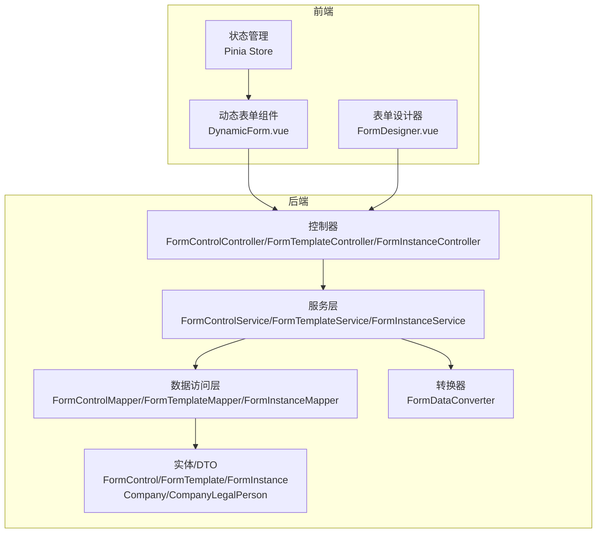
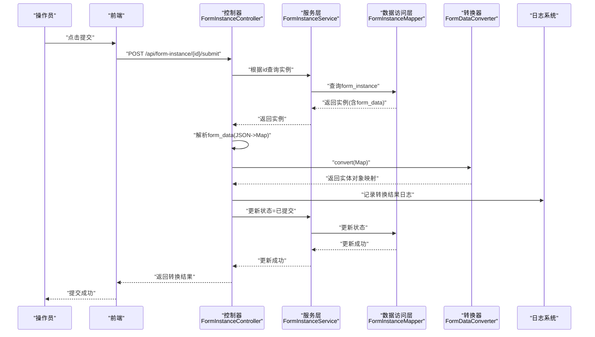
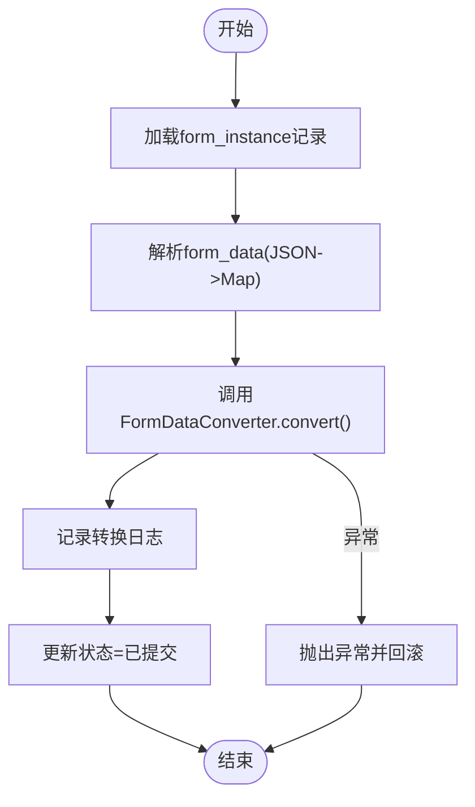
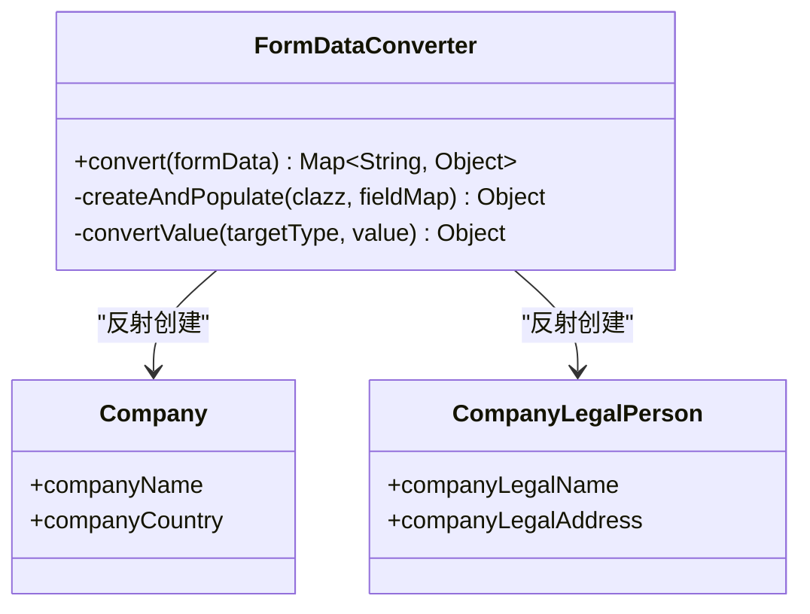
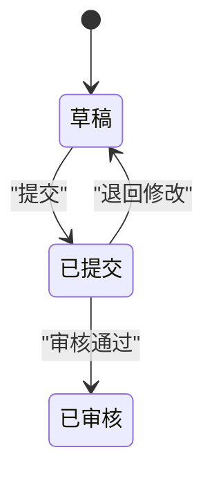
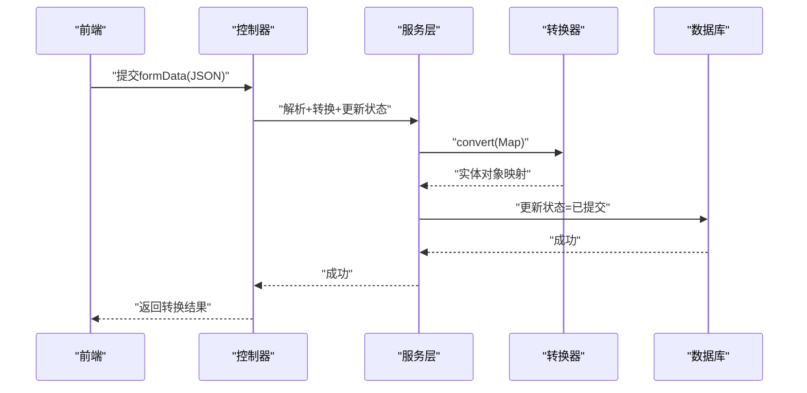
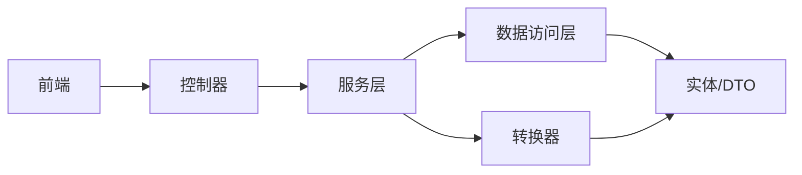

# 表单提交流程设计

<cite>
**本文引用的文件**
- [VAT_EPR_动态表单技术方案.md](file://VAT_EPR_动态表单技术方案.md)
</cite>

## 目录
1. [简介](#简介)
2. [项目结构](#项目结构)
3. [核心组件](#核心组件)
4. [架构总览](#架构总览)
5. [详细组件分析](#详细组件分析)
6. [依赖关系分析](#依赖关系分析)
7. [性能考量](#性能考量)
8. [故障排查指南](#故障排查指南)
9. [结论](#结论)
10. [附录](#附录)

## 简介
本文件面向产品经理与开发者，系统化阐述VAT&EPR动态表单系统的“表单提交流程设计”。围绕从“草稿”到“提交”再到“审核”的全生命周期，明确状态流转策略与业务逻辑处理；深入解析提交接口的实现细节（formData解析、实体对象转换、日志记录、状态更新等），并提供完整的时序图与流程图，帮助团队快速理解与落地实现。

## 项目结构
- 后端采用Spring Boot + MyBatis-Plus，按领域分层组织：
  - 控制层：控制器负责接收HTTP请求并返回统一结果包装。
  - 服务层：封装业务逻辑，协调数据访问与外部系统。
  - 数据访问层：MyBatis-Plus Mapper负责数据库操作。
  - 实体与DTO：实体用于持久化，DTO用于接口传输。
  - 转换器：FormDataConverter负责将Map形式的表单数据转换为业务实体对象。
- 前端采用Vue 3 + Element Plus，动态渲染表单，支持拖拽画板设计模板。

图表来源
- [VAT_EPR_动态表单技术方案.md:773-813](file://VAT_EPR_动态表单技术方案.md#L773-L813)

章节来源
- [VAT_EPR_动态表单技术方案.md:773-813](file://VAT_EPR_动态表单技术方案.md#L773-L813)

## 核心组件
- 表单实例表（form_instance）
  - 字段要点：模板ID、版本、国家代码、服务类别、formData(JSON)、状态、提交时间等。
  - 状态枚举：草稿(0)、已提交(1)、已审核(2)。
- 提交接口（POST /api/form-instance/{id}/submit）
  - 输入：路径参数id（服务单实例ID）。
  - 处理：解析formData、调用转换器生成实体对象、打印日志、更新状态为“已提交”。
  - 输出：返回转换后的实体对象映射。
- FormDataConverter
  - 职责：将Map<controlKey,value>按类名分组，反射创建实体对象并赋值，输出Map<className,实体对象>。
  - 关键点：controlKey格式校验、类注册表、类型转换、日志记录。
- 控制器方法（提交）
  - 步骤：查询实例、解析formData、调用转换器、记录日志、更新状态、返回结果。

章节来源
- [VAT_EPR_动态表单技术方案.md:132-163](file://VAT_EPR_动态表单技术方案.md#L132-L163)
- [VAT_EPR_动态表单技术方案.md:359-380](file://VAT_EPR_动态表单技术方案.md#L359-L380)
- [VAT_EPR_动态表单技术方案.md:594-728](file://VAT_EPR_动态表单技术方案.md#L594-L728)

## 架构总览
下图展示了从用户点击“提交”到系统完成转换与状态更新的端到端流程。

图表来源
- [VAT_EPR_动态表单技术方案.md:460-478](file://VAT_EPR_动态表单技术方案.md#L460-L478)
- [VAT_EPR_动态表单技术方案.md:705-728](file://VAT_EPR_动态表单技术方案.md#L705-L728)

## 详细组件分析

### 提交接口实现细节
- 请求入口
  - 方法：POST
  - 路径：/api/form-instance/{id}/submit
  - 参数：路径参数id（服务单实例ID）
- 处理流程
  1) 查询实例：根据id从数据库读取form_instance记录，确保存在且未被删除。
  2) 解析formData：将存储在form_data中的JSON字符串反序列化为Map<controlKey, value>。
  3) 实体转换：调用FormDataConverter.convert(formData)，按类名分组并反射创建实体对象。
  4) 日志记录：对每个类别的转换结果进行日志输出，便于审计与排障。
  5) 状态更新：将实例状态更新为“已提交”，并记录提交时间。
  6) 返回结果：返回转换后的实体对象映射，供前端或下游系统使用。
- 异常与边界
  - controlKey格式非法：转换器会跳过无效key并记录告警。
  - 未注册类：找不到对应实体类时记录告警并跳过该组。
  - 反射创建失败：抛出运行时异常，阻止不一致状态写入数据库。
  - 并发冲突：建议引入乐观锁（version字段）避免并发覆盖。

图表来源
- [VAT_EPR_动态表单技术方案.md:705-728](file://VAT_EPR_动态表单技术方案.md#L705-L728)
- [VAT_EPR_动态表单技术方案.md:594-728](file://VAT_EPR_动态表单技术方案.md#L594-L728)

章节来源
- [VAT_EPR_动态表单技术方案.md:359-380](file://VAT_EPR_动态表单技术方案.md#L359-L380)
- [VAT_EPR_动态表单技术方案.md:705-728](file://VAT_EPR_动态表单技术方案.md#L705-L728)

### 表单数据转换器（FormDataConverter）
- 设计要点
  - 类注册表：维护className到Class的映射，便于反射创建对象。
  - 分组策略：按“类名”对controlKey进行分组，形成Map<className, Map<fieldName, value>>。
  - 反射填充：遍历字段名，尝试设置对应字段值，忽略不存在的字段。
  - 类型转换：针对常见基础类型进行字符串到目标类型的转换。
  - 日志记录：每完成一个类的转换即记录日志，便于审计。
- 性能与健壮性
  - 反射成本：反射创建与字段赋值有一定开销，建议在高频场景下评估缓存策略。
  - 类型转换：当前实现较为简单，复杂类型（如集合、嵌套对象）需要扩展。
  - 异常处理：创建实例或字段赋值失败时抛出运行时异常，确保不写入半成品数据。

图表来源
- [VAT_EPR_动态表单技术方案.md:594-728](file://VAT_EPR_动态表单技术方案.md#L594-L728)
- [VAT_EPR_动态表单技术方案.md:688-703](file://VAT_EPR_动态表单技术方案.md#L688-L703)

章节来源
- [VAT_EPR_动态表单技术方案.md:594-728](file://VAT_EPR_动态表单技术方案.md#L594-L728)
- [VAT_EPR_动态表单技术方案.md:688-703](file://VAT_EPR_动态表单技术方案.md#L688-L703)

### 状态流转策略与业务逻辑
- 状态定义
  - 草稿：0
  - 已提交：1
  - 已审核：2
- 流转规则
  - 草稿 → 已提交：提交接口触发，同时记录提交时间。
  - 已提交 → 已审核：由审核流程触发（此处为概念说明，具体实现不在本文档范围内）。
- 业务约束
  - 提交后禁止再次修改：提交接口更新状态为“已提交”，后续保存接口应拒绝修改。
  - 模板版本管理：模板发布后不可修改jsonSchema，避免历史实例数据错乱。
  - 文件上传：上传控件的值为文件URL列表，需配合文件服务使用。

图表来源
- [VAT_EPR_动态表单技术方案.md:132-163](file://VAT_EPR_动态表单技术方案.md#L132-L163)
- [VAT_EPR_动态表单技术方案.md:359-380](file://VAT_EPR_动态表单技术方案.md#L359-L380)

章节来源
- [VAT_EPR_动态表单技术方案.md:132-163](file://VAT_EPR_动态表单技术方案.md#L132-L163)
- [VAT_EPR_动态表单技术方案.md:856-869](file://VAT_EPR_动态表单技术方案.md#L856-L869)

### 前后端协作与数据流
- 前端职责
  - 动态渲染：根据jsonSchema与controlDetails渲染表单控件。
  - 校验规则：基于controlDetail中的正则、必填、长度等规则动态生成。
  - 数据收集：维护formData对象，保存时将原样传给后端。
- 后端职责
  - 接收并解析：将formData JSON反序列化为Map。
  - 转换与落库：转换为实体对象映射，记录日志，更新状态。
  - 审计与追踪：通过日志与状态字段实现全流程可追溯。

图表来源
- [VAT_EPR_动态表单技术方案.md:531-548](file://VAT_EPR_动态表单技术方案.md#L531-L548)
- [VAT_EPR_动态表单技术方案.md:705-728](file://VAT_EPR_动态表单技术方案.md#L705-L728)

章节来源
- [VAT_EPR_动态表单技术方案.md:531-548](file://VAT_EPR_动态表单技术方案.md#L531-L548)
- [VAT_EPR_动态表单技术方案.md:705-728](file://VAT_EPR_动态表单技术方案.md#L705-L728)

## 依赖关系分析
- 控制器依赖服务层，服务层依赖转换器与数据访问层。
- 转换器依赖实体类注册表，实体类来自domain包。
- 前端通过Axios调用后端接口，使用Pinia管理状态。

图表来源
- [VAT_EPR_动态表单技术方案.md:773-813](file://VAT_EPR_动态表单技术方案.md#L773-L813)
- [VAT_EPR_动态表单技术方案.md:594-728](file://VAT_EPR_动态表单技术方案.md#L594-L728)

章节来源
- [VAT_EPR_动态表单技术方案.md:773-813](file://VAT_EPR_动态表单技术方案.md#L773-L813)
- [VAT_EPR_动态表单技术方案.md:594-728](file://VAT_EPR_动态表单技术方案.md#L594-L728)

## 性能考量
- 反射性能：反射创建与字段赋值存在开销，建议：
  - 在高频场景下对常用类建立缓存（如类构造器与字段缓存）。
  - 限制一次性转换的实体数量，必要时分批处理。
- JSON解析：大量字段时建议优化序列化/反序列化策略，减少内存拷贝。
- 并发控制：同一实例的并发保存应使用乐观锁（version字段）避免覆盖。
- 日志成本：生产环境建议降低日志级别或异步化日志输出。

## 故障排查指南
- 提交失败
  - 现象：返回错误或状态未更新。
  - 排查：检查form_data是否为合法JSON；确认controlKey格式正确；查看转换器日志定位未注册类或字段缺失。
- 实体转换异常
  - 现象：抛出运行时异常，阻止状态更新。
  - 排查：核对实体类字段与controlKey是否匹配；检查类型转换逻辑；确认类已在注册表中。
- 并发覆盖
  - 现象：保存后状态被其他请求覆盖。
  - 排查：启用乐观锁（version字段），在保存接口中校验版本一致性。
- 文件上传问题
  - 现象：上传控件值非预期。
  - 排查：确认上传控件的value为文件URL列表；检查文件服务可用性与权限。

章节来源
- [VAT_EPR_动态表单技术方案.md:856-869](file://VAT_EPR_动态表单技术方案.md#L856-L869)
- [VAT_EPR_动态表单技术方案.md:594-728](file://VAT_EPR_动态表单技术方案.md#L594-L728)

## 结论
本文档从生命周期、状态流转、接口实现、转换器设计、前后端协作、异常与并发控制等维度，全面梳理了VAT&EPR动态表单系统的“表单提交流程”。建议在生产环境中结合本文档的性能与并发建议进行落地，并持续完善实体类注册与类型转换能力，以支撑更复杂的业务场景。

## 附录
- 关键接口速览
  - 创建服务单实例：POST /api/form-instance/create
  - 保存草稿：PUT /api/form-instance/{id}/save
  - 提交：POST /api/form-instance/{id}/submit
- 数据模型要点
  - form_instance.status：草稿(0)、已提交(1)、已审核(2)
  - form_data：Map<controlKey, value>，JSON序列化存储
- 建议的后续演进
  - 自动化实体注册：通过注解扫描替代硬编码注册表。
  - 类型转换增强：支持集合、嵌套对象、日期时间等复杂类型。
  - 审核流程对接：在“已提交”后接入审核工作流。