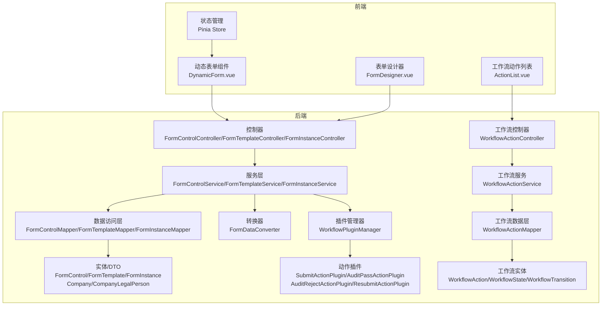
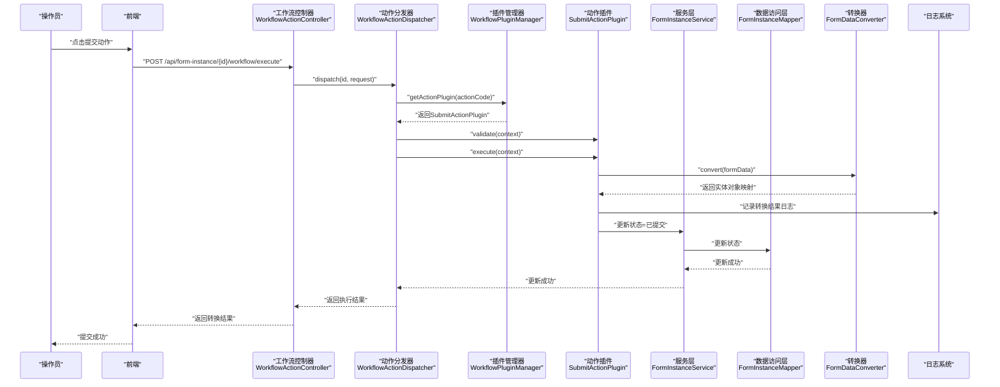
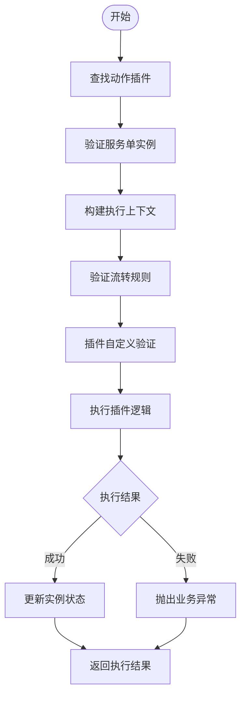
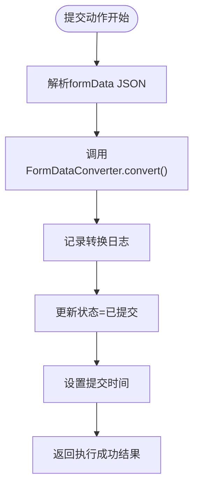
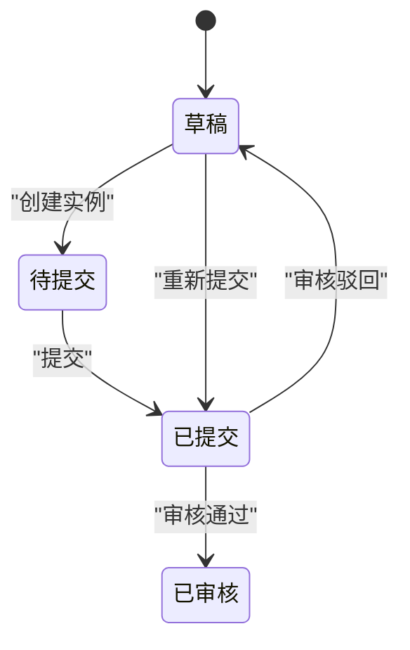
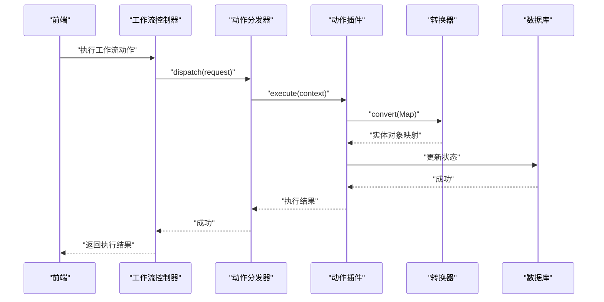
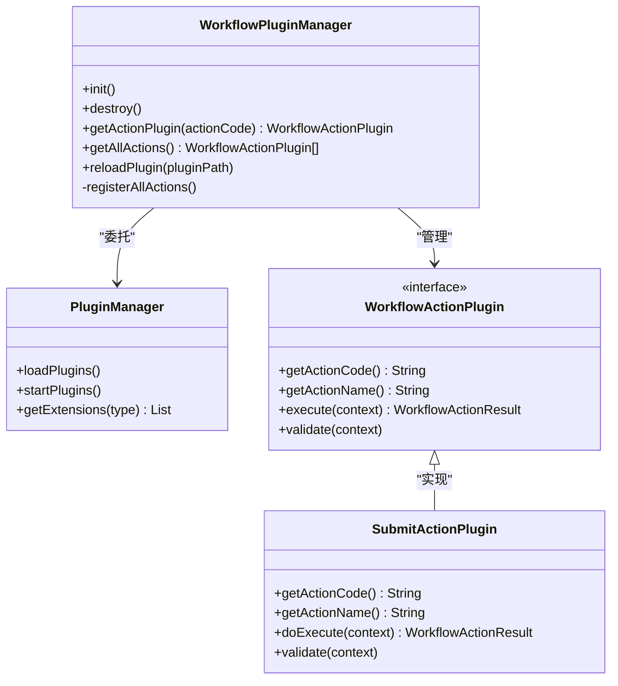
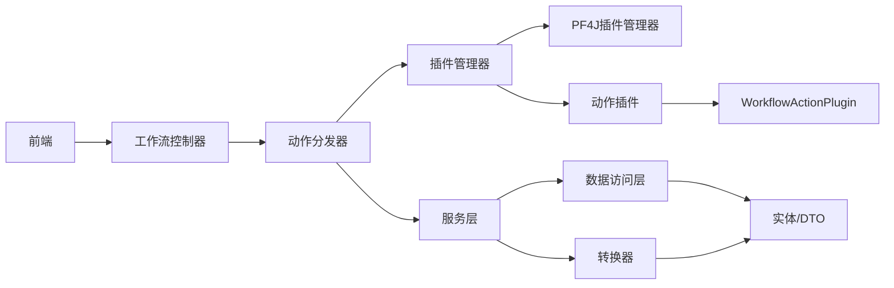

# 表单提交流程设计

<cite>
**本文引用的文件**
- [VAT_EPR_动态表单技术方案.md](file://VAT_EPR_动态表单技术方案.md)
- [WorkflowActionController.java](file://genetics-server/src/main/java/com/genetics/controller/WorkflowActionController.java)
- [WorkflowActionDispatcher.java](file://genetics-server/src/main/java/com/genetics/workflow/WorkflowActionDispatcher.java)
- [WorkflowPluginManager.java](file://genetics-server/src/main/java/com/genetics/workflow/WorkflowPluginManager.java)
- [WorkflowPluginConfig.java](file://genetics-server/src/main/java/com/genetics/config/WorkflowPluginConfig.java)
- [WorkflowActionPlugin.java](file://genetics-server/src/main/java/com/genetics/workflow/action/WorkflowActionPlugin.java)
- [AbstractWorkflowAction.java](file://genetics-server/src/main/java/com/genetics/workflow/action/AbstractWorkflowAction.java)
- [SubmitActionPlugin.java](file://genetics-server/src/main/java/com/genetics/workflow/actions/SubmitActionPlugin.java)
- [AuditPassActionPlugin.java](file://genetics-server/src/main/java/com/genetics/workflow/actions/AuditPassActionPlugin.java)
- [AuditRejectActionPlugin.java](file://genetics-server/src/main/java/com/genetics/workflow/actions/AuditRejectActionPlugin.java)
- [ResubmitActionPlugin.java](file://genetics-server/src/main/java/com/genetics/workflow/actions/ResubmitActionPlugin.java)
- [WorkflowAction.java](file://genetics-server/src/main/java/com/genetics/entity/workflow/WorkflowAction.java)
- [WorkflowTransitionRequestDTO.java](file://genetics-server/src/main/java/com/genetics/dto/WorkflowTransitionRequestDTO.java)
</cite>

## 更新摘要
**所做更改**
- 新增PF4J插件化工作流系统架构分析
- 更新提交流程以反映统一动作执行系统
- 新增多种工作流动作插件（提交、审核、拒绝、重新提交）
- 更新状态流转策略与业务逻辑处理
- 新增插件化架构的异常处理与并发控制

## 目录
1. [简介](#简介)
2. [项目结构](#项目结构)
3. [核心组件](#核心组件)
4. [架构总览](#架构总览)
5. [详细组件分析](#详细组件分析)
6. [PF4J插件化工作流系统](#pf4j插件化工作流系统)
7. [依赖关系分析](#依赖关系分析)
8. [性能考量](#性能考量)
9. [故障排查指南](#故障排查指南)
10. [结论](#结论)
11. [附录](#附录)

## 简介
本文件面向产品经理与开发者，系统化阐述VAT&EPR动态表单系统的"表单提交流程设计"。随着PF4J插件化工作流系统的引入，原有的直接提交流程已被统一的动作执行系统替代，新的系统通过插件架构支持多种工作流动作（提交、审核、拒绝、重新提交），同时保持向后兼容性。围绕从"草稿"到"提交"再到"审核"的全生命周期，明确状态流转策略与业务逻辑处理；深入解析提交接口的实现细节（formData解析、实体对象转换、日志记录、状态更新等），并提供完整的时序图与流程图，帮助团队快速理解与落地实现。

## 项目结构
- 后端采用Spring Boot + MyBatis-Plus，按领域分层组织：
  - 控制层：控制器负责接收HTTP请求并返回统一结果包装。
  - 服务层：封装业务逻辑，协调数据访问与外部系统。
  - 数据访问层：MyBatis-Plus Mapper负责数据库操作。
  - 实体与DTO：实体用于持久化，DTO用于接口传输。
  - 转换器：FormDataConverter负责将Map形式的表单数据转换为业务实体对象。
  - **新增**：PF4J插件化工作流系统，支持动态加载和执行各种工作流动作。
- 前端采用Vue 3 + Element Plus，动态渲染表单，支持拖拽画板设计模板。

**图表来源**
- [WorkflowActionController.java:1-33](file://genetics-server/src/main/java/com/genetics/controller/WorkflowActionController.java#L1-L33)
- [WorkflowPluginManager.java:1-115](file://genetics-server/src/main/java/com/genetics/workflow/WorkflowPluginManager.java#L1-L115)
- [SubmitActionPlugin.java:1-82](file://genetics-server/src/main/java/com/genetics/workflow/actions/SubmitActionPlugin.java#L1-L82)

**章节来源**
- [VAT_EPR_动态表单技术方案.md:773-813](file://VAT_EPR_动态表单技术方案.md#L773-L813)

## 核心组件
- 表单实例表（form_instance）
  - 字段要点：模板ID、版本、国家代码、服务类别、formData(JSON)、状态、提交时间等。
  - 状态枚举：草稿(0)、已提交(1)、已审核(2)。
- **更新** 工作流动作插件系统
  - 动作编码：submit（提交）、auditPass（审核通过）、auditReject（审核驳回）、resubmit（重新提交）
  - 动作名称：提交、审核通过、审核驳回、重新提交
  - 动作类型：支持按钮类型（primary、info、success、warning、error）
  - 备注需求：审核驳回必须填写备注
- **更新** 统一动作执行接口（POST /api/form-instance/{id}/workflow/execute）
  - 输入：路径参数id（服务单实例ID）、动作编码、备注信息、动作表单数据
  - 处理：通过插件管理器查找对应动作插件，执行验证和业务逻辑
  - 输出：返回动作执行结果和状态更新信息
- **更新** 工作流动作分发器（WorkflowActionDispatcher）
  - 职责：根据动作编码分发到对应插件执行，处理状态验证和流转规则
  - 关键点：事务管理、异常处理、上下文构建、插件验证

**章节来源**
- [VAT_EPR_动态表单技术方案.md:132-163](file://VAT_EPR_动态表单技术方案.md#L132-L163)
- [WorkflowAction.java:1-65](file://genetics-server/src/main/java/com/genetics/entity/workflow/WorkflowAction.java#L1-L65)
- [WorkflowActionDispatcher.java:1-100](file://genetics-server/src/main/java/com/genetics/workflow/WorkflowActionDispatcher.java#L1-L100)

## 架构总览
下图展示了从用户点击"提交"到系统通过插件化工作流执行动作的端到端流程。

**图表来源**
- [WorkflowActionDispatcher.java:38-81](file://genetics-server/src/main/java/com/genetics/workflow/WorkflowActionDispatcher.java#L38-L81)
- [SubmitActionPlugin.java:33-69](file://genetics-server/src/main/java/com/genetics/workflow/actions/SubmitActionPlugin.java#L33-L69)

## 详细组件分析

### 工作流动作分发器实现细节
- 请求入口
  - 方法：POST
  - 路径：/api/form-instance/{id}/workflow/execute
  - 参数：路径参数id（服务单实例ID）、动作编码、备注信息、动作表单数据
- 处理流程
  1) 插件查找：根据动作编码通过插件管理器查找对应动作插件
  2) 实例验证：根据id从数据库读取form_instance记录，确保存在且未被删除
  3) 上下文构建：构建WorkflowActionContext，包含实例、备注、表单数据、工作流配置
  4) 流转验证：调用TemplateWorkflowService验证当前状态是否允许执行此操作
  5) 规则获取：获取工作流流转规则，设置到执行上下文中
  6) 插件验证：调用插件的validate方法进行自定义验证
  7) 插件执行：调用插件的execute方法执行具体业务逻辑
  8) 结果处理：处理插件返回的结果，更新状态并返回
- 异常与边界
  - 未知动作编码：抛出BusinessException，提示未知的动作编码
  - 实例不存在：抛出BusinessException，提示服务单不存在
  - 状态不允许：抛出BusinessException，提示当前状态不允许执行此操作
  - 插件执行失败：抛出BusinessException，包含插件返回的错误消息

**图表来源**
- [WorkflowActionDispatcher.java:38-81](file://genetics-server/src/main/java/com/genetics/workflow/WorkflowActionDispatcher.java#L38-L81)

**章节来源**
- [WorkflowActionDispatcher.java:1-100](file://genetics-server/src/main/java/com/genetics/workflow/WorkflowActionDispatcher.java#L1-L100)

### 提交动作插件实现细节
- 动作标识
  - 动作编码：submit
  - 动作名称：提交
  - 动作类型：primary
- 执行流程
  1) 表单数据解析：解析实例中的formData JSON字符串
  2) 实体转换：调用FormDataConverter.convert(formData)，按类名分组并反射创建实体对象
  3) 日志记录：对每个类别的转换结果进行日志输出，便于审计与排障
  4) 状态更新：将实例状态更新为"已提交"，并记录提交时间
  5) 返回结果：返回WorkflowActionResult，包含新状态和转换后的实体对象映射
- 验证规则
  - 仅允许在待提交（10）或已驳回（50）状态下执行提交操作
  - 支持业务逻辑扩展（TODO：ERP同步、邮件通知、第三方API调用）

**图表来源**
- [SubmitActionPlugin.java:33-69](file://genetics-server/src/main/java/com/genetics/workflow/actions/SubmitActionPlugin.java#L33-L69)

**章节来源**
- [SubmitActionPlugin.java:1-82](file://genetics-server/src/main/java/com/genetics/workflow/actions/SubmitActionPlugin.java#L1-L82)

### 审核相关动作插件
- 审核通过插件（auditPass）
  - 动作编码：auditPass
  - 动作名称：审核通过
  - 执行逻辑：直接返回新状态，无需特殊处理
- 审核驳回插件（auditReject）
  - 动作编码：auditReject
  - 动作名称：审核驳回
  - 验证要求：必须填写备注原因
  - 执行逻辑：重置逻辑状态为草稿（Draft），保留备注信息
- 重新提交插件（resubmit）
  - 动作编码：resubmit
  - 动作名称：重新提交
  - 验证要求：仅允许在已驳回（50）状态下执行
  - 执行逻辑：更新状态为已提交，设置新的提交时间

**章节来源**
- [AuditPassActionPlugin.java:1-39](file://genetics-server/src/main/java/com/genetics/workflow/actions/AuditPassActionPlugin.java#L1-L39)
- [AuditRejectActionPlugin.java:1-57](file://genetics-server/src/main/java/com/genetics/workflow/actions/AuditRejectActionPlugin.java#L1-L57)
- [ResubmitActionPlugin.java:1-55](file://genetics-server/src/main/java/com/genetics/workflow/actions/ResubmitActionPlugin.java#L1-L55)

### 工作流动作插件接口设计
- 插件接口（WorkflowActionPlugin）
  - 必需方法：getActionCode、getActionName、execute、validate
  - 可选方法：needRemark（默认false）
  - 扩展点：支持自定义验证逻辑和业务处理
- 抽象基类（AbstractWorkflowAction）
  - 提供统一的执行框架和日志记录
  - 包装执行过程，处理异常和结果
  - 提供表单数据解析和合并工具方法

**章节来源**
- [WorkflowActionPlugin.java:1-46](file://genetics-server/src/main/java/com/genetics/workflow/action/WorkflowActionPlugin.java#L1-L46)
- [AbstractWorkflowAction.java:1-77](file://genetics-server/src/main/java/com/genetics/workflow/action/AbstractWorkflowAction.java#L1-L77)

### 状态流转策略与业务逻辑
- 状态定义
  - 草稿：0
  - 待提交：10
  - 已提交：1
  - 已审核：2
  - 已驳回：50
- 流转规则
  - 草稿 → 待提交：创建服务单实例时初始状态
  - 待提交 → 已提交：提交动作插件执行
  - 已提交 → 已审核：审核通过动作插件执行
  - 已提交 → 草稿：审核驳回动作插件执行
  - 草稿 → 已提交：重新提交动作插件执行
- 业务约束
  - 提交后禁止再次修改：提交接口更新状态为"已提交"
  - 备注要求：审核驳回必须填写备注原因
  - 状态验证：每个动作都有特定的状态前置条件

**图表来源**
- [SubmitActionPlugin.java:72-80](file://genetics-server/src/main/java/com/genetics/workflow/actions/SubmitActionPlugin.java#L72-L80)
- [AuditRejectActionPlugin.java:34-47](file://genetics-server/src/main/java/com/genetics/workflow/actions/AuditRejectActionPlugin.java#L34-L47)
- [ResubmitActionPlugin.java:30-44](file://genetics-server/src/main/java/com/genetics/workflow/actions/ResubmitActionPlugin.java#L30-L44)

**章节来源**
- [VAT_EPR_动态表单技术方案.md:132-163](file://VAT_EPR_动态表单技术方案.md#L132-L163)

### 前后端协作与数据流
- 前端职责
  - 动态渲染：根据jsonSchema与controlDetails渲染表单控件
  - 校验规则：基于controlDetail中的正则、必填、长度等规则动态生成
  - 数据收集：维护formData对象，保存时将原样传给后端
  - 动作选择：根据工作流配置显示可用的动作按钮
- 后端职责
  - 接收并解析：将formData JSON反序列化为Map
  - 插件执行：通过插件管理器分发到对应动作插件执行
  - 转换与落库：转换为实体对象映射，记录日志，更新状态
  - 审计与追踪：通过日志与状态字段实现全流程可追溯

**图表来源**
- [WorkflowActionDispatcher.java:38-81](file://genetics-server/src/main/java/com/genetics/workflow/WorkflowActionDispatcher.java#L38-L81)

**章节来源**
- [VAT_EPR_动态表单技术方案.md:531-548](file://VAT_EPR_动态表单技术方案.md#L531-L548)

## PF4J插件化工作流系统

### 插件管理系统架构
- 插件管理器（WorkflowPluginManager）
  - 职责：管理所有工作流动作插件的生命周期
  - 功能：插件加载、启动、注册、热重载
  - 状态：ConcurrentHashMap维护动作编码到插件实例的映射
- 插件配置（WorkflowPluginConfig）
  - 职责：配置PF4J插件管理器
  - 配置项：插件目录（默认plugins）
  - 初始化：自动创建插件目录，初始化DefaultPluginManager

**图表来源**
- [WorkflowPluginManager.java:21-115](file://genetics-server/src/main/java/com/genetics/workflow/WorkflowPluginManager.java#L21-L115)
- [WorkflowPluginConfig.java:15-40](file://genetics-server/src/main/java/com/genetics/config/WorkflowPluginConfig.java#L15-L40)
- [WorkflowActionPlugin.java:9-46](file://genetics-server/src/main/java/com/genetics/workflow/action/WorkflowActionPlugin.java#L9-L46)

### 插件生命周期管理
- 初始化阶段
  - 加载所有插件：pluginManager.loadPlugins()
  - 启动插件：pluginManager.startPlugins()
  - 注册动作插件：遍历扩展点，注册到actionRegistry
- 运行阶段
  - 动作查找：通过actionCode从注册表获取插件实例
  - 动作执行：调用插件的execute方法
  - 热重载：支持动态重新加载指定插件
- 销毁阶段
  - 停止插件：pluginManager.stopPlugins()
  - 卸载插件：pluginManager.unloadPlugins()
  - 清理资源：清空注册表

**章节来源**
- [WorkflowPluginManager.java:32-55](file://genetics-server/src/main/java/com/genetics/workflow/WorkflowPluginManager.java#L32-L55)
- [WorkflowPluginManager.java:81-99](file://genetics-server/src/main/java/com/genetics/workflow/WorkflowPluginManager.java#L81-L99)

### 工作流动作实体设计
- 工作流动作实体（WorkflowAction）
  - 主要字段：actionCode、actionName、icon、buttonType、needRemark、sort
  - 逻辑删除：支持软删除标记
  - 时间戳：自动填充创建和更新时间
- 动作配置管理
  - 控制器：提供动作列表查询、保存、删除功能
  - 服务层：提供按排序获取所有动作列表
  - 前端集成：支持动态配置工作流动作按钮

**章节来源**
- [WorkflowAction.java:1-65](file://genetics-server/src/main/java/com/genetics/entity/workflow/WorkflowAction.java#L1-L65)
- [WorkflowActionController.java:1-33](file://genetics-server/src/main/java/com/genetics/controller/WorkflowActionController.java#L1-L33)

## 依赖关系分析
- 控制器依赖服务层，服务层依赖转换器与数据访问层
- **新增**：工作流控制器依赖WorkflowActionDispatcher
- **新增**：WorkflowActionDispatcher依赖WorkflowPluginManager和TemplateWorkflowService
- **新增**：插件管理器依赖PF4J PluginManager和扩展点接口
- **新增**：动作插件实现WorkflowActionPlugin接口
- 转换器依赖实体类注册表，实体类来自domain包
- 前端通过Axios调用后端接口，使用Pinia管理状态

**图表来源**
- [WorkflowActionDispatcher.java:29-33](file://genetics-server/src/main/java/com/genetics/workflow/WorkflowActionDispatcher.java#L29-L33)
- [WorkflowPluginManager.java:25-30](file://genetics-server/src/main/java/com/genetics/workflow/WorkflowPluginManager.java#L25-L30)

**章节来源**
- [VAT_EPR_动态表单技术方案.md:773-813](file://VAT_EPR_动态表单技术方案.md#L773-L813)

## 性能考量
- **新增** 插件加载性能
  - 插件初始化：插件加载和启动需要时间，建议在应用启动时完成
  - 缓存机制：插件管理器使用ConcurrentHashMap缓存插件实例
  - 热重载成本：动态重新加载插件会有额外开销，建议在维护窗口进行
- **新增** 插件执行性能
  - 反射性能：动作插件继承AbstractWorkflowAction，减少重复代码
  - 事务管理：动作分发器使用@Transactional注解，确保原子性
  - 日志成本：插件执行包含详细的日志记录，生产环境需合理配置日志级别
- 反射性能：反射创建与字段赋值存在开销，建议：
  - 在高频场景下对常用类建立缓存（如类构造器与字段缓存）
  - 限制一次性转换的实体数量，必要时分批处理
- JSON解析：大量字段时建议优化序列化/反序列化策略，减少内存拷贝
- 并发控制：同一实例的并发保存应使用乐观锁（version字段）避免覆盖
- **新增** 插件化架构优势
  - 动态扩展：支持新增动作插件而无需修改核心代码
  - 热插拔：支持插件的动态加载和卸载
  - 松耦合：动作插件与核心系统松耦合，便于维护和测试

## 故障排查指南
- **新增** 插件相关问题
  - 插件加载失败：检查插件目录是否存在，插件jar包是否完整
  - 插件启动异常：查看插件管理器日志，确认插件实现符合WorkflowActionPlugin接口
  - 热重载失败：确认插件路径正确，插件ID有效
- **新增** 动作执行问题
  - 未知动作编码：确认动作编码是否在数据库中正确配置
  - 状态验证失败：检查当前实例状态是否满足动作前置条件
  - 插件执行异常：查看插件日志，确认doExecute方法实现正确
- 提交失败
  - 现象：返回错误或状态未更新
  - 排查：检查form_data是否为合法JSON；确认controlKey格式正确；查看转换器日志定位未注册类或字段缺失
- 实体转换异常
  - 现象：抛出运行时异常，阻止状态更新
  - 排查：核对实体类字段与controlKey是否匹配；检查类型转换逻辑；确认类已在注册表中
- 并发覆盖
  - 现象：保存后状态被其他请求覆盖
  - 排查：启用乐观锁（version字段），在保存接口中校验版本一致性
- 文件上传问题
  - 现象：上传控件值非预期
  - 排查：确认上传控件的value为文件URL列表；检查文件服务可用性与权限

**章节来源**
- [WorkflowPluginManager.java:81-99](file://genetics-server/src/main/java/com/genetics/workflow/WorkflowPluginManager.java#L81-L99)
- [WorkflowActionDispatcher.java:44-46](file://genetics-server/src/main/java/com/genetics/workflow/WorkflowActionDispatcher.java#L44-L46)

## 结论
本文档从生命周期、状态流转、接口实现、转换器设计、前后端协作、异常与并发控制等维度，全面梳理了VAT&EPR动态表单系统的"表单提交流程"。随着PF4J插件化工作流系统的引入，系统架构得到了显著增强，支持多种工作流动作的动态扩展和执行。新的插件化架构提供了更好的可维护性和扩展性，建议在生产环境中结合本文档的性能与并发建议进行落地，并持续完善插件开发和管理工作流动作的扩展能力。

## 附录
- **更新** 关键接口速览
  - 创建服务单实例：POST /api/form-instance/create
  - 保存草稿：PUT /api/form-instance/{id}/save
  - **新增** 工作流动作执行：POST /api/form-instance/{id}/workflow/execute
  - **新增** 工作流动作管理：GET/POST/DELETE /api/workflow/actions
- **更新** 数据模型要点
  - form_instance.status：草稿(0)、待提交(10)、已提交(1)、已审核(2)、已驳回(50)
  - form_data：Map<controlKey, value>，JSON序列化存储
  - **新增** form_workflow_action：工作流动作配置表
- **新增** 工作流动作插件
  - submit：提交动作插件
  - auditPass：审核通过动作插件
  - auditReject：审核驳回动作插件
  - resubmit：重新提交动作插件
- 建议的后续演进
  - 插件开发规范：制定标准的插件开发和测试规范
  - 动作扩展：支持更多自定义工作流动作
  - 插件监控：增加插件生命周期监控和健康检查
  - 热插拔优化：改进插件热重载机制，减少停机时间