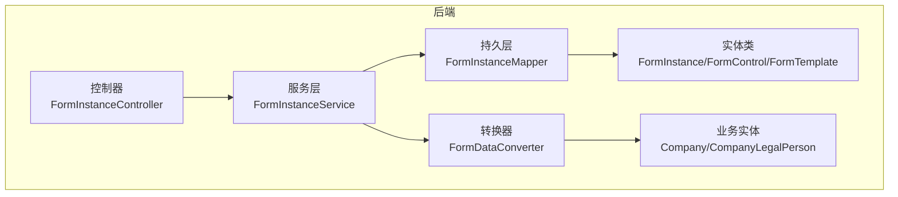
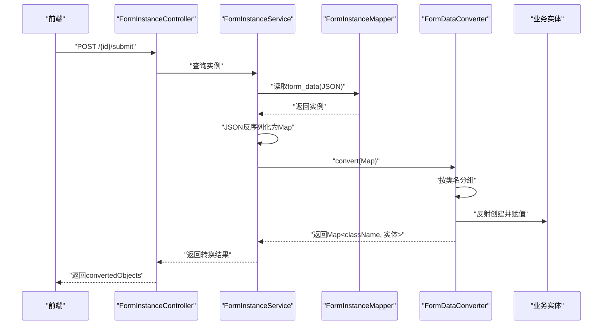
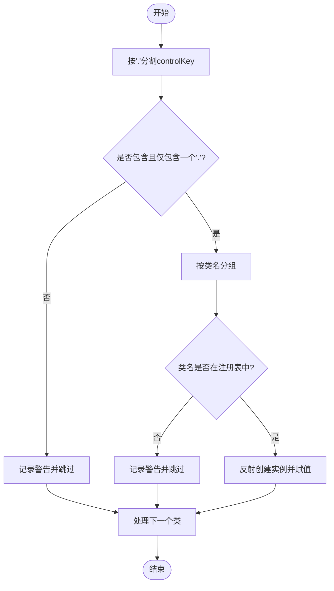
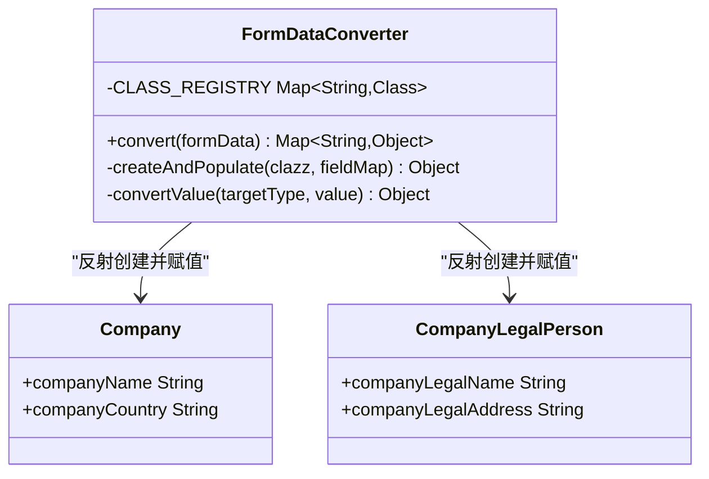

# 表单数据转换机制

<cite>
**本文档引用的文件**
- [VAT_EPR_动态表单技术方案.md](file://VAT_EPR_动态表单技术方案.md)
</cite>

## 目录
1. [简介](#简介)
2. [项目结构](#项目结构)
3. [核心组件](#核心组件)
4. [架构总览](#架构总览)
5. [详细组件分析](#详细组件分析)
6. [依赖关系分析](#依赖关系分析)
7. [性能考量](#性能考量)
8. [故障排查指南](#故障排查指南)
9. [结论](#结论)
10. [附录](#附录)

## 简介
本文件围绕VAT&EPR动态表单系统中的“表单数据转换机制”展开，重点阐述FormDataConverter的核心职责、实现原理与最佳实践。内容涵盖：
- controlKey命名规范（ClassName.fieldName）的设计理念与使用边界
- 按类名分组的数据处理流程
- 反射机制在实体类映射中的应用
- 类型转换方法convertValue对String、Integer、Long、Boolean、BigDecimal等基础类型的转换规则
- 异常处理策略与性能优化建议
- 完整的使用场景与代码示例路径

## 项目结构
后端采用Spring Boot + MyBatis-Plus架构，核心模块包含控制器、服务、持久层、实体类与转换器。FormDataConverter位于converter包中，负责将Map<controlKey, value>转换为按类名分组的实体对象Map。

图表来源
- [VAT_EPR_动态表单技术方案.md:777-813](file://VAT_EPR_动态表单技术方案.md#L777-L813)

章节来源
- [VAT_EPR_动态表单技术方案.md:777-813](file://VAT_EPR_动态表单技术方案.md#L777-L813)

## 核心组件
- FormDataConverter：将Map<controlKey, value>转换为Map<className, 实体对象>，支持按类名分组与反射赋值，并内置基础类型转换逻辑。
- 实体类：如Company、CompanyLegalPerson等，作为转换目标对象。
- 提交接口：解析form_data JSON，调用FormDataConverter完成转换，打印转换结果并更新状态。

章节来源
- [VAT_EPR_动态表单技术方案.md:594-728](file://VAT_EPR_动态表单技术方案.md#L594-L728)

## 架构总览
从提交流程看，FormDataConverter处于“数据解析—对象转换—业务流转”的关键节点，其职责是将前端传回的扁平化Map按controlKey进行类名分组，再通过反射为目标实体类注入字段值。

图表来源
- [VAT_EPR_动态表单技术方案.md:460-478](file://VAT_EPR_动态表单技术方案.md#L460-L478)
- [VAT_EPR_动态表单技术方案.md:705-728](file://VAT_EPR_动态表单技术方案.md#L705-L728)

## 详细组件分析

### FormDataConverter核心职责与实现原理
- 职责
  - 将Map<controlKey, value>按类名分组，形成Map<className, Map<fieldName, value>>
  - 通过反射创建目标类实例，并将对应字段值注入
  - 内置基础类型转换逻辑，确保目标字段类型与源值匹配
- 关键点
  - controlKey命名规范：ClassName.fieldName，用于标识实体类与字段
  - 类注册：通过CLASS_REGISTRY维护已知实体类映射
  - 分组策略：以“.”分割controlKey，取首段为类名
  - 反射策略：通过构造函数创建实例，通过字段名查找并设置值
  - 类型转换：convertValue统一处理String、Integer、Long、Boolean、BigDecimal等

章节来源
- [VAT_EPR_动态表单技术方案.md:594-728](file://VAT_EPR_动态表单技术方案.md#L594-L728)

### controlKey命名规范（ClassName.fieldName）
- 设计理念
  - 明确区分实体类与字段，便于按类名分组与反射定位
  - 与数据库control_key保持一致，确保前后端一致性
- 使用边界
  - 必须包含且仅包含一个“.”，否则会被跳过
  - 类名需在CLASS_REGISTRY中注册，否则会记录警告并忽略
- 示例
  - Company.companyName
  - CompanyLegalPerson.companyLegalName

章节来源
- [VAT_EPR_动态表单技术方案.md:39-65](file://VAT_EPR_动态表单技术方案.md#L39-L65)
- [VAT_EPR_动态表单技术方案.md:594-728](file://VAT_EPR_动态表单技术方案.md#L594-L728)

### 按类名分组的数据处理流程
- 步骤
  - 遍历formData，按“.”分割controlKey，提取类名与字段名
  - 将同属一类的所有键值对聚合到LinkedHashMap中，保证顺序
  - 对每个类名，从CLASS_REGISTRY中查找对应类
  - 通过反射创建实例并逐字段赋值
- 流程图

图表来源
- [VAT_EPR_动态表单技术方案.md:615-650](file://VAT_EPR_动态表单技术方案.md#L615-L650)

章节来源
- [VAT_EPR_动态表单技术方案.md:615-650](file://VAT_EPR_动态表单技术方案.md#L615-L650)

### 反射机制与实体类映射策略
- 实例创建
  - 通过无参构造函数创建目标类实例
- 字段访问
  - 通过getDeclaredField获取字段，setAccessible(true)允许访问私有字段
  - 逐字段调用convertValue进行类型转换后再赋值
- 错误处理
  - 未找到字段：记录警告并跳过该字段
  - 实例创建失败：抛出运行时异常，阻止不一致状态

章节来源
- [VAT_EPR_动态表单技术方案.md:652-671](file://VAT_EPR_动态表单技术方案.md#L652-L671)

### 类型转换方法convertValue实现细节
- 支持类型
  - String：直接返回字符串表示
  - Integer/int：解析为整数
  - Long/long：解析为长整数
  - Boolean/boolean：解析布尔值
  - BigDecimal：构造大十进制数
- 转换规则
  - null值：直接返回null
  - 目标类型与源类型一致：直接返回原值
  - 其他情况：先转为字符串，再按目标类型解析
- 注意事项
  - 非法字符串可能导致解析异常，应在上层捕获并提示用户
  - BigDecimal构造可能因格式问题抛出异常

章节来源
- [VAT_EPR_动态表单技术方案.md:673-683](file://VAT_EPR_动态表单技术方案.md#L673-L683)

### 示例实体类
- Company：包含companyName、companyCountry等字段
- CompanyLegalPerson：包含companyLegalName、companyLegalAddress等字段

章节来源
- [VAT_EPR_动态表单技术方案.md:687-703](file://VAT_EPR_动态表单技术方案.md#L687-L703)

### 提交接口逻辑
- 流程
  - 查询实例并解析form_data为Map
  - 调用FormDataConverter.convert完成转换
  - 打印转换结果日志
  - 更新实例状态为已提交
- 返回结构
  - convertedObjects：按类名分组的实体对象集合

章节来源
- [VAT_EPR_动态表单技术方案.md:705-728](file://VAT_EPR_动态表单技术方案.md#L705-L728)

## 依赖关系分析
- 组件耦合
  - FormDataConverter依赖CLASS_REGISTRY中的实体类映射
  - 提交接口依赖FormDataConverter与FormInstanceService
- 外部依赖
  - JSON解析：Jackson或Fastjson（示例中使用JSON.parseObject）
  - 日志：SLF4J
- 潜在风险
  - 类注册遗漏：导致字段被忽略
  - 反射权限：字段访问需允许setAccessible(true)，注意安全策略
  - 类型不匹配：convertValue无法解析时将回退为原值，可能引发后续业务异常

图表来源
- [VAT_EPR_动态表单技术方案.md:594-703](file://VAT_EPR_动态表单技术方案.md#L594-L703)

章节来源
- [VAT_EPR_动态表单技术方案.md:594-703](file://VAT_EPR_动态表单技术方案.md#L594-L703)

## 性能考量
- 分组与遍历
  - 单次遍历完成分组，时间复杂度O(n)，n为键值对数量
- 反射成本
  - 每个类创建实例与字段查找存在开销，建议：
    - 缓存Class对象与Field对象（可通过MethodHandles或缓存框架）
    - 限制实体类数量与字段数量，避免过度反射
- 类型转换
  - convertValue为O(1)操作，但字符串解析可能产生额外开销
- I/O与序列化
  - form_data为JSON字符串，解析与序列化为O(m)，m为JSON大小
- 并发与线程安全
  - CLASS_REGISTRY为静态Map，需确保线程安全（当前示例为静态初始化，只读）

章节来源
- [VAT_EPR_动态表单技术方案.md:615-683](file://VAT_EPR_动态表单技术方案.md#L615-L683)

## 故障排查指南
- 常见问题
  - controlKey格式错误：包含多个“.”或缺少“.”，将被跳过
  - 类名未注册：CLASS_REGISTRY中无对应类，记录警告并忽略该类
  - 字段不存在：目标类中无对应字段，记录警告并跳过该字段
  - 类型转换失败：convertValue无法解析字符串，可能抛出异常
  - 实例创建失败：无参构造函数缺失或访问受限，抛出运行时异常
- 排查步骤
  - 检查controlKey是否符合“ClassName.fieldName”
  - 确认实体类已在CLASS_REGISTRY中注册
  - 核对字段名与实体类字段是否一致
  - 验证前端传回的值是否符合目标类型（如数字、布尔、日期字符串）
  - 查看日志输出，定位具体失败位置
- 修复建议
  - 在新增实体类时同步注册到CLASS_REGISTRY
  - 在convertValue中增加更完善的异常分支与默认值处理
  - 对于复杂类型（如日期），建议在convertValue中增加格式校验与异常提示

章节来源
- [VAT_EPR_动态表单技术方案.md:615-683](file://VAT_EPR_动态表单技术方案.md#L615-L683)
- [VAT_EPR_动态表单技术方案.md:856-869](file://VAT_EPR_动态表单技术方案.md#L856-L869)

## 结论
FormDataConverter通过“controlKey命名规范 + 类名分组 + 反射赋值 + 基础类型转换”实现了动态表单数据到业务实体的高效转换。其设计简洁、扩展性强，适合多实体、多字段的动态表单场景。为确保稳定性与性能，建议完善类型转换策略、增强异常提示，并在新增实体时及时注册类映射。

## 附录
- 使用场景
  - 提交流程：前端提交formData，后端解析并调用convert完成对象转换
  - 模板发布：模板发布后禁止修改jsonSchema，避免实例数据错乱
  - 文件上传：Upload类型控件提交时value为文件URL列表，需配合文件服务
- 最佳实践
  - 严格遵守controlKey命名规范
  - 在CLASS_REGISTRY中注册所有业务实体
  - 对convertValue增加格式校验与异常提示
  - 对反射过程进行必要的权限与安全控制
  - 对高频转换场景引入缓存与批量处理

章节来源
- [VAT_EPR_动态表单技术方案.md:39-65](file://VAT_EPR_动态表单技术方案.md#L39-L65)
- [VAT_EPR_动态表单技术方案.md:705-728](file://VAT_EPR_动态表单技术方案.md#L705-L728)
- [VAT_EPR_动态表单技术方案.md:856-869](file://VAT_EPR_动态表单技术方案.md#L856-L869)