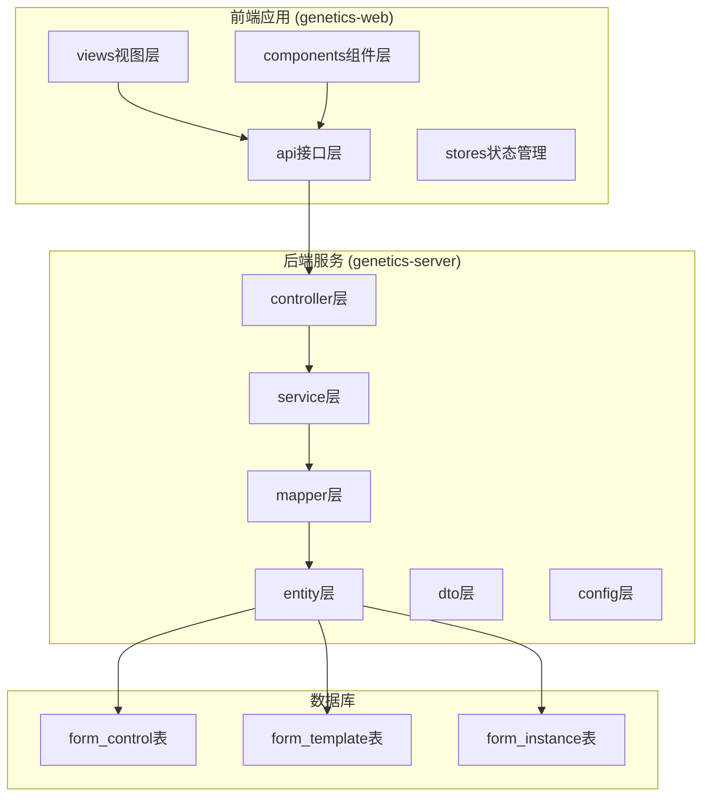
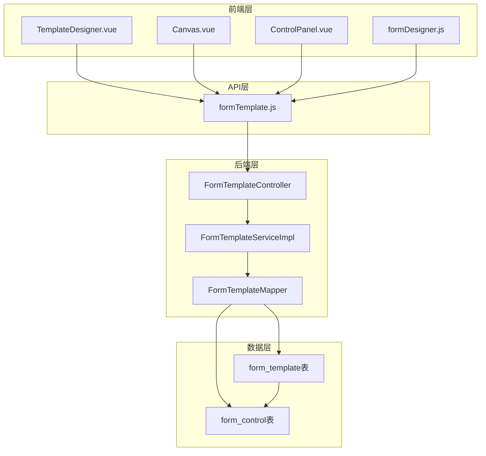
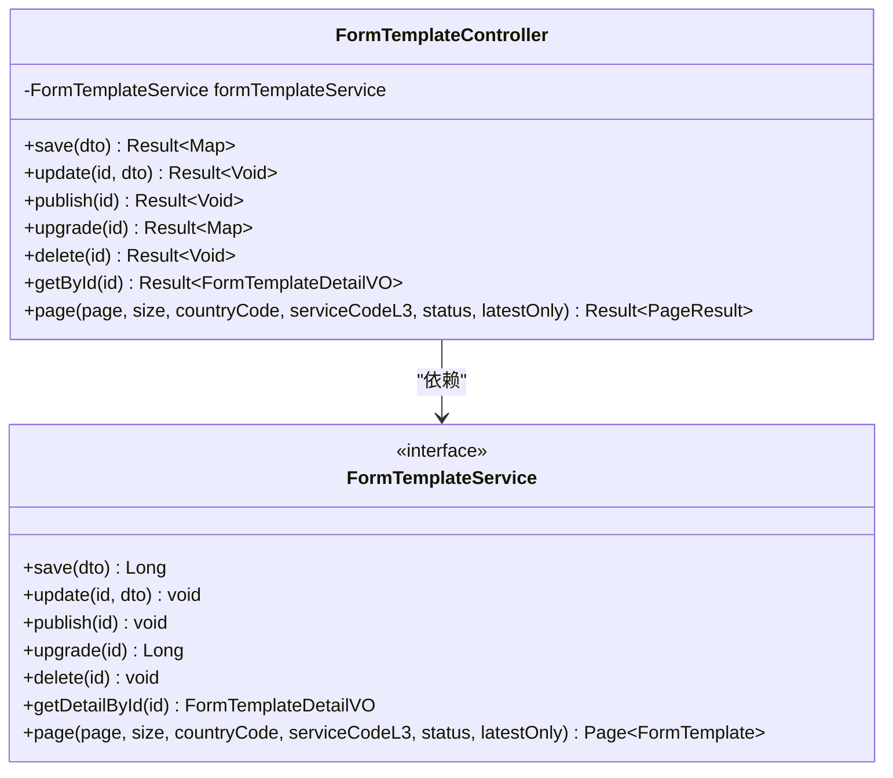
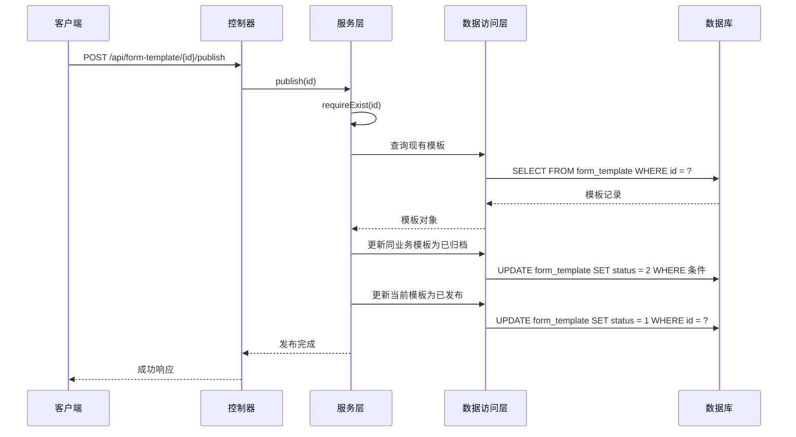
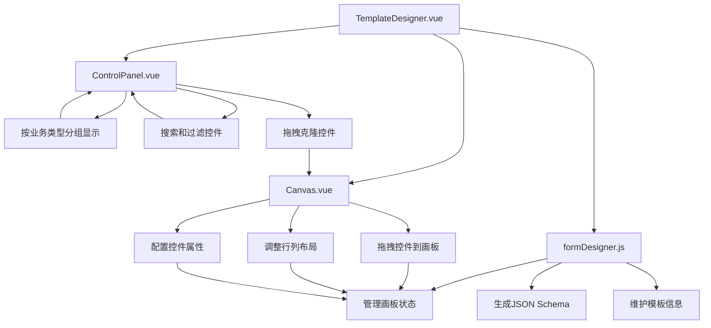
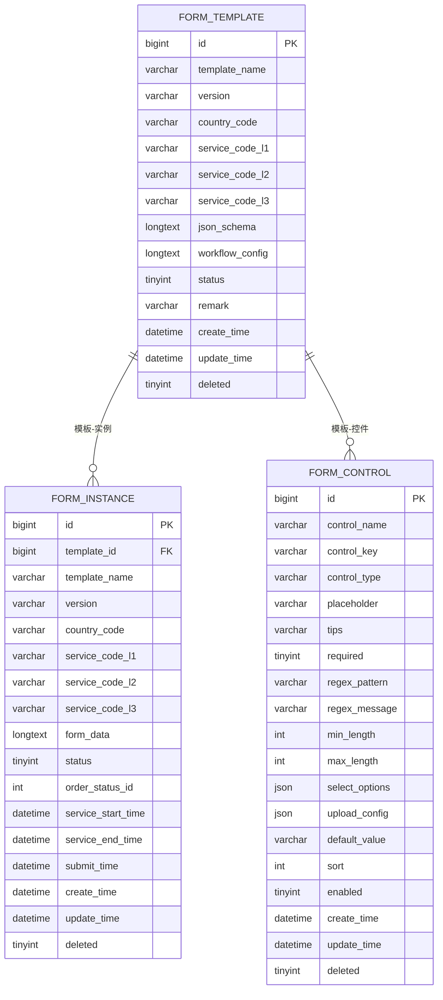
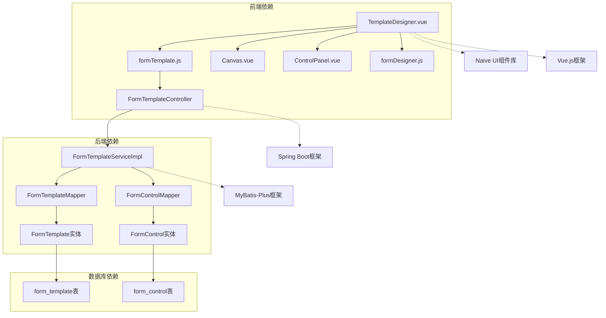

# 表单模板服务增强

<cite>
**本文档引用的文件**
- [FormTemplateController.java](file://genetics-server/src/main/java/com/genetics/controller/FormTemplateController.java)
- [FormTemplateServiceImpl.java](file://genetics-server/src/main/java/com/genetics/service/impl/FormTemplateServiceImpl.java)
- [FormTemplate.java](file://genetics-server/src/main/java/com/genetics/entity/FormTemplate.java)
- [FormTemplateDTO.java](file://genetics-server/src/main/java/com/genetics/dto/FormTemplateDTO.java)
- [FormTemplateDetailVO.java](file://genetics-server/src/main/java/com/genetics/dto/FormTemplateDetailVO.java)
- [FormTemplateMapper.java](file://genetics-server/src/main/java/com/genetics/mapper/FormTemplateMapper.java)
- [FormControl.java](file://genetics-server/src/main/java/com/genetics/entity/FormControl.java)
- [FormControlMapper.java](file://genetics-server/src/main/java/com/genetics/mapper/FormControlMapper.java)
- [001-init-schema.sql](file://genetics-server/src/main/resources/db/changelog/sql/001-init-schema.sql)
- [004-add-workflow-config.sql](file://genetics-server/src/main/resources/db/changelog/sql/004-add-workflow-config.sql)
- [TemplateDesigner.vue](file://genetics-web/src/views/template/TemplateDesigner.vue)
- [Canvas.vue](file://genetics-web/src/components/FormDesigner/Canvas.vue)
- [ControlPanel.vue](file://genetics-web/src/components/FormDesigner/ControlPanel.vue)
- [formTemplate.js](file://genetics-web/src/api/formTemplate.js)
- [formDesigner.js](file://genetics-web/src/stores/formDesigner.js)
</cite>

## 目录
1. [简介](#简介)
2. [项目结构](#项目结构)
3. [核心组件](#核心组件)
4. [架构概览](#架构概览)
5. [详细组件分析](#详细组件分析)
6. [依赖关系分析](#依赖关系分析)
7. [性能考虑](#性能考虑)
8. [故障排除指南](#故障排除指南)
9. [结论](#结论)

## 简介

表单模板服务增强是基因数据管理系统中的核心功能模块，主要负责服务单模板的设计、管理和发布。该系统通过前后端分离的架构，提供了可视化的表单设计器，支持多国家、多服务类型的表单模板创建和版本管理。

系统采用Spring Boot + Vue.js的技术栈，后端使用MyBatis-Plus进行数据库操作，前端使用Naive UI组件库构建用户界面。核心功能包括表单模板的创建、编辑、发布、版本升级以及与工作流配置的集成。

## 项目结构

整个项目采用标准的Maven多模块结构，分为后端服务(genetics-server)和前端应用(genetics-web)两个主要部分：

**图表来源**
- [FormTemplateController.java:1-71](file://genetics-server/src/main/java/com/genetics/controller/FormTemplateController.java#L1-L71)
- [TemplateDesigner.vue:1-149](file://genetics-web/src/views/template/TemplateDesigner.vue#L1-L149)

**章节来源**
- [FormTemplateController.java:1-71](file://genetics-server/src/main/java/com/genetics/controller/FormTemplateController.java#L1-L71)
- [TemplateDesigner.vue:1-149](file://genetics-web/src/views/template/TemplateDesigner.vue#L1-L149)

## 核心组件

表单模板服务的核心组件包括控制器层、服务层、数据访问层和实体模型层，形成了完整的MVC架构模式。

### 控制器层 (Controller Layer)
- **FormTemplateController**: 提供RESTful API接口，处理表单模板的CRUD操作
- 支持模板保存、更新、发布、升级、删除等操作
- 集成分页查询和条件筛选功能

### 服务层 (Service Layer)
- **FormTemplateServiceImpl**: 实现业务逻辑，包括模板版本管理、状态控制
- 提供模板详情构建、控件信息提取等核心功能
- 实现版本升级和发布策略

### 数据访问层 (Data Access Layer)
- **FormTemplateMapper**: MyBatis映射接口，处理模板数据的持久化
- **FormControlMapper**: 处理控件定义的数据访问
- 支持复杂的查询条件和分页操作

### 实体模型层 (Entity Layer)
- **FormTemplate**: 模板实体，包含模板基本信息和配置
- **FormControl**: 控件实体，定义各种表单控件的属性
- 支持JSON Schema存储和工作流配置

**章节来源**
- [FormTemplateController.java:1-71](file://genetics-server/src/main/java/com/genetics/controller/FormTemplateController.java#L1-L71)
- [FormTemplateServiceImpl.java:1-296](file://genetics-server/src/main/java/com/genetics/service/impl/FormTemplateServiceImpl.java#L1-L296)
- [FormTemplate.java:1-65](file://genetics-server/src/main/java/com/genetics/entity/FormTemplate.java#L1-L65)
- [FormControl.java:1-81](file://genetics-server/src/main/java/com/genetics/entity/FormControl.java#L1-L81)

## 架构概览

系统采用分层架构设计，前后端分离，通过RESTful API进行通信：

**图表来源**
- [TemplateDesigner.vue:1-149](file://genetics-web/src/views/template/TemplateDesigner.vue#L1-L149)
- [formTemplate.js:1-10](file://genetics-web/src/api/formTemplate.js#L1-L10)
- [FormTemplateController.java:1-71](file://genetics-server/src/main/java/com/genetics/controller/FormTemplateController.java#L1-L71)
- [FormTemplateServiceImpl.java:1-296](file://genetics-server/src/main/java/com/genetics/service/impl/FormTemplateServiceImpl.java#L1-L296)

系统的核心优势在于其灵活的表单设计器和强大的版本管理机制。前端使用Vue.js构建响应式界面，后端提供RESTful API支持，实现了高度解耦的架构设计。

**章节来源**
- [TemplateDesigner.vue:1-149](file://genetics-web/src/views/template/TemplateDesigner.vue#L1-L149)
- [formTemplate.js:1-10](file://genetics-web/src/api/formTemplate.js#L1-L10)
- [FormTemplateController.java:1-71](file://genetics-server/src/main/java/com/genetics/controller/FormTemplateController.java#L1-L71)

## 详细组件分析

### 表单模板控制器分析

FormTemplateController作为RESTful API的入口点，提供了完整的表单模板管理接口：

**图表来源**
- [FormTemplateController.java:1-71](file://genetics-server/src/main/java/com/genetics/controller/FormTemplateController.java#L1-L71)
- [FormTemplateServiceImpl.java:1-296](file://genetics-server/src/main/java/com/genetics/service/impl/FormTemplateServiceImpl.java#L1-L296)

控制器提供了以下核心功能：
- **模板保存**: 创建新的表单模板，返回模板ID
- **模板更新**: 修改现有模板，支持草稿状态下的编辑
- **模板发布**: 将草稿模板发布为正式版本，并自动归档同业务的旧版本
- **模板升级**: 基于现有模板创建新版本，保持原版本不变
- **模板删除**: 彻底删除模板记录
- **详情查询**: 获取模板详情，包含控件信息和工作流配置
- **分页查询**: 支持多条件筛选的模板列表查询

**章节来源**
- [FormTemplateController.java:25-70](file://genetics-server/src/main/java/com/genetics/controller/FormTemplateController.java#L25-L70)

### 表单模板服务实现分析

FormTemplateServiceImpl是业务逻辑的核心实现，提供了完整的模板生命周期管理：

**图表来源**
- [FormTemplateServiceImpl.java:58-74](file://genetics-server/src/main/java/com/genetics/service/impl/FormTemplateServiceImpl.java#L58-L74)

服务实现的关键特性包括：

#### 版本管理机制
- **版本升级**: 自动生成新版本号，支持语义化版本控制
- **草稿状态**: 新版本默认为草稿状态，不影响现有版本
- **版本归档**: 发布新版本时自动归档同业务的旧版本

#### 发布策略
- **业务一致性**: 同一模板名称、国家代码、服务代码的模板视为同一业务
- **状态转换**: 发布操作确保只有一个版本处于活跃状态
- **数据完整性**: 使用事务保证发布过程的数据一致性

#### 模板详情构建
- **控件提取**: 从JSON Schema中自动提取控件ID
- **批量查询**: 一次性查询所有相关控件信息
- **数据组装**: 将控件详情与模板信息组合为统一的VO对象

**章节来源**
- [FormTemplateServiceImpl.java:82-107](file://genetics-server/src/main/java/com/genetics/service/impl/FormTemplateServiceImpl.java#L82-L107)
- [FormTemplateServiceImpl.java:180-235](file://genetics-server/src/main/java/com/genetics/service/impl/FormTemplateServiceImpl.java#L180-L235)

### 前端表单设计器分析

前端表单设计器提供了直观的可视化编辑体验：

**图表来源**
- [TemplateDesigner.vue:1-149](file://genetics-web/src/views/template/TemplateDesigner.vue#L1-L149)
- [Canvas.vue:1-412](file://genetics-web/src/components/FormDesigner/Canvas.vue#L1-L412)
- [ControlPanel.vue:1-253](file://genetics-web/src/components/FormDesigner/ControlPanel.vue#L1-L253)
- [formDesigner.js:1-146](file://genetics-web/src/stores/formDesigner.js#L1-L146)

#### 画板布局系统
- **网格布局**: 支持1-4列的灵活布局
- **拖拽操作**: 使用vuedraggable实现直观的拖拽体验
- **响应式设计**: 自适应不同屏幕尺寸

#### 控件面板功能
- **业务分组**: 按公司信息、税务信息等业务类型组织控件
- **搜索过滤**: 支持按名称和Key搜索控件
- **图标标识**: 不同控件类型使用相应图标标识

#### 状态管理
- **模板信息**: 维护模板的基本信息和配置
- **画板状态**: 管理行、列、单元格的布局状态
- **实时同步**: 前端状态与后端数据实时同步

**章节来源**
- [TemplateDesigner.vue:59-82](file://genetics-web/src/views/template/TemplateDesigner.vue#L59-L82)
- [Canvas.vue:18-98](file://genetics-web/src/components/FormDesigner/Canvas.vue#L18-L98)
- [ControlPanel.vue:113-165](file://genetics-web/src/components/FormDesigner/ControlPanel.vue#L113-L165)

### 数据模型设计

系统采用关系型数据库设计，支持复杂的表单模板和控件管理：

**图表来源**
- [001-init-schema.sql:30-69](file://genetics-server/src/main/resources/db/changelog/sql/001-init-schema.sql#L30-L69)

#### 表结构特点
- **FORM_TEMPLATE**: 存储表单模板的元数据和配置信息
- **FORM_CONTROL**: 定义可复用的表单控件规范
- **FORM_INSTANCE**: 存储具体的表单实例数据

#### JSON Schema支持
- **动态布局**: 通过JSON Schema描述复杂的表单布局
- **控件引用**: 支持控件ID的引用和验证
- **扩展性**: 易于扩展新的控件类型和配置选项

**章节来源**
- [001-init-schema.sql:5-46](file://genetics-server/src/main/resources/db/changelog/sql/001-init-schema.sql#L5-L46)
- [FormTemplate.java:38-48](file://genetics-server/src/main/java/com/genetics/entity/FormTemplate.java#L38-L48)

## 依赖关系分析

系统各组件之间的依赖关系清晰明确，遵循了分层架构的最佳实践：

**图表来源**
- [TemplateDesigner.vue:48-50](file://genetics-web/src/views/template/TemplateDesigner.vue#L48-L50)
- [formTemplate.js:1-10](file://genetics-web/src/api/formTemplate.js#L1-L10)
- [FormTemplateController.java:1-71](file://genetics-server/src/main/java/com/genetics/controller/FormTemplateController.java#L1-L71)

### 技术栈依赖

#### 前端技术栈
- **Vue.js 3**: 提供响应式数据绑定和组件化开发
- **Naive UI**: 提供丰富的UI组件和设计系统
- **Pinia**: 现代化的状态管理方案
- **vuedraggable**: 支持拖拽操作的第三方库

#### 后端技术栈
- **Spring Boot**: 快速开发和部署的微服务框架
- **MyBatis-Plus**: 简化数据库操作的ORM框架
- **Jackson**: JSON序列化和反序列化的处理
- **Lombok**: 减少样板代码的注解处理器

### 数据流依赖

系统中的数据流向清晰，从前端界面到后端服务再到数据库存储：

1. **用户交互**: 用户通过前端界面进行表单设计和模板管理
2. **API调用**: 前端通过RESTful API与后端服务通信
3. **业务处理**: 后端服务层处理业务逻辑和数据验证
4. **数据持久化**: 数据访问层负责与数据库的交互
5. **状态反馈**: 服务层返回处理结果给前端展示

**章节来源**
- [formTemplate.js:1-10](file://genetics-web/src/api/formTemplate.js#L1-L10)
- [FormTemplateServiceImpl.java:33-50](file://genetics-server/src/main/java/com/genetics/service/impl/FormTemplateServiceImpl.java#L33-L50)

## 性能考虑

系统在设计时充分考虑了性能优化和可扩展性要求：

### 数据库性能优化
- **索引设计**: 在常用查询字段上建立适当索引，如模板名称、国家代码、服务代码等
- **分页查询**: 支持大数据量的分页查询，避免全表扫描
- **批量操作**: 批量查询控件信息，减少数据库往返次数

### 缓存策略
- **控件缓存**: 常用控件信息可以在内存中缓存，减少重复查询
- **模板缓存**: 最新版本的模板信息可以进行短期缓存
- **配置缓存**: 工作流配置等静态配置信息可以缓存

### 异步处理
- **大文件上传**: 支持异步文件上传和处理
- **批量导入**: 支持批量模板导入和处理
- **后台任务**: 可以将耗时的操作放入后台任务队列

### 前端性能优化
- **虚拟滚动**: 对于大量控件的场景，使用虚拟滚动提升渲染性能
- **懒加载**: 控件面板采用懒加载机制，只在需要时加载数据
- **状态压缩**: 前端状态管理采用高效的数据结构

## 故障排除指南

### 常见问题及解决方案

#### 模板发布失败
**问题描述**: 发布模板时报错，提示模板不存在或状态异常
**可能原因**:
- 模板ID不存在或已被删除
- 模板状态不是草稿状态
- 数据库连接异常

**解决步骤**:
1. 验证模板ID的有效性
2. 检查模板当前状态是否为草稿
3. 确认数据库连接正常
4. 查看服务器日志获取详细错误信息

#### 版本升级异常
**问题描述**: 调用升级接口后，新版本创建失败
**可能原因**:
- 原模板数据损坏
- 版本号格式不正确
- 数据库事务冲突

**解决步骤**:
1. 检查原模板数据的完整性
2. 验证版本号格式符合语义化版本规范
3. 查看数据库事务日志
4. 重试升级操作

#### 前端设计器卡顿
**问题描述**: 表单设计器响应缓慢，拖拽操作不流畅
**可能原因**:
- 控件数量过多导致渲染压力
- JSON Schema数据过大
- 浏览器性能不足

**解决步骤**:
1. 分批加载控件数据
2. 优化JSON Schema的序列化和反序列化
3. 考虑使用虚拟滚动技术
4. 检查浏览器性能监控数据

#### API调用失败
**问题描述**: 前端无法调用后端API接口
**可能原因**:
- CORS跨域配置问题
- 服务器端口被占用
- 网络连接异常

**解决步骤**:
1. 检查CORS配置是否正确
2. 验证服务器端口监听状态
3. 使用网络诊断工具检查连接
4. 查看服务器防火墙设置

**章节来源**
- [FormTemplateServiceImpl.java:42-50](file://genetics-server/src/main/java/com/genetics/service/impl/FormTemplateServiceImpl.java#L42-L50)
- [FormTemplateServiceImpl.java:82-107](file://genetics-server/src/main/java/com/genetics/service/impl/FormTemplateServiceImpl.java#L82-L107)

## 结论

表单模板服务增强功能为基因数据管理系统提供了强大而灵活的表单设计能力。通过前后端分离的架构设计，系统实现了高度的模块化和可扩展性。

### 主要优势

1. **可视化设计**: 直观的拖拽式表单设计器，降低了使用门槛
2. **版本管理**: 完善的版本控制机制，确保模板变更的可追溯性
3. **业务适配**: 支持多国家、多服务类型的灵活配置
4. **性能优化**: 采用多种优化策略，确保系统的高性能运行
5. **扩展性强**: 模块化设计便于功能扩展和定制开发

### 技术亮点

- **前后端分离**: 采用现代Web技术栈，提升开发效率和用户体验
- **JSON Schema**: 灵活的数据结构描述，支持复杂的表单布局
- **工作流集成**: 与业务工作流无缝集成，支持流程自动化
- **状态管理**: 使用Pinia进行高效的状态管理

### 发展建议

1. **监控告警**: 增加系统监控和告警机制，及时发现和解决问题
2. **测试覆盖**: 提高单元测试和集成测试覆盖率，确保代码质量
3. **文档完善**: 补充详细的API文档和技术文档
4. **性能测试**: 定期进行性能测试，优化系统瓶颈

该系统为基因数据管理提供了坚实的表单基础，通过持续的优化和改进，将更好地服务于业务发展需求。